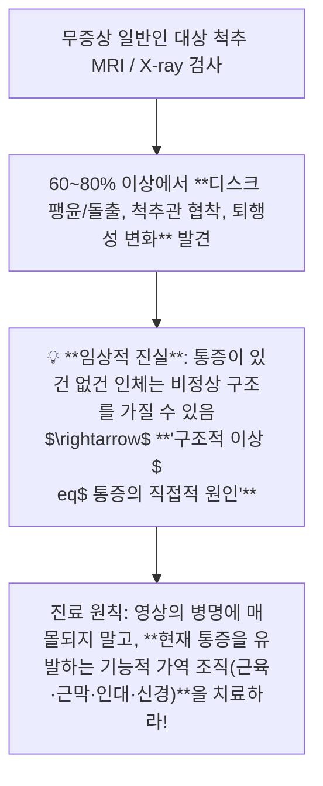
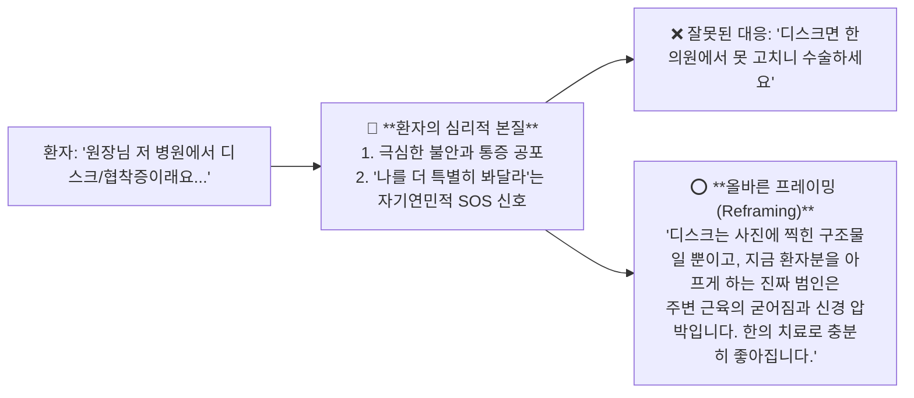

---
aliases:
  - 진료스킬강의
  - 정윤봉진료스킬
  - 영상의학불일치
  - 환자심리프레이밍
  - 근골격계라포형성
---
# 🩺 [[진료스킬]](Clinical Communication, Imaging Mismatch & Functional Pain Reframing)

> **핵심 요약 (Key Summary)**:
> MRI·X-ray 영상 의학적 이상 소견과 실제 임상 통증 사이의 **구조-증상 불일치(Imaging-Symptom Mismatch)** 및 환자의 심리적 기전을 총괄 분석하는 영역입니다.
> 디스크(HIVD)·협착증 등 중증 병명 호소 뒤에 숨은 **환자의 자기연민·불안 신호 해석과 질환명에 함몰되지 않는 기능적 연부조직(근막·신경·관절) 진료 프레이밍**을 규명합니다.
> 만성 통증 공포증(Kinesiophobia) 환자 안심 티칭, 라포 형성 및 침·약침·추나 치료 적응증 확립 표적을 제시합니다.

---

## 1. 영상 진단과 임상 통증의 구조-증상 불일치 (Imaging Mismatch)

---

## 2. 환자가 중증 병명을 강조하는 심리학적 기전과 술자의 대응

---

## 3. 진료실 실전 3단계 소통 & 치료 프로토콜

1. **1단계: 적극적 경청 & 감정적 수용**:
   * 환자가 가져온 진단명과 그동안 겪은 고통을 충분히 인정하고 공감함.
2. **2단계: 통증 프레이밍 전환 (구조 $\rightarrow$ 기능)**:
   * 마비나 대소변 장애(Red Flag)가 없는 한, 급성기를 지난 만성 디스크/협착증/OPLL은 **근막 긴장 완화와 신경 감압으로 90% 이상 호전**됨을 설명.
3. **3단계: 확신에 찬 단계적 치료 로드맵 제시**:
   * 침/약침(염증 및 근막 릴리즈) $\rightarrow$ 추나(관절 가동성 회복) $\rightarrow$ 한약(신경 재생 및 인대 강화).

---

## 🔗 관련 백링크 및 참고 문서
* **독립 임상 꿀팁**: [[ 환자의 중증 진단명(디스크·협착증) 호소 심리 분석 & 영상 소견 불일치와 기능적 연부조직 치료 프레이밍]]
* **임상 강의록 MOC**: [[00_강의록_MOC]]
* **연계 강의록**: [[근골격계 강의]], [[자침법]]