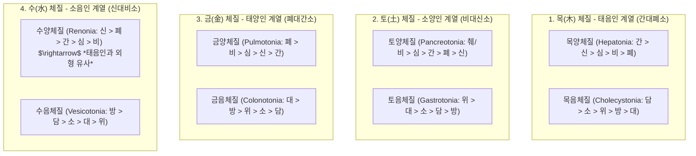
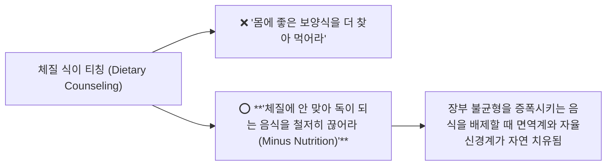

---
aliases:
  - 팔체질강의
  - 정윤봉팔체질
  - 체질식이티칭
  - 마이너스영양학
  - 8체질곡류육류
---
# 🩺 [[팔체질]](Eight Constitution Medicine, Organ Hyper/Hypoplasia & Negative Dietary Regimen)

> **핵심 요약 (Key Summary)**:
> 목(태음)·토(소양)·금(태양)·수(소음)의 **8대 장부 허실 배열(목양/목음, 토양/토음, 금양/금음, 수양/수음)과 체질 식이역학**을 총괄 분석하는 영역입니다.
> 백미의 전 체질 적합성과 **"맞는 것을 더 먹기보다 해로운 것을 끊어내는 마이너스 식이 티칭(Negative Nutrition)"** 원칙 및 곡류·단백질 매핑을 규명합니다.
> 체질 불일치성 소아 아토피/알레르기, 소양인 찹쌀/현미 금기, 소음인 보리/돼지고기 금기, 태음인 연변(묽은 변) 진료실 문진 표적을 확립합니다.

---

## 1. 팔체질 8대 분류와 4대 오행/사상 장부 대소

![[팔체질-20241016195205185.png]]
> [그림 설명: 팔체질 8대 장부 강약 배열 구조 및 사상의학 매핑]

---

## 2. 체질 식이 티칭의 제1철칙: 마이너스 영양학 (배제 원칙)

---

## 3. 체질별 곡류·음식 적합성 및 절대 금기 매트릭스

| 체질군 | 추천 유익 곡류 / 음식 | 🚫 **절대 금기 (반드시 끊어야 할 음식)** | 병리 기전 |
| :---: | :--- | :--- | :--- |
| **소양인 (토체질)** | **보리, 메밀, 메조, 녹두, 호밀, 돼지고기, 오리고기, 배추, 오이** | ❌ **현미, 찹쌀, 닭고기, 인삼, 꿀, 고추, 생강** | 이미 뜨거운 위열(胃熱)을 폭발시켜 상열감, 피부발진, 두통 유발 |
| **소음인 (수체질)** | **현미, 찹쌀, 옥수수, 닭고기, 양고기, 사과, 파, 마늘, 생강** | ❌ **보리, 메밀, 돼지고기, 맥주, 찬 빙과류, 찬 생야채** | 차가운 비위를 더욱 냉각시켜 소화불량, 만성 복통, 설사 유발 |
| **태음인 (목체질)** | **수수, 옥수수, 밀가루, 율무, 귀리, 쇠고기, 무, 도라지** | ❌ **메밀, 조개류, 게, 새우, 포도, 찬 맥주** | 약한 폐를 건조하게 하고 흡취지기를 방해하여 피부 가려움 유발 |
| **태양인 (금체질)** | **메밀, 메조, 녹두, 잎채소, 해산물, 포도, 다래** | ❌ **현미, 수수, 밀가루, 율무, 쇠고기, 마늘, 녹용** | 약한 간(肝)에 중성지방과 열을 쌓아 알레르기 및 만성 피로 유발 |

* **💡 전 체질 공통 중립 주식**: **백미(White Rice)** - 장부 편향이 없어 모든 체질에 안전.

![[팔체질-20241016200047172.png]]
> [그림 설명: 체질별 적합/부적합 음식 및 알레르기 유발 스펙트럼]

---

## 4. 진료실 실전 체질 문진 & 망진 비기

1. **태음인 대변 문진 팁**:
   * 태음인은 변비뿐만 아니라 장 흡수가 안 될 때 **묽은 변(연변)을 하루 2~3회** 보는 경우가 많음 $\rightarrow$ "설사하나요?"보다 **"변이 무르고 화장실을 자주 가나요?"**로 확인.
2. **생야채/샐러드 다이어트 부작용 환자 망진**:
   * 눈빛이 매섭고 날카로운 소음인/금체질 여성이 샐러드 다이어트를 하면 극심한 소화불량 및 복부 팽만 발생 $\rightarrow$ 익힌 채소와 따뜻한 단백질 티칭.
3. **소아 아토피/비염의 체질식 역추적**:
   * 이유식 시기부터 체질에 맞지 않는 육류(예: 태양인 아이에게 쇠고기/사골, 소양인 아이에게 닭고기)를 과식했을 때 만성 알레르기 비염과 아토피가 호발함.

---

## 🔗 관련 백링크 및 참고 문서
* **독립 임상 꿀팁**: [[ 팔체질 8대 장부 허실과 곡류·육류 배제 식이 티칭(Minus Nutrition) & 진료실 체질 문진 비기]]
* **임상 강의록 MOC**: [[00_강의록_MOC]]
* **연계 강의록**: [[동의수세보원]]