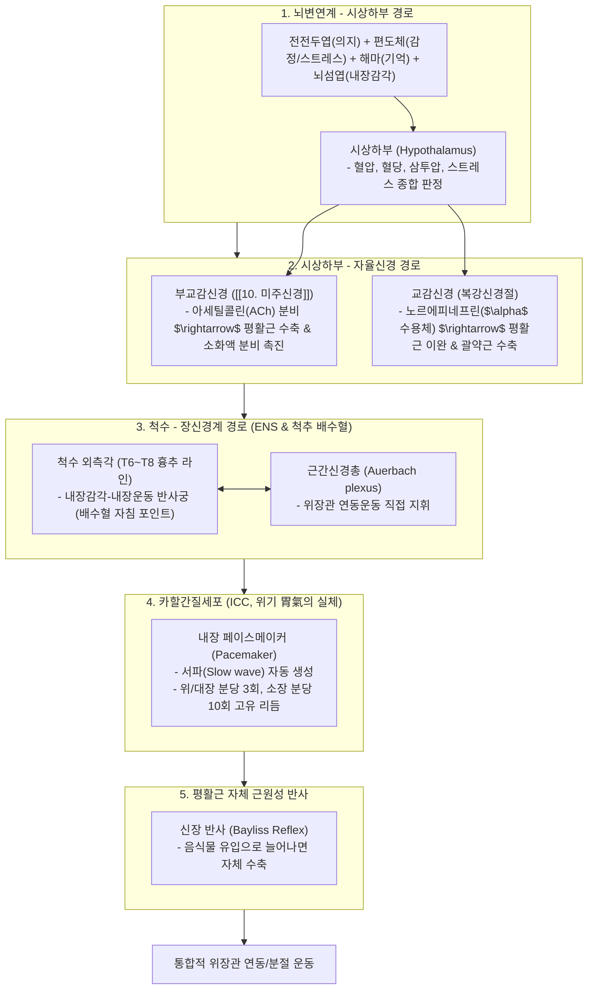
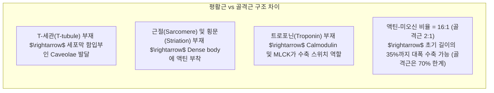
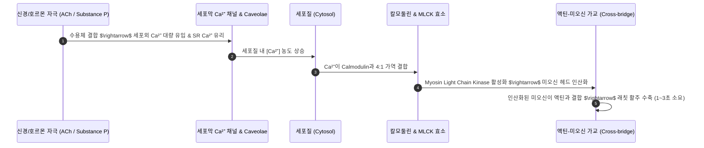

---
aliases:
  - 평활근메커니즘
  - 정윤봉평활근
  - 카할간질세포
  - 위장관자율신경조절
---
# 🩺 [[평활근 메커니즘]](Smooth Muscle Physiology, Enteric Nervous System & Visceral Motility)

> **핵심 요약 (Key Summary)**:
> 뇌변연계-시상하부, 자율신경계(미주신경 vs 교감신경), 척수-장신경계(ENS) 및 내장 페이스메이커인 **카할간질세포(ICC, 위기 胃氣의 생리학적 실체)**로 구성된 위장관 복잡계를 총괄 분석하는 영역입니다.
> $Ca^{2+}$-Calmodulin 복합체와 MLCK(Myosin Light Chain Kinase) 인산화 경로, 갭결합(Gap Junction) 합포체 동조 수축 및 **태음인(부교감 항진/평활근 톤업/식후설사) vs 소양인(교감 항진/평활근 톤다운/이완성 변비) 체질 병리**를 규명합니다.
> 기능성 소화불량, 과민대장증후군(IBS), 흉추 T6~T8 배수혈(위수·비수) 자침 및 사상체질별 장운동 조절 처방의 생체역학적 표적을 확립합니다.

---

## 1. 위장관 운동의 5대 계층 복잡계 네트워크 (Multi-level Control)

![[평활근 메커니즘-20240921122954388.png|430]]
> [그림 설명: 전전두엽-편도체-시상하부로 이어지는 상위 뇌 중추의 내장 운동 조절 축]

![[평활근 메커니즘-20240921123254219.png|393]]
> [그림 설명: 교감신경과 부교감신경(미주신경)의 위장관 상반 지배 경로]

![[평활근 메커니즘-20240921123704843.png|529]]
> [그림 설명: 척수 분절(T6~T8)과 장신경계(ENS)의 신경학적 배수혈 치료 라인]

![[평활근 메커니즘-20240921124221799.png|397]]
> [그림 설명: 카할간질세포(ICC)의 서파(Slow Wave) 페이스메이커 전위 형성]

![[평활근 메커니즘-20240921124356756.png|298]]
> [그림 설명: 위장관 평활근의 신장 수축 반사(Myogenic Stretch Reflex)]

![[평활근 메커니즘-20240921124459775.png|397]]
> [그림 설명: 위장관 점막의 호르몬 내분비 신호 네트워크 (가스트린, 세크레틴, CCK 등)]

---

## 2. 평활근의 생리학적 분류

### 💡 1) 긴장성(Tonic) vs 위상성(Phasic) 평활근
* **긴장성 평활근 (Tonic Smooth Muscle)**:
  * 평상시 항상 일정한 긴장도(Tone)를 유지하며 닫혀 있다가, 필요할 때 이완함.
  * 대표: **유문괄약근(Pyloric sphincter), 오디괄약근, 내항문괄약근, 혈관 평활근(50% 항시 수축)**.
* **위상성 평활근 (Phasic Smooth Muscle)**:
  * 평상시 이완되어 있다가 주기적으로 율동적 수축-이완을 반복함.
  * 대표: **위 체부/전정부, 소장·대장 장벽 평활근, 방광 배뇨근**.

![[평활근 메커니즘-20240921124747691.png|481]]
> [그림 설명: 긴장성(Tonic) 평활근과 위상성(Phasic) 평활근의 전위 및 수축 곡선 비교]

![[평활근 메커니즘-20240921125404705.png|437]]
> [그림 설명: 위장관 평활근의 10~20초 주기 서파 및 활동전위 중첩 수축]

### 💡 2) 단단위(Single-unit) vs 다단위(Multi-unit) 평활근
* **단단위 평활근 (합포체 평활근, Single-unit / Syncytial)**:
  * 세포 간 **간극결합(Gap junction)**으로 전기적으로 완벽히 연결됨.
  * 신경 말단에서 신경전달물질을 분무기(Varicosities)처럼 뿌려주면 한 세포의 탈분극이 전체로 도미노처럼 파급되어 단일 단위로 수축.
  * 대표: **위장관, 자궁, 방광, 소동맥**.
* **다단위 평활근 (Multi-unit)**:
  * 각 세포가 독립적으로 신경 지배를 받아 정밀한 개별 제어 가능 (Gap junction 적음).
  * 대표: **모양체근, 홍채 조임근, 입모근(털세움근), 대동맥**.

![[평활근 메커니즘-20240921125718988.png|437]]
> [그림 설명: 단단위 평활근(간극결합 합포체)과 다단위 평활근(개별 신경지배) 구조 비교]

---

## 3. 평활근의 분자 해부학적 특성 (골격근과의 핵심 차이점)

![[평활근 메커니즘-20240921130211806.png|437]]
> [그림 설명: 평활근의 치밀체(Dense Body) 액틴 그물망 및 미오신 필라멘트 배열]

---

## 4. 평활근의 수축 및 이완 분자 생화학 메커니즘

* **수축/이완 시간 특성**:
  * 골격근: 최대 수축 0.1초 미만, 이완 순식간 (SR로 $Ca^{2+}$ 급속 회수).
  * 평활근: **수축 1~3초, 이완 5~10초** (세포질로 퍼진 $Ca^{2+}$를 세포막 $Ca^{2+}$-ATPase 및 $Na^+/Ca^{2+}$ 교환체로 퍼내야 하므로 완만하게 지속됨).

![[평활근 메커니즘-20240921131729671.png|471]]
> [그림 설명: 칼슘-칼모둘린-MLCK 경로에 의한 미오신 경쇄 인산화 수축 기전]

![[평활근 메커니즘-20240921132359301.png|466]]
> [그림 설명: MLC Phosphatase 및 세포외 칼슘 배출을 통한 평활근 이완 경로]

---

## 5. 사상체질별 평활근 긴장도(Tone)와 대변 병리 임상 매핑

| 사상체질 | 자율신경 기저 경향 | 평활근 기저 상태 | 주요 병증 및 대변 양상 | 임상 치법 및 표적 처방 |
| :---: | :--- | :--- | :--- | :--- |
| **태음인** | **부교감신경 우위 (과항진)** | **평활근 Tone-Up (과수축 경향)** | 식사 직후 바로 배변 신호, 신경성 복통, 과민대장증후군 설사형, 장경련 | 부교감 진정, 평활근 경련 완화 $\rightarrow$ [[조위승청탕]], [[열다한소탕]], [[갈근]] |
| **소양인** | **교감신경 우위 (과항진)** | **평활근 Tone-Down (이완성 무력)** | 장관 확장, 장무력증, 위하수, 배변 무력성 만성 변비, 복부 팽만 | 교감 억제, 장관 진액 공급 및 연동 촉진 $\rightarrow$ [[양격산화탕]], [[지황백호탕]], [[생지황]] |
| **소음인** | **체온 저하 및 기혈 부족** | **혈류 부족성 평활근 경직** | 냉증성 소화불량, 이급후중, 찬 것 먹으면 설사 | 장관 혈류 확장 및 평활근 보온 $\rightarrow$ [[향사양위탕]], [[관계부자이중탕]], [[육계]] |

---

## 🔗 관련 백링크 및 참고 문서
* **독립 임상 꿀팁**: [[ 위장관 평활근 5대 조절계 & 카할간질세포(ICC·위기)와 배수혈 자침 메커니즘]]
* **임상 강의록 MOC**: [[00_강의록_MOC]]
* **연관 질환**: [[기능성 소화불량]], [[과민대장증후군]]
* **연관 처방**: [[조위승청탕]], [[양격산화탕]], [[향사양위탕]]
* **연관 본초**: [[갈근]], [[생지황]], [[육계]]