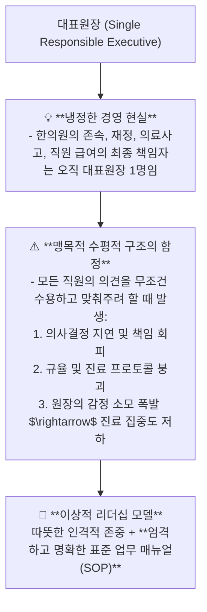

---
aliases:
  - 한의원운영강의
  - 정윤봉한의원경영
  - 조직관리리더십
  - 수평구조의함정
  - 한의원SOP경영
---
# 🩺 [[한의원 운영]](Clinic Management, Leadership Principles & Organizational Hierarchy Dynamics)

> **핵심 요약 (Key Summary)**:
> 의료기관의 최종 법적·재정적 책임을 지는 **대표원장의 단일 책임 구조와 맹목적 수평적 조직 문화의 한계**를 총괄 분석하는 영역입니다.
> 감정적 친밀함에 기댄 방임형 관리의 위험성과 **명확한 R&R(역할과 책임), 표준 업무 매뉴얼(SOP) 기반의 시스템 경영 원칙**을 규명합니다.
> 순천 한의원 개원 및 일일 다빈도 진료 체제에서 직원 이직률 최소화, 환자 접점 서비스 품질 표준화 및 원장의 진료 몰입도 극대화 표적을 확립합니다.

---

## 1. 한의원 경영의 본질과 대표원장의 단일 책임 원칙

---

## 2. 한의원 조직 관리 3대 핵심 성공 공식

### 💡 1) 명확한 직무 기술서 및 표준 업무 매뉴얼 (SOP) 구축
* 직원의 '센스'나 '기분'에 의존하지 않고, **[환자 접수 $\rightarrow$ 예진 $\rightarrow$ 베드 안내 $\rightarrow$ 전자침/물리치료 $\rightarrow$ 발침 $\rightarrow$ 수납/안내장 전달]**의 전 과정을 100% 매뉴얼화함.
* 신규 직원이 와도 3일 내에 원장이 원하는 퀄리티의 90%를 수행할 수 있는 시스템 구축.

### 💡 2) 사적 친밀함이 아닌 '프로페셔널한 상호 존중'
* 직원들과의 과도한 사적 관계는 피드백과 업무 지시를 주저하게 만듦.
* 업무 시간 중에는 완벽한 프로로서 상호 존칭을 사용하고, 약속된 규칙을 지키는 문화를 정착시킴.

### 💡 3) 원장의 진료 집중도(Zone) 사수
* 원장이 청소, 비품 구매, 잡무에 신경 쓰지 않고 **오직 환자 진단, 자침, 처방, 티칭에만 100% 몰입**할 수 있도록 데스크와 탕전실 업무를 철저히 위임하고 결과로 평가함.

---

## 🔗 관련 백링크 및 참고 문서
* **독립 임상 꿀팁**: [[ 한의원 조직 관리와 대표원장 리더십 & 맹목적 수평 구조의 함정과 표준 SOP 경영 공식]]
* **임상 강의록 MOC**: [[00_강의록_MOC]]
* **연계 프로젝트**: [[A-2_Clinic_Workflow_Automation]], [[A-3_Clinic_Protocol_Engine]]