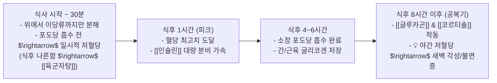
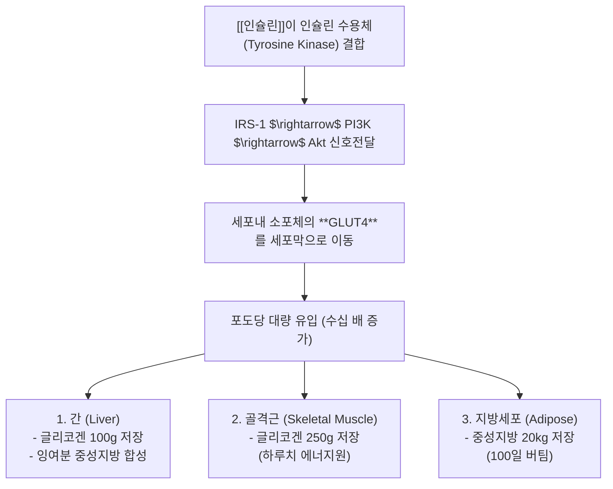
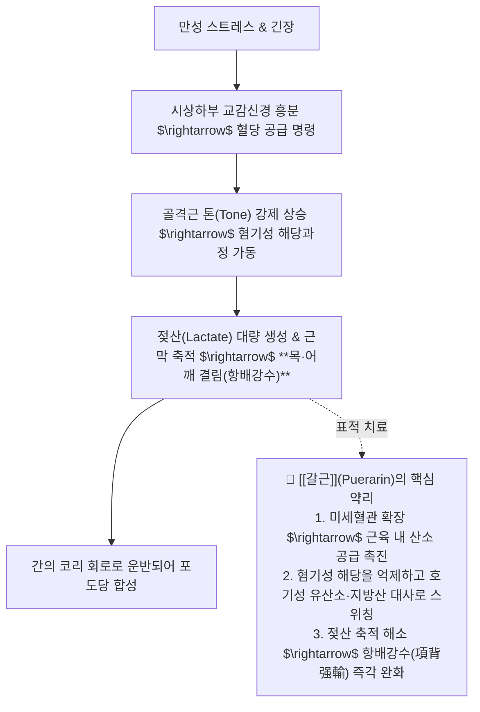

---
aliases:
  - 혈당메커니즘
  - 정윤봉혈당
  - 인슐린글루카곤
  - 야간저혈당불면
  - 갈근코리회로
---
# 🩺 [[혈당]](Glucose Homeostasis, Insulin-Glucagon Axis & Stress Metabolic Dynamics)

> **핵심 요약 (Key Summary)**:
> 섭취 후 위장관 흡수 시차(0~4시간)와 **공복기(식후 8시간 이후)의 인슐린-글루카곤-코르티솔-아드레날린 4대 조절 축**을 총괄 분석하는 영역입니다.
> GLUT4 수용체 포도당 유입, 코리 회로(Cori Cycle) 젖산 대사, **스트레스 시 젖산 축적성 근경결에 대한 [[갈근]](Puerarin)의 유산소 대사 촉진 약리 및 야간 저혈당성 새벽 불면증**을 규명합니다.
> 당뇨병성 인슐린 저항성, 자율신경실조증, 식후 나른함(육군자탕), 태음인 비만/지방간(열다한소탕) 및 소양인 공복 번갈(양격산화탕)의 임상 표적을 확립합니다.

---

## 1. 식후 시간대별 혈당 동역학 (Glucose Dynamics Timeline)

* **혈당 기본 스펙**:
  * 정상 공복 혈당: 70~100 mg/dL (혈액 전체 내 혈당 총량은 약 **3g**에 불과함).
  * 1일 기초대사량(1500~2400 kcal) 기준 시간당 약 25g의 포도당 소모.

![[Pasted image 20240308014514.png]]
> [그림 설명: 탄수화물 섭취 후 시간대별 혈중 포도당 농도 및 인슐린 분비 곡선]

![[Pasted image 20240308014759.png]]
> [그림 설명: 식후 상태(Fed State)와 공복 상태(Fasting State)의 대사 스위칭]

---

## 2. 혈당 강하 3대 시스템: [[인슐린]] 분비 제어망

1. 췌장 $\beta$-세포의 직접 감지: 포도당이 GLUT2를 통해 유입 $\rightarrow$ ATP 상승 $\rightarrow$ $K_{ATP}$ 채널 폐쇄 $\rightarrow$ 탈분극 $\rightarrow$ $Ca^{2+}$ 유입 $\rightarrow$ [[인슐린]] 개구 분비.
2. **시상하부 - [[부교감신경]] 경로**: 식사 중 편안한 자율신경 톤이 미주신경을 통해 인슐린 분비 촉진.
3. **위장관 인크레틴([[Incretin]], GLP-1/GIP) 경로**: 음식물이 십이지장/회장에 닿으면 즉각 분비되어 췌장 자극 (양방 DPP-4 억제제의 타깃이자 한방 소화제 건비약의 작용점).

![[Pasted image 20240308021223.png]]
> [그림 설명: 췌장 베타세포의 포도당 감지 및 인슐린 분비 분자 메커니즘]

![[Pasted image 20240308021322.png]]
> [그림 설명: 시상하부-미주신경(부교감) 축에 의한 인슐린 분비 촉진 회로]

![[Pasted image 20240308021545.png]]
> [그림 설명: 위장관 L세포의 인크레틴(GLP-1) 분비 및 췌장 인슐린 상호작용]

---

## 3. [[인슐린]]의 세포내 포도당 유입 & 3대 저장소

* **뇌와 적혈구의 특수성**:
  * 뇌세포와 적혈구는 인슐린에 의존하지 않는 **GLUT1, GLUT3**을 통해 항상성 있게 포도당을 섭취함.
  * **당뇨병의 본질**: 혈관 속에는 포도당이 넘치는데 인슐린 저항성으로 일반 체세포는 굶주리고, 과잉 포도당이 적혈구(당화혈색소 HbA1c)와 혈관내피, 말초신경세포를 산화 손상시키는 질환.

![[혈당-20241010092259061 1.jpg]]
> [그림 설명: 인슐린 신호전달에 의한 GLUT4 세포막 융합 및 포도당 유입 과정]

![[혈당-20241010092537210 1.jpg]]
> [그림 설명: 간, 골격근, 지방조직의 글리코겐 및 지방 저장 용량 비교]

---

## 4. 공복기 혈당 상승 5대 반대조절 시스템 (Counter-regulatory System)

| 조절 축 | 주요 호르몬 / 경로 | 작동 메커니즘 및 생화학 경로 | 임상 증상 및 특징 |
| :---: | :--- | :--- | :--- |
| 1 | [[글루카곤]] (Glucagon) | 췌장 $\alpha$-세포 분비 $\rightarrow$ 간 글리코겐 분해 및 당신생 | 저장된 당을 혈중으로 방출 (근육 글리코겐은 방출 불가) |
| 2 | 시상하부 - [[교감신경]] | 뇌 저혈당 감지 $\rightarrow$ 교감신경 흥분 $\rightarrow$ 글루카곤 분비 촉진 | 공복 시 맥박 상승, 안절부절못함 |
| **3** | **아드레날린 (SAM 축)** | 부신수질에서 에피네프린 분비 $\rightarrow$ 급속 글리코겐 분해 | **배고플 때 극도로 예민해짐(Hangry), PMS 증후군** |
| 4 | [[코르티솔]] (HPA 축) | 부신피질에서 분비 $\rightarrow$ 체단백질/지방을 갈아서 당신생 | 만성 스트레스 시 근감소, 탈모, 손톱 연약, 피부 얇아짐 |
| **5** | **코리 회로 (Cori Cycle)** | 근육의 무산소 해당 젖산 $\rightarrow$ 혈액 $\rightarrow$ 간에서 포도당 재생 | 근육 톤 상승으로 인한 젖산 축적 및 뻐근함 |

![[혈당-20241010093907303 1.jpg]]
> [그림 설명: 글루카곤에 의한 간 글리코겐 분해 및 당신생 작용 경로]

![[혈당-20241010094352799 1.jpg|289]] ![[혈당-20241010094716737 1.jpg|328]]
> [그림 설명: HPA 축 활성화에 따른 코르티솔 분비 및 말초 단백질 분해 기전]

![[혈당-20241010094949066 1.jpg|397]]
> [그림 설명: 부신피질 코르티솔과 부신수질 아드레날린의 이중 혈당 방어망]

![[혈당-20241010105917232 1.jpg|508]]
> [그림 설명: 아미노산, 젖산, 글리세롤을 기질로 사용하는 간의 당신생(Gluconeogenesis) 회로]

---

## 5. 스트레스성 근경결과 [[갈근]](Puerarin)의 분자생리학적 약리

---

## 6. 사상체질별 혈당 대사 병리 및 처방 매핑

| 사상체질 | 혈당 조절 대사 특성 | 병리적 취약점 | 대표 처방 및 임상 치법 |
| :---: | :--- | :--- | :--- |
| **태음인** | **인슐린 저장 기능 최고**, 글루카곤/코르티솔 방출 스위치 둔마 | 과영양, 비만, 인슐린 저항성, 지방간, 대사증후군 다발 | 간열을 내리고 배설 대사 촉진 $\rightarrow$ [[열다한소탕]], [[조위승청탕]], [[갈근]] |
| **소양인** | **공복 시 교감신경·코르티솔 과항진**, 당신생 과다 | 공복 불면, 신경과민, 번갈, 당뇨병성 소모열(소갈증) | 흉격열을 식히고 진액 보충 $\rightarrow$ [[양격산화탕]], [[지황백호탕]], [[석고]] |
| **소음인** | **소화흡수 및 대사 전반 저하**, 인슐린/글루카곤 반응 둔화 | 식후 저혈당 나른함, 수족냉증, 기혈허약, 소화불량 | 비위를 보하고 기초대사 촉진 $\rightarrow$ [[사군자탕]], [[육군자탕]], [[인삼]] |

---

## 🔗 관련 백링크 및 참고 문서
* **독립 임상 꿀팁**: [[ 야간 저혈당성 새벽 불면증 감별 & 스트레스 근경결(젖산 축적)과 갈근(葛根)의 지방산 대사 약리]]
* **임상 강의록 MOC**: [[00_강의록_MOC]]
* **연관 질환**: [[당뇨병]], [[불면증]], [[자율신경 실조증]]
* **연관 처방**: [[육군자탕]], [[열다한소탕]], [[양격산화탕]]
* **연관 본초**: [[갈근]], [[인삼]], [[석고]]