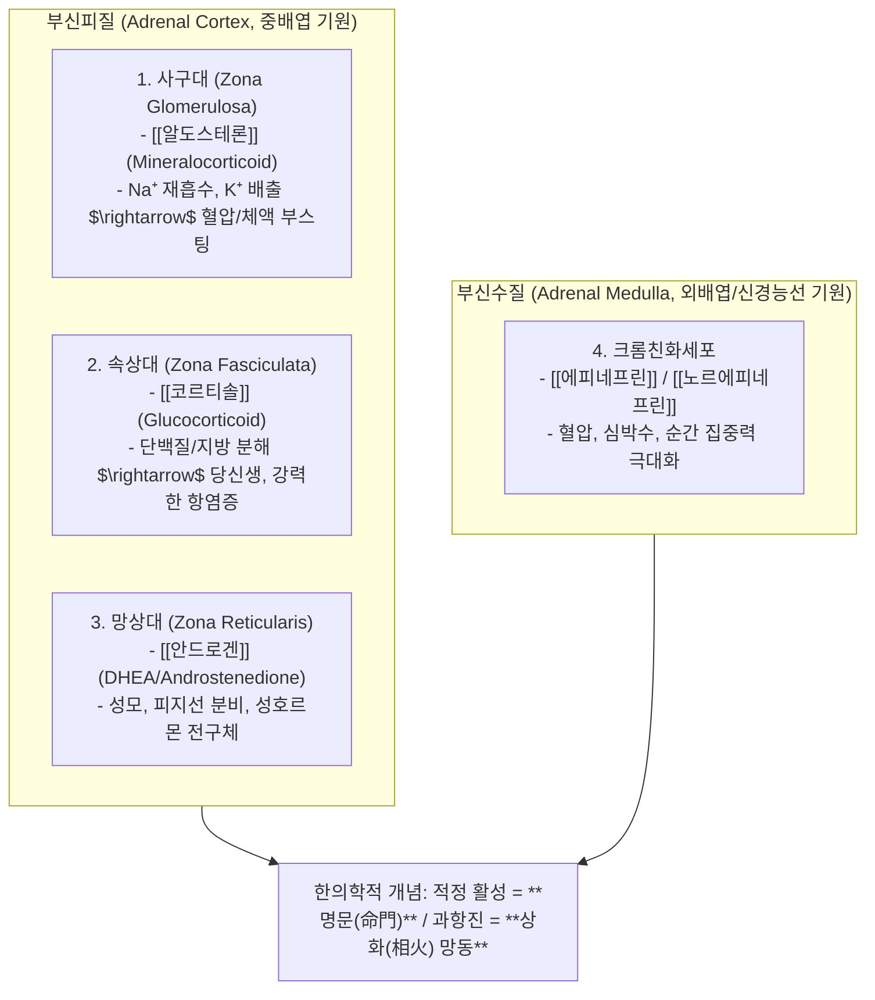
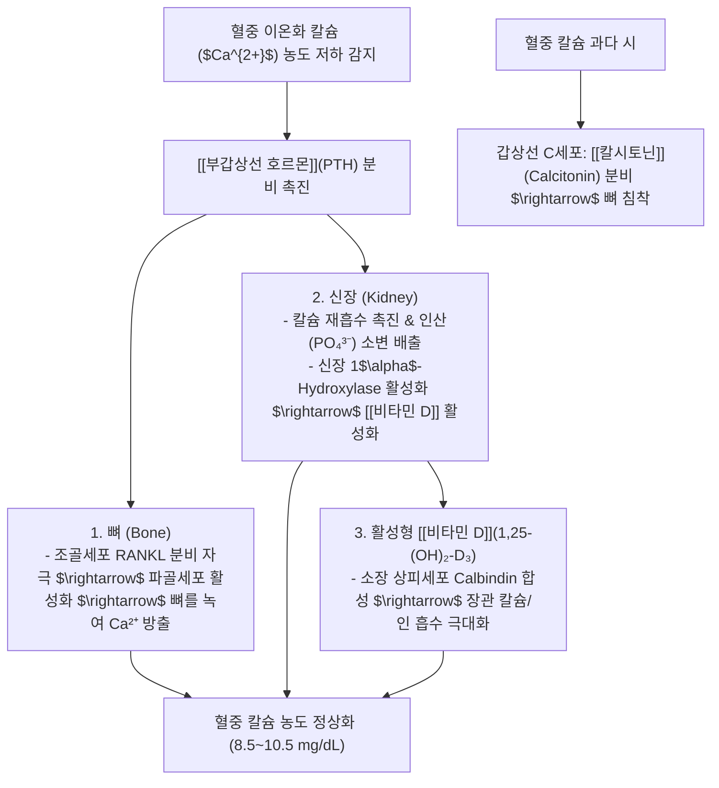
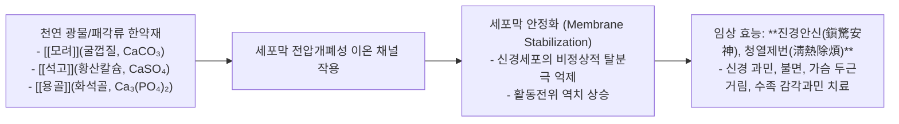

---
aliases:
  - 호르몬강의
  - 정윤봉호르몬
  - 부신피질3층
  - 칼슘대사호르몬
  - 모려석고용골약리
---
# 🩺 [[호르몬 강의]](Endocrine Physiology, Adrenal Cortex Axis & Calcium Homeostasis)

> **핵심 요약 (Key Summary)**:
> 부신피질 3대 층(사구대: [[알도스테론]], 속상대: [[코르티솔]], 망상대: [[안드로겐]])과 부신수질(에피네프린)의 내분비 제어망 및 **한의학 명문(命門)·상화(相火)의 생리학적 실체**를 총괄 분석하는 영역입니다.
> 혈중 이온화 칼슘($Ca^{2+}$) 항상성을 조절하는 **비타민 D-부갑상선호르몬(PTH)-칼시토닌 3대 축**과 골다공증 병태생리 및 신경 감각과민(수족냉증·저림)의 칼슘 역치 기전을 규명합니다.
> 쿠싱증후군/부신피로, 저칼륨혈증성 근경련, 골다공증, **신경막 안정화 천연 칼슘 제제인 [[모려]]·[[석고]]·[[용골]]의 진경·안신(鎭驚安神) 약리** 표적을 확립합니다.

---

## 1. 부신(Adrenal Gland)의 3대 피질대 & 수질 내분비 구조

![[부신피질 호르몬-20241008101005934.jpg]]
> [그림 설명: 부신피질 사구대, 속상대, 망상대 및 부신수질의 계층별 분비 호르몬]

![[부신피질 호르몬-20241008100906221.jpg]]
> [그림 설명: 콜레스테롤로부터 알도스테론, 코르티솔, 테스토스테론이 합성되는 스테로이드 생합성 경로]

---

## 2. 부신피질 3대 호르몬의 생리 및 병태생리

### 💡 1) [[알도스테론]](사구대)과 전해질 불균형
* **작용**: 신장 원위세뇨관과 집합관에서 $Na^+$ 재흡수 촉진 $\rightarrow$ 물을 끌어당겨 혈압 상승.
* **병리 (저칼륨혈증)**: $Na^+$ 1분자를 재흡수할 때 양이온 균형을 위해 $K^+$와 $H^+$를 소변으로 배출함 $\rightarrow$ **저칼륨혈증 유발 시 근력 약화, 근육 경련, 마비성 장폐색, 부정맥, 심정지 위험**.
* **소양인 상화망동(相火妄動)**: 땀을 과도하게 흘려 신장 혈류가 줄어들면 알도스테론이 과분비되어 상열하한 및 혈압 급상승 유발.

### 💡 2) [[코르티솔]](속상대)과 만성 스트레스
* **작용**: 당신생 촉진(혈당 상승), 면역세포 및 염증성 사이토카인 전면 억제.
* **과다 분비 / 장기 스테로이드 복용**:
  * 사지 근육과 피부 단백질을 분해하여 복부 지방으로 축적 $\rightarrow$ [[쿠싱 증후군]](중심성 비만, 문페이스, 들소혹, 피부 얇아짐, 멍 잘 듦).
  * 장기 복용 시 HPA 축 음성 피드백으로 부신이 위축되어 **부신 피로 증후군(Adrenal Fatigue)** 발생.

![[부신피질 호르몬-20241008102607991.jpg]]
> [그림 설명: ACTH에 의한 코르티솔 분비 제어 및 말초 단백질 분해 기전]

![[부신피질 호르몬-20241008104007856.jpg]]
> [그림 설명: 코르티솔의 면역 억제, 항염증 및 전신 대사 작용망]

---

## 3. 혈중 칼슘($Ca^{2+}$) 조절 3대 호르몬 네트워크

![[호르몬 강의-20241008141524485.jpg]]
> [그림 설명: 혈중 칼슘의 3대 형태 - 단백질 결합형(41%), 복합체형(9%), 활성 이온화 칼슘(50%)]

![[호르몬 강의-20241008142401550.jpg]]
> [그림 설명: 피부 자외선 노출 $\rightarrow$ 간 $\rightarrow$ 신장을 거치는 비타민 D 3단계 활성화 경로]

![[호르몬 강의-20241008143458502.jpg]]
> [그림 설명: 부갑상선 호르몬(PTH)과 비타민 D의 상호 피드백 및 뼈 재형성 회로]

![[호르몬 강의-20241008144306742.jpg]]
> [그림 설명: 신장에서 PTH의 인산 배출 및 칼슘 재흡수 수송체 메커니즘]

---

## 4. 한방 천연 칼슘 제제([[모려]]·[[석고]]·[[용골]])의 분자약리

### 📌 진료실 핵심 감별 팁: "손발이 시리고 저려요"
* 환자가 손발이 시리다고 호소할 때, 혈액순환 장애뿐만 아니라 **혈중 이온화 칼슘 저하로 인한 말초 감각신경 역치 저하(과민화)**를 의심해야 함.
* 소화 흡수 장애, 만성 설사, 신장 질환으로 칼슘 흡수가 안 되면 신경이 과흥분되어 찬 자극을 극도로 예민하게 느낌 $\rightarrow$ **비위 소화기능 개선 및 [[모려]], [[용골]], [[시호가용골모려탕]] 처방으로 신경 과민을 진정**.

---

## 🔗 관련 백링크 및 참고 문서
* **독립 임상 꿀팁**: [[ 부신 3층 피질(명문·상화) 생리와 칼슘 대사 3대 호르몬(비타민D·PTH·칼시토닌) & 모려·석고·용골의 진경 안신 약리]]
* **임상 강의록 MOC**: [[00_강의록_MOC]]
* **연관 처방**: [[시호가용골모려탕]], [[계지가용골모려탕]], [[백호탕]]
* **연관 본초**: [[모려]], [[석고]], [[용골]], [[감초]]