# [[소화성궤양]]에서의 H2차단제 쇠퇴

📌 **한 줄 요약 (TL;DR)**: 과거 소화성 궤양 치료의 주역이었던 H2 수용체 길항제는 지속 복용 시 1~2주 내에 산 억제력이 급감하는 내성(Tachyphylaxis)과 프로톤 펌프 최종 경로를 차단하지 못하는 기전적 한계, 그리고 2020년 라니티딘의 NDMA 불순물 퇴출 사태로 인해 PPI와 P-CAB에 1차 치료제 지위를 내주었으며, 현재는 경증 속쓰림의 필요시(PRN) 투여나 야간 산 분비 돌파 억제 등 보조적 브릿지 치료로 한정되어 사용된다.

---

## 📸 1. 시각적 요약

```mermaid
flowchart TD

    subgraph MechLimit["1. H2차단제의 약리학적 한계"]

        Histamine["히스타민 (H2 경로)"] -->|H2차단제 차단| Parietal["위벽세포"]

        Gastrin["가스트린 경로"] --> Parietal

        ACh["아세틸콜린 경로"] --> Parietal

        Parietal --> ProtonPump["프로톤 펌프 (최종 산분비 단계)"]

        ProtonPump --> Acid["위산 분비"]

        PPI_PCAB["PPI & P-CAB"] -.->|최종 단계 직접 차단| ProtonPump

    end

    subgraph DeclineReasons["2. H2차단제 쇠퇴의 3대 결정적 요인"]

        direction TB

        R1["1. 내성(Tachyphylaxis) 발생<br/>• 연속 투여 1~2주 만에 위산 억제력 급감 (장기 유지 곤란)"]

        R2["2. 질환 패러다임 변화<br/>• [[위식도역류질환]], NSAIDs 궤양, 헬리코박터 제균 등<br/>• 24시간 강력하고 지속적인 pH 상승 요구"]

        R3["3. 라니티딘 NDMA 발암물질 사태 (2020)<br/>• 시장 주력 약물 전면 회수 → PPI 처방 대세화"]

    end

    subgraph ModernRole["3. 현대 임상에서의 틈새 적응증"]

        direction TB

        Role1["신속한 효과 발현: 경증 속쓰림의 단기 필요시(PRN) 투여"]

        Role2["야간 산 분비 돌파(NAB) 억제: 취침 전 단기 병용"]

        Role3["PPI 중단 시 반동성 산과다 완충 테이퍼링 (브릿지 요법)"]

    end

    style MechLimit fill:#eff6ff,stroke:#3b82f6,stroke-width:2px

    style DeclineReasons fill:#fef2f2,stroke:#ef4444,stroke-width:2px

    style ModernRole fill:#f0fdf4,stroke:#22c55e,stroke-width:2px
```

---

## 🔑 2. 핵심 개념 및 원리

- **위산 분비 경로의 우회와 최종 경로(Final Common Pathway) 차단 부재**:  
  - 위벽세포는 히스타민(H2), 가스트린(CCK2), 아세틸콜린(M3) 세 가지 주요 자극을 통해 위산을 분비함.  
  - H2 차단제는 히스타민 신호만 차단하므로 가스트린이나 부교감신경 자극에 의한 산 분비를 완전히 차단하지 못함.  
  - 반면 PPI와 P-CAB은 최종 산 생성 펌프인 $H^+/K^+$-ATPase 효소를 직접 차단하므로 자극의 종류와 무관하게 24시간 동안 완벽한 산 억제가 가능함.  
- **내성(Tachyphylaxis / Tolerance)의 발생 기전**:  
  - H2 차단제를 지속 투여하면 위내 산 저하에 대한 음성 되먹임으로 혈중 가스트린이 증가하고, H2 수용체 상향 조절 및 세포 내 신호 전달계 변형이 발생함.  
  - 투여 7~14일 내에 위내 pH 유지 능력이 현저히 저하되어 만성 유지 요법으로 효과를 유지하기 어려움.  
- **분자 구조적 취약성과 라니티딘 NDMA 회수 사건**:  
  - 2019~2020년 전 세계적으로 다빈도 처방되던 라니티딘 원료 및 완제품에서 인체 발암 추정 물질인 N-니트로소디메틸아민(NDMA)이 기준치를 초과 검출되어 전면 판매 중지 및 회수됨.  
  - 이로 인해 임상 현장의 처방 대세가 PPI와 제네릭 약물로 완전히 재편됨.

**관련 질환 및 약물 키워드**: [[소화성궤양]], [[위궤양]], [[십이지장궤양]], [[위식도역류질환]], [[시메티딘]], [[라니티딘]], [[파모티딘]], [[라푸티딘]], [[테고프라잔]]

---

## 📝 3. 본문 내용 정리

### 1) H2차단제 vs PPI vs P-CAB 특성 비교

- **H2차단제([[파모티딘]], [[라푸티딘]])**:  
  - 장점: 빠른 흡수와 신속한 증상 완화, 식사 시간과 무관한 복용 편의성.  
  - 단점: 1~2주 내 급격한 내성 발생, 중증 미란성 식도염 치유율 저조.  
- **PPI (양성자 펌프 억제제)**:  
  - 장점: 강력하고 검증된 24시간 위산 억제, 궤양 치유율 우수.  
  - 단점: 식전 30~60분 복용 필수(활성화된 펌프에만 결합), 최대 효과 발현까지 3~5일 소요, CYP2C19 유전형 대사 편차.  
- **P-CAB (칼륨 경쟁적 위산분비억제제 - [[테고프라잔]] 등)**:  
  - 장점: 산 활성화 불필요, 첫날 첫 회 복용부터 즉각적인 최고 산 억제, 식사 무관 복용, 야간 산 분비 완벽 조절.

### 2) 진료실 처방 팁 (현대적 활용법)

- **야간 산 분비 돌파(NAB)의 취침 전 구조 요법**:  
  - 표준형 PPI를 아침에 복용하는 환자가 야간 흉통이나 산 역류를 호소할 때 취침 전 파모티딘 20mg을 단기간 병용. 단, 내성 방지를 위해 1~2주 이내 필요시에만 간헐적 투여 권고.  
- **PPI 중단 시 반동성 산 분비 예방**:  
  - PPI 장기 복용 후 반동성 속쓰림으로 약을 끊지 못하는 환자에게 H2차단제로 브릿지 전환 후 서서히 중단 유도.

---

## 💡 4. 임상 적용 및 실전 팁

### 1) 진료실 환자 티칭 포인트

- "이 약(파모티딘 등)은 복용 후 즉시 속쓰림을 가라앉히는 데는 매우 훌륭하지만, 매일 한 달 이상 계속 드시면 몸에서 내성이 생겨 약효가 크게 떨어집니다. 따라서 속이 쓰릴 때만 필요시 복용하시거나 단기간만 복용하시는 것이 가장 좋습니다."

### 2) 놓치면 안 되는 주의사항 및 Red Flags

- 🚨 **Red Flag 1: 중증 [[위식도역류질환]](LA grade C/D) 환자에 단독 처방 금기**: 식도 협착 및 바렛식도 위험이 높은 심한 식도염에는 H2차단제 단독으로 치유가 불가능하므로 반드시 PPI 또는 P-CAB 표준 요법을 시행해야 함.  
- 🚨 **Red Flag 2: 소염진통제([[아스피린]], NSAIDs) 궤양 고위험군**: 고령자, 궤양 병력자에서 NSAIDs 병용 시 H2차단제는 십이지장 궤양은 일부 예방하나 위궤양 예방 효과가 입증되지 않았으므로 PPI를 병용해야 함.

---

## ➕ 5. 보충 근거 (최신 지견)

- **H2차단제의 내성(Tachyphylaxis) 발생 기전 및 임상 고찰**:  
  - [Rapid development of tachyphylaxis with repeat dosing of H2-receptor antagonists (World J Gastrointest Pharmacol Ther 2014;5:57-62, PMC4023325)](https://pmc.ncbi.nlm.nih.gov/articles/PMC4023325/)  
  - 반복 투여 시 급성 위산 분비 억제 효과가 며칠 이내에 급격히 감소함을 임상 연구 데이터를 통해 증명하고 지속적 유지 치료의 한계를 제시함.  
- **라니티딘 제제의 NDMA 불순물 혼입 및 규제 회수**:  
  - [N-nitrosodimethylamine (NDMA) contamination of ranitidine products and regulatory recalls (J Food Drug Anal 2021;29:39-48, PMC9261846)](https://pmc.ncbi.nlm.nih.gov/articles/PMC9261846/)  
  - 라니티딘 분자 내 고유 구조적 특성으로 인한 NDMA 발생 기전 및 미국 FDA, 유럽 EMA, 한국 식약처의 판매 중단 조치 경과를 기술.  
- **미국소화기학회(ACG) 위식도역류질환 가이드라인 (2022)**:  
  - [ACG Clinical Guideline for the Diagnosis and Management of Gastroesophageal Reflux Disease (Am J Gastroenterol 2022;117:27-56, PMID: 34807007)](https://pubmed.ncbi.nlm.nih.gov/34807007/)  
  - 미란성 식도염의 치유 및 유지 요법에서 PPI의 확고한 1차 지위와 취침 전 H2RA의 단기적 야간 증상 보조 요법 권고안을 수록.

---

## Reference

- [H2 blocker의 멸망 - PPI와 P-CAB시대에 밀려난 이유 (내과 의사 기역)](https://www.youtube.com/watch?v=xNp5hK7UC7w)  
- [Rapid development of tachyphylaxis with repeat dosing of H2-receptor antagonists (World J Gastrointest Pharmacol Ther 2014;5:57-62, PMC4023325)](https://pmc.ncbi.nlm.nih.gov/articles/PMC4023325/)  
- [N-nitrosodimethylamine (NDMA) contamination of ranitidine products and regulatory recalls (J Food Drug Anal 2021;29:39-48, PMC9261846)](https://pmc.ncbi.nlm.nih.gov/articles/PMC9261846/)  
- [ACG Clinical Guideline for the Diagnosis and Management of Gastroesophageal Reflux Disease (Am J Gastroenterol 2022;117:27-56, PMID: 34807007)](https://pubmed.ncbi.nlm.nih.gov/34807007/)
