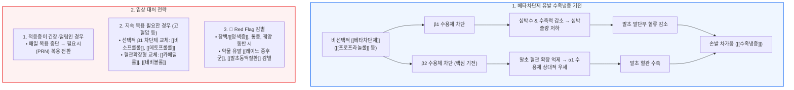

# [[베타차단제]]와 [[수족냉증]]

📌 **한 줄 요약 (TL;DR)**: [[베타차단제]](특히 비선택적인 [[프로프라놀롤]]) 복용 시 손발 차가움이 생기는 주원인은 심박출량 감소와 함께 말초 혈관의 β2 수용체 차단으로 인한 상대적 혈관 수축 때문이며, 증상이 심할 경우 필요시(PRN) 간헐 복용으로 전환하거나 선택적 β1 차단제([[비소프롤롤]]) 또는 혈관확장형 약제([[카베딜롤]], [[네비볼롤]])로 교체를 고려해야 한다.

---

## 📸 1. 시각적 요약

---

## 🔑 2. 핵심 개념 및 원리

- **β2 수용체 차단과 상대적 α1 혈관 수축**:  
  - 정상 상태에서 말초 골격근 혈관의 β2 수용체는 혈관을 확장시키는 역할을 담당함.  
  - 비선택적 베타차단제 투여 시 β2 매개 혈관 확장이 억제되면서, 상대적으로 교감신경의 α1 수용체 매개 혈관 수축 작용이 우세해져 말초 세동맥이 수축함.  
- **심박출량 저하로 인한 말초 순환 감소**:  
  - β1 차단으로 인해 심박수와 심근 수축력이 감소하여 전체 심박출량(Cardiac output)이 줄어들며, 이로 인해 심장에서 가장 먼 사지 말단부 혈류량이 감소함.  
- **약제별 선택성과 혈관 작용의 차이**:  
  - 비선택성 약제([[프로프라놀롤]])에서 가장 빈번하게 발생함.  
  - 심장 선택성이 높은 β1 차단제([[비소프롤롤]], [[메토프롤롤]])나 자체적인 혈관 확장 효과(α1 차단 또는 산화질소 분비)를 가진 3세대 약제([[카베딜롤]], [[네비볼롤]])는 말초 순환 장애 유발 가능성이 상대적으로 낮음.

**관련 질환 및 약물 키워드**: [[수족냉증]], [[베타차단제]], [[프로프라놀롤]], [[비소프롤롤]], [[카베딜롤]], [[네비볼롤]], [[레이노 증후군]]

---

## 📝 3. 본문 내용 정리

### 1) 약제 계열별 발생 경향 비교

- **비선택적 베타차단제 (1세대)**:  
  - [**[프로프라놀롤]**](http://인디놀): β1과 β2를 동시에 차단하므로 혈관 수축과 심박출량 저하가 겹쳐 수족냉증 발생 위험이 가장 높음.  
- **선택적 β1 차단제 (2세대)**:  
  - [**[비소프롤롤]**](http://콩코르)**, [[메토프롤롤]], [[아테놀롤]]**: β2 수용체 차단 효과가 미미하여 말초 혈관 수축 부작용이 상대적으로 덜함.  
- **혈관 확장형 베타차단제 (3세대)**:  
  - **[[카베딜롤]]**: α1 수용체를 직접 차단하여 말초 혈관을 확장시킴.  
  - **[[네비볼롤]]**: 혈관 내피세포에서 산화질소(NO) 생성을 촉진하여 혈관 확장을 유도함. 말초 혈류 보존에 가장 유리함.

### 2) 진료실 단계별 대처법

- **1단계: 복용 목적 재평가 및 PRN 전환**:  
  - 무대 공포증, 중요한 시험/발표 전 긴장, 본태성 떨림 등으로 처방받은 환자는 매일 상복할 필요가 없음.  
  - 프로프라놀롤은 작용 시작이 빠르고 반감기가 짧으므로, 필요할 때만 복용(PRN)하도록 지도하여 부작용 노출을 최소화함.  
- **2단계: 약제 교체(Switching)**:  
  - [[고혈압]]이나 [[부정맥]] 등으로 지속 복용이 반드시 필요한 환자라면 선택적 β1 차단제([[비소프롤롤]])나 혈관확장형 약제([[카베딜롤]], [[네비볼롤]])로 변경을 고려함.  
  - 개인차에 따라 약제 교체 후에도 냉감이 지속될 수 있으나 상당수 환자에서 증상이 경감됨.

---

## 💡 4. 임상 적용 및 실전 팁

### 1) 진료실 상담 노하우 (환자 티칭 포인트)

- **환자의 불안 해소**: "약이 심장 박동을 차분하게 해주고 혈관을 조금 조여주어 손발 끝으로 가는 피의 양이 일시적으로 줄어들어 생기는 흔한 증상입니다. 약이 작용하고 있다는 신호이기도 합니다."  
- **생활 요법 안내**: 실내외 온도차 주의, 보온 장갑 및 두꺼운 양말 착용, 카페인 및 흡연 제한(니코틴과 카페인은 말초 혈관 수축을 악화시킴).

### 2) 놓치면 안 되는 주의사항 및 Red Flags

- 🚨 **Red Flag 1: 단순 수족냉증 vs [[레이노 증후군]](Raynaud's phenomenon)**:  
  - 추위 노출 시 손가락이 하얗게(창백) 변했다가 파랗게(청색증) 변하고, 따뜻해지면 붉어지면서 심한 박동성 통증이나 감각 이상이 나타나는 경우.  
  - 베타차단제는 약물 유발성 레이노 현상의 주요 원인이므로, 이 경우 약물을 즉시 중단하거나 다른 계열(CCB 등)로 교체해야 함.  
- 🚨 **Red Flag 2: [[말초동맥질환]](PAD, Peripheral Artery Disease)**:  
  - 보행 시 종아리 통증(간헐적 파행), 발끝 궤양, 족배동맥 맥박 소실이 동반되는 경우 중증 말초동맥질환을 강력히 의심해야 하며, 비선택적 베타차단제는 금기에 준하여 투여를 피해야 함.

---

## ➕ 5. 보충 근거 (최신 지견)

- **유럽심장학회(ESC) 및 미국심장학회(AHA) 가이드라인**:  
  - 중증의 증상성 [[말초동맥질환]] 환자에게 비선택적 베타차단제는 말초 저항을 증가시켜 증상을 악화시킬 수 있으므로 권고되지 않으며, 적응증이 있는 경우 심장 선택성 β1 차단제([[비소프롤롤]]) 또는 혈관확장형 약제([[카베딜롤]], [[네비볼롤]])의 사용이 권장됨.  
- **레이노 현상 약물 유발성 가이드라인**:  
  - 베타차단제는 약물성 레이노 현상을 유발하는 가장 대표적인 심혈관 약제 중 하나로 분류되며, 기존 레이노 병력이 있는 환자에게는 투여를 지양하고 칼슘채널차단제(DHP-CCB) 등으로 대체할 것을 권고함.

---

## Reference

- [베타차단제 부작용, 손발 차가움은 왜 생길까? - 내과 의사 기역](https://www.youtube.com/watch?v=75VE6qYw_4E)  
- 2024 ESC Guidelines for the management of peripheral arterial diseases  
- Goodman & Gilman's: The Pharmacological Basis of Therapeutics (Adrenergic Antagonists)
