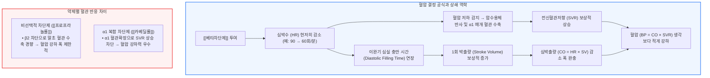

# [[베타차단제]]의 혈압과 맥박

📌 **한 줄 요약 (TL;DR)**: [[베타차단제]] 복용 시 심박수가 크게 떨어짐에도 불구하고 혈압이 기대만큼 비례하여 떨어지지 않는 이유는, 심박수 저하로 이완기 충만 시간(Diastolic filling time)이 늘어나 1회 박출량(Stroke volume)이 보상적으로 증가하고, 혈압 저하를 방어하려는 생체 반사로 전신혈관저항(SVR)이 상승하여 혈압 강하 효과를 상쇄하기 때문이다.

---

## 📸 1. 시각적 요약

---

## 🔑 2. 핵심 개념 및 원리

- **이완기 충만 시간 연장과 프랭크-스탈링(Frank-Starling) 기전**:  
  - 심박수가 90회에서 60회로 감소하면 심실이 확장기 동안 혈액을 채우는 절대적 시간이 늘어남.  
  - 심실 이완기말 용적(EDV)이 커지고 심근 섬유가 신장되면서 프랭크-스탈링 법칙에 의해 1회 박출량(SV)이 증가하여 심박수 감소에 따른 심박출량(CO) 저하를 상당 부분 보쇄함.  
- **생체 압수용체 반사(Baroreflex)와 혈관저항(SVR)의 보상적 상승**:  
  - 심박출량이 감소하여 동맥압이 떨어지려 할 때 경동맥동 및 대동맥궁의 압수용체가 이를 감지하여 말초 혈관을 수축시키는 반사 반응을 촉발함.  
  - 전신혈관저항(SVR)이 상승하여 혈압의 급격한 붕괴를 방어함.  
- **중심동맥압(Central Aortic Pressure)과 상완동맥압의 괴리**:  
  - 베타차단제는 팔에서 측정하는 상완동맥 혈압(Brachial BP)은 적게 떨어뜨리면서도, 반사파 증폭 등으로 인해 대동맥 중심동맥압을 낮추는 데는 타 혈압약(CCB, ARB)보다 열등하여 단순 고혈압의 1차 약제로 권고되지 않는 원인이 됨 (CAFE 연구).

**관련 질환 및 약물 키워드**: [[고혈압]], [[베타차단제]], [[프로프라놀롤]], [[카베딜롤]], [[비소프롤롤]]

---

## 📝 3. 본문 내용 정리

### 1) 약제별 혈압 강하 기전의 차이

- **순수 β1 차단제 ([[비소프롤롤]])**:  
  - 맥박은 가장 깨끗하게 조절되나, 보상적 1회 박출량 및 혈관저항 반응으로 인해 혈압 강하는 완만하게 나타남.  
- **비선택적 차단제 ([[프로프라놀롤]])**:  
  - β2 차단에 의한 말초 혈관 확장 억제(상대적 혈관 수축)가 동반되어 단기적으로 혈압 강하 폭이 기대보다 적을 수 있음.  
- **혈관확장형 복합 차단제 ([[카베딜롤]])**:  
  - α1 수용체를 직접 차단하여 보상적 혈관 수축(SVR 상승)을 억제하므로, 다른 베타차단제들에 비해 뚜렷한 혈압 강하 효과를 나타냄.

### 2) 진료실 상담 적용

- 환자의 의문: "맥박을 떨어뜨리는 약을 먹었는데 왜 제 혈압은 140에서 130 정도로 조금밖에 안 떨어지나요? 약효가 없는 것 아닌가요?"  
- 임상적 답변: "이 약은 심장을 차분하게 쉬게 해주는 약으로, 심장이 천천히 뛰는 대신 한 번 뛸 때 피를 더 여유 있게 모아서 뿜어내고 혈관이 자연스럽게 압력을 지켜주기 때문에 혈압이 위험하게 뚝 떨어지지 않고 안전하게 유지되는 것입니다."

---

## 💡 4. 임상 적용 및 실전 팁

### 1) 진료실 환자 티칭 포인트

- "맥박을 10~20회 낮추더라도 혈압이 곤두박질치지 않는 것은 우리 몸의 훌륭한 생체 안전장치 덕분입니다. 혈압 조절이 더 필요하다면 베타차단제를 무리하게 올리기보다 혈관을 직접 넓혀주는 다른 혈압약(CCB나 ARB)을 병용하는 것이 훨씬 효과적입니다."

### 2) 놓치면 안 되는 주의사항 및 Red Flags

- 🚨 **Red Flag: 과도한 맥박 저하(< 50회/분)와 피로/어지럼증**: 혈압이 충분히 떨어지지 않았다고 해서 베타차단제 용량을 과도하게 증량할 경우 심각한 동서맥이나 방실 차단이 발생할 수 있으므로, 목표 안정 시 심박수(55~60회/분)에 도달하면 혈압 강하는 타 계열 약제로 해결해야 함.

---

## ➕ 5. 보충 근거 (최신 지견)

- **CAFE 연구 (Conduit Artery Function Evaluation Study)**:  
  - [Differential impact of blood pressure-lowering drugs on central aortic pressure and clinical outcomes (Circulation 2006;113:1213-1225, PMID: 16476843)](https://pubmed.ncbi.nlm.nih.gov/16476843/)  
  - 베타차단제 기반 치료군이 CCB 기반 치료군과 상완동맥 혈압은 비슷하게 조절되었으나, 중심 대동맥압 강하력이 떨어져 심혈관 사건 예방에서 열등함을 대규모 임상으로 규명.  
- **Guyton and Hall 의학생리학 교과서 (혈역학 보상 원리)**:  
  - [Guyton and Hall Textbook of Medical Physiology (14th Edition)](https://www.elsevier.com/books/guyton-and-hall-textbook-of-medical-physiology/hall/978-0-323-59712-8)  
  - 심박수 변화와 이완기 충만 시간, 프랭크-스탈링 기전의 1회 박출량 완충 효과 및 전신혈관저항의 항상성 유지 원리를 상세히 기술.

---

## Reference

- [베타차단제는 맥박수를 낮추는데 혈압은 생각보다 잘 안 떨어지는 이유 (내과 의사 기역)](https://www.youtube.com/watch?v=bND2F0EZj_4)  
- [Differential impact of blood pressure-lowering drugs on central aortic pressure and clinical outcomes: the CAFE study (Circulation 2006;113:1213-1225, PMID: 16476843)](https://pubmed.ncbi.nlm.nih.gov/16476843/)  
- [Guyton and Hall Textbook of Medical Physiology (14th Edition)](https://www.elsevier.com/books/guyton-and-hall-textbook-of-medical-physiology/hall/978-0-323-59712-8)
