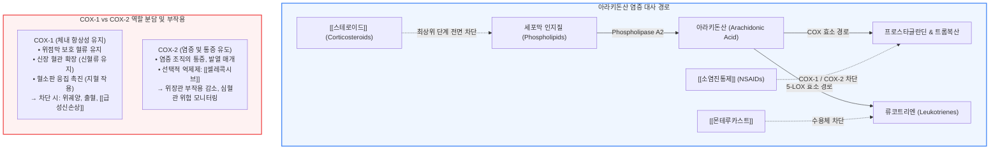

# [[스테로이드]]와 [[소염진통제]]

📌 **한 줄 요약 (TL;DR)**: 염증 캐스케이드의 최상류에서 인지질(Phospholipase A2) 분해 자체를 억제하여 프로스타글란딘과 류코트리엔 생성을 전면 차단하는 약물이 [[스테로이드]]이며, 그 하류에서 사이클로옥시게나제(COX-1/2) 효소만을 선택적·비선택적으로 억제하여 통증과 염증을 가라앉히는 약물이 [[소염진통제]](http://NSAIDs)이다.

---

## 📸 1. 시각적 요약

---

## 🔑 2. 핵심 개념 및 원리

- **차단 위치의 근본적 차이 (최상류 vs 하류 분기점)**:  
  - **[[스테로이드]]**: 유전자 발현 조절(Lipocortin/Annexin-1 합성 촉진)을 통해 세포막 인지질을 아라키돈산으로 분해하는 최상위 효소인 Phospholipase A2를 차단함. 프로스타글란딘, 트롬복산, 류코트리엔 등 모든 하류 염증 매개물질의 생성이 원천 봉쇄되므로 항염증 효과가 극도로 강력함.  
  - [**[소염진통제]**](http://NSAIDs): 아라키돈산이 이미 형성된 후, 이를 프로스타글란딘으로 전환하는 COX(Cyclooxygenase) 효소 단계만을 억제함. 류코트리엔 경로는 억제하지 못하며, 오히려 기질이 류코트리엔 경로로 몰려 천식 환자에서 기관지 경련(아스피린 과민성 천식)을 유발할 수 있음.  
- **COX-1과 COX-2의 생리적 역할 분담**:  
  - **COX-1 (Constitutive / 항상성 효소)**: 위점막 보호 프로스타글란딘($PGE_2, PGI_2$) 생성, 신장 수입세동맥 확장 혈류 유지, 혈소판 트롬복산($TXA_2$) 매개 지혈. 비선택적 NSAIDs가 이를 억제하면 위장 장애, 신부전, 출혈 경향이 발생함.  
  - **COX-2 (Inducible / 유도 효소)**: 감염이나 조직 손상 시 염증 세포(대식세포 등)에서 폭발적으로 유도되어 통증, 발열, 부종을 유발함.  
- **저용량 [[아스피린]]의 독특한 비가역적 기전**:  
  - 아스피린은 혈소판의 COX-1을 영구적(비가역적)으로 아세틸화하여 억제함. 혈소판은 핵이 없어 새 효소를 합성하지 못하므로, 혈소판 수명(7~10일) 동안 강력한 항혈전 효과를 발휘함.

**관련 질환 및 약물 키워드**: [[급성신손상]], [[소화성궤양]], [[천식]], [[스테로이드]], [[소염진통제]], [[셀레콕시브]], [[아스피린]], [[몬테루카스트]]

---

## 📝 3. 본문 내용 정리

### 1) 약제 계열별 특징 비교

- **전신 스테로이드 (덱사메타손, 프레드니솔론 등)**:  
  - 면역억제 및 강력한 항염증. 자가면역질환, 알레르기 쇼크, 중증 급성 염증에 사용.  
  - 장기 투여 시 부신 억제, 쿠싱증후군, 혈당 상승, 골다공증, 감염 취약 등 전신 부작용 수반.  
- **비선택적 NSAIDs (이부프로펜, 나프록센, 록소프로펜 등)**:  
  - COX-1과 COX-2를 모두 억제. 진통·해열·소염 작용 우수.  
  - 소화성 궤양 병력자, 고령자, 만성 신질환자에서 위장관 출혈 및 급성 신손상 주의.  
- **선택적 COX-2 억제제 ([[셀레콕시브]])**:  
  - COX-2만 선택적으로 차단하여 위장관 궤양 및 출혈 합병증 위험을 획기적으로 낮춤.  
  - 혈소판의 $TXA_2$(혈전 촉진)는 억제하지 못하면서 혈관 내피세포의 $PGI_2$(혈전 억제/혈관 확장)만 선택적으로 줄일 수 있어, 심혈관계 기저 위험 환자에서 혈전증 주의 필요.

---

## 💡 4. 임상 적용 및 실전 팁

### 1) 진료실 처방 노하우

- **NSAIDs 처방 시 위장관 보호 전략**:  
  - 고령 환자나 소염진통제를 1주일 이상 처방할 때는 반드시 위장관 보호제(PPI 또는 H2RA)를 병용하거나 선택적 COX-2 억제제([[셀레콕시브]])를 우선 고려.  
- **충분한 수분 섭취 지도**:  
  - NSAIDs 복용 중 탈수가 겹치면 신장 혈관 수축으로 인한 [[급성신손상]] 위험이 급증하므로 복용 기간 동안 충분한 수분 섭취를 강조.

### 2) 놓치면 안 되는 주의사항 및 Red Flags

- 🚨 **Red Flag 1: 삼중 처방(Triple Whammy)의 위험**:  
  - ACEI/ARB + 이뇨제 + NSAIDs를 동시에 복용할 경우 사구체 여과압 유지가 완전히 무너지면서 치명적인 [[급성신손상]]이 발생하므로 이 조합은 절대적으로 피해야 함.  
- 🚨 **Red Flag 2: [[천식]] 환자의 소염진통제 복용 후 호흡곤란**:  
  - 아스피린 과민성 천식 병력이 있는 환자에게 NSAIDs 투여 시 급격한 치명적 기관지 경련이 발생할 수 있으므로, 해열진통이 필요할 때는 아세트아미노펜을 저용량으로 신중 투여해야 함.

---

## ➕ 5. 보충 근거 (최신 지견)

- **NSAIDs의 작용 기전 및 COX 이소형에 관한 고전적 원리**:  
  - [Mechanism of action of nonsteroidal anti-inflammatory drugs (Am J Med 1999;107:3S-10S, PMID: 10628587)](https://pubmed.ncbi.nlm.nih.gov/10628587/)  
  - COX-1과 COX-2의 구조적 차이, 비선택적 NSAIDs와 선택적 COX-2 억제제의 차별화된 분자 약리학적 메커니즘을 규명.  
- **Goodman & Gilman's 약리학 교과서 (항염증제 부문)**:  
  - [Goodman & Gilman's: The Pharmacological Basis of Therapeutics (14th ed.)](https://accessmedicine.mhmedical.com/book.aspx?bookid=3191)  
  - 아라키돈산 대사 회로에서 글루코코르티코이드의 Phospholipase A2 억제와 COX 억제제의 작용점 분리 체계를 표준 명시.

---

## Reference

- [스테로이드와 NSAID의 차이점 (내과 의사 기역)](https://www.youtube.com/watch?v=6vJHSZhh9CQ)  
- [Mechanism of action of nonsteroidal anti-inflammatory drugs (Am J Med 1999;107:3S-10S, PMID: 10628587)](https://pubmed.ncbi.nlm.nih.gov/10628587/)  
- [Goodman & Gilman's: The Pharmacological Basis of Therapeutics (14th Edition)](https://accessmedicine.mhmedical.com/book.aspx?bookid=3191)
