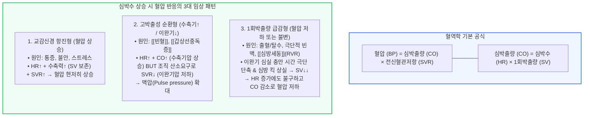

# [[심박수]]와 [[혈압]]의 혈역학

📌 **한 줄 요약 (TL;DR)**: 혈압은 심박출량(심박수 × 1회박출량)과 전신혈관저항(SVR)의 곱으로 결정되므로 심박수가 오른다고 무조건 혈압이 오르는 것은 아니며, 극단적 빈맥이나 [[심방세동]]에서처럼 이완기 충만 시간 단축으로 1회박출량이 급감하거나 혈관저항이 떨어지는 병적 상황에서는 심박수 증가에도 불구하고 혈압이 불변하거나 오히려 저하될 수 있다.

---

## 📸 1. 시각적 요약

---

## 🔑 2. 핵심 개념 및 원리

- **혈역학 결정 공식 ($BP = HR \\times SV \\times SVR$)**:  
  - 혈압(Mean Arterial Pressure)은 심박수(HR), 1회 박출량(Stroke Volume, SV), 전신혈관저항(Systemic Vascular Resistance, SVR)의 상호작용으로 결정됨.  
  - 심박수가 오를 때 혈압이 오르려면 최소한 SV와 SVR이 감소하지 않거나 보존되어야만 성립함.  
- **이완기 충만 시간(Diastolic Filling Time) 단축의 상쇄 효과**:  
  - 심박수가 140~150회/분 이상으로 지나치게 빨라지면 심장이 혈액을 받아들이는 이완기 시간이 물리적으로 급감함.  
  - 심실에 피가 충분히 차지 못한 상태에서 불완전하게 펌프질을 하므로 1회 박출량(SV)이 급감하여 총 심박출량과 혈압이 떨어질 수 있음.  
- **[[심방세동]](Atrial Fibrillation with RVR)에서의 특수 혈역학**:  
  - 심실 박동이 매우 불규칙(Irregularly irregular)하여 박동마다 충만 시간이 달라지며, 심방 수축에 의한 추가 혈액 공급인 '심방 킥(Atrial kick, 정상 박출량의 20~30% 기여)'이 완전히 소실됨.  
  - 따라서 심방세동 환자에서 맥박이 빠르면 심박출량이 불안정해지고 저혈압이 동반되기 쉬움.

**관련 질환 및 약물 키워드**: [[심방세동]], [[빈혈]], [[갑상선중독증]], [[패혈증]], [[저산소증]], [[부정맥]], [[아미오다론]]

---

## 📝 3. 본문 내용 정리

### 1) 심박수-혈압 3대 임상 패턴 분석

- **패턴 1: 전형적 교감신경 항진 (HR ↑, BP ↑)**:  
  - 급성 통증, 공포, 저산소증, 기관내 삽관 후 흡인 자극 등.  
  - 심박수 증가와 동시에 심근 수축력 증가 및 전신 혈관 수축(SVR ↑)이 동반되므로 혈압이 뚜렷하게 상승.  
- **패턴 2: 고박출성 순환 상태 (HR ↑, 맥압 ↑)**:  
  - [[빈혈]], [[갑상선중독증]] 등.  
  - 조직의 산소 결핍을 보상하기 위해 심장이 과박출(CO ↑)하여 수축기 혈압은 오르지만, 말초 조직 혈관이 확장(SVR ↓)되어 이완기 혈압은 낮아지며 맥압이 크게 벌어짐.  
- **패턴 3: 용적 부족 및 극단적 빈맥 (HR ↑, BP ↓)**:  
  - 심한 출혈이나 탈수 상태에서 인체는 혈압 유지를 위해 보상적으로 빈맥을 일으키나, 혈관 내 유효 용적 결손으로 인해 결국 혈압이 붕괴함.

### 2) 중환자 진정(Sedation) 환자에서의 임상적 의문 해석

- **진정 상태 환자에서 심방세동 빈맥 발생 시 혈압이 치솟았다가 [[아미오다론]] 전환 후 혈압이 떨어진 이유**:  
  1. **진정 상태여도 잠재적 교감신경 과활성 존재**: 진정제 투여 중이라도 진통(Analgesia) 부족으로 인한 통증, 인공호흡기 비동기화(Fighting), 저산소증, 객담 흡인 등의 강력한 스트레스 자극이 있으면 교감신경이 폭발하여 혈압과 심박수가 동시 상승할 수 있음.  
  2. **[[아미오다론]] 투여 후 혈압 저하**: 정상 동율동(Sinus rhythm) 회복으로 심박수가 안정된 효과 외에도, 아미오다론 약제 자체가 가진 고유한 혈관확장 및 음성 변력 작용으로 인해 혈압이 강하될 수 있음.

---

## 💡 4. 임상 적용 및 실전 팁

### 1) 진료실 및 병동 모니터링 노하우

- **맥박수만 보고 혈압을 예단하지 말 것**:  
  - 맥이 빠르다고 무조건 혈압이 높을 것이라 단정하여 섣불리 혈압 강하제를 투여하면, 탈수나 패혈증 초기 환자에서 치명적인 쇼크를 초래할 수 있음.  
- **진정 환자의 활력징후 변동 해석**:  
  - 진정된 중환자에서 갑작스러운 빈맥과 혈압 상승이 관찰될 때는 진정제 용량만 올릴 것이 아니라, 통증 유무(진통제 필요성), 흡인 자극, 방광 팽만(Foley 카테터 폐색 여부) 등의 유발 요인을 먼저 확인해야 함.

### 2) 놓치면 안 되는 주의사항 및 Red Flags

- 🚨 **Red Flag 1: 빈맥 동반 저혈압(Tachycardia with Hypotension)**:  
  - 맥박은 120회 이상인데 혈압이 90/60 mmHg 이하로 떨어진다면 출혈, 패혈성 쇼크, 심인성 쇼크, 또는 중증 부정맥의 강력한 경고 징후이므로 즉각적인 수액 소생술 및 원인 감별을 시작해야 함.  
- 🚨 **Red Flag 2: 불안정한 [[심방세동]](http://RVR)**:  
  - 심방세동 빈맥 환자에서 의식 저하, 급성 흉통, 폐부종 등 혈역학적 불안정성이 동반되면 약물 조절보다 즉각적인 응급 전기적 동율동전환술(D/C Cardioversion)을 시행해야 함.

---

## ➕ 5. 보충 근거 (최신 지견)

- **Guyton and Hall 의학생리학 교과서 (심박출량 및 혈역학 조절 원리)**:  
  - [Guyton and Hall Textbook of Medical Physiology (14th ed.)](https://www.elsevier.com/books/guyton-and-hall-textbook-of-medical-physiology/hall/978-0-323-59712-8)  
  - 심박수 변화에 따른 이완기 충만 시간의 변화 곡선과 심박출량의 역학 관계, SVR과 혈압의 결정 메커니즘을 표준 명시.  
- **미국심장학회(ACC/AHA) 심방세동 진료지침 (2023)**:  
  - [2023 ACC/AHA/ACCP/HRS Guideline for the Diagnosis and Management of Atrial Fibrillation (J Am Coll Cardiol 2024;83:e1-e156, PMID: 38043952)](https://pubmed.ncbi.nlm.nih.gov/38043952/)  
  - 심방세동 환자에서 빠른 심실 반응(RVR)의 혈역학적 영향 및 아미오다론을 포함한 항부정맥 약제의 심박수 조절 가이드라인 제시.

---

## Reference

- [심박수가 증가하면 반드시 혈압이 오를까? (내과 의사 기역)](https://www.youtube.com/watch?v=JHsrB5n_CqM)  
- [Guyton and Hall Textbook of Medical Physiology (14th Edition)](https://www.elsevier.com/books/guyton-and-hall-textbook-of-medical-physiology/hall/978-0-323-59712-8)  
- [2023 ACC/AHA/ACCP/HRS Guideline for the Diagnosis and Management of Atrial Fibrillation (J Am Coll Cardiol 2024;83:e1-e156, PMID: 38043952)](https://pubmed.ncbi.nlm.nih.gov/38043952/)
