# [[심부전]]에서의 [[베타차단제]]

📌 **한 줄 요약 (TL;DR)**: 단기적으로 심기능을 떨어뜨리는 [[베타차단제]]가 [[심부전]]에서 생존율을 높이는 이유는, 장기적인 교감신경계의 과도한 보상 작용(만성적 심근 피로, 부정맥, 심실 리모델링)을 차단하여 심근을 보호하기 때문이며, 대규모 임상시험을 통해 사망률 감소가 입증된 3대 약물([[카베딜롤]], [[비소프롤롤]], [[메토프롤롤]] 서방정)만을 안정된 상태에서 극저용량부터 점진적으로 증량하여 투여해야 한다.

---

## 📸 1. 시각적 요약

```mermaid
flowchart TD

    subgraph Decompensation["1. 심부전 초기 보상 기전과 악순환"]

        HF["[[심부전]] 발생 (심근 기능 저하)"] --> SNS["교감신경계 보상 활성화<br/>(심박수 & 수축력 증가, 레닌-안지오텐신계 촉진)"]

        SNS --> ShortTerm["단기 효과: 심박출량 및 혈압 유지"]

        SNS --> LongTerm["장기적 독성: 심근 지속적 혹사 (채찍질)"]

        LongTerm --> Remodel["심근 산소 소모 증가 & [[부정맥]] 위험<br/>& 심실 악성 리모델링 (구조 변형)"]

        Remodel --> Worsen["심기능 추가 악화 및 사망률 증가"]

    end

    subgraph Treatment["2. 베타차단제의 역설적 치료 기전"]

        BB["[[베타차단제]] 투여"] --> BlockSNS["만성 교감신경 독성 차단<br/>(심박수 안정화 & 심근 휴식 제공)"]

        BlockSNS --> Reversal["심실 역리모델링 유도 & [[부정맥]] 억제"]

        Reversal --> Improve["장기 생존율 개선 및 입원율 감소"]

    end

    subgraph EvidenceDrugs["3. HFrEF 입증 3대 약물 vs 근거 없는 약물"]

        direction TB

        Proven["사망률 감소 입증 약물 (Class I, Level A)<br/>• [[카베딜롤]] (Carvedilol)<br/>• [[비소프롤롤]] (Bisoprolol)<br/>• [[메토프롤롤]] 석시네이트 ER (Metoprolol succinate)"]

        Unproven["심부전 사망률 감소 근거 없음 (사용 지양)<br/>• [[아테놀롤]] (Atenolol)<br/>• [[프로프라놀롤]] (Propranolol)"]

    end

    style Decompensation fill:#fef2f2,stroke:#ef4444,stroke-width:2px

    style Treatment fill:#eff6ff,stroke:#3b82f6,stroke-width:2px

    style EvidenceDrugs fill:#f0fdf4,stroke:#22c55e,stroke-width:2px
```

---

## 🔑 2. 핵심 개념 및 원리

- **보상 기전의 양면성과 만성 교감신경 독성**:  
  - 심부전으로 심박출량이 저하되면 인체는 생존을 위해 교감신경계(SNS)와 레닌-안지오텐신-알도스테론 시스템(RAAS)을 활성화하여 심박수와 수축력을 쥐어짜냄.  
  - 단기적으로는 혈압과 조직 관류를 유지하지만, 장기적으로는 지친 말에게 계속 채찍질을 가하는 것과 같아 심근 산소 소모를 폭증시키고 심실 섬유화와 형태 변형(심실 리모델링)을 촉진함.  
- **[[베타차단제]]의 치료적 역설**:  
  - 약리학적으로는 음성 수축(negative inotropic) 및 음성 변시(negative chronotropic) 작용으로 심장 펌프 기능을 일시적으로 억제하는 약제임.  
  - 그러나 만성 심부전에서는 지속적인 카테콜라민 자극을 차단함으로써 심근에 휴식을 제공하고, 심실 수축기 용적을 줄이며, 궁극적으로 심실 구조를 회복시키는 역리모델링(reverse remodeling)을 유도하여 장기 사망률을 현저히 낮춤.  
- **약리 작용과 임상 근거(EBM)의 분리**:  
  - 모든 베타차단제가 동일한 효과를 내는 '계열 효과(class effect)'가 아님.  
  - 박출률 감소 심부전(HFrEF) 환자를 대상으로 한 대규모 무작위 대조 임상시험(RCT)에서 실질적인 사망률 감소를 증명한 약제는 오직 세 가지뿐임.

**관련 질환 및 약물 키워드**: [[심부전]], [[베타차단제]], [[카베딜롤]], [[비소프롤롤]], [[메토프롤롤]], [[부정맥]]

---

## 📝 3. 본문 내용 정리

### 1) 급성 심부전 vs 만성 심부전에서의 사용 원칙

- **급성 심부전([[폐부종]], 심인성 [[쇼크]])**:  
  - 환자가 혈역학적으로 불안정하고 호흡곤란, 폐울혈이 심한 급성 비보상 상태에서는 베타차단제를 시작하거나 급격히 증량해서는 안 됨.  
  - 심근 수축력 억제로 인해 급성 혈역학적 붕괴와 심인성 쇼크를 유발할 수 있음.  
- **만성 안정형 심부전**:  
  - 체액 저류가 이뇨제로 조절되고 안정된(euvolemic) 상태에서 시작해야 하며, 장기 투여 시 생존 기간 연장과 재입원율 감소의 핵심 약제로 작용함.

### 2) 사망률 감소가 입증된 3대 [[베타차단제]]

임상 진료지침에서 박출률 감소 심부전(HFrEF) 표준 치료제로 강력히 권고되는 약물:

- [**[카베딜롤]**](http://Carvedilol): 비선택적 β1, β2 차단 및 α1 차단 작용(혈관 확장 효과 겸비). 항산화 작용 포함. (US Carvedilol, COPERNICUS 연구)  
- [**[비소프롤롤]**](http://Bisoprolol): 고선택적 β1 차단제. (CIBIS-II 연구)  
- **[[메토프롤롤]] 석시네이트 서방형(Metoprolol succinate ER/XL)**: 고선택적 β1 차단제. 타르트레이트(tartrate) 속방형 제제는 심부전 사망률 감소 효과가 입증되지 않았으므로 반드시 석시네이트 서방형을 사용해야 함. (MERIT-HF 연구)  
- **효과가 입증되지 않은 약제**: [[아테놀롤]], [[프로프라놀롤]] 등은 심부전 환자의 사망률 감소 근거가 없으므로 해당 목적으로 처방해서는 안 됨.

### 3) 임상 용량 조절(Titration) 원칙: Start Low, Go Slow

- 심부전 환자에게 처음 투여할 때는 매우 낮은 최소 용량(예: 카베딜롤 3.125mg 1일 2회, 비소프롤롤 1.25mg 1일 1회)부터 조심스럽게 시작함.  
- 환자의 혈압, 안정 시 심박수, 울혈 증상 악화 여부를 1~2주 간격으로 모니터링하며, 환자가 견뎌내는 내약성을 확인한 후 2배씩 천천히 목표 용량(target dose)까지 점진적으로 증량함.

---

## 💡 4. 임상 적용 및 실전 팁

### 1) 진료실 처방 및 복약 지도 노하우

- **환자 설명 전략**: "이 약은 심장을 쉬게 해주는 브레이크 역할을 합니다. 지친 심장이 너무 무리해서 뛰지 않도록 보호하여 10년 뒤 심장이 더 건강하게 버틸 수 있도록 수명을 늘려주는 약입니다."  
- **초기 일시적 피로감 교육**: 투여 초기 수일~수주일 동안 심박수가 안정되면서 일시적으로 몸이 무겁거나 피로감을 느낄 수 있으나, 이는 약물이 심근을 쉬게 하는 과정이며 시간이 지나면 적응된다는 점을 미리 설명하여 자의 중단을 방지해야 함.

### 2) 놓치면 안 되는 주의사항 및 Red Flags

- 🚨 **Red Flag 1: 서맥 및 전도 장애**: 투여 중 안정 시 심박수가 50회/분 미만으로 떨어지거나 2도 이상의 방실 차단이 나타나면 용량을 감량하거나 심장내과 전문의에게 의뢰해야 함.  
- 🚨 **Red Flag 2: 급성 울혈 악화**: 증량 과정에서 체중이 수일 내 2kg 이상 증가하거나, 야간 발작성 호흡곤란, 하지 부종 등 체액 저류 징후가 나타나면 즉시 이뇨제 용량을 증량하고 베타차단제 증량을 보류해야 함.  
- 🚨 **Red Flag 3: 저혈압**: 수축기 혈압이 90 mmHg 미만으로 떨어지거나 어지럼증, 기립성 저혈압 증상이 심할 경우 병용 약제의 혈압 강하 효과를 검토하고 베타차단제 용량을 재평가해야 함.

---

## ➕ 5. 보충 근거 (최신 지견)

- **대한심부전학회(KSHF) 및 유럽심장학회(ESC) 2023/2024 심부전 진료지침**:  
  - 박출률 감소 심부전(HFrEF, LVEF ≤ 40%) 환자에서 사망률과 심부전 입원율 감소를 위한 **4대 핵심 표준 약제(Fantastic 4)**의 필수 축으로 권고 (Class I, Level A):  
    1. ARNI([[사쿠비트릴]]/발사르탄) 또는 ACEI  
    2. 입증된 **[[베타차단제]]** ([[카베딜롤]], [[비소프롤롤]], [[메토프롤롤]] 석시네이트)  
    3. MRA([[스피로놀락톤]], [[에플레레논]])  
    4. SGLT2 억제제([[다파글리플로진]], [[엠파글리플로진]])  
- **미국심장학회/미국심장협회(AHA/ACC/HFSA) 가이드라인**:  
  - HFrEF 진단 즉시 금기증이 없는 한 조기에 입증된 베타차단제를 저용량으로 신속히 도입하고, 환자가 견딜 수 있는 최대 목표 용량까지 단계적으로 증량할 것을 강력 권고함.

---

## Reference

- [심부전인데 왜 베타차단제를 쓸까? - 내과 의사 기역](https://www.youtube.com/watch?v=QtoZZJnA-EU)  
- 2022 AHA/ACC/HFSA Guideline for the Management of Heart Failure  
- 2023 Focused Update of the 2021 ESC Guidelines for the diagnosis and treatment of acute and chronic heart failure  
- 2022 대한심부전학회 심부전 진료지침 개정안
