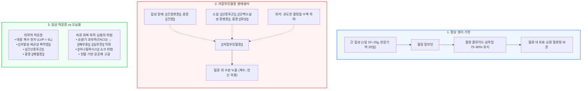

# [[알부민]]

📌 **한 줄 요약 (TL;DR)**: [[알부민]]은 피로 회복이나 단순 영양 보충용 주사가 아니며, [[간경변증]]의 치명적 합병증, [[자발성 세균성 복막염]], [[간신증후군]], 중증 [[패혈증]], 대면적 [[화상]] 등 생명이 위급한 병적 상황에서만 엄격하게 투여되는 한정된 혈액제제이자 공공 자원이다.

---

## 📸 1. 시각적 요약

---

## 🔑 2. 핵심 개념 및 원리

- **혈장 콜로이드 삼투압의 절대적 유지자**:  
  - 혈장 내 전체 콜로이드 삼투압의 약 75~80%를 담당하여 혈관 내 유효 순환 혈류량을 유지하고, 혈관 외 간질조직으로의 체액 누출을 억제함.  
  - 알부민 농도가 급감하면 혈관 내 정수압을 지탱하지 못해 체액이 제3공간으로 빠져나가며 복수, 흉수, 전신 부종이 발생함.  
- **체내 합성 및 약동학 특성**:  
  - 정상인의 간에서 매일 약 10~15g씩 왕성하게 합성되며, 혈중 반감기가 약 20일로 매우 긺.  
  - 따라서 단순한 며칠간의 과로, 식사 부실, 피로감 등으로 인해 단기간 내에 알부민이 고갈되거나 부족해지는 일은 생리적으로 발생하지 않음.  
- **수송체 역할**:  
  - 체내 다양한 호르몬, 지방산, 빌리루빈, 그리고 다수의 약물과 가역적으로 결합하여 전신으로 운반하는 핵심 매개체 역할을 수행함.

**관련 질환 및 약물 키워드**: [[알부민]], [[저알부민혈증]], [[간경변증]], [[신증후군]], [[패혈증]]

---

## 📝 3. 본문 내용 정리

### 1) [[저알부민혈증]]의 진정한 원인 감별

알부민 수치가 병적으로 낮아지는 것은 오직 명확한 기저 질환이 존재할 때뿐임:

- **합성 장애**: [[간경변증]], 급성 간부전, 중증 만성 [[간염]] 등 간 실질 기능이 치명적으로 저하된 경우.  
- **체외 소실**:  
  - 신장 질환: 사구체 여과 장벽 손상으로 인한 [[신증후군]](심한 단백뇨).  
  - 위장관 질환: 림프관 확장증이나 장점막 염증 등으로 인한 [[단백소실성 장병증]].  
- **체내/제3공간 유출**: 광범위 중증 [[화상]](혈관 투과성 항진으로 삼출액 누출), 중증 복막염.  
- **의인성 희석**: 과도한 결정질 수액 투여로 인한 혈액 희석.  
- **결론**: **만성 피로나 컨디션 저하는 저알부민혈증의 원인이 될 수 없으며, 알부민 결핍과 무관함.**

### 2) 경구 알부민 영양제/보충제의 허구성

- 알부민은 약 585개의 아미노산이 복잡한 3차원 입체 구조를 이루는 고분자 단백질임.  
- 구강으로 섭취할 경우 위산과 소화 효소(펩신, 트립신 등)에 의해 단일 아미노산 및 소펩타이드 단위로 완전히 분해되어 흡수됨.  
- 따라서 입으로 알부민을 먹어서 혈중 알부민 농도를 직접 올린다는 주장은 생리학적으로 성립할 수 없으며, 달걀흰자나 육류 등 일반 단백질 식품을 섭취하는 것과 생화학적으로 차이가 없음.

### 3) 무분별한 알부민 투여 시의 위험성

- **혈액제제로서의 본질**: 알부민은 화학 합성 약물이 아니라 타인의 헌혈 혈액에서 혈장을 분리·정제해 만드는 제제임. 대한민국 혈액관리법의 엄격한 규제를 받음.  
- **순환기 과부하(TACO)**:  
  - 고농도 알부민(20%, 25%)은 혈관 내로 주변 수분을 강력하게 끌어들여 급격한 혈관 확장 및 혈류량 증가를 유발함.  
  - [[심부전]], 심기능 저하 환자나 고령자에게 무분별하게 투여 시 급성 [[폐부종]], 호흡곤란, 심근 스트레스를 초래할 수 있음.  
- **면역 반응 및 감염 위험**:  
  - 타인의 단백질 제제이므로 알레르기 반응, 발열, 오한, 두드러기, 드물게 치명적인 [[아나필락시스]] 쇼크가 발생할 수 있음.  
  - 고도 정제 및 열처리 과정을 거치나, 생물학적 제제 특성상 미지의 병원체 전파 위험이 이론적으로 0%는 아님.

---

## 💡 4. 임상 적용 및 실전 팁

### 1) 진료실 상담 노하우 (환자 티칭 포인트)

- **환자의 요구**: "피로하고 기운이 없으니 비급여로라도 알부민 주사 한 대 맞춰주세요."  
- **의사의 소통 전략**:  
  1. **생리적 팩트 전달**: 간 기능이 정상이라면 체내에서 매일 충분한 양(10~15g)이 스스로 만들어지고 있고, 알부민은 피로를 유발하거나 회복시키는 물질이 아님을 설명.  
  2. **위험 대비 이득 설명**: 단순 피로 회복 효과는 전무한 반면, 급격한 체액 증가로 인한 혈압 상승, [[심부전]] 및 [[폐부종]] 유발, [[아나필락시스]] 쇼크 위험이 실재함을 경고.  
  3. **공공 의료 윤리 설명**: 알부민은 공장에서 인공 합성하는 영양 수액이 아닌 국민 헌혈로 만들어진 한정된 혈액 자원이므로, 간경변 합병증이나 패혈증 등으로 생명이 위급한 중환자에게 우선 배분되어야 하는 법적·윤리적 공공재임을 설득.

### 2) 놓치면 안 되는 주의사항 및 Red Flags

- 🚨 **Red Flag 1: 심장 질환 환자의 알부민 투여 요구**: 기저 심질환(허혈성 심질환, [[심부전]])이 있는 고령 환자에게 고장성 알부민을 급속 투여할 경우 치명적인 울혈성 심부전 및 [[폐부종]]으로 이어질 수 있음.  
- 🚨 **Red Flag 2: 원인 미상의 알부민 저하 발견 시**: 피로를 호소하는 환자의 혈액검사에서 실제 알부민 저하(< 3.0 g/dL)가 발견된다면 피로 때문이 아니라 잠재된 [[간경변증]], 단백뇨([[신증후군]]), 잠재적 악성 종양, 혹은 흡수장애 질환을 강력히 의심하고 즉시 원인 정밀 검사를 시행해야 함.

---

## ➕ 5. 보충 근거 (최신 지견)

- **대한간학회(KASL) 및 미국간학회(AASLD) 간경변증 복수 가이드라인**:  
  - **대량 복수 천자(LVP)**: 5L 이상의 대량 복수 천자 시 천자유발 순환기능장애(PICD)를 예방하기 위해 배액된 복수 1L당 8g(약 20% 알부민 40mL)의 정맥 투여를 강력 권고(Class I, Level A).  
  - [**[자발성 세균성 복막염]**](http://SBP): 진단 시점(1.5 g/kg) 및 3일째(1.0 g/kg) 알부민 투여 시 [[간신증후군]] 발생률을 유의하게 낮추고 사망률을 29%에서 10%로 현저히 감소시킴.  
  - **간신증후군-급성신손상(HRS-AKI)**: 1일 1 g/kg (최대 100g) 투여와 함께 혈관수축제([[테를리프레신]] 등) 병용 요법이 표준 치료임.  
- **패혈성 쇼크 가이드라인(Surviving Sepsis Campaign, SSC Guidelines)**:  
  - 패혈성 쇼크 환자 소생술 시 대량의 결정질 수액 투여가 필요하거나 불응성 저혈압이 지속될 때 보조적으로 [[알부민]] 투여를 고려(Weak recommendation, Moderate-quality evidence).  
- **국내 건강보험 급여 기준 (보건복지부 고시)**:  
  - 혈청 알부민 3.0 g/dL 이하이면서 쇼크, 심한 [[화상]], 간경변증성 복수천자, [[신증후군]] 등 명문화된 적응증에 한해서만 급여 인정. 단순 기력 저하, 만성 피로, 단순 영양 결핍 목적의 투여는 불법 또는 삭감/임상적 남용에 해당함.

---

## Reference

- [알부민 맞으면 그렇게 좋다면서요.., 진실은? - 내과 의사 기역](https://www.youtube.com/watch?v=1lEvhudGIAE)  
- 대한간학회 간경변증 합병증 진료 가이드라인 (복수 및 관련 합병증)  
- AASLD Practice Guidance: Management of Adult Patients with Ascites Due to Cirrhosis  
- Surviving Sepsis Campaign: International Guidelines for Management of Sepsis and Septic Shock
