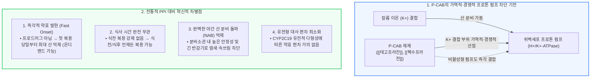

# 위산분비억제제 [[피캡]]의 기전

📌 **한 줄 요약 (TL;DR)**: 차세대 칼륨 경쟁적 위산분비억제제인 P-CAB([[테고프라잔]], [[펙수프라잔]])은 위벽세포의 $H^+/K^+$-ATPase 프로톤 펌프에서 칼륨($K^+$) 결합 부위에 가역적이고 경쟁적으로 결합하여, 산에 의한 활성화나 식사 타이밍에 구애받지 않고 첫날 첫 회 복용부터 즉각적이고 강력한 24시간 산 분비 억제 효과를 발휘하여 [[위식도역류질환]] 및 소화성 궤양 치료의 패러다임을 바꾸고 있다.

---

## 📸 1. 시각적 요약

---

## 🔑 2. 핵심 개념 및 원리

- **칼륨 경쟁적(Potassium-Competitive) 가역적 이온 결합**:  
  - PPI는 비가역적 공유결합을 형성하여 효소를 영구 불활성화시키는 반면, P-CAB은 칼륨 이온($K^+$)과 경쟁하여 이온 결합 형태로 가역적 억제를 수행함.  
  - 새로 합성되어 분비소관 표면으로 올라오는 펌프에도 주변 약물이 유연하게 이동하여 즉시 결합 억제함.  
- **프로드러그(Prodrug) 한계 탈피와 즉각적 작용(Onset of Action)**:  
  - PPI는 산에 의해 활성 설펜아미드로 변환되어야 하므로 식전 복용 후 위산이 분비되어야만 작용하며 최대 효과까지 3~5일이 걸림.  
  - P-CAB은 모약물 자체로 이미 활성형이므로 산 활성화가 불필요하여 복용 30분~1시간 만에 위내 pH를 4~6 이상으로 급상승시킴.  
- **비활성형 펌프(Resting Pump) 결합과 24시간 균일한 산 억제**:  
  - 휴지기 펌프에도 결합할 수 있어 야간 수면 중 분비되는 기저 위산을 차단하므로, PPI의 고질적 한계였던 야간 산 분비 돌파(NAB)를 완전히 극복함.

**관련 질환 및 약물 키워드**: [[위식도역류질환]], [[소화성궤양]], [[위염]], [[테고프라잔]], [[펙수프라잔]]

---

## 📝 3. 본문 내용 정리

### 1) 주요 P-CAB 약제 현황

- **[[테고프라잔]](Tegoprazan - 케이캡 50mg, 25mg, 구강붕해정)**:  
  - 미란성 및 비미란성 [[위식도역류질환]], 위궤양, 헬리코박터 파일로리 제균 치료.  
  - 물 없이 복용 가능한 구강붕해정 제형 구비로 야간 복용 편의성 극대화.  
- **[[펙수프라잔]](Fexuprazan - 펙수클루 40mg, 10mg)**:  
  - 급성 [[위염]] 및 만성 위염의 위점막 병변 개선, 미란성 위식도역류질환.  
  - 긴 반감기(약 9시간)를 바탕으로 야간 속쓰림 완화에 탁월한 효과 보고.

### 2) 임상적 유용성과 한계

- **온디맨드(On-demand / 필요시) 복용 가능**: 증상이 발생했을 때 즉시 1정 복용하여 30분 이내 증상을 가라앉히는 맞춤형 치료 가능.  
- **한계점 및 추적 과제**: 수십 년간 안전성 데이터가 축적된 PPI에 비해 출시 기간이 상대적으로 짧아, 초장기 연속 복용 시의 장기 안전성(혈중 가스트린 상승에 따른 위저선 용종, 감염증 등)에 대한 지속적 모니터링이 필요함.

---

## 💡 4. 임상 적용 및 실전 팁

### 1) 진료실 환자 티칭 포인트

- "이 약은 기존 위장약과 달리 식사 전후 아무 때나 드셔도 똑같이 효과가 나타나며, 약을 먹은 첫날부터 곧바로 속쓰림을 가라앉혀 줍니다. 특히 밤에 자다가 속이 쓰려 깨는 증상을 완벽하게 막아줍니다."

### 2) 놓치면 안 되는 주의사항 및 Red Flags

- 🚨 **Red Flag: 산 억제제 투여 전 위암 경고 증상 배제**: P-CAB의 산 억제력이 워낙 강력하여 조기 위암이나 악성 궤양의 증상까지 일시적으로 완벽히 가려버릴 수 있으므로, 40세 이상 첫 발병 환자나 경고 증상(체중 감소, 빈혈, 흑변)이 있는 경우 반드시 내시경으로 기질적 병변을 배제한 후 투약해야 함.

---

## ➕ 5. 보충 근거 (최신 지견)

- **테고프라잔의 위식도역류질환 3상 임상 및 약리 종설 (2020)**:  
  - [Tegoprazan to treat gastroesophageal reflux disease (Drugs Today 2020;56:707-716, PMID: 33332479)](https://pubmed.ncbi.nlm.nih.gov/33332479/)  
  - 테고프라잔의 신속한 약효 발현, 식사 무관 복용성, 미란성 식도염 치유율에서의 에소메프라졸 대비 비열등성 및 야간 산 억제 우월성을 종합 보고.  
- **펙수프라잔의 미란성 식도염 무작위 대조 3상 임상 (2022)**:  
  - [Randomized controlled trial to evaluate the efficacy and safety of fexuprazan compared with esomeprazole in erosive esophagitis (World J Gastroenterol 2022;28:6294-6309, PMC9730436)](https://pmc.ncbi.nlm.nih.gov/articles/PMC9730436/)  
  - 펙수프라잔이 에소메프라졸 대비 첫 3일간의 주·야간 속쓰림 완화 속도에서 통계적으로 유의미하게 우수함을 입증.

---

## Reference

- [위산분비를 억제하는 PCab에 대하여 (내과 의사 기역)](https://www.youtube.com/watch?v=13165aGgaV8)  
- [Tegoprazan to treat gastroesophageal reflux disease (Drugs Today 2020;56:707-716, PMID: 33332479)](https://pubmed.ncbi.nlm.nih.gov/33332479/)  
- [Efficacy and safety of fexuprazan compared with esomeprazole in erosive esophagitis (World J Gastroenterol 2022;28:6294-6309, PMC9730436)](https://pmc.ncbi.nlm.nih.gov/articles/PMC9730436/)
