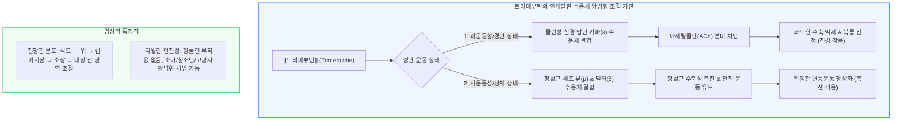

# 위장관조절제 [[트리메부틴]]

📌 **한 줄 요약 (TL;DR)**: [[트리메부틴]](http://포리부틴)은 말초성 엔케팔린 수용체(뮤/델타/카파)에 이중으로 작용하여 장운동이 과도할 때는 카파 수용체를 통해 아세틸콜린 분비를 억제하여 경련을 가라앉히고, 장운동이 저하되었을 때는 뮤/델타 수용체를 통해 수축을 촉진하여 정상 리듬을 회복시키는 스마트한 양방향 위장관 운동 조절제(Dual Modulator)이다.

---

## 📸 1. 시각적 요약

---

## 🔑 2. 핵심 개념 및 원리

- **엔케팔린(Enkephalinergic) 신경계 매개 양방향 조절(Dual Regulation)**:  
  - 일반적인 진경제(수축만 억제)나 위장관 운동촉진제(수축만 촉진)와 근본적으로 다름.  
  - 장관 내 국소 오피오이드/엔케팔린 수용체 아형에 차별적으로 결합하여, 과항진된 장관은 진정시키고 정체된 장관은 움직이게 만드는 '위장관 조율사' 역할을 수행함.  
- **항콜린 부작용 없는 안전한 스파즘 조절**:  
  - 부교감신경 무스카린 수용체를 직접 차단하지 않으므로 입마름, 시야 흐림, 빈맥, 소변 저류 등 항콜린 이상반응이 없음.  
- **식도부터 대장까지 전 위장관 아우르는 광범위 효능**:  
  - 엔케팔린 수용체는 식도 하부 괄약근부터 위, 소장, 대장 평활근 전반에 널리 분포하므로, 역류성 식도염, 위염, 기능성 소화불량, [[과민성대장증후군]]의 설사·변비 혼합형에 모두 효과적임.

**관련 질환 및 약물 키워드**: [[과민성대장증후군]], [[위식도역류질환]], [[위염]], [[트리메부틴]]

---

## 📝 3. 본문 내용 정리

### 1) 주요 적응증 및 제형

- **성인 및 소아 용법**:  
  - 성인: 1회 100~200mg 1일 3회 식전 복용. (서방정 300mg 1일 2회 복용)  
  - 소아/청소년: 안전역이 넓어 소아 복통, 소아 기능성 설사/변비에 소아용 시럽제로 널리 처방됨.  
- **설사-변비 교대형 [[과민성대장증후군]](http://IBS-M)**:  
  - 며칠은 설사하고 며칠은 변비가 반복되는 혼합형 IBS 환자에서 장운동의 변동성을 일정하게 잡아주는 최적의 1차 약제.

### 2) 높은 약물 병용 안전성

- CYP 계열 약물 상호작용이 적어 고혈압, 당뇨, 심장 질환 등으로 여러 약을 복용 중인 고령 환자에게 위장관 증상 완화 목적으로 매우 안전하게 병용 가능함.

---

## 💡 4. 임상 적용 및 실전 팁

### 1) 진료실 처방 및 복약 지도 포인트

- **환자 설명 전략**: "이 약은 위장이 너무 심하게 쥐어짜서 아플 때는 살살 풀어주고, 반대로 너무 안 움직여서 더부룩할 때는 잘 움직이도록 양쪽에서 리듬을 맞춰주는 위장 조절제입니다. 부작용이 거의 없어 청소년부터 어르신까지 안심하고 드실 수 있습니다."  
- **소아청소년 복통 처방**: 시험 스트레스 등으로 아침마다 배가 아프다고 호소하는 청소년 환자에게 1차 치료제로 매우 적합.

### 2) 놓치면 안 되는 주의사항 및 Red Flags

- 🚨 **Red Flag: 기질적 소화기 질환 배제**: 트리메부틴은 기능성 위장관 질환에 매우 안전하고 효과적이지만, 지속적인 체중 감소, 혈변, 야간 복통, 빈혈 등 경고 증상이 있는 환자에게는 단순 기능성 장애로 치부하지 말고 내시경 검사를 우선해야 함.

---

## ➕ 5. 보충 근거 (최신 지견)

- **트리메부틴의 약리 기전 및 위장관 기능 조절 고찰 (종설 논문)**:  
  - [Trimebutine: Mechanism of Action, Effects on Gastrointestinal Function and Clinical Results (J Int Med Res 1999;27:1-11, PMID: 10190202)](https://pubmed.ncbi.nlm.nih.gov/10190202/)  
  - 말초성 오피오이드 수용체(μ, κ, δ)에 대한 작용과 모틸린 분비 조절을 통한 위 배출능 촉진 및 결장 경련 완화의 양방향 메커니즘을 상세히 규명.  
- **과민성 대장증후군에서의 트리메부틴 임상적 효능 연구**:  
  - [Trimebutine therapy in patients with functional gastrointestinal disorders (PMC3738610)](https://pmc.ncbi.nlm.nih.gov/articles/PMC3738610/)  
  - 위식도역류 및 과민성대장증후군 복합 증상 환자에서 트리메부틴의 우수한 증상 개선율과 내약성을 확인.

---

## Reference

- [복통을 줄여주는 약 - 포리부틴 (트리메부틴) (내과 의사 기역)](https://www.youtube.com/watch?v=6IGkO-80JTg)  
- [Trimebutine: Mechanism of Action, Effects on Gastrointestinal Function and Clinical Results (J Int Med Res 1999;27:1-11, PMID: 10190202)](https://pubmed.ncbi.nlm.nih.gov/10190202/)  
- [Trimebutine in functional gastrointestinal disorders (PMC3738610)](https://pmc.ncbi.nlm.nih.gov/articles/PMC3738610/)
