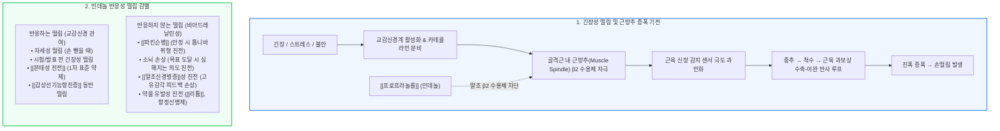

# [[인데놀]]과 [[손떨림]]

📌 **한 줄 요약 (TL;DR)**: 비선택적 베타차단제인 [[프로프라놀롤]](http://인데놀)은 골격근 내 근방추(Muscle spindle)의 β2 수용체 매개 반사 루프 감수성(Beta-adrenergic gain)을 차단하여 말초에서 떨림 진폭을 억제하므로, 교감신경 흥분성 떨림이나 [[본태성 진전]]에는 탁월한 효과를 보이지만, [[파킨슨병]]의 안정 시 진전이나 소뇌성 떨림 등 비아드레날린성 떨림에는 효과가 없다.

---

## 📸 1. 시각적 요약

---

## 🔑 2. 핵심 개념 및 원리

- **근방추(Muscle Spindle) 센서의 베타-아드레날린 이득(Beta-adrenergic Gain)**:  
  - 근육 내에는 근섬유의 신장 정도와 속도를 감지하는 감시 센서인 '근방추'가 존재함.  
  - 교감신경이 흥분하면 근방추 내 β2 수용체가 자극되어 센서의 민감도가 비정상적으로 치솟음.  
  - 손을 앞으로 뻗은 상태에서 발생하는 미세한 근육 늘어남에도 신경계가 과민하게 반응하여 급격한 수축과 이완을 반복하면서 눈에 보이는 진동(Tremor)이 발생함.  
- **[[프로프라놀롤]]의 말초성 차단 효과**:  
  - 인데놀은 지용성으로 뇌혈관장벽(BBB)을 통과하기도 하지만, 본태성 진전 및 생리적 진전 억제의 핵심은 '말초 근방추의 β2 수용체 차단'을 통해 반사 루프의 증폭 게인을 낮추는 데 있음.  
- **떨림 유형별 신경해부학적 감별**:  
  - **자세성/운동성(Postural/Action) 떨림**: 손을 허공에 뻗고 유지할 때 심해짐 → β2 수용체 매개 요소가 커서 인데놀에 잘 반응함.  
  - **안정 시(Resting) 떨림**: 팔을 무릎에 편안히 내려놓았을 때 나타나고 움직이면 감소 → 기저핵 흑질 도파민계 결핍([[파킨슨병]]) 질환으로 항파킨슨 약제가 필요하며 인데놀 효과 미미.  
  - **의도(Intention) 떨림**: 손가락을 코나 목표물에 가까이 댈수록 흔들림이 커짐 → 소뇌 신경로 손상 질환으로 인데놀 반응 없음.

**관련 질환 및 약물 키워드**: [[본태성 진전]], [[파킨슨병]], [[갑상선기능항진증]], [[말초신경병증]], [[프로프라놀롤]], [[리튬]]

---

## 📝 3. 본문 내용 정리

### 1) 진료실 처방 전략 (상복 vs 필요시 복용)

- **발표/수행 불안(Performance Anxiety) 및 긴장성 떨림**:  
  - 평소 상복할 필요가 전혀 없으며, 중요한 발표, 연주, 면접 시작 30분~1시간 전에 10~20mg을 단회 필요시(PRN) 복용.  
  - 심박수 안정과 손떨림 완화를 통해 심리적 안정 효과를 제공함.  
- **중등도 이상의 [[본태성 진전]]**:  
  - 일상생활(식사, 필기)에 지장이 큰 경우 1일 40~80mg으로 시작하여 1일 120~240mg까지 분복하며 적정 유지.

### 2) 인데놀에 효과가 없는 떨림의 원인 약물 감별

- 정신건강의학과 약제 중 조현병 치료제(항정신병 약물) 유발 추체외로 증상(EPS), 양극성 장애 치료제인 [[리튬]], 항우울제(TCA, SSRI), 항경련제(발프로산) 등에 의한 약물 유발성 진전은 β2 아드레날린 경로가 아니므로 인데놀 증량으로 해결되지 않으며 원인 약물 감량/변경이 우선임.

---

## 💡 4. 임상 적용 및 실전 팁

### 1) 진료실 진찰 및 문진 포인트

- **손 뻗기 테스트**: 환자에게 양팔을 앞으로 수평으로 뻗고 손가락을 벌리게 하여 떨림의 유무와 진폭을 관찰 (자세성 진전 확인).  
- **손가락-코 검사(Finger-to-nose test)**: 진료의의 손가락과 환자의 코를 번갈아 찍게 하여 목표물 도달 직전 떨림이 심해지는 소뇌성 의도 진전을 감별.

### 2) 놓치면 안 되는 주의사항 및 Red Flags

- 🚨 **Red Flag 1: 비대칭성 안정 시 떨림과 서동(Bradykinesia)**: 한쪽 손만 쉬고 있을 때 환약 마는 듯한 떨림(Pill-rolling)이 있고 걸음걸이가 느려진다면 인데놀 처방이 아닌 즉시 신경과로 의뢰하여 [[파킨슨병]] 정밀 평가를 진행해야 함.  
- 🚨 **Red Flag 2: 서맥 및 기저 호흡기 질환**: 심박수 55회/분 이하의 현저한 서맥 환자나 기관지 천식 환자에게는 기관지 수축 및 심정지 위험으로 투여 금기임.

---

## ➕ 5. 보충 근거 (최신 지견)

- **미국신경과학회(AAN) 본태성 진전 치료 가이드라인**:  
  - [Evidence-based guideline update: Treatment of essential tremor: Report of the Quality Standards Subcommittee of the American Academy of Neurology (Neurology 2011;77:1752-1760, PMID: 22013182)](https://pubmed.ncbi.nlm.nih.gov/22013182/)  
  - [[프로프라놀롤]](http://Propranolol)과 프리미돈(Primidone)을 본태성 진전 치료에서 사지 진폭을 감소시키는 최고 등급 근거의 1차 표준 치료제(Level A)로 명시함.  
- **국제 파킨슨병 및 이상운동질환학회(MDS) 근거 기반 검토**:  
  - [Guidelines for management of essential tremor (Ann Indian Acad Neurol 2011;14:S25-S28, PMC3152172)](https://pmc.ncbi.nlm.nih.gov/articles/PMC3152172/)  
  - 아드레날린성 β2 수용체 길항을 통한 말초 근방추 루프 차단이 본태성 진전의 떨림 크기(진폭)를 50% 이상 감소시키는 주요 메커니즘임을 확인.

---

## Reference

- [손떨림에 왜 인데놀을 쓸까? 효과 있는 떨림과 효과 없는 떨림 (내과 의사 기역)](https://www.youtube.com/watch?v=Y7nQW7CHexU)  
- [Evidence-based guideline update: Treatment of essential tremor (Neurology 2011;77:1752-1760, PMID: 22013182)](https://pubmed.ncbi.nlm.nih.gov/22013182/)  
- [Guidelines for management of essential tremor (Ann Indian Acad Neurol 2011;14:S25-S28, PMC3152172)](https://pmc.ncbi.nlm.nih.gov/articles/PMC3152172/)
