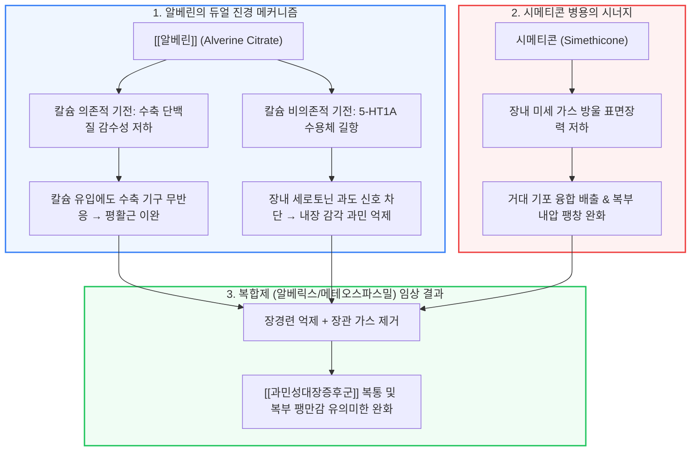

# 진경복합제 [[알베린]]과 시메티콘

📌 **한 줄 요약 (TL;DR)**: [[알베린]]과 시메티콘 복합제(알베릭스 등)는 장 평활근 수축 단백질의 칼슘 감수성(Sensitivity) 저하 및 5-HT1A 세로토닌 수용체 길항을 통한 칼슘 비의존성 내장 감각 과민 억제 기전에, 가스 표면장력을 낮추는 기포제거제(시메티콘)를 병합하여 저용량으로도 [[과민성대장증후군]]의 복부 팽만과 경련성 통증을 상승적으로 완화한다.

---

## 📸 1. 시각적 요약

---

## 🔑 2. 핵심 개념 및 원리

- **수축 단백질의 칼슘 감수성 감소(Reduced Sensitivity of Contractile Proteins)**:  
  - 과거에는 단순히 세포 외 칼슘 유입 차단으로 생각되었으나, 실제로는 세포 내로 칼슘이 유입되더라도 평활근의 수축 기구(마이오신 경쇄 인산화 복합체)가 칼슘에 반응하지 못하도록 둔감화시키는 독특한 이완 기전을 가짐.  
- **5-HT1A 세로토닌 수용체 길항을 통한 내장 통각 과민(Visceral Hypersensitivity) 완화**:  
  - 장신경계에서 장관 운동과 통각 전달을 매개하는 세로토닌 경로 중 5-HT1A 수용체를 차단하여 과도한 내장 감각 신호 전달을 억제하고 장관 과운동성을 정상화함.  
- **시메티콘(Simethicone)과의 상호보완적 복합제 설계**:  
  - 장내 미세 가스 기포 표면장력을 감소시켜 방귀나 트림으로 쉽게 합쳐져 배출되도록 도움.  
  - 가스로 인한 장벽 기계적 팽창 자극이 줄어들면 알베린을 소량만 사용해도 뛰어난 통증 조절 효과를 유도할 수 있어 약물 이상반응을 최소화함.

**관련 질환 및 약물 키워드**: [[과민성대장증후군]], [[알베린]]

---

## 📝 3. 본문 내용 정리

### 1) 알베린-시메티콘 복합제의 주요 적응증

- **가스 팽만형 [[과민성대장증후군]](IBS with Bloating)**:  
  - 식후 배가 빵빵하게 불러오면서 쥐어짜는 듯한 둔통이나 복부 불쾌감을 호소하는 환자.  
  - 통증 완화와 팽만감 감소라는 두 마리 토끼를 동시에 잡는 1차 선택 약제.  
- **기능성 소화불량 및 복부 팽만**:  
  - 기질적 병변이 없는 만성 기능성 복통 및 가스 저류 증상에 안전하게 적용.

### 2) 용법 및 안전성 프로파일

- **용법**: 알베린 구연산염 60mg + 시메티콘 300mg 복합 캡슐을 식전 1일 2~3회 복용.  
- **안전성**: 전신 흡수가 극히 적고 항콜린 부작용(입마름, 변비, 시야 흐림)이 없어 장기 투여 시에도 순응도가 높음.

---

## 💡 4. 임상 적용 및 실전 팁

### 1) 진료실 복약 지도 포인트

- "이 약은 장의 근육 경련을 풀어주는 성분과 장에 차 있는 가스 방울을 터뜨려 배출을 돕는 성분이 함께 들어 있어, 식사 후 배가 더부룩하고 가스가 차면서 살살 아플 때 매우 효과적입니다."

### 2) 놓치면 안 되는 주의사항 및 Red Flags

- 🚨 **Red Flag: 기계적 장폐색 및 급성 복부 질환**: 장관 협착, 장중첩증, 마비성 장폐색 환자에게 복통 완화 목적으로 투여해서는 안 되며, 배변 및 가스 배출이 완전히 멈추고 구토가 동반되는 경우 즉각적인 복부 단순촬영(X-ray) 및 외과적 감별이 필수적임.

---

## ➕ 5. 보충 근거 (최신 지견)

- **알베린-시메티콘 복합제의 과민성 대장증후군 3상 임상시험 (2010)**:  
  - [Clinical trial: the efficacy of alverine citrate/simeticone combination on abdominal pain/discomfort in irritable bowel syndrome--a randomized, double-blind, placebo-controlled study (Aliment Pharmacol Ther 2010;31:652-664, PMID: 20003095)](https://pubmed.ncbi.nlm.nih.gov/20003095/)  
  - 412명의 IBS 환자를 대상으로 4주간 투여 시 위약군 대비 복통/불쾌감 점수 및 삶의 질(IBS-QoL)을 통계적으로 유의하게 개선함을 다기관 RCT로 입증.  
- **알베린-시메티콘의 필요시(On-demand) 치료 임상 연구 (2014)**:  
  - [On-demand treatment with alverine citrate/simeticone compared with standard treatments for irritable bowel syndrome: results of a randomised pragmatic study (Aliment Pharmacol Ther 2014;39:245-254, PMID: 24147869)](https://pubmed.ncbi.nlm.nih.gov/24147869/)  
  - 증상 발생 시 복용하는 온디맨드 요법에서도 기존 일상 표준 치료 대비 동등 이상의 복부 증상 조절 및 뛰어난 비용 효과성을 보고.

---

## Reference

- [복통을 줄여주는 약 - 알베릭스 (내과 의사 기역)](https://www.youtube.com/watch?v=ak3CUT8ZQHU)  
- [Clinical trial: the efficacy of alverine citrate/simeticone combination in IBS (Aliment Pharmacol Ther 2010;31:652-664, PMID: 20003095)](https://pubmed.ncbi.nlm.nih.gov/20003095/)  
- [On-demand treatment with alverine citrate/simeticone compared with standard treatments for IBS (Aliment Pharmacol Ther 2014;39:245-254, PMID: 24147869)](https://pubmed.ncbi.nlm.nih.gov/24147869/)
