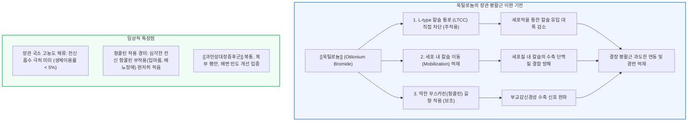

# 진경제 [[옥틸로늄]]

📌 **한 줄 요약 (TL;DR)**: [[옥틸로늄]](http://메녹틸)은 장관 평활근의 L-type 전압개폐성 칼슘 통로 차단 및 세포 내 칼슘 이동(Mobilization) 억제를 주작용으로 하고, 부스코판 대비 미약한 항콜린 작용을 보조적으로 겸비하여 전신 부작용 부담 없이 [[과민성대장증후군]]의 복통 및 과도한 장관 연동항진을 억제하는 진경제이다.

---

## 📸 1. 시각적 요약

---

## 🔑 2. 핵심 개념 및 원리

- **L-type 칼슘 통로(LTCC) 차단 중심의 직접 진경 기전**:  
  - 장관 평활근 세포막에 존재하는 지속성(Long-lasting) 고전압 활성화 L-type 칼슘 통로를 억제하여 세포 내 칼슘 유입을 차단함.  
  - 일부 T-type 칼슘 통로 억제 효과도 함께 보고되어 평활근 흥분-수축 결합을 효과적으로 차단함.  
- **세포 내 칼슘 동원(Mobilization) 차단**:  
  - 세포 내로 칼슘이 소량 유입되더라도 수축 단백질 복합체로 퍼져나가는 이동 경로를 억제하여 잔여 수축력을 무력화함.  
- **부스코판 대비 미약한 항콜린 작용과 안전역**:  
  - 무스카린 수용체 차단 작용을 일부 지니지만 부스코판에 비해 결합력이 훨씬 약함.  
  - 따라서 녹내장이나 전립선 비대증 환자에서 절대적 금기가 아닌 '신중 투여' 수준으로 안전역이 넓음.

**관련 질환 및 약물 키워드**: [[과민성대장증후군]], [[녹내장]], [[옥틸로늄]]

---

## 📝 3. 본문 내용 정리

### 1) 주요 적응증 및 투약법

- **용법**: 옥틸로늄 브로마이드 1회 20~40mg 1일 2~3회 식전 복용.  
- **적응증**: [[과민성대장증후군]]의 경련성 복통, 기능성 결장경련, 소화기 내시경 검사 전 전처치(장관 연동 억제).

### 2) 안전성 및 장점

- 장관에 흡수되지 않고 국소적으로 머물러 작용하므로 심혈관계나 중추신경계 영향이 거의 없음.  
- 변비 유발 경향이 타 진경제에 비해 적어 설사형 또는 혼합형 IBS 환자에게 적합.

---

## 💡 4. 임상 적용 및 실전 팁

### 1) 진료실 처방 노하우

- **식전 20~30분 복용**: 식사에 의한 위-대장 반사(Gastrocolic reflex)로 인한 식후 경련성 복통을 예방하기 위해 식전에 복용하도록 지도.  
- **고령자 복통 처방**: 배뇨 장애가 있는 고령 남성에게 항콜린성 진경제를 피해야 할 때 안전하게 선택할 수 있는 1차 옵션.

### 2) 놓치면 안 되는 주의사항 및 Red Flags

- 🚨 **Red Flag: 폐쇄각 [[녹내장]] 환자 주의**: 전신 항콜린 작용이 약하더라도 방수 유출을 방해할 수 있으므로, 폐쇄각 녹내장 병력자에게는 안압 변화를 면밀히 모니터링하거나 비항콜린성 진경제(트리메부틴 등)로 대체해야 함.

---

## ➕ 5. 보충 근거 (최신 지견)

- **옥틸로늄 브로마이드의 과민성 대장증후군 다기관 임상 연구 (OBIS Study)**:  
  - [Efficacy of otilonium bromide in irritable bowel syndrome: a pooled analysis (PMC5305018)](https://pmc.ncbi.nlm.nih.gov/articles/PMC5305018/)  
  - IBS 환자 대상 대규모 임상 연구 풀드 분석에서 옥틸로늄이 위약군 대비 복통 발생 빈도와 복부 팽만감을 유의미하게 감소시키며 우수한 내약성을 보임을 입증.  
- **아시아 IBS 환자 대상 옥틸로늄 평가 연구**:  
  - [The Evaluation of Otilonium Bromide Treatment in Asian Patients with Irritable Bowel Syndrome (PMC3228981)](https://pmc.ncbi.nlm.nih.gov/articles/PMC3228981/)  
  - 아시아인 IBS 환자 코호트에서 옥틸로늄의 장관 과민도 개선 및 임상 증상 호전 유효성을 규명.

---

## Reference

- [복통을 줄여주는 약 - 메녹틸 (내과 의사 기역)](https://www.youtube.com/watch?v=yg7r2c2UIaQ)  
- [Efficacy of otilonium bromide in irritable bowel syndrome: a pooled analysis (PMC5305018)](https://pmc.ncbi.nlm.nih.gov/articles/PMC5305018/)  
- [The Evaluation of Otilonium Bromide Treatment in Asian Patients with IBS (PMC3228981)](https://pmc.ncbi.nlm.nih.gov/articles/PMC3228981/)
