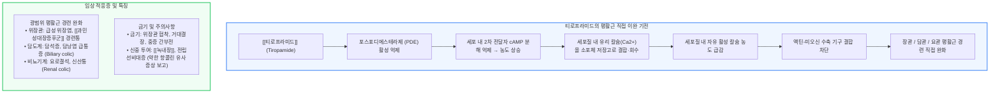

# 진경제 [[티로프라미드]]

📌 **한 줄 요약 (TL;DR)**: [[티로프라미드]](http://티로파)는 포스포디에스테라제(PDE) 억제를 통해 세포 내 cAMP를 증가시켜 세포질 내 유리 칼슘을 세포 내 저장고로 회수함으로써 평활근을 직접 이완시키며, 위장관뿐 아니라 담관, 요관, 신장 평활근의 경련성 산통 전반에 효과적인 비항콜린성 진경제이다.

---

## 📸 1. 시각적 요약

---

## 🔑 2. 핵심 개념 및 원리

- **PDE 억제와 세포 내 칼슘 격리(Calcium Sequestration)**:  
  - 근육 수축의 최종 신호인 세포질 내 유리 칼슘($Ca^{2+}$)을 줄이는 기전임.  
  - 티로프라미드는 cAMP 분해를 차단하여 cAMP-의존성 단백질 키나아제(PKA) 활성화를 통해 세포질의 칼슘을 근형질세망(Sarcoplasmic reticulum) 저장고 안으로 강제 격리시킴.  
- **자율신경 비의존적 직접 평활근 친화성(Musculotropic Action)**:  
  - 부교감신경 무스카린 수용체 차단제가 아니므로 전통적 항콜린제에 비해 전신 부작용이 적고, 자율신경 지배와 무관하게 경련 중인 평활근에 직접 작용함.  
- **광범위 장기 적응성 (위장관, 담도, 비뇨기계)**:  
  - 소화관의 평활근뿐 아니라 담도계 담낭/담관 평활근, 요로계 신우/요관 평활근에도 강력히 작용하므로 내과와 비뇨의학과에서 산통 완화제로 널리 쓰임.

**관련 질환 및 약물 키워드**: [[과민성대장증후군]], [[녹내장]], [[티로프라미드]]

---

## 📝 3. 본문 내용 정리

### 1) 약제 용법 및 임상 효능

- **경구 제제**: 티로프라미드 염산염 1회 100mg 1일 2~3회 복용.  
- **주사 제제**: 급성 산통(담석 산통, 요로 산통) 발생 시 근육주사 또는 정맥주사로 즉각적 경련 완화.  
- **임상적 강점**: 위경련, 장경련뿐 아니라 요로결석 배출 시의 극심한 산통(Renal colic)에도 뛰어난 진경 효과 발휘.

### 2) 안전성 및 부작용 감별

- 약리학적으로는 항콜린제가 아니지만, 실제 임상 보고에서 가벼운 구갈, 구역, 변비 등이 드물게 관찰됨.  
- 따라서 명확한 금기는 아니더라도 협우각 [[녹내장]] 환자나 배뇨 곤란이 심한 전립선비대증 환자에서는 주의 깊게 관찰하며 투여해야 함.

---

## 💡 4. 임상 적용 및 실전 팁

### 1) 진료실 처방 노하우

- **복합 산통 환자에서의 유용성**: 복통의 원인이 장염인지, 담석인지, 요로결석인지 감별 중인 초기 진료 상황에서 환자의 극심한 경련성 통증을 완화하는 데 매우 유용한 선택지임.

### 2) 놓치면 안 되는 주의사항 및 Red Flags

- 🚨 **Red Flag: 기계적 위장관 협착 및 거대결장 환자 투여 절대 금기**: 기계적 장폐색, 유문부 협착, 중증 장폐색 환자에게 평활근 이완제를 투여하면 장관 팽창 및 천공 위험이 높아지므로 절대 금기임.

---

## ➕ 5. 보충 근거 (최신 지견)

- **티로프라미드의 복부 경련성 통증 임상 평가 고전 연구**:  
  - [Clinical evaluation of tiropamide in abdominal spastic pain (Hepatogastroenterology 1990;37:59-62, PMID: 2407639)](https://pubmed.ncbi.nlm.nih.gov/2407639/)  
  - 위장관, 담도계 및 요로계의 급성 경련성 복통 환자에서 티로프라미드의 우수한 진경 효과와 항콜린성 부작용 빈도의 현저한 감소를 규명.  
- **티로프라미드의 세포 내 칼슘 및 PDE 기전 연구**:  
  - [Antispasmodic activity of tiropamide and its mechanism on smooth muscle (Curr Med Res Opin 1984;9:230-236, PMID: 6386377)](https://pubmed.ncbi.nlm.nih.gov/6386377/)  
  - 평활근 세포 내 cAMP 증가 및 칼슘 결합 촉진을 통한 직접적 근육 이완 메커니즘을 규명.

---

## Reference

- [복통을 줄여주는 약 - 티로파(tiropamide)의 작용기전 (내과 의사 기역)](https://www.youtube.com/watch?v=fp6SCWoQkag)  
- [Clinical evaluation of tiropamide in abdominal spastic pain (Hepatogastroenterology 1990;37:59-62, PMID: 2407639)](https://pubmed.ncbi.nlm.nih.gov/2407639/)  
- [Antispasmodic activity of tiropamide and its mechanism on smooth muscle (Curr Med Res Opin 1984;9:230-236, PMID: 6386377)](https://pubmed.ncbi.nlm.nih.gov/6386377/)
