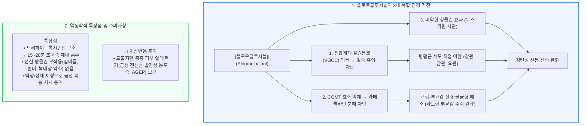

# 진경제 [[플로로글루시놀]]

📌 **한 줄 요약 (TL;DR)**: [[플로로글루시놀]](http://후로스판)은 전압개폐성 칼슘 통로 억제를 통한 평활근 직접 이완과 COMT 억제를 통한 카테콜라민성 긴장 정상화라는 독특한 다면 기전을 가지며, 항콜린 부작용이 거의 없고 페놀성 구조에 의해 15~20분 만에 초고속으로 흡수되어 [[과민성대장증후군]], 요로·담도 산통의 급성 경련성 복통 완화에 매우 효과적인 진경제이다.

---

## 📸 1. 시각적 요약

---

## 🔑 2. 핵심 개념 및 원리

- **전압개폐성 칼슘 통로(VGCC) 직접 억제와 광범위 평활근 선택성**:  
  - 세포 외 칼슘이 세포막의 L-type 칼슘 통로를 통해 평활근 세포 내로 유입되는 것을 직접 억제함.  
  - 소화관뿐만 아니라 담관, 요관, 자궁 평활근의 경련성 수축을 모두 이완시키므로 소화기 급통증, 요로결석 산통, 생리통 완화에 광범위하게 활용됨.  
- **COMT(Catechol-O-methyltransferase) 억제와 자율신경 균형 조절**:  
  - 카테콜라민(노르에피네프린 등)을 분해하는 COMT 효소를 억제하여 국소 아드레날린성 긴장도를 유지시킴.  
  - 과도하게 항진된 부교감신경(콜린성)의 수축 신호를 교감신경성 긴장 완화로 상쇄하는 독특한 완충 작용을 발휘함.  
- **초고속 흡수(15~20분)와 뛰어난 안전성**:  
  - 벤젠 고리에 수산기(-OH)가 3개 결합된 수용성 대칭 분자 구조로 인해 위장관 점막에서 15~20분 이내에 매우 신속히 흡수됨.  
  - 부스코판 등 전통적 항콜린제에서 흔한 구갈, 시야 장애, 빈맥, 배뇨 장애, 변비 유발이 거의 없음.

**관련 질환 및 약물 키워드**: [[과민성대장증후군]], [[플로로글루시놀]]

---

## 📝 3. 본문 내용 정리

### 1) 제형별 임상 선택 및 투약법

- **액상 제제 (시럽/스틱 파우치)**: 섭취 즉시 위장관 점막에 접촉 흡수되므로, 쥐어짜는 급성 복통 발생 시 15분 내 신속한 증상 호전을 기대할 수 있음.  
- **정제 제제**: 1회 80~160mg 1일 3회 복용. 통증 지속 시 또는 정맥/근육 주사제로도 원내 응급 처치 가능.

### 2) 적응증 범위

- 위장관 경련 및 복통: [[과민성대장증후군]], 급성 장염, 기능성 소화불량.  
- 비뇨생식기 경련: 담관 산통, 요로결석 발작 시 보조 요법, 월경곤란증(월경통).

---

## 💡 4. 임상 적용 및 실전 팁

### 1) 진료실 처방 노하우

- **고령자 및 전립선 비대증 환자의 안전한 선택**: 항콜린제 복용 시 급성 요폐(Urinary retention) 위험이 높은 고령 남성이나 녹내장 환자에게 플로로글루시놀은 안심하고 처방할 수 있는 1차 진경제임.  
- **빠른 통증 완화 안내**: "이 약은 흡수가 매우 빨라 복용 후 20분 안팎으로 장 경련이 가라앉습니다. 쥐어짜는 듯이 아플 때 식사와 상관없이 바로 복용하셔도 됩니다."

### 2) 놓치면 안 되는 주의사항 및 Red Flags

- 🚨 **Red Flag: 급성 전신성 발진성 농포증(AGEP, Acute Generalized Exanthematous Pustulosis)**:  
  - 플로로글루시놀 복용 수일 이내에 고열과 함께 전신 피부에 수많은 무균성 소농포(Pustules)가 급격히 발생하는 중증 피부약물유해반응이 드물게 보고되었음. 약물 복용 후 피부 발진이나 농포 발생 시 즉각 투약을 중단하고 응급실로 의뢰해야 함.

---

## ➕ 5. 보충 근거 (최신 지견)

- **설사형 과민성 대장증후군 환자에서의 플로로글루시놀 임상 연구 (2020)**:  
  - [The Effect of Phloroglucinol in Patients With Diarrhea-predominant Irritable Bowel Syndrome (J Neurogastroenterol Motil 2020;26:84-93, PMID: 31917916)](https://pubmed.ncbi.nlm.nih.gov/31917916/)  
  - IBS-D 환자에서 플로로글루시놀 투여가 복통의 강도 및 빈도를 유의미하게 감소시키고 우수한 약물 순응도와 내약성을 나타냄을 입증.  
- **과민성 대장증후군에서의 플로로글루시놀 효능 무작위 대조 시험**:  
  - [Phloroglucinol in irritable bowel syndrome (J Pak Med Assoc 2006;56:5-8, PMID: 16454126)](https://pubmed.ncbi.nlm.nih.gov/16454126/)  
  - 경련성 복부 산통 환자에서 플로로글루시놀의 빠른 복통 완화 효과와 항콜린성 이상반응 부재를 규명.

---

## Reference

- [복통을 줄여주는 약 - 후로스판 (내과 의사 기역)](https://www.youtube.com/watch?v=R9jzqO0b-Qk)  
- [The Effect of Phloroglucinol in Patients With Diarrhea-predominant Irritable Bowel Syndrome (J Neurogastroenterol Motil 2020;26:84-93, PMID: 31917916)](https://pubmed.ncbi.nlm.nih.gov/31917916/)  
- [Phloroglucinol in irritable bowel syndrome (J Pak Med Assoc 2006;56:5-8, PMID: 16454126)](https://pubmed.ncbi.nlm.nih.gov/16454126/)
