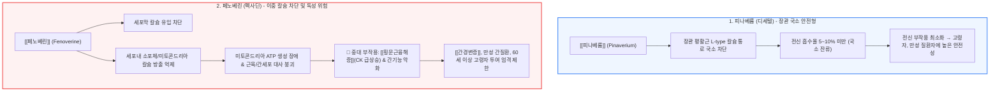

# 진경제 [[피나베륨]]과 [[페노베린]]

📌 **한 줄 요약 (TL;DR)**: 장관 평활근 칼슘 통로를 억제하는 진경제 중 [[피나베륨]](http://디세텔)은 전신 흡수가 거의 없이 장관 국소에만 선택적으로 작용하여 고령자나 복합 질환자에게 매우 안전한 반면, [[페노베린]](http://펙사딘)은 세포외 칼슘 유입뿐 아니라 세포내 미토콘드리아 칼슘 유리까지 억제하여 강력하지만, 미토콘드리아 손상에 의한 [[횡문근융해증]] 및 간독성 위험이 있어 [[간경변증]]이나 만성 간질환 환자에게 엄격히 금기이다.

---

## 📸 1. 시각적 요약

---

## 🔑 2. 핵심 개념 및 원리

- **[[피나베륨]]의 국소 소화관 선택성과 낮은 생체이용률**:  
  - 친유성 4차 아민 구조로 인해 경구 투여 시 전신 혈액으로의 흡수가 5~10% 미만으로 극히 미미함.  
  - 대부분이 장관 점막과 담도계에 고농도로 체류하면서 국소 평활근 칼슘 통로만 선택 차단하므로, 심혈관계나 전신 조직에 미치는 부작용 없이 대장 과민성과 복통을 완화함.  
- **[[페노베린]]의 듀얼 칼슘 차단 기전과 세포 대사 독성**:  
  - 세포 외 칼슘 유입 억제뿐만 아니라 세포 내 칼슘 저장고(근형질세망 및 미토콘드리아)로부터의 칼슘 방출까지 동시 억제함.  
  - 이로 인해 장관 이완력은 강력하지만, 근육 세포와 간세포 미토콘드리아의 에너지(ATP) 대사를 교란하여 세포 괴사 및 사멸을 초래할 수 있음.  
- [**[횡문근융해증]**](http://Rhabdomyolysis)**의 약리 메커니즘**:  
  - 골격근 세포의 칼슘 항상성이 붕괴되고 에너지가 고갈되면 근섬유가 파괴되어 미오글로빈과 크레아틴키나아제(CK)가 혈중으로 유출됨. 신세뇨관 폐색으로 급성 신손상을 유발할 수 있음.

**관련 질환 및 약물 키워드**: [[과민성대장증후군]], [[횡문근융해증]], [[간경변증]], [[간염]], [[피나베륨]], [[페노베린]]

---

## 📝 3. 본문 내용 정리

### 1) 약제별 안전성 프로파일 비교

- **[[피나베륨]](Pinaverium - 디세텔 50mg)**:  
  - 1회 50mg 1일 3회 식사 중 복용.  
  - 식도 자극을 피하기 위해 물 한 컵과 함께 삼키고 누운 자세 복용 금지.  
  - 고령 환자, 신장/간기능 저하 환자에서도 용량 조절 없이 비교적 안전하게 처방 가능.  
- **[[페노베린]](Fenoverine - 펙사딘 100mg, 200mg)**:  
  - 1회 100~200mg 1일 2~3회 복용.  
  - **금기 대상**: [[간경변증]], 급·만성 [[간염]], 알코올성 간질환 환자, 미토콘드리아 근병증 환자, 12세 미만 소아.  
  - 60세 이상 고령자 및 지질저하제(스타틴, 피브레이트) 병용 환자에게는 횡문근융해증 위험이 극도로 높아 투여를 피해야 함.

### 2) 임상 처방 전략

- 안전성을 우선시하는 1차 외래 환경에서는 피나베륨이 훨씬 표준적이고 권장되는 선택이며, 페노베린은 엄격한 적응증 확인과 위험성 배제 후에만 극히 제한적으로 고려해야 함.

---

## 💡 4. 임상 적용 및 실전 팁

### 1) 진료실 복약 지도 및 안전 가이드

- **피나베륨 복용법**: "이 약은 식도 점막에 달라붙으면 궤양을 유발할 수 있으므로, 반드시 식사 중간에 충분한 물과 함께 똑바로 앉은 자세에서 삼키시고, 복용 직후 눕지 마십시오."

### 2) 놓치면 안 되는 주의사항 및 Red Flags

- 🚨 **Red Flag 1: 페노베린 복용 후 근육통 및 콜라색 소변**: 페노베린 복용 중 심한 근육통, 근력 약화, 짙은 갈색 소변(미오글로빈뇨)이 발생하면 즉시 복용을 중단하고 혈중 CK 수치 및 신기능 검사를 시행해야 함.  
- 🚨 **Red Flag 2: 만성 간질환자([[간경변증]])에게 페노베린 처방 금기**: 간 대사 능력 저하로 약물 축적 및 간독성, 치명적 횡문근융해증이 유발될 수 있으므로 절대 처방 금지.

---

## ➕ 5. 보충 근거 (최신 지견)

- **페노베린 연관 횡문근융해증의 발생률 및 위험인자 전국 단위 연구 (2020)**:  
  - [The incidence, risk factors, and clinical outcomes of rhabdomyolysis associated with fenoverine: A nationwide study (Pharmacoepidemiol Drug Saf 2020;29:725-731, PMID: 32334639)](https://pubmed.ncbi.nlm.nih.gov/32334639/)  
  - 페노베린 복용 환자에서 횡문근융해증 발생 위험을 분석하여, 특히 간경변증(LC) 및 만성 간질환 환자에서 위험비가 현저히 높음을 규명하고 신중한 처방을 경고.  
- **피나베륨 브로마이드의 과민성 대장증후군 치료 효능 (Lancet Gastroenterol Hepatol 연구)**:  
  - [Efficacy of pinaverium bromide in the treatment of irritable bowel syndrome (PMC8447090)](https://pmc.ncbi.nlm.nih.gov/articles/PMC8447090/)  
  - 피나베륨이 위약 대비 IBS 복통 및 배변 습관 개선에서 통계적으로 유의하며 전신 이상반응이 위약군과 차이가 없음을 입증.  
- **페노베린 유발 횡문근융해증 최초 증례 보고**:  
  - [Fenoverine-induced rhabdomyolysis (Lancet 1995;346:1165, PMID: 7576832)](https://pubmed.ncbi.nlm.nih.gov/7576832/)  
  - 페노베린 투여 후 발생한 급성 횡문근융해증 및 피브레이트 병용 시의 위험성을 최초로 임상 보고.

---

## Reference

- [복통을 줄여주는 약 - 디세텔, 펙사딘 (내과 의사 기역)](https://www.youtube.com/watch?v=hsfh7Zfc5EU)  
- [The incidence, risk factors, and clinical outcomes of rhabdomyolysis associated with fenoverine (Pharmacoepidemiol Drug Saf 2020;29:725-731, PMID: 32334639)](https://pubmed.ncbi.nlm.nih.gov/32334639/)  
- [Efficacy of pinaverium bromide in the treatment of irritable bowel syndrome (PMC8447090)](https://pmc.ncbi.nlm.nih.gov/articles/PMC8447090/)  
- [Fenoverine-induced rhabdomyolysis (Lancet 1995;346:1165, PMID: 7576832)](https://pubmed.ncbi.nlm.nih.gov/7576832/)
