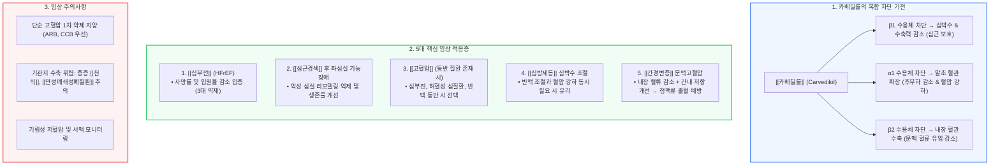

# [[카베딜롤]]

📌 **한 줄 요약 (TL;DR)**: [[카베딜롤]]은 비선택적 β1, β2 차단과 α1 혈관확장 작용을 겸비하여 단순 [[고혈압]]의 1차 약제는 아니지만, [[심부전]](http://HFrEF), [[심근경색]] 후 좌심실 기능부전, [[심방세동]]의 심박수 조절, 그리고 [[간경변증]]에 동반된 문맥고혈압 및 정맥류 출혈 예방에서 독보적인 임상적 유용성을 가진다.

---

## 📸 1. 시각적 요약

---

## 🔑 2. 핵심 개념 및 원리

- **복합 차단(β1 + β2 + α1)을 통한 혈역학적 최적화**:  
  - 기존의 순수 베타차단제가 말초 혈관 저항을 일시적으로 올릴 수 있는 반면, 카베딜롤은 α1 수용체 차단을 통해 말초 혈관을 확장(혈관 저항 감소)시킴으로써 심장의 후부하(Afterload)를 줄이고 심박출 저하를 완충함.  
  - 심박수 감소를 통한 심근 산소 소모 억제와 혈관 확장을 통한 혈압 강하 효과가 균형을 이룸.  
- **단순 고혈압 1차 약제로 부적합한 이유**:  
  - 혈압 강하 능력 자체는 우수하지만, 기저 질환이 없는 단순 고혈압에서는 기관지 수축 위험, 혈당/지질 대사 영향, 심박수 저하 등 불필요한 다면적 작용이 수반됨.  
  - 대규모 심혈관 예방 근거가 풍부한 ARB나 [[암로디핀]] 등의 CCB가 1차 치료제로 훨씬 우월함.  
- **간경변증 문맥고혈압에서의 특화된 기전**:  
  - β2 차단으로 내장 혈관(Splanchnic bed)을 수축시켜 문맥으로 유입되는 혈류량을 감소시킴.  
  - α1 차단 작용이 간내 혈관 저항을 감소시켜 문맥압 항진을 완화하므로, 정맥류 출혈 예방에서 전통적인 [[프로프라놀롤]]보다 강력한 문맥압 강하 효과를 나타냄.

**관련 질환 및 약물 키워드**: [[카베딜롤]], [[심부전]], [[심근경색]], [[고혈압]], [[심방세동]], [[간경변증]], [[비소프롤롤]], [[메토프롤롤]], [[프로프라놀롤]]

---

## 📝 3. 본문 내용 정리

### 1) 5대 주요 적응증별 임상적 가치

- **1. 박출률 감소 [[심부전]](http://HFrEF)**:  
  - [[비소프롤롤]], [[메토프롤롤]] 서방정과 함께 무작위 대조 임상시험(COPERNICUS 등)에서 사망률 감소를 증명한 필수 3대 약제.  
- **2. [[심근경색]] 후 좌심실 기능장애(Post-MI with LV Dysfunction)**:  
  - 심근경색 후 남은 정상 심근의 과도한 교감신경 보상 작용을 차단하여 심실 리모델링과 급사를 예방(CAPRICORN 연구).  
- **3. 특정 동반 질환이 있는 [[고혈압]]**:  
  - 협심증, 심근경색 병력, 심부전, 또는 안정 시 빈맥이 동반된 복합 고혈압 환자에서 우선적으로 고려.  
- **4. [[심방세동]] 환자의 심박수 조절(Rate Control)**:  
  - 빈맥성 심방세동 환자에서 심실 박동수를 조절하며, 특히 고혈압이 동반되어 혈압 강하가 동시에 필요한 경우 효과적.  
- **5. [[간경변증]]의 문맥고혈압 및 식도정맥류 출혈 예방**:  
  - 간경변 환자에서 위식도 정맥류 출혈의 1차 및 2차 예방에 비선택적 베타차단제로서 핵심 역할을 수행(Baveno VII 가이드라인).

### 2) 용량 조절 및 시작 원칙

- **심부전 환자**: 1회 3.125mg 1일 2회로 극저용량 시작 → 환자 상태를 보며 2주 간격으로 6.25mg, 12.5mg, 최대 25mg 1일 2회까지 점진적 증량(Titration).  
- **식후 복용 권장**: 음식물과 함께 복용하면 흡수 속도가 완만해져 α1 차단에 의한 급격한 혈관 확장과 기립성 저혈압 위험을 줄일 수 있음.

---

## 💡 4. 임상 적용 및 실전 팁

### 1) 진료실 처방 노하우

- **환자 맞춤형 설명**: "이 약은 혈압만 낮추는 단순한 혈압약이 아니라, 지친 심장 근육의 부담을 덜어주고 심장 모양이 망가지는 것을 막아주는 심장 보호제입니다."  
- **식사 직후 복용 지도**: 초기 어지럼증이나 기립성 저혈압을 예방하기 위해 반드시 아침, 저녁 식사 직후에 복용하도록 복약 지도.

### 2) 놓치면 안 되는 주의사항 및 Red Flags

- 🚨 **Red Flag 1: 호흡기 기저 질환 환자([[천식]], 중증 [[만성폐쇄성폐질환]])**:  
  - β2 수용체 차단 작용이 있어 기관지 평활근을 수축시키므로, 기관지 천식 환자에게는 원칙적으로 투여가 금기임.  
- 🚨 **Red Flag 2: 초기 기립성 저혈압 및 어지럼증**:  
  - α1 차단으로 인해 첫 투여 또는 증량 시 기립성 저혈압이 발생할 수 있으므로, 고령 환자에게 앉았다 일어날 때 천천히 움직이도록 경고해야 함.  
- 🚨 **Red Flag 3: 중증 간기능 부전 환자의 약물 축적**:  
  - 카베딜롤은 대부분 간에서 대사되므로 중증 간부전 환자에서는 생체이용률이 최대 수 배까지 증가할 수 있어 투여 시 면밀한 모니터링이 필요함.

---

## ➕ 5. 보충 근거 (최신 지견)

- **COPERNICUS 연구 (중증 심부전 사망률 감소 입증)**:  
  - [Effect of carvedilol on survival in severe chronic heart failure (N Engl J Med 2001;344:1651-1658, PMID: 11386263)](https://pubmed.ncbi.nlm.nih.gov/11386263/)  
  - 좌심실 박출률 25% 미만의 중증 심부전 환자 2,289명을 대상으로 카베딜롤 투여 시 위약군 대비 총 사망률을 35% 유의하게 감소시킴을 입증함.  
- **CAPRICORN 연구 (심근경색 후 좌심실 기능부전 예후 개선)**:  
  - [Effect of carvedilol on outcome after myocardial infarction in patients with left-ventricular dysfunction: the CAPRICORN randomised trial (Lancet 2001;357:1385-1390, PMID: 11348547)](https://pubmed.ncbi.nlm.nih.gov/11348547/)  
  - 급성 심근경색 후 좌심실 기능저하(LVEF ≤ 40%) 환자에서 카베딜롤 투여가 모든 원인에 의한 사망률과 재경색을 유의하게 줄임을 확인.  
- **Baveno VII 국제 합의 가이드라인 (문맥고혈압에서의 카베딜롤 권고)**:  
  - [Baveno VII – Renewing consensus in portal hypertension (J Hepatol 2022;76:959-974, PMID: 35000572)](https://pubmed.ncbi.nlm.nih.gov/35000572/)  
  - 간경변증에 동반된 임상적으로 유의한 문맥고혈압(CSPH) 및 비대상성 간경변 예방을 위한 1차 선택 비선택적 베타차단제로 카베딜롤(1일 12.5mg 이하)을 강력 권고함.

---

## Reference

- [카르베딜롤(carvedilol)은 언제 쓸까? 혈압은 잘 떨어지지만 1차 혈압약은 아닙니다 (내과 의사 기역)](https://www.youtube.com/watch?v=Y8Dx_jQEtQw)  
- [Effect of carvedilol on survival in severe chronic heart failure (N Engl J Med 2001;344:1651-1658, PMID: 11386263)](https://pubmed.ncbi.nlm.nih.gov/11386263/)  
- [Effect of carvedilol on outcome after myocardial infarction in patients with left-ventricular dysfunction: the CAPRICORN randomised trial (Lancet 2001;357:1385-1390, PMID: 11348547)](https://pubmed.ncbi.nlm.nih.gov/11348547/)  
- [Baveno VII – Renewing consensus in portal hypertension (J Hepatol 2022;76:959-974, PMID: 35000572)](https://pubmed.ncbi.nlm.nih.gov/35000572/)
