# [[콩코르]]와 [[인데놀]] 비교

📌 **한 줄 요약 (TL;DR)**: 동일한 베타차단제 계열이지만 [[비소프롤롤]](http://콩코르)은 긴 반감기(9~12시간, 1일 1회 복용)와 고선택적 β1 차단으로 심박수 조절 및 [[심부전]], [[협심증]]의 장기 유지 치료에 특화되어 있고, [[프로프라놀롤]](http://인데놀)은 짧은 반감기(3~6시간)와 비선택적(β1+β2) 차단 특성을 바탕으로 [[본태성 진전]], 무대 공포증, [[편두통]], [[갑상선기능항진증]] 등의 전신 교감신경 억제 및 필요시(PRN) 투여에 특화되어 있다.

---

## 📸 1. 시각적 요약

```mermaid
flowchart TD

    subgraph Bisoprolol["1. 비소프롤롤 (콩코르) - 심장 선택형"]

        B_Drug["[[비소프롤롤]] (Concor)"] --> B_Select["선택적 β1 차단 (심장 특화)"]

        B_Select --> B_Action["동방결절/방실결절 억제 & 심근 산소 소모 감소"]

        B_Action --> B_PK["반감기 9~12시간 → 1일 1회 복용 (만성 유지용)"]

        B_PK --> B_Ind["주요 적응증: [[심부전]](HFrEF 3대 약제), [[협심증]], 빈맥성 [[부정맥]]"]

    end

    subgraph Propranolol["2. 프로프라놀롤 (인데놀) - 전신 비선택형"]

        P_Drug["[[프로프라놀롤]] (Inderal)"] --> P_Select["비선택적 β1 + β2 차단 + 지용성(CNS 이행)"]

        P_Select --> P_Action["말초 근방추 센서 억제 & 중추 교감신경 톤 저하"]

        P_Action --> P_PK["반감기 3~6시간 → 1일 3~4회 또는 필요시(PRN) 복용"]

        P_PK --> P_Ind["주요 적응증: [[본태성 진전]], 수행불안, [[편두통]] 예방, [[갑상선기능항진증]]"]

    end

    style Bisoprolol fill:#eff6ff,stroke:#3b82f6,stroke-width:2px

    style Propranolol fill:#fef2f2,stroke:#ef4444,stroke-width:2px
```

---

## 🔑 2. 핵심 개념 및 원리

- **수용체 선택성(β1 vs β1+β2)에 따른 임상적 분기**:  
  - **[[비소프롤롤]]**: 심장 조직에 주로 분포하는 β1 수용체에 고선택적으로 작용하여 기관지(β2)나 말초 혈관(β2)에 미치는 간섭을 최소화함. 기관지 수축이나 말초 냉감 위험이 적어 순수 심혈관 질환에 안전하게 적용 가능.  
  - **[[프로프라놀롤]]**: β1과 β2를 고르게 차단함. 골격근 내 근방추의 β2 수용체 활성을 억제하여 떨림 진폭을 낮추고, 뇌혈관장벽(BBB)을 통과하는 높은 지용성으로 중추성 교감신경 긴장을 완화함.  
- **약동학적 지속시간(T1/2)과 투약 패턴**:  
  - 비소프롤롤: 반감기 약 10~12시간으로 1일 1회 경구 투여로 24시간 동안 안정된 심박수 억제 프로파일을 제공함.  
  - 프로프라놀롤: 반감기 약 3~6시간으로 작용 발현이 빠르고 소실이 빨라, 특정 상황(발표, 시험, 급격한 두근거림) 직전 단회 투여(PRN)에 최적화됨.

**관련 질환 및 약물 키워드**: [[심부전]], [[협심증]], [[부정맥]], [[본태성 진전]], [[편두통]], [[갑상선기능항진증]], [[천식]], [[비소프롤롤]], [[프로프라놀롤]]

---

## 📝 3. 본문 내용 정리

### 1) 부작용 프로파일의 뚜렷한 차이

- **비소프롤롤의 주 부작용 (심장 중심)**:  
  - 과도한 서맥(Sinus bradycardia), 방실 전도 장애(AV block), 피로감, 어지럼증.  
- **프로프라놀롤의 추가 부작용 (β2 차단 및 중추 이행)**:  
  - **기관지 연축**: 기저 [[천식]] 환자에서 치명적인 기관지 수축 유발 위험.  
  - **말초 순환 장애**: 말초 혈관 수축으로 인한 수족냉증 악화.  
  - **저혈당 마스킹**: 당뇨 환자에서 저혈당 경고 증상인 두근거림(β1)과 손떨림(β2)을 모두 가려버림.  
  - **중추신경계 영향**: 지용성 특성으로 인한 악몽(Vivid dreams), 수면 장애 가능성.

### 2) 진료실 처방 선택 가이드

- **콩코르 선택**: 박출률 감소 심부전(사망률 감소 입증), 안정형 협심증 환자의 심근 허혈 예방, 24시간 심박수 안정화가 필요한 만성 빈맥.  
- **인데놀 선택**: 본태성 진전 환자의 손떨림 완화, 발표 불안증 환자의 무대 공포증 완화(PRN), 편두통 환자의 예방 요법, 갑상선 중독증 초기 빈맥·떨림의 대증 치료.

---

## 💡 4. 임상 적용 및 실전 팁

### 1) 진료실 복약 지도 포인트

- **프로프라놀롤 PRN 복용법**: "시험이나 발표 40분~1시간 전에 10~20mg을 1회 복용하시면 떨림과 가슴 두근거림을 효과적으로 가라앉힐 수 있습니다. 매일 드실 필요는 없습니다."  
- **당뇨병 환자 주의 안내**: 인데놀 복용 중 저혈당이 오면 식은땀만 나고 가슴 두근거림이나 손떨림 경고 증상이 나타나지 않을 수 있으므로 혈당 측정을 더 자주 하도록 지도.

### 2) 놓치면 안 되는 주의사항 및 Red Flags

- 🚨 **Red Flag: 기관지 천식 병력 환자에게 프로프라놀롤 처방 절대 금기**: β2 차단으로 인한 급성 치명적 천식 발작을 유발할 수 있으므로, 천식 환자에서 베타차단제가 필요할 때는 심장 선택성 약제([[비소프롤롤]])를 최저 용량부터 극도로 신중하게 고려해야 함.

---

## ➕ 5. 보충 근거 (최신 지견)

- **CIBIS-II 다기관 무작위 대조 임상시험 (비소프롤롤의 심부전 생존율 입증)**:  
  - [The Cardiac Insufficiency Bisoprolol Study II (CIBIS-II): a randomised trial (Lancet 1999;353:9-13, PMID: 10023943)](https://pubmed.ncbi.nlm.nih.gov/10023943/)  
  - 중등도-중증 심부전(NYHA III-IV, LVEF ≤ 35%) 환자 2,647명을 대상으로 비소프롤롤 투여 시 총 사망률을 34% 유의하게 감소시킴을 증명.  
- **베타차단제 약동학 및 약력학 비교 문헌**:  
  - [Comparison of pharmacokinetic properties of beta-adrenoceptor blocking agents (Eur Heart J 1989;10:3-8, PMID: 2897304)](https://pubmed.ncbi.nlm.nih.gov/2897304/)  
  - 친유성(Propranolol)과 수용성/양친매성(Bisoprolol) 약제의 흡수, 간 대사율, 중추신경계 침투 및 반감기 차이를 체계적으로 분석.

---

## Reference

- [콩코르(bisoprolol) vs 인데놀(propranolol), 같은 베타차단제인데 왜 다르게 쓸까? (내과 의사 기역)](https://www.youtube.com/watch?v=io3bakqakBU)  
- [The Cardiac Insufficiency Bisoprolol Study II (CIBIS-II): a randomised trial (Lancet 1999;353:9-13, PMID: 10023943)](https://pubmed.ncbi.nlm.nih.gov/10023943/)  
- [Comparison of pharmacokinetic properties of beta-adrenoceptor blocking agents (Eur Heart J 1989;10:3-8, PMID: 2897304)](https://pubmed.ncbi.nlm.nih.gov/2897304/)
