# [[파모티딘]]과 [[라푸티딘]]

📌 **한 줄 요약 (TL;DR)**: H2 수용체 길항제 중 [[파모티딘]]은 혈중 농도와 위산 억제 효과의 상관관계가 명확하고 신기능별 용량 조절 기준이 확립된 표준 1차 약제이며, [[라푸티딘]]은 산 억제 외에 캡사이신 민감성 감각신경과 CGRP/NO 매개 위점막 방어 기전을 겸비하여 위점막 미란이나 진통제 유발 점막 손상이 동반된 경우 유용하다.

---

## 📸 1. 시각적 요약

```mermaid
flowchart TD

    subgraph Famotidine["1. 파모티딘 (순수 H2 차단 표준형)"]

        F_Drug["[[파모티딘]] (Famotidine)"] --> F_Mech["위벽세포 H2 수용체 선택적 차단"]

        F_Mech --> F_Effect["강력한 위산 분비 억제 (10~12시간)"]

        F_Effect --> F_PK["혈중 농도 ↔ 위내 pH 상승 상관성 매우 우수"]

        F_PK --> F_Elim["신장 배설 (65~70% 뇨중 미변화체)<br/>• [[만성콩팥병]] 시 명확한 감량 기준 확립"]

    end

    subgraph Lafutidine["2. 라푸티딘 (H2 차단 + 점막 방어 복합형)"]

        L_Drug["[[라푸티딘]] (Lafutidine)"] --> L_Mech1["H2 수용체 차단 (위산 억제)"]

        L_Drug --> L_Mech2["위점막 감각신경 자극 (방어 기전 촉진)"]

        L_Mech2 --> L_CGRP["CGRP 방출 → NO(산화질소) 생성 증가"]

        L_CGRP --> L_Protect["위점막 미세혈류 개선 & 점액 분비 촉진"]

        L_Protect --> L_Elim["간 대사(CYP 일부) + 신장 배설"]

    end

    subgraph ClinicalChoice["3. 임상 적응증별 선택 가이드"]

        direction TB

        Choice1["기본 1차 선택: [[파모티딘]]<br/>• 야간 위산 돌파(NAB) 취침 전 투여<br/>• PPI 감량 시 반동성 산과다 브릿지 요법<br/>• 단순 속쓰림의 필요시(PRN) 단기 투여"]

        Choice2["점막 병변 동반 시: [[라푸티딘]]<br/>• 내시경상 미란성 [[위염]] 확인 시<br/>• NSAIDs 진통제 복용 후 속쓰림/점막 자극 시"]

    end

    style Famotidine fill:#eff6ff,stroke:#3b82f6,stroke-width:2px

    style Lafutidine fill:#fef2f2,stroke:#ef4444,stroke-width:2px

    style ClinicalChoice fill:#f0fdf4,stroke:#22c55e,stroke-width:2px
```

---

## 🔑 2. 핵심 개념 및 원리

- **약력학(PD)적 차이: 순수 산 억제 vs 점막 방어 복합 작용**:  
  - [[파모티딘]]: 전형적인 강력한 H2 수용체 길항제로, 혈중 약물 농도와 위내 pH 상승 간의 반응 곡선이 선형적이고 정직하게 나타남. 야간 산 분비 억제 효과가 뛰어남.  
  - [[라푸티딘]]: H2 수용체 차단에 더해 위점막의 캡사이신 민감성 감각신경을 활성화함. 말단에서 CGRP(Calcitonin Gene-Related Peptide)를 방출시키고 산화질소(NO) 생성을 촉진하여 점막 혈류를 늘리고 점액 분비를 증가시키는 위점막 방어 기전을 가짐.  
- **약동학(PK)적 배설 경로의 임상적 함의**:  
  - [[파모티딘]]: 주 배설 경로가 신장임. 사구체여과율(eGFR) 저하 환자나 [[만성콩팥병]] 환자에서 혈중 축적 및 중추신경계 부작용(혼돈, 섬망 등)을 예방하기 위한 단계별 용량 감량 기준이 매우 명확함.  
  - [[라푸티딘]]: 간(CYP 효소군 일부 관여) 대사와 신장 배설이 병행됨. 신장 단독 부담은 상대적으로 적을 수 있으나, 신기능 저하 시 약물 축적 예측이 상대적으로 비선형적임.  
- **현대 소화기 치료에서 H2 차단제의 자리**:  
  - PPI 및 P-CAB 등장으로 궤양 치료의 1차 표준 지위는 양보했으나, 신속한 작용 발현, 필요시(PRN) 투여의 용이성, 야간 산 분비 돌파 조절에서 확고한 역할을 유지함.

**관련 질환 및 약물 키워드**: [[위식도역류질환]], [[위염]], [[소화성궤양]], [[만성콩팥병]], [[파모티딘]], [[라푸티딘]], [[시메티딘]]

---

## 📝 3. 본문 내용 정리

### 1) 약제별 세부 특성 비교

- [**[파모티딘]**](http://Famotidine):  
  - 1회 20~40mg 투여 시 10~12시간 동안 안정적인 위산 억제 유지.  
  - 오랜 사용 기간 동안 검증된 방대한 안전성 데이터 보유.  
  - 신장 기능 저하 환자에서 크레아티닌 청소율(CrCl)에 따른 명확한 감량 가이드라인 존재.  
- [**[라푸티딘]**](http://Lafutidine):  
  - 1회 10mg 1일 2회 또는 취침 전 10mg 투여.  
  - 감각신경 매개 점막 미세혈류 촉진 및 점액 분비 활성화로 점막 회복 지원.  
  - 과거 [[시메티딘]]과 같은 심각한 CYP 억제 수준은 아니나 간 대사가 일부 관여함.

### 2) 진료실 처방 선택 기준

- **[[파모티딘]]이 우선되는 경우 (기본값)**:  
  - 경증의 [[위식도역류질환]] 증상으로 필요할 때만 복용하는 PRN 요법.  
  - PPI 복용 환자에서 새벽에 산이 치밀어 오르는 야간 산 분비 돌파(Nocturnal Acid Breakthrough) 조절을 위한 취침 전 추가 투여.  
  - PPI 장기 복용 후 중단 시 발생하는 반동성 위산 과다 분비를 점진적으로 완화하기 위한 테이퍼링(브릿지) 요법.  
- **[[라푸티딘]] 고려가 유리한 경우**:  
  - 위내시경상 표재성 점막 손상, 미란성 [[위염]](Erosive Gastritis)이 확인된 환자.  
  - 소염진통제(NSAIDs) 복용으로 점막 방어막이 약화되어 속쓰림이나 점막 통증을 호소하는 경우 (단, 고위험군 궤양 예방에는 PPI가 우선).

---

## 💡 4. 임상 적용 및 실전 팁

### 1) 진료실 복약 지도 포인트

- **내성(Tachyphylaxis) 발생 주의**:  
  - H2 수용체 길항제는 매일 연속으로 복용할 경우 2~6주 이내에 수용체 상향 조절 등으로 인해 산 억제 효과가 떨어지는 내성이 발생할 수 있음.  
  - 따라서 장기 연속 복용보다는 필요시(PRN) 간헐 투여하거나, 야간 증상 발생 시 단기간 병용하는 용법이 가장 효과적임.  
- **취침 전 투여 타이밍**:  
  - 야간 속쓰림 예방 목적인 경우 저녁 식후보다는 취침 30분~1시간 전에 복용하도록 지도.

### 2) 놓치면 안 되는 주의사항 및 Red Flags

- 🚨 **Red Flag 1: [[만성콩팥병]] 환자에서의 고용량 파모티딘 투여**:  
  - 신기능이 저하된 고령자에게 파모티딘을 표준 용량(40mg/일)으로 지속 투여할 경우 약물 축적으로 인한 중추신경계 독성(기면, 섬망, 환각, 어지럼증)이 유발될 수 있음. 신기능(eGFR < 50 mL/min) 확인 시 20mg으로 감량 또는 격일 투여해야 함.  
- 🚨 **Red Flag 2: 경고 증상(Alarm Signs) 간과**:  
  - 연하곤란, 삼킴통증, 체중 감소, 토혈, 흑변, 빈혈 등이 동반된 환자에게 상비약처럼 H2 차단제만 처방해서는 안 되며, 반드시 상부위장관 내시경을 시행하여 조기 위암 및 중증 궤양을 감별해야 함.

---

## ➕ 5. 보충 근거 (최신 지견)

- **미국소화기학회(ACG) 위식도역류질환 진료지침 (2022)**:  
  - [ACG Clinical Guideline for the Diagnosis and Management of Gastroesophageal Reflux Disease (Am J Gastroenterol 2022)](https://pubmed.ncbi.nlm.nih.gov/34807007/)  
  - 중증 미란성 식도염의 치유 및 유지 요법에는 PPI가 H2RA보다 우월함을 명시함. 다만, 주간 PPI 치료에도 불구하고 객관적인 야간 산 역류가 지속되는 환자에서 취침 전 H2RA([[파모티딘]])의 단기 병용 요법을 조건부 권고함 (단, 장기 사용 시 내성 발생 가능성 명시).  
- **라푸티딘의 캡사이신 민감성 감각신경 및 점막 보호 기전 연구**:  
  - [Sensitizing effects of lafutidine on CGRP-containing afferent nerves in the rat stomach (Br J Pharmacol 2002)](https://pubmed.ncbi.nlm.nih.gov/11906962/)  
  - 라푸티딘이 H2 수용체 길항 작용과 독립적으로 캡사이신 민감성 구심성 신경을 자극하여 CGRP 방출 및 산화질소(NO) 매개 경로를 통해 위점막 혈류와 점액 생성을 촉진함을 규명.  
- **라푸티딘과 파모티딘의 약동학·약력학 비교 임상 연구**:  
  - [Pharmacokinetic and pharmacodynamic properties of lafutidine after postprandial oral administration in healthy volunteers: comparison with famotidine (Eur J Clin Pharmacol 2007)](https://pubmed.ncbi.nlm.nih.gov/17473452/)  
  - 파모티딘과 라푸티딘의 식후 경구 투여 후 혈중 농도 추이 및 24시간 위내 pH 변화를 비교하여, 파모티딘의 예측 가능한 혈중 농도 의존적 pH 상승과 라푸티딘의 점막 방어 복합 특성을 확인.

---

## Reference

- [H2 blocker, 무엇을 쓸 것인가 - famotidine vs lafutidine (내과 의사 기역)](https://www.youtube.com/watch?v=z6XDL2IjmW4)  
- [ACG Clinical Guideline: Guidelines for the Diagnosis and Management of Gastroesophageal Reflux Disease (Am J Gastroenterol 2022;117:27-56, PMID: 34807007)](https://pubmed.ncbi.nlm.nih.gov/34807007/)  
- [Sensitizing effects of lafutidine on CGRP-containing afferent nerves in the rat stomach (Br J Pharmacol 2002;135:1479-88, PMID: 11906962)](https://pubmed.ncbi.nlm.nih.gov/11906962/)  
- [Pharmacokinetic and pharmacodynamic properties of lafutidine after postprandial oral administration in healthy volunteers: comparison with famotidine (Eur J Clin Pharmacol 2007;63:659-67, PMID: 17473452)](https://pubmed.ncbi.nlm.nih.gov/17473452/)
