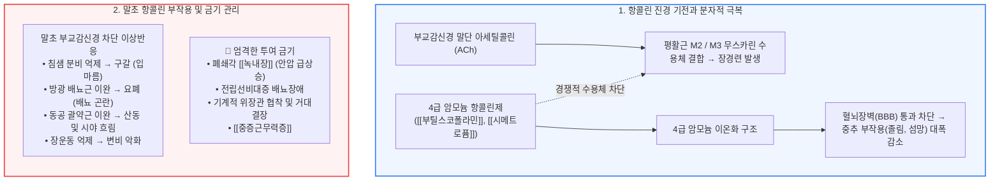

# 항콜린 진경제와 장경련

📌 **한 줄 요약 (TL;DR)**: 부교감신경 무스카린 수용체를 직접 차단하여 아세틸콜린 매개 장관 평활근 경련을 즉각적으로 멈추게 하는 전통적 진경제인 [[부틸스코폴라민]](http://부스코판)과 [[시메트로퓸]](http://알피움)은, 4급 암모늄(Quaternary ammonium) 구조를 도입하여 혈뇌장벽(BBB) 통과를 차단함으로써 중추 신경 부작용을 줄였으나, 말초 항콜린 작용에 의한 구갈, 배뇨 장애, [[녹내장]] 악화 및 기계적 장협착 시의 위험성으로 인해 엄격한 금기 관리가 필요하다.

---

## 📸 1. 시각적 요약

---

## 🔑 2. 핵심 개념 및 원리

- **무스카린 수용체(Muscarinic M2/M3) 차단 메커니즘**:  
  - 부교감신경 절후 섬유에서 분비되는 아세틸콜린이 장 평활근의 무스카린 수용체에 결합하는 것을 강력하게 경쟁적으로 길항함.  
  - 장관의 연동운동과 긴장도를 급격히 떨어뜨려 쥐어짜는 듯한 급성 산통(Colicky pain)을 즉각 완화함.  
- **스코폴라민에서 4급 암모늄 부틸스코폴라민으로의 화학적 진화**:  
  - 고전적 멀미약인 3급 아민 스코폴라민은 지용성으로 BBB를 통과해 중추 진정, 졸림, 기억장애, 섬망을 유발함.  
  - 질소에 부틸기(Butyl)를 결합하여 양전하를 띠는 4급 암모늄 유도체로 변형함으로써, 뇌 조직 침투를 방지하고 말초 장관 평활근에만 국소적으로 작용하도록 안전성을 개선함.  
- **전신 말초 항콜린 작용의 불가피한 동반**:  
  - 중추 부작용은 줄였으나, 말초 무스카린 수용체(침샘, 방광, 눈의 홍채) 차단은 여전히 발생하므로 용량 의존적 전신 항콜린 증상이 동반됨.

**관련 질환 및 약물 키워드**: [[과민성대장증후군]], [[녹내장]], [[중증근무력증]], [[부틸스코폴라민]], [[시메트로퓸]]

---

## 📝 3. 본문 내용 정리

### 1) 대표 약제 특성 비교

- **[[부틸스코폴라민]](Hyoscine butylbromide - 부스코판 10mg)**:  
  - 1회 10~20mg 1일 3~5회 복용. 원내 급성 산통 시 정맥/근육 주사제 널리 활용.  
  - 위경련, 담석 산통, 요로 산통, 내시경 전 장운동 억제에 가장 다빈도 처방.  
- **[[시메트로퓸]](Cimetropium bromide - 알피움 50mg)**:  
  - 4급 암모늄 구조의 벨라도나 알칼로이드 유도체.  
  - 1회 50mg 1일 2~3회 복용. [[과민성대장증후군]] 및 위장관 경련통에 주사 및 경구제로 활용.

### 2) 금기 질환 체크리스트

- **폐쇄각 [[녹내장]]**: 동공 산대로 인한 우각 폐색 및 급성 안압 상승 유발.  
- **배뇨 장애 및 전립선 비대증**: 방광 배뇨근 이완 및 괄약근 수축으로 급성 요폐 유발.  
- **기계적 장관 협착 / 마비성 장폐색**: 좁아진 장관의 움직임을 멈추게 하여 장폐색 및 장파열 위험.  
- **[[중증근무력증]]**: 신경근 접합부 아세틸콜린 작용을 억제하여 근무력 증상 치명적 악화.

---

## 💡 4. 임상 적용 및 실전 팁

### 1) 진료실 문진 및 처방 노하우

- **처방 전 2대 필수 확인**: "녹내장이 있으신가요?", "소변 보실 때 힘이 많이 들어가거나 시원하지 않은 전립선 문제가 있으신가요?"를 반드시 사전 문진해야 함.  
- **주사 투여 후 시야 흐림 주의**: 원내에서 부스코판 주사를 맞은 환자는 일시적인 시야 흐림과 조절 장애가 올 수 있으므로 운전이나 정밀 작업 주의 지도.

### 2) 놓치면 안 되는 주의사항 및 Red Flags

- 🚨 **Red Flag: 원인 미상 복통에서의 조기 투여**: 맹장염(충수돌기염), 게실염 등 외과적 응급 수술이 필요한 복부 질환 환자에게 통증 경감을 목적으로 투여하면 복막 자극 징후가 소실되어 오진을 유발할 수 있으므로 원인 감별 전 투여 금기.

---

## ➕ 5. 보충 근거 (최신 지견)

- **부틸스코폴라민의 복부 경련성 통증 치료 리뷰 (2026)**:  
  - [Hyoscine Butylbromide: A Review of its Use in Abdominal Cramping and Pain (NCBI Bookshelf 2023)](https://www.ncbi.nlm.nih.gov/books/NBK279415/)  
  - 경련성 복통 및 IBS 환자에서 부틸스코폴라민의 진경 효과와 4급 암모늄 구조에 의한 중추 신경 안전성 프로파일을 종합 고찰.  
- **부스코판의 장관 콜린성 경로 억제 임상 연구**:  
  - [Effect of hyoscine butylbromide on cholinergic pathways in the human intestine (Neurogastroenterol Motil)](https://www.ncbi.nlm.nih.gov/books/NBK279415/)  
  - 인간 소화관 조직에서 무스카린 수용체 결합을 통한 연동운동 억제 역학 분석.

---

## Reference

- [복통을 줄여주는 약 - 항콜린약제 (부스코판, 알피움) (내과 의사 기역)](https://www.youtube.com/watch?v=AWs3wklkKuM)  
- [Irritable bowel syndrome: What helps – and what doesn't (NCBI Bookshelf 2023)](https://www.ncbi.nlm.nih.gov/books/NBK279415/)
