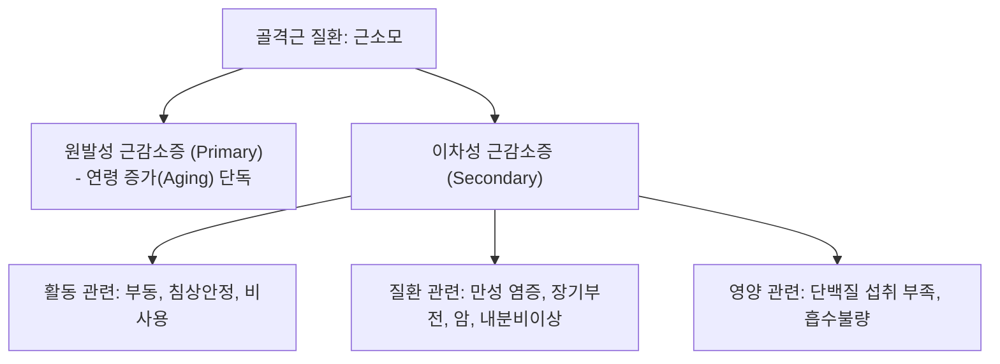
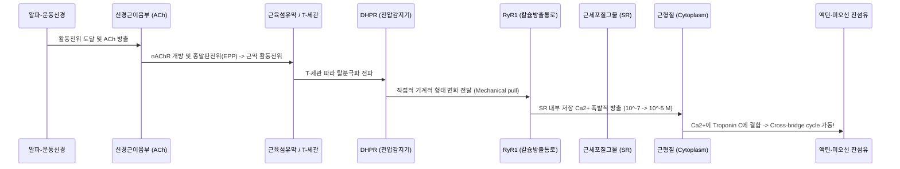

# 📑 [근감소증] PART 1. 개요: 서론과 개관 및 근육생리학

> **핵심 요약 (Key Summary)**
> - **[[근감소증]](Sarcopenia)** 은 노화 및 다양한 만성 질환에 의해 골격근의 양(Muscle mass), 근력(Muscle strength), 신체 기능(Physical performance)이 점진적으로 감소하는 진행성 골격근 질환이다. 2016년 미국 ICD-10-CM(`M62.84`) 및 2021년 한국 KCD-8(`M62.5`) 질병코드가 부여되어 정식 질환으로 확립되었다.
> - 진단은 `[[EWGSOP2]]`(2018), `[[AWGS]] 2019`, `[[KWGS]]`(2023) 합의지침을 중심으로 스크리닝(SARC-F, 핑거링 검사), 근력 저하(악력 [[HGS]]: 남 <28 kg, 여 <18 kg), 근육량 결손(DXA/BIA 기반 사지골격근량 지수)을 단계적으로 평가한다.
> - [[근감소증]] 단순 노화뿐 아니라 `[[골다공증]]`(Osteo-sarcopenia), `[[비만]]`(Sarcopenic obesity), `[[노쇠]]`(Frailty), `[[Cachexia]](악액질)`와 밀접하게 교차 연결되어 사망률과 낙상·골절 위험을 급증시킨다.
> - 골격근 수축은 **신경근이음부(NMJ)** 에서 [[아세틸콜린]](ACh) 방출, **가로세관(T-tubule)** 과 **디하이드로피리딘 수용체(DHPR)** - **리아노딘 수용체(RyR1)** 간의 **흥분-수축 연결(E-C coupling)**, 그리고 세포질 [[칼슘]]($Ca^{2+}$)이 **트로포닌(Troponin C)** 에 결합하여 일어나는 **연결다리 주기(Cross-bridge cycle)** 로 구동된다.
> - 수축 후 $Ca^{2+}$은 **SERCA**(근세포질그물 [[칼슘]] 펌프)에 의해 능동 재흡수되며, 근육은 부하 및 자극 빈도(가중, 강축), 운동단위 동원, 그리고 제1형(느린단일수축/적색)·제2형(빠른단일수축/백색) 근섬유 특성에 따라 정밀하게 수축력을 발휘한다.

---

## 📌 목차
1. [Chapter 01. 서론과 개관 (Introduction & Overview)](#chapter-01-서론과-개관-introduction--overview)
   - [1. 서론](#1-서론)
   - [2. 근육소실과 관련된 용어](#2-근육소실과-관련된-용어)
   - [3. 근소모성 질환의 분류](#3-근소모성-질환의-분류)
   - [4. 노화에 따른 근육의 변화](#4-노화에-따른-근육의-변화)
   - [5. 근감소증의 임상적 중요성](#5-근감소증의-임상적-중요성)
   - [6. 임상적 진단 기준 및 알고리즘](#6-임상적-진단-기준-및-알고리즘)
     - [EWGSOP (2010) 및 EWGSOP2 (2018) 진단기준](#1-ewgsop-2010-및-ewgsop2-2018-진단기준)
     - [AWGS (2014 & 2019) 아시아 진단기준](#2-awgs-2014--2019-아시아-진단기준)
     - [미국 FNIH 진단기준](#3-미국-fnih-진단기준)
     - [한국인을 대상으로 한 연구 (KNHANES)](#4-한국인을-대상으로-한-연구)
     - [KWGS (대한근감소증학회) 진단기준](#5-kwgs-대한근감소증학회-진단기준)
   - [7. 생화학적 표지자 (Biomarkers)](#7-생화학적-표지자-biomarkers)
   - [8. 근육-뼈 상관관계 (Muscle-Bone Crosstalk)](#8-근육-뼈-상관관계-muscle-bone-crosstalk)
   - [9. 근감소증성 골다공증 (Osteo-sarcopenia)](#9-근감소증성-골다공증-osteo-sarcopenia)
   - [10. 근감소성 비만 (Sarcopenic Obesity)](#10-근감소성-비만-sarcopenic-obesity)
   - [11. 보행/운동장애증후군 (Dysmobility Syndrome)](#11-보행운동장애증후군-dysmobility-syndrome)
   - [12. 근감소증의 예방 및 비약물요법](#12-근감소증의-예방-및-비약물요법)
   - [13. 근감소증을 위한 약물요법 현황](#13-근감소증을-위한-약물요법-현황)
   - [14. 결론](#14-결론)
2. [Chapter 02. 근육생리학 (Muscle Physiology)](#chapter-02-근육생리학-muscle-physiology)
   - [1. 서론 및 골격근의 구조](#1-서론-및-골격근의-구조)
     - [골격근의 육안구조](#1-골격근의-육안구조)
     - [미세구조: 신경근이음부 (NMJ)](#2-미세구조-신경근이음부-neuromuscular-junction-nmj)
     - [미세구조: 근원섬유마디 (Sarcomere)](#3-미세구조-근원섬유마디-sarcomere)
     - [근형질 및 막계통 (T-tubule & SR)](#4-근형질sarcoplasm-및-막계통membrane-system)
   - [2. 흥분-수축 연결 (Excitation-Contraction Coupling)](#2-흥분-수축-연결-excitation-contraction-coupling-ec-coupling)
   - [3. 연결다리 주기 (Cross-Bridge Cycle)](#3-연결다리-주기-cross-bridge-cycle)
   - [4. 근육 이완 및 칼슘 제거 기전](#4-근육-이완-및-칼슘-제거-기전)
   - [5. 골격근의 수축 역학 및 장력 발생](#5-골격근의-수축-역학-및-장력-발생)
     - [등척성 및 등장성 수축](#1-근육길이와-장력관계-등척성등장성-수축)
     - [길이-장력 관계 및 전부하 효과](#2-길이-장력-관계-length-tension-relationship-및-전부하-효과)
     - [후부하와 힘-속도 관계](#3-후부하afterload와-수축속도-관계)
     - [자극빈도와 장력발생 (단일수축, 가중, 강축)](#4-자극빈도와-장력발생-단일수축-가중-강축)
     - [운동단위 및 동원 원리](#5-운동단위motor-unit와-동원recruitment)
   - [6. 근섬유의 종류 및 대사적 특성](#6-근섬유의-종류-및-대사적-특성)
   - [7. 골격근의 가소성 및 재구성](#7-골격근의-가소성-및-재구성)
3. [출처 및 참고 문헌 (References)](#출처-및-참고-문헌-references)

---

# Chapter 01. 서론과 개관 (Introduction & Overview)
**저자: 박형무 (그레이스병원)**

## 1. 서론
- **골격근의 생리적 비중**: 근육은 체중의 약 40~50%를 차지하는 신체에서 가장 큰 단일 장기이다. 인체는 약 600개 이상의 근육으로 이루어져 있으며, 움직임(Movement), 힘쓰기(Force generation), [[호흡]](Respiration), 자세 및 균형 유지, 체온 조절, 그리고 체단백질의 주된 저장소(Amino acid reservoir)로서 핵심 기능을 수행한다.
- **신체 구성 성분과 근육량**:
  - 체중(Total body weight)은 체지방량(Fat mass)과 [[제지방량]](Lean body mass 또는 Fat-free mass)으로 구분된다.
  - [[제지방량]] 골염류량(Bone mineral content)을 제외한 연부조직을 연부제지방량(Lean soft tissue mass)이라 하며, 이 중 팔과 다리의 연부제지방량을 **사지골격근량(Appendicular Lean Soft Tissue, ALST 또는 Appendicular Skeletal Muscle Mass, ASM)** 이라고 부른다.
  - ALST는 전신 골격근량(Total-body skeletal muscle mass)과 매우 높은 상관관계($r > 0.95$)를 나타내므로 임상 및 연구에서 [[근감소증]] 측정의 핵심 대리 지표로 사용된다.

> ![[Sarcopenia_Ch01_p6_Fig1.png|540]]
> **그림 1-1. 신체의 구성 및 그림 1-2. Appendicular lean soft tissue (ALST)와 total-body skeletal muscle (SM) mass의 연관성.** 신체 체중(Total body mass)은 체지방과 제지방(Lean body mass)으로 나뉘며, 제지방 중 사지의 연부제지방량(ALST)은 전신 골격근량(Total body skeletal muscle mass)을 가장 정확하게 반영한다.

- **질병 분류의 역사적 전환점**:
  - 1989년 Irwin Rosenberg가 노화에 따른 근육 소실을 나타내기 위해 그리스어의 'sarx(살, muscle)'와 'penia(소실, loss)'를 합성하여 **[[근감소증]](Sarcopenia)** 이라는 용어를 처음 제안하였다.
  - 2016년 10월 미국 질병통제예방센터(CDC)에서 **ICD-10-CM 질병코드 `M62.84`** 를 공식 부여함으로써 독립된 질환으로 인정되었다.
  - 대한민국은 2021년 제8차 한국표준질병사인분류(KCD-8) 개정에서 [[근감소증]] **`M62.5`** 코드를 신설 부여하였고, 골격근량 측정 의료비용이 인정비급여로 산출되면서 임상적 제도화가 확립되었다.

---

## 2. 근육소실과 관련된 용어
골격근의 감소는 단순한 양적 감소뿐 아니라 질적 저하 및 전신 질환과 복합되어 나타나므로 정확한 감별이 필요하다.

### 표 1-1. 골격근 감소에 관한 주요 용어 정의
| 용어 | 영문 표기 | 정의 및 임상적 특징 |
| :--- | :--- | :--- |
| **[[근감소증]]** | **[[근감소증\|Sarcopenia]]** | 노화와 연관되어 발생하는 진행성·전신적인 골격근량 및 근력/기능의 감소 |
| **악액질** | **[[Cachexia]]** | 암, [[심부전]], 만성신부전 등 기저 만성 소모성 질환에 의해 체지방 및 골격근이 급격히 소모되는 대사 증후군 (염증성 시토카인 주도) |
| **근감소성 [[비만]]** | **Sarcopenic Obesity** | 골격근량의 감소와 체지방량(특히 내장지방)의 과도한 증가가 공존하는 상태 |
| **다이나페니아** | **Dynapenia** | 신경계 또는 근육 자체의 질적 변화로 인해 근육량 감소와 독립적으로 발생하는 노화성 근력의 소실 |
| **골격근 기능 결손** | **Skeletal Muscle Function Deficit (SMFD)** | 근육량의 수치적 결손에 국한하지 않고 근력, 신경근 조절, 대사 기능 장애를 포괄하는 기능적 결손 용어 |

---

## 3. 근소모성 질환의 분류

### (1) 병인에 따른 분류
근소모성 질환(Muscle wasting diseases)은 발병 원인과 영양·염증 상태에 따라 굶주림(Starvation), 악액질(Cachexia), [[근감소증]](Sarcopenia)으로 체계화된다.

> ![[Sarcopenia_Ch01_p9_Fig1.png|540]]
> **그림 1-3. 근소모성 질환의 분류.** 골격근 소실은 단순 기아(Starvation, 에너지 섭취 부족), 악액질(Cachexia, 만성 염증 및 대사항진), [[근감소증]](Sarcopenia, 노화 및 기능 저하)으로 구분되며 상호 중첩될 수 있다.

- **원발성 근감소증(Primary Sarcopenia)**: 연령 증가 자체(Aging) 외에 다른 명백한 원인을 찾을 수 없는 경우.
- **이차성 근감소증(Secondary Sarcopenia)**:
  - **활동 관련(Activity-related)**: 침상 안정, 부동(Bed rest), 비사용(Disuse), 무중력 상태 등.
  - **질환 관련(Disease-related)**: 중증 장기부전(심장, 폐, 간, 신장), 염증성 질환, 악성종양, 내분비 질환.
  - **영양 관련(Nutrition-related)**: 단백질·에너지 섭취 부족, 흡수장애, 위장관 질환, 식욕부진 유발 약물.

> ![[Sarcopenia_Ch01_p10_Fig1.png|540]]
> **그림 1-4. 근감소증의 원인별 분류 및 그림 1-5. 근감소증의 기전.** 노화, 신경근 연접부 퇴행, 미토콘드리아 기능부전, 동화호르몬 결핍, 만성 저등급 염증, 세포 자멸사 증가 등이 복합적으로 작용하여 근육량 소실을 유발한다.

---

## 4. 노화에 따른 근육의 변화

### (1) 근섬유 수와 크기의 퇴행성 변화
- **근섬유 수 감소**: 20세부터 80세 사이에 전체 골격근 섬유의 수가 약 **30~40% 감소**한다.
- **근섬유 선택적 위축**:
  - **제2형 근섬유(Type II, 빠른단일수축 백색근)**: 노화에 따른 선택적 위축이 현저하여 크기가 **10~40% 감소**한다.
  - **제1형 근섬유(Type I, 느린단일수축 적색근)**: 노화 과정에서도 크기와 수의 보존이 비교적 잘 유지된다.
- **운동단위 재구성(Motor unit remodeling)**: $\alpha$-운동신경세포의 퇴행 및 탈신경(Denervation)이 발생하면, 인접한 제1형 운동신경이 잔존 제2형 섬유를 재지배(Reinnervation)하여 근섬유의 군집화(Type grouping) 및 수축 속도 저하가 초래된다.

### (2) 근육량과 근력의 감소 속도 불일치
- **최대 근육량 달성 시기**: 남녀 모두 **20~40세 (약 25세 전후)** 에 정점에 도달한다.
- **감소율**: 40세 이후 70세까지는 매 10년마다 약 8%씩 감소하며, **70세 이후에는 10년마다 약 15%씩 급격히 감소**한다.
- **근력 감소의 가속성**: 노화에 따른 **근력(Muscle strength)의 감소 속도는 근육량(Muscle mass) 감소 속도보다 약 2~3배 빠르다**.

### 표 1-2. 노화 시 근육량과 근력의 변화 비교
| 연령 구간 | 근육량 감소율 | 근력(Muscle Strength) 감소율 | 비고 |
| :--- | :--- | :--- | :--- |
| **최대 도달기** | 20~40세 (25세경 정점) | 20~30대 정점 | 청년기 최대치 형성 |
| **40~70세** | 10년마다 약 8% 감소 | 10년마다 약 10~15% 감소 | 점진적 감소기 |
| **70세 이후** | **10년마다 약 15% 급감** | **10년마다 약 25~40% 급감** | **급속 소실기 (근력 소실이 2~3배 우세)** |
| **누적 소실량 (20→90세)**| **약 50% 소실** | **약 60~70% 이상 소실** | 제2형 근섬유 선택적 위축 |

---

## 5. 근감소증의 임상적 중요성

### (1) 전신 건강에 미치는 악영향
골격근은 단순 운동 기관이 아닌 인체 대사의 80% 이상(포도당 소비)을 담당하는 대사 기관이다.
- **신체 기능 저하**: 보행 속도 저하, 계단 오르기 장애, 독립적 일상생활 수행능력(ADL) 상실.
- **낙상 및 골절 위험 증가**: 균형 제어 실패로 낙상 위험 2~3배 증가, 골밀도 감소와 동반되어 [[대퇴골]]·척추 골절 유발.
- **대사 장애**: [[인슐린]] 저항성 증가, 제2형 [[당뇨병]] 유발, 대사증후군, 기초대사량(BMR) 감소에 따른 체지방 축적.
- **사망률 및 입원율 급증**: 면역력 약화, 호흡근 약화로 인한 폐렴 합병증, 입원 기간 연장 및 원내 사망률 증가.

### 표 1-3. 근감소증 시 초래되는 건강상의 유해한 결과
| 임상 영역 | 초래되는 유해 결과 | 병태생리적 기전 |
| :--- | :--- | :--- |
| **신체 가동성 (Mobility)** | 보행장애, 의자에서 일어나기 곤란, 잦은 낙상 | 하지 신전근([[대퇴사두근]]) 위축 및 반사속도 지연 |
| **골격계 합병증** | [[골다공증]] 악화, 골절(대퇴골두, 척추, 손목) | 근육-뼈 기계적 부하 결핍 및 myokine 신호 감소 |
| **대사 질환** | [[인슐린]] 저항성, 제2형 [[당뇨병]], [[비만]], [[고지혈증]] | 골격근의 포도당 섭취([[GLUT4]]) 저장고 소실 |
| **전신 예후** | 수술 합병증 증가, 요양시설 입소, 조기 사망 | 단백질 예비능력 고갈 및 전신 노쇠(Frailty) |

> ![[Sarcopenia_Ch01_p13_Fig1.png|540]]
> **그림 1-6. [[근감소증]] 미치는 임상적 양상.** 일상생활 능력 저하, 균형 장애, 대사증후군, [[인슐린]] 저항성, 삶의 질 악화, 사망 위험 증가를 나타낸다.

> ![[Sarcopenia_Ch01_p14_Fig1.png|540]]
> **그림 1-7. 근육량과 근력 감소의 임상적 영향 및 그림 1-8. [[근감소증]] 환자의 사망 위험도/예후.** 근육량의 수치 자체보다 근력(Muscle strength)의 저하가 보행속도 장애, 골절, 심혈관 사망률과 훨씬 더 강한 상관관계를 보인다.

---

## 6. 임상적 진단 기준 및 알고리즘

### (1) EWGSOP (2010) 및 EWGSOP2 (2018) 진단기준

#### 1) EWGSOP 1차 합의안 (2010년)
- **3대 구성요소**: 근육량(Muscle mass), 근력(Muscle strength), 신체 기능(Physical performance).
- **병기(Staging)**:
  - **전근감소증(Presarcopenia)**: 근육량 단독 감소 (근력, 기능 정상).
  - **[[근감소증]](Sarcopenia)**: 근육량 감소 + (근력 저하 또는 신체기능 저하 중 1개).
  - **중증 [[근감소증]](Severe Sarcopenia)**: 근육량 감소 + 근력 저하 + 신체기능 저하 모두 존재.

> ![[Sarcopenia_Ch01_p16_Fig1.png|540]]
> **그림 1-9. European Working Group on Sarcopenia in Older People (EWGSOP) 진단방법 (2010년).** 65세 이상 고령자에서 보행속도(0.8 m/s)를 먼저 측정하여 선별 후, 악력 및 근육량을 측정하여 확진하는 단계적 알고리즘.

#### 2) EWGSOP2 개정안 (2018년)
- 패러다임 전환: **근력(Muscle strength)을 [[근감소증]] 최우선 핵심 지표로 격상**.
- **진단 단계**:
  1. **Find (선별)**: SARC-F 설문지 ($\ge 4$점)
  2. **Assess (추정, Probable)**: 악력 저하 (남 <27 kg, 여 <16 kg) 또는 의자 일어서기 검사(5회 $\ge 15$초)
  3. **Confirm (확진, Confirmed)**: 근육량 결손 확인 (DXA: ASM 남 <20 kg, 여 <15 kg; $ASM/height^2$ 남 <7.0 $kg/m^2$, 여 <5.5 $kg/m^2$)
  4. **Severity (중증도 평가, Severe)**: 신체기능 저하 (보행속도 $\le 0.8$ m/s, SPPB $\le 8$점)

> ![[Sarcopenia_Ch01_p17_Fig1.png|540]]
> **그림 1-10. EWGSOP2에서 제시한 [[근감소증]] 진단 알고리즘 (2018년).** F-A-C-S (Find-Assess-Confirm-Severity) 체계로 근력 저하 시 근감소증 추정(Probable), 근육량 결손 확인 시 확진(Confirmed), 신체기능 저하 시 중증(Severe)으로 판정한다.

### 표 1-4. EWGSOP2 진단 절차 및 기준치 (2018)
| 단계 | 평가 항목 | 측정 도구 | 남성 기준치 | 여성 기준치 |
| :--- | :--- | :--- | :--- | :--- |
| **1. 선별 (Find)** | 위험도 평가 | SARC-F 설문지 | $\ge 4$점 (위험군 판정) | $\ge 4$점 (위험군 판정) |
| **2. 추정 (Assess)** | 근력 평가 | 악력계 (Handgrip, HGS) | **< 27 kg** | **< 16 kg** |
| | | 의자 일어서기 (5회) | **> 15초** | **> 15초** |
| **3. 확진 (Confirm)** | 사지골격근량 (DXA) | ASM 절대량 | **< 20.0 kg** | **< 15.0 kg** |
| | | 사지근육량지수 ($ASM/ht^2$) | **< 7.0 $kg/m^2$** | **< 5.5 $kg/m^2$** |
| **4. 중증도 (Severity)**| 신체 기능 | 보행속도 (Gait speed) | **$\le 0.8$ m/s** | **$\le 0.8$ m/s** |
| | | SPPB (간이신체기능검사) | **$\le 8$점** | **$\le 8$점** |
| | | TUG (일어서 걸어가기) | $\ge 20$초 | $\ge 20$초 |

---

### (2) AWGS (2014 & 2019) 아시아 진단기준
아시아인은 서구인에 비해 체격이 작고 체지방률이 높으며 생활습관이 다르므로 독립적인 기준이 확립되었다.

#### 1) AWGS 2014 합의안
- 사지골격근량 지수($ASM/height^2$):
  - DXA: 남 <7.0 $kg/m^2$, 여 <5.4 $kg/m^2$
  - BIA: 남 <7.0 $kg/m^2$, 여 <5.7 $kg/m^2$
- 악력(HGS): 남 <26 kg, 여 <18 kg
- 보행속도: $\le 0.8$ m/s

> ![[Sarcopenia_Ch01_p18_Fig1.png|540]]
> **그림 1-11. Asian Working Group for Sarcopenia (AWGS)의 [[근감소증]] 진단 알고리즘 (2014년).** 보행속도 저하(<0.8 m/s) 또는 악력 저하(남 <26 kg, 여 <18 kg) 중 하나가 존재하면서 근육량 감소가 확인될 때 [[근감소증]] 진단.

#### 2) AWGS 2019 주요 개정사항
- 1차 의료기관(지역사회)과 전문 의료기관(병원)을 이원화하여 접근.
- **선별 검사**: SARC-F($\ge 4$점) 또는 [[SARC-CalF]]($\ge 11$점), 종아리 둘레(Calf circumference: 남 <34 cm, 여 <33 cm).
- **악력 기준 강화**: 남성 악력 기준을 **< 28 kg** 으로 상향 조정 (여성은 **< 18 kg** 유지).
- **신체기능 기준 상향**: 보행속도 컷오프를 **< 1.0 m/s** (6m 보행 검사)로 조정, 5회 의자 일어서기 $\ge 12$초, SPPB $\le 9$점.
- **사지골격근량 컷오프**:
  - DXA: 남 <7.0 $kg/m^2$, 여 <5.4 $kg/m^2$
  - BIA: 남 <7.0 $kg/m^2$, 여 <5.7 $kg/m^2$

---

### (3) 미국 FNIH 진단기준
- 미국 국립보건원 재단(Foundation for the National Institutes of Health, FNIH) 바이오마커 컨소시엄은 대규모 임상 코호트 분석을 통해 골절 및 보행장애를 가장 잘 예측하는 지표를 도출하였다.
- 신체기능 제한 기준: 보행속도 **$\le 0.8$ m/s**.
- 근력 저하: 악력 남 **< 26 kg**, 여 **< 16 kg**.
- 체질량지수 보정 사지근육량(**$ALM/BMI$**):
  - 남성: **< 0.789**
  - 여성: **< 0.512**

> ![[Sarcopenia_Ch01_p19_Fig1.png|540]]
> **그림 1-13. 미국 FNIH의 [[근감소증]] 진단 방법.** 악력 저하와 BMI로 보정한 $ALM/BMI$를 핵심 축으로 판정하는 알고리즘.

### 표 1-5. 각 국제 연구 그룹별 진단 기준치 총괄 비교
| 구분 | EWGSOP2 (유럽 2018) | AWGS 2019 (아시아) | FNIH (미국 2014) |
| :--- | :--- | :--- | :--- |
| **남성 악력 (HGS)** | < 27 kg | **< 28 kg** | < 26 kg |
| **여성 악력 (HGS)** | < 16 kg | **< 18 kg** | < 16 kg |
| **보행속도 (Gait speed)** | $\le 0.8$ m/s | **< 1.0 m/s** | $\le 0.8$ m/s |
| **DXA 근육량 (남성)** | $ASM/ht^2 < 7.0\ kg/m^2$ | $ASM/ht^2 < 7.0\ kg/m^2$ | $ALM/BMI < 0.789$ (또는 ALM < 19.75 kg) |
| **DXA 근육량 (여성)** | $ASM/ht^2 < 5.5\ kg/m^2$ | $ASM/ht^2 < 5.4\ kg/m^2$ | $ALM/BMI < 0.512$ (또는 ALM < 15.02 kg) |

---

### (4) 한국인을 대상으로 한 연구
국민건강영양조사(KNHANES 2008~2011) DXA 데이터를 기반으로 한국인 고유의 근육량 지표 및 유병률이 규명되었다.

- **한국 젊은 성인(20~39세) 기준치 (T-score -2.0 SD 기준)**:
  - 여성 사지근육량 지수($ASM/height^2$): **5.4 $kg/m^2$** (신장 보정)
  - 여성 체중 보정 지수($ASM/weight \times 100$): **22.1%**
  - 여성 BMI 보정 지수($ASM/BMI$): **0.512**
- **한국 여성 [[근감소증]] 빈도**:
  - 65세 이상 여성에서 낮은 근육량 유병률은 **22.1%** 이며, 85세 이상에서는 **40.5%** 까지 급증한다.
  - 근육량과 근력을 모두 적용한 임상적 [[근감소증]] 유병률은 65세 이상에서 약 **7.6%** (남성 9.6%, 여성 7.7%) 수준이다.

> ![[Sarcopenia_Ch01_p20_Fig1.png|540]]
> **그림 1-14. 국민건강영양조사를 기반으로 한 근육량(A)과 근육량지수의 나이대별 분포(B).** 절대 근육량은 30대 이후 지속적으로 감소하며, 신장 및 체중으로 보정한 근육량 지표 역시 60대 이후 급격한 하강 곡선을 그린다.

---

### (5) KWGS (대한근감소증학회) 진단기준
대한근감소증학회(Korean Working Group on Sarcopenia, KWGS)는 한국인의 체형과 임상 환경을 반영하여 2023년 표준 진단 지침을 제정하였다.

- **선별(Screening)**: SARC-F 설문지 ($\ge 4$점) 또는 핑거링 검사(Finger-ring test, 종아리 굵기가 양손 엄지·검지 고리보다 작은 경우 위험군).
- **근력 및 신체수행능력 평가**:
  - **악력 (HGS)**: 남 **< 28 kg**, 여 **< 18 kg**
  - **[[5회 의자 일어서기 검사]] (Chair stand test)**: **$\ge 10$초** ([[AWGS 기준]]보다 엄격)
  - **보행속도**: **< 1.0 m/s** (4m 또는 6m 보행)
  - **SPPB**: **$\le 9$점**
- **근육량 결손 (DXA 기준)**:
  - 남성: **$ASM/height^2 < 7.0\ kg/m^2$**
  - 여성: **$ASM/height^2 < 5.4\ kg/m^2$**

> ![[Sarcopenia_Ch01_p22_Fig1.png|540]]
> **그림 1-15. Korean Working Group on Sarcopenia (KWGS)의 진단 알고리즘과 진단 기준.** 1차 의료와 전문 클리닉에서 적용 가능한 단계적 선별, 기능 평가, 근육량 측정 경로를 명시하고 있다.

---

## 7. 생화학적 표지자 (Biomarkers)
[[근감소증]] 조기 진단 및 치료 반응 모니터링을 위해 다양한 혈청 생화학 표지자가 연구되고 있다.

> ![[Sarcopenia_Ch01_p23_Fig1.png|540]]
> **그림 1-16. 근감소증을 평가할 수 있는 생화학적 표지자.** 신경근 접합부 파괴 산물(CAF), 염증성 시토카인([[IL-6]], TNF-$\alpha$), 근육 특이 트로포닌 T, 마이오카인(Myostatin, Irisin), 호르몬([[DHEA]]-S, [[IGF-1]]) 등이 제시된다.

- **신경근이음부 변성 지표**: **C-말단 아그린 단편(C-terminal agrin fragment, CAF)** — 운동신경 말단 퇴행 시 혈청 농도 상승.
- **염증 표지자**: **[[IL-6]]**, **TNF-$\alpha$**, 고감도 CRP (hs-CRP) — 만성 저등급 전신 염증 반영.
- **근수축 기구 특이 단백질**: **골격근 특이 트로포닌 T (sTnT)** — 근섬유 손상 및 붕괴 지표.
- **근육 분화/동화 조절인자**: **[[마이오스타틴]](Myostatin)**, **아이리신(Irisin)**, **[[IGF-1]]**.
- **대사 및 산화 스트레스 지표**: DHEA-S, [[테스토스테론]], 산화성 단백질 손상 산물.

---

## 8. 근육-뼈 상관관계 (Muscle-Bone Crosstalk)
근육과 뼈는 단순한 해부학적 인접 기관이 아니라 기계적 신호(Mechanical loading)와 분비 인자(Myokine & Osteokine)를 매개로 양방향 소통(Bidirectional crosstalk)을 수행하는 하나의 기능적 단위(Bone-muscle unit)이다.

> ![[Sarcopenia_Ch01_p24_Fig1.png|540]]
> **그림 1-17. 근육, 뼈, 지방, 연골, 힘줄 상호 간에 미치는 영향.** 근육에서 분비되는 Myostatin, Irisin, [[IL-6]], IL-15와 뼈에서 분비되는 Osteocalcin, Sclerostin, RANKL, 그리고 지방조직의 Adipokine이 복합 네트워크를 형성한다.

- **근육 $\rightarrow$ 뼈 (Myokines)**:
  - **[[Irisin]]**: 운동 시 FNDC5 절단으로 분비되어 조골세포를 자극하고 골밀도를 높이며 피하지방 갈색화를 유도.
  - **[[Myostatin]]**: 골모세포 증식을 억제하고 파골세포 분화를 촉진하여 골소실을 유발.
- **뼈 $\rightarrow$ 근육 (Osteokines)**:
  - **Osteocalcin**: 근육의 영양소 흡수와 미토콘드리아 기능을 향상시켜 운동 지구력 증진.
  - **[[Sclerostin]]**: Wnt 신호를 억제하여 골형성을 방해할 뿐 아니라 골격근 단백질 합성을 억제.

---

## 9. 근감소증성 골다공증 (Osteo-sarcopenia)
- **개념**: **[[골다공증]](Osteoporosis)** 과 **[[근감소증]](Sarcopenia)** 이 한 환자에게 동시에 존재하는 상태.
- **임상적 파급력**: 근력 저하로 인한 낙상 발생 위험과 골강도 약화로 인한 골절 위험이 곱절로 증폭되어(Fracture cascade) 대퇴골두 골절 및 1년 내 사망 위험을 극단적으로 상승시킨다.

---

## 10. 근감소성 비만 (Sarcopenic Obesity)
- **개념**: 근육량 및 근력의 감소와 체지방(특히 내장지방 및 근육 내 지방 침윤, Myosteatosis)의 증가가 결합된 병태.
- **악순환 기전**:
  - 지방조직의 비대 $\rightarrow$ 전염증성 아디포카인(TNF-$\alpha$, [[IL-6]], [[렙틴]] 저항성) 분비 증가 $\rightarrow$ 근육 내 [[인슐린]] 저항성 및 이화작용(Catabolism) 촉진.
  - 근육량 감소 $\rightarrow$ 기초대사량 감소 및 신체활동 저하 $\rightarrow$ 지방 축적 가속.

---

## 11. 보행/운동장애증후군 (Dysmobility Syndrome)
근골격계 및 대사 노화의 복합적 파탄을 총괄적으로 평가하기 위해 Binkley(2013) 등이 제안한 점수화 평가 모델이다.

> ![[Sarcopenia_Ch01_p26_Fig1.png|540]]
> **그림 1-18. Dysmobility syndrome: Osteo-sarcopenic obesity.** [[골다공증]], [[근감소증]], [[비만]] 상호 상승작용을 일으켜 운동성 소실 및 낙상·골절을 유발하는 병태생리 도식.

### Dysmobility Syndrome 6대 위험인자 (Score-based criteria)
1. **[[골다공증]] (Osteoporosis)** (T-score $\le -2.5$)
2. **낮은 [[제지방량]] (Low lean mass)** ($ALM/ht^2$ 기준 이하)
3. **낙상 과거력 (History of falls)** (지난 1년간 1회 이상)
4. **느린 보행속도 (Slow gait speed)** ($\le 0.8$ m/s)
5. **낮은 악력 (Low grip strength)** (성별 기준 이하)
6. **높은 체지방률 (High body fat)** (남 >25%, 여 >35% 또는 BMI $\ge 30$)
- **진단**: 6개 요소 중 **3개 이상** 해당 시 진단하며, 단일 질환 평가보다 골절 및 사망률을 훨씬 강력하게 예측한다.

---

## 12. 근감소증의 예방 및 비약물요법

### (1) 운동 중재 (Exercise Intervention)
- **저항성 운동(Resistance training)**: 골격근 비대와 제2형 근섬유 동원을 위한 가장 핵심적인 치료법 (주 2~3회, 8~12회 반복 가능한 중등도-고강도 부하).
- **유산소 및 복합 운동**: 미토콘드리아 생합성 촉진, 심폐 지구력 향상, [[인슐린]] 감수성 개선.

### (2) 영양 중재 (Nutritional Support)
- **단백질 섭취량**: 고령자 및 [[근감소증]] 환자는 동화 저항성(Anabolic resistance)을 극복하기 위해 **1.2~1.5 g/kg/day** 의 단백질 섭취 권장.
- **분복 섭취 원칙**: 매 끼니당 **20~25 g의 양질의 단백질**을 균등하게 분복 (류신(Leucine) $\ge 2.5\sim 3.0$ g 포함 필요).
- **[[비타민 D]]**: 골격근 세포의 VDR(비타민 D 수용체)에 직접 결합하여 제2형 근섬유 단백질 합성을 촉진하고 근세포 내 $Ca^{2+}$ 흡수를 개선. 혈중 $25(OH)D \ge 20\sim 30$ ng/mL 유지가 필수적.

---

## 13. 근감소증을 위한 약물요법 현황
현재까지 미국 FDA 등 주요 규제기관에서 [[근감소증]] 치료제로 공식 승인된 단일 약제는 없으나, 다수의 파이프라인이 임상 연구 중이다.

### (1) 호르몬 제제
- **[[테스토스테론]](Testosterone)**: 30세 이후 매년 약 1%씩 감소. 성선기능저하증이 동반된 남성에서 근육량과 근력 증가 효과가 입증되었으나, 전립선 비대/암 및 심혈관 부작용 위험으로 제한적 적용.
- **SARM (Selective Androgen Receptor Modulator)**: 조직 선택성을 높여 전립선 자극 없이 골격근 단백질 동화 작용만을 유도하는 비스테로이드성 제제 (Enobosarm 등).
- **[[성장호르몬]](GH) / [[IGF-1]]**: 근육량은 증가시키나 체액 저류 부작용이 크고 근력 개선 효과는 미흡하여 단독 요법으로 권고되지 않음.
- **여성호르몬 대체요법(HRT)**: 폐경 초기 여성에서 미오신 기능 향상 및 근감소 예방에 긍정적 효과 보고.

### (2) 심혈관계 약제
- **[[ACE]] 억제제 (Perindopril 등)**: [[안지오텐신]] II 억제를 통한 항염증, 미세혈관 내피기능 개선, 골격근 미토콘드리아 기능 향상으로 보행 거리 연장 효과 보고.
- **[[교감신경]] 수용체 차단제**: 근육 단백질 이화 억제.

> ![[Sarcopenia_Ch01_p30_Fig1.png|540]]
> **그림 1-19. Adrenergic receptor antagonist의 작용 기전.** [[교감신경]] 차단에 따른 에너지 대사 보존 및 근육 단백질 분해 억제 경로.

### (3) 대사 조절 물질
- **크레아틴 (Creatine)**: 인산크레아틴 저장량을 늘려 고강도 운동 수행능력 및 단백질 동화 자극.
- **HMB ($\beta$-hydroxy-$\beta$-methylbutyrate)**: 류신 대사산물로서 단백분해 억제(유비퀴틴-프로테아좀 경로 차단) 및 [[mTOR]] 활성화를 통한 합성 촉진.

### (4) 마이오스타틴 억제제 및 신규 파이프라인
- **[[마이오스타틴]]/액티빈 수용체 길항제**: Myostatin은 근아세포 증식을 억제하는 음성 조절자(Negative regulator)이므로, 이를 억제(REGN 1033)하거나 **Activin receptor type IIB(ActRIIB) 차단제(Bimagrumab)** 를 사용하여 극적인 근육량 증가를 유도하는 연구 진행.
- **[[속근]] 트로포닌 활성제 (Fast skeletal troponin activator)**: Tirasemtiv, CK-2127107(Reldesemtiv) — [[칼슘]] 대한 트로포닌 복합체 감수성을 증폭시켜 신경 자극 대비 근력 증강.
- **미토콘드리아 기능 강화제**: Elamipretide (Bendavia) — 미토콘드리아 내막 카디오리핀을 보호하여 ATP 생성 촉진.

> ![[Sarcopenia_Ch01_p32_Fig1.png|540]]
> **그림 1-20. Myostatin antagonist와 activin receptor antagonist의 작용 기전.** Myostatin 및 Activin 신호전달(Smad2/3)을 차단하여 Akt/[[mTOR]] 경로를 활성화시킴으로써 근육 단백질 합성을 촉진하는 분자 기전.

---

## 14. 결론
- [[근감소증]] 단순한 노화 현상이 아니라 장애, 골절, 대사질환, 사망을 초래하는 독립된 질병이다.
- 임상 현장에서 SARC-F, 악력, 의자 일어서기, DXA/BIA 등을 활용한 조기 진단체계의 확립이 시급하며, 현재로서는 적절한 단백질·[[비타민 D]] 섭취와 결합된 저항성 운동이 가장 확실한 예방 및 치료법이다.

---

# Chapter 02. 근육생리학 (Muscle Physiology)
**저자: 김덕윤 (경희의대)**

## 1. 서론 및 골격근의 구조

### (1) 골격근의 육안구조
- **골격근의 배열**: 인체 골격근은 관절을 사이에 두고 골격에 부착하여 지렛대 원리로 운동을 일으킨다.
- **주동근과 길항근**: 팔의 굴곡(Flexion) 시 [[상완이두근]](Biceps)은 주동근(Agonist)으로 수축하고 [[상완삼두근]](Triceps)은 길항근(Antagonist)으로 이완하며, 신전(Extension) 시에는 반대로 작동한다.
- **근육의 계층적 구조**:
  - **전체 근육(Muscle)**: 근육바깥막(Epimysium)에 의해 둘러싸임.
  - **근육다발(Muscle fascicle)**: 결합조직인 근육다발막(Perimysium)에 의해 다발로 묶임.
  - **근육섬유(Muscle fiber / Myocyte)**: 다핵세포(Syncytium) 구조를 지니며 근육속막(Endomysium)으로 둘러싸여 힘줄(Tendon)로 이행.
  - **근원섬유(Myofibril)**: 근육섬유 내부를 채우고 있는 수축 단위의 연속체.

> ![[Sarcopenia_Ch02_p37_Fig1.png|540]]
> **그림 2-1. 앞팔 운동을 일으키는 기본적인 근육 및 그림 2-2. 뼈대근육 구조.** 굴곡근과 신전근의 협조 작용([[상완이두근]] 삼두근) 및 근육바깥막-근육다발-근육섬유-근원섬유-근원섬유마디로 이어지는 뼈대근육의 계층적 구성.

---

### (2) 미세구조: 신경근이음부 (Neuromuscular Junction, NMJ)
골격근 수축은 대뇌겉질에서 시작된 수의적 명령이 척수 전각의 $\alpha$-운동신경세포(Alpha motor neuron)를 통해 전달되는 신경근이음부에서 격발된다.

> ![[Sarcopenia_Ch02_p38_Fig1.png|540]]
> **그림 2-3. 운동종말판의 절단면.** (A) 종말판 종단면, (B) 표면 모습, (C) 근육섬유막과 단일 축삭종말 사이 시냅스 틈(Synaptic cleft)과 신경하간격(Subneural cleft)의 전자현미경적 미세구조.

- **미세구조적 특징**:
  - **축삭종말(Axon terminal)**: 미토콘드리아와 신경전달물질인 **[[아세틸콜린]](Acetylcholine, ACh)** 을 함유한 시냅스 소포(Synaptic vesicle)가 밀집되어 있음.
  - **치밀막대(Dense bar)**: 축삭종말 신경막 안쪽에 위치하며, 양측에 전압개폐성 칼슘통로($P/Q\text{-type } Ca^{2+}\text{ channel}$)가 배열되어 있음.
  - **시냅스 틈(Synaptic cleft)**: 약 20~30 nm의 공간으로 기저판(Basal lamina)이 존재하며 아세틸콜린에스테라제(AChE)가 고정되어 있음.
  - **접합부 주름(Junctional folds / Subneural clefts)**: 근육섬유막(Sarcolemma)이 깊게 함입되어 표면적을 넓히며, 주름의 개구부 능선(Crests)에 니코틴아세틸콜린수용체(nAChR)가 고밀도로 밀집되어 있음.

> ![[Sarcopenia_Ch02_p40_Fig1.png|540]]
> **그림 2-4. 신경근이음부 신경막에서 시냅스 소포로부터 [[아세틸콜린]] 분비.** 활동전위 도달 시 전압개폐성 칼슘통로가 열려 $Ca^{2+}$이 유입되고, SNARE 단백질에 의해 소포가 치밀막대 부위에서 세포외유출(Exocytosis) 방식으로 방출된다.

- **니코틴아세틸콜린수용체 (nAChR)**:
  - 성인형 골격근 수용체는 5개의 소단위체($2\alpha_1, 1\beta_1, 1\delta, 1\epsilon$)로 구성된 이형오량체(Heteropentamer) 리간드개폐성 양이온 통로이다.
  - 2개의 $\alpha$ 소단위체에 ACh 분자가 각각 결합하면 통로 중심부의 구조 변화가 일어나 직경 약 0.65 nm의 구멍이 열린다.
  - 세포외액의 높은 전기화학적 구배에 의해 **$Na^+$의 급격한 세포 내 유입**이 발생하여 종말판전위(End-plate potential, EPP)를 형성한다.

> ![[Sarcopenia_Ch02_p41_Fig1.png|540]]
> **그림 2-5. 니코틴아세틸콜린수용체 구조.** 5개의 막관통 소단위체로 구성된 오량체 구조 및 2개의 아세틸콜린 결합 부위.

> ![[Sarcopenia_Ch02_p42_Fig1.png|540]]
> **그림 2-6. 신경근이음부에서 신호전달 순서.** 활동전위 도착 $\rightarrow$ $Ca^{2+}$ 유입 $\rightarrow$ ACh 방출 $\rightarrow$ nAChR 결합 $\rightarrow$ EPP 형성 및 활동전위 전파 $\rightarrow$ AChE에 의한 ACh 분해 및 콜린 재흡수 주기.

---

### (3) 미세구조: 근원섬유마디 (Sarcomere)
근원섬유마디는 골격근의 최소 기능적 수축 단위이며, Z원반(Z-disc)과 Z원반 사이의 영역으로 정의된다 (안정 시 길이 약 2.0~2.2 $\mu$m).

> ![[Sarcopenia_Ch02_p44_Fig1.png|540]]
> **그림 2-7. 근육원섬유마디의 잔섬유 구조와 띠 형태.** 편광현미경 하에서 암대인 A띠(Anisotropic, 미오신 굵은잔섬유)와 명대인 I띠(Isotropic, 액틴 가는잔섬유), 중앙의 H띠 및 M선, 양단의 Z원반 구조. 수축 시 A띠 길이는 불변이나 I띠와 H띠는 짧아진다.

- **대(Band)의 명칭과 구조**:
  - **A띠 (A-band)**: 편광현미경에서 이방성(Anisotropic)으로 어둡게 관찰되며, 굵은잔섬유(Myosin)의 전체 길이에 해당함. 수축 시 길이가 변하지 않음.
  - **I띠 (I-band)**: 등방성(Isotropic)으로 밝게 관찰되며, 액틴 가는잔섬유만으로 구성됨. 수축 시 짧아짐.
  - **Z원반 (Z-disc)**: I띠 중앙을 수직으로 가로지르는 구조 단백질 판으로, 액틴 잔섬유의 (+) 말단이 알파-액티닌($\alpha$-actinin)에 의해 고정됨.
  - **H띠 (H-zone)**: A띠 중앙에서 액틴이 겹치지 않고 미오신만 존재하는 밝은 부위. 수축 시 축소되거나 소실됨.
  - **M선 (M-line)**: H띠 중앙에서 굵은잔섬유들을 서로 연결하고 지지하는 단백질선(Myomesin 등).

> ![[Sarcopenia_Ch02_p45_Fig1.png|540]]
> **그림 2-8. 가는잔섬유와 굵은잔섬유 구조.** (A) 액틴 이중가닥 나선, 트로포닌 복합체(TnT, TnI, TnC), 트로포미오신으로 구성된 가는잔섬유. (B) 미오신 분자(꼬리, 목, 머리) 및 (C) 굵은잔섬유를 둘러싼 6개 가는잔섬유의 육각형 격자 배열 단면.

- **주요 단백질의 분자 구성**:
  - **액틴 가는잔섬유(Thin filament)**:
    - **F-액틴**: 공모양의 G-액틴 단량체들이 중합되어 이중가닥 $\alpha$-나선을 형성.
    - **[[트로포미오신]](Tropomyosin)**: 2가닥의 나선 단백질로 액틴 나선의 홈을 따라 놓여 있으며, 이완 시 미오신 결합 부위를 입체적으로 차단함.
    - **[[트로포닌]](Troponin 복합체)**: 7개의 액틴 단량체마다 1개씩 결합하는 3량체 단백질:
      - **TnT (Troponin T)**: 트로포미오신에 결합하여 복합체를 고정.
      - **TnI (Troponin I)**: 액틴에 결합하여 액틴-미오신 상호작용을 억제.
      - **TnC (Troponin C)**: 4개의 $Ca^{2+}$ 결합 부위를 가지며, [[칼슘]] 결합 시 트로포닌 복합체의 형태 변화를 일으켜 트로포미오신을 홈 깊숙이 밀어냄으로써 미오신 결합 부위를 노출.
  - **미오신 굵은잔섬유(Thick filament)**:
    - 미오신 분자는 2개의 중쇄(Heavy chain)와 4개의 경쇄(Light chain)로 구성.
    - 머리(Head) 부위에 액틴 결합 부위와 ATP 결합 및 가수분해 부위(ATPase 활성)가 존재.
  - **거대 구조 단백질**:
    - **티틴(Titin)**: 인체에서 가장 큰 단백질(분자량 약 3,800 kDa)로 Z원반에서 M선까지 뻗어 있어 근원섬유마디의 중심을 유지하고 이완 시 탄성 복원력(Passive elasticity)을 제공.
    - **네뷸린(Nebulin)**: 액틴 분자를 따라 Z원반에서 뻗어 나와 액틴 잔섬유의 정확한 길이를 결정하는 자(Molecular ruler) 역할을 수행.

---

### (4) 근형질(Sarcoplasm) 및 막계통(Membrane System)
- **근형질**: 높은 농도의 미오글로빈(산소 저장), [[글리코겐]] 과립, 다수의 미토콘드리아가 존재.
- **막계통의 구성**:
  - **가로세관(Transverse tubule, T-tubule)**: 근육섬유막(Sarcolemma)이 근섬유 내부로 깊숙이 관 모양으로 함입된 구조로, A띠-I띠 연접부에 위치함. 세포외액과 직접 연결되어 활동전위를 세포 중심부까지 즉각 전달.
  - **근세포질그물(Sarcoplasmic Reticulum, SR)**: 세포질 내 [[칼슘]] 저장하고 방출하는 소포체 그물망. T세관 양쪽에 팽대된 **종말수조(Terminal cisternae)** 를 형성.
  - **트라이아드 (Triad, 세조합)**: 1개의 T세관과 양측의 2개 종말수조가 이루는 특수 접합 구조로 흥분-수축 연결의 핵심 구조물.

> ![[Sarcopenia_Ch02_p47_Fig1.png|540]]
> **그림 2-9. 가로세관과 근세포질그물계.** 가로세관(T-tubule)과 양측 근세포질그물 종말수조가 형성하는 트라이아드(Triad) 구조 및 근원섬유를 감싸고 있는 종말수조의 입체 배열.

---

## 2. 흥분-수축 연결 (Excitation-Contraction Coupling, E-C Coupling)
흥분-수축 연결이란 근육섬유막의 전기적 신호(활동전위)가 근원섬유의 기계적 수축으로 변환되는 일련의 생화학적·생리학적 과정을 의미한다.

> ![[Sarcopenia_Ch02_p48_Fig1.png|540]]
> **그림 2-10. 뼈대근육에서 흥분-수축 연결.** T세관 막의 디하이드로피리딘 수용체(DHPR)가 전압을 감지하여 기계적 변형을 일으키고, 물리적으로 연결된 근세포질그물의 리아노딘 수용체(RyR1)를 직접 개방하여 $Ca^{2+}$을 방출한다.

- **핵심 분자 기전 (골격근 특이적 직접 기계적 커플링)**:
  - 심장근육과 달리, 골격근의 흥분-수축 연결은 **세포외 $Ca^{2+}$ 유입 없이도 작동**한다.
  - T세관 막의 **DHPR (L-type $Ca^{2+}$ channel, $Cav1.1$)** 은 전압 감지기(Voltage sensor) 역할을 하며, SR 막의 **RyR1 (Ryanodine receptor 1)** 발(Foot) 구조물과 **물리적으로 직접 결합**되어 있다.
  - 탈분극 $\rightarrow$ DHPR의 S4 도메인 전하 이동 $\rightarrow$ RyR1 통로를 기계적으로 잡아당겨 개방 $\rightarrow$ SR 종말수조 내부의 고농도 $Ca^{2+}$이 농도 구배에 의해 근형질(세포질)로 폭발적으로 방출된다 ([[칼슘]] 농도가 평상시 $10^{-7}$ M에서 $10^{-5}$ M 이상으로 100배 증가).

> ![[Sarcopenia_Ch02_p50_Fig1.png|540]]
> **그림 2-11. 뼈대근육에서 흥분-수축 연결 및 이완 과정.** 운동신경 활동전위 $\rightarrow$ ACh 분비 $\rightarrow$ 근막 탈분극 $\rightarrow$ T세관 전도 $\rightarrow$ DHPR/RyR1 활성화 $\rightarrow$ $Ca^{2+}$ 방출 $\rightarrow$ 수축 $\rightarrow$ SERCA 펌프를 통한 $Ca^{2+}$ 재흡수 $\rightarrow$ 이완.

---

## 3. 연결다리 주기 (Cross-Bridge Cycle)

> ![[Sarcopenia_Ch02_p52_Fig1.png|540]]
> **그림 2-12. 뼈대근육 수축 시작에 있어서 $Ca^{2+}$의 역할.** 세포질 $Ca^{2+}$이 트로포닌 C(TnC)의 낮은 친화성 부위에 결합하면 구조적 변형이 일어나 트로포미오신을 액틴의 홈 안쪽으로 이동시켜 미오신 결합 부위를 완전 노출시킨다.

연결다리 주기(Cross-bridge cycle)는 미오신 머리가 액틴 필라멘트를 중심부(M선 방향)로 끌어당기는 분자 모터 작동 주기이다. 1회의 주기에 미오신 머리는 약 11 nm 전진한다.

> ![[Sarcopenia_Ch02_p54_Fig1.png|540]]
> **그림 2-13. 뼈대근육에서 연결다리 주기.** 1단계(ATP 결합 및 해리) $\rightarrow$ 2단계(ATP 가수분해 및 90도 고에너지 장전) $\rightarrow$ 3단계(액틴 결합) $\rightarrow$ 4단계(무기인산 방출 및 동력행정, Power stroke) $\rightarrow$ 5단계(ADP 방출 및 강직 복합체).

### 5단계 연결다리 주기 세부 기전
1. **1단계: ATP 결합 및 액틴 해리**
   - 미오신 머리의 뉴클레오타이드 결합 부위에 **새로운 ATP가 결합**하면, 액틴에 대한 미오신의 친화력이 급격히 감소하여 미오신 머리가 액틴으로부터 분리된다.
2. **2단계: ATP 가수분해 및 장전 (Cocked State)**
   - 미오신 분자 내의 ATPase 활성에 의해 ATP가 **$ADP + P_i$** 로 가수분해된다. 방출된 에너지는 미오신 머리에 저장되며 머리의 각도가 45도에서 90도로 꺾이면서 장전된다.
3. **3단계: 액틴과의 약한/강한 재결합**
   - 세포질 내 $Ca^{2+}$이 존재하여 트로포미오신이 치워져 있으면, 장전된 미오신 머리가 새로운 액틴 단량체에 결합한다.
4. **4단계: 무기인산($P_i$) 방출 및 동력 행정 (Power Stroke)**
   - 미오신이 액틴에 견고하게 결합하면서 먼저 **무기인산($P_i$)이 방출**된다. 이 순간 분자적 형태 변화가 촉발되어 미오신 머리가 다시 45도로 강하게 꺾이며 액틴 필라멘트를 근원섬유마디 중앙(M선)으로 약 11 nm 끌어당긴다(동력 행정).
5. **5단계: ADP 방출 및 사후강직 복합체 (Rigor Complex)**
   - 동력 행정 직후 **ADP가 방출**된다. 새로운 ATP가 결합하지 않으면 미오신 머리는 액틴에 45도 각도로 단단히 결합된 채 고정되는데, 이를 **강직 상태(Rigor state)** 라고 한다.
   - *임상적 의의*: 사망 후 세포 대사가 정지되어 ATP가 고갈되면 모든 연결다리가 이 상태로 동결되어 **사후강직(Rigor mortis)** 이 발생한다.

---

## 4. 근육 이완 및 칼슘 제거 기전
근육이 지속적인 수축 상태에서 벗어나 이완(Relaxation)하기 위해서는 세포질 내 $Ca^{2+}$ 농도가 다시 $10^{-7}$ M 이하로 급격히 떨어져야 한다.

> ![[Sarcopenia_Ch02_p55_Fig1.png|540]]
> **그림 2-14. 세포질로부터 $Ca^{2+}$ 제거 기전.** 근세포질그물 막의 SERCA 펌프에 의한 능동 재흡수(ATP 소비) 및 칼시퀘스트린(Calsequestrin)/칼레티큘린 결합, 그리고 세포막의 $Na^+-Ca^{2+}$ 교환기(NCX)와 세포막 [[칼슘]] 펌프(PMCA).

- **SERCA ($Ca^{2+}$-ATPase)의 핵심 역할**:
  - 근세포질그물 막에 고밀도로 존재하는 **SERCA1([[속근]]) / SERCA2a([[지근]])** 펌프는 ATP 1분자를 소비하여 2개의 $Ca^{2+}$ 이온을 세포질에서 SR 내부로 역농도 구배로 능동 수송한다.
  - 세포질 [[칼슘]] 농도가 떨어지면 트로포닌 C에서 $Ca^{2+}$이 해리되고, 트로포미오신이 원위치로 복귀하여 미오신 결합을 차단하므로 근육이 이완된다. (이완 역시 ATP가 필수적인 능동적 과정임).
- **SR 내부의 칼슘 완충 단백질**:
  - **칼시퀘스트린 (Calsequestrin)** 및 **칼레티큘린 (Calreticulin)**: SR 종말수조 내부에서 1분자당 최대 40~50개의 $Ca^{2+}$을 완충 결합하여 유리 $Ca^{2+}$ 농도를 낮춤으로써 SERCA의 펌프 부담을 줄이고, 방출 통로 부근에 고농도 칼슘을 집적시켜 다음 수축을 준비한다.
- **세포막 칼슘 배출 기전**:
  - 세포막의 **PMCA** (세포막 칼슘 펌프) 및 **NCX ($Na^+-Ca^{2+}$ 교환기)** 가 소량의 칼슘을 세포 밖으로 배출한다.

---

## 5. 골격근의 수축 역학 및 장력 발생

### (1) 근육길이와 장력관계: 등척성·등장성 수축
- **등장성 수축 (Isotonic contraction)**: 근육의 장력(Tension)은 일정하게 유지되면서 근육의 길이가 짧아지는 수축 (예: 덤벨 들어올리기).
- **등척성 수축 (Isometric contraction)**: 근육의 길이가 변하지 않은 상태에서 장력만 증가하는 수축 (예: 움직이지 않는 벽 밀기).

> ![[Sarcopenia_Ch02_p57_Fig1.png|540]]
> **그림 2-15. 등척 및 등장 수축기록 원리.** 부하가 고정되어 길이가 변하지 않는 등척성 수축과, 일정 부하를 들어 올리며 길이가 단축되는 등장성 수축의 측정 원리.

---

### (2) 길이-장력 관계 (Length-Tension Relationship) 및 전부하 효과
- **전부하 (Preload)**: 수축이 시작되기 전 휴식 상태에서 근육을 늘려 놓는 부하 및 근육의 초기 길이.
- **수축 장력의 원천**: 능동 장력(Active tension)은 액틴과 미오신 잔섬유 간에 형성되는 **유효 연결다리(Cross-bridge)의 총 수**에 정확히 비례한다.

> ![[Sarcopenia_Ch02_p58_Fig1.png|540]]
> **그림 2-16. 뼈대근육 힘 발생에 있어서 전부하 효과.** 안정 시 근원섬유마디 길이(약 2.0~2.2 $\mu$m)에서 연결다리 형성이 극대화되어 최대 능동 장력을 발휘한다.

> ![[Sarcopenia_Ch02_p60_Fig1.png|540]]
> **그림 2-18. 근육원섬유마디 길이에 따른 액틴과 미오신 근육잔섬유 겹침 정도와 장력 발생 관계.**
> - **길이 > 3.6 $\mu$m**: 액틴과 미오신이 전혀 겹치지 않아 연결다리가 0개가 되며 수축력이 0이다.
> - **길이 2.2 $\rightarrow$ 2.0 $\mu$m**: 미오신의 모든 연결다리가 액틴과 100% 겹치는 **최적 길이($L_0$)** 로서 **최대 수축력(100%)** 을 발휘한다.
> - **길이 < 2.0 $\mu$m**: 반대편 액틴끼리 중앙에서 서로 겹쳐 입체 장애를 일으키며, 1.65 $\mu$m 이하에서는 Z원반이 미오신을 압박하여 수축력이 급격히 감소한다.

---

### (3) 후부하(Afterload)와 수축속도 관계
- **후부하 (Afterload)**: 근육 수축이 시작된 후 근육 단축에 저항하여 들어 올려야 하는 부하(무게).
- **힘-속도 역관계 (Force-Velocity Relationship)**: 후부하가 가벼울수록 근육의 단축 속도(Shortening velocity)는 최대($V_{max}$)가 되며, 후부하가 증가할수록 수축 속도는 느려져 부하가 근육의 최대 장력과 같아지면 수축 속도는 0이 된다(등척성 수축).

> ![[Sarcopenia_Ch02_p59_Fig1.png|540]]
> **그림 2-17. 뼈대근육 수축속도에 미치는 후부하 효과.** 후부하(무게)가 증가함에 따라 수축 단축 속도가 쌍곡선 형태로 감소하는 역비례 관계.

---

### (4) 자극빈도와 장력발생 (단일수축, 가중, 강축)
신경 자극의 빈도는 골격근 수축력을 조절하는 핵심 기전이다.

> ![[Sarcopenia_Ch02_p61_Fig1.png|540]]
> **그림 2-19. 자극빈도에 따른 뼈대근육 수축 형태.**
> - **(A) 단일수축 (Twitch)**: 단일 활동전위에 의한 1회성 미세 수축.
> - **(B) 가중 (Summation)**: 첫 번째 수축이 이완되기 전 연속 자극이 전달되어 세포질 [[칼슘]] 누적되면서 장력이 가중됨.
> - **(C) 강축 (Tetanus)**: 고빈도 연속 자극에 의해 [[칼슘]] 농도가 지속적으로 포화 상태를 유지하여 이완 없이 부드럽고 강력한 최대 장력이 지속되는 상태.

---

### (5) 운동단위(Motor Unit)와 동원(Recruitment)
- **운동단위(Motor Unit)**: 1개의 $\alpha$-운동신경세포와 그 축삭 측지가 지배하는 모든 근육섬유의 기능적 복합체.
- **신경지배 비율 (Innervation Ratio)**:
  - 작은 비율 (1:3~1:10): 안구 외안근 등 정밀하고 미세한 운동 조절 근육.
  - 큰 비율 (1:100~1:1000): [[비복근]], [[둔근]] 등 강력한 힘을 발휘하는 대근육.
- **크기 원리 (Henneman's Size Principle)**:
  - 수축 시 작은 운동신경세포(작은 운동단위, Type I 피로내성 섬유)가 먼저 동원되고, 더 강한 힘이 요구될수록 점진적으로 큰 운동신경세포(큰 운동단위, Type II 빠른 피로 섬유)가 동원된다.

---

## 6. 근섬유의 종류 및 대사적 특성

인체 골격근 섬유는 미오신 중쇄(MHC) 이형체 및 대사 효소 활성에 따라 제1형(Type I), 제2a형(Type IIa), 제2b/x형(Type IIb/x)으로 분류된다.

### 표 2-1. 근육 종류에 따른 조직·생리학적 특성 비교
| 특성 항목 | 느린단일수축 (Type I) | 빠른단일수축 (Type IIa) | 빠른단일수축 (Type IIb / IIx) |
| :--- | :--- | :--- | :--- |
| **동의어 및 명칭** | **Type 1 / 적색근 (Red muscle)** | **Type IIa / 중간형 (Intermediate)** | **Type IIb(IIx) / 백색근 (White muscle)** |
| **미오신 ATPase 활성** | 느림 (Slow) | 빠름 (Fast) | 매우 빠름 (Very Fast) |
| **주요 대사 경로** | **유기호흡 (산화적인산화, Oxidative)** | **산화적 인산화 + 해당작용 혼합** | **무기호흡 (해당작용, Glycolytic)** |
| **피로 저항 능력** | **매우 높음 (High resistance)** | 높음 / 중등도 | **낮음 (쉽게 피로해짐)** |
| **수축 속도 / 단축력** | 느림 / 작은 힘 | 빠름 / 중간 힘 | **매우 빠름 / 최대 수축력 발휘** |
| **모세혈관 밀도** | 풍부함 (High) | 높음 | 낮음 (Low) |
| **미토콘드리아 수** | 매우 많음 | 많음 | 적음 |
| **마이오글로빈 함량** | **풍부함 (적색을 띰)** | 풍부함 (적색) | **적음 (백색을 띰)** |
| **[[글리코겐]] 분해능** | 낮음 | 높음 | 매우 높음 |
| **주요 기능** | 자세 유지([[척추기립근]], [[가자미근]]), 지구력 | 중거리 달리기, 지속적 근력 발휘 | 단거리 질주, 점프, 순간 폭발적 힘 |

---

## 7. 골격근의 가소성 및 재구성

### (1) 근비대(Hypertrophy)와 근위축(Atrophy)
- **근비대 (Muscle Hypertrophy)**:
  - 강한 부하의 저항성 수축이 반복되면 6~10주 내에 현저한 비대가 나타난다.
  - 이는 새로운 근섬유가 생기는 것이 아니라 개별 근육섬유 내부에서 액틴과 미오신 근원섬유의 수가 최대 50%까지 증식하는 **섬유비대(Fiber hypertrophy)** 이다.
- **근위축 (Muscle Atrophy)**:
  - 깁스 고정, 침상 안정 등 비사용 상태가 지속되면 단백질 분해 속도가 합성 속도를 초과하여 위축이 진행된다.
  - 핵심 분해 경로: **ATP-의존적 유비퀴틴-프로테아좀 경로 (Ubiquitin-Proteasome Pathway)**. E3 ubiquitin ligase(MuRF1, MAFbx/Atrogin-1)가 표적 단백질에 유비퀴틴 표지를 붙이고, 26S 프로테아좀 복합체가 이를 펩타이드로 분해한다.

### (2) 근 길이의 조절
- 근육이 지속적으로 늘어난 상태로 유지되면 근섬유 말단(힘줄 부착부)에 **근원섬유마디(Sarcomere)가 직렬로 추가**되어 길이가 연장된다.
- 반대로 지속적으로 단축된 상태로 유지되면 말단의 근원섬유마디가 흡수되어 길이가 짧아진다.

### (3) 근섬유 증식 (Hyperplasia)
- 극히 예외적이고 극한의 과부하 조건에서 비대해진 근섬유가 세로로 쪼개지는 선분열(Linear splitting)을 통해 섬유 수가 증가할 수 있으나, 인체 골격근 비대의 주된 기전은 섬유 비대(Hypertrophy)이다.

### (4) 탈신경(Denervation) 및 구축(Contracture)
- 운동신경 손상 시 수축 자극 상실로 즉각적인 급성 근위축이 시작되며, 2개월 후부터 근섬유 퇴행이 진행된다.
- **구축 (Contracture)**: 신경 재생이 3개월~1년 이상 지연되면 수축 단백질이 완전히 소실되고 근섬유가 섬유질(Fibrous tissue) 및 지방으로 대치되어 영구적으로 오그라드는 구축이 발생한다. 따라서 물리치료 및 보조기를 통한 지속적 신전(Stretching) 유지가 임상적으로 필수적이다.

---

# 출처 및 참고 문헌 (References)

### Chapter 01 참고문헌 (References)
1. Cruz-Jentoft AJ, Bahat G, Bauer J, et al. Sarcopenia: revised European consensus on definition and diagnosis. Age Ageing. 2019;48:16-31.
2. Baek JY, Jung HW, Kim KM, et al. Korean Working Group on Sarcopenia Guideline: Expert consensus on sarcopenia screening and diagnosis by the Korean Society of Sarcopenia, the Korean Society for Bone and Mineral Research, and the Korean Geriatrics Society. Ann Geriatr Med Res. 2023;27:9-21.
3. Baumgartner RN, Koehler KM, Gallagher D, et al. Epidemiology of sarcopenia among the elderly in New Mexico. Am J Epidemiol. 1998;147:755-63.
4. Bowen TS, Schuler G, Adams V. Skeletal muscle wasting in cachexia and sarcopenia: molecular pathophysiology and impact of exercise training. J Cachexia Sarcopenia Muscle. 2015;6:197-207.
5. Chen LK, Liu LK, Woo J, et al. Sarcopenia in Asia: consensus report of the Asian Working Group for Sarcopenia. JAMDA. 2014;15:95-101.
6. Choi KM. Sarcopenia and sarcopenic obesity. Korean J Intern Med. 2016;31:1054-60.
7. Cruz-Jentoft AJ, Baeyens JP, Bauer JM, et al. Sarcopenia: European consensus on definition and diagnosis; report of the European Working Group on Sarcopenia in Older People. Age Ageing. 2010;39:412-23.
8. Dhillon RJ, Hasni S. Pathogenesis and management of sarcopenia. Clin Geriatr Med. 2017;33:17-26.
9. Drescher C, Konishi M, Ebner N, et al. Loss of muscle mass: current development in cachexia and sarcopenia focused on biomarkers and treatment. Int J Cardiol. 2016;202:766-72.
10. Buckinx F, Landi F, Cesari M, et al. Pitfalls in the measurement of muscle mass: a need for a reference standard. J Cachexia Sarcopenia Muscle. 2018;9:269-78.
11. Gunton JE, Girgis CM, Baldock PA, et al. Bone muscle interactions and vitamin D. Bone. 2015;80:89-94.
12. Janssen I, Shepard DS, Katzmarzyk PT, et al. The healthcare costs of sarcopenia in the United States. J Am Geriatr Soc. 2004;52:80-5.
13. Kalinkovich A, Livshits G. Sarcopenia - the search for emerging biomarkers. Ageing Res Rev. 2015;22:58-71.
14. Kim MY, Im SW, Park HM. The demographic changes of menopausal and geripausal women in Korea. J Bone Metab. 2015;22:23-8.
15. Kwon HJ, Ha YC, Park HM. The reference value of skeletal muscle mass index for defining the sarcopenia of women in Korea. J Bone Metab. 2015;22:71-5.
16. Kwon HJ, Ha YC, Park HM. Prevalence of sarcopenia in Korean women based on the Korean National Health and Nutritional Examination Surveys (KNHANES). J Bone Metab. 2016;23:23-6.
17. Lee ES, Park HM. Prevalence of sarcopenia in healthy Korean elderly women. J Bone Metab. 2015;22:191-5.
18. McLean RR, Kiel DP. Developing consensus criteria for sarcopenia: an update. J Bone Miner Res. 2015;30:588-92.
19. Miljkovic N, Lim JY, Miljkovic I, et al. Aging of skeletal muscle fibers. Ann Rehabil Med. 2015;39:155-62.
20. Morley JE. Pharmacologic options for the treatment of sarcopenia. Calcif Tissue Int. 2016;98:319-33.
21. Morley JE, von Haehling S, Anker SD. Are we close to having drugs to treat muscle wasting disease? J Cachexia Sarcopenia Muscle. 2014;5:83-7.
22. Morley JE. Sarcopenia: diagnosis and treatment. J Nutr Health Aging. 2008;12:452-6.
23. Park HM, Ha YC, Yoo JI, et al. Prevalence of sarcopenia adjusted by body mass index in Korean women based on the Korean National Health and Nutritional Examination Surveys (KNHANES). J Bone Metab. 2016;23:243-7.
24. Rizzoli R, Stevenson JC, Bauer JM, et al. The role of dietary protein and vitamin D in maintaining musculoskeletal health in postmenopausal women: a consensus statement from the European Society for Clinical and Economic Aspects of Osteoporosis and Osteoarthritis (ESCEO). Maturitas. 2014;79:122-32.
25. Rosenberg IH. Summary comments. Am J Clin Nutr. 1989;50:1231s-3s.
26. Visser M, Schaap LA. Consequences of sarcopenia. Clin Geriatr Med. 2011;27:387-99.
27. von Haehling S, Morley JE, Anker SD. An overview of sarcopenia: facts and numbers on prevalence and clinical impact. J Cachexia Sarcopenia Muscle. 2010;1:129-33.
28. Zhou J, Liu B, Liang C, et al. Cytokine signaling in skeletal muscle wasting. Trends Endocrinol Metab. 2016;27:335-47.

### Chapter 02 참고문헌 (References)
1. Allen DG, Lamb GD, Westerblad H. Skeletal muscle fatigue: cellular mechanisms. Physiol Rev. 2008;88:287-332.
2. Berchtold MW, Brinkmeier H, Müntener M. Calcium ion in skeletal muscle: its crucial role for muscle function, plasticity, and disease. Physiol Rev. 2000;80:1215-65.
3. Brown RH Jr. Dystrophin-associated proteins and the muscular dystrophies. Annu Rev Med. 1997;48:457-67.
4. Chaudhuri A, Behan PO. Fatigue in neurological disorders. Lancet. 2004;363:978-88.
5. Cheng H, Lederer WJ. Calcium sparks. Physiol Rev. 2008;88:1491-545.
6. Clanton TL, Levine S. Respiratory muscle fiber remodeling in chronic hyperinflation: dysfunction or adaptation? J Appl Physiol. 2009;107:324-35.
7. Clausen T. Na+-K+ pump regulation and skeletal muscle contractility. Physiol Rev. 2003;83:1269-324.
8. Dirksen RT. Checking your SOCCs and feet: the molecular mechanisms of Ca2+ entry in skeletal muscle. J Physiol. 2009;587:3139-47.
9. Engel AG, Ohno K, Shen XM, et al. Congenital myasthenic syndromes: multiple molecular targets at the neuromuscular junction. Ann N Y Acad Sci. 2003;998:138-60.
10. Fagerlund MJ, Eriksson LI. Current concepts in neuromuscular transmission. Br J Anaesth. 2009;103:108-17.
11. Fitts RH. The cross-bridge cycle and skeletal muscle fatigue. J Appl Physiol. 2008;104:551-8.
12. Glass DJ. Signalling pathways that mediate skeletal muscle hypertrophy and atrophy. Nat Cell Biol. 2003;5:87-90.
13. Gordon AM, Regnier M, Homsher E. Skeletal and cardiac muscle contractile activation: tropomyosin "rocks and rolls". News Physiol Sci. 2001;16:49-55.
14. Gunning P, O'Neill G, Hardeman E. Tropomyosin-based regulation of the actin cytoskeleton in time and space. Physiol Rev. 2008;88:1-35.
15. Haouzi P, Chenuel B, Huszczuk A. Sensing vascular distension in skeletal muscle by slow conducting afferent fibers: neurophysiological basis and implication for respiratory control. J Appl Physiol. 2004;96:407-18.
16. Hirsch NP. Neuromuscular junction in health and disease. Br J Anaesth. 2007;99:132-8.
17. Huxley AF, Gordon AM. Striation patterns in active and passive shortening of muscle. Nature. 1962;193:280-4.
18. Keesey JC. Clinical evaluation and management of myasthenia gravis. Muscle Nerve. 2004;29:484-505.
19. Kjær M. Role of extracellular matrix in adaptation of tendon and skeletal muscle to mechanical loading. Physiol Rev. 2004;84:649-98.
20. Korkut C, Budnik V. WNTs tune up the neuromuscular junction. Nat Rev Neurosci. 2009;10:627-34.
21. Leite JF, Rodrigues-Pinguet N, Lester HA. Insights into channel function via channel dysfunction. J Clin Invest. 2003;111:436-7.
22. Lynch GS, Ryall JG. Role of beta-adrenoceptor signaling in skeletal muscle: implications for muscle wasting and disease. Physiol Rev. 2008;88:729-67.
23. MacIntosh BR. Role of calcium sensitivity modulation in skeletal muscle performance. News Physiol Sci. 2003;18:222-5.
24. Meriggioli MN, Sanders DB. Autoimmune myasthenia gravis: emerging clinical and biological heterogeneity. Lancet Neurol. 2009;8:475-90.
25. Phillips SM, Glover EI, Rennie MJ. Alterations of protein turnover underlying disuse atrophy in human skeletal muscle. J Appl Physiol. 2009;107:645-54.
26. Powers SK, Jackson MJ. Exercise-induced oxidative stress: cellular mechanisms and impact on muscle force production. Physiol Rev. 2008;88:1243-76.
27. Rekling JC, Funk GD, Bayliss DA, et al. Synaptic control of motoneuronal excitability. Physiol Rev. 2000;80:767-852.

<!-- 보관 태그(1회용·링크오류, 필요시 복원): 근감소증, 근육생리학, muscle_physiology -->
