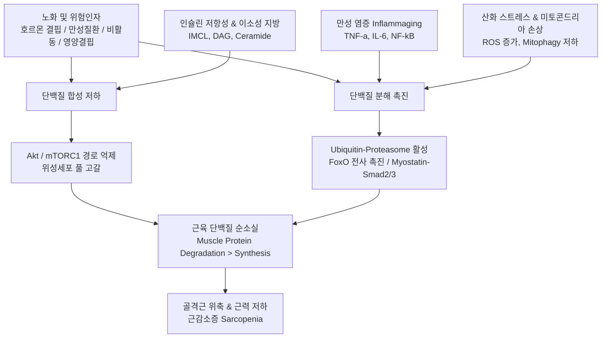

# 📑 [근감소증] PART 1. 개요: 근육발생학·정의·병태생리

> **핵심 요약 (Key Summary)**
> - **근육발생 및 재생(Ch03)**: 골격근은 중배엽(Mesoderm) 유래로, 평상시 휴지기(Quiescence)에 있는 [[위성세포(Satellite cell)]]가 활성화되어 비대칭 분열(Asymmetric division)을 통한 자가재생 및 증식·분화를 거쳐 근원섬유를 형성한다. 초기 **Notch 신호**가 위성세포 활성화와 증식을 주도하고, 이어 **Numb** 단백질의 Notch 억제 및 **Wnt/β-catenin 신호** 활성화를 통해 근아세포 융합 및 근관(Myotube) 형성이 유도된다. 만성 염증 시 **[[TGF-β]]/Smad2/3** 경로 활성화로 위성세포가 억제되고 섬유아세포가 동원되어 [[콜라겐]] 섬유화와 이소성 지방 침윤이 일어난다. 유도만능줄기세포(iPSC) 및 직접교차분화 유도근육줄기세포(iMSC), Nogo-A/Filamin-C 복합체, 줄기세포 유래 세포외 소포체(EV/엑소좀)는 새로운 근재생 치료 전략으로 규명되고 있다.
> - **[[근감소증]] 정의 및 진단기준 발전(Ch04)**: 1989년 Rosenberg의 근육량 중심 개념에서 출발하여, 1998년 Baumgartner의 DXA 기준($-2\text{ SD}$), 2010년 EWGSOP1을 거쳐, 2019년 EWGSOP2에서는 **근력(Muscle strength) 감소**를 가장 핵심적인 1차 지표로 격상시켰다. 2020년 SDOC는 근육량을 제외하고 근력과 보행속도만으로 정의할 것을 제안하였으며, 2024년 GLIS(Global Leadership Initiative in Sarcopenia) 델파이 합의안은 근육량, 근력, 근육특유근력(Muscle-specific strength)을 3대 핵심 구성요소로 결정하였다. 한국은 2023년 **[[KWGS]](Korean Working Group on Sarcopenia)** 합의안을 통해 근육량 감소($\text{ASM/height}^2$: 남 $<7.0\text{ kg/m}^2$, 여 $<5.4\text{ kg/m}^2$)에 악력(남 $<28\text{ kg}$, 여 $<18\text{ kg}$) 또는 신체기능(SPPB $<9$점, 보행속도 $<1.0\text{ m/s}$) 저하가 동반된 경우를 근감소증으로 정의하였다. [[근감소증]]은 [[노쇠(Frailty)]] 및 [[노인증후군]]의 가역적 전 단계 핵심 질환이다.
> - **근감소증의 병태생리(Ch05)**: 근육 단백의 **합성 저하(동화 저하)** 와 **분해 촉진(이화 가속)** 의 불균형이 본질이다. [[테스토스테론]]·[[성장호르몬]]/[[IGF-1]]·[[에스트로겐]] 결핍, [[비타민 D]] 저하 등 호르몬 불균형이 Akt/mTORC1 동화 신호를 억제하고 FoxO/유비퀴틴-프로테아좀 분해계를 활성화한다. 골격근의 [[인슐린]] 저항성과 이소성 지방(IMCL, DAG, Ceramide) 축적, 만성 저등급 염증(Inflammaging, TNF-α, [[IL-6]], [[NF-κB]] 활성), 활성산소종([[ROS]]) 증가 및 미토콘드리아 기능부전(Mitophagy 저하), 운동단위(Motor unit) 소실 및 탈신경, 오토파지(Autophagy) 조절 장애, 그리고 강력한 근육 성장 억제 인자인 [[마이오스타틴(Myostatin)]]/ActRIIB/Smad2/3 경로가 복합적으로 작용하여 근위축과 기능 상실을 초래한다.

---

## 📌 목차
1. [Chapter 03. 근육발생학 (Myogenesis)](#chapter-03-근육발생학-myogenesis)
   - [1. 근육의 조직학적 구조의 이해](#1-근육의-조직학적-구조의-이해)
   - [2. 근육의 발생 및 재생 과정](#2-근육의-발생-및-재생-과정)
   - [3. 근육세포의 증식과 분화·재생의 신호전달체계](#3-근육세포의-증식과-분화재생의-신호전달체계)
   - [4. 근육의 파괴와 재생과정에서의 근소실의 병리학적 현상](#4-근육의-파괴와-재생과정에서의-근소실의-병리학적-현상)
   - [5. 체세포 역분화(iPSC) 및 직접교차분화 근육세포 제조와 치료 전략](#5-체세포-역분화ipsc-및-직접교차분화-근육세포-제조와-치료-전략)
2. [Chapter 04. 근감소증의 정의 (Definition of Sarcopenia)](#chapter-04-근감소증의-정의-definition-of-sarcopenia)
   - [1. 노화에 따른 근육량 및 근력의 변화](#1-노화에-따른-근육량-및-근력의-변화)
   - [2. 노인 특유질환: 근감소증, 노쇠, 그리고 노인증후군](#2-노인-특유질환-근감소증-노쇠-그리고-노인증후군)
   - [3. 근감소증의 정의와 국제적 발전 과정](#3-근감소증의-정의와-국제적-발전-과정)
   - [4. 한국형 근감소증 진단기준 (KWGS 2023 합의안)](#4-한국형-근감소증-진단기준-kwgs-2023-합의안)
3. [Chapter 05. 근감소증의 병태생리 (Pathophysiology of Sarcopenia)](#chapter-05-근감소증의-병태생리-pathophysiology-of-sarcopenia)
   - [1. 서론 및 근단백질 대사 불균형](#1-서론-및-근단백질-대사-불균형)
   - [2. 근감소증의 주요 원인 인자 및 분자 기전](#2-근감소증의-주요-원인-인자-및-분자-기전)
     - [1) 호르몬의 불균형 (Hormonal Imbalance)](#1-호르몬의-불균형-hormonal-imbalance)
     - [2) 인슐린 저항성 (Insulin Resistance)](#2-인슐린-저항성-insulin-resistance)
     - [3) 만성 염증 (Inflammation / Inflammaging)](#3-만성-염증-inflammation--inflammaging)
     - [4) 산화 스트레스 (Oxidative Stress) 및 미토콘드리아 장애](#4-산화-스트레스-oxidative-stress-및-미토콘드리아-장애)
     - [5) 운동단위 리모델링과 위성세포 기능 저하](#5-운동단위-리모델링과-위성세포-기능-저하)
     - [6) 오토파지 (Autophagy) 조절 장애](#6-오토파지-autophagy-조절-장애)
     - [7) 마이오스타틴 (Myostatin) 신호 경로](#7-마이오스타틴-myostatin-신호-경로)
   - [3. 결론](#3-결론)
4. [출처 및 참고 문헌 (References)](#출처-및-참고-문헌-references)

---

# Chapter 03. 근육발생학 (Myogenesis)
**저자: 정규식 (경북대 수의과)**

## 1. 근육의 조직학적 구조의 이해
- **근육의 발생 기원 및 3대 분류**:
  - **골격근(Skeletal muscle)**: **중배엽(Mesoderm)** 에서 유래하며, 뼈에 부착되어 체성신경계(Somatic nervous system)의 지배를 받아 의지적으로 조절되는 가로무늬근(횡문근, Striated muscle)이자 수의근(Voluntary muscle)이다.
  - **심장근육(Cardiac muscle)**: 내배엽 유래(원문 표기 기반)로 심장에만 국한되어 존재하며, [[자율신경계]] 의해 불수의적으로 작동하며 평생 주기적 수축을 통해 혈액을 순환시킨다.
  - **평활근(Smooth muscle)**: 위, 방광, 혈관 등 내장 기관과 관 구조를 둘러싸며 [[자율신경계]] 조절 하에 불수의적으로 수축 작용을 수행한다.
- **골격근의 계층적 구조**:
  - 근육 전구세포는 근육 원조세포(Myogenic progenitor cell)와 근육 줄기세포(위성세포)를 포함한다.
  - 근육의 최소 기능 단위 세포인 **근세포(근아세포, Myocyte/Myoblast)** 들이 융합(Fusion)하여 다핵성의 **근관세포(근육튜브, Myotube)** 를 형성한다.
  - 근관세포가 성숙하여 **근육섬유(근섬유, Muscle fiber)** 가 되고, 여러 근섬유가 결합조직에 싸여 **근육다발(Fascicle)** 을 이루며, 이들이 모여 최종적인 하나의 **근육(Muscle)** 을 구성한다.
- **근수축 잔섬유(Myofilament)**:
  - **가는 잔섬유(Thin filament)**: 액틴(Actin), 트로포닌(Troponin), 트로포미오신(Tropomyosin) 복합체로 구성된다.
  - **굵은 잔섬유(Thick filament)**: 미오신(Myosin) 단백질로 구성된다.
  - 미오신 머리가 액틴과 결합-해리를 반복하는 연결다리 활주를 통해 수축(Contract)과 이완(Relax)이 일어난다.
- **근육 손상과 병리적 변화**:
  - 연령 증가에 따른 퇴행성 근소실은 국소 염증 반응을 일으키고 손상 부위가 결합조직으로 대체되어 근기능 이상을 유발한다.
  - 유전적/후성유전학적 결함이나 노화에 의한 파괴는 **근이영양증(Dystrophy)** 과 **근위축증(Atrophy)** 의 병리적 상태로 진행된다.

---

## 2. 근육의 발생 및 재생 과정
- **근육 항상성과 위성세포(Satellite cell)**:
  - 골격근은 가늘고 긴 다핵 원기둥 세포로 풍부한 미토콘드리아를 보유한다.
  - 근육의 항상성 유지와 손상 후 재생은 기저막(Basal lamina)과 근초(Sarcolemma) 사이에 위치한 **휴지기(Quiescence) [[위성세포(Satellite cell)]]** 에 전적으로 의존한다.
- **노화에 따른 근섬유의 변화**:
  - 정상 노화에 따라 전체 근섬유 수는 **30~40% 감소**한다.
  - 근섬유의 크기는 12~15세경 정상 성인 수준에 도달하고 **30세 전후에 정점(Peak)** 을 찍은 뒤 점진적으로 감소한다.
  - **근섬유 유형별 선택적 위축**: **제2형 근섬유(Fast-twitch fiber)** 는 노화 시 **10~40%의 뚜렷한 크기 감소**를 보이는 반면, **제1형 근섬유(Slow-twitch fiber)** 의 크기는 상대적으로 큰 변화 없이 보존된다.
- **위성세포의 반응 및 분화 단계**:
  - 노화 시 위성세포의 수와 활성도가 급격히 저하된다. 만성 염증성 사이토카인인 **[[IL-6]]** 의 증가는 [[IGF-1]] 작용을 억제하여 근육 단백의 **이화작용(Catabolism)** 을 촉진한다.
  - 손상 자극 시 휴지기 위성세포가 활성화되어 **활성화된 근아세포(Activated myoblast)** 로 증식한다.
  - 이 중 일부는 손상된 근섬유와 융합하거나 새로운 근관을 형성하여 근육을 재생하고, 일부는 **비대칭 분열(Asymmetric division)** 을 통해 줄기세포 풀을 유지하는 **자가 재생(Self-renewal)** 경로를 밟는다.

> ![[Sarcopenia_Ch03_p70_Fig1.png|540]]
> **그림 3-1. 근육 재생을 위한 위성세포의 단계별 반응 기전.** (A) 근육 손상 시 재생 과정은 다양한 내외인성 스트레스와 염증으로 인한 손상 발생 후, 휴지기 상태의 근육 위성세포가 활성화되면서 시작된다. (B) 활성화된 위성세포는 Notch 신호전달에 의해 세포주기를 시작하고, 이어지는 Wnt 신호에 의해 베타카테닌이 활성화되어 근육아세포가 형성되며, 이는 근육튜브로 분화되어 재생을 유도한다. (C) 근육위성세포의 배양 시간에 따른 세포 분화 과정을 관찰한 세포학적 도식으로, 시간이 지남에 따라 다핵성 근육다발과 근육섬유로의 분화가 진행됨을 보여준다.

- **Notch 및 Wnt 신호의 상호작용**:
  - **Notch 신호**: 근육 줄기세포의 휴면 유지, 자가 재생 및 초기 증식 개시에 필수적이다. Notch 신호가 결핍되면 줄기세포 풀이 고갈되어 재생 능력이 상실된다.
  - **Wnt 신호**: Notch 신호 이후 발현되어 $\beta$-catenin 활성화를 통해 근아세포의 분화와 근관 형성을 촉진한다.
- **병리적 섬유화 및 이소성 지방 축적 기전**:
  - 만성 염증 상태에서 분비되는 **[[TGF-β]]** 는 **p-Smad2/3** 신호 경로를 활성화하여 위성세포의 활성화를 직접 억제한다.
  - 위성세포 활성이 억제되면 근재생이 차단되고 **섬유아세포(Fibroblast/Myofibroblast)** 가 동원되어 정상 실질세포 대신 **결합조직([[콜라겐]] 섬유)** 이 침착된다.
  - 동시에 근섬유 내·사이에 **지방세포 침윤(이소성 지방 축적)** 이 유발되어 미토콘드리아 기능 저하, 에너지 대사 장애, 지배 신경의 기능 부전을 가속화한다.

> ![[Sarcopenia_Ch03_p71_Fig1.png|540]]
> **그림 3-2. 근육분화과정에서 세포운명 신호전달 네트워크 도식.** 근육 손상 후 Notch 발현 증가 및 Wnt 신호의 활성화가 정상적인 근육 재생을 이끄는 반면, 만성 염증 인자인 TGF-β의 증가는 Smad 경로를 통해 섬유성 결합조직 축적과 섬유화(Fibrogenic potential)를 유도하여 정상 근육 재생을 방해한다.

---

## 3. 근육세포의 증식과 분화·재생의 신호전달체계
- **핵심 전사인자의 순차적 발현 캐스케이드**:
  1. **휴지기 및 증식 초기**: **Pax7**, **Myf5** 발현
  2. **초기 분화 단계 (근아세포 형성)**: **MyoD** 활성화, **Desmin** 발현
  3. **후기 분화 및 근관 성숙 단계**: **Nogo-A**, **Myogenin**, **MRF**, **MYH2 / MHC (Myosin Heavy Chain)** 가 순차적으로 발현되어 기능적 수축 단위를 형성

> ![[Sarcopenia_Ch03_p72_Fig1.png|540]]
> **그림 3-3. 근육 손상 후 근육 재생 과정에서의 주요 유전자 발현 변화.** 근육 손상 후 초기 증식 단계에서는 Pax7이 활성화되고, 이어지는 초기 분화 단계에서는 MyoD가 활성화된다. 이후 신규 근육 분화 인자인 Nogo-A, Myogenin, MYH2가 순차적으로 발현되어 근육섬유 형성에 관여한다.

- **Delta-Notch 스위칭과 Numb의 조절 기전**:
  - 증식기에는 Delta 리간드에 의해 Notch 신호가 강력하게 유지되어 줄기세포 상태와 세포 증식을 보장한다.
  - 분화 단계로 전환될 때 **Numb 단백질**이 발현되어 Notch 신호를 억제한다.
  - Notch가 억제되면 MyoD 발현이 촉진되고, GSK-3β가 억제되면서 **$\beta$-catenin** 경로가 활성화되어 세포 융합 및 근관 형성이 가속된다.

---

## 4. 근육의 파괴와 재생과정에서의 근소실의 병리학적 현상
- **[[콜라겐]] 침착과 하이드록실화(Hydroxylation)**:
  - 근육 실질이 파괴된 후 만성 염증 반응이 지속되면, 프로린(Proline) 분자의 4번째 탄소 위치가 수산화(4-Hydroxylation)된다.
  - 이로 인해 수용성 [[콜라겐]] 불용성 비수용성 콜라겐 섬유로 전환되어 비가역적으로 조직 내에 축적되고 섬유성 결합조직으로 대체된다.
- **마손 트리콤(Masson's Trichrome) 염색**:
  - 섬유화된 콜라겐 섬유는 **짙은 푸른색(Blue)** 으로 염색되고, 정상 근육 조직은 붉은색으로 염색되어 섬유화 병변의 진행도를 명확히 식별할 수 있다.
  - H&E 염색에서는 활성화된 근섬유아세포(Activated myofibroblast)와 만성 단핵 염증세포의 침윤이 확인된다.

> ![[Sarcopenia_Ch03_p73_Fig1.png|540]]
> **그림 3-4. 질병군에서 순서적으로 유전적 골격근 파괴동물에서의 (A) 골격근, (B) 심장근육, (C) 호흡근육.** 유전성 근육 질환 모델에서 Masson's Trichrome 염색을 통해 정상 근섬유가 파괴되고 콜라겐 섬유(짙은 푸른색)로 대체되는 조직병리학적 섬유화 진행 양상을 보여준다.

---

## 5. 체세포 역분화(iPSC) 및 직접교차분화 근육세포 제조와 치료 전략
- **유도만능줄기세포(iPSC) 기반 접근법**:
  - 체세포에 야마나카 4대 인자(**OSKM: Oct4, Sox2, Klf4, c-Myc**)를 도입하여 iPSC를 제작한 후 중간엽 계통으로 특화 분화를 유도한다.
  - 테라토마(Teratoma) 형성 위험을 극복하기 위해 중간엽줄기세포(MSC) 표지자인 **[[CD44]], CD29** 발현 세포를 선별한다.
  - 동종 이식 시 면역 거부를 방지하기 위해 **MHC class II 발현을 억제**하고 **TGF-β2 전처리**를 통해 면역관용을 유도한다.

> ![[Sarcopenia_Ch03_p75_Fig1.png|540]]
> **그림 3-5. 역분화 유도 줄기세포를 활용한 목적 세포 분화 및 치료 도식도.** 체세포를 분리한 후 야마나카 4가지 전사인자(OCT4, SOX2, KLF4, c-MYC)를 도입하여 역분화를 유도하고, 특화 배지 환경에서 중간엽줄기세포(E-iPSC-MSC) 및 근육·연골·뼈 세포로 분화시켜 재생 치료에 활용하는 공정.

- **전사인자 기반 직접교차분화 유도근육줄기세포(iMSC)**:
  - 성체 체세포에 **Six1, Esrrb, Eya1, Pax3** 의 4가지 전사인자를 도입하여 역분화 단계(만능성 상태)를 거치지 않고 직접 근육줄기세포로 전환(Direct transdifferentiation)시키는 기술이 확립되었다(Jeong KS et al., *Cell Death & Disease*, 2018).
  - 유도된 iMSC는 염색체 핵형 이상 없이 안정적이며, **Pax7, Myf5, MyoD, MHC** 를 정상 발현한다.
  - 50회 이상 장기 계대배양에서도 세포 더블링 타임(Doubling time)과 증식력이 배아줄기세포나 일차 위성세포보다 우수하다.

> ![[Sarcopenia_Ch03_p76_Fig1.png|540]]
> **그림 3-6. 전사인자 기반 직접교차분화에 의한 유도근육세포 생성 과정.** (A) 체세포에 직접교차분화 인자를 도입하여 단일세포 수준에서 유도근육세포를 생성하는 과정. (B-E) 도입 전사인자 확인 및 염색체 안정성 분석을 통한 치료용 세포 선별.
> ![[Sarcopenia_Ch03_p76_Fig1.png|540]]
> **그림 3-7. 직접교차분화된 유도근육줄기세포의 증식 특성 비교.** (A, B) 계대배양 초·후기에서 안정적인 증식 속도와 짧은 더블링 타임을 유지함을 보여줌. (C) 체세포 및 일차 근육위성세포 대비 유도근육줄기세포(iMSC)의 우수한 세포 증식력 비교.

- **신호 활성 및 Mdx 마우스 모델 치료 효과**:
  - iMSC는 기존 위성세포 대비 Notch 증식 신호, Integrin 매개 세포 부착·분화 신호, Wnt 및 Jak-STAT 신호가 강력하게 활성화되어 있다.
  - 인간 듀센근이영양증(DMD) 유사 유전 질환 모델인 **Mdx 마우스**에 국소 이식 시, 기형종 등 종양성 위험 없이 중심핵(Central nuclei)을 갖는 성숙 근섬유로 재생되어 치료지수와 안전성을 입증하였다.

> ![[Sarcopenia_Ch03_p77_Fig1.png|540]]
> **그림 3-8. 유도근육줄기세포의 향상된 증식 및 분화 신호 활성도 비교 도식도.** 유도근육줄기세포는 Notch, Integrin, Wnt, FGF/Jak-STAT 신호전달이 활발히 작동하여 우수한 근육 분화 효율을 발휘함.
> ![[Sarcopenia_Ch03_p77_Fig1.png|540]]
> **그림 3-9. Mdx 마우스 모델에서 유도근육줄기세포 이식에 의한 치료 효율 및 안전성 향상 도식도.** Mdx 모델 이식을 통해 종양성 위험을 배제하고 근조직 구조 복구 및 치료 안전성을 확인한 결과.

- **Nogo-A(RTN4)와 Filamin-C 복합체 및 대사-수면 조절 기전**:
  - **Nogo-A(Reticulon 4A)**: 신경 재생 억제 인자로 알려졌으나 골격근에서도 발현되며, Myogenin 및 MYH2와 공존 발현하는 신규 근분화 필수 인자이다.
  - Nogo-A는 액틴과 미오신 결합의 교량 역할을 하는 **Filamin-C**, 그리고 Desmin, Calnexin과 결합 복합체를 형성하여 정상적인 근육 분화를 유도한다.
  - **지방합성 및 일주기 수면 유전자 억제 네트워크**:
    - Nogo-A 결핍 시 Filamin-C가 유리되어 근육 분화가 억제되고, **[[PPAR]]-$\gamma$** 및 **C/EBP$\alpha/\beta$** 경로가 활성화되어 지방합성이 촉진된다.
    - 축적된 지방산은 핵 내에서 **Cry2-Per1/2/3** 복합체를 형성하고 일주기 수면 조절 유전자(**BMAL1, CLOCK, NPAS**) 활성을 억제하여 [[불면증]] 및 수면장애를 야기한다.

> ![[Sarcopenia_Ch03_p78_Fig1.png|540]]
> **그림 3-10. 염증 진행 시 Nogo-A와 Myogenin의 공동 발현 도식도.** 근육 염증 및 재생 환경에서 Nogo-A 단백질이 Myogenin 및 MYH2와 함께 발현되어 근육 분화 조절에 직접 관여함을 보여주는 형광면역염색 소견.
> ![[Sarcopenia_Ch03_p79_Fig1.png|540]]
> **그림 3-11. [[지방산]] 축적과 근육분화 수면유전자 간의 상호작용 모식도.** [[지방산]] 합성이 증가하면 CRY2-Per1/2/3 복합체를 통해 Nogo-A 및 수면유전자(BMAL1, CLOCK)가 억제되어 근위축과 수면장애가 동반되는 병태생리적 상호작용.

> ![[Sarcopenia_Ch04_p80_Fig1.png|540]]
> **그림 3-12. Filamin-C 및 Nogo-A가 관여하는 근육분화 구조적 기전도.** F-actin, Myosin과 함께 Filamin-C와 Nogo-A가 결합하여 근육 분화에 필수적인 세포골격 구조 복합체를 형성하는 메커니즘.
> ![[Sarcopenia_Ch04_p80_Fig1.png|540]]
> **그림 3-13. 중간엽줄기세포 이식 후 골격근 재생 과정의 조직학적 관찰.** 골격근 손상 부위에 이식된 MSC가 내인성 위성세포와 융합하거나 분화하여 중심핵을 가진 다핵성 골격근섬유를 재생시키는 조직병리학적 소견.

- **줄기세포 유래 세포외 소포체(EV / 엑소좀) 기반 치료**:
  - 줄기세포 이식 외에도 줄기세포가 분비하는 **30~150 nm 크기의 세포외 소포체(EV/Exosome)** 내 유효 성분이 근골격계 재생을 직접 유도한다.
  - 엑소좀 내 함유된 핵산 물질인 **miR-1, miR-133, miR-486, miR-210, let-7** 등은 근아세포의 분화 촉진, 건·인대 재생, 연골 변성 억제, 조골세포 분화 촉진 효능을 나타낸다.

> ![[Sarcopenia_Ch04_p81_Fig1.png|540]]
> ![[Sarcopenia_Ch04_p82_Fig1.png|540]]
> **그림 3-14. 역분화줄기세포 또는 성체줄기세포 유래 중간엽줄기세포 및 엑소좀(EV)의 조직 재생 기전.** MSC가 분비하는 30~150 nm 리포좀 나노입자인 세포외 소포체(EV)에 봉입된 miRNA(miR-1, miR-133, miR-486, miR-210 등)와 단백질 인자들이 손상된 근육, 건, 연골 및 골조직의 세포 재생을 촉진하는 통합 경로.

---

# Chapter 04. 근감소증의 정의 (Definition of Sarcopenia)
**저자: 장학철 (서울의대)**

## 1. 노화에 따른 근육량 및 근력의 변화
- **인체 골격근의 생리적 위상**:
  - 인체는 약 460개의 골격근을 가지고 있으며, 체중의 45~55%를 차지하여 체내에서 가장 큰 단일 기관이다.
  - 신체 균형, 이동성 유지뿐만 아니라 전신 에너지 대사 및 열 생성의 핵심 장소이다.
- **한국인 연령대별 근육량 추이 (국민건강영양조사 28,476명 분석)**:
  - **남성**: 근육량 및 사지근육량(Appendicular Skeletal Muscle Mass, ASM)은 청소년기 이후 급증하여 **30대 초반에 정점(Peak)** 에 도달한 후 감소하기 시작하며, 특히 **70세 이후 급격히 감소**한다.
  - **여성**: 근육량이 **40대 중반에 정점**에 도달하며, 남성에 비해 완만하게 감소한다.
  - 남성의 연령별 감소 양상은 서양 연구와 일치하지만, 한국 여성의 경우 정점 도달 시기가 서양에 비해 늦고 완만하여 진단 기준 설정 시 성별 특성을 고려해야 한다.

> ![[Sarcopenia_Ch04_p83_Fig1.png|540]]
> **그림 4-1. 한국인 남녀의 연령대별 전체 근육량과 사지근육량(ASM)의 추이.** 2008~2010년 국민건강영양조사(28,476명) 분석 결과. 남성은 30대 초반 정점 후 70세 이후 급격히 감소하며, 여성은 40대 중반 정점 후 완만한 감소 곡선을 나타낸다.

- **한국인 연령대별 악력 추이 (국민건강영양조사 23,716명 분석)**:
  - **남성**: 10세 이후 가파르게 증가하여 **30대 중반에 최대치**를 기록하고, **60세 이후 급격한 저하**를 보인다.
  - **여성**: 서서히 증가하여 **30대 후반에 정점**에 도달한 뒤 서서히 감소한다.
  - 여성의 최대 악력은 남성 최대치의 **약 60% 수준**에 해당한다.
  - 근육량 감소율보다 근력(악력) 감소 속도가 훨씬 빠르다.

> ![[Sarcopenia_Ch04_p84_Fig1.png|540]]
> **그림 4-2. 한국인의 연령대별 악력의 평균치.** 2014~2017년 국민건강영양조사 10세 이상 남녀 23,716명 분석. 남성은 30대 중반 정점 후 60세부터 가파르게 하강하며, 여성은 30대 후반에 남성의 약 60% 수준에서 정점을 형성한다 (출처: *Ann Geriatr Med Res*, 2019).

- **체지방 재분포와 [[근감소성 비만(Sarcopenic Obesity)]]**:
  - 노화에 따른 체성분 변화의 핵심은 체중이 일정하더라도 **하지 근육량이 현저히 감소**하고, **복강내 내장지방 및 근육 내·사이 지방(이소성 지방, Ectopic fat)** 이 급증한다는 점이다.
  - 근육 내 지방 축적은 국소 염증성 [[사이토카인]](**TNF-$\alpha$, [[IL-6]]**)을 분비시켜 만성 염증을 유발하고 근육의 [[인슐린]] 저항성을 촉진하여 단백질 동화를 억제한다.
  - 근육량 감소 $\rightarrow$ 기초대사량 및 신체활동 저하 $\rightarrow$ 체지방 및 이소성 지방 축적 가속 $\rightarrow$ 만성 염증 및 대사 이상이라는 **악순환(Vicious cycle)** 이 형성되어 심혈관대사질환, 낙상, 기능장애, 사망 위험을 상승적으로 폭증시킨다.

> ![[Sarcopenia_Ch04_p85_Fig1.png|540]]
> **그림 4-3. 노화에 따른 [[근감소증]] 근감소성 비만이 심혈관대사질환에 미치는 영향.** 근육량 감소와 이소성 지방(근육 내 지방 및 복강내 지방) 축적이 상호작용하여 만성 염증과 [[인슐린]] 저항성을 악화시키고 심혈관대사 위험 및 신체기능 장애를 초래하는 기전.

---

## 2. 노인 특유질환: 근감소증, 노쇠, 그리고 노인증후군
- **노화 표현형과 상관관계**:
  - 분자·세포 수준의 손상 축적 $\rightarrow$ 생리적 보상력(항상성 예비능) 고갈 $\rightarrow$ 만성질환 병발 $\rightarrow$ 기능 급락 $\rightarrow$ **[[근감소증]], [[노쇠(Frailty)]], [[노인증후군(Geriatric syndrome)]]** 발현.
  - [[근감소증]] 65세 이상 노인의 **10~30%**, 80세 이상 노인의 **50% 이상**에서 발견되며 노쇠 발생의 핵심 신체적 기저(Physical substrate)로 작용한다.

> ![[Sarcopenia_Ch04_p86_Fig1.png|540]]
> **그림 4-4. 노인 특유 질환인 근감소증, 노쇠, 노인증후군의 상관성.** 근감소증이 신체적 노쇠(Physical frailty: 체중감소, 악력저하, 피로, 보행속도 저하, 활동량 감소)의 중심축이 되어 노인증후군(낙상, 섬망, 욕창, [[요실금]]), 의존성, 요양시설 입소 및 조기 사망으로 이어지는 인과 경로.

- **[[노쇠(Frailty)]]의 조작적 정의 (Fried의 CHS 노쇠지표 5항목)**:
  1. **의도하지 않은 체중 감소(Weight loss)**: 지난 1년간 4.5 kg 이상의 체중 감소
  2. **[[허약]](Weakness)**: 악력 저하
  3. **소진/피로(Exhaustion)**: CES-D 우울 척도 설문 평가
  4. **느림(Slowness)**: 보행 속도(Gait speed) 저하
  5. **활동량 감소(Low physical activity)**: Minnesota 여가활동 설문 평가
  - **판정 기준**: 3개 항목 이상 만족 시 **노쇠(Frail)**, 1~2개 항목 만족 시 **노쇠 전단계(Pre-frail)** 로 진단. 노쇠는 **가역적(Reversible)** 상태이므로 조기 발견 및 조기 중재가 필수적이다.
- **노인증후군(Geriatric Syndrome)**:
  - 섬망, 인지장애, 우울증, 낙상, 어지럼증, 실신(혼절), [[요실금]], 욕창, 기능저하 등 단일 질병으로 분류하기 어려운 다인자성 복합 임상 양상이다.

---

## 3. 근감소증의 정의와 국제적 발전 과정
- **어원 및 초기 정의**:
  - 1989년 Rosenberg가 그리스어 'sarx'(살) + 'penia'(감소)를 조합하여 제안.
  - 노화 관련 점진적 골격근 감소를 뜻하며, 악성종양 말기의 **악액질(Cachexia)** 이나 급성 질환에 의한 **근육 소모(Muscle wasting)** 와 감별되는 개념으로 출발하였다.
- **근육량 중심에서 근력 중심으로의 패러다임 전환**:
  - 1998년 Baumgartner: DXA 기반 젊은 성인 참조군 평균 대비 $-2\text{ SD}$ 이하를 근감소증으로 정의.
  - 대규모 노인 코호트 연구(Health ABC Study 등)를 통해, **근육량 감소보다 근력 감소가 사망률 및 신체장애 예측에 훨씬 결정적**이며 근육량과 근력이 정비례하지 않는다는 사실이 입증되었다.
- **주요 국제 가이드라인 변천사**:
  - **EWGSOP 1 (2010)**: 근육량 감소 + (근력 저하 또는 신체수행능 저하).
  - **FNIH Sarcopenia Project (2014)**: 대규모 인구기반 분석을 통해 신체장애와 직접 관련된 지표로 $\text{ASM/BMI}$ 및 악력을 제시.
  - **AWGS (2014 / 2019)**: 아시아인 인체 특성을 반영한 진단 기준 수립. 2019년 개정안에서 지역사회 1차 진료 중심의 **선별 및 Possible Sarcopenia** 개념 도입.
  - **EWGSOP 2 (2019)**: **근력 저하(Low muscle strength)** 를 [[근감소증]] 제1선행 진단 요소로 격상. 근력 저하 시 '[[근감소증]] 의증(Probable sarcopenia)'으로 판정하고 조기 중재 개시 권고.
  - **SDOC (2020)**: 미국 국립보건원(NIH) 지원 역학 코호트 통합 분석 결과, 근육량이 독립적인 유해 건강결과와 연관되지 않는다는 이유로 근육량을 정의에서 배제하고 **낮은 악력과 느린 보행속도**만으로 정의.
  - **GLIS (2024)**: 전 세계 107명 전문가 대상 델파이 합의. 개념적 정의의 3대 구성요소로 **근육량(Muscle mass), 근력(Muscle strength), 근육특유근력(Muscle-specific strength: 근력/근육단면적)** 을 결정하고, 신체수행능은 원인 구성요소가 아닌 결과(Outcome)로 규정.

### 표 4-1. 근감소증 정의의 연대적 발전 과정
| 발표 그룹 및 연도 | 개념적 정의 구성 요소 | 근육량 지표 | 근력 지표 | 근육기능 (신체수행능) 지표 |
| :--- | :--- | :--- | :--- | :--- |
| **Rosenberg (1989)** | Muscle mass | - | - | - |
| **Baumgartner (1998)** | Muscle mass | $\text{ASM/height}^2$ | - | - |
| **EWGSOP (2010)** | Muscle mass, strength and function | $\text{ASM/height}^2$ | 악력 (Handgrip strength) | SPPB, Gait speed |
| **IWGS (2011)** | Muscle mass and function | $\text{ASM/height}^2$ | - | Gait speed |
| **FNIH (2014)** | Muscle mass and strength | $\text{ASM/BMI}$ | 악력 | - |
| **AWGS (2014)** | Muscle mass, strength and function | $\text{ASM/height}^2$ | 악력 | Gait speed |
| **EWGSOP 2 (2019)** | Muscle strength, mass and function | $\text{ASM}$, $\text{ASM/height}^2$ | 악력, Chair stand test | Gait speed, SPPB, TUG, 400m walk |
| **AWGS 2 (2020)** | Muscle mass, strength and function | $\text{ASM/height}^2$ | 악력 | Gait speed, Chair stand, SPPB |
| **SDOC (2020)** | Muscle strength and function | 제외 | 악력 | Gait speed |
| **GLIS (2024)** | Muscle mass, strength & muscle-specific strength | 합의 진행 중 | 악력, 하지근력 | 결과 지표로 분류 |

- **질병 코드 공식화**:
  - 2016년 10월 미국 **ICD-10-CM (`M62.84` / 원문 표기 `M62.5`)** 질환코드 부여
  - 2021년 대한민국 **KCD-8 (`M62.5`)** 임상 질환 등재

---

## 4. 한국형 근감소증 진단기준 (KWGS 2023 합의안)
대한근감소증학회, 대한골대사학회, 대한노인병학회가 연합한 **Korean Working Group on Sarcopenia (KWGS)** 에서 2023년 발표한 국내 임상 진단 합의 지침이다.

- **KWGS 개념적 정의**:
  - **[[근감소증]](Sarcopenia)**: **근육량 감소** + (**근력 감소** 또는 **근육기능 저하**)
  - **중증 [[근감소증]](Severe Sarcopenia)**: **근육량 감소** + **근력 감소** + **근육기능 저하**가 모두 동반된 경우
  - 진단 시 예방 및 치료를 위한 포괄적 노인평가(Comprehensive Geriatric Assessment) 시행 권고.

### 표 4-2. KWGS 제안 한국인 근감소증 선별 및 진단기준 (2023)
| 단계 | 검사 항목 | 판정 기준치 (Cut-off) |
| :--- | :--- | :--- |
| **1. 선별 검사 (Screening)** | **SARC-F 설문** | $\ge 4$점 |
| | **종아리 둘레 (Calf circumference)** | 남성 $< 34\text{ cm}$, 여성 $< 33\text{ cm}$ |
| | **핑거링 테스트 (Finger ring test)** | 종아리가 손가락 링보다 얇은 경우 (돌림 상태) |
| **2. [[근감소증]] 의증 (Possible Sarcopenia)** | **악력 (Handgrip strength)** | **남성 $< 28\text{ kg}$, 여성 $< 18\text{ kg}$** |
| | **의자 일어서기 (5-time Chair stand)** | 기립 상태 시작: $> 10$초, 착석 상태 시작: $> 11$초 |
| | **보행 속도 (Gait speed, 4m or 6m)** | $< 1.0\text{ m/s}$ |
| | **Timed Up and Go (TUG)** | $> 12$초 |
| **3. [[근감소증]] 확진 (Sarcopenia)** | **사지근육량 (DXA ASM/height²)** | **남성 $< 7.0\text{ kg/m}^2$, 여성 $< 5.4\text{ kg/m}^2$** |
| | **+** | |
| | **근력 저하 (악력)** | 남성 $< 28\text{ kg}$, 여성 $< 18\text{ kg}$ |
| | **또는 근육기능 저하** | **SPPB $< 9$점** (우선 권고), 보행속도 $< 1.0\text{ m/s}$, TUG $> 12$초, Chair stand $> 10$초(서서)/$11$초(앉아서) |
| **4. 중증 근감소증 (Severe Sarcopenia)** | **3대 지표 동시 충족** | **근육량 감소 + 근력 감소 + 근육기능 저하** |

---

# Chapter 05. 근감소증의 병태생리 (Pathophysiology of Sarcopenia)
**저자: 류혜진·최경묵 (고려의대)**

## 1. 서론 및 근단백질 대사 불균형
- **핵심 분자적 기전**:
  - 골격근 항상성은 단백질 합성(Protein synthesis, 동화작용)과 단백질 분해(Protein degradation, 이화작용)의 균형으로 유지된다.
  - [[근감소증]] 본질적 병태생리는 **단백질 분해 속도가 합성 속도를 초과(Degradation exceeds synthesis)** 하여 발생한다.
  - 내재적 요인(위성세포 수 고갈, 오토파지 조절 장애, 미토콘드리아 변성, 호르몬 결핍)과 외재적 요인(영양 결핍, [[비타민 D]] 결핍, 신체 비활동, 만성 질환, 다약제 복용)이 복합적으로 관여한다.

> ![[Sarcopenia_Ch05_p95_Fig1.png|540]]
> **그림 5-1. 근감소증의 위험 인자들 및 병태생리.** 노화에 따른 위성세포 감소, 호르몬 불균형, 산화 스트레스, 염증, 신경근 접합부 장애, 영양 부족, 신체 비활동 등이 복합적으로 작용하여 단백 분해가 합성을 능가하게 되고 근감소증을 유발하는 병태생리적 전경.

---

## 2. 근감소증의 주요 원인 인자 및 분자 기전

### 1) 호르몬의 불균형 (Hormonal Imbalance)
- **(1) [[테스토스테론]] (Testosterone)**:
  - 골격근 단백 합성을 촉진하는 핵심 동화 호르몬으로, 골격근세포의 재생과 비대(Hypertrophy)를 유도하고 단백 분해를 억제한다.
  - **신호 경로**: **[[mTOR]](Mammalian target of rapamycin)** 를 직접 활성화하여 단백질 번역을 증가시킨다.
  - **노화에 따른 감소**: 중년 이후 매년 **1~2%씩 지속 감소**한다. [[테스토스테론]] 결핍은 내장비만을 유도하고, 내장지방에서 분비된 **TNF-$\alpha$, [[IL-6]]** 가 근단백 이화를 더욱 촉진한다.
  - **임상 치료와 한계**: 테스토스테론 보충 시 근육량과 근력이 일부 개선되나, 동반질환을 가진 노인 대상 연구에서 심혈관 합병증 증가로 연구가 조기 중단된 바 있어 안전성 확립이 필요하다.
  - **SARM (Selective Androgen Receptor Modulator)**: 근골격계에서는 작용제(Agonist), 전립선·정낭에서는 부분 작용제(Partial agonist)로 작용하는 합성 물질로 조직 선택적 치료제로 연구 중이다.
- **(2) [[에스트로겐]] (Estrogen)**:
  - [[폐경기]] 이후 급격히 결핍되며 근육량 및 근력 감소와 직결된다.
  - [[에스트로겐]] 수용체를 매개로 미토콘드리아 기능 및 단백질 대사에 관여하며, 위성세포의 증식과 분화를 촉진한다. 호르몬대치요법(HRT)이 일부 근감소 예방 효과를 보이나 안전성에 대한 종합적 고려가 필요하다.
- **(3) [[성장호르몬]] (GH)과 [[IGF-1]] (Insulin-like Growth Factor-1)**:
  - 강력한 단백 동화 호르몬 축이다. 간에서 생성된 [[IGF-1]]이 IGF-1 수용체와 결합하면 **PI3K / Akt / mTORC1** 경로가 활성화되고, 하위의 **S6K 및 4EBP** 를 통해 리보솜 단백질 합성을 폭발적으로 증가시킨다.
  - 동시에 Akt는 **FoxO (Forkhead box O)** 전사인자의 인산화를 유도하여 핵 내 전위를 차단함으로써 핵심 E3 ubiquitin ligase인 **Atrogin-1** 과 **MuRF1 (Muscle RING Finger-1)** 전사를 억제하여 유비퀴틴-프로테아좀 경로에 의한 단백 분해를 차단한다.
  - 노화 시 혈중 GH/IGF-1 농도가 급감하며, 저하된 IGF-1은 악력 저하 및 신체수행능력 감소와 유의하게 연관된다. 단, 외인성 GH 투여는 [[부종]], 관절통, [[당뇨병]] 악화, 여성형 유방 등 부작용으로 임상 적용에 제한이 있다.
- **(4) [[그렐린]] (Ghrelin)**:
  - 위장에서 분비되는 펩티드로 [[시상하부]] 식욕을 촉진하고 동화 호르몬(GH/IGF-1) 분비를 유도하며 만성 염증을 억제한다.
  - [[근감소증]] 노인에서 혈중 [[그렐린]] 농도가 유의하게 낮으며, 그렐린 유사체인 **Anamorelin**, **Capromorelin** 투여 시 [[제지방량]](Lean mass) 및 신체 기능 개선이 보고되었다.
- **(5) [[비타민 D]] (Vitamin D)**:
  - 근세포의 [[비타민 D]] 수용체(VDR)에 결합하여 유전자 전사를 조절하고 근섬유의 증식과 분화를 자극한다.
  - 비타민 D 결핍 시 근단백 분해가 촉진되고 근위축, 낙상, 고관절 골절 위험이 급증한다. 대규모 임상 연구(DO-HEALTH 등)에서 단독 보충의 신체 기능 개선 효과는 일관되지 않아 다인자적 접근이 권장된다.

---

### 2) 인슐린 저항성 (Insulin Resistance)
- **포도당 대사 최대 기관으로서의 골격근**:
  - 골격근은 체내 마른체중의 40~50%를 차지하며, [[인슐린]] 자극에 의한 전체 포도당 처리(Insulin-stimulated glucose disposal)의 대부분을 담당한다.
  - 정상 조건에서 [[인슐린]] 인슐린 수용체 $\rightarrow$ **IRS-1 $\rightarrow$ PI3K $\rightarrow$ Akt/PKB $\rightarrow$ mTORC1** 경로를 통해 강력한 단백 동화 작용을 나타낸다.
  - 인슐린 저항성이 발생하면 [[mTOR]] 경로가 차단되고 유비퀴틴-프로테아좀 분해계가 자극되어 근육량 감소가 유발된다.
- **[[AMPK]] 및 PGC-1$\alpha$ / Irisin 축**:
  - **[[AMPK]] (AMP-activated protein kinase)**: 세포 내 에너지 센서로서 AMP/ATP 비율 증가 시 활성화되어 골격근의 포도당 흡수와 [[지방산]] 산화를 촉진한다.
  - AMPK는 **PGC-1$\alpha$** 및 **SIRT1** 과 협력하여 미토콘드리아 생합성을 유도하고 활성산소를 제거한다.
  - PGC-1$\alpha$ 활성화는 신규 마이오카인인 **아이리신(Irisin)** 분비를 촉진하여 백색지방의 갈색지방화(Browning)를 유도하고 인슐린 감수성을 개선한다.
- **이소성 지방 독성 (Lipotoxicity)**:
  - 내장비만과 과도한 포화지방 섭취는 근육세포 내 지방(**IMCL**)을 축적시킨다.
  - [[중성지방]] 유도체인 **Diacylglycerol (DAG)** 과 **세라마이드(Ceramide)** 가 세포 내 축적되면 **Protein kinase C ([[PKC]])** 를 활성화하여 인슐린 신호전달을 직접 차단함으로써 심각한 근육 인슐린 저항성을 초래한다.
  - 국내 **KSOS (Korean Sarcopenic Obesity Study)** 연구에 따르면 제2형 [[당뇨병]] 환자는 [[근감소증]] 발생 위험이 유의하게 높음이 규명되었다.

---

### 3) 만성 염증 (Inflammation / Inflammaging)
- **만성 저등급 염증 (Inflammaging)**:
  - 노화 과정에서 [[비만]] 지방조직으로 염증성 **M1 대식세포**가 침투하고, 포화지방산(SFA) 자극에 의해 골격근에서 염증 전사인자인 **NF-$\kappa$B** 가 지속적으로 활성화된다.
  - 만성적인 NF-$\kappa$B 활성화는 유비퀴틴-프로테아좀 시스템을 자극하여 근단백 분해를 유발하고 위성세포를 억제하여 근재생을 차단한다.
- **핵심 [[사이토카인]] 작용**:
  - **TNF-$\alpha$**: 수용체 결합 후 FADD(Fas-associated death domain) 및 Caspase 경로를 활성화하여 근세포 세포자멸사(Apoptosis)를 유발하고, [[IGF-1]] 분비를 억제하여 근위축을 촉진한다.
  - **[[IL-6]]의 이중성(Dual role)**:
    - *운동 유발성 [[IL-6]]*: 운동 시 골격근에서 급격히 분비되는 **항염증 마이오카인**으로, 지방분해를 촉진하고 전신 대사 개선을 매개한다.
    - *노화/만성질환 연관성 IL-6*: 지방조직 및 면역세포에서 저농도로 지속 분비되는 혈중 IL-6는 STAT3 및 NF-$\kappa$B를 자극하여 전신 염증, [[인슐린]] 저항성, 근육 소모를 초래한다.

---

### 4) 산화 스트레스 (Oxidative Stress) 및 미토콘드리아 장애
- **활성산소종([[ROS]])과 단백질 분해**:
  - 노화에 따른 미토콘드리아 전자전달계 손상 및 항산화 방어계 결핍으로 [[ROS]] 생성이 급증한다.
  - 과도한 산화 스트레스는 Akt/[[mTOR]] 동화 경로를 차단하고, NF-$\kappa$B 및 AP-1을 자극하여 유비퀴틴-프로테아좀 분해를 유도하며 위성세포 증식 능력을 손상시킨다.
- **미토파지(Mitophagy) 부전 및 세포사멸**:
  - 손상된 거대 미토콘드리아는 자가포식 경로인 미토파지(Mitophagy)를 통해 신속히 제거되어야 하나, 노화 근육에서는 미토파지 청소 기전이 저하된다.
  - 변성된 미토콘드리아가 축적되면서 mtDNA 돌연변이가 유발되고 시토크롬 c 유출을 통해 근핵 세포자멸사가 가속된다. 규칙적 운동은 **PGC-1$\alpha$** 발현을 자극하여 미토콘드리아 생합성과 기능 회복을 촉진한다.

---

### 5) 운동단위 리모델링과 위성세포 기능 저하
- **척수 운동신경원(Motor Neuron) 감소**:
  - 척수 전각의 운동신경세포 탈락 및 축삭(Axon)의 퇴행으로 운동단위 수가 감소한다.
  - 탈신경(Denervation)된 근섬유는 수축력을 잃고 결합조직이나 지방으로 치환된다. 특히 제2형 근섬유를 지배하는 고역치 운동단위의 소실이 현저하다.
- **위성세포 풀 고갈**:
  - 노화된 근육은 위성세포의 절대적 수효가 감소하며, 내인성 자가 재생 및 분화 잠재력이 감퇴하여 미세 손상 후 재생에 실패한다.

---

### 6) 오토파지 (Autophagy) 조절 장애
- **세포 소기관 청소와 근단백 항상성**:
  - 오토파지는 손상된 소기관과 변성 단백질 복합체를 리소좀으로 분해 청소하는 자가방어 기전이다.
  - **오토파지의 이중적 역할**: 과도한 오토파지는 단백질 과다 분해로 근위축을 촉진하지만, **오토파지 결핍/장애**는 손상된 미토콘드리아와 독성 단백질 축적을 일으켜 근위축과 기능 상실을 초래한다. 즉, **적절한 수준의 기저 오토파지 활성**이 근육 건강에 필수적이다.
  - 정상적인 오토파지는 **[[NLRP3]] 인플라마좀(Inflammasome)** 형성을 억제하고 NF-$\kappa$B 매개 염증 [[사이토카인]] 감소시키며 장내 미생물총(Microbiota)의 항상성을 보호한다.
  - 규칙적 저항성·지구력 운동과 영양실조 없는 열량 제한(Caloric restriction)은 노화에 따른 오토파지 저하를 예방한다.

---

### 7) 마이오스타틴 (Myostatin) 신호 경로
- **분자적 특성**:
  - **GDF-8 (Growth/Differentiation Factor-8)** 로도 명명되며, TGF-$\beta$ 슈퍼패밀리에 속하는 가장 강력한 내인성 골격근 성장 억제 인자이다.
- **세포 내 신호전달 경로**:
  - 근육세포막의 **ActRIIB (Activin receptor type IIB)** 수용체에 결합 $\rightarrow$ **Smad2/3** 전사인자 인산화 $\rightarrow$ **Smad4** 와 이종 삼량체 복합체 형성 $\rightarrow$ 핵 내 이동 $\rightarrow$ 근아세포의 증식 및 분화 유전자 발현 억제.
  - 동시에 **PI3K / Akt / [[mTOR]]** 동화 신호를 직접 차단하고 **FoxO** 전사를 촉진하여 Atrogin-1, MuRF1 등 E3 ubiquitin ligase 및 오토파지를 활성화시켜 단백 분해를 폭발적으로 촉발한다.
- **치료적 표적화**:
  - [[마이오스타틴]] 결핍 동물은 극적인 근육 비대(Double muscling)를 보인다.
  - 저항성 운동은 [[마이오스타틴]] 발현을 억제한다.
  - ActRIIB에 대한 단클론 중화항체인 **비마그루맙(Bimagrumab)** 등 마이오스타틴 차단 약제가 근위축 억제 및 근비대 유도 신약으로 활발히 개발되고 있다.

---

## 3. 결론
[[근감소증]] 단순한 노화 현상이 아니라 염증, 대사 장애, 호르몬 결핍, 신경근 접합부 변성, 미토콘드리아 기능부전 등이 복합적으로 얽힌 진행성 골격근 질환이다. 최근 규명된 **Myostatin, [[IGF-1]], [[AMPK]], [[mTOR]]** 경로 및 줄기세포·엑소좀 신호전달계는 향후 근감소증의 정밀 조기 진단 및 맞춤형 표적 치료제 개발을 위한 핵심 과학적 근거를 제공한다.

---

## 출처 및 참고 문헌 (References)

### Chapter 03. 근육발생학
1. Conboy IM, Conboy MJ, Smythe GM, Rando TA. Notch-mediated restoration of regenerative potential to aged muscle. *Science*. 2003;302(5650):1575-7.
2. Lee EJ, Kim M, Kim YD, Chung MJ, Elfadl A, Ullah HMA, et al. Establishment of stably expandable induced myogenic stem cells by four transcription factors. *Cell Death Dis*. 2018;9(11):1092.
3. Park SY, Park JH, Kang UB, Choi SK, Elfadl A, Ullah HMA, et al. Nogo-A regulates myogenesis via interacting with Filamin-C. *Cell Death Discov*. 2021;7:1.
4. Park JK, Ki MR, Lee EM, Kim AY, You SY, Han SY, et al. Losartan improves adipose tissue-derived stem cell niche by inhibiting transforming growth factor-β and fibrosis in skeletal muscle injury. *Cell Transplant*. 2012;21(11):2407-24.

### Chapter 04. 근감소증의 정의
1. Rosenberg IH. Sarcopenia: origins and clinical relevance. *J Nutr*. 1997;127(5 Suppl):990S-991S.
2. Baumgartner RN, Koehler KM, Gallagher D, Romero L, Heymsfield SB, Ross RR, et al. Epidemiology of sarcopenia among the elderly in New Mexico. *Am J Epidemiol*. 1998;147(8):755-63.
3. Cruz-Jentoft AJ, Baeyens JP, Bauer JM, Boirie Y, Cederholm T, Landi F, et al. Sarcopenia: European consensus on definition and diagnosis: Report of the European Working Group on Sarcopenia in Older People. *Age Ageing*. 2010;39(4):412-23.
4. Cruz-Jentoft AJ, Bahat G, Bauer J, Boirie Y, Bruyere O, Cederholm T, et al. Sarcopenia: revised European consensus on definition and diagnosis. *Age Ageing*. 2019;48(1):16-31.
5. Chen LK, Woo J, Assantachai P, Auyeung TW, Chou MY, Iijima K, et al. Asian Working Group for Sarcopenia: 2019 consensus update on sarcopenia diagnosis and treatment. *J Am Med Dir Assoc*. 2020;21(3):300-307.e2.
6. Bhasin S, Travison TG, Manini TM, Patel S, Pencina KM, Fielding RA, et al. Sarcopenia definition: the position statements of the Sarcopenia Definition and Outcomes Consortium. *J Am Geriatr Soc*. 2020;68(7):1410-1418.
7. Kirk B, Cawthon PM, Arai H, Avila-Funes JA, Barazzoni R, Bhasin S, et al. The conceptual definition of sarcopenia: Delphi consensus from the Global Leadership Initiative in Sarcopenia. *Age Ageing*. 2024;53(3):afae052.
8. Baek JY, Jung HW, Kim KM, Kim M, Park CY, Lee KP, et al. Korean Working Group on Sarcopenia Guideline: Expert consensus on sarcopenia screening and diagnosis by the Korean Society of Sarcopenia, the Korean Society for Bone and Mineral Research, and the Korean Geriatrics Society. *Ann Geriatr Med Res*. 2023;27(1):9-21.
9. Lee YL, Lee BH, Lee SY. Handgrip strength in the Korean population: normative data and cutoff values. *Ann Geriatr Med Res*. 2019;23(4):183-189.
10. Fried LP, Tangen CM, Walston J, Newman AB, Hirsch C, Gottdiener J, et al. Frailty in older adults: evidence for a phenotype. *J Gerontol A Biol Sci Med Sci*. 2001;56(3):M146-56.
11. Anker SD, Morley JE, von Haehling S. Welcome to the ICD-10 code for sarcopenia. *J Cachexia Sarcopenia Muscle*. 2016;7(5):512-4.

### Chapter 05. 근감소증의 병태생리
1. Angulo J, El Assar M, Rodriguez-Mañas L. Frailty and sarcopenia as the basis for the phenotypic manifestation of chronic diseases in older adults. *Mol Aspects Med*. 2016;50:1-32.
2. Argilés JM, Busquets S, Stemmler B, López-Soriano FJ. Cachexia and sarcopenia: mechanisms and potential targets for intervention. *Curr Opin Pharmacol*. 2015;22:100-6.
3. Aslam MA, Ma EB, Huh JY. Pathophysiology of sarcopenia: genetic factors and their interplay with environmental factors. *Metabolism*. 2023;149:155711.
4. Axelrod C, Dantas WS, Kirwan JP. Sarcopenic obesity: emerging mechanisms and therapeutic potential. *Metabolism*. 2023;146:155639.
5. Basualto-Alarcón C, Varela D, Duran J, Maass R, Estrada M. Sarcopenia and androgens: a link between pathology and treatment. *Front Endocrinol (Lausanne)*. 2014;5:217.
6. Glass DJ. Signalling pathways that mediate skeletal muscle hypertrophy and atrophy. *Nat Cell Biol*. 2003;5(2):87-90.
7. Kim TN, Park MS, Lim KI, Yang SJ, Yoo HJ, Kang HJ, et al. Skeletal muscle mass to visceral fat ratio is associated with metabolic syndrome: the Korean Sarcopenic Obesity Study (KSOS). *Diabetes Res Clin Pract*. 2011;93(2):246-52.

<!-- 보관 태그(1회용·링크오류, 필요시 복원): 근감소증, 근육발생학, myogenesis, iPSC, EWGSOP2, inflammaging -->
