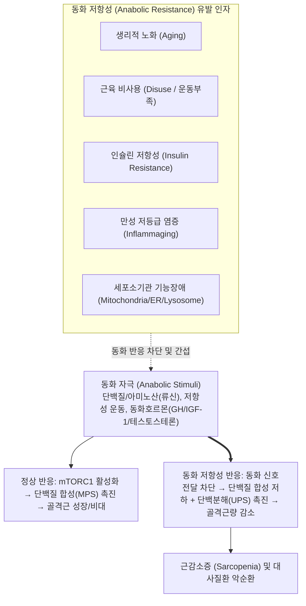
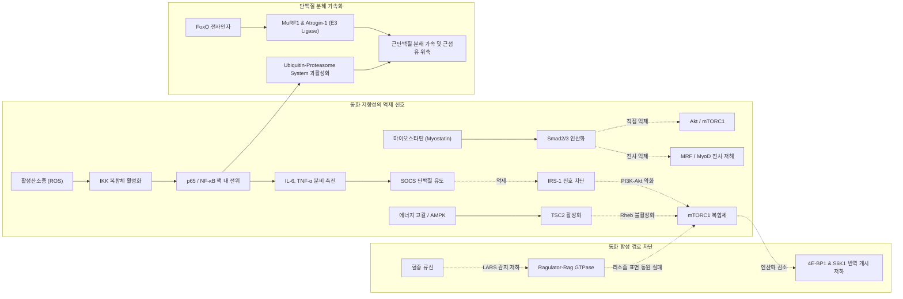
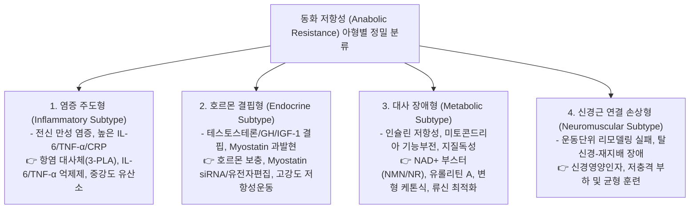
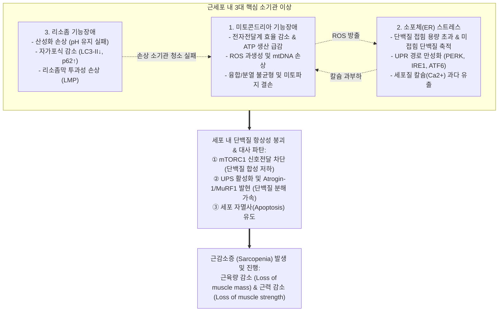
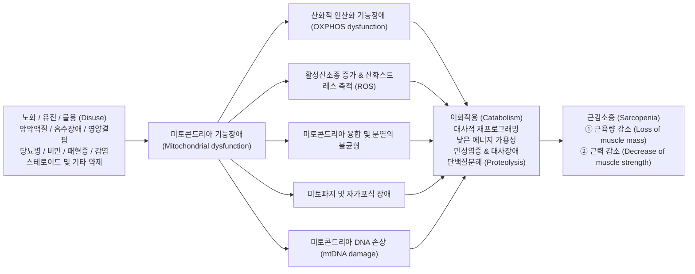
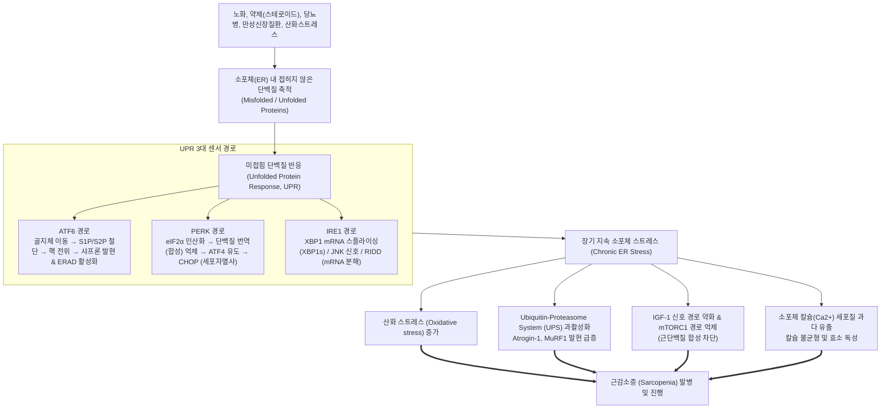
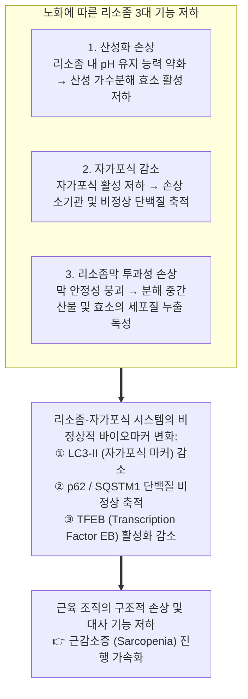

# 📑 [근감소증] PART 1. 개요: 06. 동화 저항성과 골격근 & 07. 세포 소기관의 이상과 근감소증

> **핵심 요약 (Key Summary)**
> - **[[동화 저항성|동화 저항성(Anabolic Resistance, AR)]]**은 영양소(단백질/[[아미노산]]), 운동(저항성 운동), 동화 호르몬([[테스토스테론]], [[성장호르몬]]/[[IGF-1]])과 같은 동화 자극(anabolic stimuli)에 대한 골격근의 단백질 합성 및 비대 반응이 현저히 저하·억제되는 병태생리학적 현상이다. 2005년 Michael J. Rennie에 의해 공식화되었으며, [[노화]], 인슐린 저항성, 만성 저등급 염증([[노쇠|Inflammaging]]) 및 신체 비사용과 결합하여 골격근 소실을 가속화하고 전신 대사질환을 촉발하는 악순환의 중심 고리로 작용한다.
> - **분자·세포학적 기전**으로는 $mTORC1$ 복합체 신호전달계의 활성 저하(Ragulator-Rag GTPase 조립 결함 및 류신 센서 LARS 손상), 활성산소종([[산화 스트레스|ROS]]) 및 염증성 [[사이토카인]]($TNF\text{-}\alpha$, $IL\text{-}6$)에 의한 $IKK/NF\text{-}\kappa B$ 활성화와 $SOCS$ 발현, $FoxO$ 전사에 의한 근육 특이 E3 ubiquitin ligase($MuRF1$, $Atrogin\text{-}1$) 급증, [[마이오스타틴]](Myostatin)-$Smad2/3$ 과활성화, 세포 내 $NAD^+$ 고갈에 따른 $SIRT1/PARP1$ 기능 저하, 그리고 $ECM$([[콜라겐]]·피브로넥틴) 과축적·경직화에 의한 $Integrin\text{-}FAK$ 및 $YAP/TAZ$ 기계신호 억제와 [[위성세포]](근육줄기세포)의 세포주기 정지($p21$, $p27$)가 맞물려 일어난다.
> - **세포 소기관 이상(Organelle Dysfunction)**은 근세포 대사 파탄의 핵심 엔진이다. ① **[[미토콘드리아]] 기능장애**는 전자전달계(ETC) 효율 저하로 인한 산화적 인산화($OXPHOS$) 파탄 및 $ATP$ 결핍, $mtDNA$ 손상과 $ROS$ 폭주, 과도한 미토콘드리아 분열(Fission)과 미토파지([[자가포식|Mitophagy]]) 결손을 초래한다. ② **소포체 스트레스([[소포체 스트레스|ER stress]])**는 단백질 접힘 용량 초과로 미접힘 단백질이 축적되어 $PERK\text{-}eIF2\alpha\text{-}ATF4$, $IRE1\text{-}XBP1s/JNK/RIDD$, $ATF6$의 3대 미접힘 단백질 반응($UPR$)을 가동하며, 장기화 시 $CHOP$ 매개 세포자멸사, $Ca^{2+}$ 누출 독성, $mTORC1$ 억제 및 $UPS$ 단백분해를 가속화한다. ③ **리소좀 기능장애**는 산성화(pH) 유지 실패, $LC3\text{-}II$ 감소, $p62/SQSTM1$ 축적, $TFEB$ 불활성화, 리소좀막 투과성 손상($LMP$)을 통해 대규모 단백질 및 손상 소기관 청소 실패를 야기하여 근육 항상성을 붕괴시킨다.
> - **다각적 극복 전략**은 단일 접근을 넘어 ① 약물 요법($mTORC1$ 작용제, $IL\text{-}6/TNF\text{-}\alpha$ 억제제, 화학적 샤프론 $4\text{-}PBA/TUDCA$, $NAD^+$ 부스터 $NR/NMN$, 장내 대사체 $Urolithin\text{-}A/3\text{-}PLA$), ② 영양 요법(고단백 $1.2\sim1.5\text{ g/kg/day}$, 류신 끼니당 $2.5\sim3\text{ g}$, [[비타민 D]] $1,000\sim2,000\text{ IU}$, 오메가-3 $2\sim4\text{ g}$, [[단쇄지방산]] $SCFA$), ③ 복합 운동(점진적 저항성 훈련 주 $2\sim3$회 $8\sim12\text{ RM}$ + 중강도 유산소 훈련 $VO_2max\ 60\sim75\%$), ④ 혁신 기술($CRISPR/Cas9$ [[마이오스타틴]] 편집, 줄기세포 유래 $EV/Exosome$, $AI$ 멀티오믹스 디지털 트윈)의 다중 통합 모델로 진화하고 있다.

---

## 📌 목차
- [I. Chapter 06. 동화 저항성과 골격근 (Anabolic Resistance and Skeletal Muscle)](#i-chapter-06-동화-저항성과-골격근-anabolic-resistance-and-skeletal-muscle)
  - [1. 동화저항성의 개념과 임상적 중요성](#1-동화저항성의-개념과-임상적-중요성)
  - [2. 동화저항성의 분자 및 세포 수준 기전](#2-동화저항성의-분자-및-세포-수준-기전)
  - [3. 골격근 소실의 전신적 파급 효과](#3-골격근-소실의-전신적-파급-효과)
  - [4. 주요 병태생리 조절 인자](#4-주요-병태생리-조절-인자)
  - [5. 임상 평가 및 진단 기법](#5-임상-평가-및-진단-기법)
  - [6. 다각적 치료 및 중재 전략](#6-다각적-치료-및-중재-전략)
  - [7. 결론: 4대 병인별 아형(Subtypes)과 미래 연구 방향](#7-결론-4대-병인별-아형subtypes과-미래-연구-방향)
  - [참고문헌 (Chapter 06 References)](#참고문헌-chapter-06-references)
- [II. Chapter 07. 세포 소기관의 이상과 근감소증 (Cellular Organelle Dysfunction and Sarcopenia)](#ii-chapter-07-세포-소기관의-이상과-근감소증-cellular-organelle-dysfunction-and-sarcopenia)
  - [1. 서론: 세포 소기관 상호작용 네트워크](#1-서론-세포-소기관-상호작용-네트워크)
  - [2. 미토콘드리아 이상과 근감소증](#2-미토콘드리아-이상과-근감소증)
  - [3. 소포체 스트레스(ER Stress)와 근감소증](#3-소포체-스트레스er-stress와-근감소증)
  - [4. 리소좀 기능 장애(Lysosomal Dysfunction)와 자가포식 파탄](#4-리소좀-기능-장애lysosomal-dysfunction와-자가포식-파탄)
  - [5. 요약 및 세포소기관 표적 치료 함의](#5-요약-및-세포소기관-표적-치료-함의)
  - [참고문헌 (Chapter 07 References)](#참고문헌-chapter-07-references)

---

# I. Chapter 06. 동화 저항성과 골격근 (Anabolic Resistance and Skeletal Muscle)
> **저자**: 류동렬(광주과학기술원 GIST), 조윤주(원광의대), 김주원(건국의대)  
> **출처**: 대한근감소증학회 《Sarcopenia: Muscle Wasting Disease (2nd Ed.)》 pp.103-120

---

## 1. 동화저항성의 개념과 임상적 중요성

### (1) 동화저항성(Anabolic Resistance, AR)의 정의
- **동화 자극(Anabolic stimuli)**: 골격근의 단백질 합성을 증가시켜 근육 성장을 유도하는 인자군.
  - 단백질 및 [[아미노산]](특히 필수아미노산, 가지사슬아미노산 류신 Leucine) 등의 영양소.
  - 규칙적이고 지속적인 저항성 운동(Resistance exercise).
  - 동화 호르몬(Anabolic hormones): [[테스토스테론]](Testosterone), 난드롤론(Nandrolone), 옥산드롤론(Oxandrolone) 등 아나볼릭 [[스테로이드]](Anabolic steroids), [[성장호르몬]]([[성장호르몬|GH]]), 인슐린유사성장인자-1([[IGF-1|IGF-1]]).
- **동화저항성(Anabolic Resistance, AR)**: 노화, 근육 비사용(Disuse / 운동부족), 인슐린 저항성(Insulin resistance), 만성 염증성 질환 등으로 인해 동화 호르몬, 아미노산 영양소, 운동 자극에 대한 **근육비대 및 단백질 합성 반응이 둔화·억제되어 골격근량이 지속 감소하는 병태생리학적 현상**.
- **개념의 정립 역사**:
  - 2005년 **Michael J. Rennie** 등에 의해 처음 공식화됨.
  - 당시 장기 이식 수혜자에서 아미노산 섭취 및 신체 운동에 대한 근육 단백질 합성 반응이 현저히 감소하는 현상을 규명하기 위해 제안됨.
  - 이후 [[노화]], [[근감소증]](Sarcopenia), 제2형 [[당뇨병]], [[비만]], 만성 신장질환(CKD) 등 다양한 대사 및 퇴행성 병태의 핵심 공통 기전으로 확립됨.

### (2) 병태생리학적 악순환 (Vicious Cycle)
- 동화 저항성은 노화와 대사 질환의 교차점에 위치하여 상호 증폭 악순환을 형성함:
  1. **인슐린 저항성 발생**: 동화 자극에 대한 민감도를 낮춰 동화 저항성을 악화시킴.
  2. **근육량 소실**: 골격근의 포도당 흡수 및 대사능(체내 포도당 처리의 핵심 역할) 저하 유발.
  3. **대사 항상성 붕괴**: 대사조절능 저하, 염증 반응 촉진, 에너지 불균형이 초래되어 다기관 노화 및 만성 대사질환의 진행 가속화.

### (3) 임상적 중요성
- **근력 감소 및 신체 기능 저하**: 근육량과 근력이 저하되어 낙상(Falls) 및 골절 위험 증가, 자립적 일상생활 수행 능력 저하.
- **기초대사율 저하 및 만성 대사질환 촉발**: 골격근 소실로 기초대사율(Basal Metabolic Rate, BMR)이 떨어져 에너지 소비 감소 $\rightarrow$ [[비만]], 인슐린 저항성, 대사증후군의 악순환 촉발 $\rightarrow$ 제2형 [[당뇨병]] 및 심혈관계 질환 진행 가속.
- **내분비적 조절 기능 손상**: 골격근 유래 마이오카인 분비 저하로 간, 지방, 면역계 간의 전신 대사 네트워크 붕괴.

---

## 2. 동화저항성의 분자 및 세포 수준 기전

### (1) 분자 수준 기전 (Molecular Mechanisms)
1. **$mTORC1$ (mammalian target of rapamycin complex 1) 활성 저하 (핵심 기전)**:
   - **정상 경로**: 혈중 류신 등 가지사슬아미노산([[BCAA]])이 $Ragulator\text{-}Rag\text{ GTPase}$ 복합체를 통해 $mTORC1$을 리소좀 표면으로 동원하고, [[인슐린]] 자극이 $IRS1\text{-}PI3K\text{-}Akt$ 축을 통해 $TSC2$를 억제하여 $Rheb\text{ GTPase}$를 활성화함으로써 $mTORC1$을 촉진함.
   - **동화 저항성 상태**:
     - 노화 및 인슐린 저항성으로 $IRS1$ 인산화 패턴이 변형되어 $PI3K\text{-}Akt$ 신호전달이 약화됨.
     - 류신 감지 센서 및 $LARS$(Leucyl-tRNA synthetase) 감지 능력 저하로 $Ragulator$ 복합체의 조립 및 동원이 원활하지 않음.
     - 에너지 고갈(ATP 결핍, AMP 증가)로 활성화된 $AMPK$가 $TSC2$를 직접 활성화하여 $Rheb$를 불활성화하고, $ULK1$을 인산화해 자가포식을 촉진하며 단백질 합성을 억제함.
     - 결과적으로 $4E\text{-}BP1$(eIF4E 결합 단백질)과 리보솜 단백질 $S6K1$의 $mTORC1$ 매개 인산화가 감소하여 단백질 번역 개시 및 근단백 합성 효율이 급감함.
2. **만성 염증, 활성산소종([[ROS]]) 및 유비퀴틴-프로테아좀 경로 과활성화**:
   - $ROS$ 축적이 $IKK$ 복합체를 활성화해 $I\kappa B\alpha$를 분해하고, $p65/NF\text{-}\kappa B$ 전사를 핵 내로 전위시켜 $IL\text{-}6, TNF\text{-}\alpha$ 등 염증성 [[사이토카인]] 발현을 증폭함.
   - 유도된 $SOCS$ 단백질이 인슐린 수용체 하위 전달체계를 저해하고, $FoxO$ 전사인자를 활성화하여 근육 특이 E3 유비퀴틴 리가아제인 **$MuRF1$**과 **$Atrogin\text{-}1$**의 전사를 증가시킴.
   - 그 결과 유비퀴틴-프로테아좀 시스템(Ubiquitin-Proteasome System, UPS)과 자가포식-리소좀(Autophagy-Lysosome) 시스템이 단백질 분해를 가속화함.
3. **[[마이오스타틴]]([[마이오스타틴|Myostatin]])-$SMAD2/3$ 신호 과활성화**:
   - 마이오스타틴 과발현 $\rightarrow$ 수용체 결합 후 인산화된 $SMAD2/3$가 핵으로 이동 $\rightarrow MRF$(Myogenic regulatory factor) 및 $MyoD$ 전사를 저해하여 위성세포 분화와 성숙 근섬유의 단백질 번역 준비 상태를 억제하고, 이차적으로 $Akt\text{-}mTORC1$ 경로를 차단함.

> ![[Sarcopenia_Ch06_p109_Fig1.png|540]]
> **그림 6-1. 동화 저항성의 원인**: mTORC1 복합체 활성 감소, 위성세포(근육줄기세포 Pax7, MyoD, Myf5) 기능 이상 및 감소, 혈관 경직 및 이상, 세포외기질([[콜라겐]]·피브로넥틴)의 과도한 축적, 소화기계 이상 및 장내미생물 불균형, NAD+ 수준 감소, 미토콘드리아 기능장애 및 미토파지 감소, Myostatin 과발현, 동화호르몬(Testosterone, GH, [[IGF-1]]) 분비 감소, 인슐린 저항성, 활성산소(ROS) 증가, 염증성 사이토카인(TNF-α, [[IL-6]]) 증가 및 [[NF-κB]] 경로 활성화, Ub-Proteasome 경로 과활성화, 오토파지-리소좀 기능 이상의 전신적·분자적 상호작용 네트워크.

### (2) 세포 수준 기전 (Cellular Mechanisms)
1. **위성세포([[위성세포|Satellite cell]], 근육줄기세포) 기능 저하 및 세포주기 정지**:
   - 정상 재생: 휴면 위성세포($Pax7^+$)가 손상 자극에 의해 $MyoD$를 발현하며 세포주기에 진입 $\rightarrow Myogenin$을 발현하며 근아세포로 분화 및 융합.
   - 동화 저항성 상태: 세포 내 $NAD^+$ 고갈로 $SIRT1$과 $PARP1$ 의존적 탈아세틸화 반응 저해 및 $TGF\text{-}\beta\text{-}SMAD$ 경로 활성화 $\rightarrow$ 세포주기 억제 인자인 **$p21, p27$ 발현 유도** $\rightarrow$ 세포주기 정지(Cell cycle arrest) $\rightarrow$ 위성세포 집단의 자가 재생과 분화 능력 감소로 재생 수요 충족 실패.
2. **세포외기질(Extracellular Matrix, ECM) 경직화(Stiffening)**:
   - 콜라겐과 피브로넥틴의 과축적으로 $ECM$ 경직화 유도.
   - 기계적 신호전달(Mechanotransduction) 변형 $\rightarrow Integrin\text{-}FAK$(Focal adhesion kinase) 경로 억제 $\rightarrow$ 세포 부착·이동성·생존 신호 손상.
   - 세포 내 기계자극 반응 전사인자인 $YAP/TAZ$의 핵 내 축적 저해 $\rightarrow$ 위성세포의 기저막 탈출 및 재생 부위 이동·근섬유 융합 효율 저하.

---

## 3. 골격근 소실의 전신적 파급 효과

### (1) 신체 구성 및 대사적 악순환
- **단백질 저장고 상실**: 골격근은 인체 전체 단백질 저장소의 약 40%를 차지하며, $Glut4$ 매개 포도당 수송, 유리지방산(FFA) 산화, [[젖산]] 제거의 핵심 장기임.
- **기초대사율 저하 및 지방 축적**: 근육량 감소 $\rightarrow$ 기초대사율(BMR) 저하 $\rightarrow$ 동일 칼로리 섭취에서도 에너지 소비 감소 $\rightarrow$ 체지방 축적 및 인슐린 저항성 동반.
- **전신 염증 악순환**: 비대해진 지방 조직에서 분비되는 $IL\text{-}6, TNF\text{-}\alpha$ 등 염증성 [[사이토카인]] 증가 $\rightarrow$ 전신 염증 심화 $\rightarrow$ 근육 내 염증 수준 악화의 상호작용 반복.
- **낙상 및 입원율 상승**: 근단면적(CSA) 감소 $\rightarrow$ 근섬유 수 감소 $\rightarrow$ 근력 및 지구력 저하 $\rightarrow$ 보행 속도 감소, 피로감 조기 발생 $\rightarrow$ 낙상 및 취약 골절 위험 상승, 장기 입원 및 회복 지연, 자립 생활 능력 상실.

### (2) 마이오카인(Myokines) 분비 저하와 전신 대사 항상성 붕괴
- 골격근 감소 시 분비형 단백질인 보호성 마이오카인 혈중 농도 급감:
  - **$IL\text{-}15$**: 단백질 동화 지원 및 대사 조절.
  - **Irisin**: 백색지방의 갈색화 유도 및 에너지 소비 촉진.
  - **Myonectin (CTRP15)**: 간 및 말초 조직의 [[지방산]] 산화 및 지질 대사 항상성 유지.
- 결과: 지방 분해와 베타 산화 촉진, 췌장 베타세포 기능 보호 효과가 사라져 제2형 [[당뇨병]], 대사증후군, 죽상경화성 심혈관계 질환 위험 급증.

---

## 4. 주요 병태생리 조절 인자

| 분류 | 조절 인자 | 동화 저항성에서의 변화 및 병태 메커니즘 |
| :--- | :--- | :--- |
| **내분비계** | **[[테스토스테론]] ([[테스토스테론]])** | 분비 감소 $\rightarrow$ [[안드로겐]] 수용체 결합 감소 $\rightarrow Akt\text{-}mTORC1$ 경로 활성 저하 $\rightarrow$ 단백질 합성 효율 저해 |
| | **[[성장호르몬]]([[성장호르몬|GH]]) / [[IGF-1]]** | 분비 감소 $\rightarrow IGF\text{-}1\text{ 수용체}\text{-}IRS\text{-}PI3K\text{-}Akt$ 전달 둔화 $\rightarrow mTORC1$ 번역 개시 불안정화 |
| | **[[마이오스타틴]] ([[마이오스타틴]])** | $TGF\text{-}\beta$ 계열 억제 인자 발현 증가 $\rightarrow SMAD2/3$ 전사 촉진 $\rightarrow MRF/MyoD$ 억제 및 $Akt\text{-}mTORC1$ 차단 |
| **영양 요인** | **류신 ([[류신|Leucine]]) 감지계** | 류신 감지 수용체 및 $LARS$(Leucyl-tRNA synthetase) 기능 손상 $\rightarrow$ 혈중 류신 농도가 충분해도 단백질 합성 반응 둔화 |
| | **[[비타민 D]] ([[비타민 D]])** | $25(OH)D < 30\text{ ng/mL}$ 결핍 $\rightarrow VDR\text{-}NFATc1$ 경로 약화 $\rightarrow$ [[칼슘]] 항상성 붕괴 및 근수축·$mTORC1$ 활성 저하 |
| | **오메가-3 [[지방산]]** | $EPA/DHA$ 결핍 $\rightarrow$ 막 유동성 저하, $GPR120$ 항염증 수용체 자극 부재 $\rightarrow mTORC1\text{-}S6K1$ 감수성 저하 |
| **대사 장애** | **인슐린 저항성 & 지질독성** | $Glut4$ 재배치 저해 $\rightarrow$ 포도당 흡수 저하, $ATP$ 생성 감소 $\rightarrow AMPK$ 과활성 $\rightarrow TSC2$ 경유 $mTORC1$ 억제. $Ceramide, DAG$ 축적으로 $PKC\theta$ 활성화 $\rightarrow IRS1$ 인산화 억제 |
| **장내 미생물** | **[[단쇄지방산]] ($SCFA$)** | 부티레이트(Butyrate), 아세트산(Acetate), 프로피온산(Propionate) 감소 $\rightarrow GPR41/GPR43$ 경유 항염 신호 및 $AMPK\text{-}mTOR$ 조절 파탄 |
| | **유롤리틴 A ($Urolithin\text{ }A$)** | 미생물 대사산물 결핍 $\rightarrow PINK1/Parkin$ 매개 미토파지 저하 $\rightarrow$ 미토콘드리아 품질 관리 부전 |
| | **3-PLA ($3\text{-}Phenyllactic\text{ }Acid$)** | $Lactobacillus$ 유래 대사체 $\rightarrow ROS$ 억제 및 $NF\text{-}\kappa B$ 차단 항염 작용 |
| | **내독소 ($LPS$) 누출** | 장 투과성(Gut permeability) 증가 $\rightarrow LPS$ 유입 $\rightarrow TLR4$ 활성화 $\rightarrow NF\text{-}\kappa B, JNK$ 자극 $\rightarrow IRS1$ 인산화 방해 및 동화 저항성 가중 |

---

## 5. 임상 평가 및 진단 기법

### (1) 동위원소 표지 근육 단백질 합성 측정 (골드 스탠다드)
- **원리**: 안정 동위원소(예: $[^{13}C]\text{류신}$ 또는 $[^{2}H_5]\text{페닐알라닌}$)를 피하 또는 정맥으로 투여하여 근육 내 단백질 번역 속도를 직접 측정.
- **측정법**: 투여된 트레이서 아미노산이 근육 단백질로 통합되는 비율을 혈액과 근생검(Muscle biopsy) 시료의 동위원소 농축도 차이로 계산 $\rightarrow$ 식전·식후 또는 운동 전·후의 근육 단백질 합성률(Muscle Protein Synthesis, MPS) 및 분해율을 정밀 정량화.
- **장단점**: 가장 정확한 표준 평가법이나, 고가 시약, 침습적 근생검 시술, 고정밀 질량분석 장비가 필수적이어서 연구 목적에 주로 국한됨.

### (2) 혈액 기반 생체 표지자 (Biomarkers)
- **만성 염증 및 급성기 반응 단백**: $IL\text{-}6$, $TNF\text{-}\alpha$, $CRP$(C-reactive protein) 상승 $\rightarrow PI3K\text{-}Akt\text{-}mTORC1$ 신호 억제 및 단백분해 경로 활성화 반영.
- **근손상 지표**: 크레아틴키나아제(Creatine Kinase, CK), 마이오글로빈(Myoglobin)의 지속적 고수치 $\rightarrow$ 근육 세포막 파괴 및 근재생 지연 시사.
- **만성 스트레스 마커**: **$GDF15$(Growth Differentiation Factor 15)** $\rightarrow$ 수치가 높을수록 단백질 합성 저하 및 운동 후 회복 지연과 유의한 상관관계 보고.
- **특징**: 비침습적이고 반복 측정이 가능하나, 특이도가 낮을 수 있어 기능 및 영상 평가와 종합적 해석 필수.

### (3) 영상의학적 정밀 평가 모달리티
- **자기공명영상(MRI)**: 근육 단면적(Cross-sectional area, CSA)과 체적(Volume)을 가장 정밀하게 측정하고, 근섬유 내부의 지방 침착(Fat infiltration, Myosteatosis) 정도를 고해상도로 시각화.
- **이중 에너지 X선 흡수계측법([[DXA]])**: 사지 근육량(Appendicular Lean Mass, ALM)을 신속하고 간단히 정량화하며, 방사선 노출량이 적어 대규모 스크리닝에 적합.
- **근골격계 초음파(Ultrasound)**: 근육 두께와 에코 밀도(Echo intensity)를 실시간 측정하여 근섬유 밀집도와 지방 침윤을 비침습적·이동성 있게 평가.
- **진단 권고**: 평가 신뢰도를 높이기 위해 **최소 두 가지 이상의 영상 모달리티 병용**을 권장.

---

## 6. 다각적 치료 및 중재 전략

> ![[Sarcopenia_Ch06_p115_Fig1.png|540]]
> **그림 6-2. 동화 저항성의 치료**: 약물 치료(mTORC1 활성화제, 항염증 약물인 TNF-α/[[IL-6]] 억제제, 항산화제 [[ROS]] 억제제, 항체치료제 Myostatin 억제제, NAD 부스터 NR/NMN, 미토콘드리아 기능 회복제 Urolithin A/3-PLA), 운동 치료(근력 운동, 유산소 운동), 영양 치료(단백질 또는 필수 [[아미노산]] EAA/BCAA, [[비타민 D]] 및 비타민 B군, 장내 미생물 유래 대사체 SCFA/Urolithin A/3-PLA, 변형 케톤 생성 식단)를 망라한 다각적 통합 치료 모델.

### (1) 약물 치료 (Pharmacotherapy)
1. **$mTORC1$ 직접 활성제**: 류신 유사체(Leucine mimetics)나 $Rheb$ 활성 촉진 소분자 화합물 $\rightarrow mTORC1\text{-}S6K1$ 축 직접 자극으로 번역 개시 인자 인산화 복원. (장기 투여 시 인슐린 저항성 발생 대사 부작용 최소화를 위한 용량 최적화 연구 진행 중).
2. **항염증 생물학적 제제**:
   - $IL\text{-}6$ 수용체 억제제: **토실리주맙 (Tocilizumab)**.
   - $TNF\text{-}\alpha$ 억제제: **에타너셉트 (Etanercept)**.
   - 염증성 사이토카인을 낮춰 $NF\text{-}\kappa B$ 의존적 단백질 분해를 차단하고 $PI3K\text{-}Akt$ 전달 복원.
3. **항산화 및 대사 회복 물질**:
   - **$N\text{-}acetylcysteine$ (NAC)**: $ROS$ 직접 중화 및 세포 내 글루타티온 합성 촉진.
   - **$NAD^+$ 부스터**: **니코티나미드 리보사이드(Nicotinamide Riboside, NR)** 및 **니코티나미드 모노뉴클레오타이드(Nicotinamide Mononucleotide, NMN)** $\rightarrow$ 세포 내 $NAD^+$ 증가 $\rightarrow SIRT1, PARP1$ 활성 및 미토콘드리아 생합성 촉진, 위성세포 기능 복구 (임상 연구에서 악력·보행속도 개선 및 근섬유 $ATP$ 합성 효율 회복 입증).
   - **장내 유래 대사체**: **유롤리틴 A ($Urolithin\text{ }A$)**($PINK1/Parkin$ 매개 미토파지 촉진) 및 **$3\text{-}PLA$**($NF\text{-}\kappa B$ 억제를 통한 항염·항산화 작용).

### (2) 정밀 영양 요법 (Nutritional Therapy)
1. **고단백 식이 및 류신 최적화**:
   - 단백질 권장 섭취량: **체중 1 kg당 $1.2 \sim 1.5\text{ g/day}$ 이상** 매일 규칙적 섭취.
   - **류신 임계치(Leucine threshold)**: 끼니당 **최소 $2.5 \sim 3\text{ g}$의 류신** 공급 필수.
   - 아나볼릭 윈도우(Anabolic window): 운동 직후 **유청단백(Whey protein) $25 \sim 30\text{ g}$ + 말토덱스트린([[탄수화물]])** 섭취 $\rightarrow$ 혈중 류신 농도 신속 상승 유도.
2. **미세영양소 및 특수 [[지방산]] 보충**:
   - **[[비타민 D]]**: 혈중 $25(OH)D < 30\text{ ng/mL}$ 결핍 시, **$1,000 \sim 2,000\text{ IU/day}$를 $8 \sim 12$주간 보충** 후 재평가. $VDR\text{-}NFATc1$ 경로 경유 [[칼슘]] 항상성 및 $mTORC1$ 활성 정상화.
   - **비타민 B군 ($B_6, B_{12}$, [[엽산]])**: [[호모시스테인]] 대사 촉진을 통한 혈관 내피 기능 개선 및 단백질 합성 보조 인자 작용.
   - **오메가-3 지방산 ($EPA / DHA$)**: 체중 1 kg당 $0.1 \sim 0.2\text{ g}$ 수준(**하루 $2 \sim 4\text{ g}$**). 임상 연구에서 **$EPA\text{ }1,500\text{ mg} + DHA\text{ }1,000\text{ mg}$ 혼합제를 12주간 투여 시 보행속도 및 악력 $10 \sim 15\%$ 개선** 입증.
   - **[[단쇄지방산]]($SCFA$) 증진**: 프리바이오틱스 [[식이섬유]] 섭취 극대화 또는 부티레이트(Butyrate) $2 \sim 3\text{ g/day}$ 직접 보충 $\rightarrow GPR41/43$ 경유 $NF\text{-}\kappa B$ 억제 및 $AMPK\text{-}mTOR$ 균형 유지.
   - **변형 케톤 생성 식단(Modified Ketogenic Diet)**: $\beta\text{-hydroxybutyrate}$ 생산으로 항염 및 [[인슐린]] 감수성 개선. 단, 단백질 결핍에 따른 근단백 합성 위축을 막기 위해 **단백질을 체중 1 kg당 최소 $1.2\text{ g}$ 이상 유지**하고, $MCT$ 오일 또는 외인성 케톤염 병용.

### (3) 운동 요법 (Exercise Prescriptions)
1. **저항성 운동 (Resistance Training, RT)**:
   - 기계적 부하(Mechanical load) $\rightarrow$ 근섬유 미세손상 $\rightarrow IGF\text{-}1 / MGF$(Mechanogrowth factor) 분비 증가 $\rightarrow Pax7\text{-}MyoD\text{-}Myogenin$ 위성세포 활성화 및 근비대 촉진.
   - 운동 직후 $1 \sim 3$시간 동안 $mTORC1$과 $S6K1$ 인산화 급상승, **$24 \sim 48$시간 내 근단백 합성률(MPS) $30 \sim 50\%$ 증가**.
   - **처방 기준**: **주 $2 \sim 3$회, $8 \sim 12$회 반복 가능한 부하($8\sim12\text{ RM}$)**로 근육 피로 유도, 세트 간 휴식 $1 \sim 2$분.
2. **유산소 운동 (Aerobic Exercise, AE)**:
   - $PGC\text{-}1\alpha\text{-}NRF1\text{-}TFAM$ 경로 활성화 $\rightarrow$ 미토콘드리아 생합성 촉진, 산화 스트레스 완화, 대사 유연성(Metabolic flexibility) 회복.
   - **처방 기준**: **중강도($VO_2max\text{ }60 \sim 75\%$), 주 $3 \sim 5$회, 회당 $30 \sim 45$분**.
   - 임상 효과: 골격근 내 $SIRT3\text{-}MnSOD$ 발현 증가, **$ROS$ 제거 효율 $20 \sim 30\%$ 개선, [[인슐린]] 감수성 $15 \sim 20\%$ 향상**.
3. **혼합 전략(Hybrid Training) 및 주기화(Periodization)**:
   - 세트 간 고강도 인터벌 훈련($HIIT$) 결합 또는 유산소 운동 직후 류신 보충 병행 $\rightarrow PGC\text{-}1\alpha$ 및 $VEGF$ 발현 증가 $\rightarrow$ 모세혈관 밀도 및 영양 공급 개선.
   - 프로토콜: 주 2회 이상, 회당 $45 \sim 60$분. $4 \sim 6$주 단위 **주기화** 원칙 적용(과훈련 방지) 및 고령자 **저충격 부하·균형 운동(Balance training)** 필수 병행.

### (4) 최첨단 혁신 전략 (Cutting-edge Approaches)
- **유전자 편집 및 바이러스 매개 치료**:
  - $CRISPR/Cas9$ 기반 [[마이오스타틴]]($MSTN$) 유전자 편집 $\rightarrow$ 근섬유 직경 증가 및 근력 향상 입증.
  - $AAV$(Adeno-associated virus) 벡터 이용 $Myostatin\text{ siRNA}$ 전달 $\rightarrow SMAD2/3$ 과활성 완화. 조직 특이적 프로모터와 $miRNA$ 응답 요소를 도입하여 심장·간 독성을 배제하고 골격근 특이적 발현 달성.
- **세포외 소포체(Extracellular Vesicles, EV / 엑소좀 Exosome)**:
  - 근육 줄기세포 또는 중간엽줄기세포($MSC$) 유래 엑소좀 주입.
  - 내포된 $miR\text{-}206$, $miR\text{-}486$, $TGF\text{-}\beta$ 억제제, $IGF\text{-}1$이 손상 근육 환경에 직접 작용하여 위성세포 활성화 및 단백질 합성 복원 촉진.
- **장내 마이크로바이옴 정밀 공학 및 분변이식(FMT)**:
  - $SCFA$ 생산능 극대화 또는 [[비오틴]]·[[니아신]] 합성 경로가 보완된 유전자 공학 맞춤형 [[프로바이오틱스]].
  - 장-근육 축(Gut-muscle axis) 복원을 위한 $FMT$(Fecal microbiota transplantation) 임상시험 진행.
- **$AI$ 기반 멀티오믹스 디지털 트윈(Digital Twin)**:
  - 전자의무기록(EHR), 유전체 변이, 메타게놈, 대사체, 웨어러블 센서 데이터를 기계학습에 통합하여 개인별 AR 아형 및 진행 위험도를 조기에 예측하고 맞춤형 중재 솔루션 제공.

---

## 7. 결론: 4대 병인별 아형(Subtypes)과 미래 연구 방향

- **4대 병인별 아형(Subtypes) 분류의 중요성**:
  1. **염증 주도형**: 항염 대사체 및 중강도 유산소 운동 우선 배정.
  2. **호르몬 결핍형**: 맞춤형 호르몬 보충, [[마이오스타틴]] 표적 억제, 저항성 운동 선제 적용.
  3. **대사 장애형**: 미토파지 촉진 대사체($Urolithin\text{ }A$), $3\text{-}PLA$, $NAD^+$ 부스터 병용.
  4. **신경근 연결 손상형**: 신경근접합부 안정화 및 균형 운동 중심 중재.
- **미래 비전**: $AI$ 기반 예측 모델과 다중 오믹스(전사체, 메타게놈, 대사체, 단백체) 통합 플랫폼을 구축하여 사후 치료를 넘어 선제적·개인 맞춤형 예방 의료 체계를 완성하는 것이 핵심 과제임.

---

### 참고문헌 (Chapter 06 References)
1. Adams V, et al. Induction of MuRF1 is essential for TNF-alpha-induced loss of muscle function in mice. *J Mol Biol* 2008;384:48-59.
2. Albrecht E, et al. Irisin - a myth rather than an exercise-inducible myokine. *Sci Rep* 2015;5:8889.
3. Alcazar J, et al. Changes in systemic GDF15 across the adult lifespan and their impact on maximal muscle power: the Copenhagen Sarcopenia Study. *J Cachexia Sarcopenia Muscle* 2021;12:1418-27.
4. Angione AR, Jiang C, Pan D, Wang YX, Kuang S. PPARdelta regulates satellite cell proliferation and skeletal muscle regeneration. *Skelet Muscle* 2011;1:33.
5. Aragon AA, Tipton KD, Schoenfeld BJ. Age-related muscle anabolic resistance: inevitable or preventable? *Nutr Rev* 2023;81:441-54.
6. Barclay RD, Burd NA, Tyler C, Tillin NA, Mackenzie RW. The Role of the IGF-1 Signaling Cascade in Muscle Protein Synthesis and Anabolic Resistance in Aging Skeletal Muscle. *Front Nutr* 2019;6:146.
7. Bass JJ, et al. Overexpression of the vitamin D receptor (VDR) induces skeletal muscle hypertrophy. *Mol Metab* 2020;42:101059.
8. Bhasin S, Tenover JS. Age-associated sarcopenia - issues in the use of testosterone as an anabolic agent in older men. *J Clin Endocrinol Metab* 1997;82:1659-60.
9. Cui Z, et al. Structure of the lysosomal mTORC1-TFEB-Rag-Ragulator megacomplex. *Nature* 2023;614:572-9.
10. Dao T, et al. Sarcopenia and Muscle Aging: A Brief Overview. *Endocrinol Metab (Seoul)* 2020;35:716-32.
11. Haran PH, Rivas DA, Fielding RA. Role and potential mechanisms of anabolic resistance in sarcopenia. *J Cachexia Sarcopenia Muscle* 2012;3:157-62.
12. Hirasaka K, et al. Isoflavones derived from soy beans prevent MuRF1-mediated muscle atrophy in C2C12 myotubes through SIRT1 activation. *J Nutr Sci Vitaminol (Tokyo)* 2013;59:317-24.
13. Kim IY, Wolfe RR. Tracing metabolic flux in vivo: motion pictures differ from snapshots. *Exp Mol Med* 2022;54:1309-10.
14. Kim J, et al. A microbiota-derived metabolite, 3-phenyllactic acid, prolongs healthspan by enhancing mitochondrial function and stress resilience via SKN-1/ATFS-1 in C. elegans. *Nat Commun* 2024;15:10773.
15. Lee DH, Kim MT, Han JH. GPR41 and GPR43: From development to metabolic regulation. *Biomed Pharmacother* 2024;175:116735.
16. Lin S, et al. C-Reactive Protein Level as a Novel Serum Biomarker in Sarcopenia. *Mediators Inflamm* 2024;2024:3362336.
17. Liu J, Wang S, Shen Y, Shi H, Han L. Lipid metabolites and sarcopenia-related traits: a Mendelian randomization study. *Diabetol Metab Syndr* 2024;16:231.
18. Melouane A, Yoshioka M, St-Amand J. Extracellular matrix/mitochondria pathway: A novel potential target for sarcopenia. *Mitochondrion* 2020;50:63-70.
19. Nadeau L, Aguer C. Interleukin-15 as a myokine: mechanistic insight into its effect on skeletal muscle metabolism. *Appl Physiol Nutr Metab* 2019;44:229-38.
20. Pan L, et al. Inflammation and sarcopenia: A focus on circulating inflammatory cytokines. *Exp Gerontol* 2021;154:111544.
21. Qiu C, Yang X, Yu P. Sarcopenia: Pathophysiology and Treatment Strategies. *Endocr Metab Immune Disord Drug Targets* 2024;24:31-8.
22. Rathbone CR, Booth FW, Lees SJ. Sirt1 increases skeletal muscle precursor cell proliferation. *Eur J Cell Biol* 2009;88:35-44.
23. Ryu D, et al. NAD+ repletion improves muscle function in muscular dystrophy and counters global PARylation. *Sci Transl Med* 2016;8:361ra139.
24. Ryu D, et al. TORC2 regulates hepatic insulin signaling via a mammalian phosphatidic acid phosphatase, LIPIN1. *Cell Metab* 2009;9:240-51.
25. Ryu D, et al. Urolithin A induces mitophagy and prolongs lifespan in C. elegans and increases muscle function in rodents. *Nat Med* 2016;22:879-88.
26. Sancak Y, et al. Ragulator-Rag complex targets mTORC1 to the lysosomal surface and is necessary for its activation by amino acids. *Cell* 2010;141:290-303.
27. Sartori R, et al. Smad2 and 3 transcription factors control muscle mass in adulthood. *Am J Physiol Cell Physiol* 2009;296:C1248-57.
28. Seldin MM, Peterson JM, Byerly MS, Wei Z, Wong GW. Myonectin (CTRP15), a novel myokine that links skeletal muscle to systemic lipid homeostasis. *J Biol Chem* 2012;287:11968-80.
29. Seo JH, et al. Sphingolipid metabolites as potential circulating biomarkers for sarcopenia in men. *J Cachexia Sarcopenia Muscle* 2024;15:2476-86.
30. Sun Y, et al. Hidden pathway: the role of extracellular matrix in type 2 diabetes mellitus-related sarcopenia. *Front Endocrinol (Lausanne)* 2025;16:1560396.
31. Tahimic CG, Wang Y, Bikle DD. Anabolic effects of IGF-1 signaling on the skeleton. *Front Endocrinol (Lausanne)* 2013;4:6.
32. Trendelenburg AU, et al. Myostatin reduces Akt/TORC1/p70S6K signaling, inhibiting myoblast differentiation and myotube size. *Am J Physiol Cell Physiol* 2009;296:C1258-70.
33. Tsujimoto K, Takamatsu H, Kumanogoh A. The Ragulator complex: delving its multifunctional impact on metabolism and beyond. *Inflamm Regen* 2023;43:28.
34. Valentine RJ, Jefferson MA, Kohut ML, Eo H. Imoxin attenuates LPS-induced inflammation and MuRF1 expression in mouse skeletal muscle. *Physiol Rep* 2018;6:e13941.
35. West DW, Phillips SM. Anabolic processes in human skeletal muscle: restoring the identities of growth hormone and testosterone. *Phys Sportsmed* 2010;38:97-104.
36. Wu CL, Cornwell EW, Jackman RW, Kandarian SC. NF-kappaB but not FoxO sites in the MuRF1 promoter are required for transcriptional activation in disuse muscle atrophy. *Am J Physiol Cell Physiol* 2014;306:C762-7.
37. Yeung SSY, et al. Sarcopenia and its association with falls and fractures in older adults: A systematic review and meta-analysis. *J Cachexia Sarcopenia Muscle* 2019;10:485-500.
38. Yoshida H, Ishii M, Akagawa M. Propionate suppresses hepatic gluconeogenesis via GPR43/AMPK signaling pathway. *Arch Biochem Biophys* 2019;672:108057.
39. Zhang H, et al. NAD(+) repletion improves mitochondrial and stem cell function and enhances life span in mice. *Science* 2016;352:1436-43.
40. Zhu X, Topouzis S, Liang LF, Stotish RL. Myostatin signaling through Smad2, Smad3 and Smad4 is regulated by the inhibitory Smad7 by a negative feedback mechanism. *Cytokine* 2004;26:262-72.

---

# II. Chapter 07. 세포 소기관의 이상과 근감소증 (Cellular Organelle Dysfunction and Sarcopenia)
> **저자**: 전재한(경북의대)  
> **출처**: 대한근감소증학회 《Sarcopenia: Muscle Wasting Disease (2nd Ed.)》 pp.121-129

---

## 1. 서론: 세포 소기관 상호작용 네트워크

- **근육 세포의 생리적 특성**: 근육 세포는 다양한 세포 소기관의 유기적 상호작용을 통해 에너지 대사, 단백질 합성, 세포 내 항상성을 유지하며 정상적인 수축·이완 기능을 수행함.
- **핵심 세포 소기관의 역할**:
  - **[[미토콘드리아]](Mitochondria)**: 산화적 인산화를 통한 $ATP$ 대량 생산 및 활성산소종([[산화 스트레스|ROS]]) 생성·제거 조절의 중심, 세포 자멸사(Apoptosis) 조절자.
  - **소포체([[소포체 스트레스|Endoplasmic Reticulum, ER]])**: 단백질의 올바른 접힘(Protein folding) 조절 및 세포 내 [[칼슘]]($Ca^{2+}$) 항상성 유지 저장소.
  - **리소좀([[자가포식|Lysosome]])**: 자가포식(Autophagy)을 통해 손상된 단백질 및 세포 소기관을 분해·재활용하는 세포 내 청소부.
  - **페록시좀(Peroxisome)**: [[지방산]] 산화 및 산화 스트레스 해독 담당.
- **노화에 따른 소기관 기능 부전**: 노화 및 병리적 상태에서는 이들 소기관의 기능 이상이 누적되어 근육의 구조적·기능적 저하를 초래하며, 소기관 간 상호작용 장애는 근육 퇴화 과정을 가속화시키는 중심 요인임.

---

## 2. 미토콘드리아 이상과 근감소증

> ![[Sarcopenia_Ch07_p126_Fig1.png|540]]
> **그림 7-1. 다양한 질환에서의 미토콘드리아 기능 이상이 근감소증에 미치는 영향**: 노화/유전/불용, 암악액질/흡수장애/영양결핍, [[당뇨병]]/[[비만]], [[패혈증]]/감염/염증성질환, [[스테로이드]]/기타 약제 등 다양한 병인에 의해 유발된 미토콘드리아 기능장애(산화적인산화 기능장애, 미토파지 및 자가포식 장애, 융합 및 분열 불균형, 활성산소종 증가와 산화스트레스 축적, mtDNA 손상)가 이화작용, 대사적 재프로그래밍, 낮은 에너지 가용성, 만성염증, 대사장애, 단백질분해를 거쳐 최종 근육량 감소 및 근력 감소로 귀결되는 병태생리 흐름도.

### (1) 산화적 인산화(OXPHOS) 효율 감소 및 ATP 결핍
- 미토콘드리아 내막의 전자전달계(Electron Transport Chain, ETC)는 산화적 인산화(Oxidative Phosphorylation) 과정을 통해 $ATP$를 생산하는 핵심 기구임.
- 노화 및 병리적 상황(불용성 근육 위축, [[스테로이드]] 유발 근위축 등)에서 **전자전달계의 효율이 저하되면 $ATP$ 생산이 감소**하여 근육 세포가 심각한 에너지 결핍 상태에 빠짐.
- 에너지 대사 저하로 인해 근육 수축 및 재생 대사 과정이 약화되며 근육 질량 감소로 직결됨.

### (2) 활성산소종(ROS) 증가와 산화 스트레스 축적
- 전자전달계 효율 저하는 전자 누출을 일으켜 활성산소종($ROS$) 생성을 폭증시키며, 미토콘드리아 내 해독 기전이 이를 처리하지 못해 산화 스트레스가 축적됨.
- 축적된 $ROS$는 **미토콘드리아 DNA ($mtDNA$) 손상**을 유발하고, 단백질과 지질의 산화를 촉진하여 세포막과 효소 기능을 광범위하게 파괴함.
- $mtDNA$ 돌연변이 및 단백질 합성 결손은 복구 불능의 구조적 손상을 일으키며 근감소증을 가속화함.

### (3) 미토콘드리아 융합·분열(Dynamics) 불균형 및 미토파지(Mitophagy) 결손
- **동역학의 정상 기능**:
  - **융합(Fusion)**: 손상된 미토콘드리아를 건강한 미토콘드리아와 합쳐 결함을 보완하는 기전.
  - **분열(Fission)**: 손상된 부위를 선택적으로 분리해 제거하는 기전.
- **노화성 병태**:
  - 융합과 분열의 균형이 파괴되고 **과도한 분열**이 발생함.
  - 동시에 손상 미토콘드리아를 청소하는 **미토파지(Mitophagy)가 결손**됨.
  - 결과적으로 $ROS$를 방출하는 손상된 미토콘드리아가 세포 내에 비정상 축적되어 에너지 대사 효율을 떨어뜨리고 항상성을 무너뜨림.

### (4) 치료적 표적 및 중재 물질
- **미토콘드리아 생합성 촉진제**: $PGC\text{-}1\alpha$ 활성제.
- **$ROS$ 제거 항산화제**: **[[레스베라트롤]] (Resveratrol)** 및 [[비타민 D]] $\rightarrow$ 미토콘드리아 기능 유지 및 보호.
- **미토파지 촉진제**: 손상 미토콘드리아를 제거하고 세포 대사 균형을 회복하는 자가포식/미토파지 유도 전략.

---

## 3. 소포체 스트레스(ER Stress)와 근감소증

> ![[Sarcopenia_Ch07_p128_Fig1.png|540]]
> **그림 7-2. 소포체 스트레스에 의한 [[근감소증]] 발생 기전**: 노화, 약제, [[당뇨병]], 만성신장질환에 의해 유발된 소포체 스트레스(ER stress)에서 UPR 3대 센서인 ATF6(골지체 S1P/S2P 절단), PERK(eIF2α 인산화 및 단백질 번역 억제, ATF4 유도), IRE1(RIDD, JNK signaling, XBP1 mRNA 스플라이싱을 통한 XBP1s 형성)이 작동하고, 만성화 시 산화스트레스 증가, 유비퀴틴-프로테아좀 시스템(UPS) 활성화, [[IGF-1]] 및 mTORC1 억제를 통해 근감소증을 유발하는 분자 병태 도식.

### (1) 소포체 스트레스와 UPR 3대 센서
- 소포체(Endoplasmic Reticulum, ER)는 단백질 접힘(Protein folding)을 조절하고 세포 내 [[칼슘]] 저장소 역할을 수행함. 분자 샤프론(Chaperones)과 효소를 사용하여 정상 접힘을 보증함.
- 노화 및 스트레스로 단백질 접힘 용량(Folding capacity)이 감소하면 잘못 접힌 단백질이 축적되어 **소포체 스트레스**가 발생함.
- 세포는 방어 기전으로 **미접힘 단백질 반응(Unfolded Protein Response, UPR)**을 가동함:
  1. **$PERK$**: $eIF2\alpha$를 인산화하여 일반 단백질 번역(합성)을 일시 차단하고, $ATF4$ 및 지속 시 세포자멸사를 유도하는 **$CHOP$** 발현 촉진.
  2. **$IRE1$**: $XBP1\text{ mRNA}$를 스플라이싱하여 활성형 **$XBP1s$** 전사인자를 만들고, $JNK$ 신호 및 $RIDD$(Regulated IRE1-dependent decay) 가동.
  3. **$ATF6$**: 골지체로 이동해 $S1P, S2P$에 의해 절단된 후 핵으로 이동하여 샤프론 발현 및 소포체 연관 분해(**$ERAD$**) 유도.

### (2) 만성 소포체 스트레스가 근감소증을 유발하는 병리 기전
- **$mTORC1$ 및 $IGF\text{-}1$ 경로 억제**: 장기화된 $ER$ 스트레스는 $mTORC1$ 및 $IGF\text{-}1$ 동화 신호를 강하게 억제하여 근육 단백질 생성을 현저히 감소시킴.
- **유비퀴틴-프로테아좀 시스템($UPS$) 과활성화**: 근육 특이적 E3 ubiquitin ligase인 **$Atrogin\text{-}1$**과 **$MuRF1$** 발현을 급증시켜 미세근섬유와 구조 단백질의 분해를 촉진함.
- **[[칼슘]]($Ca^{2+}$) 누출에 의한 세포 독성**: 소포체 스트레스 증가 시 $ER$ 내 고농도 칼슘이 세포질로 과도하게 유출되어 칼슘 불균형을 초래하고, 칼슘 의존성 효소를 활성화하여 근세포 수축력과 재생 능력을 약화시킴.
- **산화 스트레스와의 악순환**: 산화 손상이 단백질 접힘을 방해하여 $ER$ 스트레스를 악화시키고, 이는 다시 $UPS$ 분해를 가속화하는 악순환을 형성함.

### (3) 소포체 스트레스 경감을 통한 치료 가능성
- **화학적 샤프론 (Chemical Chaperones)**: **$4\text{-}PBA$ (4-Phenylbutyric acid)** 및 **$TUDCA$ (Tauroursodeoxycholic acid)** $\rightarrow$ 소포체 내 단백질 접힘 환경 개선 및 $UPR$ 균형 조절.
- **영양 중재**: 고순도 오메가-3 [[지방산]], 천연 폴리페놀 $\rightarrow$ 항염·항산화 작용을 통한 $ER$ 스트레스 저감.
- **$UPR$ 특이 표적 조절**: $PERK, IRE1, ATF6$ 신호 경로의 과도한 활성화를 제어하거나 샤프론 단백질을 보강하여 비정상 단백질 축적 억제.

---

## 4. 리소좀 기능 장애(Lysosomal Dysfunction)와 자가포식 파탄

### (1) 리소좀 기능 저하에 의한 근감소증 유발 기전
- **폐기물 처리와 자가포식의 중추**: 리소좀(Lysosome)은 자가포식(Autophagy) 과정을 통해 손상된 소기관(미토파지 Mitophagy, 소포체포식 ER-phagy)과 비정상 단백질 응집체를 분해하여 재활용 가능한 대사 중간체로 전환하는 필수 소기관임.
- **$UPS$와의 차이점**: 유비퀴틴-프로테아좀 시스템($UPS$)이 반감기가 짧은 개별 단백질을 분해하는 반면, **리소좀은 대규모 단백질 복합체 및 손상된 소기관 전체를 일괄 처리**함.
- **기능 부전의 결과**: 리소좀 이상 시 분해와 재활용이 이루어지지 않아 단백질 항상성이 무너지고 세포 스트레스와 염증 반응이 유발되어 근육 조직의 퇴행이 가속화됨.

### (2) 노화에 따른 리소좀 3대 병리적 이상
1. **산성화 손상**: 리소좀 내 $pH$를 유지하는 양성자 펌프 능력이 약화되어 산성 가수분해 효소(Acid hydrolases)의 활성이 전반적으로 저하됨.
2. **자가포식 감소**: 노화에 따라 자가포식 활성이 떨어지며, 손상된 미토콘드리아와 소포체, 단백질 응집체의 축적이 증가함.
3. **리소좀막의 투과성 손상(Lysosomal Membrane Permeabilization, LMP)**: 리소좀막이 불안정해져 분해 중간산물과 가수분해효소가 세포질로 누출되어 근세포 손상과 염증을 유발함.

### (3) 근감소증에서의 분자 마커 이상
- **$LC3\text{-}II$ 감소**: 자가포식소체 형성과 자가포식 흐름(Autophagic flux)의 저하를 반영.
- **$p62 / SQSTM1$ 단백질 축적**: 자가포식에 의해 원활히 분해되어야 할 기질 수용체 단백질이 비정상적으로 과축적됨.
- **$TFEB$ (Transcription Factor EB) 활성화 감소**: 리소좀 생합성 및 자가포식 유전자 네트워크를 총괄하는 마스터 전사인자의 활성 저하.

---

## 5. 요약 및 세포소기관 표적 치료 함의

| 세포 소기관 | 핵심 생리 기능 | [[근감소증]] 시 주요 병태 이상 | 핵심 분자 마커 | 잠재적 치료 표적 및 중재 전략 |
| :--- | :--- | :--- | :--- | :--- |
| **[[미토콘드리아]]** | $ATP$ 생산 ($OXPHOS$), $ROS$ 조절, 세포 자멸사 제어 | 전자전달계 효율 저하, $ROS$ 과생성, $mtDNA$ 손상, 과도한 분열, 미토파지 결손 | $mtDNA$ 변이, $OXPHOS$ 활성 저하 | $PGC\text{-}1\alpha$ 생합성 촉진제, Resveratrol, [[비타민 D]], 미토파지 촉진제 (Urolithin A) |
| **소포체 ([[소포체 스트레스\|ER]])** | 단백질 접힘(Folding), [[칼슘]]($Ca^{2+}$) 항상성 유지 | 단백질 접힘 용량 초과, 만성 $UPR$ 활성화, $CHOP$ 유도 세포사멸, 세포질 $Ca^{2+}$ 누출 | $p\text{-}eIF2\alpha$, $ATF4$, $CHOP$, $XBP1s$, $Atrogin\text{-}1$, $MuRF1$ | 화학적 샤프론 ($4\text{-}PBA$, $TUDCA$), $UPR$ 경로 조절, 오메가-3 [[지방산]], 폴리페놀 |
| **리소좀 ([[자가포식\|Lysosome]])** | 세포 폐기물 분해 및 자가포식 재활용 | 산성화 손상, 자가포식 감소, 막 투과성 손상($LMP$), 청소 불능 | $LC3\text{-}II \downarrow$, $p62/SQSTM1 \uparrow$, $TFEB$ 활성 $\downarrow$ | 자가포식 촉진제, 리소좀 산성화 회복제, $TFEB$ 활성화 전략 |

- **종합 요약**:
  - 근감소증에서 세포 소기관의 이상은 상호 독립적인 사건이 아니라 밀접하게 연결된 **통합 병태생리 네트워크**를 형성함.
  - 미토콘드리아의 에너지 대사 저하와 산화 스트레스, 소포체의 단백질 접힘 실패와 만성 $UPR$ 독성, 리소좀의 자가포식 청소 결손이 맞물려 **단백질 합성 저하($mTORC1$ 억제)와 분해 가속($UPS$ 활성화)**을 영구화함.
  - 따라서 근감소증의 극복을 위해서는 단일 경로 차단을 넘어 미토콘드리아 생합성, 소포체 샤프론 보강, 자가포식-리소좀 기능 회복을 아우르는 **세포 소기관 통합 표적 치료(Inter-organelle targeted therapy)**가 요구됨.

---

### 참고문헌 (Chapter 07 References)
1. Casas-Martinez JC, Samali A, McDonagh B. Redox regulation of UPR signalling and mitochondrial ER contact sites. *Cell Mol Life Sci* 2024;81(1):250.
2. Covarrubias AJ, Perrone R, Grozio A, Verdin E. NAD+ metabolism and its roles in cellular processes during ageing. *Nat Rev Mol Cell Biol* 2021;22(2):119-41.
3. Deldicque L. Endoplasmic reticulum stress in human skeletal muscle: any contribution to sarcopenia? *Front Physiol* 2013;4:236.
4. Fan J, Kou X, Jia S, Yang X, Yang Y, Chen N. Autophagy as a potential target for sarcopenia. *J Cell Physiol* 2016;231(7):1450-9.
5. Grima-Terrén M, Campanario S, Ramirez-Pardo I, Cisneros A, Hong X, Perdiguero E, et al. Muscle aging and sarcopenia: the pathology, etiology, and most promising therapeutic targets. *Mol Aspects Med* 2024;100:101319.
6. Kubat GB, Bouhamida E, Ulger O, Turkel I, Pedriali G, Ramaccini D, et al. Mitochondrial dysfunction and skeletal muscle atrophy: causes, mechanisms, and treatment strategies. *Mitochondrion* 2023;72:33-58.
7. Leduc-Gaudet JP, Hussain SNA, Barreiro E, Gouspillou G. Mitochondrial dynamics and mitophagy in skeletal muscle health and aging. *Int J Mol Sci* 2021;22(15):8179.
8. Marzetti E, Calvani R, Coelho-Junior HJ, Landi F, Picca A. Mitochondrial quantity and quality in age-related sarcopenia. *Int J Mol Sci* 2024;25(4):2052.
9. Pang X, Zhang P, Chen X, Liu W. Ubiquitin-proteasome pathway in skeletal muscle atrophy. *Front Physiol* 2023;14:1289537.
10. Russo C, Valle MS, D'Angeli F, Surdo S, Malaguarnera L. Resveratrol and vitamin D: eclectic molecules promoting mitochondrial health in sarcopenia. *Int J Mol Sci* 2024;25(14):7503.
