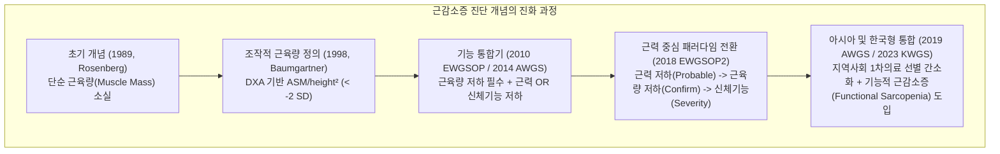
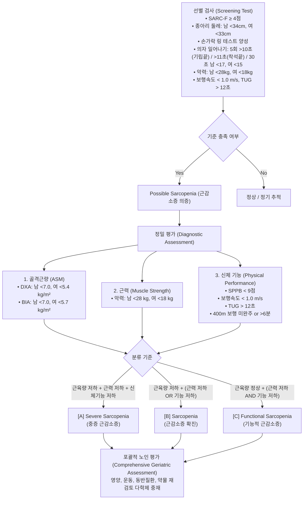
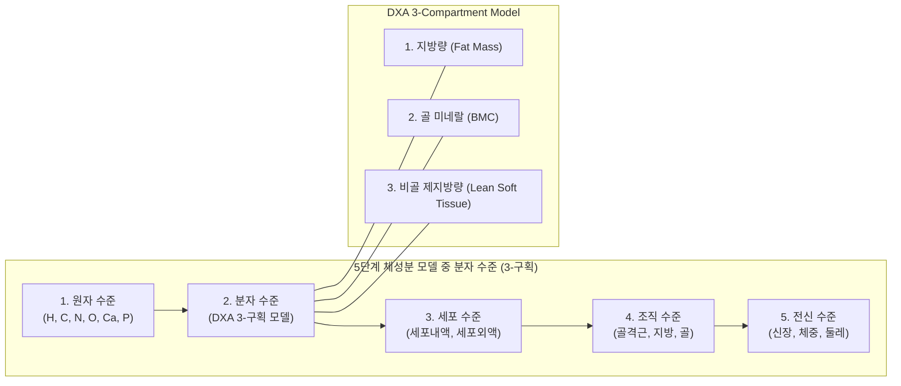

# 📑 [근감소증] PART 2-1 진단과 가이드라인 (Ch10~11)

> **핵심 요약 (Key Summary)**
> - [[근감소증]](Sarcopenia)은 1989년 Rosenberg의 골격근량 감소 개념에서 출발하여, 현재는 근육량뿐만 아니라 [[근력]](Muscle strength, 악력) 및 [[신체 기능]](Physical performance, [[보행속도]], [[SPPB]]) 저하를 포괄하는 조작적 진단 기준(EWGSOP2, AWGS 2019, SDOC, KWGS)으로 발전하였다.
> - 대한근감소증학회(KWGS 2023)는 한국형 임상 실무 지침으로 선별(SARC-F, 종아리 둘레 등) 후 근육량·근력·신체기능의 복합 평가를 통해 **Possible sarcopenia**, **Sarcopenia**, **Severe sarcopenia** 외에 근육량 보존 상태에서 근력 및 신체기능만 저하된 **Functional sarcopenia**(기능적 [[근감소증]]) 개념을 공식 도입하였다.
> - 골격근의 정량적 평가 표준 도구인 **이중에너지 X선 흡수계측법([[DXA]])**은 5단계 체성분 모델 중 분자 수준의 3-구획 모델(지방량, 골미네랄, [[비골]] [[제지방량]])을 측정하며, 고·저에너지 X선의 조직별 질량감쇠계수($\mu/\rho$) 차이와 [[K-edge]] 물리를 활용해 [[사지골격근량]](Appendicular Skeletal Muscle Mass, ASM)을 정밀하게 산출한다.
> - DXA 전신 스캔 시 최적화된 환자 자세(앙와위, 중립위, 팔-몸통 1 cm 이격, 발목 벨크로 고정)와 관심 영역(ROI: 머리, 몸통, 팔, 다리, 골반 삼각형) 설정의 질 관리가 근감소증 진단 지표(ASM/height², ASM/BMI)의 정확도에 결정적이다.

---

## 📌 목차
1. [Chapter 10. 근감소증의 진단과 가이드라인 (Diagnosis and Guidelines of Sarcopenia)](#chapter-10-근감소증의-진단과-가이드라인-diagnosis-and-guidelines-of-sarcopenia)
   - [1.1. 진단과 가이드라인의 변화](#11-진단과-가이드라인의-변화)
     - [(1) 초기 근감소증의 정의와 진단 기준](#1-초기-근감소증의-정의와-진단-기준)
     - [(2) 국제 가이드라인의 변천과 합의안](#2-국제-가이드라인의-변천과-합의안)
     - [(3) 국내 근감소증 작업 그룹(KWGS 2023) 가이드라인](#3-국내-근감소증-작업-그룹kwgs-2023-가이드라인)
   - [1.2. 근감소증 선별검사와 진단 지표](#12-근감소증-선별검사와-진단-지표)
     - [(1) 선별검사 대상 및 도구](#1-선별검사-대상-및-도구)
     - [(2) 3대 핵심 평가 지표: 근육량·근력·신체 기능](#2-3대-핵심-평가-지표-근육량근력신체-기능)
   - [1.3. 진단 절차 및 향후 발전 방향](#13-진단-절차-및-향후-발전-방향)
2. [Chapter 11. 골격근의 정량적 평가: Whole Body DXA (Quantitative Evaluation of Skeletal Muscle)](#chapter-11-골격근의-정량적-평가-whole-body-dxa-quantitative-evaluation-of-skeletal-muscle)
   - [2.1. DXA 검사의 원리와 공학적 이해](#21-dxa-검사의-원리와-공학적-이해)
     - [(1) 3-구획 모델(3-Compartment Model)과 조직 정량](#1-3-구획-모델3-compartment-model과-조직-정량)
     - [(2) 방사선 감쇠와 질량감쇠계수, K-edge 원리](#2-방사선-감쇠와-질량감쇠계수-k-edge-원리)
     - [(3) 스캔 방식: 펜슬빔(Pencil-beam) vs 팬빔(Fan-beam)](#3-스캔-방식-펜슬빔pencil-beam-vs-팬빔fan-beam)
   - [2.2. DXA 전신 스캔 검사 프로토콜 및 정도 관리](#22-dxa-전신-스캔-검사-프로토콜-및-정도-관리)
     - [(1) 검사 전 준비 및 인공물(Artifact) 관리](#1-검사-전-준비-및-인공물artifact-관리)
     - [(2) 표준 환자 자세(Positioning) 및 체크리스트](#2-표준-환자-자세positioning-및-체크리스트)
   - [2.3. 전신 스캔 영상 분석 및 임상 지표 해석](#23-전신-스캔-영상-분석-및-임상-지표-해석)
     - [(1) 관심 영역(ROI) 분할 원칙](#1-관심-영역roi-분할-원칙)
     - [(2) 사지골격근량(ASM) 산출 및 보정 지표](#2-사지골격근량asm-산출-및-보정-지표)
     - [(3) 결과 보고서 판독 및 추가 신체구성 지표(VAT, A/G ratio, LMI, FMI, RMR)](#3-결과-보고서-판독-및-추가-신체구성-지표vat-ag-ratio-lmi-fmi-rmr)
3. [출처 및 참고 문헌 (References)](#출처-및-참고-문헌-references)

---

## Chapter 10. 근감소증의 진단과 가이드라인 (Diagnosis and Guidelines of Sarcopenia)
- **저자**: 김태년(인제의대), 정희원(서울특별시/정희원저속노화연구소)

### 1.1. 진단과 가이드라인의 변화

#### (1) 초기 근감소증의 정의와 진단 기준
- **근감소증의 태동**: 1989년 Irwin Rosenberg가 노화에 따른 근육량 감소를 그리스어로 근육을 뜻하는 *sarx*와 소실을 뜻하는 *penia*를 결합하여 **[[근감소증]](Sarcopenia)**으로 명명함.
- **초기 패러다임**: 골격근량이 근력을 결정하는 핵심 요인이라는 전제하에 사지 골격근량의 감소만으로 진단할 수 있다고 봄.
- **Baumgartner 등의 연구 (1998, New Mexico Aging Process Study)**:
  - [[DXA]](Dual-energy X-ray Absorptiometry)를 이용하여 사지의 골과 지방을 제외한 **사지 골격근량(Appendicular Skeletal Muscle Mass, ASM)**을 정의.
  - 신장에 따른 체격 차이를 보정하기 위해 **$\text{ASM}/\text{height}^2$ ($\text{kg}/\text{m}^2$)** 지표 제시.
  - 진단 기준: 20~40세 젊은 건강 성인 기준 집단 평균치보다 2 표준편차($-2\text{ SD}$) 이하인 경우.
- **지표의 한계 및 대안 제시**:
  - **Newman 등 (Health ABC Study)**: $\text{ASM}/\text{height}^2$ 지표는 비만한 노인에서 유병률이 0%로 측정되는 오류 발생. 신장과 체지방량을 동시에 보정한 선형 회귀 잔차 모델(Residuals model) 제안.
  - **Janssen 등 (NHANES III)**: 생체전기저항분석법([[BIA]])을 활용하여 총골격근량(Total skeletal muscle mass)을 산출하고, 이를 체중으로 보정한 골격근량지수(**$\text{SMI} = \text{Skeletal Muscle Mass}/\text{Body Mass} \times 100$**) 도입.
    - Class I [[근감소증]]: 젊은 성인 평균 대비 $-1\text{ SD} \sim -2\text{ SD}$
    - Class II 근감소증: $-2\text{ SD}$ 미만

**표 10-1. 선행 연구에서 근육량 중심으로 정의한 근감소증 진단 기준**

| 주요 연구 (Main study) | 측정 기법 (Measuring techniques) | 근감소증 지표 (Indices) | 진단 기준 (Diagnostic criteria) |
| :--- | :--- | :--- | :--- |
| **New Mexico Aging Process Study** (Baumgartner et al., 1998) | DXA | $\text{ASM}/\text{height}^2$ | 젊은 성인 기준 집단 평균의 $-2\text{ SD}$ 미만 |
| **Health, Aging and Body Composition (ABC) Study** (Newman et al., 2003) | DXA | $\text{ASM}/\text{height}^2$ 체지방 및 신장 보정 잔차값 | 성별 하위 20% 백분위수 기준 |
| **National Health and Nutrition Examination Survey (NHANES III)** (Janssen et al., 2002) | BIA | $\text{SMI} (\%) = \frac{\text{골격근량}}{\text{체중}} \times 100$ | • Class I: 젊은 성인 대비 $-1 \sim -2\text{ SD}$ • Class II: 젊은 성인 대비 $-2\text{ SD}$ 미만 |

- **근육량 단독 평가의 한계와 [[근력저하증]](Dynapenia)의 대두**:
  - 연구 누적 결과 근육량 감소와 근력 저하 간의 상관성이 낮고 독립적일 수 있음이 밝혀짐(근육량 감소 vs. 근력 저하 분리).
  - 낮은 근육량 단독으로는 노인의 신체 기능 저하, 낙상, 일상생활장애, 사망 위험을 충분히 예측하지 못함에 따라 국제 작업 그룹들에 의한 **합의 진단 기준(Consensus criteria)**이 태동함.

---

#### (2) 국제 가이드라인의 변천과 합의안

**표 10-2. 주요 국제 [[근감소증]] 진단 그룹의 진단 기준 비교 (근육량, 근력, 신체 기능 기준점)**

| 진단 그룹 | 근육량 감소 (Low Muscle Mass) | 근력 저하 (Low Muscle Strength) | 신체 기능 저하 (Low Physical Performance) |
| :--- | :--- | :--- | :--- |
| **EWGSOP** (2010, 유럽) | • DXA: $\text{ASM}/\text{ht}^2 < 7.26\text{ kg/m}^2$ (남), $< 5.5\text{ kg/m}^2$ (여) • BIA: $\text{SM}/\text{ht}^2 < 8.87\text{ kg/m}^2$ (남), $< 6.42\text{ kg/m}^2$ (여) | 악력(Grip strength): • 남성 $< 30\text{ kg}$ • 여성 $< 20\text{ kg}$ | • [[SPPB]] $\le 8$점 • 보행 속도 $< 0.8\text{ m/s}$ |
| **IWGS** (2011, 국제) | • DXA: $\text{ASM}/\text{ht}^2 \le 7.23\text{ kg/m}^2$ (남), $\le 5.67\text{ kg/m}^2$ (여) | 명시적 악력 절단값 없음 (기능 중심) | • 보행 속도 $< 1.0\text{ m/s}$ |
| **AWGS** (2014, 아시아) | • DXA: $\text{ASM}/\text{ht}^2 < 7.0\text{ kg/m}^2$ (남), $< 5.4\text{ kg/m}^2$ (여) • BIA: $\text{ASM}/\text{ht}^2 < 7.0\text{ kg/m}^2$ (남), $< 5.7\text{ kg/m}^2$ (여) | 악력: • 남성 $< 26\text{ kg}$ • 여성 $< 18\text{ kg}$ | • 보행 속도 $< 0.8\text{ m/s}$ |
| **FNIH Sarcopenia Project** (2014, 미국) | • DXA: $\text{ASM}/\text{BMI} < 0.789$ (남), $< 0.512$ (여) (대안: ASM 남 $< 19.75\text{ kg}$, 여 $< 15.02\text{ kg}$) | 악력: • 남성 $< 26\text{ kg}$ • 여성 $< 16\text{ kg}$ | 보행 속도 $\le 0.8\text{ m/s}$ (결과 예측 지표로 활용) |
| **EWGSOP2** (2018, 유럽 개정) | • DXA: $\text{ASM} < 20\text{ kg}$ (남), $< 15\text{ kg}$ (여) • $\text{ASM}/\text{ht}^2 < 7.0\text{ kg/m}^2$ (남), $< 6.0\text{ kg/m}^2$ (여) | 악력: • 남성 $< 27\text{ kg}$ • 여성 $< 16\text{ kg}$ • 5회 의자일어서기 $> 15$초 | • 보행 속도 $\le 0.8\text{ m/s}$ • SPPB $\le 8$점 • [[TUG]] $\ge 20$초 • 400m 보행: 미완주 또는 $\ge 6$분 |
| **AWGS 2019** (2019, 아시아 개정) | • DXA: $\text{ASM}/\text{ht}^2 < 7.0\text{ kg/m}^2$ (남), $< 5.4\text{ kg/m}^2$ (여) • BIA: $\text{ASM}/\text{ht}^2 < 7.0\text{ kg/m}^2$ (남), $< 5.7\text{ kg/m}^2$ (여) | 악력: • 남성 $< 28\text{ kg}$ • 여성 $< 18\text{ kg}$ • 5회 의자일어서기 $\ge 12$초 | • 보행 속도 $< 1.0\text{ m/s}$ • SPPB $\le 9$점 • 5회 의자일어서기 $\ge 12$초 |

1. **EWGSOP (2010)**:
   - 근육량 감소를 기본 필수 조건으로 하고, 근력 저하 또는 신체 수행 능력 저하 중 하나 이상이 동반될 때 진단.
   - 3단계 임상 병기 제시:
     - **Presarcopenia(전근감소증)**: 근육량만 저하되고 근력 및 기능은 정상.
     - **Sarcopenia(근감소증)**: 근육량 저하 + 근력 저하 또는 신체기능 저하.
     - **Severe sarcopenia(중증 근감소증)**: 근육량, 근력, 신체기능 3가지 모두 저하.
2. **EWGSOP2 (2018) - 패러다임의 혁신**:
   - 근감소증 진단의 핵심 주 지표(Primary parameter)를 근육량에서 **근력(Muscle strength)**으로 전격 전환.
   - **F-A-C-S 진단 알고리즘**:
     - **Find (발견)**: SARC-F 설문지로 선별.
     - **Assess (평가)**: 악력 저하 또는 의자일어서기 저하 확인 시 **Probable Sarcopenia(근감소증 의증)** 판정 (이 단계에서 즉시 임상 중재 권고).
     - **Confirm (확진)**: DXA 또는 BIA로 근육량 저하를 확인하여 **Sarcopenia 확진**.
     - **Severity (중증도)**: 신체 수행 능력 저하(SPPB, 보행속도 등) 동반 시 **Severe Sarcopenia**로 판정.
3. **AWGS 2019 (아시아 개정안)**:
   - 아시아 고령자의 체격과 생활 습관을 반영.
   - **1차 진료/지역사회(Community)**와 **전문병원/연구기관(Hospital)**으로 이원화된 알고리즘 구축.
   - 지역사회에서는 SARC-F 또는 종아리 둘레 측정으로 선별 후, 악력 또는 의자 일어서기(5회 $\ge 12$초)로 **Possible Sarcopenia**를 분류하여 조기 생활습관 중재.
   - 보행 속도 기준을 서양(0.8 m/s)보다 엄격한 **$< 1.0\text{ m/s}$**로 상향.
4. **SDOC (2020, Sarcopenia Definitions and Outcomes Consortium)**:
   - 골격근량 측정이 부정적 임상 결과(낙상, 골절, 사망)를 독립적으로 예측하지 못한다는 통계적 근거를 바탕으로, **골격근량을 진단 기준에서 완전 배제**.
   - 오직 **악력(남 $< 35.5\text{ kg}$, 여 $< 20.0\text{ kg}$)**과 **보행 속도($< 0.8\text{ m/s}$)**의 기능 지표만으로 근감소증을 진단하는 파격적 단순화 시도.
5. **GLIS (2023, Global Leadership Initiative in Sarcopenia)**:
   - 전 세계 학회(EWGSOP, AWGS, SCWD, ANZSSFR 등)가 참여하여 글로벌 표준 단일 정의 도출을 추진 중인 최신 통합 이니셔티브.

---

#### (3) 국내 근감소증 작업 그룹(KWGS 2023) 가이드라인
- **배경**: 국내 진단 코드(한국표준질병사인분류, KCD) 도입 및 신의료기술 승인에도 불구하고 복잡한 알고리즘으로 임상 적용이 지연되자, 대한근감소증학회, 대한골대사학회, 대한노인병학회가 연합하여 40인 델파이 합의를 통해 한국형 가이드라인 개발.
- **특징**:
  - 사례 발견(선별)과 1차 평가를 결합하여 임상 실용성 극대화.
  - **Possible sarcopenia** 개념 유지.
  - 독창적인 **Functional Sarcopenia(기능적 [[근감소증]])** 범주 공식화: 근육량은 정상이지만 근력 저하와 신체 기능 저하가 동시에 나타난 상태로, 중증 근감소증과 유사한 임상적 개입 및 포괄적 노인 평가(CGA)가 필수적임.

> ![[Sarcopenia_Ch10_p171_Fig1.png|540]]
> **그림 10-1. KWGS의 근감소증 평가 알고리즘.** 선별검사(SARC-F, 종아리 둘레 등)를 통해 의심 환자(Possible sarcopenia)를 발굴한 후, 사지골격근량(ASM), 악력(Handgrip strength), 신체 기능(SPPB, 보행속도 등)을 평가하여 A(중증 근감소증), B(근감소증), C(기능적 근감소증)로 정밀 분류하고 포괄적 노인 평가로 연계하는 통합 진단 흐름도.

---

### 1.2. 근감소증 선별검사와 진단 지표

#### (1) 선별검사 대상 및 도구

**표 10-5. [[근감소증]] 평가가 필요한 임상적 상황 (KWGS guideline)**

| 구분 | 주요 임상 요소 및 상황 |
| :--- | :--- |
| **주요 임상 양상** | • 비의도적 체중 감소 • 전신 쇠약감 및 피로감 • 근육 감소에 대한 환자의 주관적 자각 증상 |
| **동화작용 저하 요인** | • 남성호르몬/성호르몬 억제 치료 이력 • 만성 글루코코르티코이드([[스테로이드]]) 투여 병력 • 만성 전신 염증 상태 • 종양성 질환(암) 또는 악액질([[Cachexia]]) |
| **영양 섭취 장애 요인** | • 우울증, 인지기능 저하, [[치매]] 등 정신·인지 장애 • [[다약제 복용]](Polypharmacy)으로 인한 식욕 부진 • 만성 소화기 증상([[변비]], [[소화불량]] 등) • [[연하장애]](Dysphagia) |
| **신체 활동 저해 요인** | • 최근 급성 질환 이환 또는 병원 입원 이력 • 반복적인 [[낙상]] 병력 • 이동성 제한 및 신체적 비활동 |
| **고위험 동반 질환군** | • [[심부전]], 만성폐쇄성폐질환(COPD), 만성신장질환(CKD), [[당뇨병]], [[골다공증]] 등 노인성 복합 만성질환 |

##### 주요 선별 도구 7가지
1. **[[SARC-F]] 설문지**:
   - 근력(Strength), 보행 보조(Assistance in walking), 의자에서 일어나기(Rise from a chair), 계단 오르기(Climb stairs), 낙상(Falls) 5문항 (총 0~10점).
   - 기준점: **$\ge 4$점**. (대규모 인구 집단 선별 시 민감도 향상을 위해 $\ge 2$점 적용 권장).
   - 장점: 설문 기반으로 신속 간편. 단점: 민감도가 낮고 특이도가 높음, 인지 저하 노인에서 회상 편향 가능.
2. **종아리 둘레(Calf Circumference, CC)**:
   - 비탄성 테이프로 양측 종아리 중 가장 두꺼운 부위를 서 있는 자세에서 측정.
   - 기준점: **남성 $< 34\text{ cm}$, 여성 $< 33\text{ cm}$**.
   - 주의: [[비만]] 노인은 피하지방으로 인해 위음성 가능성이 있으므로 BMI를 고려해야 함.
3. **손가락 링 테스트(Finger-ring test)**:
   - 양손의 엄지와 검지로 원을 만들어 종아리 가장 굵은 부위를 감싸는 자가 선별법. 종아리가 링보다 얇아 공간이 남는 경우 [[근감소증]] 의심.
4. **악력(Handgrip strength)**: 남성 $< 28\text{ kg}$, 여성 $< 18\text{ kg}$.
5. **의자 일어나기 테스트(Chair stand test)**:
   - 5회 반복 검사: 서 있는 자세로 종료 시 $> 10$초, 앉은 자세로 종료 시 $> 11$초.
   - 30초 반복 검사: 남성 $< 17$회, 여성 $< 15$회.
6. **보행 속도(Gait speed)**: 4m 또는 6m 보행 시 $< 1.0\text{ m/s}$.
7. **[[TUG]](Timed Up and Go)**: $\ge 12$초.

---

#### (2) 3대 핵심 평가 지표: 근육량·근력·신체 기능

##### ① 골격근량(Muscle mass) 평가
- **이중에너지 X선 흡수계측법([[DXA]])**: 제지방 연조직량을 통해 골격근량을 간접 추정하는 골드 스탠더드 도구. 피부·혈관·수분량이 포함되는 한계와 장비 제조사별 알고리즘 차이 존재.
- **생체전기저항분석법([[BIA]])**: 체수분과 전해질 전도율 차이를 이용. 이동이 용이하고 비침습적이나 수분 균형, 인종, 비만도에 영향을 받음.
  - 최신 다주파수 분절 분석(DSM-BIA)은 부위별 제지방량을 정밀 측정하며 세포외수분비(ECW/TBW) 및 위상각(Phase angle)을 보조 지표로 제공.
- **보정 지표 절단값 (KWGS 기준)**:
  - DXA: $\text{ASM}/\text{height}^2 < 7.0\text{ kg/m}^2$ (남성), $< 5.4\text{ kg/m}^2$ (여성).
  - BIA: $\text{ASM}/\text{height}^2 < 7.0\text{ kg/m}^2$ (남성), $< 5.7\text{ kg/m}^2$ (여성).

##### ② 근력(Muscle strength) 평가
- **악력 측정 프로토콜**:
  - 표준 도구: Jamar형 유압식 악력계 또는 Smedley형 스프링 악력계.
  - 자세: 팔꿈치를 90도로 굽히고 몸통에 붙인 상태(앉은 자세) 또는 편안히 선 자세에서 손목은 중립 위치를 유지.
  - 양측 손을 번갈아 가며 최소 2회 이상 최대 노력으로 측정 후 **최댓값(Maximal value)**을 채택.
  - 절단값: **남성 $< 28\text{ kg}$, 여성 $< 18\text{ kg}$**.

##### ③ 신체 기능(Physical performance) 평가
- **간이 신체 수행 능력 검사([[SPPB]], Short Physical Performance Battery)**:
  - 균형 검사(나란히 서기, 반일렬 서기, 일렬 서기 3단계, 4점 만점), 4m 보행 속도 검사(4점 만점), 5회 의자 일어나기 검사(4점 만점) 총 12점 만점.
  - 기준점: **$\le 8$점 또는 $< 9$점** 저하.
- **보행 속도**: 일상적 걸음 속도로 4m 또는 6m 측정, $< 1.0\text{ m/s}$ (가속/감속 구간을 둔 동적 측정 권장).
- **TUG 테스트**: 팔걸이 의자에서 일어나 3m 반환점을 돌아 다시 앉는 시간 측정, $\ge 12$초.
- **400m 보행 검사**: 400m 보행을 완주하지 못하거나 완주 시간이 $> 6$분인 경우.

---

### 1.3. 진단 절차 및 향후 발전 방향
1. **표준 진단 4단계**:
   - 1단계 [선별]: SARC-F, 종아리 둘레, 의자일어서기 등을 통한 위험군 스크리닝.
   - 2단계 [근력 평가]: 악력 측정으로 '[[근감소증]] 의증(Possible/Probable)' 확인.
   - 3단계 [근육량 확인]: DXA 또는 BIA로 사지골격근량(ASM)을 측정하여 '근감소증(Sarcopenia)' 확진.
   - 4단계 [기능 평가]: SPPB, 보행속도 등으로 중증도(Severe) 판정 및 기능적 근감소증 감별.
2. **미래 진단 전략**:
   - **근육의 질(Muscle Quality)**: 단순 양적 평가를 넘어 초음파(에코 강도), CT/MRI 기반 근지방증(Myosteatosis, 근내 지방 침착) 정량화.
   - **생체 바이오마커**: 신경근접합부 손상 지표(CAF, C-terminal agrin fragment), 근섬유 합성/분해 마커, 소변 틴틴(Titin) 조각 등 활용.
   - **디지털 바이오마커**: 스마트폰/웨어러블 가속도 센서를 이용한 일상생활 연속 보행 데이터 및 AI 기반 기능 분석.

---

## Chapter 11. 골격근의 정량적 평가: Whole Body DXA (Quantitative Evaluation of Skeletal Muscle)
- **저자**: 김근영 (부산의대)

### 2.1. DXA 검사의 원리와 공학적 이해

#### (1) 3-구획 모델(3-Compartment Model)과 조직 정량
- **체성분 분석 모델의 스펙트럼**: 신체 구성은 원자(Atomic), 분자(Molecular), 세포(Cellular), 조직(Tissue-system), 전신(Whole-body)의 5개 수준으로 분류됨.
- **DXA의 정량 영역**: DXA는 **분자 수준(Molecular level)**에서 신체를 3가지 구획으로 분할 정량함:
  1. **지방량(Fat Mass)**
  2. **골 미네랄 함량(Bone Mineral Content, BMC)**
  3. **[[비골]] 제지방 연조직량(Lean Soft Tissue Mass)**: 골격근, 내장 장기, 피부, 체수분 등을 포함.
- 사지(팔과 다리)에는 내장 기관이 없고 골격근, 지방, 골조직으로만 구성되어 있으므로, 사지의 비골 제지방 연조직량이 곧 **사지 골격근량(ASM)**을 매우 정확하게 대변함.

> ![[Sarcopenia_Ch11_p183_Fig1.png|540]]
> **그림 11-1. 5개 수준 다구성 체성분 모델(five-level multicompartment model of body composition)에 따른 체성분 분석.** 원자, 분자, 세포, 조직계, 전신의 5단계 체성분 분석 수준 중 DXA가 분자 수준에서 지방량, 골 미네랄, 비골 제지방 연조직의 3-구획(3-compartment)을 정량화하는 원리를 도식화한 모형.

---

#### (2) 방사선 감쇠와 질량감쇠계수, K-edge 원리
- **Beer-Lambert 감쇠 법칙**:
  단색 X-선이 두께 $x$, 밀도 $\rho$인 균일한 물질을 통과할 때의 감쇠 방정식:
  $$I = I_0 \cdot e^{-\mu x} = I_0 \cdot e^{-(\mu/\rho) \cdot M}$$
  ($I_0$: 입사 방사선량, $I$: 투과 방사선량, $\mu$: 선감쇠계수, $\mu/\rho$: 질량감쇠계수, $M$: 단위면적당 질량)
- **이중에너지(Dual-Energy)의 물리적 기전**:
  - 서로 다른 2가지 에너지 준위(고에너지 $I_H$, 저에너지 $I_L$)를 사용.
  - X선 감쇠의 두 가지 주요 상호작용: **광전효과(Photoelectric effect)**와 **컴프턴 산란(Compton scattering)**. 원자번호가 높은 물질(골 미네랄의 [[칼슘]], $Z=20$)은 저에너지에서 광전효과가 지배적이어서 감쇠가 급격히 커지며, 연조직(물, 탄소, 수소 등)은 컴프턴 산란이 우세함.
  - 2개 에너지의 감쇠비($R$-value):
    $$R = \frac{\ln(I_{0,L} / I_L)}{\ln(I_{0,H} / I_H)}$$
  - **골 조직이 없는 픽셀(연조직 픽셀)**: 순수 지방($R_{fat}$)과 순수 제지방 연조직($R_{lean}$) 사이의 $R$ 값을 통해 지방 비율(% Fat)을 수학적으로 계산.
  - **골 조직이 포함된 픽셀**: 인접한 연조직 픽셀들의 감쇠비를 외삽(extrapolation)하여 연조직 감쇠를 차감함으로써 순수 골 미네랄(BMC)을 계산.

> ![[Sarcopenia_Ch11_p184_Fig1.png|540]]
> **그림 11-2. (A) DXA의 기본 구조와 감쇠방정식, (B) 서로 다른 질량감쇠계수를 이용한 신체 조직 밀도 구분.** 고에너지($I_H$)와 저에너지($I_L$) 방사선 투과량의 감쇠 비율($R$-value)을 측정하여 뼈, 지방, [[비골]] 제지방 조직의 질량감쇠계수 차이로부터 체성분을 분리 산출하는 기하학적·수학적 메커니즘.

- **[[K-edge]] 필터링 원리**:
  - 입사 X선 광자의 에너지가 특정 원소의 K-껍질(K-shell) 전자 결합 에너지에 도달할 때 흡수 감쇠량이 급격히 불연속적으로 증가하는 현상(칼슘 4.03 keV, [[요오드]] 33.2 keV).
  - 희토류 금속 필터(예: Cerium 또는 Samarium)를 통과시켜 광범위한 다색 X선 스펙트럼을 명확히 분리된 두 개의 뚜렷한 에너지 피크로 정형화함.

---

#### (3) 스캔 방식: 펜슬빔(Pencil-beam) vs 팬빔(Fan-beam)

> ![[Sarcopenia_Ch11_p186_Fig1.png|540]]
> **그림 11-3. 펜슬빔 방식과 팬빔 방식의 모식도.** 단일 검출기를 이용해 점 단위 격자 패턴으로 순차 스캔하는 펜슬빔(Pencil-beam) 방식과, 슬릿 콜리메이터 및 다중 검출기 배열을 이용해 넓은 부채꼴 빔으로 빠르게 스캔하는 팬빔(Fan-beam) 방식의 기구학적 차이.

**표 11-1. 펜슬빔(Pencil-beam) 방식과 팬빔(Fan-beam) 방식의 특징 비교**

| 특징 | 펜슬빔(Pencil-beam) 방식 | 팬빔(Fan-beam) 방식 |
| :--- | :--- | :--- |
| **X선 빔 형태** | 단일 얇은 빔 (Pencil-shaped beam) | 넓은 부채꼴 모양 (Fan-shaped beam) |
| **스캔 경로** | 점 단위(Point-by-point) 래스터(Raster) 격자 이동 | 선 단위 순차 스캔 (슬릿 콜리메이터 사용) |
| **검출기 구조** | 단일 검출기 (Single detector) | 다중 검출기 배열 (Detector array) |
| **전신 스캔 시간** | 15 ~ 20분 (매우 느림) | 3 ~ 5분 (매우 빠름) |
| **기하학적 왜곡** | 왜곡 없음 (수직 투과) | 배율 왜곡(Magnification error) 발생 (소프트웨어 기하학적 보정 필수) |
| **방사선 피폭량** | 극히 미미함 ($< 1\ \mu\text{Sv}$) | 매우 낮음 ($1 \sim 5\ \mu\text{Sv}$, 흉부 X선의 수십분의 일 수준) |
| **현대 임상 적용** | 초기 장비, 현재는 거의 미사용 | 현대의 표준 DXA 시스템 전반에 적용 |

---

### 2.2. DXA 전신 스캔 검사 프로토콜 및 정도 관리

#### (1) 검사 전 준비 및 인공물(Artifact) 관리
- **복장 및 금속 제거**: 지퍼, 단추, 벨트, 브래지어 와이어, 동전, 액세서리 등 방사선 비투과성 금속 물질을 완전 제거하고 검사복 착용.
- **신장 및 체중 측정**: DXA 소프트웨어의 연조직 감쇠 알고리즘 및 [[근감소증]] 보정 지표($\text{ASM}/\text{ht}^2$) 계산의 기초가 되므로 당일 정밀 계측 필수.
- **체내 인공물 및 조영제 간격**:
  - 척추 융합술 기구, 인공관절, 페이스메이커 등 금속 임플란트는 해당 부위 제지방 및 골밀도 측정치에 인위적 오차를 유발함.
  - 바륨 위장관 조영제, 방사선 동위원소 검사, CT 조영제 투여 후에는 최소 3~7일 이상의 배출 기간을 거친 후 DXA를 시행해야 함.

**표 11-2. 대표적 DXA 제조사별 전신 스캔 장비의 특징**

| 제조사 / 모델군 | X선 발생 기법 | 에너지 분리 방식 | 검출기 기술 |
| :--- | :--- | :--- | :--- |
| **Hologic** (Horizon, Discovery 등) | 일정한 고전압 발생 (Continuous) | 희토류 K-edge 필터링 방식 | 다중 검출기 배열 (Linear array) |
| **GE Lunar** (Prodigy, iDXA 등) | 전압 스위칭 (Kilovoltage switching) 또는 K-edge | 펄스 듀얼 전압 스위칭 방식 | 고해상도 카드뮴 [[아연]] 텔루라이드(CZT) 등 직접 변환 검출기 |

---

#### (2) 표준 환자 자세(Positioning) 및 체크리스트
- **자세 정렬 원칙**:
  - 스캐너 중앙 세로 축(Centerline)에 척추를 일치시켜 평행하게 정렬.
  - 전신이 스캔 한계선(Scan boundaries) 내에 완전히 포함되어야 함.
  - 머리는 턱을 가볍게 당겨 중립 위치(Neutral position)를 유지하며 과도한 신전이나 굴곡 방지.
  - **팔의 배치**: 손바닥을 아래로 향하게(엎친 위치, Pronation) 두고 몸통과의 사이에 최소 **1 cm 이상의 간격**을 두어 몸통 연조직과 팔 연조직이 겹치지 않게 분리.
  - **다리와 발목의 배치**: 다리를 살짝 벌려 양 대퇴부가 닿지 않게 하고, 발은 중립을 유지한 채 움직임을 방지하기 위해 **발목을 벨크로 스트랩(Velcro strap)으로 단단히 고정**.

> ![[Sarcopenia_Ch11_p190_Fig1.png|540]]
> **그림 11-4. 전신 스캔을 위해 최적화한 검사대상자의 자세.** 침대 중심선에 척추를 정렬하고, 팔과 몸통 사이에 1 cm의 간격을 두며, 발목을 벨크로 테이프로 고정하여 앙와위(Supine)에서 전신이 온전히 스캔 영역 내에 들어가도록 최적화한 표준 자세.

**표 11-3. 미국 NHANES 표준에 따른 전신 스캔 검사 자세 평가 체크리스트**

| 검토 항목 | 확인 기준 |
| :--- | :--- |
| 1. 환자-스캐너 축 정렬 | 환자의 정중선(신체 중심축)이 테이블 중앙 표시선과 정확히 평행한가? |
| 2. 스캔 범위 포함 여부 | 머리 정수리부터 발가락 끝까지 전신이 스캔 유효 영역 내에 온전히 들어왔는가? |
| 3. 머리 및 턱 위치 | 머리가 중앙에 있고 턱이 들리거나 꺾이지 않은 중립 위치인가? |
| 4. 손바닥 방향 | 손바닥이 침대 바닥을 향하도록 평평하게 놓여 있는가? |
| 5. 팔과 몸통 간격 | 팔이 몸통과 겹치지 않고 최소 1 cm 이상의 명확한 이격 공간을 유지하는가? |
| 6. 하지 및 발목 고정 | 무릎과 발이 대칭적으로 중립을 이루며 발목 벨크로 스트랩으로 고정되었는가? |

- **체격이 큰 [[비만]] 환자(Scan boundary 초과 시) 대처법**:
  - 장비의 스캔 너비를 초과하는 고도 비만 환자의 경우 **반신 스캔(Half-body scan)** 기법 적용: 한쪽 팔과 다리가 완전히 포함되도록 정렬하여 촬영한 후 대칭성을 가정하여 2배로 계산하거나 제조사 전용 소프트웨어 외삽 알고리즘 적용.

---

### 2.3. 전신 스캔 영상 분석 및 임상 지표 해석

#### (1) 관심 영역(ROI) 분할 원칙
- 스캔 완료 후 소프트웨어가 자동 분할선을 제공하지만, 해부학적 랜드마크를 기준으로 조작자가 반드시 확인하고 수동 조정(Adjustment)해야 함.

> ![[Sarcopenia_Ch11_p192_Fig1.png|540]]
> **그림 11-5. 전신 스캔의 관심 영역(ROI) 예시.** 머리, 몸통, 양팔, 양다리, 골반 삼각형(Pelvic triangle)을 해부학적 랜드마크에 맞춰 정밀하게 구획화한 전신 스캔 영상 분석 분할선 설정의 표준 예시.

1. **머리(Head)**: 아래턱([[하악골]])의 최하단 경계선의 바로 윗선. (어깨 연조직이 침범되지 않도록 주의).
2. **양팔(Arms)**: 상완골두와 [[견갑골]] 관절와 사이의 **어깨 관절을 정확히 이등분**하는 대각선.
3. **몸통(Trunk)**: 상단은 하악 하단선, 측면은 팔 분할선, 하단은 골반 삼각형 상부 경계선.
4. **골반 삼각형(Pelvic Triangle)**: [[장골능]](Iliac crest) 상단, [[치골]] 결합(Pubic symphysis), [[천골]] 끝 또는 제5요추-제1천추 부위를 잇는 역삼각형 구획.
5. **양다리(Legs)**: 대퇴골두와 비구 사이의 **고관절(엉덩관절)을 이등분**하는 사선에서 시작하여 발끝까지 포함.

---

#### (2) 사지골격근량(ASM) 산출 및 보정 지표
- **사지골격근량(Appendicular Skeletal Muscle Mass, ASM)**:
  $$\text{ASM}\ (\text{kg}) = \text{양팔 제지방 연조직량} + \text{양다리 제지방 연조직량}$$
  (머리, 체간, 골반은 골조직 밀집 및 내장 장기, 두께 오차로 인해 제외).
- **골격근량 보정 지수**:
  - **$\text{ASM}/\text{height}^2$ ($\text{kg}/\text{m}^2$)**: 키가 클수록 골격근량이 증가하는 생체역학적 특성을 보정. 아시아 기준(AWGS): 남 $< 7.0$, 여 $< 5.4\text{ kg/m}^2$.
  - **$\text{ASM}/\text{BMI}$**: [[비만]] 노인에서 체질량지수를 고려한 보정 지수(FNIH): 남 $< 0.789$, 여 $< 0.512$.
  - **$\text{ASM}/\text{weight} \times 100$ (%)**: 체중 대비 근육량 비율. 체지방 과다 노인(근감소성 비만) 선별에 유리.

---

#### (3) 결과 보고서 판독 및 추가 신체구성 지표(VAT, A/G ratio, LMI, FMI, RMR)

> ![[Sarcopenia_Ch11_p195_Fig1.png|540]]
> **그림 11-6. 전신 스캔 결과지의 예시.** 부위별(팔, 다리, 체간, 전신) 골밀도, 지방량, [[제지방량]] 및 체지방률, 사지골격근량(ASM), 내장지방(VAT) 추정치가 포함된 임상용 Whole Body DXA 검사 결과 보고서의 전형적인 출력 양식.

**표 11-4. 전신 스캔 검사 결과 보고서에 포함되는 주요 용어 및 임상적 정의**

| 보고서 용어 (Parameter) | 해부·물리적 정의 및 임상적 의의 |
| :--- | :--- |
| **Total Mass (총 중량)** | 전신 체중 (지방량 + 제지방 연조직량 + 골 미네랄 함량의 합계) |
| **BMC (Bone Mineral Content)** | 골 미네랄 함량 (뼈를 구성하는 순수 무기질 질량, 단위: g 또는 kg) |
| **Fat Mass (체지방량)** | 피하지방, 내장지방, 근육내 지방을 포함한 전신 및 부위별 순수 지방 조직량 |
| **Lean Mass (제지방량)** | 총 중량에서 지방량과 BMC를 제외한 순수 연조직 질량 (근육, 장기, 수분 등) |
| **Fat-Free Mass (FFM)** | 제지방 질량 (Lean mass + BMC, 지방을 제외한 모든 신체 구성 성분) |
| **% Fat (체지방률)** | 부위별 또는 전신 총 중량 대비 체지방량의 백분율 ($\text{Fat mass} / \text{Total mass} \times 100$) |
| **ASM (Appendicular Lean Mass)** | 양측 상지 및 하지의 제지방 연조직량의 총합 ([[근감소증]] 진단의 핵심 모수) |
| **VAT (Visceral Adipose Tissue)** | 제4요추-제5요추(L4-L5) 부위의 피하지방을 제외한 복강 내 복막강 내장지방 추정치 ($\text{cm}^2$ 또는 $\text{g}$) |
| **A/G Ratio (Android/Gynoid Ratio)** | 남성형 복부 [[비만]] 구획(Android)과 여성형 둔부·대퇴 구획(Gynoid)의 체지방 비율 (심혈관 대사 위험도 지표) |
| **LMI (Lean Mass Index)** | 제지방량지수 ($\text{총 제지방량}(\text{kg}) / \text{height}^2(\text{m}^2)$), 만성 소모성 질환의 단백 영양 결핍 평가 |
| **FMI (Fat Mass Index)** | 체지방량지수 ($\text{체지방량}(\text{kg}) / \text{height}^2(\text{m}^2)$), 체격에 따른 절대적 체지방 과다 정량화 |
| **RMR (Resting Metabolic Rate)** | 휴식대사율(기초대사량 추정치, kcal/day): 대사적으로 활발한 FFM을 기반으로 회귀 방정식 산출 |

- **임상적 가치**:
  - DXA는 단순 근감소증 진단을 넘어 **근감소성 비만(Sarcopenic Obesity)**을 정밀하게 감별할 수 있는 유일한 표준 임상 장비임.
  - 근육량의 절대적 부족(Low ASM)과 내장지방 과다(High VAT, High A/G ratio)를 동시에 평가하여 심혈관 대사 합병증과 사망 위험을 종합적으로 계층화함.

---

## 출처 및 참고 문헌 (References)

1. 김태년, 최경묵. 근감소성 비만. 대한당뇨병학회지. 2013;14:166-73.
2. 박석원. 노인의 근감소증. 대한내분비학회지. 2007;22(1):1-7.
3. 장학철. 근감소증과 근감소성 비만. 대한노인병학회지. 2011;15(1):1-7.
4. 홍상모. Sarcopenia의 최신지견: 근감소증. 대한내과학회지. 2012;83(4):444-54.
5. 임재영. 근감소증의 정의와 진단 기준에 대한 전문가 합의의 최신 동향. Geriatric Rehabilitation. 2020;10(2):39-45.
6. Baek JY, Jung HW, Kim KM, et al. Korean Working Group on Sarcopenia guideline: expert consensus on sarcopenia screening and diagnosis by the Korean Society of Sarcopenia, the Korean Society for Bone and Mineral Research, and the Korean Geriatrics Society. *Ann Geriatr Med Res*. 2023;27(1):9-21.
7. Baumgartner RN, Koehler KM, Gallagher D, et al. Epidemiology of sarcopenia among the elderly in New Mexico. *Am J Epidemiol*. 1998;147:755-63.
8. Bhasin S, Travison TG, Manini TM, et al. Sarcopenia definition: the position statements of the sarcopenia definition and outcomes consortium. *J Am Geriatr Soc*. 2020;68:1410-1418.
9. Chen LK, Liu LK, Woo J, et al. Sarcopenia in Asia: Consensus report of the Asian Working Group for Sarcopenia. *J Am Med Dir Assoc*. 2014;15(2):95-101.
10. Chen LK, Woo J, Assantachai P, et al. Asian Working Group for Sarcopenia: 2019 consensus update on sarcopenia diagnosis and treatment. *J Am Med Dir Assoc*. 2020;21(3):300-307.
11. Cruz-Jentoft AJ, Baeyens JP, Bauer JM, et al. Sarcopenia: European consensus on definition and diagnosis: Report of the European Working Group on Sarcopenia in Older People. *Age Ageing*. 2010;39(4):412-423.
12. Cruz-Jentoft AJ, Bahat G, Bauer J, et al. Sarcopenia: revised European consensus on definition and diagnosis. *Age Ageing*. 2019;48(1):16-31.
13. Fielding RA, Vellas B, Evans WJ, et al. Sarcopenia: an undiagnosed condition in older adults. Current consensus definition: prevalence, etiology, and consequences. International working group on sarcopenia. *J Am Med Dir Assoc*. 2011;12(4):249-256.
14. Janssen I, Heymsfield SB, Baumgartner RN, Ross R. Estimation of skeletal muscle mass by bioelectrical impedance analysis. *J Appl Physiol*. 2000;89(2):465-471.
15. Newman AB, Kupelian V, Visser M, et al. Sarcopenia: alternative definitions and associations with lower extremity function. *J Am Geriatr Soc*. 2003;51(11):1602-1609.
16. Rosenberg IH. Sarcopenia: origins and clinical relevance. *J Nutr*. 1997;127(5 Suppl):990S-991S.
17. Hangartner TN, Warner S, Braillon P, et al. The official positions of the International Society for Clinical Densitometry: acquisition of dual-energy X-ray absorptiometry body composition and considerations regarding analysis and interpretation of scans. *J Clin Densitom*. 2013;16(4):520-536.
18. Shepherd JA, Ng BK, Fan B, et al. Dual-energy X-ray absorptiometry body composition reference values from NHANES. *Am J Clin Nutr*. 2017;106(4):1120-1129.
