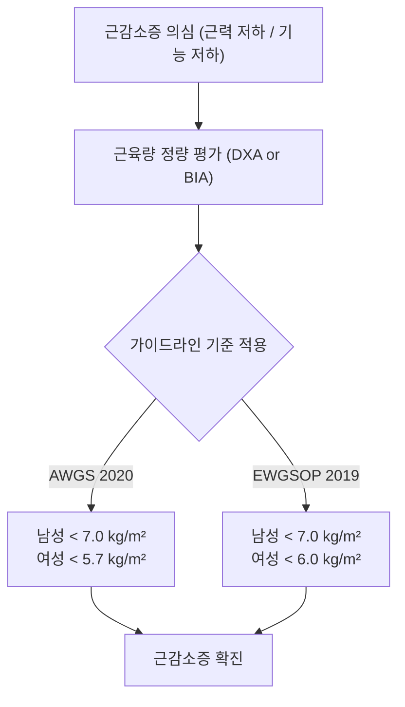
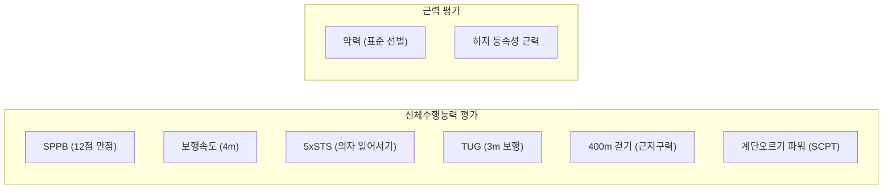

# 📑 [근감소증] 골격근의 정량적 평가(BIA) 및 기능 평가

> **핵심 요약 (Key Summary)**
> - **생체 전기 임피던스 분석법(BIA)**: 인체를 전도체로 가정하여 전류 전도성 차이로 체수분 및 [[제지방량]](FFM), [[사지골격근량]](ASM)을 추정하는 비침습적 정량 도구로, **부위별 다주파수 BIA(DSM-BIA)**의 발전으로 [[DXA]]와 높은 상관성($r=0.92\sim0.969$)을 보임.
> - **골격근의 기능 평가 필요성**: 단순 근육량 감소만으로는 기능 저하를 온전히 설명하지 못하므로, [[근감소증]] 진단 및 중증도 판정을 위해 **신체수행능력(SPPB, 보행속도, TUG, 400m 걷기)**과 **근력(악력, 하지 등속성 근력)** 평가가 필수적으로 병행됨.
> - **신체수행능력 핵심 지표**: [[SPPB]](12점 만점, 균형·보행속도·의자일어서기), [[보행속도]](평상시 보행속도 $<0.8\text{ m/sec}$ 시 신체기능 저하), 악력(AWGS2 기준 남성 $<28\text{ kg}$, 여성 $<18\text{ kg}$)이 임상 표준으로 적용됨.
> - **근육의 질([[근질]], Muscle Quality)**: 근육 단면적당 수축력, 근파워, 최대단축속도, [[칼슘]] 민감도, 근내 지방 침착([[Myosteatosis]]) 및 [[노화]]에 따른 **Type II 속근섬유의 선택적 위축**을 반영하는 핵심 병태생리 개념.

---

## 📌 목차
1. [Chapter 12. 골격근의 정량적 평가: 생체 전기 임피던스 분석법 (BIA)](#1-chapter-12-골격근의-정량적-평가-생체-전기-임피던스-분석법-bia)
   - [1.1 골격근 정량화의 기본 물리적 원리](#11-골격근-정량화의-기본-물리적-원리)
   - [1.2 BIA 기술의 발전 (부위별 분석 & 다주파수 분석)](#12-bia-기술의-발전-부위별-분석--다주파수-분석)
   - [1.3 주요 임상 가이드라인별 권고 및 진단 임계값](#13-주요-임상-가이드라인별-권고-및-진단-임계값)
   - [1.4 DSM-BIA의 진단적 유효성 및 DXA와의 일치도](#14-dsm-bia의-진단적-유효성-및-dxa와의-일치도)
2. [Chapter 13. 골격근의 기능 평가 (Functional Evaluation of Skeletal Muscles)](#2-chapter-13-골격근의-기능-평가-functional-evaluation-of-skeletal-muscles)
   - [2.1 서론: 근육량과 신체 기능의 괴리 및 기능 평가의 의의](#21-서론-근육량과-신체-기능의-괴리-및-기능-평가의-의의)
   - [2.2 신체기능(Physical Function) 및 신체수행능력(Physical Performance) 평가 도구](#22-신체기능physical-function-및-신체수행능력physical-performance-평가-도구)
     - [(1) 간단신체수행능력검사 (SPPB)](#1-간단신체수행능력검사-sppb)
     - [(2) 보행속도 (Gait Speed)](#2-보행속도-gait-speed)
     - [(3) 5회 반복 앉고 일어서기 검사 (5xSTS)](#3-5회-반복-앉고-일어서기-검사-5xsts)
     - [(4) 일어서서 걷기 검사 (TUG)](#4-일어서서-걷기-검사-tug)
     - [(5) 400m 걷기 검사 (400MWT)](#5-400m-걷기-검사-400mwt)
     - [(6) 계단오르기 파워검사 (SCPT)](#6-계단오르기-파워검사-scpt)
   - [2.3 근력 (Muscle Strength) 평가](#23-근력-muscle-strength-평가)
     - [(1) 악력 측정 (Handgrip Strength)](#1-악력-측정-handgrip-strength)
     - [(2) 하지 근력 측정 (등속성 근력 평가)](#2-하지-근력-측정-등속성-근력-평가)
   - [2.4 근질 (Muscle Quality)의 개념과 평가](#24-근질-muscle-quality의-개념과-평가)
     - [(1) 근질의 정의와 중요성](#1-근질의-정의와-중요성)
     - [(2) 근질의 평가 방법 (근력/근단면적, 생역학적 평가)](#2-근질의-평가-방법-근력근단면적-생역학적-평가)
     - [(3) 노화 근육에서 나타나는 근질의 변화](#3-노화-근육에서-나타나는-근질의-변화)
3. [결론 및 임상적 제언 (맺음말)](#3-결론-및-임상적-제언-맺음말)
4. [출처 및 참고 문헌 (References)](#4-출처-및-참고-문헌-references)

---

## 1. Chapter 12. 골격근의 정량적 평가: 생체 전기 임피던스 분석법 (BIA)
- **저자**: 백지연 (울산대학교 의과대학)

### 1.1 골격근 정량화의 기본 물리적 원리
- **개요**: [[생체전기임피던스분석법]](BIA, Bioelectrical Impedance Analysis)은 체수분과 [[제지방량]](fat-free mass, FFM)을 추정하는 간편하고 신속하며 비침습적인 도구이다.
  - 전통적으로 골격근을 간접 평가하는 지표로 사용되었으나, [[제지방량]](FFM)은 사지골격근량(appendicular skeletal muscle mass, ASM)뿐 아니라 수분 변동성이 큰 장기, 골조직, 세포외 수분을 포함한다는 점을 고려해야 한다.
- **물리적 원리**:
  - 조직의 생물학적 특성에 따른 **전기 전도성(electrical conductivity)** 차이를 이용한다.
  - 수분과 전해질이 풍부할수록 전기 전도성이 증가하므로, 전류를 인가하여 측정한 [[임피던스]](impedance, $Z$)를 통해 체수분의 부피($V$)를 역산한다.
  - 인체를 **균질한 원통형 전도체(isotropic cylindrical conductor)**로 가정한다.

```
원통의 부피: V = L × A  (①)
임피던스 공식: Z = ρ × (L / A)  (②)
단면적 치환: A = ρ × (L / Z)  (③)
체수분 부피 유도: V = ρ × (L² / Z)  (④)
(단, Z: 임피던스, ρ: 고유저항, L: 전도체 길이[신장], A: 단면적)
```

> ![[Sarcopenia_Ch12_p201_Fig1.png|540]]
> **그림 12-1. 전도체와 임피던스 지수 전개 공식.** 원통의 부피 공식(①)과 임피던스의 물리적 성질(②)을 이용한다. $Z = \rho L/A$; $Z$=impedance(임피던스), $\rho$=specific resistivity(고유저항), $L$=Length(길이), $A$=cross-sectional area(단면적).

- **체성분 산출 흐름**:
  $$\text{신장}(L) \text{ 및 } \text{임피던스}(Z) \longrightarrow \text{체수분량}(V) \longrightarrow \text{[[제지방량]]}(\text{FFM}) \longrightarrow \text{체지방량} = \text{체중} - \text{FFM}$$

---

### 1.2 BIA 기술의 발전 (부위별 분석 & 다주파수 분석)

#### (1) 부위별 분석 (Segmental Analysis)
- **과거 전신 임피던스의 한계**: 전신을 하나의 원통으로 간주하던 기존 방식에서는, 몸통(Trunk)이 전신 근육의 50%를 차지함에도 불구하고 굵은 단면적으로 인해 임피던스는 사지의 약 1/10 수준에 불과하였다. 따라서 몸통 근육량이 크게 변해도 전신 임피던스는 $1\sim2\,\Omega$ 정도만 변하여 변화를 감지하기 어려웠다.
- **부위별 임피던스 측정 기술**: 인체를 **5개의 독립된 원통(양팔, 양다리, 몸통)**으로 구분하고 전극을 분리 배치하여 각 부위의 임피던스를 독립적으로 측정한다.
  - 사지 근육량뿐만 아니라 몸통 내부의 근육 및 지방 정보 반영이 가능해졌다.

> ![[Sarcopenia_Ch12_p202_Fig1.png|540]]
> **그림 12-2. 전신 임피던스 측정법（좌）과 부위별 임피던스 측정법（우）.** 전신 임피던스 측정법은 팔, 몸통, 다리의 단면적 차이에 상관없이 하나의 원통으로 보고 이에 대한 임피던스를 측정하는 방법으로는 부위별 임피던스의 정보를 얻을 수 없다. 부위별 임피던스 측정법은 인체를 5개의 원통으로 구분하여 전류와 전압 전극을 따로 배치하는 방식으로 부위별로 임피던스를 측정한다.

#### (2) 다주파수 분석 (Multi-frequency Analysis)
- **단주파수(50 kHz) 측정법의 한계**:
  - 총체수분(TBW)만을 산출하므로, 질환이나 [[노화]]로 인해 **세포외수분(extracellular water, ECW)**이 증가한 경우 세포내수분(ICW) 변화가 없더라도 총체수분이 과대평가되어 [[제지방량]] 실제보다 높게 측정되는 왜곡이 발생한다.
  - 노인 및 만성질환자의 **수화도(hydration status)** 불균형을 보정하지 못한다.
- **다주파수 기술의 생체물리학적 기전**:
  - **저주파 전류**: 세포막의 높은 전기용량성 저항을 통과하지 못하고 **세포외수분(ECW)**만을 통하여 흐른다.
  - **고주파 전류**: 높은 투과성으로 세포막을 통과하여 **세포내수분(ICW)** 및 세포외수분 모두를 관류한다.
  - 주파수 대역을 다양화하고 고주파를 활용함으로써 ICW와 ECW를 정밀하게 분리 측정하여 수분 불균형 환자에서도 정확한 체성분 및 근육량 평가가 가능하다.

---

### 1.3 주요 임상 가이드라인별 권고 및 진단 임계값



> ![[Sarcopenia_Ch13_p203_Fig1.png|540]]
> **그림 12-3. [[근감소증]] 아시아 가이드라인(좌)과 유럽 가이드라인(우)에서의 근육량 측정.** 아시아(AWGS) 및 유럽(EWGSOP) 가이드라인의 [[근감소증]] 및 중증 근감소증(Severe Sarcopenia) 진단 알고리즘과 근육량 컷오프 비교.

- **[[AWGS]](Asian Working Group for Sarcopenia, 2020)**:
  - 근육량 측정 도구로 MRI, CT, [[DXA]], BIA를 명시함.
  - 아시아 지역에서는 DXA와 BIA가 가장 널리 사용되며, 특히 **다주파수 BIA 장비를 이용한 사지골격근량(ASM) 측정이 DXA와 가장 높은 상관성**을 보임을 제시함.
  - **BIA 사지골격근량 임계값**:
    - **남성**: $< 7.0\text{ kg/m}^2$
    - **여성**: $< 5.7\text{ kg/m}^2$
- **[[EWGSOP]](European Working Group on Sarcopenia in Older People, 2019)**:
  - DXA, BIA, CT, MRI 사용 권고.
  - **BIA 사지골격근량 임계값**:
    - **남성**: $< 7.0\text{ kg/m}^2$
    - **여성**: $< 6.0\text{ kg/m}^2$
- **기타 글로벌 가이드라인 비교**:
  - **ASPEN (2019)**: 급성 및 만성 질환 환자 집단에서는 수분 변동으로 인한 오차 가능성으로 BIA 사용을 권장하지 않음.
  - **ICFSR (2018)**: 사용이 간편하여 AWGS, EWGSOP에서 권장되나, DXA에 비해서는 정확도가 낮다고 평가함.
  - **ESPEN (2017)**: 임상 현장에서 근육량 측정을 위해 DXA, BIA, CT 활용을 권고하며, 영양요법 치료 효과 판정을 위한 체성분 모니터링 도구로 BIA/DXA를 제안함 (세포외수분 산출의 유용성 강조).

---

### 1.4 DSM-BIA의 진단적 유효성 및 DXA와의 일치도
- **부위별 다주파수 BIA(DSM-BIA)와 DXA 간 상관성 분석 연구 결과**:
  - **전신 근육량 / [[제지방량]]**: 상관계수 $r = 0.92 \sim 0.969$, 결정계수 $R^2 = 0.85 \sim 0.947$
  - **사지(팔·다리)**: $r = 0.73 \sim 0.940$, $R^2 = 0.88 \sim 0.917$
  - **몸통**: $r = 0.927$, $R^2 = 0.890$
- **일치도 분석 결과**:
  - **전신**: 급내상관계수(ICC) $0.7 \sim 0.96$, 일치상관계수(CCC) $0.4$, 카파값($\kappa$) $0.2 \sim 0.48$
  - **사지**: ICC $0.83 \sim 0.93$, $\kappa = 0.397$
  - **몸통**: ICC $0.69 \sim 0.883$
- **종합 평가**:
  - DXA 대비 DSM-BIA 측정값이 전반적으로 과대 또는 과소 추정되는 경향이 있으나, 대부분의 연구에서 수용 가능한 높은 상관성과 일치도를 나타냄.
  - **임상적 장점**: DXA를 완전히 대체할 수는 없으나, **비침습성, 신속성, 방사선 무노출, 장비 이동성, 경제성(저비용)** 측면에서 매우 우수하여 대규모 스크리닝 및 임상 대안 검사로서 안전성과 유효성이 확립됨.

---

## 2. Chapter 13. 골격근의 기능 평가 (Functional Evaluation of Skeletal Muscles)
- **저자**: 임재영 (서울대학교 의과대학)

### 2.1 서론: 근육량과 신체 기능의 괴리 및 기능 평가의 의의
- **[[근감소증]] 개념의 진화**: 초기에는 단순히 근육량(Muscle Mass)의 감소로 정의되었으나, 근육량이 현저히 줄어도 기능이 유지되거나 반대로 근육량이 정상임에도 심각한 기능 저하를 보이는 사례가 빈번하여 **근력(Muscle Strength) 및 신체기능(Physical Function) 저하**가 필수 진단 기준으로 정립됨.
- **근육량과 기능장애 간 상관관계가 낮은 원인**:
  1. **근력 감소의 가속도**: 노화 시 근력 감소 속도가 근육량 감소 속도보다 훨씬 빠르게 진행됨.
  2. **수축 기관(Contractile apparatus)의 상대적 결손**: 근육 내 및 근육 사이 지방 축적([[Myosteatosis]]) 증가로 비수축성 조직이 부피를 차지함.
  3. **노화 및 질병에 따른 근세포 기능 부전**: 신경 지배 이상(denervation atrophy), [[칼슘]] 감수성 저하 등.
  4. 특히 **노쇠([[Frailty]])** 환자에서는 근육량이 수축 단백과 무관한 조직에 의해 외견상 유지될 수 있어 근육량만으로 기능을 대변할 수 없음.

---

### 2.2 신체기능(Physical Function) 및 신체수행능력(Physical Performance) 평가 도구



#### (1) 간단신체수행능력검사 (SPPB)
- **배경**: 미국 국립노화연구소(NIA)의 EPESE(Established Populations for Epidemiologic Studies of the Elderly) 연구를 통해 개발됨.
- **구성**: 노인 기능 평가 중 객관적이고 유용한 3가지 항목(균형, 보행속도, 의자 일어서기)을 각 4점, **총 12점 만점**으로 평가함.
- **세부 검사 항목**:
  1. **균형 검사(Balance, 4점 만점)**:
     - **일반자세(side-by-side stance)**: 두 발을 모으고 선 자세 (10초 유지 시 1점).
     - **반 일렬자세(semi-tandem stance)**: 한 발을 반쯤 앞으로 내밀어 겹쳐 선 자세 (10초 유지 시 1점).
     - **일렬자세(tandem stance)**: 앞발 뒤꿈치와 뒷발 앞꿈치가 일직선이 되게 선 자세 ($3\sim10$초 1점, 10초 이상 2점).
  2. **보행속도(Gait speed, 4점 만점)**: 4m 보행 시간 측정.
  3. **의자 일어서기 검사(Chair stand test, 4점 만점)**: 양팔을 가슴에 팔짱 낀 상태로 5회 일어서고 앉기를 반복하여 **5회째 선 자세**에서 검사 종료.

##### 표 13-1. 간단신체수행능력검사(SPPB) 평가기준
| 검사항목 | 대상자 점수 / 평가 지표 | 평가 기준 |
| :--- | :--- | :--- |
| **균형검사 (4점)** | 일반자세 | 10초 이상: **1점** |
| | 반 일렬자세 | 10초 이상: **1점** |
| | 일렬자세 | 3 ~ 10초: **1점** / 10초 이상: **2점** |
| **보행속도 (4점)** | 4m 보행 총 시간 (초) | $\le 4.82$초: **4점**<br/>$4.82 \sim 6.20$초: **3점**<br/>$6.21 \sim 8.70$초: **2점**<br/>$\ge 8.70$초: **1점** |
| **의자 일어서기 (4점)** | 5회 반복 소요 시간 (초) | $\le 11.19$초: **4점**<br/>$11.20 \sim 13.69$초: **3점**<br/>$13.70 \sim 16.69$초: **2점**<br/>$\ge 16.70$초: **1점**<br/>60초 이상 또는 실패: **0점** |

---

#### (2) 보행속도 (Gait Speed)
- **임상적 중요성**: 노인 신체기능 저하의 핵심 지표로, 보행속도가 빠를수록 전 연령에서 사망률이 감소하여 **"The mouse that roared"**(작지만 큰 영향을 주는 존재)로 평가됨.
- **임계값 (EWGSOP2 기준)**:
  - **정상 보행속도**: $\ge 1.0\text{ m/sec}$
  - **보행속도 저하**: $0.8 \sim 1.0\text{ m/sec}$
  - **신체기능 저하(비정상)**: $< 0.8\text{ m/sec}$
- **측정 프로토콜 및 논란**:
  - **정적 출발(Static start, NIH 권고)**: 출발선 정지 상태에서 출발하여 4m를 통과함. 반응시간 및 가속 구간이 포함되어 순수한 평상시 보행속도 반영에 논란 존재.
  - **가감속 구간 설정 방식**: 출발 전과 도착 후 $1\sim2\text{ m}$의 가속·감속 구간을 배제하고 $6\sim10\text{ m}$ 구간의 정속 보행 시간을 측정하는 방법.
  - **자동 측정 vs 수동 측정**: 초시계 수동 측정은 검사자의 반응시간으로 인해 자동 측정 장비보다 느리게 측정되는 경향이 있음.
  - **보통 보행속도(Usual gait speed)**의 정의: 대상자가 평소 일상에서 이동할 때 사용하는 **"편안하고 스스로 선택하는 빠르기(comfortable, self-selected pace)"**로 안내해야 정확함.

> ![[Sarcopenia_Ch13_p210_Fig1.png|540]]
> **그림 13-2. 보행속도 간단 측정 장비.** 적외선, 라이다(LiDAR) 센서 등을 이용하여 피검자의 보행 동작을 자동 추적하고 시공간 보행 변수 및 속도를 측정하는 기기.

---

#### (3) 5회 반복 앉고 일어서기 검사 (5xSTS)
- 가슴에 양손을 모으고 가능한 가장 빠른 속도로 앉았다 일어서기를 5회 반복.
- **종료 시점의 차이와 논란**:
  - **5xSTS**: 5번째 일어선 뒤 **다시 의자에 앉았을 때** 종료됨.
  - **SPPB Chair Stand Test**: 5번째 **완전히 일어선 자세**에서 종료됨.
  - 전 세계적으로 두 측정법이 혼용되어 컷오프 결정에 혼선을 초래하고 있어 표준화 합의가 진행 중임.

#### (4) 일어서서 걷기 검사 (TUG, Timed Up and Go Test)
- 의자에서 일어나 3m 전방의 반환점을 돌아 다시 의자에 앉기까지의 시간을 측정.
- **임상 기준**:
  - **정상**: $< 10$초
  - **비정상 (신체기능 저하, 국내 임상자료 기준)**: $\ge 12$초

#### (5) 400m 걷기 검사 (400MWT, 400-Meter Walk Test)
- 건강한 노인이 보통 보행속도로 6분간 이동하는 거리(400m)를 완수하도록 하는 검사.
- **[[6분 보행검사]](6MWT)와의 차이**: 6MWT는 심폐 반응 평가에 집중하는 반면, 400MWT는 완수를 목표로 하여 **근지구력(muscle endurance)** 및 전반적 신체수행능력을 종합 반영함.
- **검사 규격**: 공간 제약 시 **20m 코스를 20회 왕복 (총 10 laps = 400m)**. 1회 휴식 가능하나 60초 초과 시 종료.

> ![[Sarcopenia_Ch13_p211_Fig1.png|540]]
> **그림 13-3. 400 Meter Walk Test.** 20 m 왕복 코스 설정 (1 lap = 40 m, 총 10 laps 완수) 및 검사 전후 혈압·심박동수 모니터링 프로토콜 도식.

#### (6) 계단오르기 파워검사 (SCPT, Stair Climb Power Test)
- **근파워(Muscle Power)의 중요성**: 단위시간당 발휘하는 힘($\text{Power} = \text{Force} \times \text{Velocity}$)으로, 노화 시 일반 근력보다 더 조기에 감소하며 노인의 기능 장애와 더욱 밀접하게 연관됨.
- **측정 방식**: $6\sim10$개의 계단을 가능한 한 빠르게 오르게 하여 소요 시간을 측정.
- **파워 계산 공식**:
  $$\text{Power (W)} = \frac{\text{체중 (kg)} \times \text{수직 높이 (m)} \times 9.8}{\text{소요 시간 (초)}}$$

> ![[Sarcopenia_Ch13_p212_Fig1.png|540]]
> **그림 13-4. 계단오르기파워검사.** 계단 수직 이동 거리와 체중, 계단 등반 소요 시간을 기반으로 근파워(W)를 산출하는 공식 및 검사 도식.

---

### 2.3 근력 (Muscle Strength) 평가

#### (1) 악력 측정 (Handgrip Strength)
- 하지 근력이 신체기능을 가장 정확하게 반영하지만, 등속성 장비의 임상 접근성 한계로 인해 외래 및 지역사회에서는 **악력(Handgrip strength)**이 글로벌 표준 검사로 정립됨.
- **악력계 종류별 표준 측정 자세**:
  - **Jamar 악력계 (유압식)**: 의자에 편안히 앉아 발을 바닥에 붙이고, 위팔은 몸통에 붙인 채 **팔꿈치는 90도 굴곡**, 손목은 중립 위치에서 측정.
  - **Takei 악력계 (스프링/디지털식)**: **선 자세(기립 자세)**에서 팔꿈치를 곧게 펴고(신전) 악력계를 체간 아래 방향으로 향하게 하여 손목 중립 위치에서 측정 (기립 유지가 어려우면 착석 시행).
- **측정 프로토콜**: 아최대 수축 연습 1회 후, 쥐기 시작하여 최대 힘을 $2\sim3$초간 유지. 양손을 번갈아 각 $2\sim3$회 측정하여 **최댓값(maximum value)**을 채택함.

> ![[Sarcopenia_Ch13_p213_Fig1.png|540]]
> **그림 13-5. 악력측정자세.** Jamar 유압식 악력계(좌: 착석, 팔꿈치 90도 굴곡)와 Takei 스프링식 악력계(우: 기립, 팔꿈치 신전)의 표준 검사 자세 비교.

##### 표 13-2. 여러 근감소증 진단 기준에서 제시된 악력 임계값
| 진단 가이드라인 / 컨소시엄 | 남성 (Men) | 여성 (Women) | 비고 |
| :--- | :--- | :--- | :--- |
| **EWGSOP2 (유럽)** | $< 27\text{ kg}$ | $< 16\text{ kg}$ | 유럽 노인 인구 코호트 기반 |
| **AWGS2 (아시아)** | $< 28\text{ kg}$ | $< 18\text{ kg}$ | 한국 임상 표준 권고기준 |
| **SDOC (Consortium)** | - 절대 악력: $< 35.5\text{ kg}$<br/>- BMI 표준화: $< 1.05\text{ kg}/(\text{kg/m}^2)$<br/>- 체중 표준화: $< 0.45\text{ kg/kg}$ | - 절대 악력: $< 20\text{ kg}$<br/>- BMI 표준화: $< 0.79\text{ kg}/(\text{kg/m}^2)$<br/>- 체중 표준화: $< 0.337\text{ kg/kg}$ | 체격 보정 지표 동시 제시 |

> 💡 **국내 임상 이슈**: 최근 한국 노인 연구 데이터에서 여성의 경우 악력 $16\text{ kg}$ 이하를 진단 기준으로 제시하는 연구 결과들이 보고되고 있어 향후 한국형 합의가 논의 중이다.

---

#### (2) 하지 근력 측정 (등속성 근력 평가)
- 등속성 근력 측정기(Isokinetic dynamometer)를 사용하여 슬관절(Knee joint)의 신전근([[대퇴사두근]]) 및 굴곡근(햄스트링) 근력을 객관적으로 측정.
- **측정 프로토콜**:
  - 대상자를 시트에 앉힌 후 [[대퇴골]] 외과(lateral epicondyle)를 장비의 회전축과 일치시킴.
  - 벨크로 스트랩으로 체간과 대퇴부를 단단히 고정하고 검사 중 손잡이를 파지시킴.
  - 체중 대비 최대 우력(Peak torque / BW)을 산출하여 좌우 하지 근력을 정량화함.

> ![[Sarcopenia_Ch13_p214_Fig1.png|540]]
> **그림 13-6. 등속성 근력측정: 슬관절 신전 및 굴곡 근력.** 회전축과 대퇴 외과를 일치시킨 후 체간을 고정하고 슬관절 최대 각속도별 토크(Peak torque)를 측정하는 검사.

---

### 2.4 근질 (Muscle Quality)의 개념과 평가

#### (1) 근질의 정의와 중요성
- **개념**: 근육의 단위 크기(단면적)당 발휘할 수 있는 기능적 수행능력(수축력, 파워, 수축속도 등).
- **구성 요소**:
  - 세포 단위의 최대 수축력 및 단축 속도(maximal shortening velocity)
  - 근육의 강직도(stiffness) 및 탄성도(elasticity)
  - 근소포체의 [[칼슘]] 민감도(calcium sensitivity)
  - [[말초신경]] 지배 및 탈신경성 위축(denervation atrophy)
  - [[인슐린]] 감수성 및 포도당 대사 효율

> ![[Sarcopenia_Ch13_p215_Fig1.png|540]]
> **그림 13-7. 근질의 주요 구성 요소.** [[말초신경]] 지배(denervation), [[인슐린]] 감수성, 지방 침착(myosteatosis), 세포 단위 수축 요소 등 근질을 결정하는 복합 인자들.

#### (2) 근질의 평가 방법
1. **근력 / 근단면적 (Specific Tension)**:
   - [[CT]] 영상에서 근육 내 X선 감약도(attenuation, Hounsfield Unit)를 분석하여 근육간 지방조직([[Myosteatosis]])을 제외한 순수 근단면적을 산출하고, 이를 근력으로 나누어 평가함.
   - [[DXA]] 사지근육량 대비 근력(악력 또는 하지근력) 비율 활용.
2. **생역학적 단일 근섬유 평가 (Single Muscle Fiber Function)**:
   - 근육 생검 검체에서 화학적 처리로 근섬유초(sarcolemma)와 근세포질 세망을 제거하여 신경 지배를 배제한 **단일 근섬유(chemically skinned single muscle fiber)**를 분리.
   - 현미경 하에서 단면적, 능동 장력(force), 단축 속도, [[칼슘]] 반응도를 정밀 측정.

> ![[Sarcopenia_Ch13_p216_Fig1.png|540]]
> **그림 13-8. 단일근섬유 기능평가.** 화학적으로 박리된 단일 근섬유(skinned fiber)를 미세 조작기에 연결하여 [[칼슘]] 활성화에 따른 수축력, 장력, 속도 및 탄성도를 측정하는 생역학 실험 시스템.

#### (3) 노화 근육에서 나타나는 근질의 변화
- **교차결합 기전(Cross-bridge mechanics)의 변화**: 액틴-마이오신 교차결합 1회당 발생하는 단위 힘의 감소.
- **[[속근섬유]](Type II fast-twitch fiber)의 선택적 소실**:
  - [[지근섬유]](Type I)의 단면적은 노화에도 비교적 보존됨.
  - **Type II 섬유는 선택적으로 현저하게 단면적이 감소(위축)**하고 수축 속도(unloaded shortening velocity)가 급격히 저하됨.
  - 이는 노인의 순발력 저하, 낙상 위험 증가 및 근파워 결손의 핵심 기전임.

---

## 3. 결론 및 임상적 제언 (맺음말)
- **[[근감소증]] 진단의 3대 핵심 축**:
  $$\text{신체수행평가 (SPPB, 보행속도)} + \text{근력 평가 (악력)} + \text{근육량 정량 평가 (BIA / DXA)}$$
- **임상 현장의 해결 과제**:
  - 악력계 기종별(Jamar vs Takei) 검사 자세 및 측정 절차의 통일된 표준 지침 확립 필요.
  - SPPB vs 5xSTS 등 신체수행평가 프로토콜 간의 종료 시점 차이에 따른 임계값 합의 필요.
- **향후 전망**: 영상 기반 감약도, 단일 근섬유 역학, 분자생물학적 기전을 결합한 **근질(Muscle Quality) 생물학적 표식자(Biomarker)** 연구가 축적됨에 따라, 조기 진단 및 맞춤형 치료 모니터링이 진료 현장에 도입될 것으로 기대됨.

---

## 4. 출처 및 참고 문헌 (References)

### Chapter 11 골격근의 정량적 평가 (관련 인용)
1. Andreoli A, Scalzo G, Masala S, Tarantino U, Guglielmi G. Body composition assessment by dual-energy X-ray absorptiometry (DXA). *Radiol Med*. 2009;114(2):286-300.
2. Baek JY, Jung HW, Kim KM, Kim M, Park CY, Lee KP, et al. Korean Working Group on Sarcopenia Guideline: Expert Consensus on Sarcopenia Screening and Diagnosis by the Korean Society of Sarcopenia, the Korean Society for Bone and Mineral Research, and the Korean Geriatrics Society. *Ann Geriatr Med Res*. 2023 Mar;27(1):9-21.
3. Baumgartner RN, Koehler KM, Gallagher D, Romero L, Heymsfield SB, Ross RR, et al. Epidemiology of sarcopenia among the elderly in New Mexico. *Am J Epidemiol*. 1998;147(8):755-63.
4. Cruz-Jentoft AJ, Baeyens JP, Bauer JM, Boirie Y, Cederholm T, Landi F, et al. Sarcopenia: European consensus on definition and diagnosis: report of the European Working Group on Sarcopenia in Older People. *Age Ageing*. 2010;39(4):412-23.
5. Fielding RA, Vellas B, Evans WJ, Bhasin S, Morley JE, Newman AB, et al. Sarcopenia: an undiagnosed condition in older adults. Current consensus definition: prevalence, etiology, and consequences. *J Am Med Dir Assoc*. 2011;12(4):249-56.
6. Studenski SA, Peters KW, Alley DE, Cawthon PM, McLean RR, Harris TB, et al. The FNIH sarcopenia project: rationale, study description, conference recommendations, and final estimates. *J Gerontol A Biol Sci Med Sci*. 2014;69(5):547-58.

### Chapter 12 골격근의 정량적 평가: 생체 전기 임피던스 분석법
1. Beaudart C, Reginster JY, Slomian J, Buckinx F, Dardenne N, Quabron A, et al. Estimation of sarcopenia prevalence using various assessment tools. *Exp Gerontol*. 2015;61:31-7.
2. Cederholm T, Barazzoni R, Austin P, Ballmer P, Biolo G, Bischoff SC, et al. ESPEN guidelines on definitions and terminology of clinical nutrition. *Clin Nutr*. 2017;36(1):49-64.
3. Chen LK, Woo J, Assantachai P, Auyeung TW, Chou MY, Iijima K, et al. Asian Working Group for Sarcopenia: 2019 Consensus Update on Sarcopenia Diagnosis and Treatment. *J Am Med Dir Assoc*. 2020;21(3):300-307.
4. Cruz-Jentoft AJ, Bahat G, Bauer J, Boirie Y, Bruyère O, Cederholm T, et al. Sarcopenia: revised European consensus on definition and diagnosis. *Age Ageing*. 2019;48(1):16-31.
5. Dent E, Morley JE, Cruz-Jentoft AJ, Arai H, Kritchevsky SB, Guralnik J, et al. International Clinical Practice Guidelines for Sarcopenia (ICFSR): Screening, Diagnosis and Management. *J Nutr Health Aging*. 2018;22(10):1148-1161.
6. Deurenberg P. Limitation of the bioelectrical impedance method for the assessment of body fat in severe obesity. *Am J Clin Nutr*. 1996;64:449-52.
7. Fang WH, Yang JR, Lin CY, Hsiao PJ, Tu MY, Chen CF, et al. Accuracy augmentation of body composition measurement by bioelectrical impedance analyzer in elderly population. *Medicine (Baltimore)*. 2020;99(7):e19103.
8. Fujimoto K, Inage K, Eguchi Y, Orita S, Suzuki M, Kubota G, et al. Use of Bioelectrical Impedance Analysis for the Measurement of Appendicular Skeletal Muscle Mass/Whole Fat Mass and Its Relevance in Assessing Osteoporosis among Patients with Low Back Pain: A Comparative Analysis Using Dual X-ray Absorptiometry. *Asian Spine J*. 2018;12(5):839-845.
9. Gonzalez Correa CH, Marulanda Mejia F, Castano Gonzalez PA, Vidarte Claros JA, Castiblanco Arroyabe HD. Bioelectrical impedance analysis and dual x-ray absorptiometry agreement for skeletal muscle mass index evaluation in sarcopenia diagnosis. *Physiol Meas*. 2020;41(6):064005.
10. Heymsfield SB, Wang Z, Visser M, Gallagher D, Pierson RN. Techniques used in the measurement of body composition: an overview with emphasis on bioelectrical impedance analysis. *Am J Clin Nutr*. 1996;64(suppl):478S-84S.
11. Kim M, Shinkai S, Murayama H, Mori S. Comparison of segmental multifrequency bioelectrical impedance analysis with dual-energy X-ray absorptiometry for the assessment of body composition in a community-dwelling older population. *Geriatr Gerontol Int*. 2015;15(8):1013-22.
12. Ling CH, de Craen AJ, Slagboom PE, Gunn DA, Stokkel MP, Westendorp RG, et al. Accuracy of direct segmental multi-frequency bioimpedance analysis in the assessment of total body and segmental body composition in middle-aged adult population. *Clin Nutr*. 2011;30(5):610-5.
13. Lukaski HC. Methods for the assessment of human body composition: traditional and new. *Am J Clin Nutr*. 1987;46:537-56.
14. Meier NF, Bai Y, Wang C, Lee DC. Validation of a Multielectrode Bioelectrical Impedance Analyzer With a Dual-Energy X-Ray Absorptiometer for the Assessment of Body Composition in Older Adults. *J Aging Phys Act*. 2020;28(4):598-604.
15. Segal KR, Burastero S, Chun A, Coronel P, Pierson RN, Wang J. Estimation of extracellular and total body water by multiple-frequency bioelectrical-impedance measurement. *Am J Clin Nutr*. 1991;54:26-29.
16. Sheean P, Gonzalez MC, Prado CM, McKeever L, Hall AM, Braunschweig CA. American Society for Parenteral and Enteral Nutrition Clinical Guidelines: The Validity of Body Composition Assessment in Clinical Populations. *J Parenter Enteral Nutr*. 2020;44:12-43.

<!-- 보관 태그(1회용·링크오류, 필요시 복원): 근감소증, 생체전기임피던스, 신체수행능력, 보행속도, SPPB, 근질, muscle_quality -->
