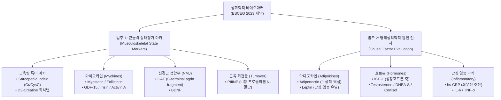
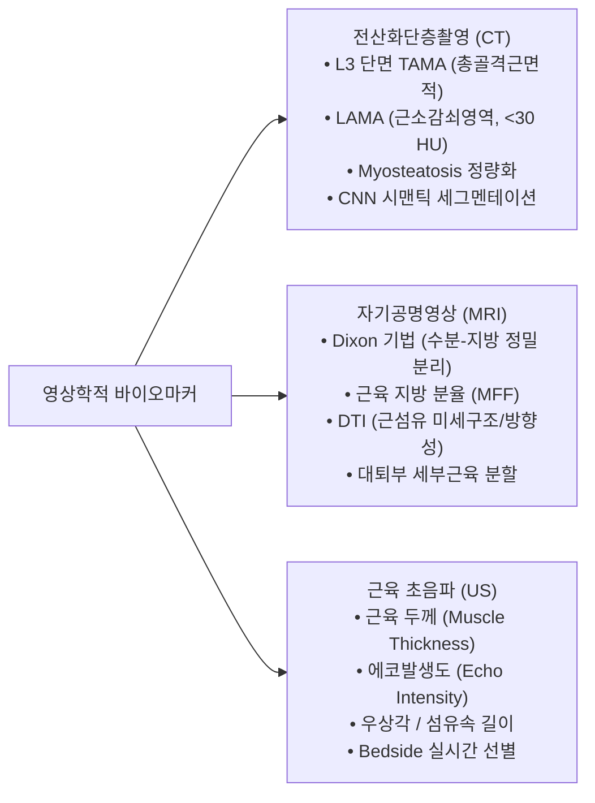
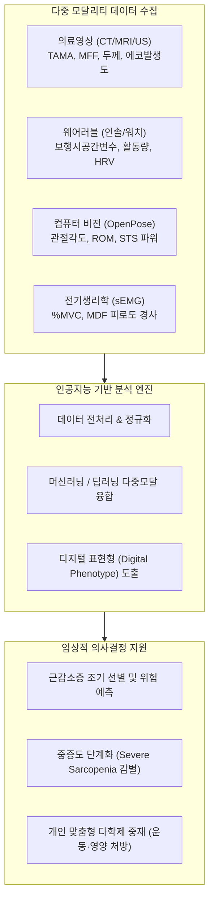

# 📑 [근감소증] 생화학적 바이오마커 & 디지털 바이오마커 (Biomarkers in Sarcopenia)

> **핵심 요약 (Key Summary)**
> - [[근감소증]](Sarcopenia)의 정밀 진단, 질환 진행 모니터링 및 치료제 개발을 위해 혈액·소변 기반의 **[[생화학적 바이오마커]](Biochemical Biomarkers)** 와 최첨단 센서·영상 기반의 **[[디지털 바이오마커]](Digital Biomarkers)** 의 체계적 확립이 시급하다.
> - **생화학적 바이오마커 (Ch14)**: 2023년 ESCEO 권고안에 따라 **근골격 상태평가 마커(범주 1)**(혈청 Cr/CysC 비율인 Sarcopenia Index, $D_3$-크레아틴 희석법, [[Myostatin]]·[[Irisin]] 등 마이오카인, 신경근 접합부 손상 마커 CAF·[[BDNF]], 근육 회전율 마커 PIIINP)와 **병태생리학적 원인 인자(범주 2)**([[Adiponectin]]의 역설, [[Leptin]], [[IGF-1]], 성호르몬, 만성 염증 마커 [[hs-CRP]]·[[IL-6]]·[[TNF-alpha|TNF-α]])로 분류된다.
> - **디지털 바이오마커 (Ch15)**: 고해상도 영상기법([[CT]] L3 TAMA 및 저밀도 근육 LAMA, [[MRI]] Dixon 지방분율, [[근육초음파]] 두께 및 에코발생도)을 통한 근육의 양·질([[Myosteatosis]]) 정량화, [[스마트 인솔]]·[[스마트워치]]를 통한 일상 보행역학 및 활동량 추적, 비전 기반 [[OpenPose]](자세 추정) 및 [[표면근전도]](sEMG, %MVC, 피로도 경사)를 융합하여 실시간·연속적 디지털 표현형(Digital Phenotype)을 포착한다.
> - 궁극적으로 다중 모달리티(Multi-modality) 데이터를 통합한 [[인공지능]](AI) 기반 **복합 스코어링 시스템**을 통해 [[근감소증]] 초조기 선별, 예후 예측 및 개인 맞춤형 운동·영양 중재가 완성된다.

---

## 📌 목차
- [Chapter 14 생화학적 바이오마커 (Blood-based Biomarkers)](#chapter-14-생화학적-바이오마커-blood-based-biomarkers)
  - [1. 생화학적 근감소증 바이오마커의 필요성](#1-생화학적-근감소증-바이오마커의-필요성)
  - [2. 생화학적 근감소증 바이오마커의 분류 (ESCEO 워킹그룹 기준)](#2-생화학적-근감소증-바이오마커의-분류-esceo-워킹그룹-기준)
    - [1) 범주 1: 근골격 상태평가 바이오마커 (Musculoskeletal Biochemical Markers)](#1-범주-1-근골격-상태평가-바이오마커-musculoskeletal-biochemical-markers)
    - [2) 범주 2: 병태생리학적 원인 인자 (Causal Factor Evaluation)](#2-범주-2-병태생리학적-원인-인자-causal-factor-evaluation)
  - [3. 생화학적 근감소증 바이오마커 측정 시 고려사항](#3-생화학적-근감소증-바이오마커-측정-시-고려사항)
  - [4. 기존 생화학적 바이오마커의 한계 및 향후 연구 방향](#4-기존-생화학적-바이오마커의-한계-및-향후-연구-방향)
- [Chapter 15 디지털 바이오마커 (Digital Biomarkers)](#chapter-15-디지털-바이오마커-digital-biomarkers)
  - [1. 서론 (Introduction)](#1-서론-introduction)
  - [2. 디지털 바이오마커의 정의와 임상적 중요성](#2-디지털-바이오마커의-정의와-임상적-중요성)
  - [3. 영상학적 근감소증 바이오마커 (Imaging Biomarkers)](#3-영상학적-근감소증-바이오마커-imaging-biomarkers)
    - [1) 전산화단층촬영 (CT) 기반 평가](#1-전산화단층촬영-ct-기반-평가)
    - [2) 자기공명영상 (MRI) 기반 평가](#2-자기공명영상-mri-기반-평가)
    - [3) 근육 초음파 (Ultrasonography) 기반 평가](#3-근육-초음파-ultrasonography-기반-평가)
    - [4) 영상 진단기법 비교 및 결론](#4-영상-진단기법-비교-및-결론)
  - [4. 웨어러블 디바이스를 활용한 디지털 바이오마커](#4-웨어러블-디바이스를-활용한-디지털-바이오마커)
    - [1) 스마트 인솔 (Smart Insole) 보행·균형 분석](#1-스마트-인솔-smart-insole-보행균형-분석)
    - [2) 스마트워치 및 피트니스 트래커 신체활동 모니터링](#2-스마트워치-및-피트니스-트래커-신체활동-모니터링)
  - [5. 동작분석 및 컴퓨터 비전을 이용한 바이오마커](#5-동작분석-및-컴퓨터-비전을-이용한-바이오마커)
    - [1) 자세 추정 (Pose Estimation, OpenPose) 기반 기능 평가](#1-자세-추정-pose-estimation-openpose-기반-기능-평가)
    - [2) 비대면 동작 분석 플랫폼 및 장단점](#2-비대면-동작-분석-플랫폼-및-장단점)
  - [6. 표면 근전도 (sEMG)를 활용한 디지털 바이오마커](#6-표면-근전도-semg를-활용한-디지털-바이오마커)
    - [1) sEMG의 개요 및 AI 웨어러블 센서](#1-semg의-개요-및-ai-웨어러블-센서)
    - [2) 주요 sEMG 지표와 근감소증 임상 지표의 상관관계](#2-주요-semg-지표와-근감소증-임상-지표의-상관관계)
    - [3) sEMG의 임상적 강점, 제한점 및 과제](#3-semg의-임상적-강점-제한점-및-과제)
  - [7. 근감소증 평가를 위한 복합 스코어링 시스템 (Composite Scoring Systems)](#7-근감소증-평가를-위한-복합-스코어링-시스템-composite-scoring-systems)
    - [1) 복합 스코어링 시스템의 필요성 및 구성 요소](#1-복합-스코어링-시스템의-필요성-및-구성-요소)
    - [2) 임상 적용 사례 (가이드라인, AI, My-AHA 플랫폼)](#2-임상-적용-사례-가이드라인-ai-my-aha-플랫폼)
    - [3) 장단점 및 미래 발전 방향](#3-장단점-및-미래-발전-방향)
  - [8. 결론 (Conclusion)](#8-결론-conclusion)
- [출처 및 참고 문헌 (References)](#출처-및-참고-문헌-references)

---

# Chapter 14 생화학적 바이오마커 (Blood-based Biomarkers)
**저자: 김범준 (울산의대)**

## 1. 생화학적 근감소증 바이오마커의 필요성
- **바이오마커(Biomarker)의 정의**: 정상적인 생물학적 과정, 병리학적 과정 또는 치료 중재에 대한 약리학적 반응의 지표로서 객관적으로 측정되고 평가되는 특성.
- **임상적 배경**:
  - [[근감소증]]은 내분비계 호르몬 결핍, 성장인자 감소, [[신경근 접합부]](Neuromuscular Junction, NMJ) 손상, 근단백질 동화 저항성(anabolic resistance) 및 과도한 이화작용, 신체 비활동, 만성 염증성 질환 등 다인자적 원인과 복잡한 분자 기전에 의해 발생함.
  - [[근감소증]] 환자 특이적 생화학적 인자를 확보하면 **조기 선별 진단, 질환 진행 경과 추적, 약물 반응성 평가 및 부작용 모니터링**에 결정적인 임상 정보를 제공할 수 있음.
- **미충족 의료 수요(Unmet Medical Needs)**:
  - 현재까지 수많은 후보 물질이 제시되었으나 코호트마다 상반된 결과가 보고되어, 실제 임상에서 확립되어 공인된 단일 혈액 바이오마커는 전무한 상태임.
  - 2023년 **ESCEO**(European Society for Clinical and Economic Aspects of Osteoporosis, Osteoarthritis and Musculoskeletal Diseases) 워킹그룹은 [[근감소증]] 치료제 개발 임상시험을 지원하기 위해 권장 생화학적 바이오마커 체계를 제안함.

---

## 2. 생화학적 근감소증 바이오마커의 분류 (ESCEO 워킹그룹 기준)

### 1) 범주 1: 근골격 상태평가 바이오마커 (Musculoskeletal Biochemical Markers)
[[근감소증]] 환자의 골격근 자체 상태를 정량화하는 것을 목표로 하며, 근육 조직에 고도로 특이적이고 근육량 또는 근력과 밀접히 연관되며 중재 치료에 민감하게 반응해야 함.

#### (1) 근육량 특이적 생화학적 마커
- **$D_3$-크레아틴 희석 검사 (Deuterium-labelled Creatine Dilution Method, $D_3	ext{-Cr}$)**:
  - **측정 원리**: 공복 상태에서 중수소-표지 크레아틴($D_3	ext{-Cr}$) 일정량을 경구 복용한 후, 전신 골격근 내 크레아틴 풀(pool)로 흡수되어 매일 일정 비율(약 1~2%)이 비효소적으로 크레아티닌으로 전환되어 소변으로 배출되는 생리적 기전을 이용함. 복용 4일 후 소변에서 $D_3	ext{-Cr}$과 비표지 크레아틴 및 크레아티닌 비율을 LC-MS/MS(액체 크로마토그래피-이중 질량분석기)로 정밀 측정하여 전신 기능적 골격근량을 산출함.
  - **임상적 강점**: DXA(이중에너지 X선 흡수계측법)보다 실제 근육량을 더 정확히 반영하며, 노인의 보행 속도 등 기능적 저하 및 고관절 골절 발생 위험을 예측하는 강력한 독립적 바이오마커로 입증됨.
  - **제한점**: 대규모 연구가 남성 코호트 위주로 수행되었으며, 고가의 LC-MS/MS 장비와 엄격한 소변 수집 표준화 매뉴얼이 요구되어 현시점에서 일반 임상 적용에는 한계가 있음.

#### (2) 마이오카인 (Myokines)
골격근에서 분비되는 5~20 kDa 크기의 생체활성 펩타이드로 자가분비(autocrine), 측분비(paracrine), 내분비(endocrine) 신호전달을 매개함.
- **[[Myostatin]](GDF-8)**:
  - TGF-$eta$ 슈퍼패밀리에 속하는 대표적인 근육 성장 억제 인자.
  - **작용 기전**: Activin type IIA/IIB 수용체 및 TGF-$eta$ 수용체에 결합하여 [[mTOR]] 신호전달 경로를 차단함으로써 단백질 합성을 억제하고 유비퀴틴-프로테아좀 경로를 통해 단백질 분해를 촉진함.
  - **임상 연구 현황**: 혈액투석 환자에서 1년 사망률을 예측하는 지표로 보고되었으나, 일반 노인 코호트에서는 근육량 및 근기능과의 연관성이 연구마다 상반됨. 기존 상용 ELISA 키트가 GDF-11 등 유사 패밀리 단백질과 교차반응성(cross-reactivity)을 나타내는 분석적 한계가 있어, 향후 고특이도 질량분석법 기반 연구가 요구됨.
- **Follistatin**:
  - Myostatin 및 Activin A의 활성을 억제하는 내인성 길항제(antagonist)로 근형성 전사인자를 촉진함. 저항성 근력 운동 후 혈중 Follistatin 농도 및 Follistatin/Myostatin 비율이 유의하게 증가함.
- **GDF-15 (Growth Differentiation Factor 15)**:
  - 세포 스트레스, 심근경색, 미토콘드리아 손상 시 분비가 급증하는 인자. [[근감소증]] 환자에서 발현이 증가하고 근력 및 신체기능 저하와 상관성을 보이나, 연령·신장 기능에 크게 영향을 받고 일중 변동(diurnal variation)이 커 단독 마커 활용에는 제약이 있음.
- **[[Irisin]]**:
  - 운동 자극 시 골격근 FNDC5 전구체가 절단되어 혈중으로 분비되는 마이오카인. 백색지방을 갈색지방으로 변환(browning)하여 에너지 소비를 촉진하고, 근단백질 합성을 촉진하여 근비대를 유도함. [[근감소증]] 노인에서 혈중 농도가 현저히 감소하며 근육량 및 근력과 정적 상관관계를 보임.
- **Activin A**:
  - Activin IIA 수용체에 결합하여 Myostatin과 동일한 신호경로로 근위축을 촉진하는 부정적 조절 인자.

#### (3) 신경근 접합부 (Neuromuscular Junction, NMJ) 마커
[[EWGSOP]]2 가이드라인은 [[근감소증]] 단순한 근육 소실이 아닌 중추 및 말초 신경계, 특히 신경근 접합부 손상을 수반하는 복합 질환으로 정의함.
- **CAF (C-terminal Agrin Fragment)**:
  - 운동신경 말단에서 분비되어 [[아세틸콜린]] 수용체(AChR)의 집적을 유도하는 거대 프로테오글리칸인 아그린(Agrin)이 신경트로핀 수용체 분해효소(Neurotrypsin)에 의해 절단될 때 생성되는 22 kDa 단편.
  - NMJ의 불안정성 및 탈신경(denervation) 재형성 과정을 반영함. [[근감소증]] 노인에서 혈중 CAF 농도가 유의하게 증가하며, 신체활동이 활발한 고령자에서는 낮게 유지됨. 상용화된 표준 측정 키트 개발이 시급함.
- **[[BDNF]](Brain-derived Neurotrophic Factor)**:
  - 운동신경세포에서 발현되어 측분비 효과를 통해 운동신경 재생 및 신경근 접합부 항상성을 유지하는 신경영양인자. 혈액투석, [[만성 폐쇄성 폐질환]](COPD), [[파킨슨병]] 환자의 근감소증 진단에서 유의하게 감소된 혈중 농도가 확인됨.

#### (4) 근육 회전율 (Muscle Turnover) 마커
- **PIIINP (N-terminal Propeptide of Type III Procollagen)**:
  - III형 [[콜라겐]] 합성의 부산물로 골격근 및 평활근의 내막(endomysium) 조직 신장 특성과 리모델링을 대변함. [[테스토스테론]] 등 동화 호르몬 치료에 대한 근합성 반응 및 신체 수행능력과 밀접히 연관됨. ELISA, RIA, ECLIA 등 다양한 자동화 분석법이 확립되어 있음.
- **[[근감소증]] 지수 (Sarcopenia Index, SI: 혈청 Cr/Cystatin C 비율)**:
  - 혈청 크레아티닌(근육량 및 단백질 회전에 비례하나 신장 배설능에 좌우됨)을 신기능 전용 마커인 시스타틴 C로 나눈 비율 ($	ext{SI} = rac{	ext{Serum Creatinine}}{	ext{Serum Cystatin C}} 	imes 100$).
  - 신기능 저하의 교란효과를 보정하여 순수 근육량을 반영하며, CT 측정 근육 단면적, 종아리 둘레, 악력과 유의한 상관성을 보이고 고령 중환자의 입원 기간 및 사망률 예측에 유용함.

---

### 2) 범주 2: 병태생리학적 원인 인자 (Causal Factor Evaluation)

#### (1) 아디포카인 (Adipokines)
지방조직에서 분비되어 근육의 [[인슐린]] 저항성, 포도당 흡수, [[지방산]] 산화 및 전신 염증을 조절함.
- **[[Adiponectin]]([[아디포넥틴]] 역설, Adiponectin Paradox)**:
  - 동물실험에서는 T-cadherin에 결합하여 근육 재생 및 [[인슐린]] 감수성을 촉진하는 유익한 인자이나, 대규모 인간 코호트 메타분석에서는 **체지방량과 관계없이 [[근감소증]] 환자에서 혈중 농도가 역설적으로 유의하게 증가**함. 이는 전신 만성 저등급 염증 및 산화 스트레스에 대한 생체의 보상적 기전(compensatory response)으로 설명됨.
- **[[Leptin]]**:
  - 지방세포에서 분비되어 염증성 [[사이토카인]] 분비를 자극하고 근육 내 단백질 합성을 억제하여 근위축을 유발함. [[근감소증]] 환자에서 혈중 농도가 유의하게 높으며 근육량과 음의 상관관계를 나타냄. 꾸준한 유산소·저항성 운동 및 영양 중재 시 유의하게 감소함.

#### (2) 호르몬 (Hormones)
- **[[IGF-1]](Insulin-like Growth Factor-1)**: [[성장호르몬]](GH)의 표적 매개체로 근단백질 동화작용(anabolism) 촉진 및 위성세포 증식 유도. 노화에 따른 분비 저하는 근육량 감소, 악력 저하, 보행속도 둔화와 직결됨.
- **[[스테로이드]] 호르몬**:
  - **[[DHEA]]-S 및 [[Testosterone]]**: 강력한 단백질 동화 호르몬으로 연령 증가에 따른 감소는 노인성 [[근감소증]] 및 남성 저성선증(hypogonadism) 형태의 근육 소실을 유발함.
  - **Cortisol**: 대표적인 이화작용(catabolism) 호르몬으로 만성 스트레스, 노쇠(Frailty) 및 악액질([[Cachexia]])에서 과다 분비되어 근단백질 분해를 가속화함.

#### (3) 만성 염증성 마커 (Inflammatory Markers)
- 168개 임상 논문을 메타분석한 결과, [[근감소증]] 근육량 및 근력 저하와 가장 일관되고 강력한 상관성을 나타낸 3대 [[사이토카인]] **[[hs-CRP]](고감도 C-반응성 단백), [[IL-6]], [[TNF-alpha|TNF-α]]** 임.
- 이들 염증 인자의 체내 상승은 근단백질 합성 억제 및 분해 촉진, 위성세포 기능 부전을 초래함. 특히 자동화 분석법이 완전히 확립된 **hs-CRP**가 임상적 최우선 스크리닝 마커로 권장됨.

---

## 3. 생화학적 근감소증 바이오마커 측정 시 고려사항
1. **표준화된 검체 채취 프로토콜 확립**: 채취 튜브 재질, 채취 시각(호르몬의 일중 변동성 반영), 응고 시간 및 원심분리 회전수/시간 명시.
2. **환자 전처치 표준화**: 검체 채취 전 **최소 8~12시간 금식** 및 **24시간 전 격렬한 운동 배제** (운동 유발성 급성 근손상 및 효소 수치 일시 상승 배제).
3. **검체 보관 엄격화**: 단백질 변성 및 펩타이드 분해를 방지하기 위해 반복적인 **동결-해동(freeze-thaw) 사이클 금지**.
4. **분석법 타당성 검증**: 공인된 중앙검사실 측정, 분석 간/내 변동계수(CV, Coefficient of Variation) 관리, 정량하한(LLOQ) 및 연령·성별 정상 참고치 설정.
5. **통계적 교란인자 보정**: 신체활동 수준, BMI, 체지방률, 기저 신기능(eGFR) 등을 통계 모형에 필수적으로 보정해야 함.

---

## 4. 기존 생화학적 바이오마커의 한계 및 향후 연구 방향
1. **질환 정의의 비표준화**: EWGSOP, AWGS, FNIH 등 학회별 진단 기준의 차이로 인해 코호트 간 연구 결과의 일관성 결여 $
ightarrow$ 국제적 진단 표준화 시급.
2. **병태생리 기전의 복합성**: [[근감소증]] 단일 원인 질환이 아니므로 단일 표적 물질 탐색에는 한계가 존재함 $
ightarrow$ **오믹스(Omics, 프로테오믹스·메사볼로믹스) 기반 비표적(untargeted) 발굴 기법** 도입 필요.
3. **다중 마커 복합 패널 구축**: 단일 마커의 진단적 한계를 극복하기 위해 다수의 마커를 조합한 **알고리즘 기반 스코어링 시스템** 개발.
4. **종적(Longitudinal) 코호트 연구 필수**: 기존의 단면적(cross-sectional) 연관성 분석을 탈피하여 질환 발생 및 예후 예측력을 검증하는 전향적 장기 추적 연구 수행.
5. **인체 중심 스크리닝 체계**: 동물 및 세포 모델 기반 타깃 발굴의 임상 적용 실패율을 줄이기 위해, 연구 초기부터 **인간 스크리닝 코호트**를 기반으로 후보 물질을 도출해야 함.

---
---

# Chapter 15 디지털 바이오마커 (Digital Biomarkers)
**저자: 유준일 (인하의대)**

## 1. 서론 (Introduction)
- **공중보건학적 위기**: 유럽 [[EWGSOP]] 역학 조사에 따르면 65세 이상 노인 인구의 약 10%가 [[근감소증]] 겪고 있으며, 이는 낙상, 병적 골절, 일상생활수행능력(ADL) 장애, 삶의 질 저하, 심혈관계 이환율 및 사망률 증가와 유의하게 직결됨.
- **새로운 평가 패러다임**: 기존의 간헐적이고 정적인 병원 중심 검사(DXA, 단순 악력)의 한계를 극복하기 위해, 첨단 의료영상([[CT]], [[MRI]], [[근육초음파]])과 웨어러블 바이오센서, 인공지능 동작분석을 융합한 **[[디지털 바이오마커]](Digital Biomarkers)** 의 도입이 가속화되고 있음.

---

## 2. 디지털 바이오마커의 정의와 임상적 중요성

### 1) 디지털 바이오마커의 정의 및 특성
- **정의**: 디지털 헬스 기술(Digital Health Technology, DHT)을 매개로 획득된 생체정보 데이터를 기반으로 생리적 항상성, 병태생리학적 변화, 또는 치료 중재에 대한 생체반응을 객관적으로 정량화하는 지표.
- **미국 FDA 공식 정의**: '디지털 헬스 기술 플랫폼으로부터 수집된, 생리적 항상성, 병태생리학적 과정, 또는 치료적 중재에 대한 생체반응을 객관적으로 측정 가능한 특성 또는 특성들의 집합체'.
- **핵심 속성**:
  1. 다양한 플랫폼(웨어러블 기기, 스마트폰 내장 센서, 고해상도 영상, 비전 카메라)을 통한 연속적 데이터 획득.
  2. 개인별 기저치(baseline) 대비 종단적 질병 경과 및 치료 반응의 정밀 추적.
  3. 일상생활 환경(real-world setting)에서의 실시간 동적 생체정보 정량화.

> ![[Sarcopenia_Ch15_p231_Fig1.png|540]]
> **그림 15-1. 인체 기반의 디지털 바이오마커 분포 예시.** 뇌신경계(EEG, 인지기능), 심혈관계(ECG, PPG, 혈압), 근골격계(EMG, 관성센서 가속도, 동작분석, 관절가동범위), 신진대사 및 일상 활동량(보행수, 수면패턴, 체온) 등 인체 전신에서 획득되는 다차원 디지털 생체신호의 공간적 분포 도식.

> ![[Sarcopenia_Ch15_p233_Fig1.png|540]]
> **그림 15-2. 디지털 바이오마커 분류 체계.** 생리적/생체신호(Physiological: 심박수, 호흡수, 체온), 운동학적/생체역학적(Kinematic/Biomechanical: 보행속도, 보폭, 관절각도, 균형), 활동 및 행동학적(Behavioral: 일일 활동량, 좌식시간, 수면 구조), 인지/신경학적(Cognitive) 범주로 분류되는 종합 프레임워크.

> ![[Sarcopenia_Ch15_p234_Fig1.png|540]]
> **그림 15-3. 디지털바이오마커 시장 규모.** 글로벌 디지털 헬스케어 및 디지털 바이오마커 시장의 연평균 성장률(CAGR)과 연도별 가파른 시장 확대 추이를 나타낸 통계 도식.

### 2) 디지털 바이오마커의 임상적 중요성
1. **질병의 조기 진단 및 예방의학적 접근**: 임상 증상이 발현되기 이전인 전임상(preclinical) 단계에서 보행 미세 비대칭, 미세 체간 동요 등 잠재적 기능 저하를 감지하여 조기 중재를 가능케 함.
2. **환자 맞춤형 정밀 의료**: 일회성 병원 방문 수치가 아닌 24시간 생활밀착형 데이터를 기반으로 개인별 최적화된 운동 처방 및 영양 관리를 설계함.
3. **임상시험 및 신약 개발의 혁신**: 치료 중재에 따른 기능적 호전을 실생활 조건에서 연속적으로 민감하게 포착하여 유효성 평가변수(endpoint)의 신뢰도를 획기적으로 개선함.
4. **의료비용 절감 및 효율성 증대**: 원격 모니터링을 통해 급성 악화 및 낙상 사고를 사전에 예방함으로써 입원율과 사회적 의료비 부담을 경감함.

---

## 3. 영상학적 근감소증 바이오마커 (Imaging Biomarkers)

### 1) 전산화단층촬영 (CT) 기반 평가
- **원리 및 주요 정량 지표**:
  - **TAMA (Total Abdominal Muscle Area, 총복부근육단면적)**: 제3요추(L3) 척추경(pedicle) 레벨 축방향 단면에서 복벽근([[복직근]], 내·[[외복사근]], [[복횡근]]), [[척추기립근]], [[대요근]](psoas major), [[요방형근]] 총 면적($	ext{cm}^2$)을 분할 정량화하고 신장의 제곱으로 보정($	ext{SMI} = 	ext{TAMA}/	ext{height}^2, 	ext{cm}^2/	ext{m}^2$).
  - **CT 감쇠계수(Hounsfield Unit, HU) 기준**:
    - **정상 골격근**: **$30 \sim 100	ext{ HU}$** (고밀도 근육, NAMA: Normal-attenuation muscle area).
    - **근소감쇠영역 (LAMA, Low-attenuation muscle area)**: **$< 30	ext{ HU}$** (지방 침윤으로 감쇠도가 떨어진 저밀도 근육).
  - **근육 내 지방 침윤 ([[Myosteatosis]])**: 근섬유 사이(intermuscular) 및 근섬유 내(intramuscular) 지질 침착을 반영하는 핵심 지표로, 암 환자, 수술 환자 및 노인에서 사망률과 합병증 발생의 강력한 독립적 예측 인자임.
- **딥러닝 기반 세부 분할**: U-Net 등 합성곱 신경망(CNN) 기반 알고리즘을 적용하여 복부 및 척추주위 개별 근육을 수초 내에 자동 분할하고 각 근육별 면적과 저밀도 근육 비율을 자동 산출함.

> ![[Sarcopenia_Ch15_p235_Fig1.png|540]]
> **그림 15-4. CT 단면에서 TAMA 분석 예시.** L3 요추 단면에서 조영 전후 골격근 영역(TAMA, 붉은색/음영 영역)을 분할하고 각 복부 근육군(요근, [[척추기립근]], 복벽근)의 단면적 및 Hounsfield Unit(HU) 감쇠도를 측정하는 영상 분석 도식.

> ![[Sarcopenia_Ch15_p237_Fig1.png|540]]
> **그림 15-5. CT 영상 내 해부학적 개별 근육 분할(Semantic Segmentation).** 딥러닝(U-Net 등 합성곱 신경망)을 활용하여 복부 및 척추주위 개별 근육군([[대요근]], [[요방형근]], [[다열근]], 척추기립근 등)을 자동으로 정밀 분할하고 각 근육별 면적과 미세 지방 침윤도를 분리 정량화하는 알고리즘 파이프라인.

### 2) 자기공명영상 (MRI) 기반 평가
- **원리 및 특성**: 방사선 피폭이 전혀 없으며 최상의 연부조직 대조도를 제공하여 근육의 용적뿐만 아니라 미세구조적·생화학적 조성을 분석하는 최상위 표준(Gold Standard).
- **주요 정량 지표**:
  - **근육 지방 분율 (Muscle Fat Fraction, MFF)**: 화학적 이동(chemical shift)에 기초한 **Dixon 기법**(2-point, 3-point, 6-point)을 적용하여 물(water)과 지방(fat)의 공명 주파수 차이를 수학적으로 분리함으로써 픽셀 단위로 정확한 지방 침윤 비율을 정량화 ($	ext{MFF} = rac{	ext{Fat}}{	ext{Water} + 	ext{Fat}} 	imes 100\%$).
  - **근육 단면적 (Cross-Sectional Area, CSA)**: 축방향 T1 강조 영상에서 [[대퇴사두근]], 햄스트링 등 주요 근육군의 부피 위축을 정밀 측정.
  - **확산텐서영상 (Diffusion Tensor Imaging, DTI)**: 근섬유 내부 물 분자의 방향성 확산을 측정하여 **분획 이방성(Fractional Anisotropy, FA)** 및 겉보기 확산계수(ADC)를 산출함으로써 근섬유의 정렬 상태, 막 투과성 및 미세구조적 손상을 정량화함.

> ![[Sarcopenia_Ch15_p238_Fig1.png|540]]
> **그림 15-6. MRI Dixon 기법에 의한 지방 및 수분 영상 분리.** 2점 또는 3점 Dixon 기법을 적용하여 획득된 동위상(In-phase), 역위상(Out-of-phase), 수분 영상(Water-only), 지방 영상(Fat-only)의 분리 원리와 근육 내 지방 분율(MFF) 맵(map) 생성 과정.

> ![[Sarcopenia_Ch15_p239_Fig1.png|540]]
> **그림 15-7. MRI를 활용한 대퇴부 세부 근육 분할 알고리즘.** 대퇴부 단면 MRI에서 합성곱 신경망(CNN)을 통해 [[대퇴직근]](Rectus femoris), [[외측광근]](Vastus lateralis), [[중간광근]](Vastus intermedius), [[내측광근]](Vastus medialis), [[반건양근]](Semitendinosus), [[대퇴이두근]](Biceps femoris), [[대내전근]](Adductor magnus) 등을 개별 마스크로 정밀 자동 분할한 결과.

### 3) 근육 초음파 (Ultrasonography) 기반 평가
- **특징**: 전리방사선이 없고 침상 옆(bedside) 현장 검사가 가능하며 비용 효율성이 매우 뛰어나 일차 의료기관에서의 선별검사에 최적화됨.
- **주요 정량 지표**:
  - **근육 두께 (Muscle Thickness, MT)**: [[대퇴직근]](RF), [[외측광근]](VL), [[전경골근]](TA)에서 피부-피하지방 경계부터 심부 골막까지의 수직 거리를 측정 ($	ext{mm}$). DXA로 측정한 SMI와 높은 상관관계($r = 0.7 \sim 0.8$)를 보임.
  - **에코발생도 (Echo Intensity, EI)**: 초음파 영상 내 근육 영역의 그레이스케일 평균 밝기값($0 \sim 255	ext{ a.u.}$). 근육 내 지방 침윤 및 섬유조직이 증가할수록 초음파 빔 산란으로 인해 근육이 밝고 하얗게 변하는 고에코(hyper-echogenicity) 양상을 나타냄 $
ightarrow$ 근육의 질적 퇴행 반영.
  - **근육 구조(Muscle Architecture)**: 우상근(Pennate muscle)의 **우상각(Pennation angle)** 및 **근섬유속 길이(Fascicle length)** 측정 $
ightarrow$ 노화에 따라 각도 감소 및 길이 단축 확인.

> ![[Sarcopenia_Ch15_p240_Fig1.png|540]]
> **그림 15-8. 초음파를 이용한 근육 두께 및 에코발생도 평가.** 젊은 여성(22세, 좌측)과 고령 여성(85세, 우측)의 [[대퇴사두근]] 초음파 단면 비교. 고령 환자에서 근육 단면적(CSA: $124.1	ext{ cm}^2$ 대비 현저한 감소) 축소, 에코발생도 증가(하얗게 변함, Myosteatosis 반영), 피하지방 두께 및 저밀도 근육 면적(%LDMA)의 변화 양상 비교.

### 4) 영상 진단기법 비교 및 결론
| 항목 | 전산화단층촬영 (CT) | 자기공명영상 (MRI) | 초음파 (US) |
| :--- | :--- | :--- | :--- |
| **방사선 노출** | 있음 (전리방사선) | **전혀 없음** | **전혀 없음** |
| **해부학적 해상도** | 매우 높음 (근육 단면적 정밀) | **최고 (생화학·미세구조 정밀)** | 중간 (표층 근육 위주) |
| **근육 질 평가** | HU 감쇠도 (<30 HU 저밀도근) | **Dixon MFF (정량적 지방분율)** | 에코발생도 (히스토그램 밝기) |
| **접근성 및 비용** | 병원 전산망 후향적 활용 용이 / 고비용 | 긴 검사 시간, 최고 비용 | **최고 (휴대용, Bedside, 저비용)** |
| **주요 제한점** | 선별 목적 단독 촬영 제한 | 금속 임플란트 환자 불가, 폐쇄공포 | 검사자 숙련도 의존, 심부 투과 한계 |

---

## 4. 웨어러블 디바이스를 활용한 디지털 바이오마커

### 1) 스마트 인솔 (Smart Insole) 보행·균형 분석
- **원리**: 신발 안창에 다점 압력 감지 센서와 초소형 관성측정장치(IMU: 3축 가속도계 + 3축 자이로스코프)를 장착하여 일상생활 보행 데이터를 비침습적으로 장시간 수집.
- **주요 추출 지표**:
  - **족저압 분포(Plantar pressure distribution)** 및 **압력중심점(Center of Pressure, CoP) 궤적**: 입각기 동안 CoP 전후·좌우 동요 및 면적 정량화.
  - **시공간 보행 매개변수**: 보행 속도, 분당 걸음 수(Cadence), 보폭(Stride length), **입각기/유각기 비율(Stance/Swing ratio)**, **양하지 지지 시간(Double support time)**, **보행 비대칭성(Gait asymmetry)**.
- **임상적 유용성**:
  - [[근감소증]] 환자에서 입각기 비대칭성 및 지지 시간의 비정상적 증가 확인.
  - Kim 등(2023)은 스마트 인솔 데이터를 종합하여 노인 **허약 지수(Frailty Index)** 및 낙상 위험도를 유의하게 예측함을 입증함.

> ![[Sarcopenia_Ch15_p243_Fig1.png|540]]
> **그림 15-9. 스마트 인솔 센서 위치 및 pressure flow 예시.** 스마트 인솔 밑창에 배열된 다점 압력 감지 센서의 해부학적 위치([[종골]], 중족골두, 족지 등)와 보행 입각기 진행(Initial contact $
ightarrow$ Midstance $
ightarrow$ Push-off)에 따른 족저압 이동 궤적(Pressure flow) 시각화.

### 2) 스마트워치 및 피트니스 트래커 신체활동 모니터링
- **기능적 특성**: 광용적맥파(PPG) 기반 심박수 및 심박 변이도(Heart Rate Variability, HRV), 3축 가속도계 기반 보행 수, 이동 거리, 활동 강도 분류, 수면 구조(Sleep architecture) 분석.
- **[[근감소증]] 환자의 활동 패턴**:
  - 정상 노화 대조군 대비 **일일 총 보행 수 및 중고강도 신체활동(MVPA, Moderate-to-Vigorous Physical Activity) 시간의 현저한 감소**.
  - **좌식 행동(Sedentary behavior) 지속시간의 급격한 증가**.
- **임상적 적용**: 환자의 일상 활동 패턴을 객관적으로 가시화하여 맞춤형 운동 처방 및 실시간 피드백을 제공함으로써 행동 수정 중재(Behavioral modification)와 [[자기효능감]] 극대화함.

> ![[Sarcopenia_Ch15_p244_Fig1.png|540]]
> **그림 15-10. 스마트워치로 획득되는 신체활동 데이터 시각화 예시.** 스마트워치 대시보드 화면을 통해 일일 걸음 수, 활동 시간대별 소모 칼로리, 심박수 변이도(HRV), 좌식 시간 및 수면 단계 분석 데이터가 연속적으로 모니터링되는 시각화 UI.

---

## 5. 동작분석 및 컴퓨터 비전을 이용한 바이오마커

### 1) 자세 추정 (Pose Estimation, OpenPose) 기반 기능 평가
- **원리**: 특수 반사 마커나 고가 장비 없이 일반 2D RGB 카메라(스마트폰/태블릿)로 촬영된 동작 영상을 심층 합성곱 신경망 기반의 [[OpenPose]] 프레임워크에 입력하여 인체 주요 관절 랜드마크(18~25개 키포인트)를 실시간 자동 추출.
- **주요 임상 평가 항목**:
  1. **보행 분석**: 신체 질량 중심(Center of Mass, CoM) 이동, 보폭, 유각기/입각기 비율, 슬관절·고관절 가동범위(ROM) 추출.
  2. **정적 균형 및 자세 안정성**: 한발 서기, Semi-Tandem 자세 유지 시 체간 및 골반의 동요(sway) 패턴을 정량화하여 낙상 고위험군 선별 (Ota et al., 2021).
  3. **근기능 관련 기능 동작 분석**:
     - **5회 앉았다 일어서기 (5XSTS)** 및 **30초 의자 일어나기(30s-STS)**: 슬관절 및 고관절 각도의 시계열 변화, 일어서는 각속도(Angular velocity), 정점 파워(Peak power)를 산출하여 하지 근력 및 동적 파워를 평가.

> ![[Sarcopenia_Ch15_p248_Fig1.png|540]]
> **그림 15-11. OpenPose 골격모델 오버레이 예시.** 표준 2D 카메라 영상 위에 딥러닝 기반 OpenPose 골격 모델이 관절 키포인트와 연결선으로 정밀하게 오버레이되어 대상자의 기립 자세 및 동적 동작 패턴을 실시간 추적하는 모습.

> ![[Sarcopenia_Ch15_p249_Fig1.png|540]]
> **그림 15-12. 관절각도 시계열 변화 그래프 예시.** 1회의 보행 주기(Gait cycle, $0 \sim 100\%$) 동안 고관절(Hip), 슬관절(Knee), 족관절(Ankle)의 각도 변화를 연속적으로 나타낸 시계열 그래프. 관절 최대 신전각($K_{\max 1}, K_{\max 2}$) 및 굴곡각($H_{\min}$) 등의 정량적 운동학 지표 도출.

### 2) 비대면 동작 분석 플랫폼 및 장단점
- **비대면 플랫폼**: 환자가 가정에서 스마트폰 앱으로 신체 기능 검사(SPPB, 5XSTS)를 수행하는 영상을 촬영하여 전송하면 클라우드 AI 서버가 동작 역학을 분석하여 진단 리포트를 생성함.
- **장점**: 마커리스 저비용 체계, 고가의 실험실 환경 탈피, 지역사회 대규모 스크리닝 가능.
- **제한점**: 촬영 각도 및 조명에 따른 오차, 신체 부위 가림(occlusion), 2D 평면 투영 오차 $
ightarrow$ 3D 마커리스 모션 캡처 기술로의 고도화 필요.

---

## 6. 표면 근전도 (sEMG)를 활용한 디지털 바이오마커

### 1) sEMG의 개요 및 AI 웨어러블 센서
- **원리**: 골격근 수축 시 발생하는 근섬유 활동전위(Muscle Action Potential, MAP)를 피부 표면 전극을 통해 비침습적으로 기록하는 전기생리학적 기법.
- **특징**: 중추신경계의 운동단위 동원(Motor unit recruitment), 점화율(Firing rate), 신경근 피로를 직접 대변하는 유일한 기능적 생체신호.
- **최신 AI 웨어러블 센서**: 패치형 무선 초소형 sEMG 센서와 AI 분석 알고리즘을 결합하여, 번거로운 신호처리 절차 없이 **약 3분 이내에 신경근 활성도와 근기능을 자동 정량화**함.

> ![[Sarcopenia_Ch15_p252_Fig1.png|540]]
> **그림 15-13. 표면근전도측정 및 분석 예시.** 목표 근육군에 부착된 다채널 표면전극과 신호 증폭기, 실시간 로우(raw) 근전도 신호 파형 및 이를 정류·평활화(Rectification & Filtering)하여 근활성도를 분석하는 소프트웨어 인터페이스 도식.

### 2) 주요 sEMG 지표와 근감소증 임상 지표의 상관관계
1. **근육량 상관 지표**:
   - **PWCFT (Physical Working Capacity at Fatigue Threshold)**: 점증 부하 운동 시 근피로가 발생하는 역치점에서의 물리적 작업 능력. 총 골격근량 및 사지 골격근량지수(ASMI)와 유의미한 양의 상관관계를 나타냄.
2. **근력 상관 지표**:
   - **%MVC (Percentage of Maximum Voluntary Contraction)**: 최대수의수축 대비 근활성도 백분율. 등척성 및 등속성 최대 근력 수준과 가장 높은 상관성 보유.
   - **RMS (Root Mean Square)**: 근전도 신호의 제곱평균제곱근 진폭으로 운동단위 동원 크기를 대변.
   - **CMAP (Compound Muscle Action Potential)**: 신경 자극에 따른 복합근육활동전위 진폭 $
ightarrow$ 운동단위 활성화 능력을 객관적으로 평가.
3. **신체수행능력 및 근피로도 상관 지표**:
   - **주파수 분석**: **MDF (Median Frequency, 중앙주파수)** 및 **MNF (Mean Frequency, 평균주파수)**.
   - **피로도 하강 경사(Fatigue Slope)**: 지속적인 등척성 수축 동안 근섬유 내 수소이온/[[젖산]] 축적 및 활동전위 전도속도 지연으로 인해 주파수가 저주파 대역으로 하강함. **[[근감소증]] 노인은 정상인에 비해 주파수 하강 기울기(slope)가 현저히 급격하여 신경근 피로에 극히 취약**함을 객관적으로 증명함.
   - **NME (Neuromuscular Efficiency, 신경근 효율성)**: 단위 근력 발휘당 요구되는 sEMG 활성도($	ext{Force}/	ext{sEMG Amplitude}$). [[근감소증]] 환자에서 NME가 유의하게 저하됨.

> ![[Sarcopenia_Ch15_p255_Fig1.png|540]]
> **그림 15-14. 유발근전도 신호를 분석하는 AI 기술 적용된 웨어러블 표면근전도센서.** 무선 초소형 패치형 sEMG 센서 하드웨어와 기계학습/딥러닝 알고리즘을 결합하여, 유발근전도 신호로부터 신경근 기능 및 근활성도를 실시간 정량화·시각화하는 첨단 스마트 헬스케어 디바이스.

### 3) sEMG의 임상적 강점, 제한점 및 과제
- **강점**: 근육량이나 단순 최대 악력으로 확인할 수 없는 **신경학적 근활성화 결손 및 피로 취약성을 실시간 정량화**, 기능 기반 맞춤형 재활 운동 시 표적 근육([[대퇴직근]], [[내측광근]] 등)의 선택적 활성화 여부를 직접 모니터링.
- **제한점 및 표준화 과제**:
  - 피하지방층 두께에 따른 신호 감쇠 및 인접 근육 간 간섭(Cross-talk).
  - 환자별 피부 저항 차이 및 최대수의수축(MVC) 표준화의 어려움.
  - 전극 부착 위치에 따른 측정 오차를 방지하기 위해 **SENIAM(Surface ElectroMyoGraphy for the Non-Invasive Assessment of Muscles)** 국제 표준 프로토콜의 엄격한 준수 필요.

---

## 7. 근감소증 평가를 위한 복합 스코어링 시스템 (Composite Scoring Systems)

### 1) 복합 스코어링 시스템의 필요성 및 구성 요소
- **필요성**: [[근감소증]] 근육량 감소, 근력 약화, 신체기능 장애, 신경근 조절 이상, 만성 염증 등 다차원적 병태생리가 복합 작용하는 증후군임. 단일 바이오마커만으로는 환자의 임상적 이질성(heterogeneity)을 반영할 수 없으므로, 다차원 디지털 바이오마커를 결합한 종합 평가 체계가 필수적임.
- **4대 핵심 구성 요소**:
  1. **근육량 (Muscle Mass)**: CT TAMA, MRI CSA, 초음파 근육 두께, BIA ASMI, DXA.
  2. **근력 (Muscle Strength)**: 악력, 하지 등속성 토크, sEMG %MVC 및 CMAP.
  3. **신체기능 (Physical Performance)**: 스마트 인솔 보행 속도·비대칭성, OpenPose 5XSTS 각속도/파워, SPPB 점수.
  4. **신체활동 및 대사 (Activity & Metabolism)**: 스마트워치 일일 보행 수, MVPA 시간, 좌식 비율, 심박 변이도(HRV), 수면 구조.

### 2) 임상 적용 사례 (가이드라인, AI, My-AHA 플랫폼)
1. **임상 진료지침 기반 스코어링**:
   - [[AWGS]](2019) 및 [[EWGSOP]]2 기준에 따라 악력 저하(근력), 골격근량 감소(근육량), 보행속도 저하(4 m 보행 $< 0.8	ext{ m/s}$, 신체수행능력) 항목을 종합하여 [[근감소증]] 확진 및 중증 [[근감소증]](Severe sarcopenia) 감별.
2. **인공지능 기반 스코어링 시스템**:
   - **Kim 등(2023)**: 스마트 인솔과 자세추정 기술로 추출한 다차원 보행 변수와 관절 운동역학 변수를 기계학습 모델에 통합하여 근감소증 진단 정확도를 극대화함.
   - **Ang 등(2021)**: 인공지능 골격 추적 기술로 5가지 신체기능 검사를 자동 정량화하여 **노쇠-근감소증 증후군(Frailty-Sarcopenia Syndrome)** 평가 복합 지표 개발.
3. **My-AHA (My Active and Healthy Aging) 통합 플랫폼**:
   - 유럽연합(EU) 주도 다기관 연구 플랫폼.
   - 웨어러블 센서(신체활동, 수면), 스마트 인솔(보행 역학), 인지 기능 평가를 클라우드 플랫폼으로 통합하여 **My-AHA 종합 점수**를 산출하고 대규모 코호트 스크리닝 및 맞춤형 중재에 활용.

> ![[Sarcopenia_Ch15_p258_Fig1.png|540]]
> **그림 15-15. 근감소증 대상자의 유전자 발현 기반 디지털 표현형 분류 예시.** 근감소증 환자 집단에서 유전자 발현 데이터 및 기능적 디지털 바이오마커를 결합한 클러스터링(t-SNE/PCA)을 통해 중증도 및 하위 아형(Subtypes)별 디지털 표현형(Digital Phenotypes)을 다차원 공간상에 분류한 시각화 그래프.

> ![[Sarcopenia_Ch15_p258_Fig2.png|540]]
> **그림 15-16. 디지털 바이오마커 기반 근감소증 위험 예측 통합 분석 모델.** 신체활동량(스마트워치 Steps, Sleep, Heart rate), 근전도(Surface EMG), 악력(Strength), 인구학적 특성(Age, Sex) 등 다중 모달리티 데이터를 인공지능 기반 예측 모델(AI-based Prediction Model)로 통합하여 개인별 근감소증 발병 위험도를 산출하는 종합 분석 파이프라인.

### 3) 장단점 및 미래 발전 방향
- **장점**:
  - 다차원적 병태생리를 종합 반영하여 단일 검사 대비 탁월한 진단 정밀도 달성.
  - 가역적인 초기 단계에서 미세 기능 저하를 감지하여 조기 예방 중재 가능.
  - 환자별 결손 영역(근력 저하 vs 균형 장애 vs 활동량 부족)에 따른 맞춤형 처방 가능.
- **제한점**:
  - 이질적 센서 데이터 간의 가중치(weighting) 설정 및 표준화 미비.
  - 디바이스 간 측정-재측정 신뢰도(Test-retest reliability) 및 타당도 검증 필요.
  - 고가 측정 장비와 전문 인프라에 따른 임상 접근성 및 고령층 디지털 격차.
- **향후 연구 방향**:
  - 의료영상 + 웨어러블 생체신호 + 멀티오믹스 데이터 융합.
  - 생성형 AI 및 엣지 컴퓨팅 기반 실시간 위험 예측 모델 고도화.
  - 스마트폰·클라우드 기반 원격의료(Telemedicine) 플랫폼 구축 및 국가 건강검진 연계.

---

## 8. 결론 (Conclusion)
- [[근감소증]] 급속한 고령화 사회에서 노인 인구의 독립적 일상생활을 위협하고 막대한 사회적 의료비 부담을 유발하는 대표적인 만성 소모성 질환임.
- 기존의 단순 골격근량 측정에서 진화하여, 혈액 기반 **생화학적 바이오마커**(Myokines, CAF, Cr/CysC 비율 등)와 첨단 **디지털 바이오마커**(CT TAMA, MRI Dixon, 초음파 에코발생도, 스마트 인솔, OpenPose 자세추정, 무선 sEMG)의 유기적 융합이 이루어지고 있음.
- 다중 모달리티 데이터를 인공지능(AI)으로 통합 분석하는 **복합 스코어링 시스템**의 구축을 통해, 근감소증의 초조기 선별, 예후 예측 및 개인 맞춤형 치료 전략 수립의 새로운 지평이 열릴 것임.

---

## 출처 및 참고 문헌 (References)

### Chapter 14 참고문헌
1. Bano G, Trevisan C, Carraro S, Solmi M, Luchini C, Stubbs B, et al. Inflammation and sarcopenia: A systematic review and meta-analysis. *Maturitas* 2017;96:10-5.
2. Calvani R, Marini F, Cesari M, Tosato M, Picca A, Anker SD, et al. Biomarkers for physical frailty and sarcopenia. *Aging Clin Exp Res* 2017;29:29-34.
3. Cruz-Jentoft AJ, Bahat G, Bauer J, Boirie Y, Bruyère O, Cederholm T, et al. Sarcopenia: revised European consensus on definition and diagnosis. *Age Ageing* 2018;48:16-31.
4. Curcio F, Ferro G, Basile C, Liguori I, Parrella P, Pirozzi F, et al. Biomarkers in sarcopenia: A multifactorial approach. *Exp Gerontol* 2016;85:1-8.
5. Evans WJ, Hellerstein M, Orwoll E, Cummings S, Cawthon PM. D3-Creatine dilution and the importance of accuracy in the assessment of skeletal muscle mass. *J Cachexia Sarcopenia Muscle* 2019;10:14-21.
6. Kwak JY, Hwang H, Kim S-K, Choi JY, Lee S-M, Bang H, et al. Prediction of sarcopenia using a combination of multiple serum biomarkers. *Sci Rep* 2018;8:8574.
7. Ladang A, Beaudart C, Reginster JY, Al-Daghri N, Bruyère O, Burlet N, et al. Biochemical Markers of Musculoskeletal Health and Aging to be Assessed in Clinical Trials of Drugs Aiming at the Treatment of Sarcopenia: Consensus Paper from an Expert Group Meeting Organized by ESCEO and CARES SPRL, Under the Auspices of WHO. *Calcif Tissue Int* 2023;112:197-217.
8. Lian R, Liu Q, Jiang G, Zhang X, Tang H, Lu J, et al. Blood biomarkers for sarcopenia: A systematic review and meta-analysis of diagnostic test accuracy studies. *Ageing Res Rev* 2024;93:102148.
9. Mancinelli R, Checcaglini F, Coscia F, Gigliotti P, Fulle S, Fanò-Illic G. Biological Aspects of Selected Myokines in Skeletal Muscle: Focus on Aging. *Int J Mol Sci* 2021;22.
10. Qaisar R, Karim A, Muhammad T, Shah I, Khan J. Prediction of sarcopenia using a battery of circulating biomarkers. *Sci Rep* 2021;11:8632.
11. Reginster J-Y, Beaudart C, Al-Daghri N, Avouac B, Bauer J, Bere N, et al. Update on the ESCEO recommendation for the conduct of clinical trials for drugs aiming at the treatment of sarcopenia in older adults. *Aging Clin Exp Res* 2021;33:3-17.
12. Rodriguez-Mañas L, Araujo de Carvalho I, Bhasin S, Bischoff-Ferrari HA, Cesari M, Evans W, et al. ICFSR Task Force Perspective on Biomarkers for Sarcopenia and Frailty. *J Frailty Aging* 2020;9:4-8.
13. Selleck MJ, Senthil M, Wall NR. Making Meaningful Clinical Use of Biomarkers. *Biomark Insights* 2017;12:1177271917715236.

### Chapter 15 참고문헌
1. Ahn H, et al. (2021). Updated systematic review and meta-analysis on diagnostic issues and the prognostic impact of myosteatosis. *Ageing Res Rev*, 70, 101398.
2. Alcazar J, et al. (2020). Relation between leg extension power and 30-s sit-to-stand muscle power in older adults: validation and translation to functional performance. *Sci Rep*, 10(1), 16337.
3. Amini B, et al. (2019). Approaches to Assessment of Muscle Mass and Myosteatosis on Computed Tomography. *J Gerontol A Biol Sci Med Sci*, 74(10), 1671-1678.
4. Barrett M, et al. (2018). AIR Louisville: Addressing asthma with technology, crowdsourcing, cross-sector collaboration, and policy. *Health Aff*, 37(3), 525-534.
5. Baum T, et al. (2016). Association of Quadriceps Muscle Fat With Isometric Strength Measurements in Healthy Males Using Chemical Shift Encoding-Based Water-Fat Magnetic Resonance Imaging. *J Comput Assist Tomogr*, 40(3), 447-451.
6. Brickwood KJ, et al. (2019). Consumer-Based Wearable Activity Trackers Increase Physical Activity Participation: Systematic Review and Meta-Analysis. *JMIR mHealth uHealth*, 7(4), e11819.
7. Burakiewicz J, et al. (2017). Quantifying fat replacement of muscle by quantitative MRI in muscular dystrophy. *J Neurol*, 264(10), 2053-2067.
8. Caldas R, et al. (2017). A systematic review of gait analysis methods based on inertial sensors and adaptive algorithms. *Gait Posture*, 57, 204-210.
9. Cesari M, et al. (2017). Biomarkers of sarcopenia in clinical trials-recommendations from the International Conference on Frailty and Sarcopenia Research (ICFSR) Task Force. *J Frailty Aging*, 6(3), 129-141.
10. Chen LK, et al. (2020). Asian Working Group for Sarcopenia: 2019 Consensus Update on Sarcopenia Diagnosis and Treatment. *J Am Med Dir Assoc*, 21(3), 300-307.e2.
11. Cruz-Jentoft AJ, et al. (2019). Sarcopenia: revised European consensus on definition and diagnosis. *Age Ageing*, 48(1), 16-31.
12. Demircan E, et al. (2020). A review of methods for estimation of muscle forces during gait: From simple heuristics to complex neuromusculoskeletal modeling. *J Biomech*, 111, 109989.
13. Engelke K, et al. (2018). Clinical Use of Quantitative Computed Tomography and Peripheral Quantitative Computed Tomography in the Management of Osteoporosis in Adults: The 2015 ISCD Official Positions-Part III. *J Clin Densitom*, 18(3), 393-407.
14. Hermens HJ, et al. (2000). Development of recommendations for SEMG sensors and sensor placement procedures. *J Electromyogr Kinesiol*, 10(5), 361-374.
15. Jeon H, et al. (2021). Smartphone-based functional mobility assessment: A clinical validation study in older adults. *Sensors*, 21(18), 6123.
16. Kim H, et al. (2023). Gait asymmetry and foot pressure analysis using smart insoles in older adults with sarcopenia. *Gait Posture*, 102, 45-52.
17. Kim KM, et al. (2021). Sarcopenia in Korea: Prevalence, Health Consequences, and Clinical Approach. *J Bone Metab*, 28(4), 263-270.
18. Landi F, et al. (2018). Sarcopenia and mortality among older nursing home residents. *J Am Med Dir Assoc*, 13(2), 121-126.
19. Lim JY, et al. (2021). Korean Working Group on Sarcopenia Guideline: Expert Consensus on Sarcopenia Screening and Diagnosis. *Ann Geriatr Med Res*, 25(2), 79-90.
20. Mambretti D, et al. (2022). Deep learning-based muscle segmentation on computed tomography in sarcopenic patients. *Eur Radiol*, 32(8), 5431-5440.
21. Ota M, et al. (2021). Postural sway and fall risk evaluation using OpenPose in community-dwelling older adults. *Gait Posture*, 88, 120-126.
22. Perkisas S, et al. (2021). Application of muscle ultrasound for sarcopenia assessment in clinical practice: SARCUS update. *Eur Geriatr Med*, 12(4), 713-730.
23. Prado CM, et al. (2020). Muscle mass assessment in clinical oncology: From research to practice. *Clin Nutr*, 39(12), 3568-3575.
24. Reijnierse EM, et al. (2016). Common ground: The European Working Group on Sarcopenia in Older People, the Asian Working Group for Sarcopenia, and the Foundation for the National Institutes of Health sarcopenia definitions. *J Am Geriatr Soc*, 64(1), 225-231.
25. Sanchez-Sanchez JL, et al. (2021). Clinical biomarkers of sarcopenia: A systematic review and meta-analysis of diagnostic accuracy. *J Cachexia Sarcopenia Muscle*, 12(6), 1432-1445.
26. Santilli V, et al. (2014). Clinical definition of sarcopenia. *Clin Cases Miner Bone Metab*, 11(3), 177-180.
27. Sayer AA, et al. (2013). Advanced techniques in musculoskeletal imaging: Applications to sarcopenia and muscle quality. *Eur J Radiol*, 82(12), 2110-2117.
28. Shen W, et al. (2004). Total body skeletal muscle and adipose tissue volumes: Estimation from a single abdominal cross-sectional image. *J Appl Physiol*, 97(6), 2333-2338.
29. Shinkai S, et al. (2016). Walking speed as a good predictor of peak oxygen uptake and functional decline in older adults. *Geriatr Gerontol Int*, 16(Suppl 1), 21-27.
30. Studenski S, et al. (2011). Gait speed and survival in older adults. *JAMA*, 305(1), 50-58.
31. Suzuki T, et al. (2019). Sarcopenia and its impact on functional recovery in elderly rehabilitation inpatients. *Prog Rehabil Med*, 4, 20190008.
32. Tagliafico AS, et al. (2018). Muscle ultrasound in sarcopenia: An updated systematic review. *Eur J Radiol*, 105, 12-21.
33. Tang Q, et al. (2020). Prevalence of Sarcopenia and Its Association with Gait Speed Among Elderly Inpatients in Rehabilitation Wards. *Front Med*, 7, 594248.
34. Ticinesi A, et al. (2017). Muscle Ultrasound and Sarcopenia in Older Individuals: A Clinical Perspective. *J Am Med Dir Assoc*, 18(4), 290-300.
35. U.S. Food and Drug Administration (2020). *Patient-Focused Drug Development: Collecting Comprehensive and Representative Input*. Final guidance document.
36. van den Brink W, et al. (2020). Digital resilience biomarkers for personalized health maintenance and disease prevention. *Front Digit Health*, 2, 614670.
37. Watanabe Y, et al. (2018). Association between echo intensity and attenuation of skeletal muscle in young and older adults. *Clin Interv Aging*, 13, 1871-1878.
38. Wei SE, et al. (2018). Convolutional Pose Machines. *IEEE CVPR*, 4724-4732.

<!-- 보관 태그(1회용·링크오류, 필요시 복원): 근감소증, 생화학적바이오마커, 영상바이오마커, CT_TAMA, MRI_Dixon, 근육초음파, 스마트인솔, 자세추정_OpenPose, 표면근전도_sEMG, 복합스코어링 -->
