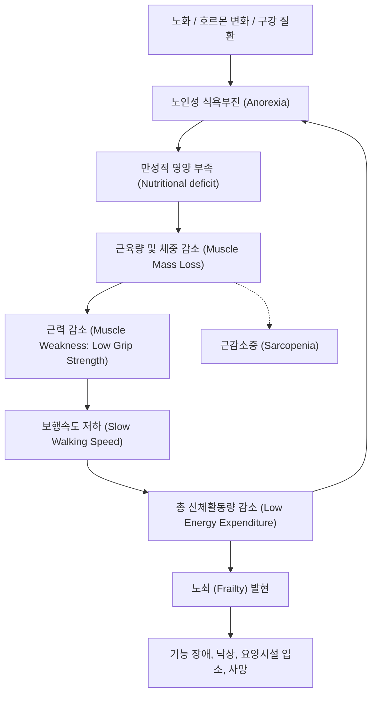

# 📑 [근감소증] PART 3 노쇠 (Frailty)

> **핵심 요약 (Key Summary)**
> - **노쇠(Frailty)**는 다발성 장기의 예비능과 항상성이 극도로 저하되어 가벼운 외부 스트레스(감염, 수술 등)에도 급격한 기능 감퇴가 일어나며 잘 회복되지 않아 [[장애]], 입원, 시설 입소, 사망 등 부정적 결과로 이어지기 쉬운 취약 상태이다.
> - **진단 체계**: 생체 표현형 기반의 **Fried 신체적 노쇠 기준**(체중감소, 악력 감소, 탈진, [[보행속도]] 저하, 활동량 감소 중 3개 이상)과 결손 축적 지수 기반의 **Rockwood 노쇠지수(Frailty Index)**가 양대 축을 이루며, 임상용 도구로 **FRAIL scale**, **한국형 노쇠설문지(FPQ)**, **Korean Frailty Scale(KFS)**, **Clinical Frailty Scale(CFS)** 등이 널리 활용된다.
> - **[[근감소증]]과의 연계**: 한국노인노쇠코호트(KFACS) 분석 결과, 노쇠 노인의 **52.6%가 [[근감소증]](AWGS 2019 기준)을 동반**하며, 식욕부진→체중감소→근력감소→활동량저하의 '노쇠의 악순환(Cycle of Frailty)' 중심축에 근감소증이 위치한다.
> - **예방 및 치료 중재**: 노쇠는 가역적인 상태로, 단일 중재로는 **다요소 복합운동(유산소+저항성+균형)**이 가장 강력한 효과(RR = 0.26)를 나타내며, **운동과 영양(단백질 1.0~1.5 g/kg/day, 류신, [[비타민 D]])의 병행요법** 및 [[포괄적 노인평가]](CGA/GEM) 기반의 개인맞춤형 복합중재가 장기적 기능 유지의 핵심이다. 승인된 단일 약물치료제는 없으며 부적절한 다약제 감축(deprescribing)이 권고된다.

---

## 📌 목차
1. [Chapter 16. 노쇠의 정의 및 진단](#chapter-16-노쇠의-정의-및-진단)
   - [1.1 노쇠의 의학적 정의 및 임상적 중요성](#11-노쇠의-의학적-정의-및-임상적-중요성)
   - [1.2 노쇠와 근감소증의 상호관계 및 발생기전](#12-노쇠와-근감소증의-상호관계-및-발생기전)
   - [1.3 노쇠의 진단 및 평가 체계](#13-노쇠의-진단-및-평가-체계)
2. [Chapter 17. 노쇠의 예방과 치료](#chapter-17-노쇠의-예방과-치료)
   - [2.1 노쇠 관리를 위한 단계별 접근 개요](#21-노쇠-관리를-위한-단계별-접근-개요)
   - [2.2 노쇠의 일차예방 (Primary Prevention)](#22-노쇠의-일차예방-primary-prevention)
   - [2.3 조기발견 및 전노쇠 대처 (Secondary Prevention)](#23-조기발견-및-전노쇠-대처-secondary-prevention)
   - [2.4 노쇠 환자의 치료 및 재활 (Tertiary Prevention)](#24-노쇠-환자의-치료-및-재활-tertiary-prevention)
   - [2.5 임상진료지침 및 지역사회 통합관리체계](#25-임상진료지침-및-지역사회-통합관리체계)
3. [출처 및 참고 문헌 (References)](#3-출처-및-참고-문헌-references)

---

## Chapter 16. 노쇠의 정의 및 진단
**저자: 원장원 (경희의대)**

### 1.1 노쇠의 의학적 정의 및 임상적 중요성

#### (1) 노인 인구 변화와 건강수명의 격차
- **한국의 초고령사회 진입**: 한국은 2025년에 초고령사회에 진입하며, 특히 80세 이상 후기고령 인구가 급증하고 있음.
- **건강수명과의 괴리**: 2010년부터 10년간 한국의 평균수명은 3.1세 연장되었으나, 장애 없이 독립적인 활동이 가능한 **건강수명은 2.2세 증가에 그침**. 즉, 생애 말기에 만성질환 및 기능장애를 안고 지내는 유병 기간이 점차 늘어나고 있음.
- **노쇠 예방의 당위성**: 노인의 만성질환 유병률은 비교적 관리되고 있으므로, 건강수명을 늘리고 의존 기간을 단축하기 위한 궁극적인 열쇠는 신체기능 장애의 직접적 원인인 **[[노쇠]](Frailty)**의 조기 차단 및 관리에 있음.

#### (2) 노쇠의 의학적 정의
- **의학적 정의**: 여러 신체 장기들의 전반적인 기능이 극도로 저하되고 회복할 수 있는 **예비기능(reserve capacity)이 고갈**되어, 경미한 외부 스트레스 요인(감염, 수술, 약물 부작용 등)에 의해서도 신체 기능이 급격히 붕괴되고 원래대로 회복되지 못하여 기능적 의존 상태로 전락하기 쉬운 임상적 취약 상태.
- **노쇠의 부정적 건강 결과(Adverse Outcomes)**:
  1. [[일상생활수행능력]](ADL/IADL) 장애
  2. [[낙상]] 및 골절 위험 급증
  3. 요양시설 조기 입소
  4. 응급실 방문 및 병원 입원 증가
  5. 전반적 사망률(All-cause mortality) 증가
- **한국노인노쇠코호트(KFACS) 추적 결과**: 노쇠 노인은 건강한 노인에 비해 2년 뒤 일상생활에 도움이 필요한 장애가 발생할 확률이 (교란변수 보정 후에도) **3~10배 증가**.

> ![[Sarcopenia_Ch16_p267_Fig1.png|540]]
> **그림 16-1. 노쇠한 사람의 스트레스 반응 및 기능 저하 도식도.** 건강한 노인(ROBUST)은 가벼운 스트레스에 직면해도 기능 저하가 적고 빠르게 독립적인 상태로 회복되는 반면, 노쇠한 노인(FRAIL)은 잔존 예비기능이 낮아 가벼운 스트레스(번개 표시)에도 기능이 급격하게 저하되며 회복이 불완전하여 수발과 간병이 필요한 의존(Functional dependency) 상태로 전락할 위험이 크다.

#### (3) 노쇠의 다차원적 분류
- **신체적 노쇠(Physical frailty)**: 골격근의 질·양 저하와 운동신경 퇴행으로 보행속도 저하, 근력 약화, 전신 피로, 잦은 낙상 등이 두드러짐.
- **인지적 노쇠(Cognitive frailty)**: 뇌 신경망의 기능 저하로 스트레스 상황 시 급성 섬망(delirium)이나 경도인지장애가 쉽게 동반되는 상태.
- **사회적 노쇠(Social frailty)**: 독거, 경제적 빈곤, 사회적 고립, 사회활동 감소 등 사회적 자원의 결핍이 신체적 퇴행을 촉진하는 병리적 상태.
- **일차적 노쇠 vs. 이차적 노쇠**: [[당뇨병]], [[심부전]] 등 중증 만성질환으로 촉발되는 **이차적 노쇠** 외에도, 만성질환과 무관하게 노화에 따른 생리적 항상성 붕괴 및 호르몬 변화 등으로 발생하는 **일차적 노쇠가 전체 노쇠의 약 1/3을 차지**함.
- **국내 유병률(2008년 보건복지부 노인실태조사, 14,478명)**:
  - 건강(Robust): **42.4%**
  - 전노쇠(Pre-frailty): **49.3%**
  - 노쇠(Frailty): **8.3%**

---

### 1.2 노쇠와 근감소증의 상호관계 및 발생기전

#### (1) 노쇠의 악순환 사이클 (Cycle of Frailty)
노화에 따른 호르몬 변화, 위장관 운동 저하, 구강 건강 악화, 다약제 부작용으로 **노인성 식욕부진(Anorexia of aging)**이 발생하며, 이는 연쇄적인 생체 기능 저하를 유발함:

#### (2) [[근감소증]]과의 병리학적 교차
- 노쇠의 핵심 발생 기전인 `근육량(체중) 감소 → 근력 감소 → 보행속도 감소`는 근감소증의 핵심 진단 기준과 완전히 일치함. 즉, **근감소증은 노쇠의 가장 직접적이고 중요한 선행 위험요인이자 물리적 실체**임.
- **한국노인노쇠코호트(KFACS) 분석 결과**:
  - 노쇠(Physical Frailty) 판정을 받은 노인(116명) 중 **52.6%(61명)**가 아시아 [[근감소증]] 진단지침(AWGS 2019) 기준의 근감소증을 동반하고 있었음.
  - 근감소증 진단 기준(AWGS 2014 vs. AWGS 2019)에 따라 겹치는 비율의 차이가 존재하나, 노쇠 환자의 과반수가 명확한 근감소증을 보유함.

---

### 1.3 노쇠의 진단 및 평가 체계

노쇠의 진단 방식은 크게 특정 항목들의 임계치 충족 여부를 평가하는 **기준(Criteria/Phenotype) 방식**과, 개인이 가진 건강 결손 항목의 비율을 점수화하는 **지수(Index) 방식**으로 양분됨.

#### (1) Fried의 신체적 노쇠 기준 (Fried Physical Frailty Phenotype)
Linda Fried 교수가 Cardiovascular Health Study(CHS) 코호트를 기반으로 제안한 방식으로, 아래 5개 생체 표현형 중 **3개 이상 해당 시 노쇠(Frail)**, **1~2개 해당 시 전노쇠(Prefrail)**, **0개는 건강(Robust)**으로 판정함.

##### [표 16-1] Fried의 신체적 노쇠 기준을 한국 코호트(KFACS)에 적용한 진단 기준
| 평가 영역 | 질문 및 측정 방식 | 한국 노인 코호트 컷오프 (1점 부여 기준) |
| :--- | :--- | :--- |
| **1. 체중 감소** (Weight loss) | 설문: 과거 1년 동안 체중이 5% 이상 혹은 4.5 kg 이상 감소하였는가? | **"예"**로 응답한 경우 |
| **2. 근력 감소** (Weak grip strength) | 악력(Grip strength) 측정 (성별 및 BMI 사분위별 하위 20%) | **[남자]** • BMI < 22: **< 25.0 kg** • BMI 22.1~24: **< 27.0 kg** • BMI 24.1~26: **< 27.8 kg** • BMI > 26: **< 28.5 kg**  **[여자]** • BMI < 23: **< 16.8 kg** • BMI 23.1~25: **< 17.7 kg** • BMI 25.1~27: **< 17.8 kg** • BMI > 27: **< 17.7 kg** |
| **3. 탈진** (Exhaustion) | CES-D 우울척도 2개 문항: 1) 지난 1주일 동안 모든 일들이 힘들게 느껴졌는가? 2) 지난 1주일 동안 무슨 일이든지 도무지 해낼 수 없는 느낌이 들었는가? (①하루 미만 ②1~2일 ③3~4일 ④5~7일) | 두 질문 중 하나라도 **③번(자주, 3~4일)** 또는 **④번(항상, 5~7일)**으로 응답한 경우 |
| **4. 보행속도 저하** (Slow walking speed) | 4 m 보통 속도로 걷기 (성별 및 신장 중앙값별 하위 20%) | **[남자]** • 신장 < 165 cm: **< 0.93 m/s** • 신장 ≥ 165 cm: **< 0.98 m/s**  **[여자]** • 신장 < 152 cm: **< 0.85 m/s** • 신장 ≥ 152 cm: **< 0.93 m/s** |
| **5. 활동량 감소** (Low physical activity) | IPAQ 설문 기반 주간 신체활동 소비 열량(kcal) 하위 20% | • **남자: < 495.65 kcal/주** • **여자: < 283.50 kcal/주** |

> **간이 적용 기준 (AWGS 2019 연계)**
> 진료실에서 복잡한 사분위 컷오프 대신 간단한 절대 기준을 적용할 경우:
> - **악력**: 남자 < 28 kg, 여자 < 18 kg
> - **보행속도**: 남녀 공통 < 1.0 m/s

#### (2) Rockwood의 결손 축적 노쇠지수 (Frailty Index, FI)
- Kenneth Rockwood 교수가 제안한 방식으로, 70가지 포괄적 평가 항목(신체 질환, 인지·정신 기능, 일상생활장애, 진찰소견, 혈액검사 수치 등) 중 개인이 보유한 결손(deficit) 항목의 비율을 0.0~1.0의 연속 변수로 산출.
- 예: 70개 항목 중 7개 결손 보유 시 $FI = 7/70 = 0.10$.
- **판정 기준**: 일반적으로 **$FI > 0.25$**이면 Fried의 신체적 노쇠 상태에 해당할 가능성이 매우 높음.
- **한국형 및 전자의무기록 기반 지수 개발**:
  - **한국 일차의료 노쇠지수(KFI-PC)**: 1차 의료 환경에 맞게 타당화.
  - **국가생애전환기검진(66세) 기반 노쇠지수**: 입원력, 주관적 건강평가, 다약제복용, 체중감소, 우울, [[요실금]], 시청각장애, TUG(의자에서 일어나 3 m 걷기)로 구성. 4.4년 추적 결과 사망, 요양시설 입소, [[대퇴골]] 골절을 유의하게 예측.
  - **Hospital Frailty Risk Score (HFRS)**: ICD-10 상병코드를 바탕으로 전자의무기록(EHR)에서 자동 산출.

#### (3) 임상 현장용 신속 간이 평가도구
Fried 기준은 악력계, 4 m 보행로, 설문 시간 등이 필요하여 바쁜 외래에서 적용하기 어렵기 때문에 다양한 약식 도구가 개발됨.

##### 1) FRAIL scale (John Morley 개발)
5개 영역(각 1점, 총점 3점 이상 노쇠, 1~2점 전노쇠, 0점 정상):
1. **F**atigue (피로): 지난 한 달간 피로를 느꼈는가?
2. **R**esistance (저항): 도움 없이 혼자 10개 계단을 쉬지 않고 오르기 힘든가?
3. **A**mbulation (이동): 도움 없이 300 m 거리를 혼자 걷기 힘든가?
4. **I**llness (지병): 의사에게 5개 이상의 만성질환([[고혈압]], 당뇨, 암, COPD, 심근경색, [[심부전]], [[협심증]], [[천식]], 관절염, [[뇌졸중]], 신장질환)을 진단받았는가?
5. **L**oss of weight (체중감소): 지난 1년간 5% 이상의 체중 감소가 있었는가?
*(활동량 측정 대신 복합 질환 문항을 넣어 Phenotype과 Index 개념을 결합)*

##### 2) 한국형 신체노쇠 설문지 (Frailty Phenotype Questionnaire, FPQ)
원장원 교수 연구팀이 개발한 도구로, 측정 기구 없이 설문만으로 Fried 5대 요소를 대변함 (신체적 노쇠 진단 **민감도 81.7%, 특이도 82.5%**). 3점 이상 노쇠, 1~2점 전노쇠.
- **탈진**: 지난 1주일간 모든 일이 힘들었는가? (종종/대부분 = 1점)
- **근력감소**: 보조기구/타인 도움 없이 10개 계단 오르기 힘든가? (예 = 1점)
- **보행속도 저하**: 운동장 한 바퀴(400 m) 걷기가 가능한가? (약간이라도 어렵다 = 1점)
- **활동량 감소**: 지난 7일간 중강도(빠른 걷기, 청소 등) 또는 격렬한 신체활동을 1회 이상 했는가? (안 함 = 1점)
- **체중 감소**: 지난 1년간 비의도적으로 4.5 kg 이상 체중이 줄었는가? (예 = 1점)

##### 3) Korean Frailty Scale (KFS)
한국노인노쇠코호트에서 개발한 6개 항목 도구로, 2년 후 일상생활장애, 낙상, 입원, 사망 예측력이 우수함:
- 신체 영역: 비의도적 체중감소 (4.5 kg 또는 5% 이상), 주관적 건강인식 저하
- 정신 영역: 활력 감소(loss of energy), 피로감(fatigue)
- 사회 영역: 사회적 연결망(친구 교류 빈도), 사회적 지지(필요할 때 연락할 사람 유무)

##### 4) 기타 임상 도구
- **Clinical Frailty Scale (CFS)**: Rockwood 교수가 고안한 픽토그램 기반 도구로, 1점(매우 건강)부터 9점(말기 환자)까지 임상의의 시진과 상태 평가로 빠르게 등급을 매김.
- **대한노인병학회 한국형 노쇠측정도구**: 국내 최초 개발 도구로 입원 횟수, 주관적 건강, 약물복용, 체중감소, 우울, 실금, 보행능력, 의사소통(시청각)의 8항목 평가.

---

## Chapter 17. 노쇠의 예방과 치료
**저자: 이윤환 (아주의대)**

### 2.1 노쇠 관리를 위한 단계별 접근 개요

#### (1) 역학적 유병률 및 발생률
- **전 세계 유병률 (65세 이상)**: 노쇠(Frail) **9.9%**, 전노쇠(Prefrail) **44.2%**. (50세 이상 62개국 메타분석: 노쇠 12%, 전노쇠 46%).
- **한국 유병률 (65세 이상)**: 노쇠 **8.3%**, 전노쇠 **49.3%**. 연령이 올라갈수록 급증하여 **85세 이상에서는 노쇠 19.9%, 전노쇠 62.4%**에 이름.
- **발생률(Incidence)**: 28개국 자료 분석 시 천인년(1,000 person-years)당 노쇠 발생률은 **43.4명**, 전노쇠 발생률은 **150.6명**.
- **조기 개입 효과**: 노쇠를 선제적으로 예방·차단할 경우 노년기 사망의 **3~5%를 지연**시킬 수 있음.

> ![[Sarcopenia_Ch17_p275_Fig1.png|540]]
> ![[Sarcopenia_Ch17_p275_Fig2.png|540]]
> **그림 17-1. 노쇠의 단계와 중재 (Stages of Frailty and Interventions).** 비노쇠(Non-frail) 대상의 일차예방(건강증진, 위험평가, 운동, 영양, 사회참여), 전노쇠(Pre-frail) 대상의 이차예방(조기선별, 조기관리, 사례관리, CGA/GEM, 운동, 영양), 노쇠(Frail) 및 노인증후군·장애 발생 후 삼차예방(재활, CGA/GEM, 운동, 영양, 심리치료, 인지훈련)을 통해 기능 저하가 악화되는 연결고리를 끊고(붉은 X 표시), 노인증후군, 낙상·골절, 신체장애, 인지장애, 입원, 시설입소, 사망 등 부정적 건강결과(Adverse outcomes)를 방지하는 포괄적 중재 경로. (CGA: comprehensive geriatric assessment, GEM: geriatric evaluation and management)

---

### 2.2 노쇠의 일차예방 (Primary Prevention)

건강한 정상 노인을 대상으로 노쇠의 위험요인을 조기에 식별하여 노쇠 발생을 억제·지연시키는 단계임.

#### (1) 노쇠의 주요 위험요인 다각적 분석 [표 17-1]
- **개인적/인구사회학적 특성**: 초고령, 여성, 저학력, 저소득, 인종(흑인, 히스패닉).
- **건강 및 임상적 요인**: 주관적 건강인식 불량, ADL/IADL 제한, 신체기능(보행속도, 악력, 하지근력) 저하, 인지장애, 시각·청각 손상, 수면장애(<6시간 또는 >8시간, 불면, 수면무호흡), 통증, [[다약제복용]](Polypharmacy), 낙상/입원력, [[요실금]], 구강기능 저하(결손치, 저작/교합력 저하), 영양실조, [[비만]] 또는 저체중, 대사증후군, 만성질환(당뇨, [[고혈압]], [[뇌졸중]], COPD 등), 우울증, 외로움.
- **생활습관 및 식이**:
  - *예방적 요인(-)*: 지중해식 식단, 과일/채소 섭취, 높은 식사의 질, 충분한 단백질 섭취, 항산화 영양소([[비타민 D]], E, C, A, 카로티노이드, [[엽산]]) 섭취, 규칙적 신체활동.
  - *위험 요인(+)*: 높은 식이염증지수(DII), 흡연, 음주, 좌식생활.
- **생물학적 지표**:
  - *염증 지표 상승*: CRP, [[IL-6]], TNF-α, Fibrinogen.
  - *대사/호르몬 이상*: 요산, [[혈당]], [[HbA1c]], [[중성지방]] 상승 / Albumin, [[HDL]]-C, [[IGF-1]], 비타민 D 저하.
  - *혈액/유전 지표*: [[빈혈]](Hemoglobin 저하), 텔로미어 길이 단축(Telomere shortening).
- **환경 및 사회적 요인**: 대인관계 결핍, 독거, 사별, 학대, 빈곤 동네 거주, 사회적 지지 결여, 미세먼지(PM2.5), 간접흡연, 납 노출.

#### (2) 일차예방 중재 근거
- **운동의 절대적 중요성**: 정상 및 전노쇠 노인 대상 임상시험 메타분석 결과:
  - **운동 단독 중재**: 노쇠 발생 위험을 대폭 낮춤 (**RR = 0.26**, 95% CI: 0.08~0.83).
  - **단일 영양 중재**: 단독으로는 노쇠 예방 효과 없음 (**RR = 1.16**, 95% CI: 0.23~4.10).
  - **운동 + 영양 복합 중재**: 유의한 노쇠 예방 효과 확인 (**RR = 0.30**, 95% CI: 0.10~0.87).
- **지역사회 공중보건 사업 (일본 군마현 쿠사츠 모델)**:
  - 65세 이상 지역 노인 대상 운동·영양·사회활동 중심의 건강증진, [[포괄적 노인평가]](CGA), 개호예방 프로그램 10년 추적.
  - **결과**: 신체기능 개선 및 **70세 기준 건강수명 연장(여성 1.2년, 남성 0.5년)**, 장기요양보험 인정률 및 보험료 지출 대폭 감소.

---

### 2.3 조기발견 및 전노쇠 대처 (Secondary Prevention)

노쇠의 초기 징후를 선별하여 **전노쇠(Prefrail) 단계에서 조기 개입하여 정상으로 가역적 회복(reversal)을 도모**하는 단계.

#### (1) 노쇠 선별검사 (Screening)
- **권고사항**: 영국노인의학회(BGS) 등 주요 가이드라인은 일차의료 진료 및 복지서비스 접점에서의 기회적 선별검사를 권고함. (단, 특이도 문제와 비용-효과성 미검증으로 일반 대중 대상 무차별 집단선별은 유보).
- **고위험 선별 대상**: 65세 이상 고령자, 75세 이상 잠재군, 또는 **지난 1년간 5% 이상의 비의도적 체중 감소** 노인, 수술 예정 노인.
- **일본 기본체크리스트 (Kihon Checklist)**: 장기요양 미인정 노인을 대상으로 신체기능, 영양, 구강, 기동성, 사회활동, 인지, 우울의 7개 영역 25문항 설문을 통해 개호예방 고위험군을 발굴하여 보건소·지역포괄지원센터 프로그램으로 연계.

#### (2) 전노쇠 중재 연구 근거
- 노쇠의 가역성 평가 문헌고찰(14편 중 9편 효과 입증): 재가방문 맞춤형 물리치료, 주거환경 개선, 운동-영양-인지 복합중재가 효과적.
- **도쿄 노인 대상 복합 프로그램**: 12주간 주 1회 근력·균형 운동 + 조리실습 포함 영양교실 실시 결과, 6개월 후 악력과 삶의 질이 현저히 향상.
- **영국 70세 이상 전노쇠 연구**: 1년간 운동 및 영양 관리군에서 노쇠 진행률이 **4.9%**로 대조군(15.3%) 대비 1/3 수준으로 감소.
- **싱가포르 S-FIT (Singapore Frailty Intervention Trial)**: 전노쇠·노쇠 노인 대상 6개월간 신체운동(주 2회, 90분), 미량영양소 복합 영양보충제(Fortisip Multi Fibre), 인지훈련을 병행하여 노쇠 호전 확인.
- **오스트리아 방문 자원봉사 중재**: 훈련된 자원봉사자가 12주간 주 2회 가정을 방문하여 6종 대근육 운동 + 영양상담 + 사회적 지지를 제공한 결과, 노쇠 유병률이 각각 **17%, 16% 감소**.

---

### 2.4 노쇠 환자의 치료 및 재활 (Tertiary Prevention)

이미 노쇠 단계에 진입한 노인을 대상으로 기능 회복, 재활, 낙상 방지, 입원 및 사망 지연을 도모하는 단계.

#### (1) 운동 요법 (Exercise) — 최우선 치료법
- **기전**: 노쇠는 전신 미토콘드리아 이상과 대사조절 파탄으로 에너지 생산이 저하된 상태이므로, 신체활동을 통한 대사 활성화가 급선무임.
- **운동 형태**: 유산소 운동(최대산소소비량 $VO_2max$ 10~15% 개선)과 저항성 근력 운동(근력 최대 110% 향상)을 결합한 **다요소 복합운동(Multicomponent training: 저항성 + 유산소 + 균형 + 유연성)**이 단일 점진적 근력운동보다 월등한 기능 향상을 보임.
- **권장 프로토콜**:
  - 빈도/시간: **1회 45~60분, 주 2~3회, 최소 3개월 이상** 지속.
  - 고강도 운동이라도 적절한 지도 하에서는 노쇠 노인에게 손상이나 심각한 부작용 없이 안전함.
- **대규모 임상 근거 (LIFE 및 LIFE-P 연구)**:
  - **LIFE 연구 (1,635명 노쇠/취약 노인 대상 2.6년 추적)**: 정기적 운동군이 건강교육 대조군에 비해 중증 보행장애 발생률이 유의하게 낮음 (**30.1% vs. 35.5%**).
  - **LIFE pilot 연구 (424명, 12개월 추적)**: 운동군의 노쇠 유병률이 대조군에 비해 절반으로 감소 (**10.0% vs. 19.1%**).

#### (2) 영양보충요법 (Nutrition)
- **한계와 필요성**: 영양 단독 중재는 기능 개선 근거가 불충분하지만, 지역사회 노인의 50% 이상이 영양결핍이고 결핍 노인의 90%가 노쇠 위험군이므로 영양 교정은 필수적임.
- **단백질 섭취 기준**:
  - 노화에 따른 동화저항성(Anabolic resistance) 극복을 위해 일반 성인보다 높은 **1.0~1.2 g/kg/day**, 노쇠 노인의 집중 재활 시 **1.5 g/kg/day** 권장.
  - **끼니당 25~30 g**의 양질의 단백질 섭취 분배 필요.
  - 서울 강북구 보건소 연구: 취약 노쇠 노인에게 12주간 복합 영양제(400 kcal, 단백질 25 g, 필수아미노산 9.4 g) 투여 시 신체기능 및 보행속도 유의미 개선.
- **미량영양소 및 특수 영양소**:
  - **[[비타민 D]]**: 800 IU/day ([[칼슘]] 1,000~1,200 mg/day 병행 시 골절 및 낙상 예방).
  - 류신(Leucine), HMB, 크레아틴, 아르기닌, 시트룰린, 오메가-3, 항산화제 등은 연구 진행 중이나 단독 근거는 아직 제한적.
  - 단일 영양소보다 지중해식 식단과 같은 **전체 식사 패턴(Dietary pattern)의 질적 개선**이 중요.

#### (3) 운동과 영양보충 병행요법의 시너지
- **필수아미노산(EAA) + 저항성 운동**:
  - 근감소증이 있는 75세 이상 여성에게 3개월간 운동(주 2회)과 **류신 42% 함유 필수아미노산 3 g을 1일 2회** 복용하게 한 결과, 하지 근육량, 근력, 보행속도가 단일 요법군 대비 유의하게 우수.
  - **Milk Fat Globule Membrane (MFGM)**: 노쇠 여성에게 MFGM 1 g/day와 운동 병행 시 노쇠 호전 극대화.
- **섭취 타이밍**:
  - 근단백질 합성을 최적화하려면 저항성 운동 후 혈청 단백질 농도를 충분히 유지해야 함.
  - 젊은 층은 운동 후 1~3시간 내에 합성이 급증하지만, **노인은 운동 후 3~6시간이 경과해야 유의한 단백질 합성 증가**가 나타나는 시간 지연(lag) 현상을 보임.

#### (4) 포괄적 다영역 복합중재 (Multicomponent Intervention)
- **호주 FIT (Frailty Intervention Trial)**: 70세 이상 노쇠 노인에게 표현형 맞춤형(체중감소 시 식사배달 및 고단백식, 탈진 시 정신건강의학과/임상심리 의뢰, 보행저하 시 방문재활) 중재를 12개월간 시행한 결과, **노쇠 유병률이 대조군 76% 대비 중재군 62%로 감소**하고 SPPB 신체수행능력이 개선됨.
- **포괄적 노인평가(CGA/GEM)**: 노인의학회 표준 지침으로, 입원 환자에서 CGA 적용 시 퇴원 후 재입원율과 사망률을 유의하게 감소시킴.

#### (5) 약물요법의 현주소 및 약물 조정
- **치료 약물의 부재**: 현재 노쇠 자체를 적응증으로 승인된 효과적인 단일 치료 약물은 없으며, 국제노쇠·근감소증학회(ICFSR)는 노쇠 치료 목적의 약물 처방을 권고하지 않음.
- **부적절 약물 감축(Deprescribing)**: 노쇠를 악화시키는 가장 큰 원인 중 하나가 약물 부작용이므로, **Beers Criteria**나 **STOPP/START Criteria**를 적용하여 불필요하거나 진정 작용을 유발하는 다약제를 중단·조정하는 것이 최우선 약물 전략임.
- **질병 코드 등재**: 최근 WHO의 **ICD-11에 내재적 역량(Intrinsic capacity) 저하 코드인 'MG2A'가 신설**되어 향후 타깃 치료제 개발의 전기가 마련됨.

---

### 2.5 임상진료지침 및 지역사회 통합관리체계

#### (1) 국내외 주요 임상진료지침
- **일차예방 7대 수칙**: 1) 우울증상 등 정서 건강 관리, 2) 구강건강 유지, 3) 균형 잡힌 다양한 식사, 4) 금연, 5) 만성질환 관리 및 약물 평가, 6) 활발한 사회활동, 7) 규칙적인 다요소 복합운동.
- **대한가정의학회 권고사항**:
  - *강한 권고*: 복용약물 평가·조정, 저항성·유산소·균형 운동, 영양상태 평가 및 중재, 구강건강 관리, [[비타민 D]] 결핍 보충, 인지장애 예방, 낙상 위험 평가 및 예방.
  - *비권고*: 치료 목적의 호르몬 보충 요법(성호르몬, [[성장호르몬]] 등).
- **수술 전후 노쇠 관리(Perioperative Care, 영국 지침)**: 수술 전 Clinical Frailty Scale(CFS)을 측정하여 **CFS ≥ 5점**인 노쇠 노인은 수술 전 반드시 [[포괄적 노인평가]](CGA)를 거치고 노쇠 전담팀이 협진하도록 규정.

#### (2) 글로벌 통합관리 모델
- **미국 PACE (Program of All-Inclusive Care for the Elderly)**: 장기요양 등급 노인에게 주간보호센터를 축으로 일차의료, 전문진료, 재택간호, 복약지도, 차량이동을 원스톱 제공하여 시설 입소를 늦추고 지역사회 계속 거주(Aging in Place) 실현.
- **캐나다 PRISMA**: 단일 창구를 통한 평가와 다학제 팀 기반의 통합 조정 서비스.
- **EU FrailSafe 사업**: 스마트 의류, 웨어러블 센서, 실내외 동작 감지기, VR 게임을 결합하여 개인의 생체 신호를 실시간 수집하고 가상환자모형(Virtual Patient Model)을 구축해 맞춤형 노쇠 관리 제공.
- **영국 eFI (electronic Frailty Index)**: 일차의료 전자의무기록(EHR) 36개 결손 데이터를 활용해 노쇠 지수를 자동 산출, 단계별 자가관리 및 완화의료 매칭.
- **WHO ICOPE (Integrated Care for Older People)**: 인지, 기동성, 영양, 시각, 청각, 우울 등 6대 내재적 역량 선별 및 경로별 관리. 프랑스 오시타니아의 INSPIRE ICOPE-CARE에서 앱과 로봇을 활용해 임상 실증.

#### (3) 한국의 지역사회 통합돌봄 및 정책 추진
- **지역사회 통합돌봄(커뮤니티케어) 선도사업 (2019~2022)**: 16개 지자체(노인 대상 8곳)에서 주거, 방문진료, 재가요양, 민관협력 서비스 인프라 구축.
- **노인 의료·돌봄 통합지원 시범사업 (2023~)**: 12개 지자체 75세 이상 노인을 대상으로 주거·의료·요양·돌봄 연계.
- **의료-요양-돌봄 통합판정체계 (2023~)**: 장기요양 등급판정 체계를 확대하여 요양병원 입원, 장기요양보험, 노인맞춤돌봄의 필요도를 표준화된 단일 기준으로 통합 판정하는 시스템 구축 중.

---

## 3. 출처 및 참고 문헌 (References)

### Chapter 16 References
1. 황환식, 권인순, 박병주, 조비룡, 윤종률, 원장원. 한국형 노쇠측정도구 개발 및 타당도 조사. *J Korean Geriatr Soc.* 2010;14(4):191-202.
2. Apostolo J, Cooke R, Bobrowicz-Campos E, et al. Effectiveness of interventions to prevent pre-frailty and frailty progression in older adults: A systematic review. *JBI Database System Rev Implement Rep.* 2018;16:140-232.
3. Won CW, Lee Y, Lee S, Kim M. Development of Korean Frailty Index for Primary Care (KFI-PC) and Its Criterion Validity. *Ann Geriatr Med Res.* 2020;24(2):125-138.
4. Dent E, Morley JE, Cruz-Jentoft AJ, Woodhouse L, Rodriguez-Mañas L, Fried LP, et al. Physical Frailty: ICFSR International Clinical Practice Guidelines for Identification and Management. *J Nutr Health Aging.* 2019;23:771-787.
5. Fried LP, Tangen CM, Walston J, et al. Frailty in older adults: Evidence for a phenotype. *J Gerontol A Biol Sci Med Sci.* 2001;56:M146-M156.
6. Géné Huguet L, Navarro Gonzalez M, Kostov B, et al. Pre Frail 80: Multifactorial Intervention to Prevent Progression of Pre-Frailty to Frailty in the Elderly. *J Nutr Health Aging.* 2018;22(10):1266-1274.
7. Gilbert T, Neuburger J, Kraindler J, et al. Development and validation of a Hospital Frailty Risk Score focusing on older people in acute care settings using electronic hospital records: an observational study. *Lancet.* 2018;391(10132):1775-1782.
8. Jang IY, Jung HW, Park H, et al. A multicomponent frailty intervention for socioeconomically vulnerable older adults: a designed-delay study. *Clin Interv Aging.* 2018;13:1799-1814.
9. Kim CO, Jeong Y, Park Y, et al. Reinforcement Effects of Social Network Intervention during Nutritional Supplementation in Frail Older Adults. *Gerontology.* 2021;11:1-13.
10. Kim S, Kim M, Jung HW, Won CW. Development of a Frailty Phenotype Questionnaire for Use in Screening Community-Dwelling Older Adults. *J Am Med Dir Assoc.* 2019;28:pii:S1525-8610(19)30645-0.
11. Kim YP, Choe YR, Park JH, et al. Frailty index associated with all-cause mortality, long-term institutionalization, and hip fracture. *Eur Geriatr Med.* 2019;10(3):403-411.
12. Ko RE, Moon SM, Kang D, et al. Translation and validation of the Korean version of the clinical frailty scale in older patients. *BMC Geriatr.* 2021;21(1):47.
13. Negm AM, Kennedy CC, Thabane L, et al. Management of Frailty: A Systematic Review and Network Meta-analysis of Randomized Controlled Trials. *J Am Med Dir Assoc.* 2019;20(10):1190-1198.
14. Park Y, Choi J, Hwang H. Protein supplementation improves muscle mass and physical performance in undernourished prefrail and frail elderly subjects: a randomized, double-blind, placebo-controlled trial. *Am J Clin Nutr.* 2018;108:1026-1033.
15. Shin HE, Kim M, Won CW. Differences in Characteristics between Older Adults Meeting Criteria for Sarcopenia and Possible Sarcopenia: From Research to Primary Care. *Int J Environ Res Public Health.* 2022;19(7):4312.
16. Shin J, Kim M, Choi J. Development and Validation of a multidimensional Frailty Scale for Clinical Geriatric Assessment. *J Nutr Health Aging.* 2021;25(7):938-943.
17. Won CW. Evaluation and management of frailty. *J Korean Med Assoc.* 2017;60(4):314-320.

### Chapter 17 References
1. 박명화, 하정철, 신임희, et al. 2008년도 노인실태조사 기초분석보고서. 서울: 보건복지가족부, 계명대학교 산학협력단; 2008.
2. 유효상, 권유진, 김선영, et al. 일차의료에서 활용 가능한 노쇠 임상진료지침. *Korean J Fam Pract.* 2021;11:223-235.
3. 윤종률, 이윤환, 김미영, et al. 건강수명 연장을 위한 지역사회노인 대상 건강증진 프로그램 제공체계 개발과 모색. 한림대학교, 보건복지부; 2012.
4. 이영숙. 초고령사회 대응을 위한 노인 의료·요양·돌봄의 통합적 체계 구축의 과제. *보건복지포럼.* 2024년 7월호;66-82.
5. 정형진. 지역사회 통합돌봄 운영현황과 모니터링 주요 결과. 국민건강보험공단; 2020;23-47.
6. Aguirre LE, Villareal DT. Physical exercise as therapy for frailty. *Frailty: pathophysiology, phenotype and patient care.* Karger; 2015:83-92.
7. Artaza-Artabe I, Sáez-López P, Sánchez-Hernández N, et al. The relationship between nutrition and frailty: effects of protein intake, nutritional supplementation, vitamin D and exercise on muscle metabolism in the elderly. *Maturitas.* 2016;93:89-99.
8. Beswick AD, Rees K, Dieppe P, et al. Complex interventions to improve physical function and maintain independent living in elderly people: a systematic review and meta-analysis. *Lancet.* 2008;371:725-735.
9. Bock JO, König HH, Brenner H, et al. Associations of frailty with health care costs—results of the ESTHER cohort study. *BMC Health Serv Res.* 2016;16:128.
10. Boucham M, Salhi A, El Hajji N, et al. Factors associated with frailty in older people: an umbrella review. *BMC Geriatr.* 2024;24:737.
11. British Geriatrics Society. *Fit for Frailty - consensus best practice guidance for the care of older people living in community and outpatient settings.* London: BGS; 2014.
12. British Geriatrics Society. *Joining the Dots: A blueprint for preventing and managing frailty in older people.* London: BGS; 2023.
13. Cameron I, Fairhall N, Langron C, et al. A multifactorial interdisciplinary intervention reduces frailty in older people: randomized trial. *BMC Med.* 2013;11:65.
14. Centre for Perioperative Care. *Guideline for Perioperative Care for People Living with Frailty Undergoing Elective and Emergency Surgery.* London: CPOC; 2021.
15. Cesari M, Vellas B, Hsu FC, et al. A physical activity intervention to treat the frailty syndrome in older persons - results from the LIFE-P study. *J Gerontol A Biol Sci Med Sci.* 2015;70:216-222.
16. Chin A Paw MJ, van Uffelen JG, Riphagen I, et al. The functional effects of physical exercise training in frail older people: a systematic review. *Sports Med.* 2008;38:781-793.
17. Clegg A, Bates C, Young J, et al. Development and validation of an electronic frailty index using routine primary care electronic health record data. *Age Ageing.* 2016;45:353-360.
18. Collard RM, Boter H, Schoevers RA, et al. Prevalence of frailty in community-dwelling older persons: a systematic review. *J Am Geriatr Soc.* 2012;60:1487-1492.
19. Daniels R, van Rossum E, de Witte L, et al. Interventions to prevent disability in frail community-dwelling elderly: a systematic review. *BMC Health Serv Res.* 2008;8:278.
20. Dapp U, Anders JAM, von Renteln-Kruse W, et al. A randomized trial of effects of health risk appraisal combined with group sessions or home visits on preventive behaviors in older adults. *J Gerontol A Biol Sci Med Sci.* 2011;66A:591-598.
21. Dedeyne L, Deschodt M, Verschueren S, et al. Effects of multi-domain interventions in (pre)frail elderly on frailty, functional, and cognitive status: a systematic review. *Clin Interv Aging.* 2017;12:873-896.
22. Denison HJ, Cooper C, Sayer AA, et al. Prevention and optimal management of sarcopenia: a review of combined exercise and nutrition interventions to improve muscle outcomes in older people. *Clin Interv Aging.* 2015;10:859-869.
23. Dent E, Martin FC, Bergman H, et al. Management of frailty: opportunities, challenges, and future directions. *Lancet.* 2019;394:1376-1386.
24. Dent E, Morley JE, Cruz-Jentoft AJ, et al. Physical frailty: ICFSR international clinical practice guidelines for identification and management. *J Nutr Health Aging.* 2019;23:771-787.
25. Eidam A, Durga J, Bauer JM, et al. Interventions to prevent the onset of frailty in adults aged 60 and older (PRAE-Frail): a systematic review and network meta-analysis. *Eur Geriatr Med.* 2024.
26. Ensrud KE, Ewing SK, Taylor BC, et al. Frailty and risk of falls, fracture, and mortality in older women: the Study of Osteoporotic Fractures. *J Gerontol A Biol Sci Med Sci.* 2007;62:744-751.
27. Espinoza SE, Jung I, Hazuda H. Frailty transitions in the San Antonio Longitudinal Study of Aging. *J Am Geriatr Soc.* 2012;60:652-660.
28. EU. FrailSafe project. https://frailsafe-project.eu/
29. Fairhall N, Kurrle SE, Sherrington C, et al. Effectiveness of a multifactorial intervention on preventing development of frailty in pre-frail older people: study protocol for a randomised controlled trial. *BMJ Open.* 2015;5.
30. Fried LP, Tangen CM, Walston J, et al. Frailty in older adults: evidence for a phenotype. *J Gerontol A Biol Sci Med Sci.* 2001;56:M146-M156.
31. Fried LP. Interventions for human frailty: physical activity as a model. *Aging: the longevity dividend.* Cold Spring Harbor Laboratory Press; 2016:135-148.
32. Garcia-Esquinas E, Rodriguez-Artalejo F. Environmental pollutants, limitations in physical functioning, and frailty in older adults. *Curr Environ Health Rep.* 2017;4:12-20.
33. Gill TM, Gahbauer EA, Allore HG, et al. Transitions between frailty states among community-living older persons. *Arch Intern Med.* 2006;166:418-423.
34. Goisser S, Guyonnet S, Volkert D. The role of nutrition in frailty: an overview. *J Frailty Aging.* 2016;5:74-77.
35. Guo Y, Miao X, Hu J, et al. Summary of best evidence for prevention and management of frailty. *Age Ageing.* 2024;53:1-12.
36. Ki S, Yun JH, Lee Y, et al. Development of guidelines on the primary prevention of frailty in community-dwelling older adults. *Ann Geriatr Med Res.* 2021;25:237-244.
37. Kim CO, Lee KR. Preventive effect of protein-energy supplementation on the functional decline of frail older adults with low socioeconomic status: a community-based randomized controlled study. *J Gerontol A Biol Sci Med Sci.* 2013;68:309-316.
38. Kim H, Suzuki T, Kim M, et al. Effects of exercise and milk fat globule membrane (MFGM) supplementation on body composition, physical function, and hematological parameters in community-dwelling frail Japanese women: a randomized double blind, placebo-controlled, follow-up trial. *PLoS One.* 2015;10:e0116256.
39. Kim HK, Suzuki T, Saito K, et al. Effects of exercise and amino acid supplementation on body composition and physical function in community-dwelling elderly Japanese women: A randomized controlled trial. *J Am Geriatr Soc.* 2012;60:16-23.
40. Kjelsnes AA, Feiring E. Models of integrated care for older people with frailty: a horizon scanning review. *BMJ Open.* 2022;12:e060142.
41. Kwon J, Yoshida Y, Yoshida H, et al. Effects of a combined physical training and nutrition intervention on physical performance and health-related quality of life in prefrail older women living in the community: a randomized controlled trial. *J Am Med Dir Assoc.* 2015;16:263.e1-e8.
42. Lee Y, Arai H, Dapp U, et al. The International Perspective on Community-Based Integrated Care. *Community-based integrated care for older adults.* Springer; 2022:3-21.
43. Lee Y. Evidence-based prevention of frailty. *J Korean Geriatr Soc.* 2015;19:121-129.
44. Li CM, Chen CY, Li CY, et al. The effectiveness of a comprehensive geriatric assessment intervention program for frailty in community-dwelling older people: a randomized, controlled trial. *Arch Gerontol Geriatr.* 2010;50(Suppl 1):S39-S42.
45. Luger E, Dorner TE, Haider S, et al. Effects of a home-based and volunteer-administered physical training, nutritional, and social support program on malnutrition and frailty in older persons: a randomized controlled trial. *J Am Med Dir Assoc.* 2016;17:671.e9-e16.
46. Mehta P, Lemon G, Hight L, et al. A Systematic Review of Clinical Practice Guidelines for Identification and Management of Frailty. *J Nutr Health Aging.* 2021;25:382-391.
47. Mello Ade C, Engstrom EM, Alves LC. Health-related and socio-demographic factors associated with frailty in the elderly: a systematic literature review. *Cad Saude Publica.* 2014;30:1143-1168.
48. Milne AC, Potter J, Vivanti A, et al. Protein and energy supplementation in elderly people at risk from malnutrition. *Cochrane Database Syst Rev.* 2009;CD003288.
49. Morley JE, Vellas B, van Kan GA, et al. Frailty consensus: a call to action. *J Am Med Dir Assoc.* 2013;14:392-397.
50. Nash KC. The effects of exercise on strength and physical performance in frail older people: a systematic review. *Rev Clin Gerontol.* 2012;22:274-285.
51. Ng TP, Feng L, Zin Nyunt MS, et al. Nutritional, physical, cognitive and combination interventions and frailty reversal among older adults: a randomized controlled trial. *Am J Med.* 2015;128:1225-1236.
52. O'Caoimh R, Sezgin D, O'Donovan MR, et al. Prevalence of frailty in 62 countries across the world: a systematic review and meta-analysis of population-level studies. *Age Ageing.* 2021;50:96-104.
53. Pahor M, Guralnik J, Ambrosius W, et al. Effect of structured physical activity on prevention of major mobility disability in older adults: the LIFE study randomized clinical trial. *JAMA.* 2014;311:2387-2396.
54. Puts MTE, Toubasi S, Andrew MK, et al. Interventions to prevent or reduce the level of frailty in community-dwelling older adults: a scoping review of the literature and international policies. *Age Ageing.* 2017;46:383-392.
55. Regional Health Council. *Frailty in elderly people.* Florence, Italy: Regione Toscana; 2013.
56. Serra-Prat M, Sist X, Domenich R, et al. Effectiveness of an intervention to prevent frailty in pre-frail community-dwelling older people consulting in primary care: a randomised controlled trial. *Age Ageing.* 2017;46:401-407.
57. Sewo Sampaio PY, Sampaio RA, Yamada M, et al. Systematic review of the Kihon Checklist: Is it a reliable assessment of frailty? *Geriatr Gerontol Int.* 2016;16:893-902.
58. Shamliyan T, Talley KMC, Ramakrishnan R, et al. Association of frailty with survival: a systematic literature review. *Ageing Res Rev.* 2013;12:719-736.
59. Shinkai S, Yoshida H, Taniguchi Y, et al. Public health approach to preventing frailty in the community and its effect on healthy aging in Japan. *Geriatr Gerontol Int.* 2016;16:87-97.
60. Si H, Yu J, Liu Q, et al. Clinical practice guidelines for frailty vary in quality but guide primary health care: a systematic review. *J Clin Epidemiol.* 2023;161:28-38.
61. Strawbridge WJ, Shema SJ, Balfour JL, et al. Antecedents of frailty over three decades in an older cohort. *J Gerontol B Psychol Sci Soc Sci.* 1998;53B:S9-16.
62. Tavassoli N, de Souto Barreto P, Berbon C, et al. Implementation of the WHO integrated care for older people (ICOPE) programme in clinical practice: a prospective study. *Lancet Healthy Longev.* 2022;3:e394-e404.
63. Tavassoli N, Guyonnet S, Abellan Van Kan G, et al. Description of 1,108 older patients referred by their physician to the "Geriatric Frailty Clinic (G.F.C) for Assessment of Frailty and Prevention of Disability" at the gerontopole. *J Nutr Health Aging.* 2014;18:457-464.
64. Turner G, Clegg A. Best practice guidelines for the management of frailty: a British Geriatrics Society, Age UK and Royal College of General Practitioners report. *Age Ageing.* 2014;43:744-747.
65. World Health Organization. *Integrated care for older people (ICOPE): Guidance for person-centred assessment and pathways in primary care.* Geneva: WHO; 2019.
66. Zheng L, Li G, Qiu Y, et al. Clinical practice guidelines for the prevention and management of frailty: A systematic review. *J Adv Nurs.* 2022;78:709-721.
