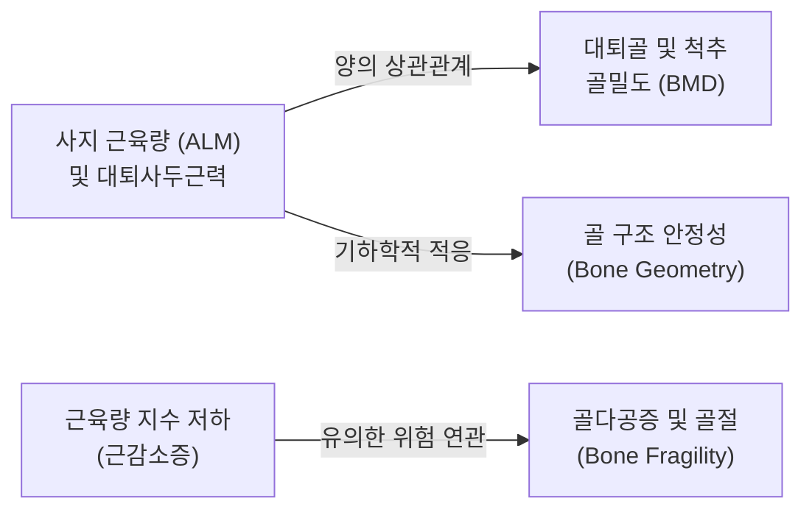
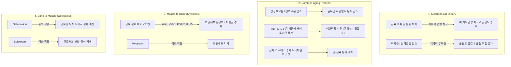
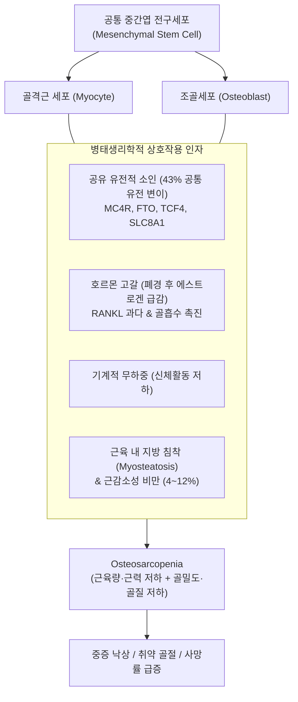
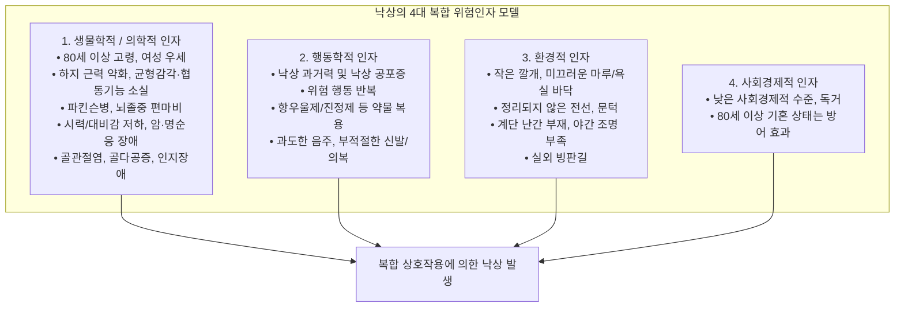
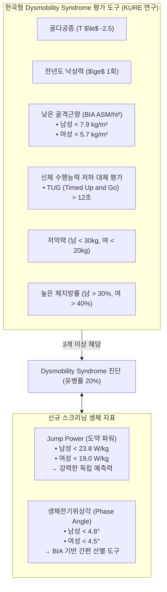

# 📑 [근감소증] PART 5. 근육과 뼈 (Muscle and Bone)

> **핵심 요약 (Key Summary)**
> - 근육과 뼈는 단순한 해부학적 인접 기관을 넘어 기계적 자극(Mechanostat), 공통 노화 경로, 분비 물질(마이오카인 및 오스테오카인)을 통해 밀접하게 소통하는 기능적 통합 단위이다.
> - **[[골다공증]](Osteoporosis)** 과 **[[근감소증]](Sarcopenia)** 이 동반되는 **[[골근감소증]](Osteosarcopenia)** 은 독립적인 두 질환의 단순 합을 넘어 골절, 기능 장애, 중환자실 1년 사망률(보정 후 9.4배)을 폭발적으로 증가시키는 복합 노인성 근골격계 증후군이다.
> - **[[낙상]](Fall)** 은 생물학적·행동학적·환경적·사회경제적 요인의 다인자적 결과이며, 하지 근력 약화와 균형 장애는 낙상 위험을 2.5~3배 증가시키는 핵심 교정 가능 요인이다.
> - **[[운동장애 증후군]](Dysmobility Syndrome)** 은 골밀도 단독 평가(및 FRAX)의 한계를 극복하기 위해 제안된 개념으로, [[골다공증]], 낙상력, 저근육량, 느린 보행, 저악력, 고지방량(체지방률) 중 3가지 이상 만족 시 진단되며 심혈관 대사증후군처럼 근골격계 불량 결과를 종합 예측한다.

---

## 📌 목차
1. [Chapter 20. 근육과 뼈의 상호 작용](#chapter-20-근육과-뼈의-상호-작용)
   - [1.1 서론](#11-서론)
   - [1.2 임상 연구들에서의 근육과 뼈의 관련성](#12-임상-연구들에서의-근육과-뼈의-관련성)
   - [1.3 근육과 뼈의 상호작용 기전](#13-근육과-뼈의-상호작용-기전)
   - [1.4 결론 및 임상적 의의](#14-결론-및-임상적-의의)
   - [Ch20 참고문헌](#ch20-참고문헌)
2. [Chapter 21. 근감소증과 골다공증 (Osteosarcopenia)](#chapter-21-근감소증과-골다공증-osteosarcopenia)
   - [2.1 서론 및 개념의 등장](#21-서론-및-개념의-등장)
   - [2.2 Osteosarcopenia의 병태생리학](#22-osteosarcopenia의-병태생리학)
   - [2.3 근육과 뼈의 생화학적 상호작용 분자 (마이오카인 vs 오스테오카인)](#23-근육과-뼈의-생화학적-상호작용-분자-마이오카인-vs-오스테오카인)
   - [2.4 Osteosarcopenia의 역학, 유병률 및 예후](#24-osteosarcopenia의-역학-유병률-및-예후)
   - [2.5 결론](#25-결론)
   - [Ch21 참고문헌](#ch21-참고문헌)
3. [Chapter 22. 근감소증과 낙상 (Sarcopenia and Fall)](#chapter-22-근감소증과-낙상-sarcopenia-and-fall)
   - [3.1 낙상의 정의와 역학적 빈도](#31-낙상의-정의와-역학적-빈도)
   - [3.2 낙상의 4대 위험인자 분류 모델](#32-낙상의-4대-위험인자-분류-모델)
   - [3.3 낙상의 선별검사 및 주기적 평가 체계](#33-낙상의-선별검사-및-주기적-평가-체계)
   - [3.4 근감소증과 낙상의 연관성에 관한 주요 연구 증거](#34-근감소증과-낙상의-연관성에-관한-주요-연구-증거)
   - [3.5 결론 및 중재 전략](#35-결론-및-중재-전략)
   - [Ch22 참고문헌](#ch22-참고문헌)
4. [Chapter 23. 운동장애 증후군 (Dysmobility Syndrome)](#chapter-23-운동장애-증후군-dysmobility-syndrome)
   - [4.1 Dysmobility Syndrome의 등장 배경 (FRAX의 한계)](#41-dysmobility-syndrome의-등장-배경-frax의-한계)
   - [4.2 Binkley의 Dysmobility Syndrome 조작적 정의 및 진단 점수 체계](#42-binkley의-dysmobility-syndrome-조작적-정의-및-진단-점수-체계)
   - [4.3 미국 NHANES 대규모 코호트 연구 결과](#43-미국-nhanes-대규모-코호트-연구-결과)
   - [4.4 국내 전향적 코호트 연구 (KURE study) 및 신규 생체지표](#44-국내-전향적-코호트-연구-kure-study-및-신규-생체지표)
   - [4.5 결론](#45-결론)
   - [Ch23 참고문헌](#ch23-참고문헌)

---

## Chapter 20. 근육과 뼈의 상호 작용
- **저자**: 이영균 (서울의대)
- **원제**: Interaction Between Muscle and Bone (pp.311-316)

### 1.1 서론
- **신체 골격과 운동성**: 근육과 뼈는 인체의 골격을 형성하고 운동성을 구현하는 필수 기관이다.
- **노화에 따른 양적·질적 저하**: 노화 과정에서 근육과 뼈는 단순한 양적 감소뿐 아니라 질적 저하(근육 강도 감소, 골질 저하)가 동반되어 [[근감소증]]과 [[골다공증]]으로 귀결된다.
- **다발적 건강 위해**:
  - 근육의 손실: 움직임 저하, [[낙상]] 및 골절 위험 증가, 전신 에너지 대사 장애, 심뇌혈관 질환 발생 및 사망률 증가 초래.
  - 뼈의 손실: 골밀도(BMD) 및 골질(bone quality) 감소로 인한 골강도(bone strength) 저하, 취약성 골절 발생.
- 해부학적으로 인접해 있을 뿐 아니라 분자생물학적 크로스토크(cross-talk)가 확인되면서 두 기관의 연관성에 대한 연구가 가속화되고 있다.

---

### 1.2 임상 연구들에서의 근육과 뼈의 관련성
단면 연구(Cross-sectional study)들을 통해 뼈와 근육의 밀접한 상관성이 광범위하게 입증되었다.

1. **고관절 골절 환자 대상 연구 (Di Monaco 등, 313명)**
   - 폐경 후 여성을 대상으로 분석한 결과, 키의 제곱으로 보정한 사지 근육량 지수($\text{ALM}/\text{height}^2$)는 [[대퇴골]] 골밀도와 유의한 양의 상관성을 보임.
   - 근육량 지수로 정의한 [[근감소증]] 유무는 골다공증의 존재와 유의한 상관성을 나타냄.
2. **일본 대규모 코호트 연구 (Miyakoshi 등, 2,400여 명)**
   - 40~88세 폐경 전후 여성을 대상으로 조사한 결과, 골감소증 및 [[골다공증]] 환자군에서 근감소증의 동반 비율이 전 연령대에 걸쳐 유의하게 높음.
3. **남성 코호트 연구 (Verschueren 등, 679명)**
   - 40~79세 남성에서 근육량은 대퇴부 골밀도 및 요추 골밀도와 유의한 양의 상관성을 보임.
   - [[대퇴사두근]] 근력(quadriceps strength)은 대퇴부 및 척추 골밀도 모두와 유의한 양의 상관관계를 나타냄.
   - 반면 악력(Grip strength)은 대퇴부 골밀도와만 유의한 상관성을 보임.
4. **국내 국민건강영양조사(KNHANES IV) 분석**
   - 사지 골격근량은 골밀도뿐만 아니라 골질의 주요 결정 인자인 골의 기하학적 구조(bone geometry) 및 대퇴경부 강도와 유의한 상관성을 보임(특히 고령 여성).
   - 단, 현재까지 장기 추적 종적 연구(longitudinal study)는 여전히 부족한 실정임.

---

### 1.3 근육과 뼈의 상호작용 기전

근육과 뼈의 상호작용은 크게 4가지 축으로 설명된다.

#### (1) 기계적 적응설 (Mechanostat Theory)
- Frost(1987)가 제안한 이론으로, 골격근의 수축이 뼈에 가하는 물리적 부하(mechanical loading)가 뼈의 조골 반응을 촉발하여 골밀도와 구조적 강도를 증가시킴.
- 반대로 노화, 침상 안정, 무중력 상태 등 근육 사용이 감소하는 비하중(disuse/unloading) 상태에서는 뼈 리모델링 신호가 소실되어 급격한 골 손실이 발생함.

#### (2) 공통 노화 과정 (Common Aging Process)
- **동화 호르몬의 동시 결핍**: [[성장호르몬]](GH/[[IGF-1]] 축)과 성호르몬([[에스트로겐]], [[테스토스테론]])은 뼈와 근육 양측의 동화작용을 자극함. 노화에 따른 이들 호르몬의 감소는 근육량과 골밀도의 동시 감소를 초래.
- **만성 전신 염증(Inflammaging)**: TNF-$\alpha$, [[IL-6]] 등 전염증성 사이토카인의 증가와 활성산소종([[ROS]])에 의한 산화 스트레스 축적은 근단백질 분해와 파골세포 활성화를 동시에 촉진.
- **[[비타민 D]](Vitamin D) 결핍**: [[칼슘]] 흡수 저하뿐 아니라 근세포 내 VDR([[비타민 D]] 수용체) 신호 전달을 약화시켜 근력 약화와 골연화/골다공증을 동반 유발.

#### (3) 마이오카인을 통한 뼈 조절 (Muscle to Bone)
- 골격근은 단순한 수축 기관이 아니라 다양한 호르몬성 펩타이드를 분비하는 중요 내분비 기관임.
- **세포 실험 증거**: 근육세포주(C2C12) 배양액을 골세포(MLO-Y4)에 처리했을 때 글루코코르티코이드 유도 골세포 사멸에 대한 뚜렷한 보호 효과($\beta$-catenin 활성화 매개)가 관찰됨.
- **[[Irisin]](아이리신)**: 운동 시 근육에서 분비되는 대표적 마이오카인. 피질골 질량 증가 및 골소실 억제 효과가 확인되었으며, 골절 환자에서 혈중 농도가 유의하게 감소해 있음.
- **기타 마이오카인**: [[IGF-1]], FGF-2, IL-15 등은 조골세포 증식 및 분화를 촉진함.

#### (4) 오스테오카인을 통한 근육 조절 (Bone to Muscle)
- 뼈 역시 오스테오카인(Osteokines)을 분비하여 근육 대사를 능동적으로 조절함.
- **Osteocalcin(오스테오칼신)**: 조골세포에서 분비되며, 결핍 동물 모델에서 근육량 감소 및 운동 적응력 저하가 확인되었고, 외인성 주입 시 근위축이 회복됨.
- **Sclerostin(스클레로스틴)**: 골세포에서 분비되며 Wnt 신호를 억제하여 조골세포 기능 저하뿐 아니라 근모세포(myoblast)의 증식과 분화를 억제함.

---

### 1.4 결론 및 임상적 의의
- 유전체 연구에서 근육 특이 유전자의 변이가 골량 변화 및 골절 위험과 직접 연관되어 있음이 확인됨.
- 근육과 뼈는 역학적(Mechanostat), 내분비적(Myokines $\leftrightarrow$ Osteokines), 대사적(Aging/Inflammation)으로 긴밀히 얽혀 있으므로, 두 조직을 통합적으로 치료할 수 있는 복합 중재 표적 개발이 요구됨.

---

### Ch20 참고문헌
1. Battaglino RA, et al. Spinal cord injury-induced osteoporosis: pathogenesis and emerging therapies. *Curr Osteoporos Rep*. 2012;10(4):278-85.
2. Baumgartner RN, et al. Predictors of skeletal muscle mass in elderly men and women. *Mech Ageing Dev*. 1999;107(2):123-36.
3. Bouxsein ML. Determinants of skeletal fragility. *Best Pract Res Clin Rheumatol*. 2005;19(6):897-911.
4. Bruunsgaard H, et al. Circulating levels of TNF-alpha and IL-6-relation to truncal fat mass and muscle mass in healthy elderly individuals and in patients with type-2 diabetes. *Mech Ageing Dev*. 2003;124(4):495-502.
5. Cederholm T, et al. Sarcopenia and fragility fractures. *Eur J Phys Rehabil Med*. 2013;49(1):111-7.
6. Colaianni G, et al. The myokine irisin increases cortical bone mass. *Proc Natl Acad Sci USA*. 2015;112(39):12157-62.
7. Colaianni G, et al. Irisin prevents and restores bone loss and muscle atrophy in hind-limb suspended mice. *Sci Rep*. 2017;7(1):2811.
8. Di Monaco M, et al. Prevalence of sarcopenia and its association with osteoporosis in 313 older women following a hip fracture. *Arch Gerontol Geriatr*. 2011;52(1):71-4.
9. Doherty TJ. Aging and sarcopenia. *J Appl Physiol*. 2003;95(4):1717-27.
10. Ellman R, et al. Partial reductions in mechanical loading yield proportional changes in bone density, bone architecture, and muscle mass. *J Bone Miner Res*. 2013;28(4):875-85.
11. Frost HM. Bone "mass" and the "mechanostat": a proposal. *Anat Rec*. 1987;219(1):1-9.
12. Fulle S, et al. The contribution of reactive oxygen species to sarcopenia and muscle ageing. *Exp Gerontol*. 2004;39(1):17-24.
13. Hamrick MW, et al. Role of muscle-derived growth factors in bone formation. *J Musculoskelet Neuronal Interact*. 2010;10(1):64-70.
14. Harslof T, et al. Polymorphisms of muscle genes are associated with bone mass and incident osteoporotic fractures in Caucasians. *Calcif Tissue Int*. 2013;92(5):467-76.
15. Isidori AM, et al. Effects of testosterone on body composition, bone metabolism and serum lipid profile in middle-aged men: a meta-analysis. *Clin Endocrinol (Oxf)*. 2005;63(3):280-93.
16. Jahn K, et al. Skeletal muscle secreted factors prevent glucocorticoid-induced osteocyte apoptosis through activation of beta-catenin. *Eur Cell Mater*. 2012;24:197-209.
17. Jiang Y, et al. Aged-Related Changes in Body Composition and Association between Body Composition with Bone Mass Density by Body Mass Index in Chinese Han Men over 50-year-old. *PLoS One*. 2015;10(6):e0130400.
18. Kaji H. Interaction between Muscle and Bone. *J Bone Metab*. 2014;21(1):29-40.
19. Kim BJ, et al. Low skeletal muscle mass associates with low femoral neck strength, especially in older Korean women: the Fourth Korea National Health and Nutrition Examination Survey (KNHANES IV). *Osteoporos Int*. 2015;26(2):737-47.
20. Kim KM, et al. Favorable effects of skeletal muscle on bone are distinguished according to gender and skeletal sites. *Osteoporosis and Sarcopenia*. 2017;3(1):32-6.
21. Lee J, et al. Age-Related Changes in the Prevalence of Osteoporosis according to Gender and Skeletal Site: The Korea National Health and Nutrition Examination Survey 2008-2010. *Endocrinol Metab (Seoul)*. 2013;28(3):180-91.
22. Mera P, et al. Osteocalcin Signaling in Myofibers Is Necessary and Sufficient for Optimum Adaptation to Exercise. *Cell Metab*. 2016;23(6):1078-92.
23. Mera P, et al. Osteocalcin is necessary and sufficient to maintain muscle mass in older mice. *Mol Metab*. 2016;5(10):1042-7.
24. Miljkovic I, et al. Greater Skeletal Muscle Fat Infiltration Is Associated With Higher All-Cause and Cardiovascular Mortality in Older Men. *J Gerontol A Biol Sci Med Sci*. 2015.
25. Miyakoshi N, et al. Prevalence of sarcopenia in Japanese women with osteopenia and osteoporosis. *J Bone Miner Metab*. 2013;31(5):556-61.
26. Mo C, et al. Prostaglandin E2: from clinical applications to its potential role in bone-muscle crosstalk and myogenic differentiation. *Recent Pat Biotechnol*. 2012;6(3):223-9.
27. Ng AC, et al. Relationship of adiposity to bone volumetric density and microstructure in men and women across the adult lifespan. *Bone*. 2013;55(1):119-25.
28. Palermo A, et al. Irisin is associated with osteoporotic fractures independently of bone mineral density, body composition or daily physical activity. *Clin Endocrinol (Oxf)*. 2015;82(4):615-9.
29. Seeman E. Pathogenesis of osteoporosis. *J Appl Physiol*. 2003;95(5):2142-51.
30. Verschueren S, et al. Sarcopenia and its relationship with bone mineral density in middle-aged and elderly European men. *Osteoporos Int*. 2013;24(1):87-98.
31. Wu CH, et al. Sarcopenia is related to increased risk for low bone mineral density. *J Clin Densitom*. 2013;16(1):98-103.
32. Yan J, et al. Low serum concentrations of Irisin are associated with increased risk of hip fracture in Chinese older women. *Joint Bone Spine*. 2017.

---

## Chapter 21. 근감소증과 골다공증 (Osteosarcopenia)
- **저자**: 김기범 (영남의대)
- **원제**: Osteosarcopenia (pp.317-325)

### 2.1 서론 및 개념의 등장
- **초고령사회 진입**: 한국은 2017년 65세 이상 인구 14%(고령사회), 2026년 20.8%(초고령사회)로 진입할 것으로 전망되어 의료비 및 사회경제적 부담이 급증함.
- **[[골근감소증]](Osteosarcopenia) 개념의 태동**:
  - 2009년 Binkley & Buehring이 골다공증에 [[근감소증]] 개념을 통합한 `sarco-osteopenia` 용어를 처음 제안.
  - 근육과 뼈가 동시에 손실되는 역치에 도달해 근력·기능 저하와 골량 감소가 동반되는 병태를 **Osteosarcopenia**로 명명하고 노인의학(Geroscience)의 독립적 핵심 분야로 정립.
  - 두 질환의 복합 이환은 골절 위험, 독립성 상실, 사망률을 단독 질환에 비해 상승적으로 악화시킴.

---

### 2.2 Osteosarcopenia의 병태생리학

#### (1) 유전적 유사성 (Shared Genetics)
- 근육과 뼈는 배아 발생 과정에서 동일한 **중간엽 전구체(mesenchymal precursor)**에서 기원함.
- **유전 가능도(Heritability)**:
  - DXA 측정 [[제지방량]](Lean Body Mass): 약 56~84%.
  - 폐경 후 여성의 근력: 약 30~50%.
  - [[대퇴골]] 경부 골강도: 약 40~50%.
- **공유 유전 성분**: 10,414명의 소아 대상 메타분석 결과, 제지방량과 골밀도 간의 공유 유전 성분은 43%, SNP 기반 유전 가능도는 39%로 추정됨.
- 관련 주요 유전자: `MC4R`, `FTO`, `MGMT`, `TCF4`, `TMEM18`, `LINC01104`, `PEX14`, `SLC8A1`, `TGFA` 등.

#### (2) 물리적 요인 (Mechanical Factors)
- 뼈와 근육은 하중 상태(중력 및 기계적 장력)와 비하중 상태(침상 안정)에 실시간으로 적응함.
- 한국인 4년 추적 연구: 근감소증은 향후 [[골다공증]] 발생을 유의하게 예측하였으며, 골다공증 역시 근감소증의 위험을 상승시키는 양방향 예측 인자로 작용함.

#### (3) 대사성 요인 및 호르몬 변화
- **연령별 감퇴 속도**:
  - 근력은 40대 초반 최고조에 달한 후 점진적 감소.
  - **50세 이후**: 근육량은 매년 **1~2%씩 감소**, 근력은 **1.5~3%씩 감소**.
- **폐경의 치명적 충격**:
  - [[난소]] 기능 감퇴로 인한 [[에스트로겐]] 급감으로 **추가 10~15%의 근력 감소** 발생.
  - 골대사 항상성 붕괴: 조골세포-파골세포 균형 붕괴, RANKL 과발현으로 급격한 골흡수 유도.
  - 폐경 초기 골 손실 속도: **척추 연 -2%**, **[[대퇴골]] 연 -1%**.
  - 60세 이상 여성은 매년 골절 위험이 **약 6%씩 상승**.
  - 호르몬 대체 요법(HRT) 시 척추 골절 위험 34%, 비척추 골절 위험 13% 감소 확인.

#### (4) 체중과 체성분의 구성 (Body Composition & Sarcopenic Obesity)
- 체중 증가는 중력 부하로 골밀도에 긍정적일 수 있으나, 노화에 따른 체질량 증가는 대부분 체지방 증가(근육량 상대적 감소)로 이어짐.
- **[[근감소성 비만]](Sarcopenic Obesity)**: 유병률 약 **4~12%**. 근육 내 지방 침윤(Myosteatosis)과 전신 만성 염증으로 이동성을 현저히 제한하며, 비만한 노인에서 낙상 및 골절 위험이 오히려 역설적으로 증가함.

---

### 2.3 근육과 뼈의 생화학적 상호작용 분자 (마이오카인 vs 오스테오카인)

원문 [표 21-1]에 기반한 근육-뼈 간 주요 신호전달 분자의 작용 기전 정리:

| 분비 조직 | 인자 (Factor) | 골/근육에 대한 주 작용 | 상세 기전 및 생물학적 효과 |
| :--- | :--- | :---: | :--- |
| **근육 분비** (Myokines) | **미오스타틴 (Myostatin)** | **이화 작용 (Catabolic)** | 조골세포(osteoblast) 기능 억제 및 골형성 저해; 억제 시 근육량 및 골강도 동반 증가 |
| | **[[IGF-1]]** | **동화 작용 (Anabolic)** | 조골세포 증식 및 분화 촉진, 골 리모델링 활성화 |
| | **FGF-2** | **동화 작용 (Anabolic)** | 조골세포 증식 및 골형성 촉진 |
| | **[[IL-6]]** | **이화 작용 (Catabolic)** | 조골세포 분화 억제 및 파골세포(osteoclast) 활성화 촉진 |
| | **IL-15** | **동화 작용 (Anabolic)** | 근단백 동화 및 체지방 감소 유도, 골형성 보조 |
| | **아이리신 (Irisin)** | **동화 작용 (Anabolic)** | RANKL 억제를 통한 파골세포 형성 저해; 피질골·소주골 밀도 증가; 백색지방의 갈색화 유도 |
| | **오스테오넥틴 (Osteonectin)** | **동화 작용 (Anabolic)** | 골 기질 광물화 촉진 및 골형성 동화작용 |
| | **오스테오글라이신 (Osteoglycin)** | **동화 작용 (Anabolic)** | 에너지 항상성 반응 및 골형성 조절 |
| **뼈 분비** (Osteokines) | **오스테오칼신 (Osteocalcin)** | **동화 작용 (Anabolic)** | 조골세포 유래; 근섬유 동화 촉진, 하지 근력 유지, 췌장 $\beta$세포 증식 및 [[인슐린]] 분비 촉진 |
| | **스클레로스틴 (Sclerostin)** | **이화 작용 (Catabolic)** | 골세포 유래 당단백질; Wnt 신호 차단, 근모세포(myoblast) 증식 및 분화 억제 |

---

### 2.4 Osteosarcopenia의 역학, 유병률 및 예후
진단 기준(골다공증은 WHO T-score $\le -2.5$로 확립되었으나, 근감소증은 EWGSOP vs AWGS 등 연구마다 상이)에 따라 보고된 유병률에 차이가 존재함.

1. **지역사회 65세 이상 여성 코호트 (126명, EWGSOP 적용)**:
   - [[근감소증]] 20.6% (26명), [[골다공증]] 27.0% (34명), **Osteosarcopenia 9.5% (12명)**.
2. **지역사회 60세 이상 코호트 (1,099명, AWGS 적용)**:
   - 근감소증 8.2% (남 8.5%, 여 8.0%), **Osteosarcopenia 4.3%**.
3. **병원 내원 노인 환자 코호트 (평균 79세, 680명)**:
   - **Osteosarcopenia 38.0% (258명)**, 골감소증 27.0%, 근감소증 12.8%.
   - 특징: 초고령, 여성 우세, 우울증, 영양불량, $\text{BMI} < 25\ \text{kg/m}^2$, 다발성 만성질환, 낮은 신체활동.
4. **중환자실(ICU) 입원 65세 이상 환자 코호트 (450명)**:
   - **Osteosarcopenia 16.4% (74명)**, 근감소증 37.1%, 골감소증 10.7%.
   - **1년 사망률 예후**: 골다공증 및 근감소증이 모두 없는 환자 대비 Osteosarcopenia 환자의 사망 위험은 **보정 전 26.7배**, 연령·중증도 등을 **보정한 후에도 9.4배**에 달함.

---

### 2.5 결론
- Osteosarcopenia는 두 질환의 단순 병발이 아닌, 상호 악순환을 유발하는 고위험 노인성 복합 증후군임.
- 초고령화 사회에서 막대한 의료비용과 사회경제적 부담을 유발하므로 근육과 뼈를 동시에 평가하고 조기에 통합 치료하는 노인의학적 접근이 필수적임.

---

### Ch21 참고문헌
1. Balogun S, et al. Prospective associations of osteosarcopenia and osteodynapenia with incident fracture and mortality over 10 years in community-dwelling older adults. *Arch Gerontol Geriatr*. 2019;82:67.
2. Bettis T, et al. Impact of muscle atrophy on bone metabolism and bone strength: implications for muscle-bone crosstalk with aging and disuse. *Osteoporos Int*. 2018;29:1713.
3. Binkley N, Buehring B. Beyond FRAX: It's time to consider "sarco-osteopenia". *J Clin Densitom*. 2009;12(4):413.
4. Brotto M, Bonewald L. Bone and muscle: Interactions beyond mechanical. *Bone*. 2015;80:109.
5. Chen L-K, et al. Asian Working Group for Sarcopenia: 2019 consensus update on sarcopenia diagnosis and treatment. *JAMDA*. 2020;21(3):300.
6. Cruz-Jentoft AJ, et al. Sarcopenia: revised European consensus on definition and diagnosis (EWGSOP2). *Age Ageing*. 2019;48(1):16.
7. Drey M, et al. Osteosarcopenia is more than sarcopenia and osteopenia alone. *Aging Clin Exp Res*. 2016;28:895.
8. Hirschfeld H, et al. Osteosarcopenia: where bone, muscle, and fat collide. *Osteoporos Int*. 2017;28:2781.
9. Hong AR, Kim SW. Effects of resistance exercise on bone health. *Endocrinol Metab*. 2018;33(4):435.
10. Howe TE, et al. Exercise for preventing and treating osteoporosis in postmenopausal women. *Cochrane Database Syst Rev*. 2011;(7).
11. Huo YR, et al. Phenotype of osteosarcopenia in older individuals with a history of falling. *JAMDA*. 2015;16(4):290.
12. Kim H, et al. Irisin mediates effects on bone and fat via aV integrin receptors. *Cell*. 2018;175(7):1756.
13. Kirk B, et al. Osteosarcopenia: a case of geroscience. *Aging Med*. 2019;2(3):147.
14. Mera P, et al. Osteocalcin is necessary and sufficient to maintain muscle mass in older mice. *Mol Metab*. 2016;5(10):1042.
15. Morris JA, et al. An atlas of genetic influences on osteoporosis in humans and mice. *Nat Genet*. 2019;51(2):258.
16. Nielsen BR, et al. Sarcopenia and osteoporosis in older people: a systematic review and meta-analysis. *Eur Geriatr Med*. 2018;9:419.
17. Poggiogalle E, et al. Body composition, IGF1 status, and physical functionality in nonagenarians: implications for osteosarcopenia. *JAMDA*. 2019;20(1):70.
18. Quinn LS, et al. Oversecretion of interleukin-15 from skeletal muscle reduces adiposity. *Am J Physiol Endocrinol Metab*. 2009;296(1):E191.
19. Trajanoska K, Rivadeneira F. Genetics of Osteosarcopenia. In: *Osteosarcopenia Bone, Muscle Fat Interact*. Springer; 2019.
20. Yoshimura N, et al. Is osteoporosis a predictor for future sarcopenia or vice versa? Four-year observations between the second and third ROAD study surveys. *Osteoporos Int*. 2017;28:189.
21. Zanker J, Duque G. Osteosarcopenia: the path beyond controversy. *Curr Osteoporos Rep*. 2020;18:81.
22. Zhao R, et al. The effects of differing resistance training modes on the preservation of bone mineral density in postmenopausal women: a meta-analysis. *Osteoporos Int*. 2015;26:1605.

---

## Chapter 22. 근감소증과 낙상 (Sarcopenia and Fall)
- **저자**: 김동환 (경희의대)
- **원제**: Sarcopenia and Fall (pp.326-330)

### 3.1 낙상의 정의와 역학적 빈도
- **WHO 공식 정의**: "가구, 벽, 또는 다른 대상에 기대기 위해 의도적으로 자세를 변경하는 경우를 제외하고, 바닥 혹은 원래 있던 위치보다 낮은 위치로 본인의 의사와 무관하게 넘어지는 것."
- **노인 낙상의 역학적 빈도**:
  - 미국: 지역사회 거주 노인의 약 30%가 매년 낙상 경험, 연령 증가 시 최대 40%에 육박.
  - 한국(2004년 조사): 65세 이상 노인에서 지난 1년간 **낙상 경험률 42%**, 이 중 병원 방문 및 입원율 **38%**.
  - 한국(2010년 인구비례 표본 조사): 지난 1년간 낙상 13%, 지난 3년간 낙상 경험률 24.1%.
- 낙상은 단순 타박상을 넘어 활동성 상실, 의존성 증대, 공포로 인한 침상 생활, 조기 사망을 유발함.

---

### 3.2 낙상의 4대 위험인자 분류 모델

과거 내인성/외인성 구분을 넘어 현대 노인의학에서 널리 활용되는 4대 범주 분류 체계:

---

### 3.3 낙상의 선별검사 및 주기적 평가 체계
- **선별 목적**: 낙상 및 잠재적 위험 요인을 조기에 스크리닝하여 예방적 중재를 적용함.
- **고위험군 관리 기준**:
  - 기존 **낙상 과거력**이 있거나,
  - **낙상 선별검사에서 양성 소견**을 보인 노인.
- **주기적 재평가**: 고위험군으로 확인된 경우 **최소 6개월 간격**으로 주기적인 낙상 재평가를 필수 시행해야 함.

---

### 3.4 근감소증과 낙상의 연관성에 관한 주요 연구 증거

1. **멕시코 후향적 코호트 연구**:
   - 예측 공식 사지근육량을 키의 제곱으로 보정한 기준($\text{남} \le 7.26$, $\text{여} \le 5.45\ \text{kg/m}^2$) 적용.
   - 지난 1년 내 낙상 경험: 남성 22%, 여성 31%.
   - 연령, 인종, [[비만]], 동반 질환, 음주 보정 후에도 **[[근감소증]] 남성에서 낙상 위험 약 2.5배 증가**.
2. **MINOS 코호트 연구 (프랑스 지역사회 남성)**:
   - 연간 25.4%에서 낙상 발생.
   - 연령, [[비타민 D]], 만성질환 보정 후, 사지 골격근량 지수(RASM)가 **1 표준편차(SD) 감소할 때마다 낙상 위험도 1.3배씩 유의하게 증가**.
   - 75세 이상 여성 8년 추적 연구에서도 균형감각 저하 및 이동능력 저하가 사망률의 독립적 예측 인자로 확인됨.
3. **ilSIRENTE 연구 (이탈리아 80세 이상 초고령 노인)**:
   - 2년간 전향적 추적 관찰 결과, 다변량 인자를 보정한 후에도 **근감소증 노인에서 낙상 위험 약 3배 증가**.
4. **전신 관찰 연구 및 메타분석**:
   - 하체 근력(lower extremity muscle strength) 저하와 보행속도 감퇴는 낙상 발생 및 사망률 증가의 가장 일관된 핵심 인자임.
   - 지역사회 거주 노인뿐 아니라 요양시설 입소 노인에서 연관성이 더욱 강력하게 나타남.

---

### 3.5 결론 및 중재 전략
- 미국 질병통제예방센터(CDC/STEADI 가이드라인): 낙상 예방을 위한 가역적(중재 가능) 인자로 시력 교정, 균형감각 훈련, **하체 위약감(lower body weakness) 개선**, 기립성 [[저혈압]] 관리를 권고.
- 규칙적인 저항성 근력 운동, 영양 중재(단백질 및 [[비타민 D]] 보충), 주거 환경 개선을 통해 근육 기능을 보존하는 것이 낙상 및 골절 예방의 핵심 전략임.

---

### Ch22 참고문헌
1. 김광일, 외. 낙상예방 진료지침. *대한내과학회지*. 2015;89(6).
2. 김동희, 김미정. 노인의 낙상과 골절. In: 박시복 외. *노인재활의학 2판*. 군자출판사; 2022. p.313-327.
3. 임재영, 외. 한국 노인의 낙상 실태와 위험요인: 일부 지역의 인구비례 할당 표본 조사. *J Korean Geriatr Soc*. 2010;14(1).
4. Baumgartner RN, et al. Epidemiology of sarcopenia among the elderly in New Mexico. *Am J Epidemiol*. 1998;147(8):755-63.
5. Blain H, et al. Balance and walking speed predict subsequent 8-year mortality independently of current and intermediate events in well-functioning women aged 75 years and older. *J Nutr Health Aging*. 2010;14(7):595-600.
6. Centers for Disease Control and Prevention (CDC). STEADI: Algorithm for Fall Risk Screening, Assessment, and Intervention.
7. Chen LK, et al. Sarcopenia in Asia: consensus report of the Asian Working Group for Sarcopenia. *JAMDA*. 2014;15(2):95-101.
8. Fielding RA, et al. Sarcopenia: an undiagnosed condition in older adults. Current consensus definition: prevalence, etiology, and consequences. *JAMDA*. 2011;12(4):249-56.
9. Panel on Falls Prevention. Guideline for the prevention of falls in older persons. *J Am Geriatr Soc*. 2001;49(5):664-72.
10. Landi F, et al. Sarcopenia as a risk factor for falls in elderly individuals: results from the ilSIRENTE study. *Clin Nutr*. 2012;31(5):652-8.
11. McLean RR, Kiel DP. Developing consensus criteria for sarcopenia: an update. *J Bone Miner Res*. 2015;30(4):588-92.
12. Moreland JD, et al. Muscle weakness and falls in older adults: a systematic review and meta-analysis. *J Am Geriatr Soc*. 2004;52(7):1121-9.
13. Morley JE, et al. Nutritional recommendations for the management of sarcopenia. *JAMDA*. 2010;11(6):391-6.
14. Onder G, et al. Vitamin D receptor polymorphisms and falls among older adults living in the community: results from the ilSIRENTE study. *J Bone Miner Res*. 2008;23(7):1031-6.
15. Rossat A, et al. Risk factors for falling in community-dwelling older adults: which of them are associated with the recurrence of falls? *J Nutr Health Aging*. 2010;14(9):787-91.
16. Sohng KY, et al. Risk factors for falls among the community-dwelling elderly in Korea. *Taehan Kanho Hakhoe Chi*. 2004;34(8):1483-90.
17. Szulc P, et al. Low skeletal muscle mass is associated with poor structural parameters of bone and impaired balance in elderly men--the MINOS study. *J Bone Miner Res*. 2005;20(5):721-9.
18. Tinetti ME, Williams CS. The effect of falls and fall injuries on functioning in community-dwelling older persons. *J Gerontol A Biol Sci Med Sci*. 1998;53(2):M112-9.
19. Tinetti ME, Speechley M, Ginter SF. Risk factors for falls among elderly persons living in the community. *N Engl J Med*. 1988;319(26):1701-7.
20. Visser M, Schaap LA. Consequences of sarcopenia. *Clin Geriatr Med*. 2011;27(3):387-99.

---

## Chapter 23. 운동장애 증후군 (Dysmobility Syndrome)
- **저자**: 김태영 (건국의대)
- **원제**: Dysmobility Syndrome (pp.331-338)

### 4.1 Dysmobility Syndrome의 등장 배경 (FRAX의 한계)
- **개념**: [[근감소증]](sarcopenia), [[비만]](obesity), 이동장애(mobility impairment)가 복합되어 낙상과 골절 등 불량한 근골격계 사건 위험이 누적되는 증후군.
- **심혈관 대사증후군(Metabolic syndrome)과의 유사성**: 혈압, [[혈당]], 지질, [[비만]] 등이 모여 심뇌혈관 질환을 유발하듯, 근골격계 노화의 다발성 요소들을 조합해 평가함.
- **골밀도(BMD) 및 FRAX의 한계**:
  - 연령 증가에 따라 골절 위험은 지수함수적으로 폭증하지만, 골밀도 감소 속도는 그에 미치지 못함.
  - FRAX 모델은 진일보한 도구이나 여전히 저위험군으로 분류된 노인에서도 골절이 빈발함.
  - 이는 노인 골절의 본질이 단순 골질량 감소뿐 아니라 **이동장애(impaired mobility/dysmobility)에 의한 낙상 유발**에 기인하기 때문임.

---

### 4.2 Binkley의 Dysmobility Syndrome 조작적 정의 및 진단 점수 체계

Binkley 등(2013)은 각 요소에 1점씩 부여하여 **총 6개 요소 중 3점 이상**일 때 **Dysmobility Syndrome**으로 정의함.

#### [표 23-1] Binkley 등에 의해 제시된 Dysmobility Syndrome 요소(Factor) 및 컷포인트(Cut point)

| 구성 요소 (Factor) | 권고 기준점 (Recommended Cut Point) | 임상적 의미 |
| :--- | :--- | :--- |
| **1. [[골다공증]] (Osteoporosis)** | 요추(lumbar spine), 대퇴골경부(femoral neck), 또는 대퇴골근위부 전체(total proximal femur)의 **T-score $\le -2.5$** | 골강도 및 골밀도 저하 |
| **2. 전년도 낙상 (Falls in preceding year)** | 지난 1년간 **1회 이상의 낙상 과거력** (자가 보고) | 재낙상 및 골절 고위험 |
| **3. 낮은 [[제지방량]] (Low lean mass)** | DXA 측정 사지 제지방량($\text{ALM}/\text{height}^2$): • **여성: $< 5.45\ \text{kg/m}^2$** • **남성: $< 7.26\ \text{kg/m}^2$** | 양적 [[근감소증]] 기준 충족 |
| **4. 느린 보행속도 (Slow gait speed)** | 편안한 일상 보행 속도 **$< 1.0\ \text{m/s}$** | 이동성 및 근기능 저하 |
| **5. 낮은 악력 (Low grip strength)** | 휴대용 악력계(Hand-held dynamometer) 측정치: • **남성: $< 30\ \text{kg}$** • **여성: $< 20\ \text{kg}$** | 전신 근력 위약 지표 |
| **6. [[비만]] / 높은 지방량 (Obesity / High fat mass)** | DXA 측정 총 체지방률(Total body % fat): • **남성: $> 30\%$** • **여성: $> 40\%$** | 근육 내 지방 침윤 및 근감소성 비만 |

- **임상적 특징**: Binkley 기준에 따라 진단된 군은 **30%에서 취약 골절 과거력**, **36%에서 지난 1년 내 낙상 과거력**을 보유함.

---

### 4.3 미국 NHANES 대규모 코호트 연구 결과
- **대상**: 미국 국민건강영양조사(NHANES, 1999~2002) 50세 이상 성인 데이터, 평균 9.9년 추적 관찰.
- **유병률**: 전체 대상자의 **22%**에서 Dysmobility Syndrome 진단.
  - 연령별: 50~69세(14%) vs **70세 이상(44%)** (초고령에서 급증).
  - 성별: 남성(18%) vs **여성(25%)**.
  - 인종별: 백인·흑인(21%) 대비 멕시코계 미국인(27%), 기타 인종(34%)에서 높음.
- **사망률 위험 비교**:
  - Dysmobility Syndrome 동반군 사망률: **45%** vs 비동반군 사망률: **15%** (3배 차이).
  - 연령별 상대 위험도: 70세 이상에서 1.4배 증가, 특히 **50~69세 인구에서는 사망 위험이 2.5배 증가**.
  - 구성 요소 개수가 증가할수록 사망 위험이 계단식으로 증가하여(50~69세는 3개 이상, 70세 이상은 4개 이상 시 유의), **3개 이상을 컷포인트로 삼는 진단 기준의 타당성이 확인됨**.

---

### 4.4 국내 전향적 코호트 연구 (KURE study) 및 신규 생체지표
Hong 등은 한국 도시-농촌 복합 지역사회 노인 코호트인 **Korean Urban Rural Elderly (KURE)** 65세 이상 1,369명을 대상으로 연구를 수행함.

1. **국내 역학 및 임상 특성**:
   - 유병률: 전체 20% (75세 이상으로 보정 시 32%로 상승하여 서구 34%와 유사).
   - 동반 위험: 영양실조, 전년도 입원율, [[빈혈]] 유병률, 인지장애, 우울 증상, 만성 통증, 신체활동 부족과 밀접한 연관.
2. **도약 파워 (Countermovement Jump Power)**:
   - 양발 점프 파워 측정치 기준: **남성 $< 23.8\ \text{W/kg}$**, **여성 $< 19.0\ \text{W/kg}$**.
   - 근력과 신체 폭발력을 대변하며, Dysmobility Syndrome과 매우 높은 연관성을 보여 향후 핵심 진단 요소로 채택될 가능성이 큼.
3. **위상각 (Phase Angle, PhA)**:
   - BIA 세포막 완전성 지표 기준: **남성 $< 4.8^\circ$**, **여성 $< 4.5^\circ$**.
   - 지역사회 노인에서 Dysmobility Syndrome을 신속하고 비침습적으로 선별할 수 있는 우수한 도구로 입증됨.

---

### 4.5 결론
- 골밀도(BMD) 단독 검사나 정적 지표만으로는 노인의 골절 및 낙상, 조기 사망 위험을 포착하기 어려움.
- 근육량, 근력, 보행능력, 골밀도, 지방 침착, 낙상 과거력을 포괄하는 Dysmobility Syndrome 접근법은 근골격계 건강 위험 노인을 다각도로 조기 선별하고 통합 중재 계획을 수립하는 데 필수적인 패러다임 전환을 제시함.

---

### Ch23 참고문헌
1. Binkley N, Krueger D, Buehring B. What's in a name revised: should osteoporosis and sarcopenia be considered components of "dysmobility syndrome"? *Osteoporos Int*. 2013;24:2955-9.
2. Hong N, Kim CO, Youm Y, Kim HC, Rhee Y. Low peak jump power is associated with elevated odds of dysmobility syndrome in community-dwelling elderly individuals: the Korean Urban Rural Elderly (KURE) study. *Osteoporos Int*. 2018;29:1427-36.
3. Hong N, Siglinsky E, Krueger D, White R, Kim CO, Kim HC, Yeom Y, Binkley N, Rhee Y, Buehring B. Defining an international cut-off of two-legged countermovement jump power for sarcopenia and dysmobility syndrome. *Osteoporos Int*. 2021;32(3):483-93.
4. Jung YW, Hong N, Kim CO, Kim HC, Youm Y, Choi JY, Rhee Y. The diagnostic value of phase angle, an integrative bioelectrical marker, for identifying individuals with dysmobility syndrome: the Korean Urban-Rural Elderly study. *Osteoporos Int*. 2021;32:939-49.
5. Looker AC. Dysmobility syndrome and mortality risk in US men and women age 50 years and older. *Osteoporos Int*. 2015;26:93-102.
