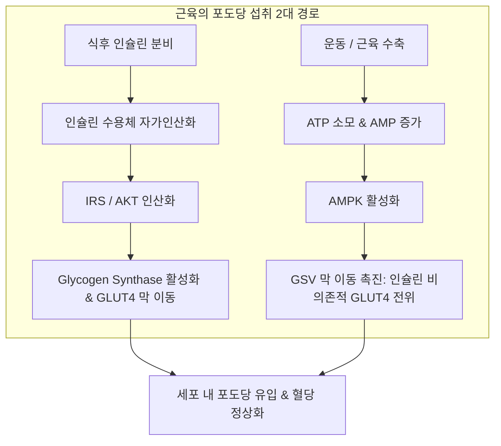
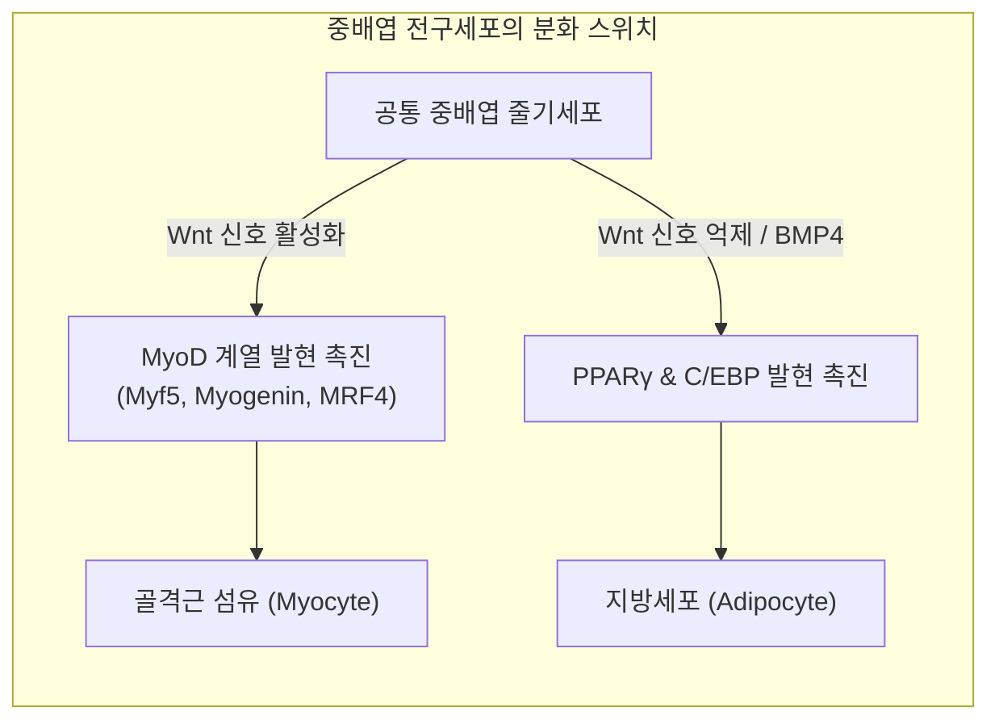
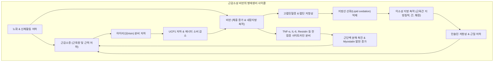

# 📑 [근감소증] PART 6-1 내분비·지방·비만 (Ch24~Ch26)

> **핵심 요약 (Key Summary)**
> - **내분비 기관으로서의 근육**: 골격근은 단순한 운동 기관을 넘어 자가분비(autocrine), 국소분비(paracrine), 내분비(endocrine) 방식으로 작용하는 [[마이오카인]](Myokine: [[IL-6]], [[Irisin]], [[FGF21]], [[Myostatin]], [[BDNF]])을 분비하여 전신 대사와 [[혈당]] 항상성을 능동적으로 조절한다.
> - **근육-지방의 발생 및 기능적 크로스토크**: 근육세포와 지방세포는 공통된 [[중배엽]](mesoderm)에서 기원하며, **[[Wnt 신호전달]]** 스위치에 의해 상호 억제적 분화 경로([[MyoD]] vs [[PPARγ]])를 밟는다. 분화 후에도 마이오카인과 [[아디포카인]](Adipokine) 간의 긴밀한 상호작용으로 체성분 균형을 유지한다.
> - **[[근감소성 비만]](Sarcopenic Obesity)**: 근육량 감소와 지방(특히 내장지방 및 근육 내 지방 침착) 증가가 복합된 상태로, 만성 저등급 염증, 인슐린 저항성, [[렙틴 저항성]]이 악순환을 형성하여 단독 질환 대비 신체기능 장애(OR 최대 4.12배), 대사증후군, 사망 위험을 극적으로 증가시킨다.
> - **진단 및 치료적 함의**: 체격에 따른 보정 시 신장 보정(ASM/height²)은 [[비만]] 환자의 근감소증을 과소평가하므로 체중 보정(ASM/weight) 지표가 대사 위험 반영에 우수하며, 중재 시에는 500 kcal 이내의 완만한 열량 제한과 체중 kg당 1.0~1.1 g 이상의 고단백 섭취, 저항성·유산소 복합 운동이 필수적이다.

---

## 📌 목차
1. [Chapter 24. 근육과 내분비기관 (Muscle and Endocrine Organ)](#1-chapter-24-근육과-내분비기관-muscle-and-endocrine-organ)
   - [(1) 근육의 포도당 대사 기전](#1-근육의-포도당-대사-기전)
   - [(2) 대사에 영향을 주는 주요 마이오카인(Myokine)](#2-대사에-영향을-주는-주요-마이오카인myokine)
2. [Chapter 25. 근육과 지방 조직 (Interplay between Muscle and Fat)](#2-chapter-25-근육과-지방-조직-interplay-between-muscle-and-fat)
   - [(1) 근육과 지방 조직의 분화 단계 및 상호 억제](#1-근육과-지방-조직의-분화-단계-및-상호-억제)
   - [(2) 분화 이후 상호작용: 마이오카인 vs 아디포카인](#2-분화-이후-상호작용-마이오카인-vs-아디포카인)
   - [(3) 전임상 연구 및 근육-지방 크로스토크의 임상적 의의](#3-전임상-연구-및-근육-지방-크로스토크의-임상적-의의)
3. [Chapter 26. 비만 환자에서의 근육 (Sarcopenic Obesity - 근감소성 비만)](#3-chapter-26-비만-환자에서의-근육-sarcopenic-obesity---근감소성-비만)
   - [(1) 근감소성 비만의 정의 및 역학적 특성](#1-근감소성-비만의-정의-및-역학적-특성)
   - [(2) 근감소성 비만의 병태생리](#2-근감소성-비만의-병태생리)
   - [(3) 임상적 의의: 기능장애, 대사·심혈관 질환, 폐질환, 사망률](#3-임상적-의의-기능장애-대사심혈관-질환-폐질환-사망률)
   - [(4) 치료적 중재 전략 (영양 및 운동 요법)](#4-치료적-중재-전략-영양-및-운동-요법)
4. [출처 및 참고 문헌 (References)](#4-출처-및-참고-문헌-references)

---

## 1. Chapter 24. 근육과 내분비기관 (Muscle and Endocrine Organ)
- **저자**: 전윤경 (부산의대)
- **개념**: 골격근은 자세 유지와 수축 운동 외에도 체온 조절(체열 발생), [[글리코겐]] 및 중성지방의 대규모 에너지 저장고 역할을 수행한다. 최근 근섬유에서 발현·분비되는 펩타이드 및 사이토카인인 **[[마이오카인]](Myokine)** 이 규명되면서, 근육은 자가분비(autocrine), 국소분비(paracrine), 내분비(endocrine) 신호를 통해 간, 지방, 췌장, 뇌 등과 상호작용하는 인체 최대의 대사 조절 내분비 기관으로 확립되었다.

### (1) 근육의 포도당 대사 기전
- **공복 vs 식후 [[혈당]] 항상성**:
  - **공복 상태**: 간의 [[글리코겐]] 분해(glycogenolysis) 및 포도당신생(gluconeogenesis)을 통해 혈당 유지.
  - **식사 후**: 췌장 베타세포에서 분비된 [[인슐린]]의 작용으로 간 포도당 생산은 억제되고, 골격근 및 지방세포로의 포도당 유입이 급격히 증가함.
- **포도당 흡수의 2대 경로**:
  1. **[[인슐린]] 의존적 경로 (Insulin-dependent pathway)**:
     - 인슐린이 골격근 세포막의 인슐린 수용체에 결합 $\rightarrow$ 수용체 자가인산화 유도.
     - **IRS (insulin receptor substrate)** 및 **AKT (protein kinase B)** 연쇄 인산화.
     - **글리코겐 합성효소(glycogen synthase)** 를 활성화하여 포도당을 글리코겐으로 전환·저장하고, **[[GLUT4]]**(포도당 수송체 4)를 세포막으로 이동시킴.
  2. **인슐린 비의존적 경로 (Insulin-independent / [[AMPK]] pathway)**:
     - 근육 수축은 직접적인 ATP 소모 과정으로, 세포 내 AMP/ATP 비율이 급상승함.
     - 증가된 AMP가 **[[AMPK]](AMP-activated protein kinase)** 를 직접 인산화·활성화.
     - [[GLUT4]] 함유 저장 소포(**GSV**, GLUT4-containing storage vesicle)의 세포막 융합을 촉진하여 포도당 유입을 독립적으로 증가시킴.
  - **임상적 중요성**: 제2형 [[당뇨병]] 환자에게 심각한 인슐린 저항성이 존재하더라도, 운동요법을 시행하면 AMPK 활성화를 통해 인슐린 비의존적으로 근육 내 포도당 흡수를 유지·개선할 수 있는 핵심 생리학적 근거가 됨. 운동 시 [[교감신경]] 자극으로 카테콜아민과 코티솔이 증가하여 일시적으로 인슐린 길항 환경이 조성될 수 있으나, 운동에 의해 유도된 myokine이 인슐린 작용을 직·간접적으로 보조함.

---

### (2) 대사에 영향을 주는 주요 마이오카인(Myokine)

#### 1) 인터루킨-6 (IL-6, Interleukin-6)
- **발견의 의의**: 운동 중 근육 수축 시 혈중으로 분비되는 것이 확인된 **최초의 마이오카인**.
- **양면적 생리 작용 (기원 조직에 따른 상반된 역할)**:
  - **대식세포 유래 [[IL-6]]**: 수용성 IL-6 수용체(sIL-6R)와 결합 후 gp130과 복합체를 형성(Trans-signaling) $\rightarrow$ 만성 전신 염증 조장, 근육 단백질 분해 촉진, 인슐린 저항성 유발.
  - **근육 유래 IL-6**: 세포막 결합형 IL-6 수용체(mIL-6R)와 직접 결합(Classic signaling) $\rightarrow$ 내독소(endotoxin) 유도 [[TNF-α]] 생성을 억제하고 대식세포 염증을 낮추는 **강력한 항염증 작용** 수행.
- **포도당 대사 효과**:
  - 장(Intestine) L세포를 자극하여 **[[GLP-1]]** 분비 촉진 $\rightarrow$ 췌장 [[인슐린]] 분비 증대 및 [[혈당]] 강하.
  - 근육 및 지방세포 내 **[[AMPK]] 활성화** 및 [[GLUT4]] 세포막 이동을 촉진하여 인슐린 비의존적 포도당 섭취 유도.
  - 고강도 운동 시에는 간의 [[글리코겐]] 분해 및 포도당 신생을 일시 촉진하여 운동 중 에너지 기질 공급 조절자 역할을 담당.

#### 2) 아이리신 (Irisin)
- **생합성 기전**: 운동 중 근육 내 전사인자 보조활성인자인 **[[PGC-1α]]** 증가 $\rightarrow$ 막관통 전구단백질인 **[[FNDC5]](fibronectin domain-containing protein 5)** 발현 유도 $\rightarrow$ 번역 후 변형(post-translational processing) 및 절단 과정을 거쳐 약 **12 kDa** 크기의 펩타이드 호르몬인 Irisin으로 혈중 분비.
- **대사 및 세포 보호 작용**:
  - 근육에서 **[[AMPK]]** 및 **p38 MAPK** 신호 경로를 활성화 $\rightarrow$ [[GLUT4]] 세포막 전위 촉진 및 포도당 흡수 증가.
  - 췌장 베타세포에서 **PKA (protein kinase A) 의존적 경로**를 통해 [[인슐린]] 생합성 촉진.
  - **AKT/Bcl-2** 신호 경로를 통해 유리지방산(팔미테이트)으로 유도되는 췌장 베타세포의 사멸(apoptosis)을 차단.
- **임상적 논의**: 인슐린 저항성 및 [[비만]] 환자에서 보상 반응으로 일시적 증가를 보이기도 하나, 만성 대사질환·노화에서는 분비가 감소함. 체중 감량 및 인슐린 감수성 개선과 연관된 지표로 연구가 활발함.

#### 3) FGF21 (Fibroblast Growth Factor 21)
- **분비 특성**: 주로 간에서 생성되나 근육, 지방, 췌장에서도 생산됨. 정상 조건에서 근육 내 발현은 낮지만, 한랭 노출(추위)이나 미토콘드리아 근육병증(mitochondrial myopathy) 등 대사적 스트레스 자극에 반응하여 골격근 발현이 현저히 증가함.
- **작용 기전**:
  - 간과 근육 내 **디아실글리세롤(diacylglycerol)** 및 [[인슐린]] 작용 억제 효소인 **단백질 키나아제 C ([[PKC]])** 를 감소시켜 인슐린 감수성을 획기적으로 개선.
  - 간 내 PGC-1α 발현을 유도하여 [[지방산]] 산화 촉진, 지방세포의 포도당 섭취 촉진.
- **저항성 현상**: 당뇨 모델 설치류에서는 [[혈당]]·중성지방을 낮추나, 제2형 [[당뇨병]] 및 [[비만]] 환자에서는 **FGF21 저항성(resistance)** 이 발생하여 혈중 수치가 역설적으로 높게 관찰됨.

#### 4) 마이오스타틴 (Myostatin / GDF-8)
- **기능 및 신호전달**: [[TGF-β]] 슈퍼패밀리에 속하는 단백질. **Activin 수용체(ActRIIB)** 에 결합 후 **Smad2/3** 신호전달 경로를 활성화하여 근육세포의 증식과 분화를 강력히 억제함.
- **특이성**: 대다수 마이오카인이 운동에 의해 증가하는 것과 정반대로, **마이오스타틴은 유산소 및 저항성 운동에 의해 발현이 감소**함.
- **대사적 영향**:
  - Myostatin 결핍 동물 모델: 근육량 폭발적 증가 외에도 포도당 소비 증가, [[인슐린]] 감수성 개선, 고지방식이 유도 [[비만]] 저항성을 보임.
  - Myostatin 결핍 시 근육 내 **[[AMPK]] 발현 및 인산화 증가**, PGC-1α 및 Irisin 발현이 동반 상승함.
  - Activin 수용체 차단 시 지방세포에서 [[아디포넥틴]] 증가, [[렙틴]] 감소가 관찰되어 대사 개선에 간접 기여함. 제2형 당뇨 환자 및 직계 가족, 갑상선기능저하증 모델에서 발현이 유의하게 상승함.

#### 5) BDNF (Brain-Derived Neurotrophic Factor)
- 뇌신경계 외에도 운동 시 **골격근에서 mRNA 및 단백질 발현이 직접 증가**함.
- 근육 유래 BDNF는 혈중 방출량이 적어 주로 **자가분비(autocrine) 또는 국소분비(paracrine)** 로 작용.
- 근육 내에서 AMPK를 활성화시켜 포도당 섭취 및 [[지방산]] 산화를 촉진함. (중추신경계 수준에서는 식욕 억제 및 체중 증가 억제에 관여).

---

## 2. Chapter 25. 근육과 지방 조직 (Interplay between Muscle and Fat)
- **저자**: 김경민 (연세의대)
- **개념**: 근육세포(골격근 섬유)와 지방세포(adipocyte)는 공통의 중배엽 전구세포에서 유래하며, 발생 초기 분화 스위치 단계부터 성체 조직의 마이오카인-아디포카인 크로스토크에 이르기까지 상호 배타적이면서도 밀접한 조절 고리를 형성한다.

### (1) 근육과 지방 조직의 분화 단계 및 상호 억제
- **공통 기원**: 중배엽(mesoderm)에서 기원하여 골격근 섬유(skeletal muscle fiber) 또는 지방세포(adipocyte)로 분화.
- **분화 전사인자의 상호 길항**:
  - **근육 분화**: **[[MyoD]]** 패밀리(MyoD, Myf5, myogenin, MRF4)가 주도. MyoD가 활성화되면 지방세포 분화 경로가 억제됨.
  - **지방 분화**: **[[PPARγ]]** 및 **C/EBP** 패밀리가 주도. PPARγ 활성화는 세포 내 지질 축적과 지방세포 성숙을 유도하며 근육 분화를 억제. **BMP4**는 초기 지방 분화를 자극하고, **[[TGF-β]]**는 과도한 지방세포 형성을 억제함.
- **Wnt 신호전달 경로(Wnt signaling pathway)의 마스터 스위치 역할**:
  - **Wnt 활성화** $\rightarrow$ MyoD 발현 촉진 $\rightarrow$ **근육세포 분화 촉진**, 지방세포 분화 차단.
  - **Wnt 억제** $\rightarrow$ PPARγ 발현 허용 $\rightarrow$ **지방세포 분화 촉진**, 근육세포 분화 차단.
  - 이 조절 균형이 깨질 경우 [[근감소증]], [[비만]], [[근감소성 비만]]의 발생 소인이 형성됨.

> ![[Sarcopenia_Ch25_p349_Fig1.png|540]]
> **그림 25-1. 근육세포와 지방세포 분화의 균형.** 공통 전구세포에서 Wnt 신호의 활성화 또는 억제에 따라 MyoD를 매개로 한 근육 분화와 PPARγ를 매개로 한 지방세포 분화가 상호 길항적으로 균형을 이루는 도식.

---

### (2) 분화 이후 상호작용: 마이오카인 vs 아디포카인
분화가 완료된 성인 조직에서도 근육과 지방은 가용성 인자를 매개로 전신 에너지 대사와 염증 환경을 조율한다.

#### 1) 근육 $\rightarrow$ 지방: 주요 마이오카인(Myokine)
- **Irisin**: [[AMPK]] 활성화 $\rightarrow$ 백색지방의 베이지화(browning) 유도, 지방 분해 및 열 생산 증가.
- **[[IL-6]]**: JAK-STAT 경로 $\rightarrow$ 급성 운동 시 [[지방산]] 산화 촉진. 단, 만성 노출 시 염증 유발 가능.
- **IL-15**: PI3K-Akt 경로 $\rightarrow$ 근육 단백질 합성 촉진 + 지방조직 내 지질 축적 억제 및 지방세포 크기 축소.
- **FGF21**: AMPK 및 PPARγ 경로 $\rightarrow$ 지방산 산화 촉진, 갈색지방 열 발생 촉진, 대사 개선.
- **Myostatin**: SMAD2/3 경로 $\rightarrow$ 근육 성장 억제 + 지방조직의 지방 축적 유도.

| 마이오카인 | 주요 분비 조직 | 근육 및 지방 조직에 미치는 효과 | 작용 기전 | 임상적 의미 |
| :--- | :--- | :--- | :--- | :--- |
| **아이리신 (Irisin)** | 근육 | 지방 연소 촉진, 갈색 지방세포 형성 (browning) | AMPK 경로 활성화 | [[비만]] 예방 및 대사 개선 |
| **인터루킨-6 (IL-6)** | 근육 | 지방산 산화 촉진, 염증 조절 | JAK-STAT 경로 | 운동 중 지방 대사 촉진, 만성 염증 유발 가능 |
| **인터루킨-15 (IL-15)** | 근육 | 근육 단백질 합성 촉진, 지방 축적 억제 | PI3K-Akt 경로 | 지방 축적 억제, [[근감소증]] 예방 |
| **FGF21** | 근육 | 지방산 산화 및 열 생산 촉진 | AMPK, PPARγ 경로 | 대사 개선 및 체중 감량 촉진 |
| **[[마이오스타틴]] (Myostatin)** | 근육 | 근육 성장 억제, 지방 축적 촉진 | SMAD2/3 경로 | 근감소증 및 비만에서 발현 증가 |

> *표 25-1. 근육에서 분비되는 다양한 마이오카인(myokine)의 근육 및 지방에 대한 작용*

#### 2) 지방 $\rightarrow$ 근육: 주요 아디포카인(Adipokine)
- **[[렙틴]] (Leptin)**: 정상 상태에서는 JAK2-STAT3 및 PI3K-Akt 경로를 통해 근육 단백질 합성을 돕고 위축을 방어함. 그러나 [[비만]]·고령에서는 **[[렙틴 저항성]]** 이 발생하여 보호 기능이 소실됨.
- **[[아디포넥틴]] (Adiponectin)**: [[AMPK]] 및 p38 MAPK 경로를 통해 미토콘드리아 생성을 촉진하고 근육 위축을 억제함. 비만과 노화에서 수치가 급감하여 [[근감소증]] 위험을 높임.
- **레지스틴 (Resistin)**: **[[NF-κB]]** 경로 활성화 $\rightarrow$ 근육 내 인슐린 저항성 촉발 및 근육세포 분화 억제.
- **[[마이오스타틴]] (Myostatin)**: 지방조직에서도 소량 분비되어 SMAD2/3 경로로 근육 단백 합성을 억제함.
- **리포칼린-2 (Lipocalin-2)**: NF-κB 및 JNK 경로 활성화 $\rightarrow$ 근육 내 염증 촉진, 근육 재생 방해, 단백질 분해 가속화.

| 아디포카인 | 주요 분비 조직 | 근육에 미치는 효과 | 작용 기전 | 임상적 의미 |
| :--- | :--- | :--- | :--- | :--- |
| **렙틴 (Leptin)** | 지방 조직 | 근육 성장 촉진, 근육 위축 억제 | JAK2-STAT3, PI3K-Akt 경로 | 비만과 노화에서 렙틴 저항성 발생 |
| **아디포넥틴 (Adiponectin)** | 지방 조직 | 미토콘드리아 생성 촉진, 단백질 합성 촉진, 위축 억제 | AMPK, p38 MAPK 경로 | 비만과 근감소증에서 수치 감소 |
| **레지스틴 (Resistin)** | 지방 조직 | 근육 분화 억제, [[인슐린]] 저항성 유발 | NF-κB 경로 활성화 | 비만에서 근감소증 악화 |
| **마이오스타틴 (Myostatin)** | 근육 및 지방 | 근육 성장 억제, 근육 위축 촉진 | SMAD2/3 경로 활성화 | 비만과 노화에서 발현 증가 |
| **리포칼린-2 (Lipocalin-2)** | 지방 및 근육 | 근육 단백질 분해 촉진, 재생 저해 | NF-κB, JNK 경로 활성화 | 비만 상태에서 근육량 감소 및 기능 저하 |

> *표 25-2. 지방에서 분비되는 주요 아디포카인(adipokine)의 근육 및 지방에 대한 작용*

---

### (3) 전임상 연구 및 근육-지방 크로스토크의 임상적 의의
- **전임상 실험 결과**:
  - 공배양(Co-culture) 실험: 근육세포 분비 [[IL-6]], FGF21이 지방세포의 지질 분해(lipolysis)를 촉진함.
  - 동물 모델: 비대한 지방조직에서 방출된 [[TNF-α]], [[IL-1β]] 등 전염증성 사이토카인이 근육 위성세포의 재생을 억제하고 단백 분해계를 과활성화시킴.

> ![[Sarcopenia_Ch26_p354_Fig1.png|540]]
> **그림 25-2. 근육과 지방 사이의 활발한 상호작용.** 근육량(근섬유 크기/수, 근력) 저하 시 항염증성 마이오카인은 줄고 염증성 인자가 늘어나며, 지방조직 유래 전염증성 아디포카인이 다시 근육 분해와 [[인슐린]] 저항성을 악화시키는 악순환 모델.

- **임상적 함의**:
  - 근육량 감소 $\rightarrow$ 항염증 마이오카인 분비 고갈 $\rightarrow$ 지방조직의 만성 저등급 염증 촉발 $\rightarrow$ 염증성 아디포카인이 근육 단백질 분해 가속화 (치명적 양방향 악순환).
  - 염증 환경은 **근육 내 지방 침착(intramuscular fat infiltration, [[근지방증|Myosteatosis]])** 을 가속화하여 단순 근육량 감소보다 훨씬 심각한 **근력 저하 및 보행 장애**를 초래함.

---

## 3. Chapter 26. 비만 환자에서의 근육 (Sarcopenic Obesity - 근감소성 비만)
- **저자**: 김기범 (영남의대)
- **개념**: 정상적인 상태에서는 체중이 늘면 [[제지방량]](근육량)도 비례하여 증가해야 하나, 노화 및 대사 이상으로 인해 **근육량은 감소하면서 내장지방 및 근육 내 지방 침착이 병적으로 과다해진 상태**를 [[근감소성 비만]](Sarcopenic Obesity)이라 부른다.

### (1) 근감소성 비만의 정의 및 역학적 특성
- **용어 도입 (Baumgartner, 2000)**:
  - 뉴멕시코 노인건강조사(NMEHS)에서 처음 도입: 노년층에서 낮은 근육량과 높은 체지방을 동시에 가진 상태.
  - **초기 진단 기준**:
    - [[근감소증]]: 사지근육량 지표 **$ASM / height^2$** 이 젊은 대조군(20~40세) 평균 대비 **-2 SD 이하**.
    - [[비만]]: 체지방률 성별 중앙값 초과 (**남성 $\ge 27\%$**, **여성 $\ge 38\%$**).
    - 초기 유병률 보고: 전체 3~4%, **80세 이상에서는 10%** 로 급증.
- **진단 기준에 따른 유병률 편차 (0% ~ 41%)의 원인**:
  - **노화에 따른 신장 단축 현상**: 노인은 척추 압박 및 척추후만으로 키가 줄어들어 체질량지수(BMI)가 과대평가됨 (특히 85세 이상 여성에서 평균 **$0.9\text{ kg/m}^2$** 높게 산출).
  - **신장 보정($ASM/height^2$)의 치명적 한계**:
    - 비만 환자는 절대 근육량이 일부 유지되므로, 신장으로만 나누면 근감소증이 심각하게 가려져 **과소평가(underestimation)** 됨 (Newman 등의 연구).
    - 반면 **체중 보정($ASM/weight$)** 또는 신장·체지방을 동시 보정한 **잔차법(Residual method)** 을 적용할 때 신체기능 장애 및 심혈관 대사 위험을 가장 정확하게 반영함.
- **국내외 주요 코호트 역학 비교**:
  - **미국 NHANES (Davison 등)**: 체지방 상위 40% + 근육량 하위 40% 적용 시 70세 이상 남성 9.6%, 여성 7.4%.
  - **Health ABC (Newman 등)**: 잔차법 적용 시 70~79세 남성 11.5%, 여성 14.4%.
  - **이탈리아 InCHIANTI**: 허리둘레 기준 시 남 11%/여 12%, BMI 기준 시 남 5%/여 41%.
  - **미국 BLSA**: 남 3.5%, 여 6.6% / **네덜란드 LASA**: 남 5.1%, 여 5.9%.
  - **캐나다 NuAge**: 남 19%, 여 11% / **프랑스 EPIDOS**: 75세 이상 여성 2.7% (서구 대비 낮은 여성 BMI 반영).
  - **한국 국민건강영양조사 (KNHANES)**:
    - $ASM/height^2$ 적용 시: 남성 0.2%, 여성 0% (극단적 과소평가).
    - $ASM/weight$ 적용 시: **남성 7.6%**, **여성 9.1%**.
  - **한국 분당 노인 코호트 (KLoSHA)**:
    - 내장지방형 비만 정의 시: $ASM/height^2$ 적용 시 11% $\rightarrow$ **$ASM/weight$ 적용 시 41%** 로 폭증.

---

### (2) 근감소성 비만의 병태생리
근감소증과 비만은 단방향 인과관계가 아닌, 전신 대사 기능부전의 상호 증폭 회로로 작용한다.
1. **만성 저등급 염증 (Chronic Low-grade Inflammation)**:
   - 비대한 내장지방 조직으로 대식세포가 침윤하여 [[TNF-α]], [[IL-6]], C-반응단백질(CRP), IL-1RA, sIL-6R 방출.
   - InCHIANTI 연구에서 근감소성 비만군은 염증 수치가 가장 높게 측정되었으며, 이는 근단백 합성 저해 및 유비퀴틴-프로테아좀 분해 촉진으로 이어짐.
2. **아이리신(Irisin) 고갈 및 에너지 소비 감소**:
   - 노화와 비만으로 인한 운동 부족 $\rightarrow$ 근육 유래 Irisin 생성 격감 $\rightarrow$ 백색지방의 베이지화(brite) 장애 및 **UCP1** 감소 $\rightarrow$ 휴식기 에너지 소비량 감소 $\rightarrow$ [[비만]] 악화.
   - Irisin 감소는 미오스타틴 억제 효과를 소실시켜 위성세포 분화 및 근성장을 차단함.
3. **고렙틴혈증 및 [[렙틴]] 저항성 (Leptin Resistance)**:
   - 비대해진 지방세포에서 렙틴 분비가 과다해지며 수용체 탈감작(저항성) 유발.
   - 골격근 내 정상적인 **[[지방산]] 산화(lipid oxidation) 능력이 붕괴**됨.
4. **이소성 지방 축적(Ectopic Fat) 및 근지방증(Myosteatosis)**:
   - 산화되지 못한 유리지방산(FFA)이 근육 세포 사이(근간지방) 및 근섬유 내부(근내지방)로 침착됨.
   - 독성 지질 대사물(디아실글리세롤, 세라마이드) 축적 $\rightarrow$ [[인슐린]] 수용체 신호전달을 물리적·생화학적으로 차단하여 심각한 국소 인슐린 저항성 초래 (Health ABC Study에서 입증).
5. **[[마이오스타틴]](Myostatin) 증가**:
   - 근육 및 지방세포 양측에서 마이오스타틴 발현이 동반 상승하여 근육 줄기세포의 증식을 봉쇄함.

> ![[Sarcopenia_Ch26_p361_Fig1.png|540]]
> **그림 26-1. 근감소성 비만의 병태생리.** 노화, 신체활동 감소, 비만, 근감소증이 [[사이토카인]](TNF-α, [[IL-6]]), 마이오카인(Myostatin 증가, Irisin 감소), 대사 변화(렙틴 저항성, 지방산 산화 저하, 이소성 지방 축적, 인슐린 저항성)를 매개로 연결되는 포괄적 병태생리 기전.

---

### (3) 임상적 의의: 기능장애, 대사·심혈관 질환, 폐질환, 사망률

#### 1) 신체기능 제한 및 장애 (Functional Disability)
비만과 근감소증의 동반은 단순 합산이 아닌 **시너지(Synergistic) 악영향**을 초래한다.
- **NMAPS (New Mexico Aging Process Study) 코호트**:
  - 기능 장애 발생 위험(Odds Ratio):
    - 정상군 대비 [[근감소증]] 단독군: **2.07배**
    - [[비만]] 단독군: **2.33배**
    - **근감소성 비만군: 4.12배** (위험도 배가).
- **프랑스 코호트 (Rolland 등)**:
  - 계단 오르기 힘듦 **2.6배**, 아래층 내려가기 힘듦 **2.35배**, 거동 불편 위험 **1.54배** 상승.
- **미국 NHANES**:
  - 기능 장애 위험도 **1.91배** (근감소증 단독 1.58배). [[인슐린]] 저항성과 염증 수치를 보정하면 위험도가 감쇄하여, 염증과 인슐린 저항성이 주원인임을 시사.
- **프랑스 EPIDOS**: 근감소성 비만군의 기능 장애 위험 **2.54배** 증가.
- **New Mexico 8년 전향적 추적 코호트**:
  - 정상군 대비 기능 장애 발생 위험 **2~3배** 증가 (근감소성 비만이 독립적으로 장기 기능 장애를 유발함을 밝힌 최초의 전향적 연구).
- **홍콩 4년 종적 연구 (4,000명)**: 지방-근육 비(fat-to-muscle ratio)가 남녀 모두에서 4년 후 신체장애 발생 및 악화의 강력한 독립적 예측 인자임이 증명됨.
- **InCHIANTI 6년 추적**: 근력이 약한 비만군에서 보행 속도가 급락하고 새로운 신체기능 장애 발생 위험이 급증 (80세 이상에서 극대화).

#### 2) 대사 질환 및 심혈관계 질환
- **지표 선택에 따른 극명한 차이**:
  - $ASM/height^2$ 적용 시: 심혈관 사건이나 골절, [[당뇨병]] 위험 증가가 불분명하게 나타남.
  - **$ASM/weight$ 적용 시 (KLoSHA 연구)**:
    - 대사증후군 유병률: 근감소증군 64.4% vs 정상군 40.6% ($ASM/height^2$ 적용 시와 정반대 결과).
    - 다변량 로지스틱 회귀분석 결과, 대사증후군 발생 교차비(OR):
      - 정상군 대비 [[비만]] 단독군: **5.5배**
      - **근감소성 비만군: 8.2배** (극심한 위험도).
- **KSOS (Korean Sarcopenic Obesity Study)**:
  - 사지근육량 대비 내장복부지방비율(Visceral to Appended Skeletal Muscle Ratio) 기준 적용 시, 대사증후군 위험도 **5.43배** 증가 및 동맥경화도(brachial-ankle pulse wave velocity) 유의한 증가 확인.
- **사망률 (Mortality)의 위험성**:
  - 30년 장기 추적 연구: 과체중이면서 악력(Grip strength) 최하위 1/3인 경우 정상군 대비 사망률 **1.39배** 증가.
  - **일본계 미국인 남성 24년 추적 (Sanada 등, 2,309명)**: 근력 저하로 진단된 근감소성 비만에서 전체 원인 사망률(All-cause mortality)이 유의하게 상승.
  - **근력감소형 복부비만(Dynapenic Abdominal Obesity)**:
    - 단순히 근육량이 아닌 **근력(strength)** 저하와 복부비만이 결합된 환자군은 사망 위험이 **2.46배** 증가하여, 비근력감소형 복부비만군(1.57배)보다 훨씬 치명적임.

#### 3) 폐질환 (Pulmonary Function Impairment)
- 77명 노인 대상 7년 종적 추적 연구: 근육량 감소와 체지방 증가가 폐활량 등 폐 기능 악화에 상승적(additive) 부정 효과를 나타냄.
- 특히 흉벽 근육 간의 지방 침착(근지방증)으로 인한 호흡근 질 저하가 주요 원인으로 지목됨.

---

### (4) 치료적 중재 전략 (영양 및 운동 요법)
근감소성 [[비만]] 치료의 핵심 난제는 **"[[제지방량]](근육량)을 보존하면서 선택적으로 내장지방을 감량하는 것"** 이다. 노인에서 부적절한 단순 절식은 근손실과 [[골다공증]], [[노쇠]](Frailty)를 악화시키므로 고도로 특화된 접근이 필수적이다.

#### 1) 일반 원칙 및 다학제 접근
- 기대수명이 최소 1년 이상이며, 체중이 안정적으로 유지되는 환자를 선별.
- 의사, 임상영양사, 물리치료사/운동전문가로 구성된 **다학제 팀(Multidisciplinary team)** 협진 접근.

#### 2) 영양 중재 (Nutritional Intervention)
- **에너지 제한**: 근손실을 방지하기 위해 1일 열량 결손은 **500 kcal 이내**로 완만하게 제한.
- **단백질 섭취 증량**:
  - 노화에 따른 동화 저항성(anabolic resistance)을 극복하기 위해 **체중 kg당 1.0 ~ 1.1 g** 이상의 식이 단백질 섭취를 강력히 권장.
  - 임상 연구에서 단백질 풍부 식단을 적용한 근감소성 [[비만]] 여성의 체성분(근육 증가/지방 감소) 및 근력이 동시 개선됨이 확인됨.
- **표적 영양소 병용**:
  - **[[류신]](Leucine)** 을 풍부하게 함유한 **BCAA (분지쇄아미노산)**.
  - **[[비타민 D]]** 및 **오메가-3 불포화지방산(Omega-3 fatty acids)**: 근육 단백 합성 자극 및 지방조직의 만성 염증 억제에 시너지 발휘.

#### 3) 운동 요법 (Exercise Intervention)
- **복합 운동의 필수성**: **유산소 운동(Aerobic exercise)** 과 **저항성 근력 운동(Resistance exercise)** 의 병행.
  - 단순 체중 감량 단독 시 발생하는 제지방 손실을 완벽히 방어.
- **생물학적 기전 활성화**:
  - 근육 내 **[[IGF-1]]** 발현 유도 및 골격근 혈류 포도당 민감도 개선 $\rightarrow$ 인슐린 저항성 완화.
  - 근육 수축 자극을 통한 **Irisin 분비 증가** $\rightarrow$ 내장지방 연소 및 근육 위성세포 분화 촉진.
  - 근단백질 합성 속도 증대 및 골격근 섬유 크기/근력 복원.

---

## 4. 출처 및 참고 문헌 (References)

### Chapter 24 References
1. Balakrishnan R, Thurmond DC. Mechanisms by which skeletal muscle myokines ameliorate insulin resistance. *Int J Mol Sci*. 2022;23(9):4636.
2. Barlow JP, Solomon TP. Do skeletal muscle-secreted factors influence the function of pancreatic β-cells? *Am J Physiol Endocrinol Metab*. 2018;314(4):E297-E307.
3. Dixon W, Lunt M, Pye S, Reeve J, Felsenberg D, Silman A, et al. Low grip strength is associated with bone mineral density and vertebral fracture in women. *Rheumatology*. 2005;44(5):642-6.
4. Kistner TM, Pedersen BK, Lieberman DE. Interleukin 6 as an energy allocator in muscle tissue. *Nat Metab*. 2022;4(2):170-9.
5. Schnyder S, Handschin C. Skeletal muscle as an endocrine organ: PGC-1α, myokines and exercise. *Bone*. 2015;80:115-25.
6. Shen S, Liao Q, Chen X, Peng C, Lin L. The role of irisin in metabolic flexibility: beyond adipose tissue browning. *Drug Discov Today*. 2022;27(8):2261-7.
7. Szczepańska E, Gietka-Czernel M. FGF21: a novel regulator of glucose and lipid metabolism and whole-body energy balance. *Horm Metab Res*. 2022;54(04):203-11.
8. Xu J, Stanislaus S, Chinookoswong N, Lau YY, Hager T, Patel J, et al. Acute glucose-lowering and insulin-sensitizing action of FGF21 in insulin-resistant mouse models—association with liver and adipose tissue effects. *Am J Physiol Endocrinol Metab*. 2009;297(5):E1105-E14.
9. Yang M, Liu C, Jiang N, Liu Y, Luo S, Li C, et al. Myostatin: a potential therapeutic target for metabolic syndrome. *Front Endocrinol*. 2023;14:1181913.

### Chapter 25 References
1. Buch A, Carmeli E, Boker LK, et al. Muscle function and fat content in relation to sarcopenia, obesity and frailty of old age—An overview. *Exp Gerontol*. 2016;76:25-32.
2. Franceschi C, Garagnani P, Parini P, et al. Inflammaging: a new immune-metabolic viewpoint for age-related diseases. *Nat Rev Endocrinol*. 2018;14(10):576-90.
3. Fulop T, Larbi A, Witkowski JM, et al. Aging, frailty and age-related diseases. *Biogerontology*. 2010;11(5):547-63.
4. Li CW, Yu K, Shyh-Chang N, et al. Pathogenesis of sarcopenia and the relationship with fat mass: descriptive review. *J Cachexia Sarcopenia Muscle*. 2022;13(2):781-94.
5. Marzetti E, Calvani R, Tosato M, et al. Sarcopenia: an overview. *Aging Clin Exp Res*. 2017;29(1):11-7.
6. Pedersen BK, Febbraio MA. Muscles, exercise and obesity: skeletal muscle as a secretory organ. *Nat Rev Endocrinol*. 2012;8(8):457-65.
7. Rong S, Wang L, Peng Z, et al. The mechanisms and treatments for sarcopenia: could exosomes be a perspective research strategy in the future? *J Cachexia Sarcopenia Muscle*. 2020;11(2):348-65.
8. Wilhelmsen A, Jones SW, Tsintzas K. Recent advances and future avenues in understanding the role of adipose tissue cross talk in mediating skeletal muscle mass and function with ageing. *Geroscience*. 2021;43(1):85-110.
9. Zamboni M, Mazzali G, Brunelli A, et al. The role of crosstalk between adipose cells and myocytes in the pathogenesis of sarcopenic obesity in the elderly. *Cells*. 2022;11(21):3361.
