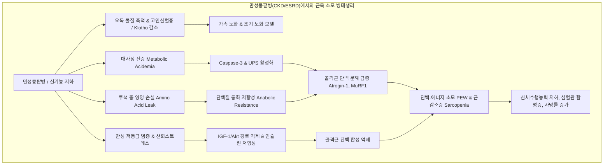
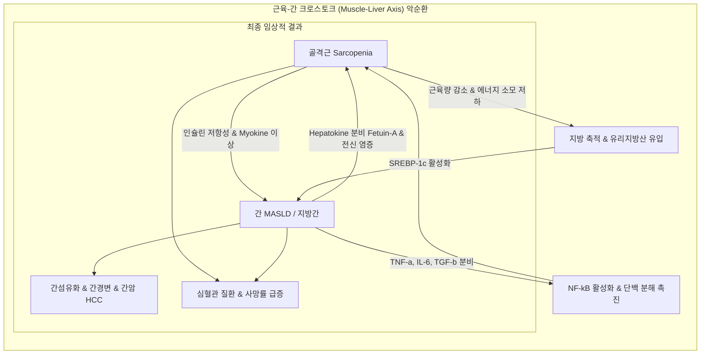
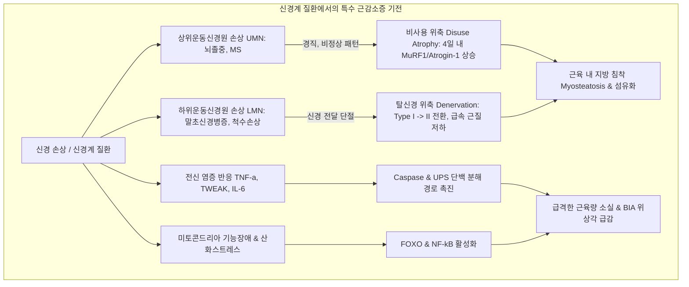

# 📑 [근감소증] PART 6-2 콩팥·지방간·신경계 질환 (Ch27~Ch29)

> **핵심 요약 (Key Summary)**
> - **만성콩팥병과 근육 소모**: [[만성콩팥병]](CKD) 및 [[말기신부전]](ESRD) 환자는 요독증(uremic toxins), 만성 염증, [[대사성 산증]], [[인슐린]] 저항성, 투석 중 영양소 손실로 인해 가속 노화 및 [[단백-에너지 소모]](PEW)가 발생하며, 혈액투석 환자에서 매년 약 9.5%의 대퇴근육 감소가 보고된다. 특히 근육량보다 신체기능과 [[근력]](악력) 저하가 전체 사망률을 더 강력하게 예측한다.
> - **[[근감소증]] 대사이상지방간질환([[MASLD]])**: 골격근과 간은 [[인슐린]] 저항성과 만성 저등급 염증을 공유하는 양방향 크로스토크(crosstalk) 관계에 있다. [[근감소증]] 환자의 40%(근감소성 [[비만]] 시 65%)에서 [[지방간]] 동반되며, 간경변 환자의 약 60%에서 근감소증이 동반되어 간섬유화, 심혈관 위험, 사망률을 상가적으로 증가시킨다.
> - **신경계 질환과 특수 [[근감소증]]**: [[뇌졸중]], [[파킨슨병]], [[척수손상]], [[당뇨병성 말초신경병증]] 등에서는 상위(UMN) 및 하위(LMN) 운동신경원 손상으로 인한 직접적 탈신경화(denervation)와 급격한 비사용 위축(disuse atrophy)이 복합되어 비대칭적 근육 소실, 근섬유형 전환(Type I $\to$ Type II), [[생체전기저항분석]](BIA) 위상각(Phase angle) 저하가 빠르게 진행된다.
> - **다학제적 통합 중재**: 영양(적정 단백질 및 류신, 활성형 [[비타민 D]]), 운동(투석 중/간 유산소 및 저항성 복합 운동), 물리요법(신경근 전기자극 [[NMES]]/[[FES]], 체외충격파 [[ESWT]], 광생체조절 [[PBM]]) 및 다학제 재활 접근이 근육 보존과 기능 회복의 핵심이다.

---

## 📌 목차
1. [Chapter 27. 만성콩팥병 환자의 근육 감소 (Muscle Loss in CKD: Pathophysiology and Therapeutic Approaches)](#1-chapter-27-만성콩팥병-환자의-근육-감소-muscle-loss-in-ckd-pathophysiology-and-therapeutic-approaches)
   - [(1) 서론 및 역학: 유병률과 임상적 영향](#1-서론-및-역학-유병률과-임상적-영향)
   - [(2) 만성콩팥병에서 근육소모의 임상적 원인](#2-만성콩팥병에서-근육소모의-임상적-원인)
   - [(3) 말기신부전 환자의 근육소모 분자적 기전](#3-말기신부전-환자의-근육소모-분자적-기전)
   - [(4) 근육소모 완화를 위한 중재 전략](#4-근육소모-완화를-위한-중재-전략)
2. [Chapter 28. 근감소증과 지방간 (Sarcopenia and MASLD)](#2-chapter-28-근감소증과-지방간-sarcopenia-and-masld)
   - [(1) 서론 및 역학: 양방향 상호작용](#1-서론-및-역학-양방향-상호작용)
   - [(2) 근육-간 관련 인자 및 병태생리 크로스토크](#2-근육-간-관련-인자-및-병태생리-크로스토크)
   - [(3) 치료적 함의 및 임상적 결론](#3-치료적-함의-및-임상적-결론)
3. [Chapter 29. 신경계 질환 환자의 근감소증 (Sarcopenia in Neurological Disease Patients)](#3-chapter-29-신경계-질환-환자의-근감소증-sarcopenia-in-neurological-disease-patients)
   - [(1) 서론 및 신경계-근육 상호작용](#1-서론-및-신경계-근육-상호작용)
   - [(2) 주요 신경계 질환별 근육 변화 양상](#2-주요-신경계-질환별-근육-변화-양상)
   - [(3) 분자 병태생리와 근감소증 연결고리](#3-분자-병태생리와-근감소증-연결고리)
   - [(4) 진단 평가와 기준의 특수성](#4-진단-평가와-기준의-특수성)
   - [(5) 치료와 다학제 재활 전략](#5-치료와-다학제-재활-전략)
4. [출처 및 참고 문헌 (References)](#4-출처-및-참고-문헌-references)

---

## 1. Chapter 27. 만성콩팥병 환자의 근육 감소 (Muscle Loss in CKD: Pathophysiology and Therapeutic Approaches)
- **저자**: 이현승 (충남의대)

### (1) 서론 및 역학: 유병률과 임상적 영향
- **만성콩팥병([[CKD]])의 정의**: 사구체여과율(GFR)이 $60\text{ mL/min/1.73m}^2$ 미만이거나 [[혈뇨]]·[[단백뇨]] 등 콩팥 손상 소견이 3개월 이상 지속될 때 진단. 전 세계 8억 명 이상 이환. 5단계에서는 체내 항상성 유지가 불가능하여 [[신대체요법]](RRT: 혈액투석, 복막투석, 신장이식) 필요.
- **국내 현황**: 투석 환자의 약 84%가 [[혈액투석]]을 받음. [[말기신부전]](ESRD) 환자의 [[근감소증]] 유병률은 약 **28.5%** 로 보고되며, 이는 사망률을 약 **80% 증가**시키는 독립적 위험인자임.
- **투석 환자의 [[허약]] 유병률 비교**:
  - 국내 27개 투석센터에서 6개월 이상 안정적으로 투석 중인 1,658명(평균 55.9세) 조사 결과 **34.8%** 가 [[허약]](frailty) 상태로 확인됨.
  - 일반 노인 인구(CHS 6.9%, WHI 16.3%)와 비교할 때 훨씬 젊은 나이임에도 허약 유병률이 압도적으로 높음 $\to$ 연령적 노화보다 요독증 및 만성질환에 기인한 **병적 노화(pathologic aging)** 가 주도함을 시사.
  - 유지투석 환자보다 투석을 처음 시작하는 신환군(DMMS 67.7%, CDS 73.3%)에서 허약 유병률이 더 높음(표 27-1). 이는 안정적 투석을 통해 요독 물질이 완화되면서 기능이 일부 개선됨을 의미.

| 표 27-1 | 일반 인구와 말기신부전 환자에서의 허약 유병률 비교 | | |
| :--- | :--- | :--- | :--- |
| **연구** | **대상군 (명수)** | **평균 나이 (세)** | **유병률 (%)** |
| CHS (Fried et al.) | 일반 노인 인구 (5,317) | > 65 | 6.9% |
| WHI (Woods et al.) | 일반 노인 인구 (40,657) | > 65 | 16.3% |
| DMMS Wave 2 | 투석 신환 (2,275) | 58.2 ± 15.5 | 67.7% |
| CDS | 투석 신환 (1,576) | 59.6 ± 14.2 | 73.3% |
| Lee et al. (국내) | 유지투석 환자 (1,658) | 55.9 ± 12.9 | 34.8% |
| McAdams et al. | 유지투석 환자 (146) | 60.6 ± 13.6 | 41.8% |
| Johansen et al. | 유지투석 환자 (778) | 57.1 ± 14.3 | 31.4% |
| Kutner et al. | 유지투석 환자 (745) | 57.1 ± 14.1 | 13.8% |

- **측정 기준 및 임상적 영향**:
  - 혈액투석 환자 645명 조사 시 근육량 보정 기준에 따라 8~32%의 유병률 차이를 보임 (신장 보정 $height/m^2$ 시 최저, 체표면적 $BSA$ 보정 시 최고). 체질량지수(BMI)로 보정한 경우 악력 저하 및 보행속도 감소 등 임상적 기능 저하와의 연관성이 가장 높음.
  - 국내 투석 환자 95명(평균 63.9세): 남성 37%, 여성 29.3% 유병률. 염증 상태, 우울증, 인지장애, 영양불량과 밀접하게 연관.
  - 고령 투석 환자 60명(75~95세) 3년 추적: [[근감소증]] 유병률 37~40%(중증 18~37%), 2년간 절반이 사망. 사지근육량(ASM), 보행속도, TUG, SPPB 점수가 사망 예측 지표로 나타남.
  - 근육량 소실 속도: 혈액투석 환자에서 **매년 약 9.5%의 대퇴근육 감소** 보고. 투석 20년 이상 경과군은 연간 -0.160 kg/m²의 근육량 감소율을 보임.
  - 특히 ESRD 환자에서는 **근육량 자체보다 신체기능과 근력이 전체 사망률(all-cause mortality)을 예측하는 더 강력한 인자**임.

> ![[Sarcopenia_Ch27_p370_Fig1.png|540]]
> **그림 27-1. 만성콩팥병 환자에서 단백-에너지 소모, 근감소증 및 [[허약]] 임상적 결과.** 단백-에너지 소모(PEW), 근감소증(Sarcopenia), 근력저하증(Dynapenia), 허약(Frailty)이 복합적으로 얽혀 신체기능 저하(지구력·근력·균형 저하), 심혈관 위험 증가([[고혈압]], 이상지질혈증, 허혈성 심질환, [[심부전]]), 골소실 및 골절, 삶의 질 악화, 인지장애/우울, 조기 사망(Earlier death)을 초래함.

### (2) 만성콩팥병에서 근육소모의 임상적 원인
- **가속 노화(Accelerated Aging) 모델 (Kooman 등)**: 요독증에 의한 산화스트레스, 면역기능장애, 텔로미어 마모(telomere attrition), 만성 저등급 염증이 혈관내피세포 및 근육조직을 직접 손상.
- **조기 노화(Premature Aging) 모델 (Stenvinkel 등)**: 신기능 저하로 인한 인산 배출 지연 $\to$ 고인산혈증 발생 및 항노화 유전자인 **[[Klotho]]** 발현 감소가 노화 과정을 급격히 가속화.
- **고령화 추세**: 국내 투석 환자 평균 연령은 2005년 55.2세에서 2015년 60.8세로 상승, 65세 이상 비율이 28%에서 41.9%로 증가.

> ![[Sarcopenia_Ch27_p372_Fig1.png|540]]
> **그림 27-2. 만성콩팥병 환자에서 단백-에너지 소모, [[근감소증]] 및 허약의 임상적 원인.** 섭취 저하(요독증, 거식 유발 인자), 투석액/소변을 통한 영양소 손실, 만성 염증 및 산화스트레스, 미토콘드리아 손상, 이화호르몬(PTH, Glucagon, Corticosteroids, Angiotensin II) 상승, 동화호르몬(Insulin, GH, [[IGF-1]], [[비타민 D]]) 저항성 및 결핍, [[대사성 산증]] 등이 복합 작용함을 도식화.

| 표 27-2 | 만성콩팥병 환자에서 단백-에너지 소모, [[근감소증]] 및 허약의 임상적 원인 분류 |
| :--- | :--- |
| **원인 분류** | **주요 세부 요인** |
| **1. 음식 섭취 감소** | - 요독성 독소(CKD), 거식 유발 인자(TNF-$\alpha$, CCK, Leptin)(CKD) - 미각/후각 이상(CKD, A), 염증(CKD, A), 우울증(CKD, A), 약물(CKD, A) - [[치매]](A), 빈곤(CKD, A), 치아 결손(A) |
| **2. 영양소 손실 (CKD)** | - 투석액 단백 손실: 혈액투석(MHD) 회당 ~1 g / 복막투석(CPD) 일일 ~9 g - 투석액 [[아미노산]] 손실: 혈액투석(MHD) 회당 ~10-12 g / 복막투석(CPD) 일일 ~2.0-3.5 g - 신증후군 수준의 [[단백뇨]](Nephrotic range proteinuria) |
| **3. 이화 작용 촉진** | - 비특이적 염증 반응(CKD, A) - 산화스트레스(AGEs, ALEs 증가, [[비타민 E]]·C·글루타티온 등 항산화제 감소)(CKD, A) |
| **4. 동반 질환 염증** | [[당뇨병]], 감염, [[심부전]], 악성종양 등 내과적 질환 및 수술적 질환(CKD, A) |
| **5. 이화호르몬 증가 (CKD)** | 부갑상선호르몬(PTH), [[글루카곤]](Glucagon), 코르티코스테로이드, [[안지오텐신]] II(Angiotensin II) |
| **6. 동화호르몬 결핍/저항성** | [[인슐린]](CKD, A), [[성장호르몬]](GH)(CKD, A), [[IGF-1]](CKD, A), [[테스토스테론]](CKD, A), $25(\text{OH})\text{D}_3$(CKD, A), $1,25(\text{OH})_2\text{D}_3$(CKD) |
| **7. [[대사성 산증]] (CKD)** | [[Caspase-3]] 및 유비퀴틴-프로테아좀 시스템(UPS) 활성화 $\to$ 단백 분해 촉진, 단백 합성 억제 |
| **8. 일차성 신경근 장애** | 중추신경계 기능장애(특이 신경세포 변화, 치매), 말초신경병증, 근세포 소실, 위성세포 수 감소(CKD, A), 힘줄 강직(Tendon stiffness) |
| **9. 신체 비활동/탈조건화** | Physical inactivity and deconditioning (CKD, A) |
| **10~17. 세포생물학적 요인** | 세포사멸(Apoptosis) 이상(A), 노화세포 증가(A), 줄기세포 보충 감소(A), 자가포식 감소(A), 변형 단백질 축적(CKD, A), DNA 복구 손상(CKD, A), 후성유전학적 변화(CKD, A), 유전적 소인(A) |
*(CKD: 만성콩팥병 기인, A: 연령적 노화 기인, CKD, A: 두 원인 복합)*

### (3) 말기신부전 환자의 근육소모 분자적 기전
1. **단백질 분해 경로 활성화**:
   - **유비퀴틴-프로테아좀 시스템(UPS)**: 근육 특이 E3 유비퀴틴 연결효소인 **[[Atrogin-1]](MAFbx)** 및 **[[MuRF1]]** 과발현 $\to$ 액틴-미오신 복합체 분해 가속화.
   - **[[Caspase-3]] 경로**: [[대사성 산증]] 등에 의해 활성화되어 근섬유 단백질(액토미오신 복합체)을 초기 절단하여 프로테아좀이 분해할 수 있도록 만듦.
   - **자가포식-라이소좀 경로(ALP)**: 동화 신호 결핍 시 비정상적으로 항진되어 근위축 악화.
2. **단백질 합성 장애**:
   - **[[IGF-1]] / Akt 신호 억제**: 요독성 [[인슐린]] 저항성에 의해 [[인슐린]] 및 [[IGF-1]] 신호 전달 차단 $\to$ 골격근 내 단백질 합성 억제 및 UPS 억제 해제로 분해 촉진.
3. **만성 염증, 산화스트레스, 미토콘드리아 기능장애**:
   - TNF-$\alpha$, [[IL-6]] 등 염증성 [[사이토카인]] 증가 $\to$ 단백질 합성 억제 및 이화 신호 자극.
   - 활성산소종([[ROS]]) 과잉 생성, 항산화 결핍, 미토콘드리아 ATP 생성 감소 $\to$ 단백 분해 신호 증폭.
4. **투석 과정 자체에 의한 손실**:
   - 혈액투석 1회당 **최대 12 g의 [[아미노산]] 손실** (High-flux polysulfone 막이 Low-flux 막보다 손실 큼).
   - 복막투석 시 하루 평균 **약 5 g의 단백질 손실** 발생.
5. **요독 물질(Uremic Toxins)**:
   - [[인독실황산]](Indoxyl sulfate) 및 메틸글라이옥살(Methylglyoxal)이 산화스트레스를 유발하고 단백 분해를 직접 활성화.
6. **장내 미생물총 불균형(Gut Dysbiosis)**:
   - 장 점막 장벽 손상 및 요독 독소(세균 발효산물)의 체내 유입 $\to$ 전신 염증 및 인슐린 저항성 가속화.
7. **마이크로RNA(MicroRNA) 발현 이상**:
   - miR-26a, miR-29, miR-23a, miR-27a, miR-206, miR-486 등의 발현 변화가 근형성, 근육 재생 및 단백 대사 교란에 관여.

### (4) 근육소모 완화를 위한 중재 전략
- **영양 중재**:
  - 투석 전(CKD 3~5단계): 신기능 보존을 위해 체중 kg당 0.55~0.60 g/d 저단백 식이 또는 케토산/[[아미노산]] 유사체를 보충한 0.28~0.43 g/kg/d 초저단백 식이 권장.
  - 투석 중(ESRD): 투석 전 유청(whey) 또는 대두 단백질 27 g 보충 시 염증 지표 개선 및 보행능력 향상. **투석 중 15 g의 경구 단백 보충 시 14개월 추적 관찰에서 사망 위험 29% 감소**.
  - L-카르니틴(1,000 mg) 투여 시 12개월간 근육량 및 악력 보존. 류신(6 g/day)과 [[저항운동]] 병행 시 신체기능 뚜렷하게 향상 (단, HMB 3,000 mg/day 단독은 유의한 개선 없음).
- **운동 요법**:
  - 영국신장학회 권고: 주당 150분 중등도 이상 운동 권장 (투석 중 intradialytic 또는 투석 간 interdialytic).
  - 투석 중 자전거 운동 및 [[저항운동]] 병행 시 다리 근육량·근력, 6분 보행 거리, sit-to-stand, 최대 산소섭취량($\text{VO}_{2\text{peak}}$)의 최적 개선 효과.
- **약물 치료**:
  - 중탄산나트륨: [[대사성 산증]] 교정을 통해 근육량 증가, [[마이오스타틴]] 감소, sit-to-stand 개선.
  - 피오글리타존(Pioglitazone): 근육 내 지방 감소, [[인슐린]] 감수성 개선, ESRD 환자 사망률 감소.
  - [[비타민 D]]: 활성형 비타민 D 보충 시 알부민 및 대퇴부 근육 단면적 증가.
  - 동화호르몬/기타: 난드롤론(사지 [[제지방량]] 증가), 옥시메톨론(근력 증가하나 간 독성), rhGH(단백 합성 촉진), [[그렐린]] 수용체 작용제(MK-0677, 식욕 및 [[IGF-1]] 상승). 항마이오스타틴 항체(PINTA 745)는 유효성 입증 실패로 개발 중단.
- **물리적 중재**:
  - 신경근 전기자극([[NMES]]): 8~20주 적용 시 6분 보행 거리, 악력, 무릎 폄근력 향상.
  - 체외충격파 치료([[ESWT]]): 주 1회 12주 적용 시 하퇴 근육량, 사지근육지수(SMI), TUG, sit-to-stand 개선.
  - 광생체조절([[PBM]]): 저출력 레이저를 통한 ATP 생성 촉진 및 조직 재생.
- **가역성 확인**: 신장이식 성공 시 상당수 환자에서 근육량과 근력이 유의하게 회복되어, 적극적인 조기 중재의 중요성을 뒷받침함.

---

## 2. Chapter 28. 근감소증과 지방간 (Sarcopenia and MASLD)
- **저자**: 한유진 (계명의대)

### (1) 서론 및 역학: 양방향 상호작용
- **개념**: 대사이상지방간질환([[MASLD]], 구 [[NAFLD]])과 [[근감소증]]은 [[인슐린]] 저항성, 만성 염증, 호르몬 불균형을 공통분모로 하는 밀접한 대사 질환임.
- **역학적 수치**:
  - 일반 인구의 MASLD 유병률: 25~30%.
  - **[[근감소증]] 환자에서의 [[지방간]] 유병률: 약 40%** (근감소성 [[비만]] 환자에서는 **65%** 까지 상승).
  - MASLD 환자에서의 [[근감소증]] 유병률: 13~18%.
  - 질환 진행에 따른 근감소증 유병률: **단순 지방간염(MASH) 시 35%**, **간경변(Cirrhosis) 진행 시 약 60%**.
  - 한국인 7년 추적 연구: 근육량이 감소할수록 MASLD 발생 위험 증가, 근육량이 유지·증가할 경우 MASLD의 자연 관해 가능성이 유의하게 높아짐.
- **임상적 예후**: 근감소증이 동반된 지방간 환자는 간섬유화 위험이 독립적으로 증가하며, 문맥압항진증, 감염 합병증, 간세포암종(HCC) 발생률, 간이식 후 불량 예후, 심혈관 질환 발생 및 전체 사망률이 급격히 상승함.

### (2) 근육-간 관련 인자 및 병태생리 크로스토크
1. **[[인슐린]] 저항성(Insulin Resistance)**:
   - 골격근은 인체 최대의 포도당 섭취 및 [[아미노산]] 저장 기관임.
   - 근육의 인슐린 저항성 $\to$ 지방조직의 지방분해(lipolysis) 증가 $\to$ 순환 유리지방산(FFA) 급증 및 간 유입 증가.
   - 간에서 보상적 고인슐린혈증으로 인해 **[[SREBP-1c]]**(Sterol Regulatory Element Binding Protein-1c) 활성화 $\to$ 신규 지방 합성(de novo lipogenesis) 증가 및 [[중성지방]] 축적으로 [[지방간]] 악화.
   - [[지방간]] 소포체 스트레스는 **Fetuin-A**, **FGF-21** 등 헤파토카인(hepatokine)을 분비하여 [[인슐린]] 저항성을 더욱 심화시킴.
   - 지속적인 고인슐린 신호는 mTORC1에 대한 음성 피드백을 유발하여 장기적으로 mTORC1 활성을 억제 $\to$ 자가포식 가속화 및 단백질 분해 증가로 근손실 악화.
2. **만성 염증 및 산화스트레스**:
   - 근육 내 지방 침착([[근지방증]], Myosteatosis) $\to$ 미토콘드리아 $\beta$-산화 억제, 활성산소([[ROS]]) 및 지질과산화 유도.
   - 간과 지방조직에서 TNF-$\alpha$, [[IL-6]], TGF-$\beta$ 분비 $\to$ [[NF-κB]] 신호 자극을 통해 골격근 이화작용(단백질 분해)을 유발하고 간 섬유화를 촉진.
3. **호르몬 및 마이오카인 불균형**:
   - **[[아디포넥틴]](Adiponectin)** 감소: 항염증, 간보호, 인슐린 감수성 개선 효과 상실.
   - **[[렙틴]](Leptin)** 증가 및 [[렙틴]] 저항성: 만성 고렙틴혈증이 간내 염증 및 간섬유화를 촉진.
   - **[[마이오스타틴]](Myostatin)** 증가: 근육 단백 합성을 억제하고 간 성상세포(HSC)를 자극하여 섬유화 촉진.
   - **[[아이리신]](Irisin)** 감소: 에너지 소비 및 백색지방의 갈색화 억제.
4. **[[비타민 D]]의 역할**:
   - 간과 골격근에 핵 [[비타민 D]] 수용체([[VDR]])가 분포. 비타민 D 결핍 및 VDR 하향조절은 근형성 억제 및 [[지방산]] 합성(SREBP-1c, ACC 조절 교란)을 촉진.
   - 단, 임상시험에서 인위적인 [[비타민 D]] 단독 보충의 근육량·지방간 개선 효과는 일관되지 않아, 현행 가이드라인에서는 지방간 단독 치료 목적으로 권장하지 않음.
5. **신체활동 부족**:
   - 근육량 및 일일 에너지 소비 감소 $\to$ [[비만]], 지방간, [[근감소증]] 삼중 악순환.

### (3) 치료적 함의 및 임상적 결론
- **생활습관 교정**: [[지방간]] 개선을 위한 표준 권고안은 **7~10%의 체중 감량**임.
- **[[근감소증]] 환자에서의 운동 원칙**: 과도한 열량 제한만 적용할 경우 골격근 손실이 동반되어 대사 상태가 오히려 악화되므로, **유산소 운동과 함께 근력 운동(저항성 운동)에 초점을 맞춘 복합 프로그램**이 필수적임.

---

## 3. Chapter 29. 신경계 질환 환자의 근감소증 (Sarcopenia in Neurological Disease Patients)
- **저자**: 신명준 (부산의대)

### (1) 서론 및 신경계-근육 상호작용
- **운동 단위(Motor Unit)**: 1개의 하위 운동신경원과 그에 지배받는 근섬유 집합.
  - 정밀 조절 근육(손가락 등): 1개 신경원이 10개 이하의 근섬유 지배.
  - 대근육(대퇴부 등): 1개 신경원이 500개 이상의 근섬유 지배.
- **손상 부위에 따른 차이점(표 29-1)**:
  - **상위운동신경원([[UMN]]) 손상** (예: [[뇌졸중]], [[다발성경화증]]): 반사항진, 경직(spasticity), 비정상적 운동 패턴 $\to$ 주로 **비사용 위축(disuse atrophy)** 유발.
  - **하위운동신경원([[LMN]]) 손상** (예: [[당뇨병성 말초신경병증]], 신경근병증, 척수전각 손상): 신경근접합부 단절로 직접적인 **탈신경(denervation)** 유발 $\to$ 빠르고 광범위한 근위축 및 **근섬유형 전환(Type I $\to$ Type II)** 발생.
- **비사용 위축의 급속성**: 탈신경이 없더라도 **단 4일간의 활동 제한(침상 안정)** 만으로도 MuRF1, Atrogin-1 유전자 발현이 급증하며 단백질 손실이 시작됨.

| 표 29-1 | 운동신경원 손상 부위에 따른 근육 변화의 차이 |
| :--- | :--- |
| **구분** | **상위운동신경원(UMN) 손상** | **하위운동신경원(LMN) 손상** |
| **대표 질환** | [[뇌졸중]](Stroke), 다발성경화증(MS) 등 | [[당뇨병성 말초신경병증]], 신경근병증, 척수손상 등 |
| **주요 기전** | 상위 억제 소실로 인한 반사항진, 경직, 비정상 협응 패턴 | 직접적인 축삭 변성 및 탈신경(denervation) |
| **근육 변화 특성** | 주로 비사용 위축(disuse atrophy)에 의해 진행 | 극도로 빠르고 광범위한 근위축, 근섬유형 전환(Type I $\to$ Type II) |

### (2) 주요 신경계 질환별 근육 변화 양상
1. **[[뇌졸중]](Stroke)**:
   - 마비측(paretic side) 중심의 비대칭적 근육 소실. **발병 후 3주 이내부터 급감** 시작.
   - **1년 이내 마비측 하지 제지방량이 최대 24% 감소**.
   - 근육 내 지방 침착(myosteatosis) 및 근질 저하 동반. 비마비측에서도 염증과 단백 분해 경로가 활성화되어 전신성 근감소증으로 파급.
2. **[[파킨슨병]](Parkinson's Disease)**:
   - 일반 노인 대비 **[[근감소증]] 유병률 약 4배** (70세 이상에서는 5배 이상).
   - [[도파민]] 소실로 인한 서동증, 경직, 자세 불안정 외에도 [[연하장애]](영양 결핍), 만성 염증, 미토콘드리아 기능 이상이 복합 작용.
3. **[[척수손상]](Spinal Cord Injury, SCI)**:
   - 완전 손상 시 손상 부위 이하 근육의 완전 마비 및 급격한 탈신경 위축.
   - 불완전 척수손상에서도 **6주 이내 대퇴부 근육 단면적 33% 감소, 근육 내 지방 126% 증가**. 기능적 전기자극([[FES]]) 등으로 가역적 회복 가능.
4. **[[당뇨병성 말초신경병증]](Diabetic Peripheral Neuropathy, DPN)**:
   - 만성 고혈당에 의한 [[말초신경]] 축삭 손상 $\to$ 발가락, 족부 내재근, 종아리 등 원위부 소근육부터 점진적 위축.
   - 통증·이상감각에 따른 운동 회피 $\to$ 이차성 비사용 위축 및 보행·균형 장애.
   - **BIA 위상각(Phase angle) < 4.5° 미만인 경우 [[근감소증]] 위험 유의하게 상승**.
5. **중환자실 입원 환자의 병적 근감소(ICU-acquired Muscle Wasting)**:
   - [[패혈증]], 기계환기, 급성 전신 염증 $\to$ **입원 10일 이내 [[대퇴사두근]] 단면적 10~26% 급감**.

### (3) 분자 병태생리와 근감소증 연결고리
- **탈신경화와 근섬유 변형**: 신경 지배 탈락 시 수축 단백질 소실, Type I([[지근]]) 섬유의 Type II([[속근]]) 변형 및 지방 침착.
- **염증 및 TWEAK 경로**: 중추신경 손상 후 TNF-$\alpha$, [[IL-6]], [[IL-1]]$\beta$ 증가. 특히 **[[TWEAK]]**(TNF-like weak inducer of apoptosis)는 강력한 근육 소모 유도 [[사이토카인]] 작용하여 MuRF1 및 Atrogin-1 발현을 유도.
- **산화스트레스**: [[ROS]] 증가 $\to$ [[NF-κB]] 및 [[FoxO]] 신호 활성화 $\to$ 유비퀴틴-프로테아좀 분해 촉진.
- **Akt/[[mTOR]] 경로 저해**: 염증 및 신경 차단 환경에서 [[IGF-1]]/PI3K/Akt/[[mTOR]] 신호가 차단되어 단백질 합성(S6K1, 4EBP1)이 전면 중단됨.
- **부동(Immobilization)**: 침상 안정(bed rest) 10일 만에 [[대퇴사두근]] 단면적의 20~30% 감소.

### (4) 진단 평가와 기준의 특수성
- **근력 평가(악력)의 한계**: 편마비 환자에서 마비측과 건측 중 어느 쪽을 기준으로 할지 표준화가 미흡하며, 경직(spasticity), 진전, 인지장애, 협조 부족 시 수의적 최대 근력이 과소평가될 위험이 큼.
- **근육량 평가의 한계**:
  - **[[DXA]]**: 척추 변형, 관절 구축, 경직이 있는 신경계 환자에서 정확한 자세 유지가 어려워 측정 오류 발생 가능.
  - **[[BIA]]**: 비대칭적 마비 부위를 반영하기 어렵고, [[부종]](edema) 동반 시 [[제지방량]] 과대평가됨. 단, **위상각(Phase angle)** 은 세포막 완전성과 근질을 평가하는 민감한 지표로 유용.
- **기능적 평가 도구**:
  - **보행속도(Usual gait speed)**: 4 m 기준 $<0.8\text{ m/s}$ 시 중대한 기능 저하.
  - **균형 검사**: Berg Balance Scale(BBS), Timed Up and Go([[TUG]]).
  - **[[SPPB]]** 및 ADL/IADL 평가.

### (5) 치료와 다학제 재활 전략
- **운동 치료**:
  - 중등도 강도의 [[저항운동]](Resistance training)은 [[뇌졸중]] 환자에서도 안전하며 근육량과 기능 회복에 필수적임.
  - 단순 근력 운동에 국한하지 않고 균형 훈련, 보행 훈련, 유산소 운동이 결합된 **복합 다요소 운동(multicomponent exercise)** 프로그램 적용.
  - 능동 운동이 불가능한 환자: **기능적 전기자극([[FES]])** 및 **신경근 전기자극([[NMES]])** 을 조기 적용하여 탈신경 근위축 방지.
- **영양 관리**:
  - 고령 [[뇌졸중]] [[근감소증]] 환자에서 **유청단백(whey protein) 및 [[비타민 D]] 보충**이 기능 회복에 효과적임.
  - [[연하장애]](dysphagia)를 조기에 평가하여 적절한 칼로리와 단백질 섭취 유지.
- **다학제 팀 접근(Multidisciplinary Team Approach)**:
  - 재활의학과, 신경과, 신장내과, 내분비내과, 영양팀, 물리치료사, 간호사 간의 통합 프로토콜 운영이 임상 결과 극대화의 핵심.

---

## 4. 출처 및 참고 문헌 (References)

### Chapter 27 (만성콩팥병 환자의 근육 감소)
1. Bao Y, Dalrymple L, Johansen KL, et al. Frailty, dialysis initiation, and mortality in end-stage renal disease. *Arch Intern Med* 2012;172:1071-7.
2. Bataille S, Serveaux M, Carreno E, et al. The diagnosis of sarcopenia is mainly driven by muscle mass in hemodialysis patients. *Clin Nutr* 2016.
3. Insan Memorial Dialysis Registry, 2015. ESRD Registry Committee, Korean Society of Nephrology.
4. Setoyama D, Han D, Tian J, et al. *J Cachexia Sarcopenia Muscle* 2025;16(2):e13749.
5. Fried LP, Tangen CM, Walston J, et al. Frailty in older adults: evidence for a phenotype. *J Gerontol A Biol Sci Med Sci* 2001;56:M146-56.
6. Greenhall GH, Davenport A. Screening for muscle loss in patients established on peritoneal dialysis using bioimpedance. *Eur J Clin Nutr* 2017;71:70-5.
7. Johansen KL, Chertow GM, Kutner NG, et al. Significance of frailty among dialysis patients. *J Am Soc Nephrol* 2007;18:2960-7.
8. Kim JC, Kalantar-Zadeh K, Kopple JD. Frailty and protein-energy wasting in elderly patients with end stage kidney disease. *J Am Soc Nephrol* 2013;24:337-51.
9. Kim JK, Choi SR, Choi MJ, et al. Prevalence of and factors associated with sarcopenia in elderly patients with end-stage renal disease. *Clin Nutr* 2014;33:64-8.
10. Kooman JP, Broers NJ, Usvyat L, et al. Out of control: accelerated aging in uremia. *Nephrol Dial Transplant* 2013;28:48-54.
11. Kopple JD, Cheung AK, Christiansen JS, et al. OPPORTUNITY: a randomized clinical trial of growth hormone on outcome in hemodialysis patients. *Clin J Am Soc Nephrol* 2008;3:1741-51.
12. Lee SY, Yang DH, Kim JC, et al. The prevalence, association, and clinical outcomes of frailty in maintenance dialysis patients. *J Ren Nutr* 2017;27:106-12.
13. Sang Hyeon Ju, Hyon-Seung Yi. Clinical features and molecular mechanism of muscle wasting in end stage renal disease. *BMB Rep* 2023;56(8):426-38.
14. Stenvinkel P, Larsson TE. Chronic kidney disease: a clinical model of premature aging. *Am J Kidney Dis* 2013;62:339-51.
15. United States Renal Data System (USRDS) 2016 Annual Data Report.

### Chapter 28 (근감소증과 지방간)
1. 2021 대한간학회 비알코올 지방간질환 진료 가이드라인 (KASL).
2. 2023 대한당뇨병학회 [[당뇨병]] 진료지침, 제8판.
3. Impact of non-alcoholic fatty liver disease on the risk of sarcopenia: a nationwide multicenter prospective study. *Hepatol Int* 2022;16(3):545-554.
4. Interaction between sarcopenia and nonalcoholic fatty liver disease. *Clin Mol Hepatol* 2023;29(Suppl):S68-S78.
5. Non-alcoholic fatty liver disease and sarcopenia additively increase mortality: a Korean nationwide survey. *J Cachexia Sarcopenia Muscle* 2021;12(4):964-972.
6. Relationship Between Relative Skeletal Muscle Mass and Nonalcoholic Fatty Liver Disease: A 7-Year Longitudinal Study. *Hepatology* 2018;68(5):1755-1768.
7. Relationship between sarcopenia and nonalcoholic fatty liver disease: the Korean Sarcopenic Obesity Study (KSOS). *Hepatology* 2014;59(5):1772-8.
8. Risk stratification using sarcopenia status among subjects with metabolic dysfunction-associated fatty liver disease. *J Cachexia Sarcopenia Muscle* 2021;12(5):1168-1178.
9. Sarcopaenia is associated with NAFLD independently of obesity and insulin resistance: Nationwide surveys (KNHANES 2008-2011). *J Hepatol* 2015;63(2):486-93.
10. Sarcopenia is an independent risk factor for non-alcoholic steatohepatitis and significant fibrosis. *J Hepatol* 2017;66:123-31.
11. Sarcopenia is associated with significant liver fibrosis independently of obesity and insulin resistance in nonalcoholic fatty liver disease. *Hepatology* 2016;63(3):776-86.

### Chapter 29 (신경계 질환 환자의 근감소증)
1. Baggerman MR, van Dijk DP, Winkens B, et al. Muscle wasting associated co-morbidities, rather than sarcopenia are risk factors for hospital mortality in critical illness. *J Crit Care* 2020;56:31-36.
2. Carda S, Cisari C, Invernizzi M. Sarcopenia or muscle modifications in neurologic diseases: a lexical or patophysiological difference. *Eur J Phys Rehabil Med* 2013;49(1):119-130.
3. Huang CY, Liu YH. Sex difference, proteostasis and mitochondrial function impact stroke-related sarcopenia: a systematic review and meta-analysis. *Ageing Res Rev* 2024;102484.
4. Inoue T, Ueshima J, Kawase F, et al. Trajectories of the prevalence of sarcopenia in the pre-and post-stroke periods: a systematic review. *Nutrients* 2022;15(1):113.
5. Lima DP, de Almeida SB, Bonfadini JC, et al. Clinical correlates of sarcopenia and falls in Parkinson's disease. *PLoS One* 2020;15(3):e0227238.
6. Ponsoni A, Sardeli AV, Costa FP, Mourão LF. Prevalence of sarcopenia in Parkinson's disease: a systematic review and meta-analysis. *Geriatr Nurs* 2023;49:44-49.
7. Powers SK, Lynch GS, Murphy KT, et al. Disease-induced skeletal muscle atrophy and fatigue. *Med Sci Sports Exerc* 2016;48(11):2307.
8. Scherbakov N, Sandek A, Doehner W. Stroke-related sarcopenia: specific characteristics. *J Am Med Dir Assoc* 2015;16(4):272-276.
9. Schimpfle L, Tsilingiris D, Mooshage CM, et al. Phase angle of bioelectrical impedance analysis as an indicator for diabetic polyneuropathy in type 2 diabetes mellitus. *J Clin Endocrinol Metab* 2024;109(11):e2110-e2119.
10. Yasemin O, Seydahmet A, Ozcan K. Relationship between diabetic neuropathy and sarcopenia. *Prim Care Diabetes* 2019;13(6):521-528.
