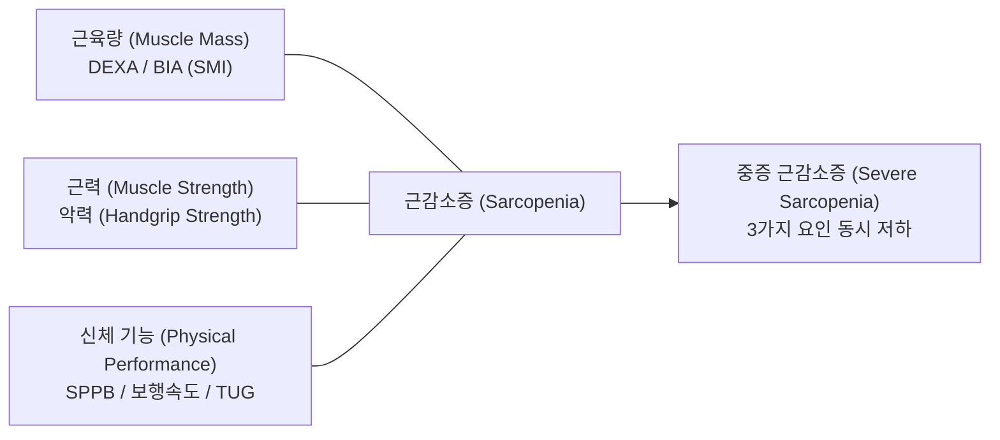
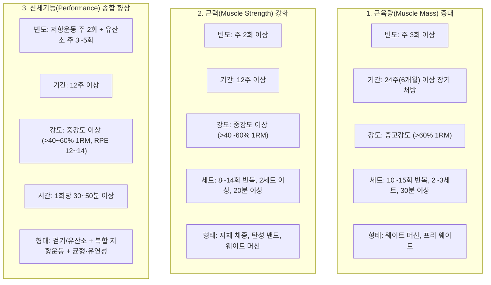
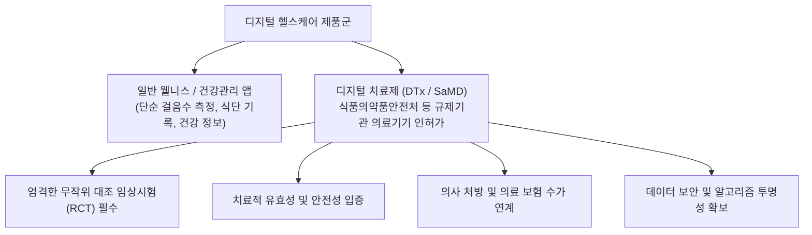

# 📑 [근감소증] PART 7-2 근감소증의 비약물 치료: 운동·재활 (Ch33~37)

> **핵심 요약 (Key Summary)**
> 1. **운동 처방의 기본 원칙(FITT)**: [[근감소증]]의 1차 표준 치료는 운동이며, 특히 [[저항성 운동(Resistance Training)]]이 핵심이다. 근육량 증대를 위해서는 주 3회 이상, 60% 1RM 이상의 중고강도로 24주 이상의 장기 개입이 요구되는 반면, 근력은 주 2회 이상·40~60% 1RM으로 12주 이상 지속 시 신경학적 적응([[Neural Adaptation]])을 통해 조기에 유의미한 개선이 나타난다. 신체 기능 향상을 위해서는 저항성 운동과 함께 걷기 등 유산소 운동(주 3~5회, 30~50분) 및 균형·유연성 훈련의 병합([[복합 운동]])이 필수적이다.
> 2. **최신 보완·대체 [[운동요법]]**: 거동이 불편하거나 관절 통증으로 전통적 웨이트 트레이닝이 어려운 고령자에게 [[전신진동운동(WBV)]]과 [[전기근자극(EMS)]]/전신전기근자극(WB-EMS)이 유효한 대안이다. WBV는 [[긴장진동반사(Tonic Vibration Reflex, TVR)]]를 통해 20~50 Hz(최적 30 Hz 부근)의 진동으로 [[근방추]] Ia 구심성 신경을 자극하며, EMS는 노화 시 우선 소실되는 [[속근섬유(Type II fibers)]]를 불수의적으로 선택적 동원하여 근력 및 운동 기능을 보존한다.
> 3. **디지털 치료제(DTx) 및 스마트 재활**: 소프트웨어 의료기기(SaMD)로서의 [[디지털 치료제(DTx)]]는 VR(가상현실), AI 기반 모션인식(자세 교정), 모바일 앱, 웨어러블 센서(가속도계 기반 신체활동 추적)를 활용해 환자의 치료 순응도와 임상적 지속성을 획기적으로 개선한다. 일상 속 예방 중재로는 하루 7,000~8,000보 보행 및 15~20분 이상의 중강도 활동(3 METs 이상) 유지가 권장된다.
> 4. **재활치료의 다학제적 통합 전략**: 2021년 한국표준질병사인분류(KCD-8, [[M62.5]]) 등재 및 [[노인의학 4대 거인(Geriatric Giants)]]으로 대두된 [[근감소증]] 극복을 위해, 점진적 근력강화(머신 중심 닫힌사슬운동)와 함께 단백질(체중당 1.0~1.5 g/일, [[류신(Leucine)]] 중심), [[비타민 D]](800~1,000 IU/일) 보충, MNA 및 혈청 [[프리알부민(Prealbumin)]] 평가, [[기능적 전기자극치료(FES)]]를 결합한 포괄적 다학제 재활이 필수적이다.

---

## 📌 목차
1. [Chapter 33. 근육량 및 근력, 신체기능 개선을 위한 운동방법](#chapter-33-근육량-및-근력-신체기능-개선을-위한-운동방법)
   - [1.1 근감소증의 세 가지 요인 및 한국 워킹 그룹(KWGS) 평가 기준](#11-근감소증의-세-가지-요인-및-한국-워킹-그룹kwgs-평가-기준)
   - [1.2 근감소증 단계별 분류 도식 (그림 33-1)](#12-근감소증-단계별-분류-도식-그림-33-1)
   - [1.3 신체기능 검사 방법 및 권장 컷오프](#13-신체기능-검사-방법-및-권장-컷오프)
   - [1.4 근육량·근력·신체기능 개선을 위한 FITT 운동 처방 전략](#14-근육량근력신체기능-개선을-위한-fitt-운동-처방-전략)
2. [Chapter 34. 근감소증 운동요법의 최근 동향](#chapter-34-근감소증-운동요법의-최근-동향)
   - [2.1 서론: 근력운동 실천율 한계와 대체 요법의 대두](#21-서론-근력운동-실천율-한계와-대체-요법의-대두)
   - [2.2 전신진동운동 (Whole-Body Vibration, WBV)](#22-전신진동운동-whole-body-vibration-wbv)
   - [2.3 전신진동운동기기의 활용 도식 (그림 34-1)](#23-전신진동운동기기의-활용-도식-그림-34-1)
   - [2.4 전기근자극 (Electromyostimulation, EMS) 및 전신 EMS](#24-전기근자극-electromyostimulation-ems-및-전신-ems)
   - [2.5 소결 및 임상적 적용 전략](#25-소결-및-임상적-적용-전략)
3. [Chapter 35. 디지털 치료 기반 운동중재](#chapter-35-디지털-치료-기반-운동중재)
   - [3.1 디지털 치료제(DTx)의 개념 및 정의](#31-디지털-치료제dtx의-개념-및-정의)
   - [3.2 근감소증 운동중재를 위한 디지털 기술 유형 및 특성](#32-근감소증-운동중재를-위한-디지털-기술-유형-및-특성)
   - [3.3 디지털 운동중재의 효과와 과학적 근거 (메타분석 고찰)](#33-디지털-운동중재의-효과와-과학적-근거-메타분석-고찰)
   - [3.4 예방 목적 중재와 치료 목적 중재의 적용 모델](#34-예방-목적-중재와-치료-목적-중재의-적용-모델)
   - [3.5 디지털 운동중재의 한계점과 극복 전략](#35-디지털-운동중재의-한계점과-극복-전략)
4. [Chapter 36. 재활치료](#chapter-36-재활치료)
   - [4.1 서론: 질병코드 등재와 초고령사회의 당면 과제](#41-서론-질병코드-등재와-초고령사회의-당면-과제)
   - [4.2 근감소증 재활 운동요법의 원칙](#42-근감소증-재활-운동요법의-원칙)
   - [4.3 영양보충요법과의 결합 전략](#43-영양보충요법과의-결합-전략)
   - [4.4 기능적 전기 자극치료 (Functional Electrical Stimulation, FES)](#44-기능적-전기-자극치료-functional-electrical-stimulation-fes)
   - [4.5 디지털 기반 스마트 재활치료 패러다임](#45-디지털-기반-스마트-재활치료-패러다임)
   - [4.6 재활치료의 당면 과제 및 결론](#46-재활치료의-당면-과제-및-결론)
5. [Chapter 37. 근감소증 예방과 치료를 위한 운동 중재: 최신 연구 리뷰](#chapter-37-근감소증-예방과-치료를-위한-운동-중재-최신-연구-리뷰)
   - [5.1 서론 및 운동 유형별 생리학적 작용 메커니즘](#51-서론-및-운동-유형별-생리학적-작용-메커니즘)
   - [5.2 체계적 고찰 및 메타분석 근거 고찰](#52-체계적-고찰-및-메타분석-근거-고찰)
   - [5.3 근감소증 대상 포괄적 운동 가이드라인 (FITT 프로토콜)](#53-근감소증-대상-포괄적-운동-가이드라인-fitt-프로토콜)
   - [5.4 향후 연구 방향 및 맺음말](#54-향후-연구-방향-및-맺음말)
6. [출처 및 참고 문헌 (References)](#6-출처-및-참고-문헌-references)

---

## Chapter 33. 근육량 및 근력, 신체기능 개선을 위한 운동방법
- **저자**: 김창선 (동덕여자대학교)
- **영문 제목**: Exercise Strategies to Enhance Muscle Mass, Strength, and Physical Function in Sarcopenia

### 1.1 근감소증의 세 가지 요인 및 한국 워킹 그룹(KWGS) 평가 기준
[[근감소증]] 조작적 정의는 초기 근육량(Muscle Mass) 감소 기준에서 출발하였으나, 임상적 예후와 밀접한 근력(Muscle Strength) 및 신체 기능(Physical Performance)의 중요성이 확립되면서 다차원적 진단 체계로 발전하였다.

#### (1) 근육량 (Muscle mass)
- **노화에 따른 감퇴 양상**: 사지근육량은 30~40대에서 최고치에 도달한 후 매년 점진적으로 감소한다. 70세 이전까지 10년당 약 8%씩 감소하다가, 70세 이후에는 10년당 15% 감소하여 약 2배 빠른 속도로 급감한다.
- **측정 및 지표**: 사지골격근량(Appendicular Skeletal Muscle Mass, ASM)을 신장의 제곱($\text{height}^2, \text{m}^2$)으로 나눈 근육량지수(Skeletal Muscle mass Index, SMI = $\text{ASM}/\text{Ht}^2$)를 표준으로 사용한다.
- **한국 워킹 그룹(KWGS 2023) 권장 컷오프 기준 (표 33-1)**:

| 측정 방법 | 남성 기준 | 여성 기준 | 비고 |
| :--- | :--- | :--- | :--- |
| **DEXA (이중에너지 X선 흡수계측법)** | **< 7.0 $\text{kg}/\text{m}^2$** | **< 5.4 $\text{kg}/\text{m}^2$** | Dual-energy X-ray absorptiometry |
| **BIA (생체전기저항분석법)** | **< 7.0 $\text{kg}/\text{m}^2$** | **< 5.7 $\text{kg}/\text{m}^2$** (원문 오기: <3.7) | Bio-electrical impedance analysis |

#### (2) 근력 (Muscle strength)
- **노화에 따른 감퇴 양상**: 근력은 30세경 정점에 도달한 뒤 매년 3~4%씩 비선형적 감소를 보인다. 70세 이전까지 10년당 10~15% 감소하며, 70세 이후에는 10년당 25~40% 속도로 가속화된다(근육량 감소 속도보다 2배 이상 빠름).
- **부위별 차이**: 슬관절(무릎) 신전근력이 주관절(팔꿈치) 굴곡근력보다 빠르게 저하된다.
- **악력(Handgrip Strength) 권장 컷오프 (표 33-2)**:
  - **남성**: **< 28 kg**
  - **여성**: **< 18 kg**
  - *측정법*: 주동팔(우세손; 왼손잡이는 왼손)에서 2회 이상 측정 후 최고값 채택.

#### (3) 신체 기능 (Physical performance)
신체 기능은 근육뿐 아니라 신경전달속도, 심폐순환, 반응속도, 관절가동성 등 다장기 시스템의 복합적 발현이다. 노화에 따른 [[성장호르몬]]·성호르몬 감소, 만성 저등급 염증([[Inflammaging]]) 증가, 근섬유 위축이 신체 기능 저하를 가속화한다.

---

### 1.2 근감소증 단계별 분류 도식 (그림 33-1)
한국 워킹 그룹(KWGS)은 사지근육량, 근력, 신체기능의 조합에 따라 [[근감소증]] 단계를 3단계로 분류하는 진단 알고리즘을 발표하였다.

> ![[Sarcopenia_Ch33_p439_Fig1.png|540]]
> **그림 33-1. 한국 워킹 그룹(KWGS)에서 발표한 [[근감소증]] 평가에 관련한 근육량과 근력, 신체기능.**
> - **(A) 중증 근감소증 (Severe Sarcopenia)**: 근육량 감소 + 근력 저하 + 신체기능 저하의 3가지 요소 교집합 (모두 충족).
> - **(B) 근감소증 (Sarcopenia)**: 근육량 감소와 함께 근력 저하 또는 신체기능 저하 중 하나 이상이 동반된 상태.
> - **(C) 기능적 근감소증 (Functional Sarcopenia)**: 근육량 손실 없이 근력이 약하고 신체 기능 수행 능력이 현저히 저하된 상태.

---

### 1.3 신체기능 검사 방법 및 권장 컷오프 (표 33-3)

| 측정 도구 | 세부 검사 항목 | 권장 컷오프 기준 (KWGS 2023) | 검사 방법 및 임상적 의미 |
| :--- | :--- | :--- | :--- |
| **간편 신체수행평가 (SPPB)** | ① 4 m 보행속도 ② 정적 균형 (일반·반일렬·일렬자세) ③ 5회 의자 일어서기 | **≤ 9점** (총 12점 만점) | 일상생활 수행능력 종합 평가. 각 영역 0~4점 배점. |
| **보행 속도 검사 (Gait Speed)** | 4 m 또는 6 m 보행 검사 | **< 1.0 m/초** | 가속/감속 구간(1 m 또는 1.5 m)을 별도로 제외하여 정상 보행 속도 측정. |
| **[[TUG 검사]] (Timed Up and Go)** | 일어서서 3 m 왕복 보행 후 착석 | **≥ 12초** | 의자에서 일어나 3 m 반환점을 돌아 다시 착석하기까지의 소요 시간(동적 균형 및 이동성). |
| **5회 연속 의자 일어서기 (5-times Chair Stand Test)** | 양팔 지지 없이 5회 기립 소요시간 | **서서 시작: > 10초** **앉아서 시작: > 11초** | 하지 대근육군([[대퇴사두근]], [[둔근]])의 근력 및 폭발력 평가. |
| **30초 의자 일어서기 (30-sec Chair Stand Test)** | 30초간 양팔 지지 없이 최대 기립 횟수 | **남성: < 17회** **여성: < 15회** | 하지 근지구력 및 기능적 가동성 평가. |
| **400 m 걷기 검사 (400-m Walk Test)** | 400 m 트랙 완주 능력 | **완주 불가 또는 ≥ 6분** | 노인의 장거리 이동능력 및 심폐·하지 근지구력 평가. |

---

### 1.4 근육량·근력·신체기능 개선을 위한 FITT 운동 처방 전략
운동 처방의 기본 요소인 **FITT**(Frequency 빈도, Intensity 강도, Time 시간/기간, Type 형태)는 개선 목표에 따라 뚜렷한 차이를 보인다.

#### (1) 근감소증 환자의 근육량(Muscle Mass) 증가 운동방법 (표 33-4)
- **원리**: 근비대([[Muscle Hypertrophy]])는 근단백질 합성 촉진을 위한 충분한 기계적 장력과 대사적 스트레스가 전제되어야 하므로 긴 중재 기간과 높은 자극 강도가 요구된다.
- **운동 빈도 및 기간 (F)**: **일주일에 3회 이상**, 총 **24주(6개월) 이상**의 장기 지속.
- **운동 강도 (I)**: **중강도 이상 (> 60% 1RM)**.
- **운동 시간 (T)**: **10~15회 반복, 2~3세트**, 1회 최소 **30분 이상**.
- **운동 형태 (T)**: 웨이트 머신(기계 운동), 프리 웨이트 등 부하가 확실한 저항성 운동.

#### (2) 근감소증 환자의 근력(Muscle Strength) 증가 운동방법 (표 33-5)
- **원리**: 근력 발휘는 근단면적뿐 아니라 신경 단위 동원(Motor Unit Recruitment), 근신경 협응, 동기화 등 신경학적 요인([[Neural Adaptation]])이 크게 작용한다. 따라서 근육량 비대보다 빠른 시점(8~12주)에 근력 개선이 선행된다.
- **운동 빈도 및 기간 (F)**: **일주일에 2회 이상**, 총 **12주 이상**.
- **운동 강도 (I)**: **중강도 이상 (> 40~60% 1RM)**.
- **운동 시간 (T)**: **8~14회 반복, 2세트 이상**, 최소 **20분 이상**.
- **운동 형태 (T)**: 자기 체중(Bodyweight), 탄성 밴드, 프리 웨이트, 웨이트 머신.

#### (3) 근감소증 환자의 신체 기능(Physical Performance) 향상 운동방법 (표 33-6)
- **원리**: 독립적 일상생활 수행과 낙상 예방을 위해서는 단순 근력 외에 동적 평형성, 심폐지구력, 유연성이 종합적으로 개선되어야 한다.
- **운동 빈도 및 기간 (F)**: **저항성 운동 주 2회** + **유산소 운동 주 3~5회**, 총 **12주 이상**.
- **운동 강도 (I)**: 유산소 및 저항성 모두 **중강도 이상 (> 40~60% 1RM)**.
- **운동 시간 (T)**: 세션당 **30~50분 이상**.
- **운동 형태 (T)**:
  - *유산소*: 전신을 사용하는 걷기(Walking), 고정식 자전거 등.
  - *저항성*: 탄성 밴드, 프리 웨이트, 체중 부하 운동.
  - *병합 훈련*: 한 발 서기, 뒤꿈치 걷기 등의 균형 및 관절 가동성 유연성 운동 필수 포함.

---

## Chapter 34. 근감소증 운동요법의 최근 동향
- **저자**: 박세정 (한국스포츠과학원)
- **영문 제목**: Recent Trends in Exercise Therapy for Sarcopenia

### 2.1 서론: 근력운동 실천율 한계와 대체 요법의 대두
저항성 운동이 [[근감소증]] 관리의 핵심 치료법임에도 불구하고, 2021년 국민건강영양조사에 따르면 한국인의 근력운동 실천율은 **25.4%**(국민 4명 중 1명)에 불과하며, **60세 이상 여성의 실천율은 14% 미만**으로 극히 저조하다. 관절염, 만성 통증, 전신 쇠약 등으로 자발적 고강도 근력운동을 수행할 수 없는 환자군을 위한 혁신적 대체 운동 전략으로 **전신진동운동(WBV)**과 **전기근자극(EMS)**이 부각되고 있다.

---

### 2.2 전신진동운동 (Whole-Body Vibration, WBV)

#### (1) 기본 원리 및 작용 기전
- **긴장진동반사 (Tonic Vibration Reflex, TVR)**: 진동판에서 발생하는 기계적 진동이 근육 내 [[근방추(Muscle Spindle)]]를 신장 자극 $\rightarrow$ **Ia 구심성 [[신경 섬유]](Ia afferent nerve)**를 통해 척수로 신호 전달 $\rightarrow$ 알파 운동신경원(Alpha motor neuron)을 흥분시켜 불수의적 반사 수축 유도.
- **진동 방식 구분**:
  1. **수직진동방식 (Vertical-sinusoidal)**: 양발에 수직 방향 진동이 균등하게 동시 전달 (예: Power Plate®).
  2. **교차진동방식 (Side-alternation)**: 중앙 지지축을 중심으로 좌우 발판이 시소처럼 교차 진동 (예: Galileo®).
- **진동 주파수(Frequency)**: 통상 **20~50 Hz** 사용. 표면근전도(sEMG) 측정 시 주파수 증가에 따라 근활성도가 증가하다가 **30 Hz 부근에서 정점(Peak)**을 보인 후 점차 완화됨.

#### (2) 운동 프로토콜
- **자세**: 진동판 위에서 직립한 채 슬관절(무릎)을 **10°~90° 굴곡**한 상태를 유지하거나 스쿼트(Squat) 동작 반복.
- **시간 및 휴식**: **30초~2분 진동** 후 **60초 휴식**, 1회 세션당 **2~6회 반복**.

---

### 2.3 전신진동운동기기의 활용 도식 (그림 34-1)

> ![[Sarcopenia_Ch34_p452_Fig1.png|540]]
> **그림 34-1. 전신진동운동기기의 활용.**
> - 진동판(Vibration platform) 위에서 무릎 관절을 굴곡시킨 하프 스쿼트 또는 정적 자세를 취하거나, 보조 손잡이를 잡고 다양한 하지 동적 운동(기립, 런지, 발뒤꿈치 들기 등)을 수행하여 하지 근력 및 고유수용성 감각을 촉진함.

#### (3) 임상 효과 및 근거
- **근력 및 신체 기능**: [[폐경기]] 여성 및 노인에서 하지 근력, 근파워, 균형능력, 삶의 질 개선 입증. 신경계 질환자에서도 근력 향상이 보고됨.
- **골밀도 (Bone Mineral Density, BMD)**: 골소실이 가속화되는 폐경 여성과 골격 형성기 소아청소년에서 골밀도 증가 효과 확인 (젊은 건강 성인에서는 유의차 제한적).
- **임상적 평가**: 자발적 운동을 수행하기 어려운 고령·[[허약]] 노인에게 훌륭한 대체 및 보완 수단이 될 수 있으나, 전통적 고강도 [[저항운동]] 완전히 대체할 수 있는가에 대해서는 추가 직접 비교 연구가 필요함.

---

### 2.4 전기근자극 (Electromyostimulation, EMS) 및 전신 EMS

#### (1) 신경생리학적 기전 및 속근섬유 활성화
- **역치 도달과 불수의적 수축**: 피부 표면 전극을 통해 역치 이상의 전류를 통전시켜 운동신경을 흥분시킴으로써 불수의적 근수축을 유발함.
- **헤네만 크기 원리(Henneman's size principle)의 역전**:
  - 자발적 수축: 지근섬유(Type I, 작고 피로에 강함) $\rightarrow$ 속근섬유(Type II, 크고 큰 힘 발휘) 순서로 동원.
  - **전기 자극**: 표면부 근육을 중심으로 축삭 직경이 크고 전기 저항이 적은 **Type II 속근섬유(Fast-twitch fibers)를 비선택적·우선적으로 동원**.
  - **근감소증에서의 이점**: 노화에 따라 가장 먼저, 그리고 급격하게 소실되는 근섬유가 Type II 속근섬유이므로, EMS는 고령 노인의 Type II 섬유 보존 및 강화에 탁월한 표적 자극을 제공함.

#### (2) 자극 파라미터 및 프로토콜
- **주파수 설정**:
  - **고주파 (≥ 50 Hz, 주로 75~85 Hz)**: 근력 강화 및 근비대 자극 유도 (1회당 20~30분 이내 권장).
  - **저주파 (≤ 20 Hz)**: 산화효소 활성화, 모세혈관화 및 지구력 개선 (1시간 이상 적용 가능).
- **듀티 사이클(Duty Cycle, 사용률)**:
  $$\text{사용률}(\%) = \frac{\text{자극 시간}(on\ time)}{\text{전체 시간}(on\ time + off\ time)} \times 100$$
  - 지속 자극 시 극심한 근피로가 발생하므로 사용률은 **약 20% 전후**가 표준(예: 3~10초 자극 후 충분한 휴식).
- **전신 근전기자극 (Whole-Body EMS, WB-EMS)**:
  - 전용 슈트/조끼를 착용하여 **14개 주요 대근육군을 동시 자극**.
  - 표준 임상 프로토콜: **주파수 85 Hz**, 펄스 폭 **350 $\mu\text{s}$**, **4초 자극 / 4초 휴식**(듀티 사이클 50%), 주 1~2회 20분 내외.
  - 정적 자세(스쿼트·플랭크 홀딩) 또는 천천히 움직이는 동적 운동(런지, 슬로우 버피)과 결합 시 자극 효과 극대화.

#### (3) 안전성 및 주의사항 (근손상 방지)
- 급격한 고강도 전기 자극은 심한 근육통([[DOMS]])과 함께 근원섬유 파괴로 인한 혈청 [[크레아틴 키나아제(Creatine Kinase, CK)]] 급증, 드물게 횡문근융해증을 유발할 수 있음.
- **초기 적응 원칙**: 첫 세션에는 반드시 매우 낮은 강도로 시작하고 훈련이 반복됨에 따라 강도를 점진적으로 증강해야 함(Repeated Bout Effect를 통한 근보호).

---

### 2.5 소결 및 임상적 적용 전략
전신진동운동(WBV)과 전기근자극(EMS)은 독립적인 운동 수행이 불가능하거나 관절염 등으로 부하 운동이 금기인 [[근감소증]] 고령자에게 안전하고 효과적인 대안적 중재술로 확립되고 있다.

---

## Chapter 35. 디지털 치료 기반 운동중재
- **저자**: 박현태 · 배성류 (동아대학교)
- **영문 제목**: Digital Therapeutics-Based Exercise Interventions

### 3.1 디지털 치료제(DTx)의 개념 및 정의

#### (1) DTx의 공식 정의 및 특성
- **디지털치료제 (Digital Therapeutics, DTx)**: 질병이나 장애를 예방, 관리, 치료하기 위해 환자에게 근거 기반(Evidence-based)의 치료적 중재를 제공하는 고품질 소프트웨어 프로그램 의료기기([[SaMD, Software as a Medical Device]]).
- **단순 헬스케어 앱과의 결정적 차이**:

#### (2) 식약처 가이드라인에 따른 SaMD 분류 및 예시
- **예방 및 관리**:
  - 뇌전증 환자 대상 인지행동교정 및 이완요법을 통한 재발 예방 SW.
  - **[[근감소증]] 환자 대상 운동 부하 조절 요법 및 재활요법을 통해 [[근감소증]] 관리하는 SW**.
  - [[고혈압]] 환자 혈압 모니터링 및 약물 조절 지원 SW.
- **치료**: 만성 [[불면증]] 인지행동치료(CBT-I) SW, COPD/[[천식]] 환자 가상현실 증상 완화 SW, 주요우울장애 심리교육 SW 등.

---

### 3.2 근감소증 운동중재를 위한 디지털 기술 유형 및 특성

#### 표 35-1. 근감소증 관리를 위한 디지털 중재 유형별 특성 비교

| 디지털 기술 유형 | 핵심 구동 하드웨어 및 매체 | 운동 중재의 특징 | 임상적 장점 | 한계 및 주의점 |
| :--- | :--- | :--- | :--- | :--- |
| **가상현실 (VR)** | HMD (헤드마운트), 대형 3D 프로젝터 | 몰입형 시뮬레이션, 게임화(Exergaming), 가상 장애물 넘기 | 높은 몰입도와 흥미 유발, 동적 균형 및 낙상 공포증 완화 | 어지럼증(Cyber-sickness), HMD 무게에 따른 [[경추]] 부담 |
| **AI 및 모션인식 (Motion AI)** | 웹캠, 태블릿/스마트폰 카메라 (RGB) | 키포인트 추출(MediaPipe 등), 실시간 관절 각도 분석 및 음성 교정 피드백 | 추가 센서 없이 정확한 운동 궤적 유도, 부상 위험 예방 | 역광/복장 등에 따른 관절 가림 현상, 고령자 스마트폰 거치 불편 |
| **모바일 앱 (Mobile Apps)** | 스마트폰, 태블릿 PC | 단계별 운동 동영상 제공, 일정 푸시 알림, 수행 기록 일지, 커뮤니티 | 접근성이 가장 우수, 일상 속 자가 관리 촉진 | 자발적 실천 의존성, 장기 사용 시 순응도 저하(이탈률 증가) |
| **웨어러블 기기 (Wearables)** | 스마트워치, 활동량계, 발목 IMU 센서 | 걸음 수, 보행속도, 중강도 활동시간 실시간 추적, 바이오마커 모니터링 | 객관적 일상 활동 데이터 수집, 활동 피드백을 통한 보행 유도 | 기기 충전 번거로움, 단순 착용만으로 운동 유발 한계 |
| **원격 재활 (Tele-rehab)** | 화상통신 플랫폼, 양방향 모니터링 콘솔 | 병원-가정 간 1:1 또는 그룹 [[화상]] 코칭, 의료진 원격 피드백 | 거동 불편 고령자·지방 거주자의 의료 접근성 극대화 | 통신 네트워크 안정성 의존, 디지털 기기 조작 교육 필요 |

---

### 3.3 디지털 운동중재의 효과와 과학적 근거 (메타분석 고찰)

#### 표 35-2. 디지털 운동중재 주요 기술의 효과와 한계 요약

| 기술 유형 | 주요 보고된 임상 효과 | 과학적 근거 수준 | 극복 과제 |
| :--- | :--- | :--- | :--- |
| **VR 기반 중재** | 정적·동적 균형 점수 향상, 보행속도 개선, 낙상 예방 | 다수의 RCT 및 메타분석에서 신체기능 개선 입증 | 고령자 착용 수용도 및 안전성 |
| **모바일 앱 중재** | 일상 신체활동량(보행수) 증가, 체지방 감소 | Solis-Navarro et al.(2022) 등 중등도 근거 | 장기 복약(운동) 순응도 유지 |
| **웨어러블 피드백** | 중강도 신체활동 시간 유의미 증가, 좌식시간 감소 | 나카노조 연구 등 객관적 역학 데이터 풍부 | 행동 변화를 이끌 동기부여 기전 결합 |

#### 표 35-3. 디지털 기반 중재가 근감소증 지표에 미치는 효과: 메타분석 결과 요약 (Makizako et al., 2025)

| 평가 지표 | 통합 표준화 평균차 (SMD / MD) | 95% 신뢰구간 (95% CI) | 유의확률 ($p$) | 통계적 이질성 ($I^2$) | 임상적 해석 |
| :--- | :--- | :--- | :--- | :--- | :--- |
| **골격근량지수 (SMI)** | SMD = +0.24 | [0.05, 0.43] | $p < 0.05$ | 42% | 사지근육량의 유의한 유지 및 소폭 증가 |
| **악력 (Grip Strength)** | SMD = +0.31 | [0.12, 0.50] | $p < 0.01$ | 51% | 상지 최대 근력의 확실한 향상 |
| **보행속도 (Gait Speed)** | MD = +0.08 m/s | [0.04, 0.12] | $p < 0.001$ | 38% | 임상적으로 유의미한 정상 보행 속도 가속화 |
| **SPPB 종합 점수** | MD = +0.85점 | [0.41, 1.29] | $p < 0.001$ | 45% | 일상 기능적 독립성 및 균형능력 호전 |
| **5회 의자일어서기** | MD = -1.42초 | [-2.15, -0.69] | $p < 0.001$ | 73% | 하지 파워 개선(소요 시간 단축) |
| **30초 의자일어서기** | MD = +2.35회 | [1.20, 3.50] | $p < 0.001$ | 23% | 하지 근지구력 뚜렷한 증가 |
| **TUG (시간 측정)** | MD = -0.98초 | [-1.55, -0.41] | $p < 0.001$ | 65% | 동적 가동성 및 낙상 위험도 개선 |

---

### 3.4 예방 목적 중재와 치료 목적 중재의 적용 모델

#### 표 35-4. 근감소증 예방 및 치료를 위한 디지털 운동중재 유형 비교

| 구분 | [[근감소증]] 예방 목적 중재 (Prevention) | [[근감소증]] 환자 치료 목적 중재 (Therapeutics) |
| :--- | :--- | :--- |
| **대상자군** | 지역사회 거주 건강 고령자, 근감소증 전단계(Pre-sarcopenia) | 진단 기준을 만족하는 근감소증 및 중증 근감소증 환자 |
| **주요 목표** | 일상 좌식시간 단축, 전신 신체활동량 유지, 근육량 감퇴 억제 | 표적 근육 근비대 유도, 근력 재건, 보행 기능 및 낙상 위험 개선 |
| **중재 강도 및 기준** | **하루 7,000~8,000보 이상** 걷기 **하루 15~20분 이상 중강도(≥3 METs)** 활동 (나카노조 연구) | **1RM 60% 이상**의 점진적 저항 부하 훈련 + 맞춤형 복합 재활 |
| **활용 기술** | 웨어러블 스마트밴드, 상용 헬스케어 만보기 앱, 게이미피케이션 | 식약처 SaMD 인증 앱, AI 실시간 관절 궤적 교정, 원격 [[화상]] 감독 |
| **임상 모니터링** | 주간 걸음 수 달성률, 좌식 시간 변화 추적 | 1-RM 추정치, 관절가동범위(ROM), SPPB 점수, 부상 발생 모니터링 |

---

### 3.5 디지털 운동중재의 한계점과 극복 전략
1. **디지털 정보 격차(Digital Divide)**: 초고령층의 스마트 기기 UI/UX 적응력 부족 $\rightarrow$ 직관적인 큰 글씨, 음성 안내 AI 가이드, 보호자/돌봄 인력 지원 모드 구축.
2. **복약(운동) 순응도 저하**: 초기 호기심 이후 시간이 지나며 이탈률 증가 $\rightarrow$ 리더보드 기반 커뮤니티, 지역사회 복지관 연계, 마일리지/포인트 보상 체계 결합.
3. **데이터 보안 및 알고리즘 투명성**: 개인 생체 데이터 암호화 및 AI 피드백에 대한 설명가능성(XAI) 확보.
4. **보험 급여화 및 제도적 통합**: 의료진 원격 모니터링 수가 신설, EMR(전자의무기록)과의 API 연동 표준화 필수.

---

## Chapter 36. 재활치료
- **저자**: 이상윤 (서울대학교 의과대학 재활의학과)
- **영문 제목**: Rehabilitation Therapy

### 4.1 서론: 질병코드 등재와 초고령사회의 당면 과제
- **국제 및 국내 표준 질병코드화**: EWGSOP2(2019) 및 AWGS(2020) 합의안에 이어, WHO의 ICD-10(2016) 및 국내 2021년 제8차 한국표준질병사인분류(KCD-8)에 **[[근감소증]]([[M62.5]])**이 독립적 질병으로 등재됨.
- **노인의학의 거인 ([[Geriatric Giants]])**: 국내 65세 이상 인구 중 약 70~100만 명이 [[근감소증]] 해당하며, 의료비 및 요양비 급증을 초래하는 핵심 난제임.
- **치료 패러다임**: 현재 FDA 승인을 획득한 단독 치료 신약이 전무한 상황에서, **다학제 재활치료(운동 + 영양 + 물리요법 + 디지털 기술)**가 유일하고 확실한 1차 표준 치료임.

---

### 4.2 근감소증 재활 운동요법의 원칙

- **점진적 저항 운동 (Progressive Resistance Training, PRT)**:
  - 노인은 결합조직과 관절의 퇴행성 변화를 동반하므로 **초기 1RM의 40~50%** 저강도로 시작.
  - **2~3주 간격으로 부하를 점진적 상향 조정**. 주 최소 2회 이상 실시해야 신경적응([[Neural Adaptation]])을 거쳐 근비대 유도 가능.
  - **닫힌 사슬 운동(Closed Kinetic Chain, CKC)**: 관절 전단력을 줄이고 부상 위험을 최소화하기 위해 아령·바벨 대신 머신 기반의 레그프레스, 스쿼트 등 안전한 운동 선호.
  - **타깃 대근육군**: 하지 기능과 직결되는 [[대퇴사두근]], [[대둔근]]/[[중둔근]], [[비복근]] 집중.
- **유산소 및 균형·협응 훈련**: 심혈관 건강과 체지방 감소를 위한 유산소 운동 및 낙상 예방을 위한 한 발 서기, 발끝 걷기 등 평형성 운동을 반드시 병합.

---

### 4.3 영양보충요법과의 결합 전략
운동의 동화 효과를 극대화하기 위해 적절한 영양학적 지지가 반드시 동반되어야 한다.

#### (1) 단백질 섭취 기준
- WHO 일반 권장량(0.8 g/kg/일)은 노인의 [[근감소증]] 방지에 턱없이 부족함.
- **근손실 방지 최소 섭취량**: **1.2~1.4 g/kg/일**
- **근성장 유도 최소 섭취량**: **1.6 g/kg/일**
- **[[근감소증]] 노인 권장 표준**: **1.0~1.5 g/kg/일**
- **동물성 vs 식물성**: 소고기 등 동물성 외에 대두(콩) 단백질은 동량 대비 단백질 함량이 2배 이상 높고 흡수율이 우수함. 식사 외에 단백질 파우더, 고단백 두유·요거트 활용 권장.

#### (2) 표적 필수아미노산 및 미량영양소
- **[[류신(Leucine)]]**: [[mTOR]] 경로를 직접 자극하여 단백질 합성을 개시하고 단백질 분해를 억제하는 핵심 [[아미노산]]. 류신 강화 단백질 섭취 권장.
- **[[비타민 D]]**: 골밀도 유지와 근세포 수용체 활성화를 위해 매일 **800~1,000 IU** 섭취 권장.
- **기타**: 항염증 및 근 대사 재생을 지원하는 [[오메가-3 지방산]], [[칼슘]], 항산화제 병용.

#### (3) 임상 영양상태 평가 도구
- **간이영양평가 (Mini Nutritional Assessment, MNA)**:
  - 30점 만점 설문 도구.
  - **< 24점**: 영양불량 위험군 (At risk of malnutrition)
  - **≤ 17점**: 영양불량 (Malnourished)
- **혈액 생체지표**: 알부민, 트랜스페린, **[[프리알부민(Prealbumin)]]**.
  - 특히 **프리알부민**은 반감기(약 2~3일)가 짧아 최근의 단백질 대사 상태를 즉각 반영하며, 환자의 체액 수분 상태에 영향을 받지 않아 영양 모니터링에 가장 유용함.

---

### 4.4 기능적 전기 자극치료 (Functional Electrical Stimulation, FES)
- **적용 대상**: 중증 질환, 수술 후 침상 안정, 신경계 손상 등으로 자발적 운동 참여가 어려운 중증 [[근감소증]] 환자의 급성기 재활.
- **치료 기전**: 외부 전류를 통해 [[대퇴사두근]] 비복근을 직접 탈분극시켜 단백질 분해를 억제하고 근위축을 방지함.
- **전략**: 환자의 근력 회복에 맞춰 능동적 운동(Active exercise)과 FES를 복합 적용할 때 치료 시너지 [[창출]].

---

### 4.5 디지털 기반 스마트 재활치료 패러다임
- **원격 재활(Tele-rehabilitation)**: 도서산간 및 거동 불가 초고령 환자를 위한 [[화상]] 코칭.
- **디지털 피드백 & 모션 트래킹**: 컴퓨터 비전 기반 실시간 자세 보정.
- **웨어러블 디바이스**: 표면근전도(sEMG) 및 스마트워치를 통한 일상 활동량 정량화.
- **VR/AR & 게이미피케이션**: 재미와 과제 수행 보상을 통한 치료 동기부여 극대화.
- **인공지능(AI) 알고리즘**: 환자 치료 성과 예측, 맞춤형 부하 조절 및 낙상 위험 선제적 차단.

---

### 4.6 재활치료의 당면 과제 및 결론
1. **낮은 순응도 극복**: 장기적 참여 유도를 위한 실현 가능한 단기 목표 설정.
2. **복합 만성 기저질환 관리**: 골관절염, [[당뇨병]], 심혈관 질환을 고려한 개별화된 부하 설정.
3. **접근성 향상 및 제도적 지원**: 원격 재활 수가 도입 및 공공 보건 지원망 연계.

---

## Chapter 37. 근감소증 예방과 치료를 위한 운동 중재: 최신 연구 리뷰
- **저자**: 송욱 (서울대학교)
- **영문 제목**: Exercise Interventions for the Prevention and Treatment of Sarcopenia: A Review of Current Studies

### 5.1 서론 및 운동 유형별 생리학적 작용 메커니즘

#### 표 37-1. 운동 유형에 따른 근감소증 개선 효과 및 작용 메커니즘

| 운동 유형 | 개선되는 건강 요소 | 주요 생리학적 작용 메커니즘 | [[근감소증]] 미치는 임상적 효과 |
| :--- | :--- | :--- | :--- |
| **유산소 운동 (Aerobic Training, AT)** | 심폐건강, 신체조성, 근지구력, 균형 | 1. 심박출량 및 1회 박출량 증가 $\rightarrow$ 최대산소섭취량($\text{VO}_2\text{max}$) 향상 2. 안정 시 및 운동 중 심박수 감소 3. Type I 근섬유 모세혈관망 확장 4. 미토콘드리아 크기·밀도·기능 증대 5. 지방 산화 및 신진대사 에너지 대사 향상 | 전신 심폐지구력 개선, 보행 피로도 감소, 낙상 위험 감소 |
| **저항성 운동 (Resistance Training, RT)** | 근력, 근지구력, 신체조성, 유연성, 균형 | 1. 단일 근섬유 단면적 확대, 근육 비대 및 두께 증가 2. 근절(Sarcomere) 내 근섬유속 길이 연장 3. Type II 속근섬유 확대 및 결합 효율 증대 4. 근내 신경근 효율성(Neuromuscular efficiency) 극대화 | 근육량 및 근력 직접 향상, 골격계 지지 강화, 신체기능 개선 |
| **유연성 운동 (Flexibility Training)** | 관절 가동성, 유연성, 동적 균형 | 근육 긴장도 완화, 연부조직 신장성 증대, 수동 관절 저항력 감소 | 관절 가동범위 확보, 보행 안정성 및 신체기능 향상 |
| **균형 운동 (Balance Training)** | 동적·정적 평형성, 자세 제어 | 다관절 하지 근육의 협응력 증가, 고유수용성 감각(Proprioception) 및 전정기관 자극, 운동감각 인지 개선 | 낙상 공포증 감소, 낙상 및 골절 직접 예방 |

---

### 5.2 체계적 고찰 및 메타분석 근거 고찰

#### (1) 운동과 근육량(Muscle Mass) 향상의 근거
- 메타분석 연구들에서 저항성 운동이 근육량 증가에 긍정적인 경향을 보이나, 연구 간 이질성이 존재함.
- **원인 분석**: 젊은 성인에 비해 고령자는 동화 저항성([[Anabolic Resistance]]), 미토콘드리아 기능 저하, 전신 만성 염증으로 인해 단백질 동화 반응 속도가 현저히 느림. 고령 [[근감소증]] 환자의 경우 고강도 저항성 운동에 대한 순응도가 낮아 충분한 자극을 장기간 지속해야 근비대가 유의미하게 확인됨.

#### (2) 운동과 근력(Muscle Strength) 향상의 강력한 근거
최근 발표된 메타분석들은 저항성 운동이 노인의 상·하체 근력을 유의하게 향상시킨다는 확고한 근거를 제시함.
- **Zhang et al. (2021)** (17개 연구 메타분석):
  - 악력 유의미 증가: $\text{SMD} = 0.30$ (95% CI [0.15, 0.45], $I^2 = 6\%$, $p < 0.01$).
  - 하지 근력 유의미 증가: $\text{SMD} = 0.32$ (95% CI [0.15, 0.50], $I^2 = 0\%$, $p < 0.01$).
- **Talar et al. (2021)** (25개 RCT, 2,267명 메타분석):
  - 악력 유의미 개선: $\text{ES} = 0.51$ (95% CI [0.23, 0.78], $p = 0.001$).
  - 하지 근력 현저한 향상: $\text{ES} = 0.93$ (95% CI [0.64, 1.22], $p < 0.001$).
- **Chen et al. (2021)** (14개 RCT 메타분석):
  - 악력: $\text{SMD} = 0.81$ (95% CI [0.35, 1.27], $p = 0.0005$).
  - 무릎 신전근력(KES): $\text{SMD} = 1.26$ (95% CI [0.72, 1.80], $p < 0.0001$).
- **Wang et al. (2022)**: 악력 $\text{MD} = 2.38\text{ kg}$, 무릎 신전근력 $\text{SMD} = 0.50$ ($p < 0.001$).
- **Morcillo-Losa et al. (2024)**: 고강도 인터벌 기반 훈련 시 무릎 90도 굴곡 등척성 대퇴사두근 근력 7% 향상.

#### (3) 운동과 신체 기능(Physical Performance) 향상
- 11편 이상의 메타분석에서 저항성 운동 및 복합 운동이 **SPPB, 통상 보행속도, 5회 의자일어서기, TUG**를 획기적으로 개선함을 일관되게 입증함.
- 초기 근력과 기능 향상은 근육 부피 성장 이전에 신경 단위의 동시 발화(Synchronization)와 운동단위 동원율 증가라는 신경학적 기전에서 출발함.

---

### 5.3 근감소증 대상 포괄적 운동 가이드라인 (FITT 프로토콜)

#### 표 37-2. 근감소증 환자를 위한 4대 운동 프로토콜 가이드라인

| 운동 유형 | 운동 빈도 (Frequency) | 운동 강도 (Intensity) | 세션 시간 및 반복 (Time) | 운동 구성 및 세부 방법 (Type) |
| :--- | :--- | :--- | :--- | :--- |
| **저항성 운동 (RT)** | **주 2~3회** | **70~85% 1RM** (중고강도, RPE 13~16) | **40~60분** (3세트, 세트당 8~12회 반복) | 웨이트 머신, 프리 웨이트, 탄성 밴드, 체중 부하 대근육 훈련 |
| **유산소 운동 (AT)** | **주 3~7회** | **40~59% $\text{VO}_2\text{max}$ 이상** (중강도, RPE 11~14) | **1회 30분 이상** | 빠르게 걷기(Brisk walking), 실내 고정식 자전거, 수영 등 |
| **복합 운동 (CT)** | **주 2~3회** | **여유심박수(HRR) 60~80%** (RPE 11~14) | **40~50분** | [[저항운동]] + 유산소 + 균형 및 유연성 운동을 통합한 서킷 트레이닝 |
| **고강도 인터벌 (HIIT)** | **주 2~3회** | **75~90% $\text{VO}_2\text{max}$** (고강도 인터벌 / 저강도 회복) | **30~50분** | 고강도 단시간 페달링/보행 후 저강도 회복 반복 (전문가 감독 필수) |

#### 전통 운동 (태극권, Tai Chi)의 임상적 가치
부드러운 관절 움직임과 심호흡을 결합한 태극권은 관절 압박 스트레스 없이 하지 안정성, 고유수용성 감각, 동적 평형성을 증진시키며, 우울증 완화 및 인지 기능 개선 등 신체-정신 건강 전반에 탁월한 효과를 보임.

---

### 5.4 향후 연구 방향 및 맺음말
1. **장기적 추적 연구**: 1년 이상의 장기 운동 중재가 노인의 장기 입원율 및 사망률에 미치는 영향 검증.
2. **개인 맞춤형 정밀 운동 처방**: 기저 질환(당뇨, 골관절염, [[심부전]] 등)과 기능적 제약 수준에 따른 차별화된 FITT 프로토콜 설계.
3. **영양·행동 요인의 통합 분석**: 단백질·류신·[[비타민 D]] 영양요법과의 시너지 극대화.
4. **결론**: 규칙적인 저항성 운동을 기반으로 한 복합 운동 중재는 [[근감소증]] 노인의 독립적 자립 생활을 유지하고 삶의 질을 수호하는 가장 과학적이고 강력한 의학적 처방이다.

---

## 6. 출처 및 참고 문헌 (References)

### Chapter 33 참고문헌
1. Baek JY, Jung HW, Kim KM, Kim M, Park CY, Lee KP, et al. Korean Working Group on Sarcopenia Guideline: Expert Consensus on Sarcopenia Screening and Diagnosis by the Korean Society of Sarcopenia, the Korean Society for Bone and Mineral Research, and the Korean Geriatrics Society. *Ann Geriatr Med Res* 2023;27(1):9-21.
2. Cruz-Jentoft AJ, Baeyens JP, Bauer JM, et al. Sarcopenia: European consensus on definition and diagnosis: Report of the European Working Group on Sarcopenia in Older People. *Age Ageing* 2010;39(4):412-423.
3. Chen LK, Woo J, Assantachai P, et al. Asian Working Group for Sarcopenia: 2019 Consensus Update on Sarcopenia Diagnosis and Treatment. *J Am Med Dir Assoc* 2020;21(3):300-307.
4. Reginster JY, Beaudart C, Biver E, et al. The European Society for Clinical and Economic Aspects of Osteoporosis and Osteoarthritis (ESCEO) algorithm for the management of sarcopenia. *Aging Clin Exp Res* 2019;31(7):909-918.

### Chapter 34 참고문헌
1. Alashram AR, Padua E, Annino G. Effects of whole-body vibration on motor impairments in patients with neurological disorders: a systematic review. *Am J Phys Med Rehabil* 2019;98(12):1084-1098.
2. Chang SF, Lin PC, Yang RS, Yang RJ. The preliminary effect of whole-body vibration intervention on improving the skeletal muscle mass index, physical fitness, and quality of life among older people with sarcopenia. *BMC Geriatr* 2018;18:1-10.
3. Chisari E, Pavone V, Sessa G, et al. Electromyostimulation and whole-body vibration effects in field sarcopenic patients. *Muscles Ligaments Tendons J* 2019;9:433-441.
4. Filipovic A, Kleinöder H, Dörmann U, Mester J. Electromyostimulation—a systematic review of the effects of different electromyostimulation methods on selected strength parameters. *J Strength Cond Res* 2012;26(9):2600-2614.
5. Fischer M, Vialleron T, Laffaye G, et al. Long-term effects of whole-body vibration on human gait: a systematic review and meta-analysis. *Front Neurol* 2019;10:627.
6. Le YH, Kohl M, von Stengel S, et al. Effectiveness and safety of whole-body electromyostimulation on musculoskeletal diseases in middle aged-older adults-a systematic review. *Ger J Sports Med* 2024;75(2):41-47.
7. Lu L, Mao L, Feng Y, et al. Effects of different exercise training modes on muscle strength and physical performance in older people with sarcopenia: a systematic review and meta-analysis. *BMC Geriatr* 2021;21(1):708.
8. Nishida MM, Tsuboyama T, Moritani T, Arai H. Review of the evidence on the use of electrical muscle stimulation to treat sarcopenia. *Eur Geriatr Med* 2016;7(3):267-271.
9. Sarabon N, Kozinc Z, Löfler S, Hofer C. Resistance exercise, electrical muscle stimulation, and whole-body vibration in older adults: systematic review and meta-analysis. *J Clin Med* 2020;9(9):2902.
10. Slatkovska L, Alibhai SMH, Beyene J, Cheung AM. Effect of whole-body vibration on BMD: a systematic review and meta-analysis. *Osteoporos Int* 2010;21:1969-1980.
11. Wu S, Ning HT, Xiao SM, et al. Effects of vibration therapy on muscle mass, muscle strength and physical function in older adults with sarcopenia: a systematic review and meta-analysis. *Eur Rev Aging Phys Act* 2020;17:1-12.

### Chapter 35 참고문헌
1. Digital Therapeutics Alliance. Digital Therapeutics: Combining Technology and Evidence-based Medicine to Improve Patient Outcomes. 2018.
2. Makizako H, Shiratsuchi D, Akaida S, Tateishi M, Maeda K, Iijima K, et al. Effects of digital-based interventions on physical function and sarcopenia-related outcomes: A systematic review and meta-analysis. *Ageing Res Rev* 2025;102663.
3. Paravlic A, Slosar L, Abazovic E, Marusic U. Effects of digital-based interventions on physical function and muscle strength in older adults. *Arch Gerontol Geriatr* 2023.
4. Park H, Park S, Shephard RJ, Aoyagi Y. Yearlong physical activity and sarcopenia in older adults: The Nakanojo Study. *Eur J Appl Physiol* 2010;109:905-912.
5. Ren Y, Lin C, Zhou Q, et al. Effectiveness of virtual reality exergaming on balance and gait in older adults: A systematic review and meta-analysis. *Arch Gerontol Geriatr* 2023;104924.
6. Shephard RJ, Park H, Park S, Aoyagi Y. Objectively measured physical activity and sarcopenia: The Nakanojo Study. *J Am Geriatr Soc* 2013.
7. Shin J, Kweon HJ, Choi J. Assessment of gait parameters using wearable sensors and machine learning in sarcopenic populations. *Sensors* 2025.
8. Solis-Navarro L, Gismero A, Fernández-Jané C, et al. Effectiveness of digital health interventions for physical activity and function in older adults: Systematic review and meta-analysis. *J Med Internet Res* 2022.
9. Thapa N, Yang J, Bae S, Park H, et al. Effect of electrical muscle stimulation and digital exercise on sarcopenia. *Gerontology* 2023.
10. Wu S, Li G, Du L, et al. The effectiveness of wearable activity trackers in improving physical activity and physical performance in sarcopenic elderly. *Age Ageing* 2023.

### Chapter 36 참고문헌
1. American College of Sports Medicine. ACSM position stand: Exercise and physical activity for older adults. *Med Sci Sports Exerc* 2009;41(7):1510-1530.
2. Bharadwaj S, Ginoya S, Tandon P, et al. Malnutrition: laboratory markers vs nutritional assessment. *Gastroenterol Rep (Oxf)* 2016;4(4):272-280.
3. Chen LK, Woo J, Assantachai P, et al. Asian Working Group for Sarcopenia: 2019 Consensus Update. *J Am Med Dir Assoc* 2020;21(3):300-307.
4. Cruz-Jentoft AJ, Bahat G, Bauer J, et al. Sarcopenia: revised European consensus on definition and diagnosis (EWGSOP2). *Age Ageing* 2019;48(4):601.
5. Cruz-Jentoft AJ, Sayer AA. Sarcopenia. *The Lancet* 2019;393(10191):2636-2646.
6. Dent E, Morley JE, Cruz-Jentoft AJ, et al. International Clinical Practice Guidelines for Sarcopenia (ICFSR): Screening, Diagnosis and Management. *J Nutr Health Aging* 2018;22(10):1148-1161.
7. Gondin J, Cozzone PJ, Bendahan D. Is high-frequency neuromuscular electrical stimulation a suitable tool for muscle performance improvement? *Eur J Appl Physiol* 2011;111(10):2473-2487.
8. Hanach NI, McCullough F, Avery A. The Impact of Dairy Protein Intake on Muscle Mass, Muscle Strength, and Physical Performance. *Adv Nutr* 2019;10(1):59-69.
9. Kang Y, Kim N, Choi YJ, et al. Leucine-Enriched Protein Supplementation Increases Lean Body Mass in Healthy Korean Adults Aged 50 Years and Older. *Nutrients* 2020;12(6):1816.
10. Lee SY, Lee HJ, Lim JY. Effects of leucine-rich protein supplements in older adults with sarcopenia: A systematic review and meta-analysis. *Arch Gerontol Geriatr* 2022;102:104758.
11. Morley JE. The New Geriatric Giants. *Clin Geriatr Med* 2017;33(3):xi-xii.
12. Yoshimura Y, Wakabayashi H, Yamada M, et al. Interventions for Treating Sarcopenia: A Systematic Review and Meta-Analysis of Randomized Controlled Studies. *J Am Med Dir Assoc* 2017;18(6):553.e1-553.e16.

### Chapter 37 참고문헌
1. Antoniak AE, Greig CA. The effect of combined resistance exercise training and vitamin D3 supplementation on musculoskeletal health. *BMJ Open* 2017;7(7):e014619.
2. Bao W, Sun Y, Zhang T, et al. Exercise programs for muscle mass, muscle strength and physical performance in older adults with sarcopenia: a systematic review and meta-analysis. *Aging Dis* 2020;11(4):863.
3. Bell KE, Séguin C, Parise G, et al. Day-to-day changes in muscle protein synthesis in recovery from resistance, aerobic, and HIIT exercise in older men. *J Gerontol A Biol Sci Med Sci* 2015;70(8):1024-1029.
4. Chen N, He X, Feng Y, et al. Effects of resistance training in healthy older people with sarcopenia: a systematic review and meta-analysis of randomized controlled trials. *Eur Rev Aging Phys Act* 2021;18:23.
5. Morcillo-Losa JA, et al. Effects of high-intensity interval training on knee extensor strength in older adults. *Exp Gerontol* 2024.
6. Talar K, Hernández-Belmonte A, Vetrovsky T, et al. Benefits of resistance training in early and late stages of sarcopenia: Systematic review and meta-analysis. *Sports Med Open* 2021;7:64.
7. Wang H, Chen Y, Wang R, et al. The effect of resistance training on muscle strength and physical performance in older individuals with sarcopenia: A systematic review and meta-analysis. *Front Med* 2022;9:856784.
8. Zhang Y, Zou L, Chen ST, et al. Effects and moderators of exercise interventions on muscle mass and strength in older adults with sarcopenia: A systematic review and meta-analysis. *Front Med* 2021;8:744655.
9. Zhao H, Cheng R, Song G, et al. The effect of resistance training on people with sarcopenia: A systematic review and meta-analysis. *Complement Ther Med* 2022;69:102852.
