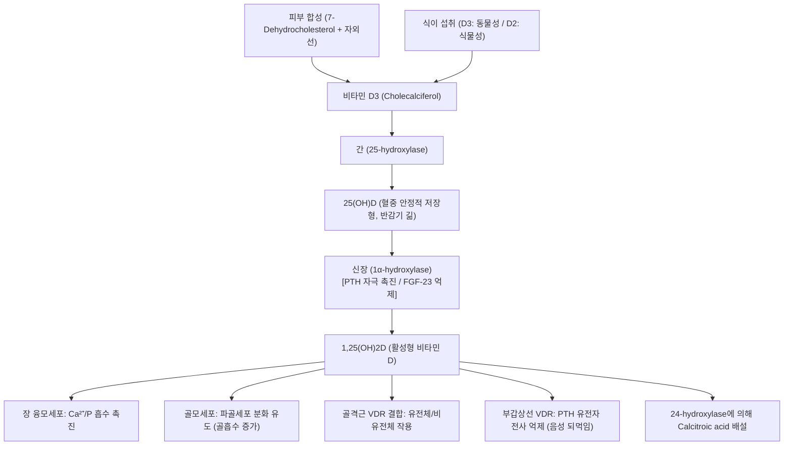
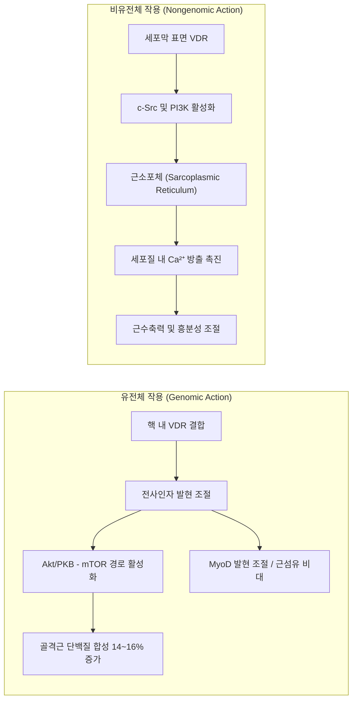
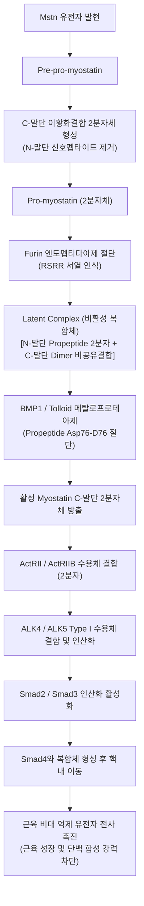
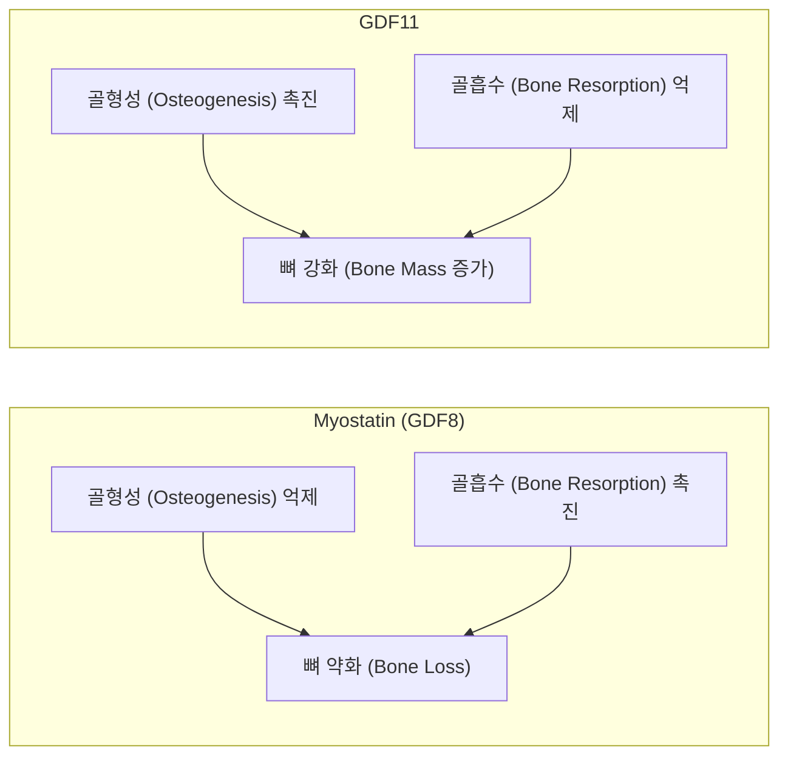
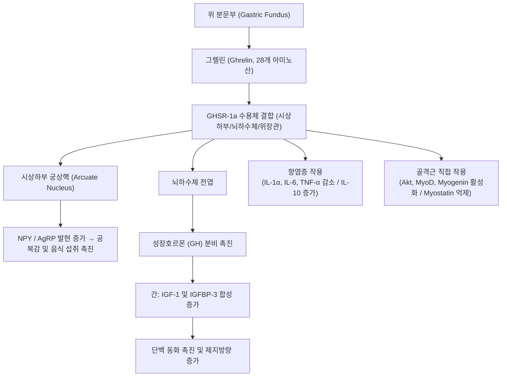
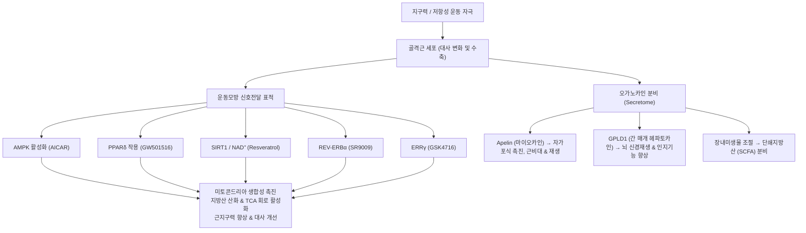

# 📑 [근감소증] PART 8 근감소증의 약물 치료 (Ch38~41)

> **핵심 요약 (Key Summary)**
> 1. **호르몬 제제([[Hormonal Agents]])의 한계와 가능성**: 대규모 무작위 배정 대조군 임상시험(ViDA, D-Health, VITAL) 결과 단순 [[비타민 D]] 보충은 낙상·골절·사망 예방에 유의미한 이득이 없었으나, 활성형 비타민 D(Eldecalcitol)는 당뇨 전단계 환자의 [[근감소증]] 발생을 유의하게 억제(HR 0.51)했다. [[테스토스테론]]은 사지제지방량과 하지 근력을 증가시키나 신체기능 개선은 입증하지 못했고 TRAVERSE 연구에서 골절 위험 증가(HR 1.43)가 보고되었으며, 대안으로 조직선택적 [[SARM]](Enobosarm 등) 및 폐경 여성 대상 티볼론([[Tibolone]]) 연구가 진행 중이다.
> 2. **[[마이오스타틴(Myostatin)]]과 [[TGF-β]] 신호 억제**: 골격근 성장의 강력한 음성 조절자인 [[마이오스타틴]](GDF8)은 Furin과 BMP1/tolloid 메탈로프로테아제의 순차 절단을 통해 활성화되어 ActRIIB-ALK4/5-Smad2/3 경로로 근비대를 억제한다. 최신 연구는 [[마이오스타틴]] 전신 혈액보다 국소 조직 농도(오토크라인/파라크라인)에 의해 주로 제어됨을 규명했다. 항체 및 수용체 트랩 제제([[Bimagrumab]] 등)는 현저한 근육량 증가와 체지방 감소를 유도해 당뇨·[[비만]] 등 대사질환으로 개발 영역이 확장되고 있으나, 골형성을 촉진하는 [[GDF11]] 동시 차단에 따른 [[골다공증]]·골절 위험에 유의해야 한다.
> 3. **[[그렐린(Ghrelin)]] 및 심혈관·신경근 표적 신약 후보**: 경구 [[그렐린]] 수용체 작용제인 [[아나모렐린(Anamorelin)]]은 악성종양 악액질([[Cachexia]])에서 [[제지방량]] 체중을 개선하여 일본에서 승인되었으나 악력 개선 효과는 미흡했다. [[ACEI]]([[안지오텐신]] 전환효소 억제제)는 Type I 근섬유 전환, 항염증, 혈관신생 및 [[IGF-1]] 조절을 통해 근육 보존 기전을 가지나 LACE RCT 등에서는 기능 개선에 한계를 보였다. 이 외에도 동화/이화 균형을 조절하는 [[Espindolol]], [[속근]] 트로포닌 활성제([[Tirasemtiv]]), 멜라노코르틴 수용체([[MC4R]]) 길항제가 다각도로 탐색되고 있다.
> 4. **[[운동모방약물(Exercise Mimetics)]]과 마이오카인 패러다임**: 현대의 운동 결핍 및 신체적 제한 고령자를 위해 운동의 생리학적 효과를 약리학적으로 재현하는 운동모방약물이 주목받고 있다. [[AMPK]] 활성제(AICAR), [[PPARδ]] 작용제(GW501516), [[SIRT1]] 활성제(Resveratrol), REV-ERBα 작용제(SR9009), ERRγ 작용제(GSK4716)는 미토콘드리아 생합성과 산화 대사를 증진시킨다. 아울러 운동 유래 마이오카인인 [[Apelin]](근비대 및 자가포식 촉진)과 운동 혈장 분비 단백질 [[GPLD1]](뇌 신경재생 및 인지기능 개선) 등 생체유래 바이오로직스 기반 혁신 치료제가 차세대 파이프라인으로 대두되고 있다.

---

## 📌 목차
1. [Chapter 38. 호르몬 제제](#chapter-38-호르몬-제제)
   - [1.1 비타민 D 대사 및 항상성 조절 축](#11-비타민-d-대사-및-항상성-조절-축)
   - [1.2 비타민 D와 골격근: 분자 생물학적 작용 경로](#12-비타민-d와-골격근-분자-생물학적-작용-경로)
   - [1.3 비타민 D 임상연구 고찰 (콜레칼시페롤 vs 활성형)](#13-비타민-d-임상연구-고찰-콜레칼시페롤-vs-활성형)
   - [1.4 남성호르몬(안드로겐)과 골격근 대사 조절](#14-남성호르몬안드로겐과-골격근-대사-조절)
   - [1.5 남성호르몬 임상연구 및 선택적 안드로겐 수용체 조절제(SARM)](#15-남성호르몬-임상연구-및-선택적-안드로겐-수용체-조절제sarm)
   - [1.6 여성호르몬(에스트로겐)과 골격근 대사](#16-여성호르몬에스트로겐과-골격근-대사)
   - [1.7 여성호르몬 임상연구 및 티볼론(Tibolone)](#17-여성호르몬-임상연구-및-티볼론tibolone)
2. [Chapter 39. Myostatin](#chapter-39-myostatin)
   - [2.1 Myostatin의 발견과 생물학적 기능](#21-myostatin의-발견과-생물학적-기능)
   - [2.2 Myostatin 발현 패턴에 따른 근육조직의 크기 변화](#22-myostatin-발현-패턴에-따른-근육조직의-크기-변화)
   - [2.3 Myostatin의 활성화 과정 (전구체에서 활성 2분자체까지)](#23-myostatin의-활성화-과정-전구체에서-활성-2분자체까지)
   - [2.4 Myostatin의 수용체 신호전달체계 (ActRII-ALK-Smad)](#24-myostatin의-수용체-신호전달체계-actrii-alk-smad)
   - [2.5 Myostatin: 국소효과 vs. 전신효과 (Cre-LoxP 검증)](#25-myostatin-국소효과-vs-전신효과-cre-loxp-검증)
   - [2.6 근육비대의 발생 기전: 세포 수(Hyperplasia) vs 크기(Hypertrophy)](#26-근육비대의-발생-기전-세포-수hyperplasia-vs-크기hypertrophy)
   - [2.7 Myostatin과 GDF11이 골형성에 미치는 상반된 영향](#27-myostatin과-gdf11이-골형성에-미치는-상반된-영향)
   - [2.8 Myostatin 억제를 통한 근육 증가 약물 개발사 (중화항체에서 Bimagrumab까지)](#28-myostatin-억제를-통한-근육-증가-약물-개발사-중화항체에서-bimagrumab까지)
   - [2.9 결론 및 임상 적용 시 주의사항](#29-결론-및-임상-적용-시-주의사항)
3. [Chapter 40. 그렐린 외 기타약제](#chapter-40-그렐린-외-기타약제)
   - [3.1 그렐린(Ghrelin) 수용체 작용제 및 신호전달](#31-그렐린ghrelin-수용체-작용제-및-신호전달)
   - [3.2 합성 그렐린 리간드 및 아나모렐린(Anamorelin) 임상시험](#32-합성-그렐린-리간드-및-아나모렐린anamorelin-임상시험)
   - [3.3 심혈관계 관련 약제: 안지오텐신 II 전환효소 억제제 (ACEI)](#33-심혈관계-관련-약제-안지오텐신-ii-전환효소-억제제-acei)
   - [3.4 복합 아드레날린 수용체 조절제: Espindolol](#34-복합-아드레날린-수용체-조절제-espindolol)
   - [3.5 속근 트로포닌 활성제: Tirasemtiv & Reldesemtiv](#35-속근-트로포닌-활성제-tirasemtiv--reldesemtiv)
   - [3.6 멜라노코르틴-4 수용체(MC4R) 길항제](#36-멜라노코르틴-4-수용체mc4r-길항제)
4. [Chapter 41. 운동모방약물의 임상적용과 실무 전략](#chapter-41-운동모방약물의-임상적용과-실무-전략)
   - [4.1 운동모방약물(Exercise Mimetics)의 임상적 필요성](#41-운동모방약물exercise-mimetics의-임상적-필요성)
   - [4.2 운동 효과를 유도하는 생체유래인자 (마이오카인 & 장내미생물)](#42-운동-효과를-유도하는-생체유래인자-마이오카인--장내미생물)
   - [4.3 운동효과물질 및 건강노화 의약품 시장 개발 현황](#43-운동효과물질-및-건강노화-의약품-시장-개발-현황)
   - [4.4 주요 분자 표적군별 운동모방약물 작용 메커니즘](#44-주요-분자-표적군별-운동모방약물-작용-메커니즘)
5. [출처 및 참고 문헌 (References)](#5-출처-및-참고-문헌-references)

---

## Chapter 38. 호르몬 제제
- **저자**: 홍남기 (연세대학교 의과대학)
- **영문 제목**: Hormonal Agents
- **주요 내용**: [[비타민 D]] 대사 및 골격근 분자 경로, 콜레칼시페롤 및 활성형 비타민 D 임상시험, 남성호르몬([[테스토스테론]])의 근육 대사 조절 및 안전성 이슈(심혈관·골절), 선택적 [[안드로겐]] 수용체 조절제(SARM), 여성호르몬([[에스트로겐]])의 골격근 영향 및 티볼론(Tibolone).

### 1.1 비타민 D 대사 및 항상성 조절 축
- **체내 합성 및 식이 섭취**:
  - **피부 합성**: 체내 대부분의 비타민 D는 간에서 합성된 7-dehydrocholesterol이 피부에서 자외선(태양에너지)을 흡수하여 [[비타민 D]] 전구물질로 전환된 후, 체온에 의해 [[비타민 D3]](콜레칼시페롤, Cholecalciferol)로 전환된다.
  - **식이 섭취**: 동물성 식품(연어, 고등어, 참치, 대구 간유 등)을 통해 [[비타민 D]]3를 섭취하며, 식물성 식품을 통해 비타민 D2(에르고칼시페롤, Ergocalciferol)를 흡수한다.
  - **저장 및 전환**: 혈액 내에서 비타민 D 결합단백질(Vitamin D Binding Protein, DBP)과 결합하여 순환하다가 지방조직에 저장되거나, 간에서 25-히드록시비타민D($\text{25(OH)D}$)로 전환된다.
- **신장에서의 활성화 및 되먹임 기전**:
  - 생물학적 비활성 상태인 $\text{25(OH)D}$는 신장에서 $1\alpha\text{-hydroxylase}$에 의해 활성형 비타민 D인 $1,25\text{-dihydroxyvitamin D}$($\text{1,25(OH)}_2\text{D}$, Calcitriol)로 전환된다.
  - **부갑상선호르몬(PTH)**: 혈중 [[칼슘]] 농도 저하 시 분비된 PTH는 신장의 $1\alpha\text{-hydroxylase}$를 자극하여 $\text{1,25(OH)}_2\text{D}$ 전환을 유도한다. 생성된 활성형 비타민 D는 장 융모세포의 VDR에 결합하여 [[칼슘]] 인의 흡수를 촉진하고, 조골세포(osteoblast)를 자극하여 파골세포(osteoclast) 분화를 유도(골흡수 촉진), 신장 원위세뇨관에서 칼슘 재흡수를 촉진한다.
  - **음성 되먹임(Negative Feedback)**: 충분해진 $\text{1,25(OH)}_2\text{D}$는 부갑상선 VDR에 결합하여 PTH 전사를 직접 억제한다.
  - **FGF-23(Fibroblast Growth Factor-23)**: 혈중 인산 농도 조절 인자로 신장의 $1\alpha\text{-hydroxylase}$를 억제하여 활성형 전환을 차단한다.
  - **배설**: 역할을 다한 활성형 비타민 D는 $24\text{-hydroxylase}$에 의해 calcitroic acid로 분해되어 담즙으로 배설된다.
  - **임상적 평가 지표**: 혈중 $\text{25(OH)D}$ 농도는 활성형 $\text{1,25(OH)}_2\text{D}$보다 약 1,000배 높으며, 반감기가 길고 일중 변동이 적어 비타민 D 체내 저장 상태를 반영하는 표준 측정 지표로 활용된다.

---

### 1.2 비타민 D와 골격근: 분자 생물학적 작용 경로
골격근 세포에서 [[비타민 D]]는 핵 내 수용체를 통한 **유전체 작용(Genomic Action)**과 세포막 표면 수용체를 통한 **비유전체 작용(Nongenomic Action)**의 두 가지 경로로 작용한다.

#### (1) 증식(Proliferation)과 분화(Differentiation)
- **동물 연구**: [[비타민 D]] 결핍 식이는 골격근 증식 인자(BMP family, FGF-2)를 감소시키고, 분화 및 근위축 지표(Myf5, Myostatin, E3-ubiquitin ligase, MuRF-1)를 증가시킨다.
- **수용체(VDR) 발현 논쟁**: 중년 및 노인 여성의 근섬유 핵에서 VDR 발현이 확인되었고 연령 증가에 따라 감소하는 경향을 보인다. 반면, 일부 연구에서는 근모세포(myoblast)와 관상근세포(myotube)에서는 발현되나 성숙 골격근 조직에서는 직접 발현되지 않는다는 보고도 있어 항체 및 측정 기법에 따른 차이를 인지해야 한다.
- **지방세포 분화 억제**: C2C12 세포주 실험에서 저농도 $\text{1,25(OH)}_2\text{D}$는 지방세포 분화(adipogenesis: [[PPAR]]γ2, FABP4 발현)를 촉진한 반면, 고농도는 지방 분화를 억제했다. 골격근 내 [[중성지방]](triacylglycerol) 축적은 [[인슐린]] 저항성, 근기능 저하와 직결된다.

#### (2) 단백 합성 및 근섬유 크기
- [[비타민 D]] 결핍은 MyoD mRNA 발현을 억제한다.
- $\text{1,25(OH)}_2\text{D}$ 처치는 Akt/PKB 및 [[mTOR]] 신호전달 경로를 활성화하여 골격근 단백질 합성을 **14~16% 증가**시킨다.
- C2C12 근세포에 10일간 처리 시 근섬유 두께는 평균 2배, 길이는 2.5배 비대해짐이 관찰되었다.

#### (3) 미토콘드리아 산화 대사
- [[비타민 D]]는 TCA cycle, 산화적 인산화(oxidative phosphorylation) 및 전자전달계(electron transport chain) 유전자 발현을 자극한다.
- 인간 일차 골격근세포에서 [[비타민 D]] 48시간 처리 시 VDR 농도 의존적으로 미토콘드리아 산소 소모율(oxygen consumption rate)이 유의하게 증가했다.

#### (4) 유전체 및 비유전체 신호전달 경로
- **유전체 작용**: 인간 근육 생검에서 혈청 [[비타민 D]] 농도는 [[TGF-β]] 및 Myostatin의 전사 조절인자(transcriptional activators/repressors)와 양의 상관관계를 보였으며, VDR/Akt 경로를 통해 caspase 활성을 억제하여 세포사멸을 방지한다.
- **비유전체 작용**: 세포형질막 VDR 결합 후 c-Src 및 PI3K 신호전달을 경유하여 근소포체(sarcoplasmic reticulum)로부터 $\text{Ca}^{2+}$을 방출시켜 세포 내 [[칼슘]] 농도를 급격히 상승시킨다.

---

### 1.3 비타민 D 임상연구 고찰 (콜레칼시페롤 vs 활성형)

#### (1) 콜레칼시페롤(영양소 비타민 D3) 대규모 RCT 결과
기존 관찰 연구에서는 낮은 혈청 $\text{25(OH)D}$ 농도가 [[근감소증]], 낙상, 골절, 심혈관 질환과 밀접한 연관성을 보였으나, 최근의 대규모 무작위 배정 이중맹검 위약대조군 임상시험들은 낙상 및 골절 예방 효과를 입증하지 못했다.

> **표 38-1. [[비타민 D]] 주요 대규모 임상시험 요약**

| 연구명 | 대상자 | 연구 디자인 | 투약 프로토콜 | 주요 결과 요약 | 문헌 출처 |
| :--- | :--- | :--- | :--- | :--- | :--- |
| **ViDA trial** | 50~84세 성인 5,110명 (뉴질랜드) | RCT, 이중맹검, 위약대조 (2.5~4.2년 추적) | 경구 Vitamin D3 100,000 IU/월 (n=2,558) vs 위약 (n=2,552) | • **낙상 위험비**: HR 0.99 (95% CI 0.92-1.07) • **골절 위험비**: HR 1.19 (95% CI 0.94-1.50, p=0.15) → 위약군 대비 유의한 차이 없음 | *Lancet Diabetes Endocrinol* 2017;5:438-447 |
| **D-Health trial** | 60세 이상 성인 21,315명 (호주) | RCT, 이중맹검, 위약대조 (5년 추적) | 경구 Vitamin D3 60,000 IU/월 (n=10,662) vs 위약 (n=10,653) | • **전체 사망**: HR 1.04 (95% CI 0.93-1.18, p=0.47) • **낙상 오즈비**: OR 1.02 (95% CI 0.95-1.10) • 심혈관·암 연관 사망률도 차이 없음 | *Lancet Diabetes Endocrinol* 2022;10:120-128 / *JCSM* 2021 |
| **VITAL trial** | 50세 이상 남성, 55세 이상 여성 25,871명 (미국) | RCT ($2 \times 2$ 팩토리얼), 위약대조 (중위수 5.3년) | 경구 Vitamin D3 2,000 IU/일 (n=12,927) vs 위약 (n=12,944) | • **2회 이상 낙상률**: 9.8% vs 9.4% (OR 0.97, p=0.50) • **골절 위험비**: HR 0.98 (95% CI 0.89-1.08, p=0.70) • 기저 25(OH)D 농도(50 nmol/L 기준) 하위분석서도 차이 없음 | *N Engl J Med* 2019;380:33-44 / *NEJM* 2022;387:299-309 |

- **메타분석 결론**: 75,454명이 포함된 52개 RCT 메타분석에서도 콜레칼시페롤 보충은 사망률 감소에 유의한 영향을 미치지 못했다(RR 0.98, 95% CI 0.95-1.02). 따라서 현재 가이드라인은 일반적인 낙상·골절 예방만을 목적으로 한 일률적 콜레칼시페롤 고용량 보충을 지지하지 않는다.

#### (2) 활성형 비타민 D 요법의 가능성
- **Eldecalcitol RCT (일본, 2024)**: [[당뇨병]] 전단계 성인 1,094명(평균 60.8세)을 대상으로 2.9년간 엘데칼시톨을 투여한 결과, 악력 및 사지제지방량 감소로 정의한 **[[근감소증]] 발생 위험을 유의하게 49% 감소**시켰다(HR 0.51, 95% CI 0.31-0.83, p=0.006).
- **임상적 고려**: 활성형 제제 사용 시 고칼슘혈증, 고칼슘뇨증, 요로결석 등 잠재적 대사 합병증에 대한 엄밀한 모니터링이 필수적이다.

---

### 1.4 남성호르몬(안드로겐)과 골격근 대사 조절
- **생체 이용률과 노화에 따른 감퇴**:
  - 남성 [[테스토스테론]]의 54~68%는 알부민과 결합하고, 30~44%는 성호르몬결합글로불린([[SHBG]])과 결합하며, 오직 0.5~3%만이 유리형(Free testosterone)으로 존재한다.
  - **생체이용가능 [[테스토스테론]](Bioavailable testosterone)**: 유리형 + 알부민 결합형.
  - 30세 이후 혈청 총 테스토스테론은 매년 1%, 생체이용가능 테스토스테론은 매년 2%씩 감소하여 60세 이상의 20%, 80세 이상의 50%가 생식선저하증(Hypogonadism) 상태에 놓인다.
- **분자 작용 메커니즘**:
  - **단백 동화 촉진**: [[안드로겐]] 수용체(AR) 결합을 통한 유전체 작용과 더불어 비유전체적으로 **PI3K/Akt 경로**를 활성화한다.
  - Akt는 [[mTOR]]를 자극하여 p70S6K 및 eIF4E를 활성화해 단백질 합성을 폭발적으로 증가시킨다.
  - 동시에 Akt는 전사인자 **FoxO의 핵 내 이동을 억제**하여 근위축 유전자인 Atrogin-1 및 MuRF-1 발현을 차단한다.
  - Notch 신호 조절을 통한 근육위성세포(Satellite cells) 증식, 미토콘드리아 산화 대사 개선 및 전신 염증 억제를 매개한다.
- **유전자 변형 마우스 모델(mARKO)**:
  - 전신 AR 결손 수컷 쥐는 근육량과 근력이 급감한다.
  - 골격근 특이적 AR 결손 모델(MCK-cre, HSA-cre): 순수 근육량 자체의 감소폭은 제한적이었으나, HSA-cre 모델에서 심각한 근력 저하, 근육원섬유마디(sarcomere) 정렬 이상, 골격근 내당능 장애 및 [[지방산]] 대사 이상, 근섬유 괴사가 확인되었다.

---

### 1.5 남성호르몬 임상연구 및 선택적 안드로겐 수용체 조절제(SARM)

> **표 38-2. 남성호르몬 주요 임상시험 요약**

| 연구명 | 대상자 | 투약 및 기간 | 주요 임상 결과 | 문헌 출처 |
| :--- | :--- | :--- | :--- | :--- |
| **TOM Trial (Mobility Limitations)** | 65세 이상 남성 165명 ([[테스토스테론]] 100~350 ng/dL) | [[테스토스테론]] 젤 10 g/일 vs 위약 (6개월) | • 사지제지방량 +0.9 kg 개선 (p<0.001) • 하지근력 6.2% 증가 • **신체기능(SPPB, 보행속도) 개선은 유의차 없음** | *J Gerontol A* 2011;66:1090-1099 |
| **Kenny et al.** | 평균 77세 남성 131명 (골절력/골감소증 동반 frailty) | 테스토스테론 젤 vs 위약 (12~24개월) | • 사지제지방량 +1.3% vs -1.0% (p=0.016) • 요추 골밀도 3.25% 증가 • **신체기능 개선 효과 유의차 없음** | *J Am Geriatr Soc* 2010;58:1134-1143 |
| **TEAAM Trial** | 60세 이상 남성 256명 (테스토스테론 100~400 ng/dL) | 테스토스테론 1% 젤 7.5 g/일 vs 위약 (36개월) | • [[제지방량]] +0.9 kg 증가 (95% CI 0.5-1.4) • Chest-press 근력 +16.3 N 개선 • 계단오르기 파워 개선 확인 | *J Clin Endocrinol Metab* 2017;102:583-593 |
| **The Testosterone Trials (T-Trials)** | 65세 이상 남성 790명 (테스토스테론 <275 ng/dL) | 테스토스테론 1% 젤 5 g/일 vs 위약 (12개월) | • 성기능 및 우울감 유의미한 개선 (p<0.001) • **[[6분 보행검사]](신체기능) 개선 유의차 없음** (p=0.25) | *N Engl J Med* 2016;374:611-624 |
| **TRAVERSE Trial (대규모 안전성 RCT)** | 45~80세 심혈관 위험 보유 남성 5,246명 (<300 ng/dL) | 테스토스테론 1.62% 젤 vs 위약 (평균 21.7개월) | • **주요 심혈관사건([[MACE]])**: 7.0% vs 7.3% (비열등성 만족) • **부작용 증가**: 심방세동, [[급성신손상]], 폐색전증 발생률 상승 • **골절 위험 증가**: 3.50% vs 2.46% (HR 1.43, 95% CI 1.04-1.97) | *N Engl J Med* 2024;390:203-211 |

- **임상적 한계 및 안전성 우려**: 테스토스테론 보충은 근육량과 근력을 일정 부분 증가시키지만, 낙상·골절 예방이나 보행속도 등 실질적 신체기능 개선 효과는 불명확하다. 특히 적혈구증가증, [[여드름]], 하지부종, 수면무호흡증, 전립선 질환 악화뿐만 아니라 TRAVERSE 연구에서 나타난 낙상 후 골절 위험 증가(HR 1.43)에 유의해야 한다.
- **선택적 [[안드로겐]] 수용체 조절제([[SARM]])**:
  - 근육과 뼈에는 작용제(agonist)로 작용하면서 전립선, 모낭 등에는 영향을 주지 않도록 설계된 비스테로이드성 리간드이다.
  - **파이프라인**: Enobosarm (GTx-024), MK-0773, LGD-4033, GSK2881078.
  - 소규모 임상에서 [[제지방량]] 증가 및 체지방 감소가 보고되었으나, 확증적 신체기능 개선은 미입증 상태이다.
  - **근감소성 [[비만]] 병용 전략**: 최근 [[GLP-1 수용체 작용제]] 치료 중 발생하는 급격한 제지방 손실을 방어하기 위해 **[[GLP-1]] 작용제 + Enobosarm 병용 2상 임상**이 진행 중이다. 간독성 및 [[심부전]] 우려가 있어 정밀한 안전성 검증이 요구된다.

---

### 1.6 여성호르몬(에스트로겐)과 골격근 대사
- **폐경과 골격근 변화**: 여성은 폐경 후 급격한 [[에스트로겐]] 고갈로 인해 골밀도 급감, 체지방 증가, 골격근량 및 근력 저하를 겪는다. [[난소]] 절제(OVX) 동물모델에서 뚜렷한 근위축과 속근섬유(Type II) 위주의 변성이 나타나며 [[에스트로겐]] 보충으로 회복된다.
- **수용체 아형별 특이적 기능**:
  - **$ER\alpha$(Estrogen Receptor Alpha)**: 골격근 선택적 결손 시 근력 저하가 두드러지며, 에스트라디올($E_2$)이 근수축력을 조율하는 주 수용체이다.
  - **$ER\beta$(Estrogen Receptor Beta)**: 골격근 결손 시 근육량이 감소하며, 특히 위성세포(satellite cells)에서 $ER\beta$ 결손 시 세포자멸사 증가로 근육 재생능이 고갈된다.
- 에스트로겐은 염증성 [[사이토카인]] 억제하여 위성세포의 생존을 도모하고 근육 회복 환경을 조성한다.

---

### 1.7 여성호르몬 임상연구 및 티볼론(Tibolone)
- **코호트 및 대규모 임상 결과**:
  - **SWAN 코호트 (563명)**: 폐경 이행기 악력 감소는 -0.94 kg 수준으로 임상적 크기가 미미했다.
  - **WHI (Women's Health Initiative) 하위분석 (835명)**: 호르몬 대체요법(HRT) 투약 초기 3년 동안은 [[제지방량]] 보존 효과가 나타났으나, 이후 3년간 호르몬군에서 제지방 손실 속도가 가속되어 초기 이득이 완전히 상쇄되었다.
  - **2019년 메타분석 (12개 RCT, 4,474명)**: 위약 대비 제지방량 변화 차이는 -0.06 kg(95% CI -0.05 ~ +0.18, p=0.26)으로 통계적 유의성이 없었다.
  - 따라서 단순 [[근감소증]] 치료만을 목적으로 한 일상적 [[에스트로겐]] 보충은 권장되지 않는다.
- **티볼론([[Tibolone]]) (선택적조직 에스트로겐활성조절제, STEAR)**:
  - [[에스트로겐]], 프로게스토겐, [[안드로겐]] 활성을 복합적으로 지닌 합성 스테로이드제.
  - 폐경 여성 85명 대상 12개월 RCT 결과: 위약 대비 **악력 0.99 kg 증가**(95% CI 0.1-1.9, p=0.04)를 보였으나, 무릎 신전력에는 차이가 없었다. 내장지방 감소 가능성이 제시되었으나 추가 대규모 검증이 요구된다.

---

## Chapter 39. Myostatin
- **저자**: 이윤실 (서울대학교 약학대학)
- **영문 제목**: Myostatin
- **주요 내용**: Myostatin(GDF8)의 발견과 활성화 캐스케이드(Furin, BMP1), 신호전달 경로(ActRIIB/ALK/Smad), 국소 vs 전신 작용(Cre-LoxP Cdx2 모델), 근비대 양상(Hyperplasia vs Hypertrophy), Myostatin과 GDF11의 상반된 뼈 대사 조절, 치료제 개발사([[ACE]]-031의 출혈 부작용, Bimagrumab의 대사질환 전환).

### 2.1 Myostatin의 발견과 생물학적 기능
- **발견 역사**: [[TGF-β]] 슈퍼패밀리에 속하는 성장/분화인자(GDFs) 중 하나로, 1997년 존스홉킨스 의과대학의 **이세진(Se-Jin Lee) 교수** 연구진이 신체 크기 대비 장기 크기 조절 기전을 탐색하던 중 발굴했다.
- **GDF8 결손 마우스**: GDF8 유전자를 녹아웃시킨 생쥐의 골격근량이 대조군 대비 **2배 이상 폭발적으로 비대**해지는 현상을 확인하고, 근육(Myo) 성장을 억제(statin)한다는 의미에서 **[[마이오스타틴(Myostatin)]]**이라 명명했다.
- **자연계 돌연변이**: 근육이 비정상적으로 과발달한 Belgian Blue 소, Piedmentese 소, Whippet 경주견, 특정 소아 환자에서 [[마이오스타틴]] 유전자 기능상실(loss-of-function) 돌연변이가 확인되었다. 최근에는 양, 돼지 등 형질전환 가축 생산에도 응용되고 있다.

> ![[Sarcopenia_Ch39_p512_Fig1.png|540]]
> **그림 39-1. Myostatin 유전자 돌연변이로 인한 근육비대.** (A) Myostatin 유전자가 제거된 마우스. (B) Myostatin 유전자에 돌연변이를 가지고 태어난 아이. (C) Belgian Blue 소. (D) 경주용으로 사육되는 견종. (E) Myostatin 유전자가 변형된 양. (F) Myostatin 유전자가 변형된 돼지.

---

### 2.2 Myostatin 발현 패턴에 따른 근육조직의 크기 변화
- **발현 부위**: 주로 골격근에서 고발현되며, 일부 지방세포에서도 발현되어 혈액 내로 분비된다.
- **결손 시점에 따른 근비대 양상**:
  - **발생기 전신 결손($Mstn^{-/-}$)**: 근육세포 수의 증가인 **과다형성([[Hyperplasia]])**과 세포 크기의 증가인 **비대([[Hypertrophy]])**가 동시에 발생한다.
  - **성체기 유도 결손(Tamoxifen-inducible Cre; $Mstn^{\text{flox/flox}}$)**: 발생기가 지난 성체에서는 주로 근세포의 **비대(Hypertrophy)**만 관찰된다.
- **조직 특이적 결손**:
  - 근세포 특이적 결손($\text{MLC-Cre}$; $Mstn^{\text{flox/flox}}$): 전반적인 골격근 비대 유도.
  - 심근 특이적 결손($\text{Nkx2.5-Cre}$; $Mstn^{\text{flox/flox}}$): 평상시에는 골격근에 영향이 없으나, [[심부전]] 유발 시 동반되는 2차적 골격근 위축(Cardiac cachexia)을 현저히 억제한다.

---

### 2.3 Myostatin의 활성화 과정 (전구체에서 활성 2분자체까지)
[[마이오스타틴]] 합성 직후 활성을 띠지 않으며, 두 단계의 정교한 효소 절단 과정을 거쳐야 비로소 수용체에 결합할 수 있다.

1. **2분자체 형성 및 신호펩타이드 절단**: 두 개의 전구단백질이 C-말단의 이황화결합(disulfide bond)을 통해 호모다이머(pro-myostatin)를 형성하고 소포체 통과 시 N-말단 신호펩타이드가 제거된다.
2. **Furin에 의한 1차 절단**: Furin 엔도펩티다아제가 특정 보존 서열인 **$\text{Arg-Ser-Arg-Arg (RSRR)}$**을 인식하여 절단한다. 이로 인해 N-말단 프로펩타이드(Propeptide)와 C-말단 2분자체(C-terminal dimer)로 나뉜다.
3. **잠재 복합체(Latent Complex) 형성**: 절단된 후에도 프로펩타이드와 C-말단 2분자체가 강한 비공유결합으로 묶여 있어 활성이 차단된 **Latent Complex** 상태로 혈액 및 조직에 머문다.
4. **BMP1/Tolloid 메탈로프로테아제에 의한 활성화**: Metalloproteinase인 **BMP1(또는 TLD, TLL1, TLL2)**이 프로펩타이드의 **76번째 아미노산인 아스파르트산(Aspartate, Asp76, D76)** 직전을 특이적으로 절단한다. 분해된 프로펩타이드가 해리되면서 마침내 생물학적 활성을 지닌 **C-말단 2분자체(Mature Myostatin)**가 방출된다.
   - **$Mstn^{\text{D76A}}$ 변이 마우스**: 76번 잔기를 Alanine으로 치환하여 BMP1 절단을 차단하면 마이오스타틴이 latent complex에 갇혀 활성화되지 못하므로, $Mstn^{-/-}$ 마우스와 동일한 극적인 근육비대가 발생한다.

> ![[Sarcopenia_Ch39_p514_Fig1.png|540]]
> **그림 39-2. Myostatin의 활성화 과정.** 두 개의 myostatin 전구물질이 C말단의 이황화결합에 의해 2분자체를 이루고, N말단의 신호펩타이드는 잘려나간다(pro-myostatin)(A). 그 후, furin에 의해 N말단의 프로펩타이드와 C말단의 C말단 2분자체로 나뉘게 되는데, 이때 생성된 물질은 latent complex로 여전히 비활성상태이다(B). 프로펩타이드가 BMP1에 의해 분해되면(C), 분해된 프로펩타이드가 latent complex에서 떨어져 나오면서 C말단 2분자체가 비로소 활성화된다(D).

---

### 2.4 Myostatin의 수용체 신호전달체계 (ActRII-ALK-Smad)
- **수용체 결합 복합체**:
  - 활성화된 [[마이오스타틴]] C-말단 2분자체는 2개의 **Activin Type II 수용체(ACVR2 또는 ACVR2B)**와 우선 결합한다.
  - 이 복합체는 연이어 2개의 **Activin Type I 수용체(ALK4 또는 ALK5)**를 끌어들여 4량체 수용체 복합체를 형성하고, Type II 수용체가 Type I 수용체를 인산화한다.
- **세포 내 신호 전달**:
  - 활성화된 Type I 수용체는 세포질의 **Smad2 및 Smad3**를 인산화한다.
  - 인산화된 Smad2/3는 **Smad4**와 다량체 복합체를 형성하여 핵 내로 전위된다.
  - 핵 내에서 근비대를 억제하고 단백질 분해를 촉진하는 타깃 유전자 전사를 유도한다.
- **내인성 길항 단백질(Endogenous Antagonists)**:
  - 분리된 프로펩타이드 외에도 **Follistatin, FSTL3, GASP1, GASP2, Decorin, LTBP3** 등은 [[마이오스타틴]] Type II 수용체에 결합하는 것을 물리적으로 차단하여 근육 성장을 유도한다.

> ![[Sarcopenia_Ch39_p516_Fig1.png|540]]
> **그림 39-3. Myostatin의 신호전달 과정.** Myostatin C말단 2분자체가 두 개의 activin type II 수용체에 먼저 결합한 후 두 개의 activin type I 수용체와 추가로 결합하면서 세포 내 신호전달이 시작된다. 이 과정에서 인산화된 activin type I 수용체가 Smad 2, 3을 인산화시키고, 인산화된 Smads가 핵 속으로 이동하여 근육비대를 억제하는 유전자들의 발현을 촉진시키는 것으로 근육성장을 조절한다. 프로펩타이드를 포함한 다양한 내인성 단백질들이 myostatin이 수용체와 결합하는 것을 방해하여 신호전달을 억제할 수 있다.

---

### 2.5 Myostatin: 국소효과 vs. 전신효과 (Cre-LoxP 검증)
- **혈중 농도와 근감소증의 역설**: 초기에는 혈중 [[마이오스타틴]] 전신 근육을 위축시킬 것이라 추정했으나, 실제로는 **근육량이 많은 건강한 젊은 층에서 혈중 [[마이오스타틴]] 농도가 더 높고**, [[테스토스테론]] 근육이 증가하면 혈중 농도도 비례하여 증가한다. 즉, 마이오스타틴은 근육량 증가에 비례하여 분비되는 음성 되먹임 조절 인자(**샬론, Chalone**)로 작용한다.
- **Cdx2-Cre; $Mstn^{\text{flox/flox}}$ 마우스 실험 (이윤실 교수 연구팀)**:
  - 두 개체의 혈관을 연결하는 개체연결법(parabiosis)의 윤리적·기술적 한계를 극복하기 위해, 배꼽 아래 조직에서만 마이오스타틴을 특이적으로 제거한 마우스 모델을 구축했다.
  - 상체(배꼽 위): 국소 농도 100%, 전신 혈액 농도 50% $\rightarrow$ 근육량은 정상(WT)과 동일.
  - 하체(배꼽 아래): 국소 농도 0%, 전신 혈액 농도 50% $\rightarrow$ **혈중 농도가 절반 수준으로 순환함에도 불구하고 전신 결손($Mstn^{-/-}$$) 쥐에 육박하는 80% 이상의 극적인 근비대 발생**.
  - **결론**: 마이오스타틴은 순환 혈액을 통한 내분비(endocrine) 작용보다 **골격근 국소 조직에서 분비되어 자가/주변분비(autocrine/paracrine)로 작용하는 영향력이 절대적**이다.

> ![[Sarcopenia_Ch39_p517_Fig1.png|540]]
> **그림 39-4. Cre-LoxP system을 이용한 myostatin의 전신적 효과와 국소적 효과 비교.** 배꼽 아래 모든 조직에서만 myostatin 유전자가 제거된 Cdx2-Cre; Mstn^flox/flox의 경우, 배꼽 아래의 myostatin 국소조직농도 0%, 전신혈액농도 50%로 혈중 myostatin 농도가 wt 마우스의 50% 정도로 존재함에도 불구하고, 모든 조직에서 myostatin 유전자가 제거된 Mstn-/- 마우스(wt 대비 90% 정도의 근육증가)와 유사한 정도(wt 대비 80% 정도의 근육증가)의 근육증가가 배꼽 아래 근육에서 관찰되었다. 이러한 결과는 근육조직에서 국소적으로 발현된 myostatin이 혈액에서 전신적으로 작용하는 myostatin보다 근육성장에 더 큰 영향력을 발휘한다는 것을 뒷받침한다.

---

### 2.6 근육비대의 발생 기전: 세포 수(Hyperplasia) vs 크기(Hypertrophy)
- **$Mstn^{-/-}$ vs F66 (Follistatin 과발현) 마우스**:
  - $Mstn^{-/-}$ 쥐의 근비대: 근세포 수 증가(Hyperplasia)와 크기 증가(Hypertrophy)가 복합 작용.
  - 근세포 특이 프로모터로 Follistatin을 과발현시킨 F66 마우스: [[사춘기]](4주령)까지는 정상과 차이가 없다가 성체(10주령)에 이르러 **오직 세포 크기 비대(Hypertrophy)만으로 근육량이 2배(200%)로 폭증**.
- **F66; $Mstn^{-/-}$ 이중 교배 마우스 (근육량 400% 폭증)**:
  - F66 쥐와 $Mstn^{-/-}$ 쥐를 교배하자, 일반 생쥐 대비 **근육량이 4배(400%)로 증가**했다.
  - 이는 Follistatin이 [[마이오스타틴]] 외에도 근육 성장을 억제하는 또 다른 리간드인 **Activin A**나 **GDF11**을 추가로 차단하기 때문임을 입증한다. 특히 암 악액질([[Cancer Cachexia]]) 환자에서 Activin A의 과발현이 근위축의 핵심 인자로 대두되고 있다.

> ![[Sarcopenia_Ch39_p518_Fig1.png|540]]
> **그림 39-5. Hyperplasia vs. Hypertrophy.** Mstn-/- 마우스와 F66 마우스 모두에서 근육량이 두 배로 증가되는 것이 관찰되는데, Mstn-/- 마우스에서의 근육비대는 hyperplasia와 hypertrophy 모두 관찰되지만, F66 마우스에서는 주로 근육세포의 hypertrophy만이 관찰된다.

> ![[Sarcopenia_Ch39_p519_Fig1.png|540]]
> **그림 39-6. F66; Mstn-/- 마우스의 400% 증가된 근육.** 일반 마우스(wild type, 100%)와 비교 시, F66; Mstn-/- 마우스의 근육량이 네 배(400%)로 증가되어 있다. (참고 이미지는 Lee, 2007에서 발췌)

---

### 2.7 Myostatin과 GDF11이 골형성에 미치는 상반된 영향
[[마이오스타틴]] **GDF11**은 [[아미노산]] 서열이 89% 동일하여 신호전달체계를 공유하지만, 골대사에서는 정반대의 작용을 수행한다.

- **이윤실 교수 연구팀의 발견 (PNAS 2020)**:
  - **GDF11**: 골모세포의 조골 기능을 촉진하고 골흡수를 억제하여 뼈 형성을 유도.
  - **Myostatin**: 골형성을 억제하고 파골세포를 활성화하여 골흡수를 촉진.
  - 골형성을 주도하는 핵심 인자는 GDF11이며, [[마이오스타틴]] 결손 시 조골세포에서 GDF11 발현이 보상적으로 급증한다.
- **치료제 개발의 치명적 딜레마**:
  - Follistatin이나 ActRIIB 가용성 수용체 트랩처럼 마이오스타틴과 GDF11을 무차별적으로 동시 차단하는 약제는, 근육량은 대폭 증가시키지만 **GDF11 차단으로 인해 골밀도가 감소하고 골절 위험이 급증**한다(F66 마우스에서 잦은 골절 확인).
  - 따라서 [[근감소증]] 치료제는 **GDF11을 보존하면서 Myostatin만 선택적으로 차단하는 특이적 항체**로 개발되어야 골-근육 복합체([[Osteosarcopenia]])를 안전하게 개선할 수 있다.

> ![[Sarcopenia_Ch39_p521_Fig1.png|540]]
> **그림 39-7. Myostatin 억제 시 근육과 뼈 모두 성장이 촉진됨.** [[아미노산]] 서열 유사성이 높은 myostatin과 GDF11이 뼈 형성과 관련해서, GDF11은 뼈 형성을 촉진시키고, myostatin은 뼈 형성을 억제하는 정반대의 기능을 한다는 것이 확인되었다(A-C). GDF11과 myostatin을 모두 억제하는 follistatin이 과발현된 F66 마우스에서는 myostatin 억제로 근육은 증가되어 있지만, GDF11 억제로 뼈는 약해져 있어 골절이 자주 관찰된다(D-F). (참고 이미지는 Suh, 2020에서 발췌)

---

### 2.8 Myostatin 억제를 통한 근육 증가 약물 개발사 (중화항체에서 Bimagrumab까지)
1. **초기 중화항체 (MYO-029 / Stamulumab)**: 마우스에서 25~30% 근비대를 보였으나, 인체 근이영양증 환자 임상에서는 유의미한 근비대를 재현하지 못했다.
2. **D76A 돌연변이 Propeptide-Fc**: BMP1 분해를 차단하는 융합 단백질.
3. **수용체 세포외 도메인 트랩 (ACVR2B/Fc Soluble Receptor Trap)**:
   - **[[ACE]]-031**: ACVR2B 세포외 도메인에 Fc를 융합한 미끼 수용체. 마우스에서 40~60%의 강력한 근비대를 유도했으나, 2011년 듀센 근이영양증 소아 2상 임상에서 **모세혈관 확장으로 인한 코피(epistaxis) 및 잇몸 출혈** 부작용으로 개발이 전격 중단되었다([[TGF-β]] 패밀리 다중 억제 부작용).
   - **ACE-083**: 국소 주사제로 개발.
   - **ACE-2494**: 항약물항체(ADA) 형성으로 중단.
4. **Bimagrumab (BYM338, Novartis $\rightarrow$ Eli Lilly)**:
   - ACVR2 및 ACVR2B 수용체 세포외 결합 부위를 모두 차단하는 완전 인간 단클론항체.
   - 노인성 [[근감소증]] 환자 임상에서 [[제지방량]] 증가와 체지방 감소를 확인했으나, 표준 신체기능 검사(SPPB 등)에서는 위약 대비 우월성을 입증하지 못했다.
   - **적응증 전환(Repositioning)**: 당뇨 및 [[비만]] 환자 2상에서 뚜렷한 골격근량 증가와 함께 **체지방량의 급격한 감소 및 당대사 지표 개선**이 확인되어, 현재 Eli Lilly에서 차세대 대사질환·[[비만]] 치료제(체중 감량 시 근손실 방어)로 활발히 개발 중이다.

---

### 2.9 결론 및 임상 적용 시 주의사항
- **샤론(Chalone) 원리**: 이미 근위축이 심하게 진행된 노인은 기저 [[마이오스타틴]] 분비량 자체가 적으므로, [[마이오스타틴]] 단독 억제제만으로는 기대만큼의 극적인 근육 증대를 유도하기 어렵다.
- **발생기 vs 성인 투여의 차이**: 동물실험의 극적 효과는 배아 발생기 결손에 기인한 바가 크며, 성인 환자 투여 시에는 세포 비대 효과 위주로 제한된다.
- **다중 리간드 차단의 득실**: 근육 비대 극대화를 위해 Activin A를 차단하는 것은 유효하지만, 골형성 촉진 인자인 GDF11까지 차단할 경우 [[골다공증]] 및 적혈구 이상, 혈관 합병증을 초래하므로 표적 선택성이 핵심 성공 요인이다.

---

## Chapter 40. 그렐린 외 기타약제
- **저자**: 윤지완 (서울대학교 의과대학)
- **영문 제목**: Ghrelin and Other Agents
- **주요 내용**: [[그렐린]] 수용체 작용제(아나모렐린, MK-677), 심혈관계 약물([[ACE]] 억제제의 근육 대사 기전 및 LACE RCT), 교감신경계 조절제(Espindolol), [[속근]] 트로포닌 활성제(Tirasemtiv, Reldesemtiv), 멜라노코르틴-4 수용체(MC4R) 길항제.

### 3.1 그렐린(Ghrelin) 수용체 작용제 및 신호전달
- **호르몬 특성**: 공복 시 위 분문부(fundus) 내분비세포에서 분비되는 28개 [[아미노산]] 펩타이드.
- **수용체**: 막횡단 GPCR인 [[성장호르몬]] 분비촉진제 수용체-1a(**GHSR-1a**)에 결합한다.
- **생리적 다면 작용**:
  - **식욕 촉진**: [[시상하부]] 궁상핵(arcuate nucleus)의 Neuropeptide Y(NPY) 및 Agouti-related peptide(AgRP) 발현을 촉진하여 강력한 섭식 행동을 유도한다.
  - **GH/[[IGF-1]] 축 활성화**: 뇌하수체에서 [[성장호르몬]](GH) 분비를 자극하고, 간에서 [[IGF-1]] 및 IGFBP-3 생성을 유도하여 단백 동화를 촉진한다.
  - **항염증 및 골격근 신호**: [[IL-1]]α, [[IL-6]], TNF-α 등 전염증성 [[사이토카인]] 낮추고 [[IL-10]]을 높이며, 골격근 내에서 [[마이오스타틴]] 억제하고 Akt, MyoD, Myogenin 경로를 자극한다.

---

### 3.2 합성 그렐린 리간드 및 아나모렐린(Anamorelin) 임상시험
- **천연 [[그렐린]] 한계와 합성 리간드**: 천연 활성형 acyl-ghrelin은 혈중 반감기가 매우 짧고 길항 물질인 desacyl-ghrelin으로 빠르게 전환된다. 이를 보완하기 위해 경구 복용이 가능하고 반감기가 긴 비펩타이드성 합성 작용제가 개발되었다.
- **아나모렐린([[Anamorelin]]) (ONO-7643)**:
  - **ROMANA 1 & ROMANA 2 3상 연구 (진행성 비소세포폐암 악액질)**: 위약군 대비 체중, 식욕, [[제지방량]](Lean body mass)을 유의미하게 증가시켰다.
  - **한계점**: 주요 2차 평가변수인 **악력(Handgrip strength) 개선에는 유의한 차이를 보이지 못함**.
  - **승인 현황**: 일본 후생노동성(PMDA)은 2021년 암 악액질 치료제로 공식 허가했으나, 유럽 EMA는 근력 및 삶의 질 개선 미흡을 이유로 승인을 거절했다.
  - **골근감소증(Osteosarcopenia) 환자 대상 연구**: 근육량의 통계적 증가를 입증하지 못해 향후 대규모 검증이 필요하다.
- **기타 [[그렐린]] 작용제 파이프라인**:
  - **Capromorelin**: 노인 대상 1년 투약 시 근육량 및 계단오르기(stair climb), 일자보행(tandem walk) 등 신체기능 개선.
  - **Ibutamoren (MK-677)**: 고관절 골절 노인에서 24주간 계단오르기 개선 및 낙상 감소를 확인했으나, 치료군에서 [[심부전]](Heart failure) 위험 증가가 관찰되어 주의가 요구된다.

---

### 3.3 심혈관계 관련 약제: 안지오텐신 II 전환효소 억제제 (ACEI)
울혈성 [[심부전]] 환자에서 [[ACE]] 억제제(ACEI)의 신체능력 보존 효과가 관찰되면서 [[근감소증]] 치료제로서의 잠재력이 집중 연구되었다.

> **표 40-1. ACEI가 골격근에 미치는 다면적 생리 효과 (Onder et al. 2006)**

| 작용 표적 | 잠재적 생물학적 기전 | ACE 억제 시 골격근 변화 |
| :--- | :--- | :--- |
| **근섬유 유형 (Muscle fiber type)** | Type II $\rightarrow$ Type I 근섬유 전환 유도; Type I 섬유로의 혈류 재분배 | 근섬유 단면적 증가, **유산소 운동 내인성(지구력) 향상** |
| **염증 반응 (Inflammation)** | Angiotensin II 매개 염증 차단 | **[[IL-6]] 및 TNF-$\alpha$ 생산 감소**, 근손실 예방 |
| **영양 상태 (Nutritional status)** | 장내 영양 흡수 촉진 및 중추 식욕 조절 | 저영양(Under-nutrition) 개선 및 이화작용 차단 |
| **신경전달 (Neurotransmission)** | [[교감신경]] 전달 조율 | **신경근 연접부(Neuromuscular transmission) 전달 효율 개선** |
| **혈관 신생 (Angiogenesis)** | 모세혈관 밀도 증가, 측부 혈관 발달 | [[VEGF]] 발현 증가, 미세혈관 관류 및 혈관신생 촉진 |
| **에너지 대사 (Metabolism)** | [[인슐린]] 의존성 포도당 흡수 증가, [[글리코겐]] 저장, 미토콘드리아 ATP 생성 증대, **[[IGF-1]] 분비 촉진** | 대사 효율 개선, **골격근량 보존** |

- **임상 코호트 및 RCT 근거**:
  - 역학 연구(Il SIRENTE, InCHIANTI): ACEI 복용 노인에서 혈청 IGFBP-3 농도가 높고 하지 근육량이 유의하게 보존됨.
  - **Perindopril**: 좌심실 수축기능 저하 노인에서 6분 보행거리를 증가시켰고, HYVET 연구에서 고관절 골절 위험을 감소시켰다.
  - **LACE 연구 (2022 RCT)**: [[근감소증]] 노인을 대상으로 Perindopril을 투여했으나, **신체수행능력(SPPB) 및 근육량 증가를 입증하지 못함**. 메타분석에서도 일관된 치료 효과가 확인되지 않아 일상적 처방은 유보적이다.

---

### 3.4 복합 아드레날린 수용체 조절제: Espindolol
- **약리 기전**: 비선택적 $\beta_1/\beta_2$ 차단 + 중추 $5\text{-HT}_{1\alpha}$ 길항 + $\beta_2$ 수용체 부분 작용(Partial agonism).
  - $\beta$ 차단: 이화작용(Catabolism) 억제.
  - $5\text{-HT}_{1\alpha}$ 길항: 중추 피로 및 체온 발생 억제.
  - $\beta_2$ 부분 효능: **단백 동화작용(Anabolism) 촉진**.
- **ACT-ONE 2상 RCT (진행성 [[폐암]]·[[대장암]] 악액질 환자 87명)**: 고용량 Espindolol 투여군에서 위약군 대비 유의미한 **체중 및 [[제지방량]] 증가, 악력 감소 지연**을 확인했다.

---

### 3.5 속근 트로포닌 활성제: Tirasemtiv & Reldesemtiv
- **기전 ([[칼슘]] 감작제, Calcium Sensitizers)**: 근소포체에서 분비된 $\text{Ca}^{2+}$이 트로포닌에 결합한 후 해리되는 속도를 지연시켜, **[[속근]](Type II 섬유) 트로포닌의 [[칼슘]] 감작도를 증가**시킨다. 운동신경 자극 신호를 증폭하여 적은 신호로도 강한 근수축력을 발휘하게 한다.
- **Tirasemtiv (CK-2017357)**: 말초동맥질환에서 발뒤꿈치 들기 검사는 개선했으나, 중추신경계 어지럼증 부작용으로 6분 보행거리가 저하되었다. 루게릭병(ALS) 3상 임상에서도 내약성 문제로 유의한 근력 개선에 실패했다.
- **Reldesemtiv**: 차세대 약제로 내약성을 개선하여 개발 진행 중이다.

---

### 3.6 멜라노코르틴-4 수용체(MC4R) 길항제
- **POMC/MC4R 축과 악액질**: 전염증성 [[사이토카인]] [[시상하부]] POMC 신경을 자극하여 $\alpha\text{-MSH}$를 분비시키고, 이는 G단백질 결합 수용체인 **MC4R**을 활성화하여 식욕을 극도로 억제하고 기초대사율을 올려 제지방을 고갈시킨다.
- **치료적 접근**: 소분자 MC4R 길항제 또는 단클론항체는 악액질 동물모델에서 음식 섭취량을 늘리고 제지방과 체지방량을 회복시켰으며 임상 진입이 모색되고 있다.

---

## Chapter 41. 운동모방약물의 임상적용과 실무 전략
- **저자**: 권기선 ((주)아벤티 대표), 이광표 (한국생명공학연구원 책임연구원)
- **영문 제목**: Clinical Applications and Practice Strategies of Exercise Mimetics
- **주요 내용**: 운동모방약물(Exercise Mimetics)의 개념과 임상적 필요성, 운동 유래 마이오카인(Apelin)과 간 유래 뇌 건강 인자(GPLD1), 장내미생물 대사물질(SCFA), 근육유래인자 총람, 5대 핵심 대사 표적군([[AMPK]], [[PPAR]]δ, SIRT1, REV-ERBα, ERRγ)의 작용 기전.

### 4.1 운동모방약물(Exercise Mimetics)의 임상적 필요성
- **만병통치약으로서의 운동과 현실적 한계**: 규칙적인 운동은 근신경적응, 근비대, 심혈관 및 대사 기능 개선 등 만성 질환 예방의 핵심이지만, 현대인의 생활 패턴, 관절 질환, 신경마비, 그리고 중증 [[근감소증]] 및 노쇠([[Frailty]]) 환자들은 물리적으로 운동을 수행할 수 없다.
- **운동모방약물(Exercise Pill / Mimetics)**: 운동을 직접 수행하지 않아도 세포 내 대사 및 미토콘드리아 신호전달 경로를 약리학적으로 활성화하여 **마치 운동을 한 것과 유사한 전신 건강 이득(근육 보존, 대사 촉진, 항염증, 갈색지방화)을 제공하는 신약군**이다.

---

### 4.2 운동 효과를 유도하는 생체유래인자 (마이오카인 & 장내미생물)
근육은 단순한 운동 기관이 아니라 수백 종의 단백질, 펩타이드, 대사물질, microRNA를 분비하는 주요 내분비 기관이다.

#### (1) 솔크 연구소 Ronald Evans 박사팀의 초기 개념 검증
- 생쥐 모델에 미토콘드리아 생합성과 [[지방산]] 산화를 유도하는 2종 약물(**AICAR + GW501516**)을 투여한 결과, **전혀 운동을 시키지 않았음에도 불구하고 지구력 운동능력이 약 70% 증가**하였으며 갈색지방 증가와 대사 개선이 확인되었다.

#### (2) Apelin (근육 재생 및 비대 마이오카인)
- 프랑스 툴루즈 대학 Cedric Dray 박사팀이 규명.
- 운동 시 근육 수축에 의해 생성되어 혈액으로 분비되는 펩타이드.
- 노화 마우스에 Apelin을 투여하면 미토콘드리아 생합성 증대, 근육 내 유익한 자가포식(Autophagy) 활성화, 염증 완화, **근육줄기세포 자극을 통해 근육량 및 근력을 현저히 회복**시켰다.

> ![[Sarcopenia_Ch41_p538_Fig1.png|540]]
> **그림 41-1. 운동유래 마이오카인 Apelin의 근육에서 효능.** 운동 시 근육 수축에 의해 apelin 생성이 유도되며, apelin 결핍 시 근위축·근력 저하·[[근감소증]] 유발된다. 외인성 apelin 보충 시 미토콘드리아 생합성 촉진, 자가포식 활성화, 근육줄기세포 자극을 통해 근비대 및 근력 회복이 유도된다.

#### (3) GPLD1 (운동 혈장 유래 뇌 인지기능 개선 단백질)
- 미국 UC 샌프란시스코 Saul Villeda 박사 연구팀이 규명.
- 운동을 시킨 늙은 생쥐의 혈장을 비운동 늙은 생쥐에 주입하자 인지기능이 획기적으로 개선됨.
- 혈장 단백체 분석 결과 간에서 분비되는 **GPLD1(Glycosylphosphatidylinositol Specific Phospholipase D1)**이 뇌 해마의 신경발생(Neurogenesis)과 신경영양인자 발현을 촉진함을 밝혔다.

> ![[Sarcopenia_Ch41_p539_Fig1.png|540]]
> **그림 41-2. 운동유래 인자 GPLD1의 뇌에서 효능.** 운동시킨 늙은 생쥐의 혈장 내 간 유래 단백질 GPLD1(Glycosylphosphatidylinositol Specific Phospholipase D1)이 혈액으로 분비되어 뇌 신경생성(neurogenesis), 신경영양인자 발현 및 인지기능 향상을 매개한다.

#### (4) 장내미생물(Microbiome)과 단쇄지방산(SCFA)
- 운동은 장내 세균총 구성을 개선하여 아세트산, 프로피온산, 뷰티르산 등 **[[단쇄지방산]](SCFA)** 분비를 증가시키며, 이는 신경퇴행성 질환 및 뇌 인지기능 개선과 전신 대사 활성화로 이어진다.

---

### 4.3 운동효과물질 및 건강노화 의약품 시장 개발 현황
- **시장 전망**: 글로벌 항노화 의약품 시장은 2024년 3,160억 달러에서 **2032년 7,350억 달러(연평균 성장률 11.1%)**로 급성장할 것으로 전망된다.
- **질병 코드와 치료제 부재**: [[근감소증]] 2016년 미국(ICD-10-CM), 2021년 한국(KCD-8, [[M62.5]])에서 질병코드가 부여되었으나, 현재까지 **미국 FDA의 정식 승인을 획득한 [[근감소증]] 치료제는 전무(First-in-Class 시장 선점 경쟁 중)**하다.

> **표 41-1. 주요 근육유래인자(Myokines)의 타깃 세포 및 기능 총람**

| 근육유래인자 | 타깃 조직/세포 | 주요 생물학적 작용 |
| :--- | :--- | :--- |
| **[[IL-6]] (Interleukin-6)** | 면역세포, 지방세포, 근육세포, 췌장세포 | 항염증 [[사이토카인]] 분비 유도, 지방분해 촉진, 근육 당 흡수 및 [[지방산]] 산화 증대, [[GLP-1]] 증가를 통한 [[인슐린]] 분비 촉진 |
| **[[IL-8]] (Interleukin-8)** | 혈관내피세포 | 혈관신생(Angiogenesis) 촉진 |
| **IL-15 (Interleukin-15)** | 근육세포, 갈색지방, 간세포 | **근육 비대(Hypertrophy) 촉진**, 열발생(Thermogenesis) 및 [[지방산]] 산화 증대, 간 지방합성 억제 |
| **MSTN (Myostatin)** | 근육세포, 지방전구세포, 중간엽세포 | **근육량 감소**, 지방세포 분화 억제, 중간엽세포 분화 조절 |
| **[[BDNF]] (Brain-derived neurotrophic factor)** | 근육세포, 신경세포 | 근육 지방산 산화 및 분화 촉진, **중추 신경 인지기능 향상** |
| **CNTF (Ciliary neurotrophic factor)** | 조골세포 | 조골세포 분화 조절 |
| **SPP1 (Secreted phosphoprotein 1)** | 대식세포 | 대식세포 활성화를 통한 혈관신생 촉진 |
| **FGF21 (Fibroblast growth factor 21)** | 간세포, 지방세포 | 간 지방산 산화 및 포도당 신생합성 조절, 지방세포 당 흡수 촉진 |
| **Irisin (이리신)** | 백색지방, 근육세포, 신경세포 | **백색지방의 갈색지방화(Browning)**, 에너지 소비 및 산화 대사 증대, 신경생성 및 인지기능 개선 |
| **Meteorin-like** | 백색지방세포 | 갈색지방화 유도 및 에너지 소비 증가 |
| **BAIBA (β-aminoisobutyric acid)** | 간세포, 백색지방세포 | 간 베타산화 촉진, 백색지방의 갈색화 촉진 |
| **SPARC** | 대장암세포 | [[대장암]] 세포 성장 억제 |
| **OSM (Oncostatin-M)** | 유방암세포 | [[유방암]] 세포 증식 억제 |
| **Cathepsin B** | 신경세포 | 해마 신경생성(Neurogenesis) 촉진, 기억 및 인지기능 향상 |

---

### 4.4 주요 분자 표적군별 운동모방약물 작용 메커니즘
현재 개발 및 연구가 활발한 5대 핵심 분자 표적군은 다음과 같다.

1. **[[AMPK]] 활성제 ([[AMPK]] Activators)**:
   - **표적**: 세포 내 에너지 센서인 AMP-activated protein kinase.
   - **대표 약제**: **AICAR**. 운동 시 에너지 고갈(AMP/ATP 비율 상승)을 모방하여 당 흡수 촉진, [[지방산]] 산화, 미토콘드리아 생합성을 폭발적으로 유도한다. 차세대 지구력 증진 약물의 핵심 후보이다.
2. **[[PPAR]]δ 작용제 (PPARδ Ligands)**:
   - **표적**: Peroxisome proliferator-activated receptor δ.
   - **대표 약제**: **GW501516**. [[지방산]] 산화 유전자를 전사 유도하여 근육 대사를 당 중심에서 지방 중심으로 전환시키고, AICAR와 병용 시 미토콘드리아 생합성과 산화 대사를 극대화해 지구력을 비약적으로 향상시킨다.
3. **SIRT1 활성제 (Sirt1 Activators)**:
   - **표적**: $\text{NAD}^+$ 의존성 탈아세틸화 효소 Sirtuin-1.
   - **대표 물질**: 포도껍질 유래 천연 폴리페놀인 **Resveratrol**, $\text{NAD}^+$ 전구체 화합물.
   - SIRT1 활성화는 PGC-1α를 탈아세틸화하고 하위의 AMPK를 자극하여 소식(소식/칼로리 제한) 및 유산소 운동 모방 효과를 유도한다. 65세 이상 노인 12주 임상에서 운동과 [[레스베라트롤]] 병용 시 미토콘드리아 생합성 증가 및 근육 피로도 개선, 심혈관 기능 호전이 입증되었다.
4. **REV-ERBα 작용제 (REV-ERBα Ligands)**:
   - **표적**: 생체주기(Circadian rhythm) 및 대사를 조절하는 핵수용체 REV-ERBα.
   - **대표 약제**: **SR9009, SR9011**.
   - 지근섬유인 **Type I 근섬유에서 특이적으로 고발현**되며, 수용체 활성화 시 미토콘드리아 생합성이 촉진되고 지방산 대사가 증가하여 마우스의 근지구력을 유의하게 개선한다.
5. **ERRγ 작용제 (Estrogen-related receptor γ Ligands)**:
   - **표적**: 미토콘드리아 산화 신호전달 핵심 전사인자 ERRγ.
   - **대표 약제**: **GSK4716**.
   - 근육세포 처리 시 미토콘드리아 생합성 관련 유전자 발현을 직접 상향 조절하고, TCA 회로와 지방산 산화 효소 활성을 유의미하게 증대시킨다.

---

## 5. 출처 및 참고 문헌 (References)

### Chapter 38 References
1. Bislev, L. S., D. Grove-Laugesen, and L. Rejnmark. "Vitamin D and Muscle Health: A Systematic Review and Meta-Analysis of Randomized Placebo-Controlled Trials." *J Bone Miner Res* 36, no. 9 (2021): 1651-60.
2. Bouillon, R., D. Manousaki, C. Rosen, K. Trajanoska, F. Rivadeneira, and J. B. Richards. "The Health Effects of Vitamin D Supplementation: Evidence from Human Studies." *Nat Rev Endocrinol* 18, no. 2 (2022): 96-110.
3. Hosoi, T., M. Yakabe, S. Hashimoto, M. Akishita, and S. Ogawa. "The Roles of Sex Hormones in the Pathophysiology of Age-Related Sarcopenia and Frailty." *Reprod Med Biol* 23, no. 1 (2024): e12569.
4. Javed, A. A., A. J. Mayhew, A. K. Shea, and P. Raina. "Association between Hormone Therapy and Muscle Mass in Postmenopausal Women: A Systematic Review and Meta-Analysis." *JAMA Netw Open* 2, no. 8 (2019): e1910154.
5. Kawahara, T., G. Suzuki, S. Mizuno, N. Tominaga, M. Toda, N. Toyama, T. Inazu, et al. "Active Vitamin D Treatment in the Prevention of Sarcopenia in Adults with Prediabetes (DPVD Ancillary Study): A Randomised Controlled Trial." *Lancet Healthy Longev* 5, no. 4 (2024): e255-e63.
6. Kenny, A. M., A. Kleppinger, K. Annis, M. Rathier, B. Browner, J. O. Judge, and D. McGee. "Effects of Transdermal Testosterone on Bone and Muscle in Older Men with Low Bioavailable Testosterone Levels, Low Bone Mass, and Physical Frailty." *J Am Geriatr Soc* 58, no. 6 (2010): 1134-43.
7. Khaw, K. T., A. W. Stewart, D. Waayer, C. M. M. Lawes, L. Toop, C. A. Camargo, Jr., and R. Scragg. "Effect of Monthly High-Dose Vitamin D Supplementation on Falls and Non-Vertebral Fractures: Secondary and Post-Hoc Outcomes from the Randomised, Double-Blind, Placebo-Controlled ViDA Trial." *Lancet Diabetes Endocrinol* 5, no. 6 (2017): 438-47.
8. LeBoff, M. S., S. H. Chou, K. A. Ratliff, N. R. Cook, B. Khurana, E. Kim, P. M. Cawthon, et al. "Supplemental Vitamin D and Incident Fractures in Midlife and Older Adults." *N Engl J Med* 387, no. 4 (2022): 299-309.
9. Montenegro, K. R., V. Cruzat, R. Carlessi, and P. Newsholme. "Mechanisms of Vitamin D Action in Skeletal Muscle." *Nutr Res Rev* 32, no. 2 (2019): 192-204.
10. Neale, R. E., C. Baxter, B. D. Romero, D. S. A. McLeod, D. R. English, B. K. Armstrong, P. R. Ebeling, et al. "The D-Health Trial: A Randomised Controlled Trial of the Effect of Vitamin D on Mortality." *Lancet Diabetes Endocrinol* 10, no. 2 (2022): 120-28.
11. Snyder, P. J., D. C. Bauer, S. S. Ellenberg, J. A. Cauley, K. A. Buhr, S. Bhasin, M. G. Miller, et al. "Testosterone Treatment and Fractures in Men with Hypogonadism." *N Engl J Med* 390, no. 3 (2024): 203-11.
12. Snyder, P. J., S. Bhasin, G. R. Cunningham, A. M. Matsumoto, A. J. Stephens-Shields, J. A. Cauley, T. M. Gill, et al. "Effects of Testosterone Treatment in Older Men." *N Engl J Med* 374, no. 7 (2016): 611-24.
13. Storer, T. W., S. Basaria, T. Traustadottir, S. M. Harman, K. Pencina, Z. Li, T. G. Travison, et al. "Effects of Testosterone Supplementation for 3 Years on Muscle Performance and Physical Function in Older Men." *J Clin Endocrinol Metab* 102, no. 2 (2017): 583-93.
14. Travison, T. G., S. Basaria, T. W. Storer, A. M. Jette, R. Miciek, W. R. Farwell, K. Choong, et al. "Clinical Meaningfulness of the Changes in Muscle Performance and Physical Function Associated with Testosterone Administration in Older Men with Mobility Limitation." *J Gerontol A Biol Sci Med Sci* 66, no. 10 (2011): 1090-9.
15. Tsai, S. Y. "Lost in Translation: Challenges of Current Pharmacotherapy for Sarcopenia." *Trends Mol Med* (2024).
16. Waterhouse, M., E. Sanguineti, C. Baxter, B. Duarte Romero, D. S. A. McLeod, D. R. English, B. K. Armstrong, et al. "Vitamin D Supplementation and Risk of Falling: Outcomes from the Randomized, Placebo-Controlled D-Health Trial." *J Cachexia Sarcopenia Muscle* 12, no. 6 (2021): 1428-39.

### Chapter 39 References
1. Lee SJ, Huynh TV, Lee YS et al. Role of satellite cells versus myofibers in muscle hypertrophy induced by inhibition of the myostatin/activin signaling pathway. *Proc Natl Acad Sci U S A* 2012;109:E2353-60.
2. Lee SJ, Lee YS, Zimmers TA et al. Regulation of muscle mass by follistatin and activins. *Mol Endocrinol* 2010;24:1998-2008.
3. Lee SJ, Reed LA, Davies MV et al. Regulation of muscle growth by multiple ligands signaling through activin type II receptors. *Proc Natl Acad Sci U S A* 2005;102:18117-22.
4. Lee SJ. Extracellular Regulation of Myostatin: A Molecular Rheostat for Muscle Mass. *Immunol Endocr Metab Agents Med Chem* 2010;10:183-94.
5. Lee SJ. Genetic analysis of the role of proteolysis in the activation of latent myostatin. *PLoS One* 2008;3:e1628.
6. Lee SJ. Quadrupling muscle mass in mice by targeting TGF-beta signaling pathways. *PLoS ONE* 2007;2:e789.
7. Lee YS, Huynh TV and Lee SJ. Paracrine and endocrine modes of myostatin action. *J Appl Physiol* 2016;120:592-8.
8. Loffredo FS, Steinhauser ML, Jay SM et al. Growth differentiation factor 11 is a circulating factor that reverses age-related cardiac hypertrophy. *Cell* 2013;153:828-39.
9. McPherron AC and Lee SJ. Double muscling in cattle due to mutations in the myostatin gene. *Proc Natl Acad Sci U S A* 1997;94:12457-61.
10. McPherron AC, Lawler AM and Lee SJ. Regulation of anterior/posterior patterning of the axial skeleton by growth/differentiation factor 11. *Nat Genet* 1999;22:260-4.
11. McPherron AC, Lawler AM and Lee SJ. Regulation of skeletal muscle mass in mice by a new TGF-beta superfamily member. *Nature* 1997;387:83-90.
12. Mosher DS, Quignon P, Bustamante CD et al. A mutation in the myostatin gene increases muscle mass and enhances racing performance in heterozygote dogs. *PLoS Genet* 2007;3:e79.
13. Qian L, Tang M, Yang J et al. Targeted mutations in myostatin by zinc-finger nucleases result in double-muscled phenotype in Meishan pigs. *Sci Rep* 2015;5:14435.
14. Schuelke M, Wagner KR, Stolz LE et al. Myostatin mutation associated with gross muscle hypertrophy in a child. *N Engl J Med* 2004;350:2682-8.
15. Sinha M, Jang YC, Oh J et al. Restoring systemic GDF11 levels reverses age-related dysfunction in mouse skeletal muscle. *Science* 2014;344:649-52.
16. Suh J, Kim NK, Lee SH, et al. GDF11 promotes osteogenesis as opposed to MSTN, and follistatin, a MSTN/GDF11 inhibitor, increases muscle mass but weakens bone. *Proc Natl Acad Sci U S A* 2020;117:4910-20.
17. Suh J, Lee YS. Myostatin inhibitors: panacea or predicament for musculoskeletal disorders? *J Bone Metab* 2020;27:151-65.
18. Suragani RN, Cadena SM, Cawley SM et al. Transforming growth factor-beta superfamily ligand trap ACE-536 corrects anemia by promoting late-stage erythropoiesis. *Nat Med* 2014;20:408-14.
19. Wagner KR, Fleckenstein JL, Amato AA et al. A phase I/II trial of MYO-029 in adult subjects with muscular dystrophy. *Ann Neurol* 2008;63:561-71.
20. Welle S, Bhatt K, Pinkert CA et al. Muscle growth after postdevelopmental myostatin gene knockout. *Am J Physiol Endocrinol Metab* 2007;292:E985-91.

### Chapter 40 References
1. Akamizu T, Kangawa K. Ghrelin for cachexia. *J Cachexia Sarcopenia Muscle* 2010;1:169-76.
2. Coats AJ. Research on cachexia, sarcopenia and skeletal muscle in cardiology. *J Cachexia Sarcopenia Muscle* 2012;3:219-23.
3. Dawson-Hughes B, Barger K, Reitshamer E, Fielding RA, Evans W, Ceglia L. Effect of anamorelin, a ghrelin receptor agonist, on muscle and bone in adults with osteosarcopenia. *J Clin Endocrinol Metab* 2024;109(3):e945-e955.
4. DeBoer MD. Update on melanocortin interventions for cachexia: progress toward clinical application. *Nutrition* 2010;26(2):146-51.
5. Ebner N, Steinbeck L, Doehner W et al. Highlights from the 7th Cachexia Conference: muscle wasting pathophysiological detection and novel treatment strategies. *J Cachexia Sarcopenia Muscle* 2014;5:27-34.
6. Howick K, Griffin BT, Cryan JF et al. From Belly to Brain: Targeting the Ghrelin Receptor in Appetite and Food Intake Regulation. *Int J Mol Sci* 2017;18:E273.
7. Hutcheon SD, Gillespie ND, Crombie IK et al. Perindopril improves six minute walking distance in older patients with left ventricular systolic dysfunction: a randomised double blind placebo controlled trial. *Heart* 2002;88:373-7.
8. LACE study group: Allison M, Adamson S, Akpan A, Aspray T, Avenell A, Band MM et al. Effect of perindopril or leucine on physical performance in older people with sarcopenia: the LACE randomized controlled trial. *J Cachexia Sarcopenia Muscle* 2022;13(2):858-871.
9. Maggio M, Ceda GP, Lauretani F et al. Relation of angiotensin-converting enzyme inhibitor treatment to insulin-like growth factor-1 serum levels in subjects >65 years of age (the InCHIANTI study). *Am J Cardiol* 2006;97:1525-9.
10. Morley JE. Pharmacologic Options for the Treatment of Sarcopenia. *Calcif Tissue Int* 2016;98(4):319-33.
11. Müller TD, Perez-Tilve D, Tong J et al. Ghrelin and its potential in the treatment of eating/wasting disorders and cachexia. *J Cachexia Sarcopenia Muscle* 2010;1:159-67.
12. Onder G, Liperoti R, Russo A et al. Use of ACE inhibitors is associated with elevated levels of IGFBP-3 among hypertensive older adults: results from the Il SIRENTE study. *Eur J Clin Pharmacol* 2007;63:389-95.
13. Onder G, Vedova CD, Pahor M. Effects of ACE inhibitors on skeletal muscle. *Curr Pharm Des* 2006;12:2057-64.
14. Peters R, Beckett N, Burch L et al. The effect of treatment based on a diuretic (indapamide) +/- ACE inhibitor (perindopril) on fractures in the Hypertension in the Very Elderly Trial (HYVET). *Age Ageing* 2010;39:609-16.
15. Rezaei S, de Oliveira LC, Ghanavati M, et al. The effect of anamorelin (ONO-7643) on cachexia in cancer patients: systematic review and meta-analysis of randomized controlled trials. *J Oncol Pharm Pract* 2023;29(7):1725-1735.
16. Rolland Y, Onder G, Morley JE et al. Current and future pharmacologic treatment of sarcopenia. *Clin Geriatr Med* 2011;27:423-47.
17. Stewart Coats AJ, Srinivasan V, Surendran J et al. The ACT-ONE trial, a multicentre, randomised, double-blind, placebo-controlled, dose-finding study of the anabolic/catabolic transforming agent, MT-102 in subjects with cachexia related to stage III and IV non-small cell lung cancer and colorectal cancer: study design. *J Cachexia Sarcopenia Muscle* 2011;2:201-7.
18. Su J, Geng J, Bao J et al. Two ghrelin receptor agonists for adults with malnutrition: a systematic review and meta-analysis. *Nutr J* 2016;15:97.
19. Sumukadas D, Witham MD, Struthers AD, McMurdo ME. Effect of perindopril on physical function in elderly people with functional impairment: a randomized controlled trial. *CMAJ* 2007;177(8):867-74.
20. Temel JS, Abernethy AP, Currow DC, Friend J, Duus EM, Yan Y, Fearon KC. Anamorelin in patients with non-small-cell lung cancer and cachexia (ROMANA 1 and ROMANA 2): Results from two randomised, double-blind, phase 3 trials. *Lancet Oncol* 2016;17:519-531.

<!-- 보관 태그(1회용·링크오류, 필요시 복원): 근감소증, 테스토스테론, 마이오스타틴, 그렐린, 약물치료, SARM, anamorelin, ACEI, 운동모방약물, exercisemimetics -->
