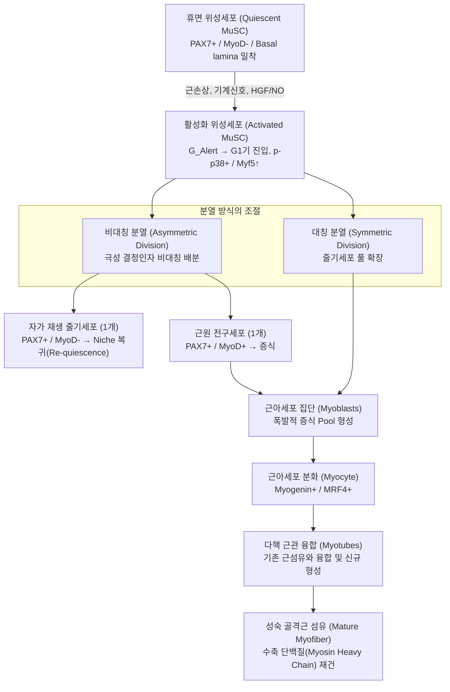
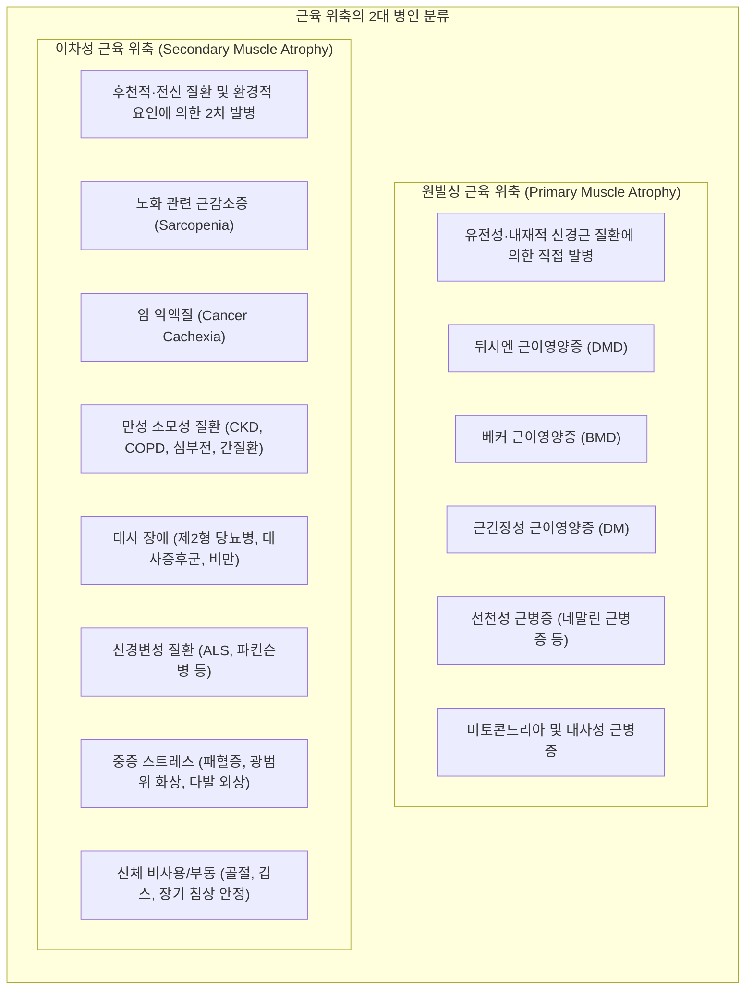
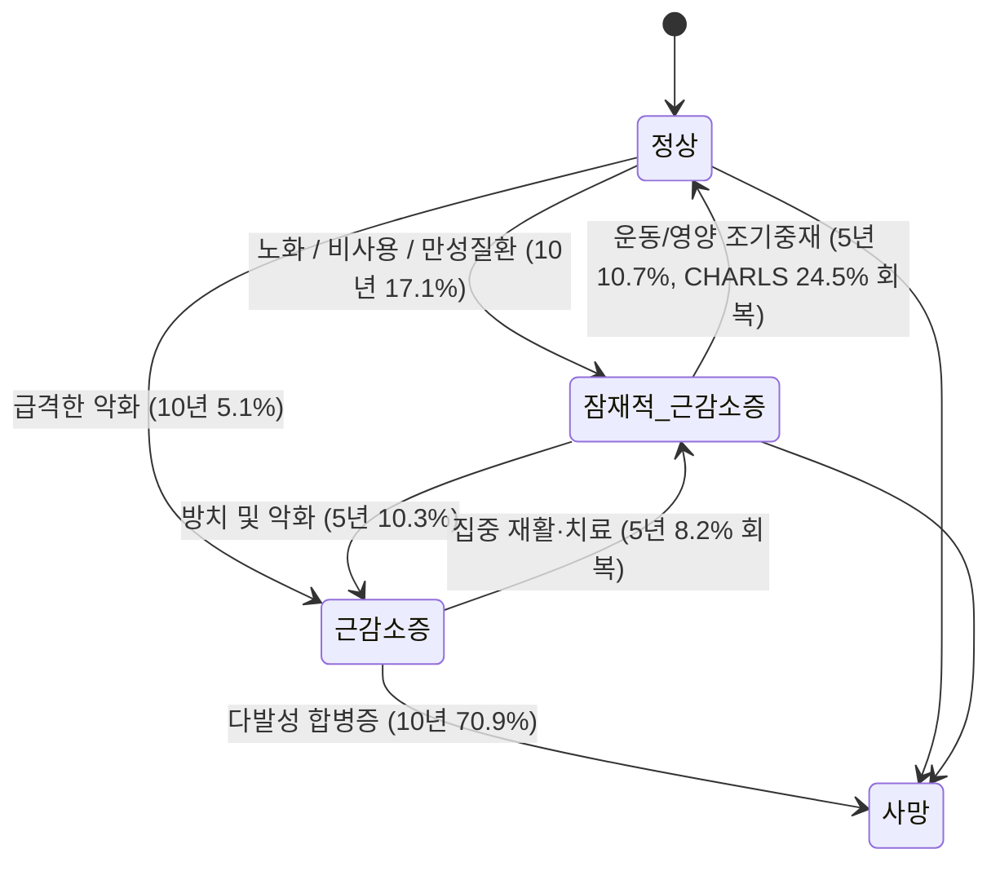

# 📑 [근감소증] PART 1. 개요: 08. 근육 줄기세포 & 09. 근감소증의 역학

> **핵심 요약 (Key Summary)**
> - **[[근육줄기세포]](Muscle Stem Cell, MuSC / [[위성세포|근위성세포]])**는 성숙한 골격근 섬유의 기저막(Basal lamina)과 근섬유막(Sarcolemma) 사이에 위치하는 성체 일분화능(Unipotent) 줄기세포로, $PAX7$ 전사인자를 핵심 마커로 발현하며 골격근의 [[성장]], 유지, 수리 및 재생을 전담한다. 손상 시 $G_0$ 정지기에서 경고 상태($G_{Alert}$)를 거쳐 $G_1$기로 신속히 활성화되어 비대칭 분열(자가 재생 줄기세포 보충)과 대칭 분열(근아세포 대량 증식)을 조율하며, 후성유전 조절인자 $CHD4$(괴사 억제)와 $DHX36$(G-quadruplex 해체)이 계통 충실도를 보장한다.
> - **줄기세포 노화 및 [[근감소증]] 병태생리**: [[노화]]에 따라 $p53$, $p16^{INK4a}$ 활성화로 인한 비가역적 세포 노화 진입, $p38\alpha/\beta\text{ MAPK}$ 과활성에 따른 자가재생능 상실, 줄기세포 틈새(Niche)의 $FGF2$ 비정상 과분비와 $SPRY1$ 프로모터 과메틸화에 의한 휴지기 유지 실패, 피브로넥틴($FN$) 고갈로 인한 아노이키스(Anoikis), 염증성 틈새(Inflammatory niche) 형성이 복합 작용하여 위성세포 고갈 및 제2형([[속근]], Type II) 근섬유 선택적 위축을 촉발한다.
> - **근감소증의 역학적 유병률**: 진단 기준 및 대상군에 따라 다양하나, 전 세계 129개 연구(27.4만 명) 메타분석상 통합 유병률은 **16%**(EWGSOP 22%, AWGS 15%, IWGS 14%, FNIH 11%, EWGSOP2 10%)이며, 60세 이상 지역사회 노인에서는 **10%**(EWGSOP2 5% ~ IWGS 17%)로 보고된다. 한국노인노쇠코호트([[KFACS]], 70~84세)에서는 AWGS 2019 기준 남성 **26.8%**, 여성 **18.8%**이며, 중증 근감소증은 남성 **8.9%**, 여성 **4.7%**이다. 65~69세(5%) 대비 85세 이상(20% 이상)에서 급증하며, [[당뇨병]](18%), 제2형 당뇨(6.3~47.1%), 간경변(25~70%), 투석 환자(4~68%) 등 만성질환군에서 유병률이 현저히 높다.
> - **발생률 및 역동적 상태 전환(가역성)**: 8년 추적(ELSA) 발생률은 남성 13.3%, 여성 15.6%이며, 급성 입원 노인에서는 12~38.7%가 신규 발병한다. 최근 글로벌 이니셔티브([[GLIS]])는 근감소증을 **잠재적으로 가역적인 질병(Potentially reversible disease)**으로 재정의하였다. 스웨덴 SNAC-K 12년 종단연구에 따르면 잠재적 근감소증(Probable sarcopenia) 환자의 5년 내 정상 회복률은 **10.7%**(악화 진행률 10.3%와 대등)에 달하며, 중국 CHARLS 코호트에서도 **24.5%**가 정상으로 회복되었다. 고강도 신체활동(HR 1.84)과 인지기능(HR 1.17)이 회복의 핵심 촉진 인자이다.
> - **부정적 임상 결과**: 메타분석상 근감소증은 **사망 위험 2.00배(HR 2.00, OR 2.35)**, **낙상 위험 1.60~1.89배**, **골절 위험 1.71~1.84배**, **기능적 장애 위험 3.03배**, **20일 이상 장기 입원 위험 1.84배**를 유의하게 증가시키며, 삶의 질([[HRQoL]], SMD -0.76)을 크게 악화시킨다.

---

## 📌 목차
- [0. 서론적 연계: 세포소기관 이상(리소좀 결손)과 근육줄기세포의 연결](#0-서론적-연계-세포소기관-이상리소좀-결손과-근육줄기세포의-연결)
- [I. Chapter 08. 근육 줄기세포 (Muscle Stem Cell, MuSC)](#i-chapter-08-근육-줄기세포-muscle-stem-cell-musc)
  - [1. 근육줄기세포의 개념과 분류 체계](#1-근육줄기세포의-개념과-분류-체계)
  - [2. 근육줄기세포의 분자생물학적 특성](#2-근육줄기세포의-분자생물학적-특성)
  - [3. 근육줄기세포의 발견과 역사적 연구 궤적](#3-근육줄기세포의-발견과-역사적-연구-궤적)
  - [4. 근육줄기세포의 휴지기, 경고 상태 및 활성화 기전](#4-근육줄기세포의-휴지기-경고-상태-및-활성화-기전)
  - [5. 골격근 재생 과정과 근육 위축의 분류](#5-골격근-재생-과정과-근육-위축의-분류)
  - [6. 근육줄기세포 및 미세환경(Niche)의 노화 기전](#6-근육줄기세포-및-미세환경niche의-노화-기전)
  - [7. 근감소증에서의 역할 및 표적 치료 전략](#7-근감소증에서의-역할-및-표적-치료-전략)
  - [참고문헌 (Chapter 08 References)](#참고문헌-chapter-08-references)
- [II. Chapter 09. 근감소증의 역학 (Epidemiology of Sarcopenia)](#ii-chapter-09-근감소증의-역학-epidemiology-of-sarcopenia)
  - [1. 서론: 기술역학과 생애 과정(Life Course) 관점](#1-서론-기술역학과-생애-과정life-course-관점)
  - [2. 근감소증의 유병률 (Prevalence)](#2-근감소증의-유병률-prevalence)
  - [3. 근감소증의 발생률 (Incidence Rate)](#3-근감소증의-발생률-incidence-rate)
  - [4. 근감소증의 이행률과 양방향 가역성 (Bidirectional Transitions)](#4-근감소증의-이행률과-양방향-가역성-bidirectional-transitions)
  - [5. 근감소증 관련 다차원적 위험 요인 (Associated Risk Factors)](#5-근감소증-관련-다차원적-위험-요인-associated-risk-factors)
  - [6. 근감소증으로 인한 부정적 임상 결과 (Clinical Outcomes)](#6-근감소증으로-인한-부정적-임상-결과-clinical-outcomes)
  - [7. 요약 및 역학 연구의 미래 방향](#7-요약-및-역학-연구의-미래-방향)
  - [참고문헌 (Chapter 09 References)](#참고문헌-chapter-09-references)

---

## 0. 서론적 연계: 세포소기관 이상(리소좀 결손)과 근육줄기세포의 연결

Chapter 07의 결론부에서 다루어진 **리소좀(Lysosome)-자가포식(Autophagy) 시스템**의 붕괴는 근세포 내 [[단백질]] 항상성 파탄뿐만 아니라 상주 근육줄기세포의 생존과 활성화 환경에 치명적인 타격을 입힌다.
- **리소좀 기능 저하의 병태생리**:
  - 노화 및 대사 이상에 따라 리소좀 내 산성도(pH) 유지 실패, 카텝신(Cathepsin) 등 가수분해 [[효소]] 활성 저하, 막 투과성 이상(Lysosomal membrane permeabilization, LMP)으로 인한 독성 분해물질 누출이 발생한다.
  - $LC3\text{-}II$ 자가포식 마커 감소, $p62/SQSTM1$ 단백질 축적, 자가포식-리소좀 전사인자 $TFEB$(Transcription Factor EB) 활성화 억제가 동반된다.
  - 유비퀴틴-프로테아좀 시스템(UPS)이 주로 짧은 반감기의 개별 단백질을 분해하는 반면, 리소좀은 거대 단백질 복합체 및 손상된 세포 소기관(미토파지 Mitophagy, 소포체포식 ER-phagy)을 처리한다. 리소좀 결손은 독성 단백질 응집체를 축적시키고 염증성 [[사이토카인]] 분비를 자극하여 근감소증을 가속화한다.

> ![[Sarcopenia_Ch08_p130_Fig1.png|300]]
> **그림 7-3. 리소좀이 근육량과 근육기능 유지에 미치는 영향.** 리소좀은 자가포식 작용을 통해 비정상 단백질 및 손상된 세포소기관을 분해·재활용하여 대사 중간체를 공급하고 골격근 질량과 수축 기능을 유지한다. 리소좀 기능 결함 시 유비퀴틴-프로테아좀 시스템(UPS)과의 협력 파탄, 분해 부산물 세포질 누출, 근위축 및 근감소증이 가속화된다.

---

# I. Chapter 08. 근육 줄기세포 (Muscle Stem Cell, MuSC)
> **저자**: 김세이 · 박준현 · 류동렬 (광주과학기술원 GIST)  
> **출처**: 대한근감소증학회 《Sarcopenia: Muscle Wasting Disease (2nd Ed.)》 pp.130-143

---

## 1. 근육줄기세포의 개념과 분류 체계

### (1) 줄기세포(Stem Cell)의 정의와 근본 기능
- **줄기세포의 본질적 2대 특성**:
  1. **자가 재생(Self-renewal) 능력**: 분열 후에도 미분화된 줄기세포 풀(Stem cell pool)의 크기를 온전히 유지하는 능력.
  2. **다방향/특이적 분화(Differentiation) 능력**: 자극에 따라 유기체 내 전문화된 기능 세포로 성숙하는 능력.
- **존재 양상**: 배아(Embryo) 및 성체(Adult) 조직 모두에 상주하며, **휴면 상태(Quiescence, $G_0$)**와 **활성화 상태(Activation, $G_1/S/G_2/M$)**라는 두 가지 가역적 세포주기 상태를 왕복한다.
- **활성화 후 수행하는 2대 필수 기능**:
  - **첫째 (줄기세포 풀 유지)**: 가역적으로 휴면 상태로 복귀(Re-quiescence)하여 자가 재생을 통해 줄기세포 고갈을 방지.
  - **둘째 (조직 수리 및 보충)**: 비대칭 또는 대칭 분열을 통해 손실된 세포를 대체하고 손상 조직의 고유 수축 기능을 복원하는 성숙 근세포 생성. 재생의학(Regenerative medicine) 및 세포 치료제 개발의 핵심 근간이다.

### (2) 분화능(Potency)에 따른 줄기세포의 계층적 분류
줄기세포는 분화 가능한 세포 스펙트럼의 폭에 따라 4단계로 세분된다.

| 줄기세포 유형 | 정의 및 분화 범위 | 배아/배아외 형성능 | 대표 예시 |
| :--- | :--- | :--- | :--- |
| **전분화능 줄기세포** (Totipotent Stem Cell) | 전체 유기체의 모든 세포(체세포+생식세포)로 분열 및 분화 | **배아 구조 + 배아외 구조(태반, 융모막)** 모두 형성 가능 | 정자와 난자가 결합해 형성된 **접합자(Zygote)**, 초기 난할기 할구 |
| **만능 줄기세포** (Pluripotent Stem Cell, PSC) | 3배엽(내배엽, 중배엽, 외배엽) 계통의 모든 신체 세포로 분화 | 배아 체내 세포 형성 가능, **태반 등 배아외 구조는 형성 불가** | 착상 전 배반포 내부세포괴(ICM) 유래 **배아줄기세포(ESC)**, 성체 체세포 리프로그래밍 **유도만능줄기세포([[iPSC]])** |
| **다분화능 줄기세포** (Multipotent Stem Cell) | 특정 배엽 또는 조직 계통 내의 다양한 세포 유형으로 분화 | 특정 계통 한정 (조건에 따라 이종 계통 분화/전이 가능) | 골수 유래 **조혈모세포([[HSC]])**, 중간엽줄기세포([[MSC]]), 신경줄기세포([[NSC]]) |
| **일분화능 줄기세포** (Unipotent Stem Cell) | **오직 단 하나의 특정 세포 계통**으로만 분화 | 특정 조직 고유 전구세포 | 피부 표피 기저층 줄기세포, **골격근 줄기세포([[MuSC]] / [[위성세포]])** |

> ![[Sarcopenia_Ch08_p134_Fig1.png|300]]
> **그림 8-1. 줄기세포의 구조 및 분화 계층도.** 전능성(Totipotent, 접합자) $\to$ 만능성(Pluripotent, ESC/iPSC) $\to$ 다분화능(Multipotent, 조혈모세포 등) $\to$ 일분화능(Unipotent, 근육줄기세포/위성세포)으로 이어지는 분화 잠재력의 연속체 도식.

### (3) 근육 줄기세포(Muscle Stem Cell, MuSC)의 정체성
- **근위성세포(Satellite Cell)**: 골격근 조직의 발생, 출생 후 [[성장]], 일상적 유지 및 외상 후 재생을 전담하는 **성체 일분화능 근형성 줄기세포(Myogenic stem cell)**이다.
- **해부학적 위치(Anatomical Niche)**: 성숙한 다핵 골격근 섬유(Myofiber)의 **기저막(Basal lamina) 아래와 근섬유막(Sarcolemma) 사이**의 독특한 미세 틈새(Niche)에 깊은 정지 상태로 밀착 상주한다.
- **존재 의의**: 골격근은 체중 지지, 고강도 수축, 신장성 수축(Eccentric contraction), 일상적 마모 및 외부 손상에 끊임없이 노출된다. 손상된 다핵 근섬유는 자체 분열할 수 없으므로, 기저막 아래 대기 중인 위성세포가 유일하고 절대적인 재생 세포 공급원(Cellular reservoir)으로 작동한다.

---

## 2. 근육줄기세포의 분자생물학적 특성

### (1) 핵심 전사인자 마커: PAX7
- 근육 줄기세포(MuSC)는 주로 가역적 세포 정지 상태($G_0$)로 존재하며, **$PAX7$(Paired box protein Pax-7)** 전사인자의 안정적 발현에 의해 정의된다.
- $PAX7$은 위성세포의 조기 분화를 차단하고 자가 갱신(Self-renewal) 상태와 줄기세포 고유능(Stemness)을 유지하는 마스터 유전자이다.
- 손상 신호가 도달하면 $PAX7$의 지휘 아래 효율적 증식 $\to$ 근아세포(Myoblast)로의 분화 운명 결정 $\to$ 미분화 자가재생 줄기세포 풀 복원의 세밀한 균형이 유지된다.

### (2) 분열 방식과 비대칭 운명 결정 (Symmetric vs. Asymmetric Division)
- **대칭 분열(Symmetric Division)**: 하나의 위성세포가 분열하여 동일한 줄기세포 2개($PAX7^+/MyoD^-$)를 생성하거나, 동일한 전구세포 2개($PAX7^+/MyoD^+$)를 생성하여 세포 풀을 신속히 수평 확장(Expansion)한다.
- **비대칭 분열(Asymmetric Division)**:
  - 기저막과의 접촉면 극성(Apicobasal polarity)에 따라 세포 분열 축이 형성된다.
  - 기저막에 접한 딸세포는 줄기세포 결정 인자를 보존하여 **자가 재생 줄기세포($PAX7^+/MyoD^-$)**로 잔류한다.
  - 근섬유막 쪽에 위치한 딸세포는 분화 신호를 수용하여 **근원성 전구세포($PAX7^-/MyoD^+$)**로 운명이 결정된다.
- 이 대칭/비대칭 분열의 정교한 비율 조절을 통해 향후 재손상에 대비한 줄기세포 예비 풀을 영구 보존하면서 대규모 근섬유 재생 요구를 충족시킨다.

---

## 3. 근육줄기세포의 발견과 역사적 연구 궤적

1. **19세기 ~ 20세기 초의 수수께끼**:
   - 골격근이 손상 후 재생된다는 사실은 19세기부터 관찰되었으나, 세포학적 메커니즘은 100년 넘게 베일에 싸여 있었다.
   - 성숙한 근섬유 내부의 다핵(Myonuclei)은 유사분열(Mitosis) 능력을 영구히 상실한 종말 분화 상태임에도 불구하고, 재생 또는 [[성장]] 중인 근육에서 관찰 가능한 핵분열 상 없이도 핵의 개수와 근섬유 크기가 급증하는 현상(44년간의 학계 미스터리)이 보고되었다.
2. **1960년대 초의 패러다임 전환**:
   - 다핵 근섬유가 독립적인 단핵 근아세포들의 세포막 융합(Cell fusion)에 의해 형성된다는 발생학적 원리가 규명되었다.
   - 근섬유 내부 핵이 아닌, 근섬유 외부의 별개 단핵 세포가 증식에 기여한다는 가설이 대두되었다.
3. **1961년 Alexander Mauro의 위성세포 발견**:
   - 개구리(Frog)의 경골신근(Tibialis anticus) 섬유 표면을 전자현미경(EM)으로 관찰하던 중, 근섬유막(Sarcolemma)과 기저막(Basal lamina) 사이의 좁은 틈새에 끼어 있는 단핵의 정지기 세포를 최초로 포착하였다.
   - 주 근섬유 주위를 공전하는 인공위성에 비유하여 **'위성세포(Satellite cell)'**로 명명하였다. 이후 쥐, 마우스, 인간을 포함한 척추동물 전반에서 보편적으로 존재함이 확인되었다.
4. **줄기세포능의 엄밀한 입증**:
   - 초기에는 표지된 티미딘($^3H\text{-thymidine}$) 흡수 실험을 통해 위성세포가 성장기 동안 근섬유에 신규 핵을 공급하고 유사분열 정지기로 들어간다는 정황을 확인하였다.
   - **결정적 증거 (단일 근섬유 배양 및 이식)**:
     - [[콜라겐]] 분해 [[효소]](Collagenase)를 처리하여 기저막과 위성세포가 완벽히 보존된 단일 근섬유(Single myofiber)를 분리 배양하였다.
     - 단일 근섬유 표면의 단 한 개의 위성세포가 활성화되어 폭발적으로 증식하고 분화하여 다핵 근관(Myotube)을 자가 형성함을 입증하였다.
     - 더 나아가 공여자(Donor)의 단일 근섬유를 방사선 조사된 숙주(Host) 개체에 이식했을 때, 이식된 위성세포가 생체 내에서 수천 개의 새로운 근섬유를 형성할 뿐만 아니라 숙주의 기저막 틈새에 스스로 안착하여 내인성 위성세포 풀을 완전히 재건(Self-renewal)함을 확인하였다.
5. **현대 분자유전학적 계통 추적(Lineage Tracing)**:
   - $Pax7\text{-CreERT2}$ 기반 유전자 표지 리포터 마우스 모델을 통해 생체 손상 후 근육 재생에 기여하는 모든 세포가 $PAX7^+$ 위성세포의 자손임을 최종 증명하였다.
   - 디프테리아 독소($DTA$, Diphtheria Toxin A) 모델을 이용해 성체 마우스에서 위성세포를 선택적으로 결손(Ablation)시킨 결과, 근육 손상 후 재생이 100% 완전히 차단되고 심각한 섬유화(Fibrosis)로 치환됨을 확인함으로써 위성세포가 골격근 재생의 필수 불가결한 단일 근원임을 확립하였다.

---

## 4. 근육줄기세포의 휴지기, 경고 상태 및 활성화 기전

### (1) 세포 정지기/휴지기(Cellular Quiescence, $G_0$)의 본질
- **정의**: $G_1$기 진행이 일시적·가역적으로 중단된 대사적 정지 상태.
- **형태 및 대사적 특징**: 세포질 용적 축소, 높은 핵-세포질 비율(High N/C ratio), 극도로 억제된 RNA 전사 및 [[단백질]] 합성 속도, 미토콘드리아 산화 대사의 최소화.
- **이질성 연속체 (Continuum of Quiescence)**:
  - 과거에는 균질한 수동적 휴면 상태로 간주되었으나, 최근 전사체 분석을 통해 정지기 위성세포가 단일하지 않고 스펙트럼으로 존재함이 밝혀졌다.
  - **$PAX7^{Hi}$ 아집단**: 깊은 휴면(Deep quiescence) 상태. 대사 활성이 극도로 낮고, 자극 후 첫 번째 유사분열 진입 시간이 지연되나, 장기적 자가 재생 능력과 줄기세포능(Stemness)이 가장 강력하다. DNA 복제 시 주형 가닥(Template strand)을 보존하는 비대칭 분배 능력을 보유한다.
  - **$PAX7^{Low}$ 아집단**: 얕은 휴면 상태. 대사 활성이 상대적으로 높으며, 손상 신호 수신 시 지체 없이 세포주기로 진입하여 신속한 증식을 개시한다.

### (2) 경고 상태(Alert State, $G_{Alert}$)의 발견
- **개념**: $G_0$(정지기)와 $G_1$(세포주기 진입) 사이에 존재하는 독특하고 가역적인 적응적 중간 상태 (Rodgers et al., Nature 2014).
- **특징**:
  - 원격 부위의 손상이나 전신적 [[스트레스]] 신호에 반응하여 $mTORC1$ 신호가 가동되면서 유도된다.
  - $G_0$ 세포에 비해 크기가 약간 확장되어 있고, 미토콘드리아 활성과 산소 소비율(OCR)이 상승되어 있다.
  - 직접 손상을 입었을 때 $G_0$ 세포보다 첫 번째 유사분열 진입 속도가 약 2배 빠르며 재생 효율이 극대화된다.

### (3) 활성화(Activation)의 촉발 인자와 분자 마커
1. **미세환경(Niche)의 물리적 붕괴**: 기저막 파열과 세포 외 기질 장력 변화로 기계감각(Mechanosensation) 신호전달 촉발.
2. **손상 근섬유 유래 신호 방출**:
   - 손상되거나 괴사하는 근섬유에서 간세포성장인자(**HGF**, Hepatocyte Growth Factor)가 세포외기질로부터 유리되어 위성세포의 c-Met 수용체에 결합.
   - 근섬유 신장 및 손상 부위에서 산화질소 합성효소($nNOS$)에 의해 생성된 **산화질소([[NO]])**가 HGF 분비를 촉진.
   - 국소 마취제인 부피바카인(Bupivacaine) 투여를 통한 선택적 근섬유 손상 실험에서도 손상 근섬유에서 방출된 신호가 위성세포의 폭발적 활성화를 유도함이 증명됨.
3. **세포 내 전사·신호 캐스케이드**:
   - **초기 마커**: 인산화된 **$p\text{-}p38\text{ MAPK}$**의 급격한 핵 내 축적.
   - **$Myf5$의 상향 조절**: 정지 상태에서 전사 억제 상태로 잠자던 $Myf5$ 발현이 폭발적으로 증가.
   - **$MyoD$ 발현**: 근원 결정 인자인 $MyoD$가 발현되어 세포주기 진행을 촉진.
   - **$Cdc6$ 조절**: $G_1$기에서 $MyoD$는 분화를 조기 유도하지 않으면서 세포주기 진입을 허용하기 위해 $Cdc6$ 전사를 직접 조절하여 DNA 복제 전 복합체(Pre-RC)를 형성한다.

> ![[Sarcopenia_Ch08_p138_Fig1.png|300]]
> **그림 8-2. 골격근 재생에 관여하는 근육 줄기세포(MuSC).** 정상 상태 기저막 하 휴면($G_0$) 중인 위성세포가 근손상(외상, 질병, 국소마취제 등)에 의해 활성화되어 $G_1/S$기로 재진입, 급속히 증식한 뒤 근세포(Myocyte)로 분화하고 상호 융합하여 새로운 다핵 근관 및 성숙 근섬유를 형성하며 줄기세포 풀을 자가 보충하는 전 주기 도식도.

---

## 5. 골격근 재생 과정과 근육 위축의 분류

### (1) 근육 재생의 다층적 분자 조절 네트워크
- 증식 중인 위성세포의 일부는 기저막 트랙을 따라 손상 구역으로 능동 이동(Migration)한다.
- **계통 충실도 및 세포 생존 조절**:
  - **$CHD4$ (Chromodomain Helicase DNA-binding Protein 4)**: NuRD(Nucleosome Remodeling and Deacetylase) 복합체 핵심 성분으로, 세포사멸 경로인 $RIPK3$ 매개 네크롭토시스(Necroptosis/프로그램 괴사)를 후성유전학적으로 침묵시켜 급속 증식 중인 위성세포가 사멸하거나 비근원적(Non-myogenic, 지방/섬유) 계통으로 이탈하는 것을 방지한다.
  - **$DHX36$ (DEAH-box Helicase 36)**: $5'\text{-}UTR$에 존재하는 특이한 핵산 2차 구조인 RNA G-quadruplex(rG4)를 구조적으로 해체하여 특정 근형성 단백질의 번역(Translation)을 전격 촉진함으로써 근육 재생을 완수한다.

### (2) 근육 위축(Muscle Atrophy)의 병리생태와 분류
- **근육 위축의 정의**: 골격근 [[단백질]] 합성(Protein synthesis) 속도보다 단백질 분해(Protein degradation) 속도가 압도적으로 우세해져 근육량과 절대 근력이 점진 소실되는 병적 상태.
- **조직병리학적 특징**: 근섬유 횡단면 직경(Cross-sectional area, CSA)의 현저한 감소, 위축된 근섬유의 둥글거나 각진(Angulated) 형태 변형, 세포질 및 세포소기관 용적 감소, 과호산구성(Hypereosinophilic) 염색성 증가.

---

## 6. 근육줄기세포 및 미세환경(Niche)의 노화 기전

### (1) 줄기세포 노화가 근육 노화에 미치는 영향
- **분열 대칭성의 붕괴**: 노화에 따라 자가 재생 대칭 분열과 전구세포 생성 비대칭 분열 사이의 정교한 밸런스가 파괴되어 전구세포 생산량이 급감한다.
- **세포 노화(Cellular Senescence) 진입**: 만성적인 산화 스트레스와 축적된 DNA 손상으로 인해 $p53$, $p16^{INK4a}$, $p19^{Arf}$ 종양 억제 신호가 영구 활성화되어 비가역적 세포주기 정지에 갇히며 줄기세포 풀이 고갈된다.
- **틈새(Niche) 조절 파탄과 FGF2 신호 과잉**:
  - 정상 근육에서는 기저 상태에서 엄격히 차단되던 **$FGF2$**가 노화된 근섬유에서 비정상적으로 과발현·누출된다.
  - $FGF2$에 지속 노출된 위성세포는 $G_0$ 정지 상태를 유지하지 못하고 무단 이탈하여 자가 재생 능력을 조기 소진한다.
  - 젊은 위성세포는 FGF 억제 피드백 인자인 **$SPRY1$(Sprouty 1)**을 발현하여 이를 방어하나, 노화된 인간 위성세포에서는 **$SPRY1$ 유전자 프로모터의 과도한 DNA 메틸화(Hypermethylation)**가 발생하여 $SPRY1$ 발현이 침묵된다. 그 결과 FGF 신호에 과민 반응하여 정지기 복귀(Re-quiescence)에 실패하고 줄기세포 풀이 사멸·고갈된다.
- **세포 외 기질 피브로넥틴(Fibronectin, FN) 결핍**:
  - 노화된 근육 Niche에서는 $FN$ 수치가 급격히 감소한다.
  - 위성세포의 기저막 부착 결합력이 와해되면서 기저막 탈락에 의한 세포사멸인 **아노이키스(Anoikis)** 감수성이 폭증한다. 젊은 근육에서 인위적으로 $FN$을 결실시키면 노화 표현형이 완벽히 재현된다.

### (2) 근육 조직 환경이 줄기세포에 미치는 영향
- **염증성 틈새(Inflammatory Niche)**: 노화된 근섬유, 섬유지방 전구세포(FAP), 면역세포들이 분비하는 노화연관 분비표현형(SASP: $IL\text{-}6$, $TNF\text{-}\alpha$, $TGF\text{-}\beta$)이 독성 환경을 조성하여 잔여 위성세포의 증식과 근분화를 억제한다.
- **전신 환경의 노화**: 병체결합(Parabiosis) 연구에서 입증되었듯, 노화된 전신 순환 혈액 인자들이 위성세포의 자가 재생 신호를 차단한다.

---

## 7. 근감소증에서의 역할 및 표적 치료 전략

### (1) 근감소증의 병인으로서 위성세포 결함
- **근핵 보충(Myonuclear Accretion) 실패**: 정상 골격근은 미세 손상 시 위성세포가 융합하여 새로운 근핵을 지속 공급함으로써 [[단백질]] 합성 용적(Myonuclear domain)을 방어한다. 노화로 위성세포 수와 기능이 떨어지면 근핵 보충이 정지되어 근섬유 크기가 급격히 줄어든다.
- **$p38\alpha/\beta\text{ MAPK}$ 신호의 병적 과활성화**: 노화 위성세포 내 내재적 변화로 $p38\text{ MAPK}$가 지속 과활성화되어 줄기세포 자가 재생 경로가 전면 차단된다.
- **제2형([[속근]]) 근섬유의 특이적 위축**:
  - 골격근 섬유 중 제1형(Type I, [[지근]]/산화형)에 비해 순발력과 최대 근력을 담당하는 **제2형(Type II, 속근/당분해형) 근섬유의 위축 및 탈신경화(Denervation)**가 압도적으로 우세하다.
  - 근육 내 결합조직 증식(Fibrosis) 및 지방 침윤(Myosteatosis)이 심화되고 산화 대사능이 저하된다.

> ![[Sarcopenia_Ch08_p142_Fig1.png|300]]
> **그림 8-3. 근감소증의 원리 및 신체기능 평가.** 노화 및 위성세포 기능 부전에 의해 골격근량과 근력이 손실되는 [[근감소증]](Sarcopenia)의 임상적 발현. 의자 일어서기 검사(Chair Stand Test), 균형 검사(Balance Test), 보행 속도 검사(Gait Speed Test), 악력 검사(Hand Grip Test)의 기능 저하와 직결된다.

### (2) 근육줄기세포 표적 치료 전략
1. **신호전달 경로 약리학적 제어**:
   - 노화 위성세포에서 과활성화된 **$p38\alpha/\beta\text{ MAPK}$ 억제제** 처리를 통한 자가 재생능 복원.
   - **$FGF2$ 신호 억제** 및 $SPRY1$ 탈메틸화를 통한 정지기 복귀 능력 회복.
2. **칼로리 제한(Caloric Restriction, CR)**:
   - 미토콘드리아 건강성 회복, $SIRT1/AMPK$ 활성화를 통해 노화된 골격근 위성세포의 기능 회복 및 재생 잠재력 증진.
3. **줄기세포 분리 및 이식 치료(Cell Transplantation)**:
   - 자가 재생 능력이 최상으로 보존된 **$PAX7^{Hi}$ 줄기세포 아집단을 선별 분리**하여 이식함으로써 적은 세포 수로도 높은 골격근 생착률과 Niche 재건 달성.
   - 환자 맞춤형 줄기세포 직접 분리 이식 및 국소 조직 상주 줄기세포의 직접적 활성화 전략 병행.

---

## 참고문헌 (Chapter 08 References)
1. Almada AE, Wagers AJ. Molecular circuitry of stem cell fate in skeletal muscle regeneration, ageing and disease. *Nat Rev Mol Cell Biol* 2016;17(5):267-79.
2. Almeida CF, Fernandes SA, Ribeiro Junior AF, Okamoto OK, Vainzof M. Muscle satellite cells: exploring the basic biology to rule them. *Stem Cells Int* 2016;2016:1078686.
3. Alway SE, Myers MJ, Mohamed JS. Regulation of satellite cell function in sarcopenia. *Front Aging Neurosci* 2014;6:246.
4. Becker AJ, McCulloch EA, Till JE. Cytological demonstration of the clonal nature of spleen colonies derived from transplanted mouse marrow cells. *Nature* 1963;197(4866):452-4.
5. Bernet JD, Doles JD, Hall JK, et al. p38 MAPK signaling underlies a cell-autonomous loss of stem cell self-renewal in skeletal muscle of aged mice. *Nat Med* 2014;20(3):265-71.
6. Bigot A, Duddy WJ, Ouandaogo ZG, et al. Age-associated methylation suppresses SPRY1, leading to a failure of re-quiescence and loss of the reserve stem cell pool in elderly muscle. *Cell Rep* 2015;13(6):1172-82.
7. Brack AS, Rando TA. Tissue-specific stem cells: lessons from the skeletal muscle satellite cell. *Cell Stem Cell* 2012;10(5):504-14.
8. Chakkalakal JV, Jones KM, Basson MA, Brack AS. The aged niche disrupts muscle stem cell quiescence. *Nature* 2012;490(7420):355-60.
9. Chambers I, Colby D, Robertson M, et al. Functional expression cloning of Nanog, a pluripotency sustaining factor in embryonic stem cells. *Cell* 2003;113(5):643-55.
10. Chen JC, Goldhamer DJ. Skeletal muscle stem cells. *Reprod Biol Endocrinol* 2003;1:101.
11. Chen X, Yuan J, Xue G, et al. Translational control by DHX36 binding to 5'UTR G-quadruplex is essential for muscle stem-cell regenerative functions. *Nat Commun* 2021;12(1):5043.
12. Cohen BH. Mitochondrial and metabolic myopathies. *Continuum (Minneap Minn)* 2019;25(6):1732-66.
13. Coller HA, Sang L, Roberts JM. A new description of cellular quiescence. *PLoS Biol* 2006;4(3):e83.
14. Distefano G, Goodpaster BH. Effects of exercise and aging on skeletal muscle. *Cold Spring Harb Perspect Med* 2018;8(3):a029785.
15. Dunn A, Talovic M, Patel K, et al. Biomaterial and stem cell-based strategies for skeletal muscle regeneration. *J Orthop Res* 2019;37(6):1246-62.
16. Evano B, Tajbakhsh S. Skeletal muscle stem cells in comfort and stress. *NPJ Regen Med* 2018;3:24.
17. Fu X, Wang H, Hu P. Stem cell activation in skeletal muscle regeneration. *Cell Mol Life Sci* 2015;72(9):1663-77.
18. Fu X, Zhuang CL, Hu P. Regulation of muscle stem cell fate. *Cell Regen* 2022;11(1):40.
19. Fukada SI, Akimoto T, Sotiropoulos A. Role of damage and management in muscle hypertrophy: different behaviors of muscle stem cells in regeneration and hypertrophy. *Biochim Biophys Acta Mol Cell Res* 2020;1867(9):118742.
20. Gayraud-Morel B, Chrétien F, Jory A, et al. Myf5 haploinsufficiency reveals distinct cell fate potentials for adult skeletal muscle stem cells. *J Cell Sci* 2012;125(7):1738-49.
21. He S, Sharpless NE. Senescence in health and disease. *Cell* 2017;169(6):1000-11.
22. Huo F, Liu Q, Liu H. Contribution of muscle satellite cells to sarcopenia. *Front Physiol* 2022;13:892749.
23. Keefe AC, Lawson JA, Flygare SD, et al. Muscle stem cells contribute to myofibres in sedentary adult mice. *Nat Commun* 2015;6:7087.
24. Latil M, Rocheteau P, Châtre L, et al. Skeletal muscle stem cells adopt a dormant cell state post mortem and retain regenerative capacity. *Nat Commun* 2012;3:903.
25. Lukjanenko L, Jung MJ, Hegde N, et al. Loss of fibronectin from the aged stem cell niche affects the regenerative capacity of skeletal muscle in mice. *Nat Med* 2016;22(8):897-905.
26. Massenet J, Gardner E, Chazaud B, Dilworth FJ. Epigenetic regulation of satellite cell fate during skeletal muscle regeneration. *Skelet Muscle* 2021;11(1):4.
27. Mitchell K, Pannérec A, Cadot B, et al. Identification and characterization of a non-satellite cell muscle resident progenitor during postnatal development. *Nat Cell Biol* 2010;12:257-66.
28. Moiseeva V, Cisneros A, Sica V, et al. Senescence atlas reveals an aged-like inflamed niche that blunts muscle regeneration. *Nature* 2023;613(7942):169-78.
29. Pang KT, Loo LSW, Chia S, Ong FYT, Yu H, Walsh I. Insight into muscle stem cell regeneration and mechanobiology. *Stem Cell Res Ther* 2023;14(1):129.
30. Relaix F, Bencze M, Borok MJ, et al. Perspectives on skeletal muscle stem cells. *Nat Commun* 2021;12:692.
31. Rocheteau P, Gayraud-Morel B, Siegl-Cachedenier I, et al. A subpopulation of adult skeletal muscle stem cells retains all template DNA strands after cell division. *Cell* 2012;148(1):112-25.
32. Rodgers JT, King KY, Brett JO, et al. mTORC1 controls the adaptive transition of quiescent stem cells from G0 to G(Alert). *Nature* 2014;510(7505):393-6.
33. Sayer AA, Cruz-Jentoft A. Sarcopenia definition, diagnosis and treatment: consensus is growing. *Age Ageing* 2022;51(10):afac220.
34. Segalés J, Perdiguero E, Muñoz-Cánoves P. Regulation of muscle stem cell functions: a focus on the p38 MAPK signaling pathway. *Front Cell Dev Biol* 2016;4:91.
35. Sousa-Victor P, García-Prat L, Muñoz-Cánoves P. Control of satellite cell function in muscle regeneration and its disruption in ageing. *Nat Rev Mol Cell Biol* 2022;23(3):204-26.
36. Sousa-Victor P, Muñoz-Cánoves P. Regenerative decline of stem cells in sarcopenia. *Mol Aspects Med* 2016;50:109-17.
37. Voog J, Jones DL. Stem cells and the niche: a dynamic duo. *Cell Stem Cell* 2010;6(2):103-15.
38. Wang YX, Dumont NA, Rudnicki MA. Muscle stem cells at a glance. *J Cell Sci* 2014;127(21):4543-8.
39. Wosczyna MN, Rando TA. A muscle stem cell support group: coordinated cellular responses in muscle regeneration. *Dev Cell* 2018;46(2):135-143.
40. Wozniak AC, Kong J, Bock E, et al. Signaling satellite-cell activation in skeletal muscle: markers, models, stretch, and potential alternate pathways. *Muscle Nerve* 2005;31(3):283-300.
41. Yablonka-Reuveni Z. The skeletal muscle satellite cell: still young and fascinating at 50. *J Histochem Cytochem* 2011;59(12):1041-59.
42. Yin L, Li N, Jia W, et al. Skeletal muscle atrophy: from mechanisms to treatments. *Pharmacol Res* 2021;172:105807.
43. Zakrzewski W, Dobrzynski M, Szymonowicz M, Rybak Z. Stem cells: past, present, and future. *Stem Cell Res Ther* 2019;10(1):68.
44. Zhang K, Sha J, Harter ML. Activation of Cdc6 by MyoD is associated with the expansion of quiescent myogenic satellite cells. *J Cell Biol* 2010;188(1):39-48.

---

# II. Chapter 09. 근감소증의 역학 (Epidemiology of Sarcopenia)
> **저자**: 김미지 (경희대학교 의과대학)  
> **출처**: 대한근감소증학회 《Sarcopenia: Muscle Wasting Disease (2nd Ed.)》 pp.144-158

---

## 1. 서론: 기술역학과 생애 과정(Life Course) 관점

- **[[근감소증]](Sarcopenia)의 역학적 정의**: 노화와 관련된 진행성·전신적 골격근 질환으로, **골격근량(Skeletal muscle mass)**과 **근기능(Muscle function: 근력 Muscle strength 및 신체 수행능력 Physical performance)**의 점진적 손실을 특징으로 한다.
- **전 세계 추정 유병률**: 진단 기준과 평가 도구에 따라 차이가 존재하나, 일반적으로 **전 세계 60세 이상 노인 인구의 10% ~ 16%**가 근감소증에 이환된 것으로 추산된다.
- **임상적 중요성과 생애 과정(Life Course) 접근**:
  - 근감소증은 단순한 노년기 질환에 국한되지 않고 40대 중년기부터 시작될 수 있으며, 청장년기의 최대 근육량 형성(Peak muscle mass) 수준이 노년기 근감소증 발생 시점을 결정한다.
  - 암(Cancer), 만성 콩팥병([[CKD]]), 만성 간질환, 대사 장애 환자군에서 유병률이 급격히 증가하며, 이들 질환에서 **환자의 생존율과 치료 합병증을 예측하는 결정적 예후 지표(Prognostic marker)**로 작용한다.
  - 따라서 조기 진단, 역학적 추세 파악 및 생애 전주기에 걸친 예방 전략 수립이 필수적이다.

---

## 2. 근감소증의 유병률 (Prevalence)

### (1) 국제 주요 진단 기준에 따른 유병률 비교
근감소증의 유병률 추정치는 사용된 합의 진단 기준(Consensus criteria), 근육량 측정 방식(DXA vs. BIA), 평가 항목 조합에 따라 상당한 편차를 보인다.

- **국제 5대 주요 합의 진단 그룹**:
  1. **EWGSOP** (유럽 노인 [[근감소증]] 워킹 그룹, 2010): 근육량 저하 + 근력 또는 신체기능 저하.
  2. **EWGSOP2** (개정 유럽 합의, 2019): **근력 저하(악력)를 최우선 필수 진단 항목**으로 배치, 근육량 감소 확인 시 확진, 신체기능 저하 시 중증 판정.
  3. **AWGS** (아시아 근감소증 워킹 그룹, 2014 & 2019 개정): 아시아인 체격 기준 컷오프 적용, 지역사회 1차 진료용 '추정 근감소증' 선별 도입.
  4. **IWGS** (국제 근감소증 워킹 그룹, 2011): 보행속도 및 DXA 사지근육량 중심.
  5. **FNIH** (미국 국립보건원재단, 2014): 체질량지수(BMI) 보정 근육량(ASM/BMI)과 악력 결합.

#### 메타분석 근거 (Yuan S & Larsson SC, Metabolism 2023)
- **18세 이상 성인 전체 대상 (129개 연구, 총 274,004명)**:
  - 전체 통합 유병률: **16% (95% CI: 15-17%)**
  - **EWGSOP (2010)**: **22% (20-25%)** $\to$ 가장 높게 추정됨.
  - **AWGS**: **15% (13-17%)**
  - **IWGS**: **14% (9-18%)**
  - **FNIH**: **11% (9-14%)**
  - **EWGSOP2 (2019)**: **10% (2-17%)** $\to$ 근력을 우선 진단 기준으로 두어 과잉 진단을 줄여 가장 낮게 추정됨.
- **60세 이상 지역사회 거주 노인 대상 (58개 연구, 총 80,836명)**:
  - 전체 통합 유병률: **10% (95% CI: 7-12%)**
  - **IWGS**: **17% (11-23%)** $\to$ 가장 높음.
  - **FNIH**: **15% (5-28%)**
  - **EWGSOP**: **11% (7-14%)**
  - **AWGS**: **8% (3-15%)**
  - **EWGSOP2**: **5% (1-10%)** $\to$ 가장 보수적 진단.

### (2) 표 9-1. 근감소증의 진단기준에 따른 근감소증 유병률
*(출처: 원문 p.146 표 9-1; 원자료: Yuan S, Larsson SC. Metabolism. CC BY 4.0)*

| 진단 기준 (Definition) | 18세 이상 성인 연구 수 (n) | 대상자 수 (n) | 유병률 % (95% CI) | 60세 이상 지역사회 노인 연구 수 (n) | 대상자 수 (n) | 유병률 % (95% CI) |
| :--- | :---: | :---: | :---: | :---: | :---: | :---: |
| **EWGSOP** | 48 | 200,590 | **22%** (20-25) | 31 | 36,811 | **11%** (7-14) |
| **EWGSOP2** | 3 | 5,720 | **10%** (2-17) | 4 | 6,624 | **5%** (1-10) |
| **AWGS** | 46 | 27,940 | **15%** (13-17) | 13 | 17,070 | **8%** (3-15) |
| **IWGS** | 12 | 11,890 | **14%** (9-18) | 5 | 6,993 | **17%** (11-23) |
| **FNIH** | 20 | 27,864 | **11%** (9-14) | 5 | 13,338 | **15%** (5-28) |
| **전체 통합 (All above)** | **129** | **274,004** | **16%** (15-17) | **58** | **80,836** | **10%** (7-12) |

- **평가 도구별 유병률 범위**: 근육량 단독(1~7%), 근력 단독(1~12%), 신체 기능 단독(0~22%). 근육량 감소만을 단독 척도로 사용할 경우 유병률이 전반적으로 높게 나타나며, 근력 및 신체 기능을 복합 반영할수록 진단율이 낮아진다.

### (3) 한국 지역사회 거주 노인의 유병률 (KFACS 코호트 분석)
한국노인노쇠코호트(Korean Frailty and Aging Cohort Study, KFACS)에서 **70세~84세 지역사회 거주 노인**을 대상으로 개정된 **AWGS 2019** 진단 기준(DXA 사지근육량 $ASM$ 저하 + 악력 저하 또는 SPPB/보행속도/5회의자일어서기 저하)을 적용하여 분석한 결과:
- **[[근감소증]](Sarcopenia) 유병률**:
  - **남성: 26.8%**
  - **여성: 18.8%** (남녀 간 유의한 차이, $P < 0.05$)
- **중증 근감소증(Severe Sarcopenia: 근육량 + 근력 + 신체기능 모두 저하)**:
  - **남성: 8.9%**
  - **여성: 4.7%** ($P < 0.05$)
- **추정 근감소증(Possible Sarcopenia: 근력 또는 신체기능 단독 저하)**:
  - 악력(악력) 기준: **남성 22.1%**, **여성 19.5%**
  - 5회 의자에서 일어서기(5-time Chair Stand Test) 기준: **남성 28.8%**, **여성 41.1%**

> ![[Sarcopenia_Ch09_p149_Fig1.png|300]]
> **그림 9-1. 한국 지역사회 거주 노인의 근감소증 진단기준에 따른 유병률.** KFACS 코호트 70~84세 노인을 대상으로 AWGS 2019, AWGS 2014, EWGSOP1, EWGSOP2, IWGS, FNIH 기준별 전체/남성/여성 유병률 및 중증 근감소증 유병률 비교. 모든 진단 기준에서 남성이 여성보다 유의하게 높은 유병률을 나타냄.

### (4) 연령 및 성별에 따른 유병률 추이
- 65세 이상 노인 대상 19개 연구(총 33,515명, 여성 38.1%, 남성 61.4%, 평균 연령 74.5세) 메타분석:
  - 평균 유병률은 5%에서 37%까지 다양하게 분포.
  - 전 연령대에서 **남성의 유병률이 여성보다 일관되게 높음**.
  - **연령 의존적 폭발적 증가**:
    - **65세 ~ 69세**: 평균 유병률 **5%**
    - **85세 이상**: 평균 유병률 **20% 이상**으로 급증.
  - 노인 요양시설(Nursing home) 거주자의 경우 지역사회 거주자보다 유병률이 월등히 높음.

> ![[Sarcopenia_Ch09_p150_Fig1.png|300]]
> **그림 9-2. 연령과 성별의 근감소증의 평균 유병률.** Pedauyé-Rueda et al. 체계적 문헌고찰 기반. 65~69세(약 5%)에서 85세 이상(20% 초과)으로 연령이 증가함에 따라 지수함수적으로 증가하며, 남성이 여성보다 높은 유병률을 지속적으로 유지함을 보여주는 그래프.

### (5) 이차성 근감소증(Secondary Sarcopenia)의 유병률
- **분류 체계**:
  - **일차성(Primary / Age-related)**: 노화 자체 외에 특정 원인이 없는 경우 (미토콘드리아 장애, 위성세포 이상, 신경근 퇴행, 동화호르몬 감소, 노인성 식욕부진).
  - **이차성(Secondary)**: 악성종양, 장기 부전, 대사 질환, 부동화 등 명확한 선행 원인이 존재하는 경우. 일차성보다 유병률이 현저히 높음.
- **주요 만성 질환군에서의 유병률**:
  - **[[당뇨병]] (18세 이상 전체 성인)**: 통합 유병률 **18%** (95% CI: 16-20), 남성이 여성보다 호발.
  - **제2형 당뇨병(T2DM)**: 연구군에 따라 **6.3% ~ 47.1%**.
  - **간경변(Liver Cirrhosis)**: **25% ~ 70%**에 달함.
  - **혈액투석(Hemodialysis) 환자**: **4% ~ 68%**의 극심한 [[근감소증]] 동반.

---

## 3. 근감소증의 발생률 (Incidence Rate)

추적 관찰 코호트 연구들은 지역사회 노인 인구에서 매년 상당한 비율로 근감소증이 신규 발병(Incident cases)함을 실증한다.

1. **영국 ELSA 코호트 (English Longitudinal Study of Ageing)**:
   - 지역사회 63.4세 노인 3,404명(여성 54.1%) 대상 **8년간 추적**.
   - 악력 기준(남 < 26 kg, 여 < 16 kg):
     - **남성 발생률: 13.3%**
     - **여성 발생률: 15.6%** (여성이 남성 대비 신규 발병 위험 **20% 높음**).
2. **스웨덴 MrOS 코호트 (Osteoporotic Fractures in Men Sweden)**:
   - 69~81세 남성 1,266명(평균 75.1세) 대상 평균 **5.2년 추적** (EWGSOP2 기준).
   - 낮은 근력으로 정의되는 잠재적 [[근감소증]](Probable sarcopenia) 발생률: **9.1%** (**100인년당 1.8명, 1.8 / 100 person-years**).
3. **벨기에 SarcoPhAge 코호트**:
   - 65세 이상 노인 336명(평균 72.5세) 대상 **4년간 추적** (EWGSOP2 기준).
   - 신규 근감소증 발생: **46건 (13.7%)**
   - 신규 중증 근감소증 발생: **26건 (7.74%)**
4. **한국 KFACS 코호트 (한국노인노쇠코호트)**:
   - 기저시점 근감소증이 없던 70~84세 노인 1,636명 대상 **2년간 추적** (AWGS 2019 기준).
   - **남성: 13.5% (101명 신규 발병)**
   - **여성: 11.7% (104명 신규 발병)**
5. **급성기 병원 입원 노인**:
   - 체계적 문헌고찰에 따르면, 급성 질환으로 입원한 노인의 **12% ~ 38.7%**가 입원 기간 중 신규 근감소증을 발병함 (급격한 근육 이화작용 및 침상 부동화).

---

## 4. 근감소증의 이행률과 양방향 가역성 (Bidirectional Transitions)

### (1) GLIS 합의와 가역적 질병(Reversible Disease) 패러다임
- **글로벌 리더십 이니셔티브(GLIS, Global Leadership Initiative in Sarcopenia, 2024)**:
  - 근감소증은 불가역적인 일방통행성 퇴행성 질환이 아니라, **"잠재적으로 가역적인 질병(Potentially Reversible Disease)"**으로 개념화되었다.
  - 노쇠([[노쇠|Frailty]])와 유사하게 정상, 전단계, 질환 단계 사이를 호전과 악화로 오가는 **역동적 상태 전이(Dynamic bidirectional transitions)**를 특징으로 하는 노인성 증후군(Geriatric syndrome)이다.

### (2) 스웨덴 SNAC-K 코호트 12년 추적 연구 (Trevisan et al., 2022)
- 스웨덴 Kungsholmen 거주 노인을 대상으로 최대 12년간 연속시간 다단계 마르코프 모델(Continuous-time multistage Markov modelling)을 적용하여 상태 간 전환 확률(Transition probabilities)을 추정함.
- **상태 정의**: 정상(정상 근력+근육량), 잠재적 [[근감소증]](낮은 근력+정상 근육량), 근감소증(낮은 근력+낮은 근육량).
- **주요 전이 결과**:
  - 기저 **정상(No Sarcopenia)** 노인의 10년 후 경과: 잠재적 근감소증 진행 17.1%, 근감소증 직행 5.1%, 정상 유지 40.4%.
  - **잠재적 근감소증(Probable Sarcopenia)** 노인의 5년 추적:
    - **근감소증으로 악화될 확률: 10.3%**
    - **정상(근감소증 없음)으로 완전 회복될 확률: 10.7%** $\to$ **악화율과 회복률이 완벽히 대등함!**
  - **근감소증(Sarcopenia)** 노인의 예후:
    - 5년 내 잠재적 단계로 호전 회복될 확률: 8.2% (10년 후 4.7%로 감소).
    - **10년 후 사망(Death) 확률: 70.9%** (비근감소증 노인 대비 치명적 예후).
- **전이 조절 요인 (다변량 분석)**:
  - **악화 촉진 인자**: 고령(HR 1.11, 95% CI: 1.07-1.14), 남성(HR 1.84, 1.16-2.91), 현재 흡연자(HR 1.84, 1.16-2.91), 동반 만성질환 수(HR 1.07, 1.00-1.14).
  - **정상 회복 촉진 인자**: **높은 신체 활동 수준(HR 1.84, 95% CI: 1.19-2.84)**, **양호한 인지 기능(HR 1.17, 95% CI: 1.05-1.31)**.

> ![[Sarcopenia_Ch09_p153_Fig1.png|300]]
> **그림 9-3. 12년간 추적조사 기간 동안 근감소증 이행률.** Trevisan et al. (SNAC-K 연구). 12년간 정상(No Sarcopenia), 잠재적 근감소증(Probable Sarcopenia), 근감소증(Sarcopenia), 사망(Death), 추적소실 간의 시간 경과에 따른 Markov 다단계 상태 전이 궤적 도식.

### (3) 중국 CHARLS 코호트 연구 (Luo et al., 2024)
- 60세 이상 노인 4,395명(평균 67세) 대상 평균 3.29년 추적(총 10,778회 관찰) 분석 (AWGS 2019 기준):
  - 기저 시점 **가능성 [[근감소증]](Possible sarcopenia)** 노인 중:
    - **24.5%가 정상으로 회복(Reversal to normal)**.
    - 60.3%는 잠재적 상태 유지.
    - 6.7%는 확진 근감소증으로 악화.
    - 8.5%는 사망.
  - 연령, 성별, BMI, 신체기능, 흡연, [[고혈압]] 및 당뇨병이 양방향 전이를 결정하는 유의한 인자임. 조기 스크리닝과 맞춤 운동·영양 중재의 결정적 중요성을 뒷받침한다.

---

## 5. 근감소증 관련 다차원적 위험 요인 (Associated Risk Factors)

지역사회 거주 노인을 대상으로 한 체계적 문헌고찰 및 메타분석(Gao Q et al., Nutrients 2021)에 따르면, 근감소증 발병 위험을 유의하게 증폭시키는 다차원적 요인들이 규명되었다.

### 표 9-2. 근감소증과 관련된 요인 메타분석 (Associated Factors of Sarcopenia)
*(출처: 원문 p.151 표 9-2; Gao Q et al. Nutrients. CC BY 4.0)*

| 요인 범주 (Category) | 관련 요인 (Associated Factors) | 연구 수 (n) | 이질성 $I^2$ (%) | $P$ 값 | 오즈비 OR (95% CI) | 임상적 의미 및 해석 |
| :--- | :--- | :---: | :---: | :---: | :---: | :--- |
| **사회인구학적 요인** (Sociodemographic) | **저체중 (BMI Underweight)** | 14 | 78.1 | < 0.001 | **3.78** (2.55, 5.60) | **가장 강력한 단독 위험인자** (근육 [[단백질]] 예비력 결핍) |
| | **결혼 상태 (독신/이혼/사별)** | 7 | 71.2 | < 0.001 | **1.57** (1.08, 2.28) | 사회적 고립 및 식습관 부실 |
| | **일상생활활동(ADL) 장애** | 7 | 84.7 | < 0.001 | **1.49** (1.15, 1.92) | 신체 활동 제약으로 인한 2차 위축 |
| | **고령 (Age, per 1 year)** | 34 | 80.7 | < 0.001 | **1.12** (1.10, 1.13) | 매 1세 증가마다 위험도 12% 누적 증가 |
| **행동적 요인** (Behavioral) | **수면 부족 (Sleeping < 6 h)** | 2 | 0.0 | 0.473 | **3.32** (1.86, 5.93) | **야간 이화 호르몬 증가 및 단백질 동화 저하** |
| | **영양실조/위험 (Malnutrition)** | 10 | 46.7 | 0.029 | **2.99** (2.40, 3.72) | 필수 [[아미노산]] 공급 부족에 따른 단백분해 |
| | **과다 수면 (Sleeping > 8 h)** | 2 | 14.7 | 0.279 | **2.30** (1.37, 3.86) | 신체 비활동 및 대사 저하의 간접 지표 |
| | **신체 비활동 (Physical Inactivity)** | 18 | 65.2 | < 0.001 | **1.73** (1.48, 2.01) | 기계적 장력 결여 $\to$ 동화저항성 촉발 |
| | **독거 (Living alone)** | 5 | 36.0 | 0.167 | **1.55** (1.00, 2.40) | 식사 질 저하 및 우울증 연계 |
| | **현재 흡연 (Smoking)** | 29 | 49.5 | < 0.001 | **1.20** (1.10, 1.31) | 미세혈관 순환장애 및 산화스트레스 증가 |
| **질병 관련 요인** (Disease-related) | **골감소증/[[골다공증]] ([[골다공증]])** | 6 | 75.2 | < 0.001 | **2.73** (1.63, 4.57) | **근골격계 복합 증후군(Osteosarcopenia)** |
| | **인지 장애 (Cognitive Impairment)** | 6 | 69.9 | 0.001 | **1.62** (1.05, 2.51) | 중추 신경 조절 결함 및 활동량 저하 |
| | **식욕부진 ([[Anorexia]])** | 2 | 0.0 | 0.425 | **1.50** (1.14, 1.96) | 노인성 식욕부진에 의한 영양 결핍 |
| | **우울증 (Depression)** | 11 | 69.4 | < 0.001 | **1.46** (1.17, 1.83) | 신체 활동 저하 및 신경내분비계 교란 |
| | **[[당뇨병]] ([[당뇨병|Diabetes]])** | 19 | 56.7 | < 0.001 | **1.40** (1.18, 1.66) | 인슐린 저항성, AGEs 축적 및 미세혈관병증 |
| | **[[빈혈]] (Anemia)** | 2 | 8.3 | 0.351 | **1.39** (1.06, 1.82) | 골격근 산소 공급 저하 및 미토콘드리아 손상 |
| | **골관절염 ([[골관절염]])** | 6 | 32.7 | 0.167 | **1.33** (1.23, 1.44) | 관절 통증으로 인한 비사용 위축 |
| | **낙상 과거력 ([[낙상|Fall]])** | 9 | 0.0 | 0.461 | **1.28** (1.14, 1.44) | 낙상 공포증으로 인한 신체 활동 기피 |
| | **호흡기 질환 (COPD 등)** | 7 | 0.0 | 0.757 | **1.22** (1.09, 1.36) | 전신 염증 및 저산소증 |
| | **심장 질환 (Heart Diseases)** | 5 | 0.0 | 0.966 | **1.14** (1.00, 1.30) | 조직 관류 저하 및 악액질 유발 |

---

## 6. 근감소증으로 인한 부정적 임상 결과 (Clinical Outcomes)

근감소증은 단순한 생리학적 노화 현상이 아니라 생존율을 위협하고 막대한 의료비 부담을 유발하는 치명적인 질환이다.

> ![[Sarcopenia_Ch09_p155_Fig1.png|300]]
> **그림 9-4. 근감소증과 부정적 임상 결과의 다면적 연계.** 사망률 증가, 낙상 및 골절 위험 상승, 입원 및 재입원율 증가, 기능적 장애, 인지 기능 저하, 건강 관련 삶의 질(HRQoL) 악화 등 근감소증이 초래하는 치명적 악순환 도식.

### (1) 조기 사망률 (Mortality) 급증
- 18세 이상 성인 42,108명 대상 56편 메타분석 (Xu J et al., Gerontology 2022):
  - [[근감소증]] 환자는 비근감소증 환자에 비해 사망 위험이 2배 이상 높음.
  - **사망 위험비 (Hazard Ratio): HR 2.00 (95% CI: 1.71, 2.34)**
  - **사망 오즈비 (Odds Ratio): OR 2.35 (95% CI: 1.64, 3.37)**
  - 이 위험 연관성은 대상 인구 집단, 진단 기준, 추적 기간에 무관하게 일관되게 확인됨.

### (2) 낙상(Falls) 및 골절(Fractures) 위험
- 60세 이상 노인 52,838명 대상 36편 통합 분석 (Yeung SSY et al., JCSM 2019):
  - **낙상(Falls) 발생 위험**:
    - 횡단 연구: **OR 1.60** (95% CI: 1.37-1.86)
    - 전향적 코호트 연구: **OR 1.89** (95% CI: 1.33-2.68)
  - **골절(Fractures) 발생 위험**:
    - 횡단 연구: **OR 1.84** (95% CI: 1.30-2.62)
    - 전향적 코호트 연구: **OR 1.71** (95% CI: 1.44-2.03)
  - 골다공증과 근감소증이 동반된 **골근감소증([[Osteosarcopenia]])** 환자에서 고관절 골절 등 치명적 골절 위험이 최고조에 달함.

### (3) 건강 관련 삶의 질(HRQoL) 저하
- Beaudart C et al. 메타분석 (JCSM 2023):
  - [[근감소증]] 환자는 표준화 평균 차이 **SMD = -0.76 (95% CI: -0.95, -0.57)**로 삶의 질 점수가 유의미하게 하락함.
  - 신체 통증, 활력 저하, 정서적 고립, 사회적 역할 제한이 주원인임.

### (4) 기능적 장애(Functional Disability) 및 장기 입원
- **기능적 장애 위험**: 메타분석상 일상생활 장애 발생 위험 **OR 3.03 (95% CI: 1.80-5.12)**로 3배 이상 폭증.
- **InCHIANTI 연구 (이탈리아, 55개월 추적)**:
  - 교란 변수 보정 후, 근감소증은 **신체 장애 OR 3.15** (95% CI: 1.41-7.05), **입원 HR 1.57** (1.03-2.41), **사망률 HR 1.88** (0.91-3.91)과 유의하게 연관됨.
  - '낮은 근육량 + 낮은 악력' 표현형만으로도 장애 및 사망률 위험이 동일하게 예측됨.
- **20일 이상 장기 입원 위험 (7년 추적 코호트, 3,999명)**:
  - 근감소증이 있는 남성은 비근감소증 남성에 비해 **20일 이상 장기 입원할 위험이 84% 증가함 (보정 OR 1.84, 95% CI: 1.32-2.58)**. 여성에서는 유의차가 관찰되지 않아 남성에서 근감소증에 의한 의료이용 부담이 더욱 큼이 시사됨.

---

## 7. 요약 및 역학 연구의 미래 방향

1. **진단 기준의 글로벌 합의 필요성**:
   - 현재까지의 역학 연구는 EWGSOP, AWGS, IWGS, FNIH 등 조작적 정의의 차이로 인해 유병률(5%~22%)과 발병률 추정치에 상당한 변동이 존재하였다.
   - 2024년 **GLIS (Global Leadership Initiative in Sarcopenia)**의 글로벌 단일 조작적 합의 기준이 확립되면, 전 세계적 데이터 통합과 비교 가능성이 비약적으로 향상될 것이다.
2. **향후 핵심 집중 연구 영역**:
   - **생물학적 병인 경로의 정밀 규명**: 근육줄기세포 고갈, 미토콘드리아 파탄, 동화저항성, 만성 저등급 염증 간의 상호작용.
   - **조기 진단 바이오마커 개발**: 혈액 기반 순환 바이오마커, 근소포체 유래 엑소좀, 디지털 바이오마커(보행 센서, AI 영상 분석).
   - **임상 맞춤형 중재 전략**: 생애 초기부터 시작되는 생애 과정(Life course) 예방 프로그램, 영양(류신, [[단백질]], [[비타민 D]]) 및 점진적 저항성 운동 복합 프로토콜의 표준화.

---

## 참고문헌 (Chapter 09 References)
1. Beaudart C, Demonceau C, Reginster JY, Locquet M, Cesari M, Cruz Jentoft AJ, Bruyère O. Sarcopenia and health-related quality of life: A systematic review and meta-analysis. *J Cachexia Sarcopenia Muscle* 2023;14:1228-1243.
2. Beaudart C, Zaaria M, Pasleau F, Reginster JY, Bruyère O. Health Outcomes of Sarcopenia: A Systematic Review and Meta-Analysis. *PLoS One* 2017;12:e0169548.
3. Bianchi L, Ferrucci L, Cherubini A, Maggio M, Bandinelli S, Savino E, et al. The Predictive Value of the EWGSOP Definition of Sarcopenia: Results From the InCHIANTI Study. *J Gerontol A Biol Sci Med Sci* 2016;71:259-264.
4. Carvalho do Nascimento PR, Bilodeau M, Poitras S. How do we define and measure sarcopenia? A meta-analysis of observational studies. *Age Ageing* 2021;50:1906-1913.
5. Choe HJ, Cho BL, Park YS, Roh E, Kim HJ, Lee SG, et al. Gender differences in risk factors for the 2 year development of sarcopenia in community-dwelling older adults. *J Cachexia Sarcopenia Muscle* 2022;13:1908-1918.
6. Cruz-Jentoft AJ, Bahat G, Bauer J, Boirie Y, Bruyère O, Cederholm T, et al. Sarcopenia: revised European consensus on definition and diagnosis. *Age Ageing* 2019;48:16-31.
7. Feng L, Gao Q, Hu K, Wu M, Wang Z, Chen F, et al. Prevalence and Risk Factors of Sarcopenia in Patients With Diabetes: A Meta-analysis. *J Clin Endocrinol Metab* 2022;107:1470-1483.
8. Gao Q, Hu K, Yan C, Zhao B, Mei F, Chen F, et al. Associated Factors of Sarcopenia in Community-Dwelling Older Adults: A Systematic Review and Meta-Analysis. *Nutrients* 2021;13:4291.
9. Kim TN, Choi KM. Sarcopenia: definition, epidemiology, and pathophysiology. *J Bone Metab* 2013;20:1-10.
10. Kirk B, Cawthon PM, Arai H, Ávila-Funes JA, Barazzoni R, Bhasin S, et al. The Conceptual Definition of Sarcopenia: Delphi Consensus from the Global Leadership Initiative in Sarcopenia (GLIS). *Age Ageing* 2024;53:afae052.
11. Luo YX, Zhou XH, Heng T, Yang LL, Zhu YH, Hu P, Yao XQ. Bidirectional transitions of sarcopenia states in older adults: The longitudinal evidence from CHARLS. *J Cachexia Sarcopenia Muscle* 2024;15:1915-1929.
12. Narici MV, Maffulli N. Sarcopenia: characteristics, mechanisms and functional significance. *Br Med Bull* 2010;95:139-159.
13. Pedauyé-Rueda B, García-Fernández P, Maicas-Pérez L, Maté-Muñoz JL, Hernández-Lougedo J. Different Diagnostic Criteria for Determining the Prevalence of Sarcopenia in Older Adults: A Systematic Review. *J Clin Med* 2024;13:3968.
14. Petermann-Rocha F, Balntzi V, Gray SR, Lara J, Ho FK, Pell JP, Celis-Morales C. Global prevalence of sarcopenia and severe sarcopenia: a systematic review and meta-analysis. *J Cachexia Sarcopenia Muscle* 2022;13:86-99.
15. Sällfeldt ES, Mallmin H, Karlsson MK, Mellström D, Hailer NP, Ribom EL. Sarcopenia prevalence and incidence in older men - a MrOs Sweden study. *Geriatr Nurs* 2023;50:102-108.
16. Sayer AA, Cruz-Jentoft A. Sarcopenia definition, diagnosis and treatment: consensus is growing. *Age Ageing* 2022;51:afac220.
17. Supriya R, Singh KP, Gao Y, Gu Y, Baker JS. Effect of Exercise on Secondary Sarcopenia: A Comprehensive Literature Review. *Biology (Basel)* 2021;11:51.
18. Trevisan C, Vetrano DL, Calvani R, Picca A, Welmer AK. Twelve-year sarcopenia trajectories in older adults: results from a population-based study. *J Cachexia Sarcopenia Muscle* 2022;13:254-263.
19. Woo J, Leung J, Morley JE. Defining sarcopenia in terms of incident adverse outcomes. *J Am Med Dir Assoc* 2015;16:247-252.
20. Xu J, Wan CS, Ktoris K, Reijnierse EM, Maier AB. Sarcopenia Is Associated with Mortality in Adults: A Systematic Review and Meta-Analysis. *Gerontology* 2022;68:361-376.
21. Yang L, Smith L, Hamer M. Gender-specific risk factors for incident sarcopenia: 8-year follow-up of the English longitudinal study of ageing. *J Epidemiol Community Health* 2019;73:86-88.
22. Yeung SSY, Reijnierse EM, Pham VK, Trappenburg MC, Lim WK, Meskers CGM, Maier AB. Sarcopenia and its association with falls and fractures in older adults: A systematic review and meta-analysis. *J Cachexia Sarcopenia Muscle* 2019;10:485-500.
23. Yuan S, Larsson SC. Epidemiology of sarcopenia: Prevalence, risk factors, and consequences. *Metabolism* 2023;144:155533.
