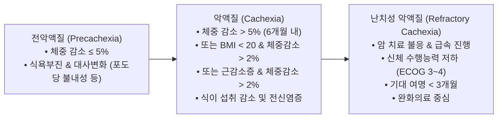
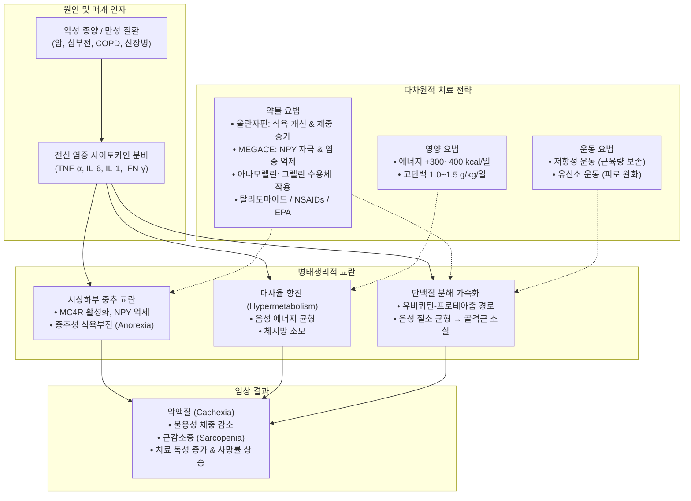

# 📑 [근감소증] PART 4. Cachexia (악액질)

> **핵심 요약 (Key Summary)**
> - **[[악액질]](Cachexia)**은 그리스어 *kakos*(나쁜)와 *hexis*(상태)에서 유래된 다인성 증후군으로, 단순 기아([[starvation]])나 신경성 식욕부진과 달리 **전통적인 영양 지원(conventional nutrition)으로 완전히 역전되지 않는 지속적인 골격근 소실**과 비정상적인 대사 항진(음성 질소·에너지 균형)을 특징으로 한다.
> - **진단 기준**: Fearon(2011) 기준(6개월 내 체중 감소 >5% 또는 BMI <20 kg/m² 및 체중 감소 >2% 또는 [[근감소증]] 동반 체중 감소 >2%)과 아시아인을 위한 **AWGC(2023) 기준**(기저질환 + 3~6개월 내 체중감소 >2% 또는 BMI <21 kg/m² + 식욕부진/악력 저하/CRP 상승 중 1개 이상)이 정립되어 있다.
> - **진행 단계**: **[[전악액질]](Precachexia)** → **[[악액질]](Cachexia)** → **[[난치성 악액질]](Refractory cachexia)**(ECOG PS 3~4, 기대여명 <3개월)의 3단계로 분류된다.
> - **치료 전략**: 단순 영양 보충을 넘어 **약물 치료**(합성 프로게스틴 [[메게스트롤 아세테이트|MEGACE]], 신규 [[그렐린]] 수용체 작용제 [[아나모렐린|Anamorelin]], 항정신병제 [[올란자핀|Olanzapine]] 등)와 **비약물적 다학제 치료**(고단백 식이 1.0~1.5 g/kg/일, 에너지 추가 300~400 kcal/일, 저항성·유산소 병행 운동)를 조기에 결합하는 다차원적 접근이 필수적이다.

---

## 📌 목차
1. [Chapter 18. Cachexia의 정의 및 진단](#chapter-18-cachexia의-정의-및-진단)
   - [1.1 악액질의 개념 및 서론](#11-악액질의-개념-및-서론)
   - [1.2 악액질을 유발하는 주요 기저 질환 및 유병률](#12-악액질을-유발하는-주요-기저-질환-및-유병률)
   - [1.3 악액질의 정의 및 진단 기준 변천](#13-악액질의-정의-및-진단-기준-변천)
   - [1.4 신체 구성 평가 방법 및 기준치](#14-신체-구성-평가-방법-및-기준치)
   - [1.5 아시아 악액질 워킹 그룹(AWGC) 진단 기준](#15-아시아-악액질-워킹-그룹awgc-진단-기준)
   - [1.6 악액질의 임상 단계 (Stages of Cachexia)](#16-악액질의-임상-단계-stages-of-cachexia)
   - [1.7 악액질과 체중 감소의 예후적 의미](#17-악액질과-체중-감소의-예후적-의미)
2. [Chapter 19. Cachexia의 예방과 치료](#chapter-19-cachexia의-예방과-치료)
   - [2.1 악액질 예방과 치료의 원칙](#21-악액질-예방과-치료의-원칙)
   - [2.2 악액질의 잠재적 약물 치료 (Pharmacotherapy)](#22-악액질의-잠재적-약물-치료-pharmacotherapy)
   - [2.3 악액질의 비약물적 치료 (Non-pharmacological Treatment)](#23-악액질의-비약물적-치료-non-pharmacological-treatment)
   - [2.4 악액질의 복잡성과 다학제 복합 치료의 중요성](#24-악액질의-복잡성과-다학제-복합-치료의-중요성)
3. [병태생리 및 치료 다이어그램](#병태생리-및-치료-다이어그램)
4. [출처 및 참고 문헌 (References)](#출처-및-참고-문헌-references)

---

## Chapter 18. Cachexia의 정의 및 진단
- **저자**: 황인규 (중앙의대)

### 1.1 악액질의 개념 및 서론
- **어원**: 그리스어 *kakos*(나쁜) + *hexis*(상태/조건)에서 유래하여 **'나쁜 신체 상태'**를 의미한다.
- **특징**: 다양한 기저 질환에 의해 유도되는 다인성(paraneoplastic/multifactorial) 대사 증후군이다.
  - 주로 **골격근량(skeletal muscle mass)의 지속적인 감소**가 핵심 특징이며, 체지방량 감소는 동반될 수도 있고 그렇지 않을 수도 있다.
  - 전신 쇠약, 체중 감소, 신체 기능 저하를 초래한다.
  - 암 환자에서는 항암화학요법의 치료 반응성을 약화시키고 독성 부작용을 증가시키며, 수술 후 합병증 및 사망률을 높이는 핵심 독립 요인으로 작용한다.
- **단순 영양실조와의 결정적 차이**:
  - 단순 기아(starvation)나 신경성 식욕부진은 영양 공급을 통해 근육과 지방이 회복될 수 있다.
  - 반면, **암 관련 [[악액질]](Cancer Cachexia)은 전통적인 영양 지원(total parenteral nutrition 등)만으로는 체중이 일시 안정화되더라도 골격근 손실이 지속되며 완전히 회복되지 않는다.**
  - 전신 염증 반응(systemic inflammation)과 대사 불균형(음성 질소 균형 및 음성 에너지 균형)이 복합적으로 관여하기 때문이다.

### 1.2 악액질을 유발하는 주요 기저 질환 및 유병률
- **악액질을 유발하는 대표적 만성 질환**:
  1. [[암]](Cancer)
  2. 만성 [[심부전]](Chronic Heart Failure, CHF)
  3. [[만성 폐쇄성 폐질환]](Chronic Obstructive Pulmonary Disease, COPD)
  4. 만성 신장병(Chronic Kidney Disease, CKD)
  5. [[류마티스]] 관절염(Rheumatoid Arthritis, RA)
  6. 기타 결합 조직 질환(Other collagen diseases)
  7. 만성 호흡부전(Chronic respiratory failure)
  8. 만성 간부전(Chronic liver failure)
  9. 진행성 악화 또는 통제되지 않는 만성 감염(HIV/AIDS 등)
- **서구 유병률 보고**:
  - 암 환자: 약 30%
  - 류마티스 관절염 환자: 약 30%
  - 만성 심부전 환자: 약 15%
  - COPD 환자: 약 5%
  - 미국에서는 악액질이 재원 기간 및 의료비 지출을 유의하게 증가시키는 주요 보건 문제로 확인되었다.

### 1.3 악액질의 정의 및 진단 기준 변천
#### (1) Evans 기준 (2008년)
- 기저 질환과 관련된 복잡한 대사 증후군으로 정의.
- **지방량 감소 여부와 무관하게 일어나는 골격근량 감소**를 핵심으로 제시.
- 성인의 체중 감소 및 소아의 [[성장]] 부진을 주요 임상 특징으로 규정하며, **부종이나 [[체액]] 저류(fluid retention)를 보정한 순수 체중 감소**를 진단에 적용.

#### (2) Fearon 국제 합의 기준 (Lancet Oncol, 2011/2012년)
- 암 악액질을 전통적인 영양 지원으로 부분적으로만 회복 가능한, 지속적인 골격근 손실 중심의 다인성 증후군으로 공식화.
- **Fearon 진단 기준**: 다음 중 하나 이상을 만족할 때 진단
  1. **최근 6개월간 체중 감소 > 5%** (단순 기아 제외)
  2. **체질량지수(BMI) < 20 kg/m² 이면서 체중 감소 > 2%**
  3. **[[근감소증]](Sarcopenia) 기준에 부합하면서 체중 감소 > 2%**:
     - 부속 골격근 지수(Appendicular Skeletal Muscle Index, ASMI): 남성 < 7.26 kg/m², 여성 < 5.45 kg/m²

#### (3) SCRINIO 워킹 그룹 기준 (Bozzetti & Mariani, 2009년)
- 체중 감소 정도에 따라 분류:
  - **전악액질(Precachexia)**: 체중 감소 < 10%
  - **악액질(Cachexia)**: 체중 감소 ≥ 10%
  - 여기에 식욕 부진, 피로(fatigue), 조기 포만감(early satiety) 중 최소 1개 증상 동반.
- 전신 염증 표지자나 정밀 근육량 측정을 필수 전제조건으로 요구하지 않아 임상적 실용성이 높은 진단법으로 평가받는다.

### 1.4 신체 구성 평가 방법 및 기준치
골격근량 평가를 위한 구체적 진단 기준치는 다음과 같다 (원문 기준):
1. **중간 [[상완근]] 면적 (Mid-arm muscle area, anthropometry)**:
   - 남성: `< 32 cm²`
   - 여성: `< 18 cm²`
2. **이중에너지 X선 흡수계측법 ([[DEXA]]) 부속 골격근 지수 (ASMI)**:
   - 남성: `< 7.26 kg/m²`
   - 여성: `< 5.45 kg/m²`
3. **복부 전산화단층촬영 ([[CT]]) [[요추]] 3번(L3) 골격근 지수 (SMI, Skeletal Muscle Index)**:
   - **글로벌(Global) 기준**: 남성 `< 55 cm²/m²`, 여성 `< 39 cm²/m²`
   - **한국인 기준**: 남성 `< 49 cm²/m²`, 여성 `< 31 cm²/m²`
4. **생체전기저항분석법 ([[BIA]]) 골 제외 전신 [[제지방량]] 지수 (FFMI)**:
   - 남성: `< 14.6 kg/m²`
   - 여성: `< 11.4 kg/m²`

> **[[비만]] 및 과체중 암 환자의 악액질 (Sarcopenic Obesity)**:
> 최근 비만 인구 증가로 BMI가 높아도 심각한 근육 소실이 발생하는 근감소성 비만이 흔하다. 유럽임상영양대사항회(ESPEN)는 노인 환자의 경우 BMI 22 kg/m² 이상을 정상 하한 기준으로 권장하며, Martin 등은 초기 BMI 수치와 체중 감소율을 조합한 단계별 위험 평가 모델을 제시하였다.

### 1.5 아시아 악액질 워킹 그룹(AWGC) 진단 기준
서양인 기준 체격 지표는 아시아인에게 과소평가될 수 있으므로, 2023년 Asian Working Group for Cachexia (Arai et al.)는 아시아인의 체격과 임상 환경을 반영한 새로운 합의안을 발표하였다.

| 구분 | 진단 항목 및 세부 기준 |
| :--- | :--- |
| **필수 1** | **기저 질환의 존재** (암, 만성 [[심부전]], COPD, 만성 신장병 등) |
| **필수 2** | **3~6개월 동안 체중 감소 > 2%** 또는 **저체중 (BMI < 21 kg/m²)** |
| **선택 (1개 이상)** | **가) 주관적 증상**: 식욕 부진(Anorexia) **나) 객관적 기능 측정**: 악력(Handgrip strength) 저하 (**남성 < 28 kg, 여성 < 18 kg**) **다) 전신 염증 바이오마커**: CRP 상승 (**> 5 mg/L** 또는 **> 0.5 mg/dL**) |

---

### 1.6 악액질의 임상 단계 (Stages of Cachexia)
암 악액질은 질환의 진행 경로에 따라 3단계의 연속선상으로 정의된다 (모든 환자가 순차적으로 모든 단계를 겪는 것은 아님).

> ![[Sarcopenia_Ch18_p295_Fig1.png|300]]
> **그림 18-1. 암 악액질의 임상 단계 (Stages of Cancer Cachexia).** 전악액질(체중 감소 ≤ 5%, 식욕부진 및 대사변화), 악액질(체중 감소 > 5% 또는 BMI < 20 kg/m² 및 체중 감소 > 2%, 식이 섭취 감소 및 전신염증), 난치성 악액질(수행상태 저하 ECOG 3~4, 예상 생존기간 3개월 미만).

#### (1) 전악액질 (Precachexia)
- 초기 임상적·대사적 이상 징후(식욕 부진, 인슐린 저항성/[[포도당]] 불내성 등)가 나타나는 단계.
- **5% 이하의 경미한 체중 감소**가 관찰됨.
- 본격적인 악액질로의 진행 위험은 종양의 종류 및 병기, 전신 염증 수준, 영양 섭취 불량, 항암 요법에 대한 반응성에 따라 결정된다.

#### (2) 악액질 (Cachexia)
- 체중 및 골격근 소실이 가속화되는 본격적인 단계.
- **지난 6개월간 평소 체중의 5% 이상 감소**, 또는 **BMI < 20 kg/m² 이면서 2% 이상의 지속적인 체중 감소**, 또는 **[[근감소증]]이 동반된 상태에서 2% 이상의 체중 감소**를 보임.
- 전신 염증(CRP 상승 등)과 지속적인 식이 섭취 부족이 동반된다.

#### (3) 난치성 악액질 (Refractory cachexia)
- 말기 암 환자 또는 모든 항암 치료에 불응하여 종양이 급속도로 진행하는 상태.
- 체중 감소를 되돌리는 적극적인 항악액질 대사 치료가 더 이상 효과를 발휘하지 못하거나 부적절한 단계.
- **낮은 수행 능력(WHO/ECOG Performance Status 3 또는 4)** 및 **3개월 미만의 기대 여명**으로 규정됨.
- 무리한 인공 영양 공급(TPN 등)은 합병증 위험이 이득을 상회하므로 지양하며, 오심 조절, 식욕 자극, 환자 및 가족의 식사 관련 심리적 고통 경감 등 완화적 대증 치료에 주력한다.

#### (4) 악액질의 중증도 평가
- 체중 감소의 절대량뿐만 아니라 **체중 감소 속도**와 **체내 [[단백질]](골격근) 및 에너지 저장소(지방)의 동시 소모율**에 따라 평가된다.
- 기저 체중이 낮은 환자(예: BMI 22에서 5 kg/m² 감소)는 [[비만]] 환자(BMI 35에서 5 kg/m² 감소)에 비해 동일한 감소율에서도 치명적인 결과를 맞이한다.
- 체중 감소 환자 중 골격근이 소모되어 근감소증이 동반된 경우가 체단백질이 유지된 경우보다 예후가 현저히 불량하다.

---

### 1.7 악액질과 체중 감소의 예후적 의미
1. **사망률과의 상관성**:
   - 체중 감소는 암 환자의 독립적인 사망 예측 인자이다.
   - **심장 악액질(Cardiac cachexia)**: [[심부전]] 중증도, 환자 연령, 좌심실 박출률, 운동 능력 등과 무관하게 독립적으로 불량한 사망률을 초래한다.
   - **요양원 입원 노인**: 한 달 동안 **5% 이상의 체중 감소**가 발생할 경우 **사망 위험이 10배 증가**한다.
   - **HIV/AIDS**: 3% 정도의 체중 감소만으로도 이환율과 사망 위험이 급격히 증가한다.
2. **임상적 징후로서의 한계와 논쟁**:
   - 임상 현장에서 정밀한 신체 구성 분석이 어렵기 때문에 체중 감소가 대리 지표로 널리 쓰여왔다.
   - Fouladiun 등은 식욕부진과 체지방 손실이 사망률의 강력한 예측 변수임을 보고한 반면, Fearon 등은 체중 감소 단독으로는 [[체액]] 저류, 골격근 vs 지방의 비율 변화 등 신체 기능에 미치는 전체 악영향을 대변하기 어렵다고 지적하였다.

---

## Chapter 19. Cachexia의 예방과 치료
- **저자**: 박송이 (가톨릭의대)

### 2.1 악액질 예방과 치료의 원칙
- **영양 공급의 한계**: 악액질 환자에게 단순한 고칼로리 영양 공급(TPN 포함)을 시행하더라도 지속되는 골격근 분해를 억제하지 못하며, 기저 질환에 의한 비정상적인 대사 상태(이화작용 항진)를 정상화하지 못한다.
- **치료의 핵심 전략**: **적절한 영양 상태를 유지함과 동시에 병리적인 골격근 소실(Muscle Wasting)을 직접적으로 억제·방지**하는 복합 중재가 요구된다.

---

### 2.2 악액질의 잠재적 약물 치료 (Pharmacotherapy)

#### 1) 올란자핀 ([[Olanzapine]])
- **기전**: [[도파민]](D2) 및 [[세로토닌]](5-HT2) 수용체를 차단하여 중추성 식욕을 자극하는 비정형 항정신병 약물.
- **임상 근거**:
  - 무작위 배정 3상 임상시험(124명 대상, 화학요법을 받는 진행성 암 환자):
    - **체중 5% 이상 증가 비율**: 올란자핀군 **60%** vs 위약군 **9%** (현저한 개선).
    - 시각아날로그척도(VAS) 및 FAACT ACS 설문 평가에서 식욕, 삶의 질, 영양 상태가 유의하게 향상됨.
    - 화학요법의 독성 부작용 감소 경향 확인.
- **장점**: 부작용이 미미하여 환자 내약성이 우수하며, 저렴하고 복용이 간편하여 새로 진단된 암 환자의 식욕 개선 및 체중 증가 1차 전략으로 유망하다.

#### 2) 메게스트롤 아세테이트 ([[Megestrol acetate]], MEGACE) 및 메드록시프로게스테론 (MPA)
- **개요**: 합성 프로게스틴 제제로, 1993년 미국 FDA로부터 AIDS 환자의 식욕부진 및 악액질 치료제로 공인 승인됨.
- **기전**:
  - [[시상하부]] 신경펩타이드 Y(NPY)의 합성 및 방출 촉진.
  - 전신 염증성 사이토카인인 **[[IL-1]](Interleukin-1), [[IL-6]], [[TNF-alpha|TNF-α]]** 및 [[세로토닌]] 분비 억제.
- **임상 근거**:
  - 35건의 무작위 임상시험(3,963명 대상) 메타분석: 위약 대비 식욕 개선 및 체중 증가에 탁월한 효과 입증.
  - 특히 **고용량** 투여군에서 저용량보다 체중 증가 효과가 더욱 뚜렷함. 환자의 삶의 질(QOL) 개선 효과 확인.

#### 3) 그렐린 ([[Ghrelin]]) 및 아나모렐린 ([[Anamorelin]])
- **[[그렐린]](Ghrelin)**: 위(stomach) 점막에서 분비되는 28개 [[아미노산]] 위장관 펩타이드 호르몬으로, [[성장호르몬]] 분비촉진제 수용체(GHS-R1a)의 내인성 리간드이다. 식욕 촉진, 위장관 운동성 항진, 에너지 대사 조절 작용을 수행한다.
  - 암 환자([[위암]], [[폐암]] 등)는 식욕부진에 대항하여 체내 순환 그렐린 수치가 보상적으로 증가하지만 '그렐린 저항성'이 발생해 있다.
- **아나모렐린 (Anamorelin)**: 경구 투여가 가능한 합성 그렐린 수용체 작용제.
  - **ROMANA 1 & ROMANA 2 3상 임상시험 (비소세포폐암 악액질)**:
    - 체중 변화: 위약 대비 각각 **+2.20 ± 0.33 kg**, **+0.95 ± 0.39 kg**의 유의미한 체중 증가 달성 (`p < 0.0001`).
    - 제지방 체중(lean body mass)을 회복시켰으나, **악력(Handgrip strength) 개선으로까지 이어지지는 않음**.
  - **ROMANA 3 장기 안전성 확장 시험**: 24주간 아나모렐린군 평균 **+3.1 ± 0.6 kg** 체중 증가 (위약군 +0.9 ± 0.7 kg 대비 `p < 0.0001`).

#### 4) 칸나비노이드 ([[Cannabinoids]])
- **성분**: 마리화나 유래 델타-9-테트라하이드로칸나비놀(THC).
- **기전**: 중추신경계 칸나비노이드 수용체 활성화, [[프로스타글란딘]] 합성 억제 및 [[IL-1]] 분비 조절 추정.
- **임상 한계**: 기대와 달리 대규모 3상 무작위 대조 시험(Jatoi et al., Strasser et al.)에서 **MEGACE나 위약 대비 우월한 식욕 개선이나 체중 증가 이점을 입증하지 못함**.

#### 5) 멜라노코르틴-4 수용체 길항제 ([[MC4R Antagonists]])
- **기전**: [[시상하부]] MC4 수용체는 식욕 억제 및 대사율 증가 신호를 매개하며, 자극 시 NPY 감소 및 식사량 저하를 유발함.
- **연구 현황**: 동물 모델에서 MC4 수용체 차단 시 악액질에 따른 식욕부진, 근육 소실, 체지방 감소를 억제하는 효과가 확인되었으나, 현재까지 인체 대상 확립된 임상 데이터는 부족하여 향후 연구 대상임.

#### 6) 탈리도마이드 ([[Thalidomide]]) 및 에타너셉트 ([[Etanercept]])
- **악액질 매개 [[사이토카인]]**: TNF-α, [[IL-6]], IFN-γ 등이 [[시상하부]] [[렙틴]] 음성 피드백 왜곡 및 [[단백질]] 분해를 촉진함.
- **탈리도마이드(Thalidomide)**: TNF-α 분비 억제, 전사인자 [[NF-κB]] 억제, [[COX]]-2 감소, 혈관신생 억제 특성 보유. 무작위 대조 임상시험에서 말기 [[췌장암]] 환자의 체중 및 골격근 소실을 유의하게 완화함.
- **에타너셉트(Etanercept)**: 가용성 p75 TNFR:Fc 융합 단백질. 단독 투여 시에는 암 악액질에 효과가 없었으며, 도세탁셀과의 병용 연구에서 피로도 및 내약성 개선 경향만 관찰됨.

#### 7) 오메가-3 지방산 및 에이코사펜타엔산 ([[EPA]])
- **기전**: 염증성 [[사이토카인]] 생성 감소, 암세포에서 분비되는 악액질 유도 인자(Proteolysis-Inducing Factor, PIF 등) 차단.
- **임상 평가**:
  - Colomer 등의 17개 시험 메타분석: 8주 치료 후 암 악액질 증상 및 삶의 질 매개변수 개선 보고.
  - Dewey 코크란 리뷰 및 Mazzotta 체계적 문헌고찰: 위약 대비 체중, 근육량, 생존율 개선 효과를 뒷받침하는 결정적 증거가 부족하다고 결론지음.
  - 현재로서는 EPA 단독 요법보다는 다약제·다학제 병합 요법의 일환으로 활용이 권장됨.

#### 8) 코르티코스테로이드 ([[Corticosteroids]])
- **효과**: 덱사메타손 등은 단기 투여 시 식욕 증진과 삶의 질 개선에 신속한 효과를 보임.
- **치명적 부작용**: **장기 사용 시 골격근 [[단백질]] 분해 촉진(근위축 악화), 인슐린 저항성 유발, 수분 저류, 부신 기능 억제** 등을 초래함.
- **원칙**: 장기 투여는 절대 금기이며, **악액질 말기 환자에서 1~3주의 단기 증상 완화 목적으로만 제한적 사용**.

#### 9) 기타 약물 요법
- **비스테로이드 항염증제 ([[NSAIDs]])**: 전신 염증 조절을 통해 체중 및 생존율 개선 가능성이 제시되었으나 연구 간 이질성이 커 일반적 사용 권고에는 근거가 부족함.
- **β2-[[아드레날린]] 작용제 (포르모테롤, Formoterol)**: 동물 연구에서 근단백질 분해 억제, 근세포 세포자살(apoptosis) 방지 및 골격근 비대 유도 확인.
- **항암화학요법 병합 요법**: Mantovani 등은 항산화제 + 약물-영양 지원 + 프로게스틴 + [[COX]]-2 억제제를 조합한 다각적 병합 요법이 악액질 증후군 완화에 안전하고 효과적임을 3상 임상시험을 통해 입증함.
- **[[비타민 D]] (Vitamin D)**: 근육 조직의 VDR 발현을 통해 골격근 대사에 기여하지만, 전이성 결장암 환자 대상 2상 임상시험에서 고용량 비타민 D3 보충이 체성분(근육/지방 면적) 변화를 일으키지 못함.

---

### 2.3 악액질의 비약물적 치료 (Non-pharmacological Treatment)

#### 1) 식이 요법 (Nutritional Therapy)
- **에너지 결손 규모**: 암 악액질 환자의 평균 칼로리 부족은 **하루 250~400 kcal**에 달함 (진행 암 환자는 약 200 kcal/일).
- **[[단백질]] 섭취 목표**:
  - 암 악액질 환자의 기저 단백질 섭취량: 약 0.7~1.0 g/kg/일 (부족 상태).
  - **권장 단백질 섭취량: `1.0 ~ 1.5 g/kg/일`** (대사 저항 극복을 위해 기존 대비 50% 증량 필요).
  - **식이 에너지 추가: 하루 `300 ~ 400 kcal` 추가 공급** 필요.
- **영양 중재의 효과**:
  - 경구 영양 보충 메타분석: 에너지 섭취량 하루 430 kcal 증가, 체중 1.9 kg 증가 및 삶의 질 개선 관찰. 생존 기간 연장 효과는 제한적이나 비경구 영양(TPN)이 적절히 병행된 특정 군에서 단기(6~8주) 연장 확인.

#### 2) 운동 요법 (Exercise Therapy)
- **생리학적 이점**: [[인슐린]] 민감도 증가, 근단백질 합성 촉진, 세포 내 항산화 [[효소]] 활성화, 전신 염증 반응 억제 및 면역 기능 강화.
- **운동 처방 원칙**:
  - **저항성 운동(Resistance exercise)**: 근력 및 골격근량 보존.
  - **유산소/지구력 운동(Endurance exercise)**: 암 관련 피로(cancer-related fatigue) 완화 및 심폐 기능 유지.
  - 두 가지 운동을 **병행(combined exercise)**하는 프로그램이 필수적이다.
- **국내 임상 연구 (Park et al., 2023)**:
  - 진행성 위장관암 환자 대상 6주 운동 중재 프로그램: 환자의 **63.3%**가 성공적으로 완수.
  - **운동 순응도가 높은 그룹은 낮은 그룹에 비해 골격근량과 신체 기능을 유의하게 유지하였으며, [[근감소증]] 발생률이 유의하게 낮았고 전반적인 생존율(Overall Survival)이 유의하게 향상**되었다.

---

### 2.4 악액질의 복잡성과 다학제 복합 치료의 중요성
- 악액질은 종양 요인, 면역계 [[사이토카인]] 폭풍, 신경내분비계 교란, 대사 항진이 얽힌 복합 질환이다.
- 단일 약제나 단순 영양 공급만으로는 해결할 수 없으며, **조기 진단(Precachexia 단계 발굴)을 기반으로 영양 공급 + 표적 약물(식욕 촉진·염증 억제) + 맞춤형 운동 요법을 융합한 다차원적 다학제 치료(Multimodal intervention)**를 시행해야만 환자의 [[제지방량]] 보존, 항암 치료 지속성 및 삶의 질 향상을 이끌어낼 수 있다.

---

## 병태생리 및 치료 다이어그램

---

## 출처 및 참고 문헌 (References)

### Chapter 18 References
1. Anker MS, et al. Orphan disease status of cancer cachexia in the USA and in the European Union: a systematic review. *J Cachexia Sarcopenia Muscle*. 2019;10:22–34.
2. Anker SD, et al. Prognostic importance of weight loss in chronic heart failure and the effect of treatment with angiotensin-converting-enzyme inhibitors: an observational study. *Lancet*. 2003;361:1077-83.
3. Arai H, et al. Diagnosis and outcomes of cachexia in Asia: Working Consensus Report from the Asian Working Group for Cachexia. *J Cachexia Sarcopenia Muscle*. 2023;14:1949-58.
4. Arthur ST, Noone JM, Van Doren BA, Roy D, Blanchette CM. One-year prevalence, comorbidities and cost of cachexia-related inpatient admissions in the USA. *Drugs Context*. 2014;3:212265.
5. Bozzetti F, Mariani L. Defining and classifying cancer cachexia: a proposal by the SCRINIO Working Group. *JPEN J Parenter Enteral Nutr*. 2009;33:361-7.
6. Carson MA, et al. Exploring the prevalence, impact and experience of cardiac cachexia in patients with advanced heart failure and their caregivers: A sequential phased study. *Palliat Med*. 2022;36:1118-28.
7. Cederholm T, et al. Diagnostic criteria for malnutrition — An ESPEN Consensus Statement. *Clin Nutr*. 2015;34:335-40.
8. Dworkin MS, Williamson JM, Adult/Adolescent Spectrum of HIV Disease Project. AIDS wasting syndrome: trends, influence on opportunistic infections, and survival. *J Acquir Immune Defic Syndr*. 2003;33:267-73.
9. Evans WJ, et al. Cachexia: a new definition. *Clin Nutr*. 2008;27:793-9.
10. Fearon K, et al. Definition and classification of cancer cachexia: an international consensus. *Lancet Oncol*. 2011;12:489-95.
11. Fearon KC, Voss AC, Hustead DS, Cancer Cachexia Study Group. Definition of cancer cachexia: effect of weight loss, reduced food intake, and systemic inflammation on functional status and prognosis. *Am J Clin Nutr*. 2006;83:1345-50.
12. Fouladiun M, et al. Body composition and time course changes in regional distribution of fat and lean tissue in unselected cancer patients on palliative care-correlations with food intake, metabolism, exercise capacity, and hormones. *Cancer*. 2005;103:2189–98.
13. Martin L, et al. Diagnostic criteria for the classification of cancer-associated weight loss. *J Clin Oncol*. 2015;33:90-9.
14. McDonald MN, et al. It's more than low BMI: prevalence of cachexia and associated mortality in COPD. *Respir Res*. 2019;20:100.
15. Prado CM, et al. Prevalence and clinical implications of sarcopenic obesity in patients with solid tumours of the respiratory and gastrointestinal tracts: a population-based study. *Lancet Oncol*. 2008;9:629-35.
16. Sullivan DH, Johnson LE, Bopp MM, Roberson PK. Prognostic significance of monthly weight fluctuations among older nursing home residents. *J Gerontol A Biol Sci Med Sci*. 2004;59:M633–9.
17. Toufik H, et al. Cachexia prevalence in a population of Moroccan women with rheumatoid arthritis. *Mediterr J Rheumatol*. 2023;34:506-12.

### Chapter 19 References
1. Anti M, et al. Effect of omega-3 fatty acids on rectal mucosal cell proliferation in subjects at risk for colon cancer. *Gastroenterology*. 1992;103:883-891.
2. Baldwin C, Spiro A, Ahern R, Emery PW. Oral nutritional interventions in malnourished patients with cancer: a systematic review and meta-analysis. *J Natl Cancer Inst*. 2012;104:371-85.
3. Brown JC, Valyi-Nagy K, Vitolins MZ, et al. Effect of high-dose vs standard-dose vitamin D3 supplementation on body composition among patients with advanced or metastatic colorectal cancer: a randomized trial. *Cancers (Basel)*. 2020;12:3451.
4. Bruera E, Macmillan K, Kuehn N, Hanson J, MacDonald RN. A controlled trial of megestrol acetate on appetite, caloric intake, nutritional status, and other symptoms in patients with advanced cancer. *Cancer*. 1990;66:1279-1282.
5. Busquets S, Figueras M, Fuster G, et al. Anticachectic effects of formoterol: a drug for potential treatment of muscle wasting. *Cancer Res*. 2004;64:6725-31.
6. Cannabis-In-Cachexia-Study-Group. Comparison of orally administered cannabis extract and delta-9-tetrahydrocannabinol in treating patients with cancer-related anorexia-cachexia syndrome: a multicenter, phase III, randomized, double-blind, placebo-controlled clinical trial. *J Clin Oncol*. 2006;24:3394-3400.
7. Colomer R, et al. N-3 fatty acids, cancer and cachexia: a systematic review of the literature. *Br J Nutr*. 2007;97:823-831.
8. Currow D, et al. ROMANA 3: a phase 3 safety extension study of anamorelin in advanced non-small-cell lung cancer (NSCLC) patients with cachexia. *Ann Oncol*. 2017;28:1949-1956.
9. de Gramont A, Van Cutsem E, Schmoll HJ, et al. The evolution of adjuvant therapy in the treatment of early-stage colon cancer. *Clin Colorectal Cancer*. 2011;10:218-26.
10. DeBoer MD, Marks DL. Therapy insight: Use of melanocortin antagonists in the treatment of cachexia in chronic disease. *Nat Clin Pract Endocrinol Metab*. 2006;2:459-466.
11. Dewey A, Baughan C, Dean T, Higgins B, Johnson I. Eicosapentaenoic acid (EPA, an omega-3 fatty acid from fish oils) for the treatment of cancer cachexia. *Cochrane Database Syst Rev*. 2007;CD004597.
12. Fearon KC, et al. Effect of a protein and energy dense N-3 fatty acid enriched oral supplement on loss of weight and lean tissue in cancer cachexia: a randomised double blind trial. *Gut*. 2003;52:1479-86.
13. Fearon KC, Von Meyenfeldt MF, Moses AG, et al. Effect of a protein and energy dense N-3 fatty acid enriched oral supplement on loss of weight and lean tissue in cancer cachexia: a randomised double blind trial. *Gut*. 2003;52:1479-86.
14. Garcia M, Seelaender M, Sotiropoulos A, Coletti D, Lancha AH Jr. Vitamin D, muscle recovery, sarcopenia, cachexia, and muscle atrophy. *Nutrition*. 2019;60:66-9.
15. Garcia JM, et al. Active ghrelin levels and active to total ghrelin ratio in cancer-induced cachexia. *J Clin Endocrinol Metab*. 2005;90:2920-2926.
16. Gordon JN, et al. Thalidomide in the treatment of cancer cachexia: a randomised placebo controlled trial. *Gut*. 2005;54:540-545.
17. Hanada T, et al. Upregulation of ghrelin expression in cachectic nude mice bearing human melanoma cells. *Metabolism*. 2004;53:84-88.
18. Inui A. Cancer anorexia-cachexia syndrome: are neuropeptides the key? *Cancer Res*. 1999;59:4493-4501.
19. Inui A. Cancer anorexia-cachexia syndrome: current issues in research and management. *CA Cancer J Clin*. 2002;52:72-91.
20. Jatoi A, et al. Dronabinol versus megestrol acetate versus combination therapy for cancer-associated anorexia: a North Central Cancer Treatment Group study. *J Clin Oncol*. 2002;20:567-573.
21. Kim YS, Sainz RD. Beta-adrenergic agonists and hypertrophy of skeletal muscles. *Life Sci*. 1992;50:397-407.
22. Kojima M, et al. Ghrelin is a growth-hormone-releasing acylated peptide from stomach. *Nature*. 1999;402:656-660.
23. Kumar NB, et al. Cancer cachexia: traditional therapies and novel molecular mechanism-based approaches to treatment. *Curr Treat Options Oncol*. 2010;11:107-17.
24. Lai V, George J, Richey N, et al. Results of a pilot study of the effects of celecoxib on cancer cachexia in patients with cancer of the head, neck, and gastrointestinal tract. *Head Neck*. 2008;30:67-74.
25. Loprinzi CL, Ellison NM, Schaid DJ, et al. Randomized comparison of megestrol acetate versus dexamethasone versus fluoxymesterone for the treatment of cancer anorexia/cachexia. *J Clin Oncol*. 1999;17:3299-306.
26. Loprinzi CL, et al. Phase III evaluation of four doses of megestrol acetate as therapy for patients with cancer anorexia and/or cachexia. *J Clin Oncol*. 1993;11:762-767.
27. Maltoni M, et al. High-dose progestins for the treatment of cancer anorexia-cachexia syndrome: a systematic review of randomised clinical trials. *Ann Oncol*. 2001;12:289-300.
28. Mantovani G, Macciò A, Madeddu C, et al. A phase II study with antioxidants, both in the diet and supplemented, pharmaconutritional support, progestagen, and anti-cyclooxygenase-2 showing efficacy and safety in patients with cancer-related anorexia/cachexia and oxidative stress. *Cancer Epidemiol Biomarkers Prev*. 2006;15:1030-4.
29. Mantovani G, Madeddu C, Macciò A, et al. Randomized phase III clinical trial of five different arms of treatment for patients with cancer cachexia: interim results. *Nutrition*. 2008;24:305-13.
30. Mantovani G, Macciò A, Massa E, Madeddu C. Managing cancer-related anorexia/cachexia. *Drugs*. 2001;61:499-514.
31. Marks DL, Butler AA, Turner R, Brookhart G, Cone RD. Differential role of melanocortin receptor subtypes in cachexia. *Endocrinology*. 2003;144:1513-1523.
32. Mazzotta P, Jeney CM. Anorexia-cachexia syndrome: a systematic review of the role of dietary polyunsaturated fatty acids in the management of symptoms, survival, and quality of life. *J Pain Symptom Manage*. 2009;37:1069-77.
33. McGlashan TH, et al. Randomized, double-blind trial of olanzapine versus placebo in patients prodromally symptomatic for psychosis. *Am J Psychiatry*. 2006;163:790-799.
34. McMillan DC, Wigmore SJ, Fearon KC, et al. A prospective randomized study of megestrol acetate and ibuprofen in gastrointestinal cancer patients with weight loss. *Br J Cancer*. 1999;79:495-500.
35. Moertel CG, Schutt AJ, Reitemeier RJ, Hahn RG. Corticosteroid therapy of preterminal gastrointestinal cancer. *Cancer*. 1974;33:1607-9.
36. Monk JP, et al. Assessment of tumor necrosis factor alpha blockade as an intervention to improve tolerability of dose-intensive chemotherapy in cancer patients. *J Clin Oncol*. 2006;24:1852-1859.
37. Moses AW, Slater C, Preston T, Barber MD, Fearon KC. Reduced total energy expenditure and physical activity in cachectic patients with pancreatic cancer can be modulated by an energy and protein dense oral supplement enriched with n-3 fatty acids. *Br J Cancer*. 2004;90:996-1002.
38. Nagaya N, Kojima M, Kangawa K. Ghrelin, a novel growth hormone-releasing peptide, in the treatment of cardiopulmonary-associated cachexia. *Intern Med*. 2006;45:127-134.
39. Oldervoll LM, et al. Physical exercise for cancer patients with advanced disease: a randomized controlled trial. *Oncologist*. 2011;16:1649-57.
40. Park SE, et al. Feasibility and safety of exercise during chemotherapy in people with gastrointestinal cancers: a pilot study. *Support Care Cancer*. 2023;31:561.
41. Reid J, Hughes CM, Murray LJ, Parsons C, Cantwell MM. Non-steroidal anti-inflammatory drugs for the treatment of cancer cachexia: a systematic review. *Palliat Med*. 2013;27:295-303.
42. Ruiz Garcia V, López-Briz E, Carbonell Sanchis R, Gonzálvez Perales JL, Bort-Martí S. Megestrol acetate for treatment of anorexia-cachexia syndrome. *Cochrane Database Syst Rev*. 2013;CD004310.
43. Sampaio EP, Sarno EN, Galilly R, Cohn ZA, Kaplan G. Thalidomide selectively inhibits tumor necrosis factor alpha production by stimulated human monocytes. *J Exp Med*. 1991;173:699-703.
44. Sandhya L, et al. Randomized Double-Blind Placebo-Controlled Study of Olanzapine for Chemotherapy-Related Anorexia in Patients With Locally Advanced or Metastatic Gastric, Hepatopancreaticobiliary, and Lung Cancer. *J Clin Oncol*. 2023;41:2617-2627.
45. Scarlett JM, Marks DL. The use of melanocortin antagonists in cachexia of chronic disease. *Expert Opin Investig Drugs*. 2005;14:1233-1239.
46. Solheim TS, Fearon KC, Blum D, Kaasa S. Non-steroidal anti-inflammatory treatment in cancer cachexia: a systematic literature review. *Acta Oncol*. 2013;52:6-17.
47. Temel JS, et al. Anamorelin in patients with non-small-cell lung cancer and cachexia (ROMANA 1 and ROMANA 2): results from two randomised, double-blind, phase 3 trials. *Lancet Oncol*. 2016;17:519-531.
48. Tisdale MJ. Biology of cachexia. *J Natl Cancer Inst*. 1997;89:1763-1773.
