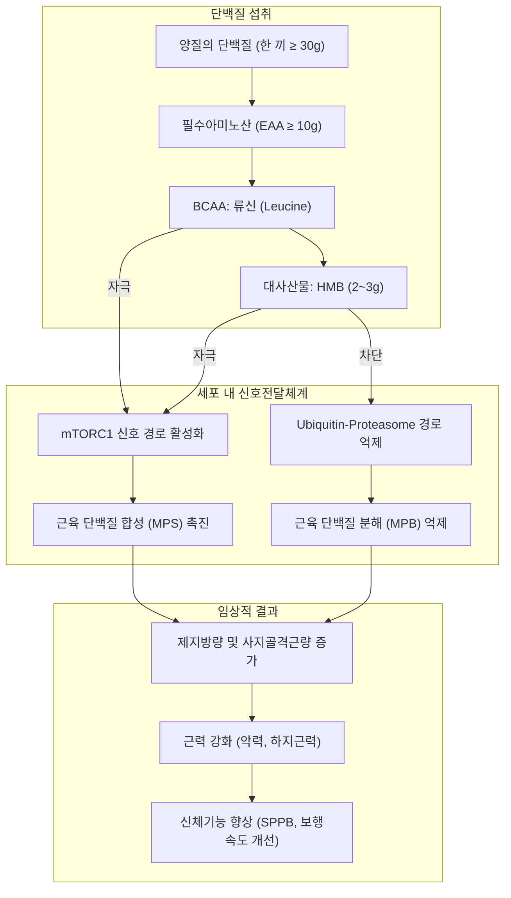
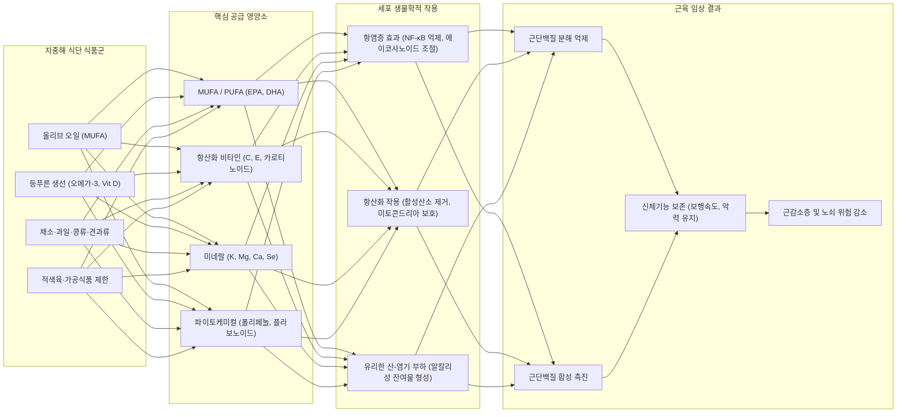

# 📑 [근감소증] PART 7-1 근감소증의 비약물 치료: 영양 (Ch30~32)

> **핵심 요약 (Key Summary)**
> 1. **열량과 [[단백질]]**: 노인의 근육 보존을 위해서는 충분한 열량 공급이 선행되어야 하며, 에너지가 부족하면 단백질이 열량원으로 소모되어 근육 합성에 기여하지 못한다. 노화에 따른 [[동화 저항성(Anabolic Resistance)]]을 극복하기 위해 건강한 노인은 체중 1 kg당 1.2~1.5 g(급만성 질환 시 최대 2.0 g)의 [[단백질]]과 끼니당 30 g(필수아미노산 10 g, 특히 [[류신(Leucine)]] 및 [[HMB]])의 균등 섭취가 권장된다.
> 2. **비타민과 무기질**: [[비타민 D]]는 [[mTOR]] 경로 활성화 및 근세포 성장에 관여하며, 기저 혈중 수치가 결핍(<30 nmol/L 또는 <30 μg/L)된 노인에서 보충 효과(단백질/운동 병행 시 극대화)가 뚜렷하다. 항산화 비타민(C, E, 카로티노이드)은 보충제보다 자연식품 형태로 섭취해야 하며, 고용량 항산화 보충제는 오히려 근육 적응을 둔화시킬 수 있다. [[마그네슘]], [[셀레늄]], [[칼슘]]의 결핍 방지와 항상성 유지가 필수적이다.
> 3. **오메가-3 지방산과 식이패턴**: [[오메가-3 지방산]](EPA, DHA)은 아라키돈산 경로를 억제하여 전신 염증을 낮추고 단백질 합성을 촉진하며, 하루 2 g 이상 6개월 이상의 장기 보충 시 보행속도, 악력, 1-RM 개선에 긍정적 영향을 준다. 올리브유, 통곡물, 채소·과일, 생선이 풍부한 [[지중해식 식단(Mediterranean Diet)]] 및 북유럽 식단은 항산화·항염증 및 산-염기 부하 완화를 통해 [[근감소증]]과 [[노쇠]] 위험을 유의미하게 경감시킨다.

---

## 📌 목차
1. [Chapter 30. 열량과 단백질 (Intake of Energy and Protein)](#chapter-30-열량과-단백질-intake-of-energy-and-protein)
   - [1.1 열량 (Energy)](#11-열량-energy)
   - [1.2 단백질 (Protein)](#12-단백질-protein)
   - [1.3 단백질 대사 및 작용 기전 흐름도](#13-단백질-대사-및-작용-기전-흐름도)
2. [Chapter 31. 비타민과 무기질 (Vitamins and Minerals)](#chapter-31-비타민과-무기질-vitamins-and-minerals)
   - [2.1 서론 및 미량 영양소의 중요성](#21-서론-및-미량-영양소의-중요성)
   - [2.2 근감소증과 비타민](#22-근감소증과-비타민)
   - [2.3 근감소증과 무기질](#23-근감소증과-무기질)
   - [2.4 소결 및 미량 영양소 요약](#24-소결-및-미량-영양소-요약)
3. [Chapter 32. 오메가-3 지방산과 식이패턴 (Omega-3 Fatty Acids and Dietary Pattern)](#chapter-32-오메가-3-지방산과-식이패턴-omega-3-fatty-acids-and-dietary-pattern)
   - [3.1 오메가-3 지방산 (Omega-3 Fatty Acids)](#31-오메가-3-지방산-omega-3-fatty-acids)
   - [3.2 식이패턴 (Dietary Patterns)](#32-식이패턴-dietary-patterns)
   - [3.3 지중해 식단의 근육 보호 기전 다이어그램](#33-지중해-식단의-근육-보호-기전-다이어그램)
4. [출처 및 참고 문헌 (References)](#4-출처-및-참고-문헌-references)

---

## Chapter 30. 열량과 단백질 (Intake of Energy and Protein)
- **저자**: 박용순 (한양대학교)

### 1.1 열량 (Energy)

#### (1) 열량 필요량과 섭취 실태
- **열량 평형의 중요성**: 생명 유지와 신체 기능 유지를 위해 적절한 열량 섭취가 필수적이다. 노화는 체지방 증가와 제지방(근육량) 감소가 동시에 나타나기 쉬우므로 노인의 체중 감소는 곧 직접적인 근육 감소를 의미한다.
- **노인기 에너지필요추정량(EER, Estimated Energy Requirements)**:
  - 2020 한국인 영양소섭취기준 체위기준 적용 ([[비만]] 예방을 고려해 100 kcal 단위 절삭).
  - 산출식 및 설정값:

| 성별 | 연령 구분 | 산출식 (산출값) | 최종 설정값 (kcal/일) |
| :--- | :--- | :--- | :--- |
| **남자** | 65~74세 | $662 - 9.53 \times 69.5 + 1.11 \times [15.91 \times 62.4 + 539.6 \times 1.662] = 2,097\text{ kcal/일}$ | **2,000** |
| | $\ge 75$세 | $662 - 9.53 \times 75 + 1.11 \times [15.91 \times 60.1 + 539.6 \times 1.631] = 1,986\text{ kcal/일}$ | **1,900** |
| **여자** | 65~74세 | $354 - 6.91 \times 69.5 + 1.12 \times [9.36 \times 50.0 + 726 \times 1.529] = 1,641\text{ kcal/일}$ | **1,600** |
| | $\ge 75$세 | $354 - 6.91 \times 75 + 1.12 \times [9.36 \times 46.1 + 726 \times 1.467] = 1,512\text{ kcal/일}$ | **1,500** |
*(신체활동계수: 남자 비활동적 1.0, 저활동적 1.11, 활동적 1.25, 매우 활동적 1.48; 여자 비활동적 1.0, 저활동적 1.12, 활동적 1.27, 매우 활동적 1.45)*

- **실제 섭취 실태**: 2021년도 국민영양통계에 따르면 65세 이상 노인의 1일 평균 열량 섭취량은 남자 $1,808 \pm 30\text{ kcal}$, 여자 $1,354 \pm 22\text{ kcal}$로 EER 권장량 대비 현저히 낮은 결핍 상태이다.
- **섭취 저하의 원인**: 미뢰 수 감소 및 후각 감퇴로 인한 식욕 저하, 소화기능 저하 및 흡수 지연, 사회심리적 고립, 유병 상태 및 다제약물 복용(polypharmacy), 활동량 감소.

#### (2) 열량과 근감소증
- **영양적 노쇠(Nutritional Frailty)**: 노화에 따른 비의도적 체중 감소와 신체 기능 감소가 결합된 상태로, 요양시설 거주 노인의 30~50%가 영양적 노쇠 상태에 해당한다.
- **에너지 공급 우선 원칙**: 열량 섭취가 불충분한 기아·저열량 상태에서 단백질만 단독 투여하면, 단백질이 근육 합성에 사용되지 못하고 [[포도당]] 신생합성(gluconeogenesis) 등 **에너지원으로 우선 소모**되어 버린다. 따라서 근육 합성 촉진을 위해서는 충분한 기저 에너지 공급이 필수적으로 선행되어야 한다.
- **열량 보충 임상 연구 근거**:

| 연구자 (연도) | 대상군 및 포함기준 | 중재 내용 | 기간 | 주요 결과 |
| :--- | :--- | :--- | :--- | :--- |
| **Englund et al. (2018)** | $\ge 70$세, 이동성 제한(SPPB < 9), 비타민 D 9~24 ng/mL, MMSE > 24 | • 중재군(59명): 영양보충제(150 kcal, 유청단백질 20g, 비타민D, Ca) + 운동 3일/주 • 대조군(60명): 위약(30 kcal) + 운동 3일/주 | 24주 | 근밀도(muscle density) 유의한 증가 |
| **Karlsson et al. (2021)** | $\ge 75$세, 요양원 거주 노인 (BMI > 30 제외) | • 중재군(52명): 영양보충액(600 kcal, 단백질 36g) + 의자 일어서기 4회/일 • 대조군(49명): 통상 관리 | 12주 | 의자에서 일어서기 수행능력 개선 |
| **Herrera-Martinez et al. (2023)** | 18~85세, 심부전 입원력(NT-proBNP < 50%) | • 중재군(19명): 지중해식단 + 고열량·고단백 보충제(오메가-3, 비타민D) • 대조군(19명): 지중해식단 + 비타민D | 24주 | 제지방량(lean mass) 및 체중 증가 |

---

### 1.2 단백질 (Protein)

#### (1) 단백질 권장량과 질소평형
- **[[아미노산]] 분류**:
  - **필수아미노산(Essential AA, 9종)**: 체내 합성 불가, 반드시 식품으로 섭취 ([[메티오닌]], 루이신, 이소루이신, 발린, 라이신, 페닐알라닌, 트레오닌, 트립토판, 히스티딘).
  - **비필수아미노산(Non-essential AA, 5종)**: 체내 합성 가능 (알라닌, 아스파르트산, 아스파라긴, [[글루탐산]], 세린).
  - **조건적 필수아미노산(Conditionally Essential AA, 7종)**: 특정 생리·병적 상태 시 합성 제한 (아르기닌, [[시스테인]], [[티로신]], 글루타민, 글리신, 프롤린, 타우린).
- **분지쇄아미노산(BCAA)과 동화 역치**:
  - [[류신(Leucine)]], [[이소류신]], [[발린]] 중 특히 류신은 근육 조직에서 직접 대사되며, [[단백질]] 합성 신호전달체계인 [[mTOR(mammalian target of rapamycin)]] 경로를 직접 활성화한다.
  - 노인기는 단백질 동화 저항성(Anabolic Resistance)으로 인해 젊은 성인보다 근단백 합성을 유도하기 위한 **혈중 아미노산 역치(threshold)**가 훨씬 높다.
- **국내외 단백질 섭취 기준 비교**:
  - **2020 한국인 영양소 섭취기준**: 건강한 65세 이상 노인의 권장섭취량은 체중 1 kg당 **0.91 g/일** (남자 60 g/일, 여자 50 g/일). 이는 질소평형 유지를 위한 최소 필요량(0.73 g/kg/일)을 기준으로 1.96 SD(변이계수 12.5%)를 더한 보수적 수치로, [[근감소증]] 예방을 위한 대사적 요구량을 반영하지 못했다는 한계가 있다.
  - **대한노인병학회·한국영양학회 공동 합의안(2018)**: 근감소증 예방을 위해 체중 1 kg당 **1.2 g/일**, 필수아미노산 **20 g 이상** 권장.
  - **PROT-AGE Study Group 권고안**:
    - 건강한 노인: **1.0~1.2 g/kg/일**
    - 만성 또는 급성 질환을 동반한 노인: **1.2~1.5 g/kg/일**
    - 중증 질환, 외상, 심한 영양불량이 동반된 노인: **최대 2.0 g/kg/일**

#### (2) 단백질 섭취 실태 및 주요 급원
- 2022년 국민건강영양조사에 따르면 [[단백질]] 권장량 미만 섭취자 분율은 연령이 증가할수록 급격히 상승한다.

> ![[Sarcopenia_Ch30_p405_Fig1.png|300]]
> **그림 30-1. 노인의 단백질 권장량 미만 섭취자 분율: 2022 국민영양조사.** 75세 미만 노인은 전체 43.2%(남성 38.8%, 여성 56.7%), 75세 이상 노인은 전체 62.3%(남성 46.9%, 여성 66.5%)가 권장량 미만을 섭취하고 있어, 초고령 여성 노인층에서 단백질 결핍이 가장 심각하다.

- **급원식품의 질적 문제**: 단백질 섭취 분율은 육류 30%, 곡류 27%, 어패류 13% 순이나, 노인의 단백질 주요 단일 급원식품 1위는 **백미(흰쌀밥)**로 나타나 필수아미노산 조성이 불완전하고 단백질의 질(생물가)이 떨어진다.

#### (3) 근감소증과 적정 단백질 섭취량 관련 연구
- **역학 연구**:
  - *Health ABC Study* (노인 2,066명): [[단백질]] 섭취량이 많을수록 3년간 근육 손실이 유의하게 적었으며, 체중 1 kg당 1.2 g 섭취군이 0.8 g 섭취군보다 근육 보존율이 유의하게 우수함.
  - *Tasmanian Older Adult Cohort*: 단백질 섭취 최상위 4분위군이 최하위 1분위군보다 근육량이 1.3 kg 더 많음.
- **임상 중재 연구**:
  - **Smoliner et al. (2008)**: 영양불량 위험 노인에게 1.3 g/kg 단백질 공급 시 1.1 g/kg 대조군 대비 호흡근력 유의한 증가.
  - **Starr et al. (2016)**: 체중 1 kg당 1.2 g 단백질 공급군에서 0.8 g군 대비 [[간이신체기능검사(SPPB)]] 점수 개선 및 제지방 증가.
  - **Park et al. (2018)**: 노쇠/전노쇠 한국 노인 대상 연구에서 1.5 g/kg/일 섭취군이 0.8 g 및 1.2 g군 대비 사지근육량(ALM) 및 보행속도 유의한 개선 확인.

#### (4) 한 끼 식사의 단백질 배분 (Protein Distribution per Meal)
- **식사당 동화 역치(Anabolic Threshold)**:
  - 젊은 성인은 한 끼 20 g 내외로도 근단백 합성이 유도되지만, 노인은 노화에 따른 동화 저항성으로 인해 **한 끼에 체중 1 kg당 0.4 g 이상(약 30~35 g의 양질 [[단백질]], 필수아미노산 약 10 g 포함)**을 섭취해야 [[mTOR]] 경로가 충분히 자극된다.
  - 하루 90 g을 섭취할 때 아침 10 g, 점심 20 g, 저녁 60 g으로 편중 섭취하는 것보다, **매 끼니 30 g씩 균등 배분(evenly distributed pattern)**하여 섭취하는 것이 하루 종일 근육 단백질 합성을 촉진하는 데 훨씬 효과적이다.
- **단백질 30 g 공급을 위한 식품별 섭취 분량 (표 30-7)**:
  - 검정콩 0.6 컵 (약 84 g)
  - 두부 0.6 모 (약 300 g)
  - 닭다리 2.2 개 (약 154 g)
  - 삼겹살 1.1 인분 (약 220 g)
  - 한우 등심 1.1 인분 (약 198 g)
  - 달걀 3.8 개 (약 4개)
  - 고등어 3.0 토막 (약 150 g)
  - 우유 4.8 컵 (약 960 mL)

#### (5) 단백질의 종류와 아미노산 대사
- **동물성 vs 식물성 [[단백질]]**:
  - 유청단백질(Whey protein)은 약 11%의 류신을 함유하여 대두단백(8%)이나 카제인보다 류신 농도가 가장 높고 소화흡수 속도가 매우 빨라 혈중 [[아미노산]] 급상승을 유도, 노인의 근단백 합성에 가장 유리하다.
  - *Health ABC Cohort*: 동물성 단백질 섭취량만이 골격근량 및 사지근육량과 유의한 양의 상관관계를 보임.
- **HMB (β-hydroxy-β-methylbutyrate)**:
  - 류신의 체내 대사산물(류신의 약 5%가 전환됨).
  - 단백질 합성 경로([[mTOR]]) 활성화뿐만 아니라 **유비퀴틴-프로테아좀 경로(ubiquitin-proteasome pathway)를 억제하여 근단백 분해를 차단**하는 이중 작용을 나타낸다.
  - 임상 연구(표 30-8): 하루 **2~3 g의 CaHMB** 보충은 암 환자, 침상 안정 노인, 정형외과 수술/골절 재활 환자에서 근육 손실 억제, [[제지방량]] 보존, 근력 및 보행 기능 개선 효과를 입증함.

---

### 1.3 단백질 대사 및 작용 기전 흐름도

---

## Chapter 31. 비타민과 무기질 (Vitamins and Minerals)
- **저자**: 진유리 (한양대병원 가정의학과)

### 2.1 서론 및 미량 영양소의 중요성
- 노인에서 영양불량은 흔하며, 식사량 감소는 열량·단백질뿐 아니라 비타민과 무기질 등 미량 영양소의 결핍을 초래한다.
- 미량 영양소는 소량 필요하지만 결핍 시 근단백 합성 장애, 산화 [[스트레스]] 축적, 신경근 전달 장애를 일으켜 근감소증의 발생 및 악화를 가속화한다.

---

### 2.2 근감소증과 비타민

#### (1) 비타민 D (Vitamin D)
- **생리적 기전 및 혈중 지표**:
  - 체내 비타민 D의 90%는 햇빛(자외선 B)을 통해 피부에서 합성되고 10%만 식이로 공급된다.
  - [[비타민 D]] 수용체(VDR)는 골격근 세포에 직접 발현되어 [[단백질]] 합성을 촉진하고 근세포 분화 및 [[칼슘]] 유입을 조절한다.
  - 체내 저장 및 영양 상태를 반영하는 표준 지표는 **혈중 25-hydroxyvitamin D [25(OH)D]** 농도이다.
- **국내외 섭취 기준 및 국내 실태**:

| 국가 / 기관 | 기준 연도 | 섭취 권장 기준 |
| :--- | :--- | :--- |
| **한국 (KDRIs)** | 2020 | 65세 이상: 충분섭취량 **15 μg/일 (600 IU/일)** |
| **일본** | 2024 | 65세 이상: **9.0 μg/일 (360 IU/일)** |
| **미국 / 캐나다 (IOM)** | 2011 | 70세 이하: 15 μg/일 (600 IU), **71세 이상: 20 μg/일 (800 IU/일)** |
| **국제골다공증재단 (IOF)** | 2024 | 60세 이상: 보충제 형태로 **800~1,000 IU/일** |

- **국내 노인 실태**: 2020 국민건강영양조사 결과 65세 이상 노인의 비타민 D 섭취량은 충분섭취량 대비 **남성 19%, 여성 14%**에 불과하여 극심한 섭취 결핍 상태이다. 노화에 따른 피부 합성능 감소와 실내 생활 증가가 결핍을 더욱 악화시킨다.
- **보충 요법의 임상적 근거**:
  1. **단독 보충의 한계와 주의점**:
     - 혈중 농도가 정상인 지역사회 건강 노인에게 비타민 D만 단독 투여 시 근력이나 신체기능 개선 효과가 미미하다.
     - **주의**: 기저 농도가 정상인 노인에게 연 1회 500,000 IU와 같은 간헐적 초고용량을 단회 투여한 임상시험에서는 **오히려 낙상 및 골절 위험이 증가**하는 역설적 결과가 보고되었다.
     - 단, 기저 혈중 $25(\text{OH})\text{D} < 30\text{ nmol/L}$ ($< 12\text{ ng/mL}$) 또는 $< 30\text{ μg/L}$ 미만의 뚜렷한 결핍 환자나 요양원 입원 노인에서는 단독 보충으로도 유의한 근력 개선이 관찰되므로, **결핍 환자 치료 목적의 보충은 필수적**이다 (2022 싱가포르 [[근감소증]] 진료지침 권고).
  2. **단백질과의 복합 보충 (PROVIDE Study 등)**:
     - 비타민 D (800~1,000 IU) + 유청단백질(20 g) + 류신(3 g)을 병용 투여한 다수의 메타분석에서 근육량, 악력, 의자 일어서기 시간(sit-to-stand time)의 유의미한 개선이 확인됨.
     - 기저 혈중 25(OH)D가 50 nmol/L 이상이거나 단백질 섭취가 1.0 g/kg 이상으로 유지될 때 복합제제의 근육량 증가 효과가 극대화된다.
  3. **운동과의 병행 효과**: 저항운동을 병행하지 않고 영양 중재만 할 경우 근육량 증가에 그치기 쉬우나, 저항운동을 병행하면 근력 및 SPPB 신체기능 개선 폭이 대폭 상승한다.

#### (2) 항산화 비타민 (비타민 C, 비타민 E, 카로티노이드)
- **산화 스트레스와 근위축**: 활성산소([[ROS]])의 과도한 축적은 근단백질과 미토콘드리아 손상을 유발하고 전염증성 [[사이토카인]] 분비를 자극하여 근감소증을 촉진한다.
- **역학 연구**:
  - *InCHIANTI Study* (이탈리아 986명): 혈중 알파/감마 토코페롤 및 [[비타민 C]] 섭취량과 무릎 폄 근력 및 보행속도 간 유의한 양의 상관관계.
  - *국민건강영양조사*: 하루 5회 이상 채소를 섭취한 노인 여성은 5회 미만군 대비 근육량 감소 위험이 **48% 낮았으며**, 채소·과일 섭취 상위 20% 군은 하위 20% 군 대비 [[근감소증]] 위험이 각각 52%, 70% 낮음.
- **보충제 형태 섭취의 주의점 (항산화 보충제의 역설)**:
  - 과일·채소 등 자연식품을 통한 항산화 비타민 섭취는 근감소증 예방에 매우 유익하다.
  - 그러나 **고용량 보충제(예: 비타민 C 500 mg + 비타민 E 117.5 mg)를 복용하면서 근력운동을 시행한 연구(Bjørnsen et al. 2016)**에서는, 운동 후 정상적인 근육 적응 신호(호르메시스 반응)가 억제되어 오히려 대조군에 비해 총 제지방량과 근육 두께 증가가 둔화되었다. 따라서 항산화제는 보충제보다 자연식품 형태 섭취가 권장된다.

#### (3) 비타민 B군 (비타민 B6, B12)
- **작용 기전**: [[아미노산]] 대사의 조효소(transamination, decarboxylation)로 작용하여 근단백질 합성에 관여하며, 신경전달물질 합성 및 [[호모시스테인]](homocysteine) 대사를 조절한다. 결핍 시 말초신경병증 및 근위약이 유발된다.
- **[[비타민 B6]]**:
  - 국내 코호트 연구: B6 섭취 최상위 4분위군이 최하위군 대비 [[근감소증]] 발병 위험 55% 저하.
  - 국내 노인의 평균필요량 미만 섭취율: 65~74세 남 43%, 여 63%; 75세 이상 남 65%, 여 71%로 결핍이 흔함.
- **[[비타민 B12]]**:
  - 노인에서 위산 분비 저하([[위축성 위염]])로 인해 내인자 결합 및 흡수율이 크게 떨어짐.
  - 혈중 비타민 B12 농도 $< 400\text{ pg/mL}$ 그룹은 정상군 대비 근감소증 유병률이 높고 근육량 및 근력이 유의하게 낮음.

---

### 2.3 근감소증과 무기질

#### (1) 마그네슘 (Mg) & 셀레늄 (Se)
- **[[마그네슘]] (Magnesium)**:
  - 체내 600개 이상의 [[효소]] 반응 보조인자로서 [[ATP]] 생성, [[단백질]] 합성, 근육 수축·이완 조절에 관여.
  - *UK BioBank (39.6만 명)* 및 *Maastricht Sarcopenia Study*: 마그네슘 섭취량과 [[근감소증]] 유병률 간 유의한 역의 상관관계.
  - 12주간 산화마그네슘(MgO) 300 mg 보충 임상연구: 마그네슘 결핍 노인에서 SPPB 신체기능 검사 점수 유의한 향상.
- **[[셀레늄]] (Selenium)**:
  - 강력한 항산화 효소인 글루타티온 퍼옥시다아제(Glutathione Peroxidase, GPx)의 핵심 보조성분으로 과산화물을 제거하여 근세포막 손상을 방지.
  - *WHAS I* 및 *InCHIANTI Study*: 혈중 셀레늄 수치 최하위군은 최상위군 대비 무릎 근력 및 악력이 유의하게 낮음. 결핍 시 근위부 근위약 및 피로감 유발.

#### (2) 칼슘 (Calcium)
- **작용 기전**: 근형질세포질그물(sarcoplasmic reticulum)의 [[칼슘]] 유출입은 액틴-미오신 교차결합을 형성하여 근육 수축 및 긴장도를 유지하는 데 핵심적이다.
- **섭취 기준 및 결핍 실태**:
  - 65세 이상 권장섭취량: 남성 700 mg/일, 여성 800 mg/일.
  - 국내 노인 실태: 65~74세 남성 71%, 여성 72%가 평균필요량 미달이며, 75세 이상 여성은 **97%가 필요량 미만**을 섭취하는 극심한 결핍 상태.
- **칼슘 주요 급원식품 (1회 분량당 함량, 표 31-2)**:
  1. 미꾸라지 60 g: **720 mg**
  2. 멸치 15 g: **373 mg**
  3. 굴 80 g: **342 mg**
  4. 우유 200 g: **226 mg**
  5. 들깻잎 70 g: **207 mg**
  6. 홍어 60 g: **183 mg**
  7. 요구르트(호상) 100 g: **141 mg**
  8. 치즈 20 g: **125 mg**
- **비타민 D와의 상호작용**: 식이 칼슘의 장내 흡수는 비타민 D와 [[부갑상선 호르몬]](PTH)에 전적으로 의존하므로, 칼슘 보충 시 [[비타민 D]] 결핍 교정이 병행되어야 한다.

---

### 2.4 소결 및 미량 영양소 요약

| 미량 영양소 | 주요 생리 기전 | 임상적 의의 및 권고 |
| :--- | :--- | :--- |
| **[[비타민 D]]** | VDR 매개 [[단백질]] 합성 자극, 근세포 분화 촉진 | 결핍 노인($< 30\text{ nmol/L}$)에서 보충 필수; 유청단백질·[[저항운동]] 병행 시 효과 극대화 |
| **항산화 비타민 (C, E)** | 활성산소([[ROS]]) 제거 및 전신 염증 완화 | 과일·채소 등 자연식품 섭취 권장; 고용량 단일 보충제는 운동 적응 둔화 위험 |
| **[[비타민 B6]], B12** | [[아미노산]] 대사 조효소, [[호모시스테인]] 강하 | 육류, 생선, 난류 충분 섭취; 위산 저하 노인에서 B12 흡수 결핍 주의 |
| **[[마그네슘]]** | [[ATP]] 에너지 생성, 600여 [[효소]] 보조인자 | 결핍 노인에서 일일 300 mg 보충 시 SPPB 신체기능 개선 |
| **[[셀레늄]]** | Glutathione Peroxidase 구성, 항산화 보호 | 혈중 농도 저하 시 근위약 유발; 육류 살코기, 어패류, 달걀로 보충 |
| **[[칼슘]]** | 근수축-이완 교차결합 신호전달, 골격 유지 | 초고령 여성 97% 결핍; 비타민 D와 동시 투여 시 흡수율 최적화 |

---

## Chapter 32. 오메가-3 지방산과 식이패턴 (Omega-3 Fatty Acids and Dietary Pattern)
- **저자**: 이해정 (가천대학교)

### 3.1 오메가-3 지방산 (Omega-3 Fatty Acids)

#### (1) 구조 및 대사적 특징
- **필수 [[지방산]]**: 사람은 오메가 말단으로부터 3번째 탄소 위치에 이중결합을 형성하는 불포화효소(desaturase)가 결핍되어 있어 오메가-3 지방산을 자체 합성할 수 없으므로 반드시 식이로 섭취해야 한다.

> ![[Sarcopenia_Ch32_p426_Fig1.png|300]]
> **그림 32-1. 오메가-3 지방산 구조.** α-리놀렌산(ALA)의 화학 구조식. 오메가(ω) 말단 메틸기로부터 3번째 탄소 위치에서 첫 번째 이중결합이 시작되는 구조적 특징을 보여준다.

- **체내 대사 및 항염증 작용**:
  - 식물성 α-리놀렌산(ALA)은 체내에서 장쇄 불포화지방산인 에이코사펜타엔산(EPA)과 도코사헥사엔산(DHA)으로 전환될 수 있으나 인간에서의 전환 효율은 매우 낮다.

> ![[Sarcopenia_Ch32_p427_Fig1.png|300]]
> **그림 32-2. 오메가-3 지방산의 주요 지방산 합성.** 다가불포화지방산(PUFA)의 대사 경로. 오메가-3 계열(ALA → EPA → DHA)과 오메가-6 계열([[리놀레산]] → 아라키돈산)이 동일한 효소군을 두고 경쟁하며, EPA/DHA는 아라키돈산 유래 염증성 에이코사노이드(PG, TX, LT) 생성을 억제하여 강력한 항염증 작용을 나타낸다.

- **장내 마이크로바이옴 상호작용**: 최근 연구에서는 오메가-3 지방산이 장내 프리바이오틱스로 작용하여 유익균 대사체([[단쇄지방산]] 등) 분비를 유도함으로써 장-근육 축(gut-muscle axis)을 통한 근육 건강 개선에 기여함이 밝혀졌다.

#### (2) 임상 중재 연구 (RCTs)
- **유효 용량 및 기간 (Huang et al. 2020)**:
  - 하루 **2 g 이상**, 최소 **6개월 이상**의 장기간 오메가-3 [[지방산]](EPA/DHA) 보충 시 보행 속도, 일어서서 걷기 검사(TUG), 악력, 1-RM 근력의 유의한 개선이 관찰됨.
- **주요 임상 연구 결과**:
  - **Smith et al. (2015)**: 60~85세 노인에게 하루 4 g(1.86 g EPA + 1.5 g DHA)을 6개월간 투여한 결과, 대퇴사두근 근육 부피(thigh muscle volume), 악력, 1-RM 근력이 유의하게 증가함.
  - **Lalia et al. (2017)**: 65~85세 노인에게 하루 3.9 g을 16주간 투여 시 미토콘드리아 단백질 및 근형질 단백질 합성률 증가 확인.
  - **MAPT 2차 분석 연구 (Rolland et al.)**: 치매 없는 70세 이상 노인에게 저용량(800 mg DHA + 225 mg EPA)을 3년간 단독 또는 다중영역 개입과 투여했을 때 악력 및 의자 일어서기 검사에서 유의한 차이가 없었음. 이는 **저용량 투여 시 근육 기능 개선 효과가 불충분함**을 시사한다.
  - **성별 반응 차이 (Da Boit et al. 2017)**: 노인에게 18주간 오메가-3 3 g/일 + 저항운동 중재 시, 여성 노인군에서는 근육 기능과 질이 대조군 대비 유의하게 증가했으나 남성 노인군에서는 유의한 변화가 없어 성별 반응 차이가 보고됨.

#### (3) 체계적 문헌고찰 및 메타분석 연구 (7편 요약)
1. **Abdelhamid et al. (2019)** (RCT 23편): 오메가-3 단독 섭취 증가 시 골격근량이 통계적으로 소폭 개선되는 경향이 있으나 근거 수준의 확실성이 낮음.
2. **Huang et al. (2020)** (RCT 10편): 근육량 변화에 유익한 효과 확인. 하루 2 g 이상, 6개월 이상 섭취 시 근육량 및 보행능력 개선 효과 뚜렷.
3. **Bird et al. (2021)** (RCT 66편): 제지방량(29편 메타분석) 및 골격근량(8편), 대퇴사두근 최대 자발적 수축력(10편) 유의한 증가 확인. 상체근력 및 악력에는 유의미한 변화 미흡.
4. **Cornish et al. (2022)** (RCT 16편): 6~144주 중재 후 하체 근력과 균형·보행능력 개선 확인.
5. **Huang T et al. (2023)** (RCT 13편): 6편에서는 근육량/신체능력 개선, 6편에서는 유의차 없음 보고로 상반된 결과 공존.
6. **Uchida et al. (2024)** (RCT 4편): 저항운동 병행 시 근력은 유의하게 개선되었으나 근육량 자체에는 유의차 미관찰.
7. **Therdyothin et al. (2024)** (RCT 8편): 저항운동 병행 시 전신 단백질 합성은 증가했으나 근육 특이적 단백질 합성 증가에는 일관된 결론 부족.
- **결론 및 한계**: 오메가-3 지방산의 근육 보호 효과는 유망하나, 연구별 EPA:DHA 비율 차이, 투여 용량(저용량 vs 고용량), 대상자 특성의 이질성으로 인해 최적 용량-반응 관계 규명을 위한 대규모 장기 RCT가 추가로 필요하다.

---

### 3.2 식이패턴 (Dietary Patterns)

#### (1) 식단의 질(Diet Quality)과 지중해식 식이패턴
- **단일 영양소 연구에서 식이패턴으로의 전환**: 특정 영양소 하나의 섭취보다 식품 간의 복합적 상호작용과 전체 식단의 영양 밀도를 반영하는 '식이패턴'이 신체 기능과 노쇠 예방에 훨씬 중요한 예측 인자로 부각되고 있다.
- **지중해식 식단(Mediterranean Diet, MED)**: 다량의 올리브유, 신선한 채소와 과일, 콩류, 견과류, 통곡물, 생선 섭취를 강조하고 붉은 육류와 가공식품 섭취를 제한하는 식단.

> ![[Sarcopenia_Ch32_p431_Fig1.png|300]]
> **그림 32-3. 지중해 식단으로 공급되는 식품과 영양소가 근육건강에 미치는 영향.** (출처: Nutrients. 2019 Apr; 11(4): 745.) 올리브유, 생선/해산물, 과일·채소, 견과류 중심 식단이 공급하는 항산화 비타민, 오메가-3 [[지방산]], [[단백질]], 파이토케미컬이 항산화(Anti-oxidative), 항염증(Anti-inflammatory), 유리한 산-염기 부하(Favourable acid-base load)를 유도하여 골격근 섬유를 보호하고 노화 관련 만성 질환 위험을 감소시킨다.

#### (2) 주요 관찰 연구
- **PROVIDE Cohort (Verlaan et al. 2017)**: 65세 이상 노인 380명 매칭 분석 결과, 근감소증 그룹은 비근감소증 그룹 대비 단백질(6%), 비타민 D(38%), 비타민 B12(22%), 마그네슘(6%), 셀레늄(2%) 섭취량이 유의하게 적었음.
- **Maastricht Sarcopenia Study (Sovianne ter Borg et al. 2016)**: 근감소증 노인은 오메가-3 지방산, 비타민 B6, 엽산, 비타민 E, 마그네슘 섭취가 10~18% 유의하게 낮았고, 혈중 호모시스테인은 27% 유의하게 높음.
- **Helsinki Birth Cohort (Perälä et al. 2016)**: 건강한 북유럽 식단 점수(Nordic diet score) 최상위 여성 노인은 최하위군 대비 걷기 17%, 팔굽혀펴기 16%, 의자 일어서기 20% 더 우수한 신체 능력을 나타냄.
- **The Hertfordshire Cohort (Robinson et al. 2008)**: 등푸른 생선을 매주 1회 추가 섭취할 때마다 남성 +0.43 kg, 여성 +0.48 kg씩 악력이 유의하게 증가함.
- **한국인 노인 식이패턴 분석 (Oh et al. 2014)**:
  - 1,435명 노인을 군집 분석하여 '전통 한식', '육류와 알코올', '서구화된 한식'의 세 군으로 분류.
  - '서구화된 한식' 패턴은 전통 한식 대비 사지골격근량/체중 비율 이상 위험이 **74% 증가**함.
  - 한편 '전통 한식' 패턴은 흰 쌀밥 위주로 [[단백질]], [[칼슘]], [[비타민 D]] 섭취량이 가장 낮아 절대 골격근량 유지에 불리하므로, 전통 식단에 양질의 단백질과 미량 영양소 보강이 필수적임을 시사함.
- **일본식단지수 (rJDI12, Shimizu et al. 2023)**: 콩 제품, 생선, 해조류, 채소, 녹차 섭취가 높은 일본 전통 건강식단의 준수도가 높을수록 고령자의 근육 약화(muscle weakness) 발생이 유의하게 감소함.

#### (3) 체계적 문헌고찰 및 메타분석 (12편 요약)
- **Bloom et al. (2018)**: '건강한 식단'은 노인의 신체 수행 능력 저하 위험 감소와 일관된 양의 상관관계를 나타냄.
- **Jang et al. (2021)**: 전향적 코호트 14편 분석 결과, 지중해식 식단 및 북유럽 식이패턴의 높은 준수도가 근감소증 위험 감소와 유의미하게 연관됨.
- **Van Elswyk et al. (2022)** (38편 문헌, 16편 메타분석): 건강한 식이패턴 준수도가 높을수록 노인의 보행 속도 저하 위험이 유의하게 감소함.
- **Hong et al. (2024)** (14편 관찰연구 메타분석): 채소와 과일의 풍부한 섭취는 60세 이상 노인(특히 남성)에서 근감소증 발생 위험을 유의미하게 감소시킴.

---

### 3.3 지중해 식단의 근육 보호 기전 다이어그램

---

## 4. 출처 및 참고 문헌 (References)

### Chapter 30. 열량과 단백질
1. 농촌진흥청. 제10차 국가표준식품성분표. 2022.
2. 보건복지부, 한국영양학회. 2020 한국인 영양소 섭취기준. 서울: 세일포커스; 2020:107-162.
3. 한국보건산업진흥원. 2023 국민건강통계: 국민건강영양조사 2022년도 영양조사부문.
4. Alemán-Mateo H, et al. Physiological effects beyond the significant gain in muscle mass in sarcopenic elderly men: evidence from a randomized clinical trial using a protein-rich food. *Clin Interv Aging*. 2012;7:225-234.
5. Bales CW, Ritchie CS. Sarcopenia, weight loss and nutritional frailty in the elderly. *Annu Rev Nutr*. 2002;22:309-323.
6. Bauer J, et al. Evidence-based recommendations for optimal dietary protein intake in older people: a position paper from the PROT-AGE Study Group. *J Am Med Dir Assoc*. 2013;14:542-559.
7. Denison HJ, et al. Prevention and optimal management of sarcopenia: a review of combined exercise and nutrition interventions to improve muscle outcomes in older people. *Clin Interv Aging*. 2015;10:859-869.
8. He W, et al. Dietary protein and amino acid intakes for mitigating sarcopenia in humans. *Crit Rev Food Sci Nutr*. 2025;65:2538-2561.
9. Hettiarachchi J, et al. The effect of dose, frequency, and timing of protein supplementation on muscle mass in older adults: A systematic review and meta-analysis. *Ageing Res Rev*. 2024;99:102325.
10. Houston DK, et al. Dietary protein intake is associated with lean mass change in older, community-dwelling adults: the Health, Aging, and Body Composition (Health ABC) Study. *Am J Clin Nutr*. 2008;87:150-155.
11. Jung HW, Kim SW, Kim IY, Lim JY, Park HS, Song W, et al. Protein Intake Recommendation for Korean Older Adults to Prevent Sarcopenia: Expert Consensus by the Korean Geriatric Society and the Korean Nutrition Society. *Ann Geriatr Med Res*. 2018;22:167-175.
12. Lin Z, Zhao A, He J. Effect of β-hydroxy-β-methylbutyrate (HMB) on the Muscle Strength in the Elderly Population: A Meta-Analysis. *Front Nutr*. 2022;9:914866.
13. Paddon-Jones D, Rasmussen BB. Dietary protein recommendations and the prevention of sarcopenia. *Curr Opin Clin Nutr Metab Care*. 2009;12(1):86-90.
14. Park Y, Choi J, Hwang W. Protein supplementation improves muscle mass and physical performance in undernourished prefrail and frail elderly subjects: a randomized, double-blind, placebo-controlled trial. *Am J Clin Nutr*. 2018;108:1026-1033.
15. Phillips SM, Tang JE, Moore DR. The role of milk- and soy-based protein in support of muscle protein synthesis and muscle protein accretion in young and elderly persons. *J Am Coll Nutr*. 2009;28:343-354.
16. Santiago ECS, et al. Comparison of calorie and nutrient intake among elderly with and without sarcopenia: A systematic review and meta-analysis. *Nutr Rev*. 2021;79:1338-1352.
17. Volpi E, et al. Is the optimal level of protein intake for older adults greater than the recommended dietary allowance? *J Gerontol A Biol Sci Med Sci*. 2013;68:677-681.
18. Welch AA. The 5th International Symposium of the Nutrition Society: Nutritional influencers on age related skeletal muscle loss. *Proc Nutr Soc*. 2014;73:16-33.
19. Yoo JI, et al. Relationship between water intake and skeletal muscle mass in elderly Koreans: A nationwide population-based study. *Nutrition*. 2018;53:38-42.

### Chapter 31. 비타민과 무기질
1. 보건복지부, 한국영양학회. 2020 한국인 영양소 섭취기준. 보건복지부; 2020.
2. 일본 후생노동성. 일본인의 식사섭취 기준 2025년판. 일본 후생노동성; 2024.
3. Balboa-Castillo T, et al. Low vitamin intake is associated with risk of frailty in older adults. *Age Ageing*. 2018;47(6):872-879.
4. Beaudart C, et al. The effects of vitamin D on skeletal muscle strength, muscle mass, and muscle power: a systematic review and meta-analysis of randomized controlled trials. *J Clin Endocrinol Metab*. 2014;99(11):4336-4345.
5. Besora-Moreno M, et al. Antioxidant-rich foods, antioxidant supplements, and sarcopenia in old-young adults >55 years old: a systematic review and meta-analysis of observational studies and randomized controlled trials. *Clin Nutr*. 2022;41(10):2308-2324.
6. Bjørnsen T, et al. Vitamin C and E supplementation blunts increases in total lean body mass in elderly men after strength training. *Scand J Med Sci Sports*. 2016;26(7):755-763.
7. Cesari M, et al. Antioxidants and physical performance in elderly persons: the Invecchiare in Chianti (InCHIANTI) study. *Am J Clin Nutr*. 2004;79(2):289-294.
8. Chang MC, Choo YJ. Effects of whey protein, leucine, and vitamin D supplementation in patients with sarcopenia: a systematic review and meta-analysis. *Nutrients*. 2023;15(3):521.
9. Ganapathy A, Nieves JW. Nutrition and sarcopenia-what do we know? *Nutrients*. 2020;12(6):1755.
10. Gkekas NK, et al. The effect of vitamin D plus protein supplementation on sarcopenia: a systematic review and meta-analysis of randomized controlled trials. *Maturitas*. 2021;145:56-63.
11. Harvey NC, et al. Optimisation of vitamin D status in global populations. *Osteoporos Int*. 2024;35(8):1313-1322.
12. Institute of Medicine. Dietary reference intakes for calcium and vitamin D. The National Academies Press; 2011.
13. Institute of Medicine. Dietary reference intakes for calcium, phosphorus, magnesium, vitamin D, and fluoride. The National Academies Press; 1997.
14. Kim J, et al. Association between healthy diet and exercise and greater muscle mass in older adults. *J Am Geriatr Soc*. 2015;63(5):886-892.
15. Kim J, et al. Association of vegetables and fruits consumption with sarcopenia in older adults: the Fourth Korea National Health and Nutrition Examination Survey. *Age Ageing*. 2015;44(1):96-102.
16. Lim WS, et al. Singapore clinical practice guidelines for sarcopenia: screening, diagnosis, management and prevention. *J Frailty Aging*. 2022;11(4):348-369.
17. Michelon E, et al. Vitamin and carotenoid status in older women: associations with the frailty syndrome. *J Gerontol A Biol Sci Med Sci*. 2006;61(6):600-607.
18. Ministry of Health, Labour and Welfare of Japan. Dietary reference intakes for Japanese 2020. Dai-ichi Shuppan; 2020.
19. Nasimi N, et al. Whey protein supplementation with or without Vitamin D on sarcopenia-related measures: a systematic review and meta-analysis. *Adv Nutr*. 2023;14(4):762-773.
20. Petermann-Rocha F, et al. Factors associated with sarcopenia: A cross-sectional analysis using UK Biobank. *Maturitas*. 2020;133:60-67.
21. Prokopidis K, et al. Effect of vitamin D monotherapy on indices of sarcopenia in community-dwelling older adults: a systematic review and meta-analysis. *J Cachexia Sarcopenia Muscle*. 2022;13(3):1642-1652.
22. Ter Borg S, et al. Differences in nutrient intake and biochemical nutrient status between sarcopenic and nonsarcopenic older adults-results from the Maastricht Sarcopenia Study. *J Am Med Dir Assoc*. 2016;17(5):393-401.
23. Van Dronkelaar C, et al. Minerals and sarcopenia in older adults: an updated systematic review. *J Am Med Dir Assoc*. 2023;24(8):1163-1172.
24. Van Dronkelaar C, et al. Minerals and sarcopenia: the role of calcium, iron, magnesium, phosphorus, potassium, selenium, sodium, and zinc on muscle mass, muscle strength, and physical performance in older adults: a systematic review. *J Am Med Dir Assoc*. 2018;19(1):6-11.e3.
25. Verlaan S, et al. Sufficient levels of 25-hydroxyvitamin D and protein intake required to increase muscle mass in sarcopenic older adults - The PROVIDE study. *Clin Nutr*. 2018;37(2):551-557.
26. Wang R, et al. The effect of magnesium supplementation on muscle fitness: a meta-analysis and systematic review. *Magnes Res*. 2017;30(4):120-132.

### Chapter 32. 오메가-3 지방산과 식이패턴
1. Abdelhamid A, et al. The Relationship Between Omega-3, Omega-6 and Total Polyunsaturated Fat and Musculoskeletal Health and Functional Status in Adults: A Systematic Review and Meta-analysis of RCTs. *Calcif Tissue Int*. 2019;105:353-372.
2. Bloom I, et al. Diet Quality and Sarcopenia in Older Adults: A Systematic Review. *Nutrients*. 2018;10:308.
3. Chan H, et al. Plant-Based Dietary Patterns, Body Composition, Muscle Strength and Function in Middle and Older Age: A Systematic Review. *J Nutr Health Aging*. 2021;25(8):1012-1022.
4. Coelho-Junior HJ, et al. Protein Intake and Sarcopenia in Older Adults: A Systematic Review and Meta-Analysis. *Int J Environ Res Public Health*. 2022;19:8718.
5. Cornish SM, et al. Effects of Omega-3 Supplementation Alone and Combined with Resistance Exercise on Skeletal Muscle in Older Adults: A Systematic Review and Meta-Analysis. *Nutrients*. 2022;14:2221.
6. Da Boit M, et al. Sex differences in the effect of fish-oil supplementation on the adaptive response to resistance exercise training in older people: a randomized controlled trial. *Am J Clin Nutr*. 2017;105:151-158.
7. Granic A, Sayer AA, Robinson SM. Dietary Patterns, Skeletal Muscle Health, and Sarcopenia in Older Adults. *Nutrients*. 2019;11:745.
8. Häkkinen K, et al. Bilateral and Unilateral Neuromuscular Function and Muscle Cross-Sectional Area in Middle-Aged and Elderly Men and Women. *J Gerontol A Biol Sci*. 1996;51:B21-B29.
9. Hong S-H, Bae Y-J. Association of Dietary Vegetable and Fruit Consumption with Sarcopenia: A Systematic Review and Meta-Analysis. *Nutrients*. 2024;16:1707.
10. Huang T, et al. Potential of Fatty Acids in Treating Sarcopenia: A Systematic Review. *Nutrients*. 2023;15:3613.
11. Huang Y-H, et al. Effects of Omega-3 Fatty Acids on Muscle Mass, Muscle Strength and Muscle Performance among the Elderly: A Meta-Analysis. *Nutrients*. 2020;12:3739.
12. Hutchins-Wiese HL, et al. The impact of supplemental n-3 long chain polyunsaturated fatty acids and dietary antioxidants on physical performance in postmenopausal women. *J Nutr Health Aging*. 2013;17:76-80.
13. JafariNasabian P, et al. Aging human body: changes in bone, muscle and body fat with consequent changes in nutrient intake. *J Endocrinol*. 2017;234(1):R37-R51.
14. Jang E-H, Han Y-J, Jang S-E, Lee S. Association between Diet Quality and Sarcopenia in Older Adults: A Systematic Review of Prospective Cohort Studies. *Nutrients*. 2021;13:4112.
