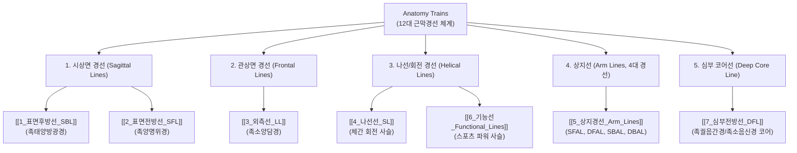

# [[00_근막경선해부학_MOC]]

> **핵심 요약 (Key Summary)**:
> 토마스 마이어스(Thomas W. Myers)의 『Anatomy Trains』를 기반으로 인체 600여 개 개별 근육을 장력 연속체(Tensegrity)로 연결한 12대 근막 사슬 총괄 색인 지도입니다.
> 개별 근육 중심의 해부학을 넘어 전신 근막망(Fascial Web)의 정거장(Bony Stations)과 트랙(Tracks), 생체역학적 보상 패턴 및 자세 평가(BodyReading)를 다룹니다.
> 한의학 12경근(經筋) 및 경락 시스템과의 해부학적 대응성을 결합하여 추나, 약침, 도침 및 체형 교정의 전신적 통합 치료 가이드라인을 제공합니다.

---

## 📌 목차 및 12대 근막경선 네비게이션

---

## 🗂️ 12대 근막경선 독립 모듈 바로가기

|  번호   | 경선명 (국문/영문)                                | 주요 주행 트랙                                                                                                                                                                                                                                                                                                                                                     | 한의학 경근 매핑              |           상세 노트            |
| :---: | :----------------------------------------- | :----------------------------------------------------------------------------------------------------------------------------------------------------------------------------------------------------------------------------------------------------------------------------------------------------------------------------------------------------------- | :--------------------- | :------------------------: |
| **1** | **표면후방선** (Superficial Back Line, SBL)  | [[족저근막]] $\rightarrow$ 아킬레스건/[[비복근]] $\rightarrow$ [[햄스트링]] $\rightarrow$ 천결절인대 $\rightarrow$ [[척추기립근]] $\rightarrow$ [[후두하근]] $\rightarrow$ [[모상건막]]                                                                                                                                                                                                        | [[족태양방광경]]             |      [[1_표면후방선_SBL]]       |
| **2** | **표면전방선** (Superficial Front Line, SFL) | 족지단/장신근 $\rightarrow$ [[전경골근]] $\rightarrow$ 슬개하인대/[[대퇴직근]] $\rightarrow$ [[복직근]] $\rightarrow$ [[흉골근]]/흉골연골근막 $\rightarrow$ [[흉쇄유돌근]]                                                                                                                                                                                                                       | [[족양명위경]]              |      [[2_표면전방선_SFL]]       |
| **3** | **외측선** (Lateral Line, LL)              | 장·[[단비골근]] $\rightarrow$ [[장경인대]](ITB)/TFL/[[대둔근]] $\rightarrow$ [[외복사근]]/[[내복사근]] $\rightarrow$ 외늑간근 $\rightarrow$ [[두판상근]]/SCM                                                                                                                                                                                                                             | [[족소양담경]]              |        [[3_외측선_LL]]        |
| **4** | **나선선** (Spiral Line, SL)               | [[두판상근]] $\rightarrow$ [[능형근]] $\rightarrow$ [[전거근]] $\rightarrow$ [[외복사근]] $\rightarrow$ 복직근초 $\rightarrow$ TFL/ITB $\rightarrow$ [[전경골근]] $\rightarrow$ [[장비골근]] $\rightarrow$ [[대퇴이두근]] $\rightarrow$ 기립근                                                                                                                                                 | [[대맥]] / 경근교차          |        [[4_나선선_SL]]        |
| **5** | **상지경선 (4대)** (Arm Lines)               | • **SFAL**: [[대흉근]] $\rightarrow$ 내측근간중격 $\rightarrow$ 수근굴근군 • **DFAL**: [[소흉근]] $\rightarrow$ [[상완이두근]] $\rightarrow$ 요골 골막 $\rightarrow$ 엄지구 • **SBAL**: [[승모근]] $\rightarrow$ [[삼각근]] $\rightarrow$ 외측근간중격 $\rightarrow$ 수근신근군 • **DBAL**: [[능형근]]/[[견갑거근]] $\rightarrow$ [[회전근개]] $\rightarrow$ [[상완삼두근]] $\rightarrow$ 척골 골막 $\rightarrow$ 소지구 | 수삼음경 수삼양경           |    [[5_상지경선_Arm_Lines]]    |
| **6** | **기능선** (Functional Lines)              | • **후방기능선**: [[광배근]] $\rightarrow$ [[흉요근막]] $\rightarrow$ 반대측 [[대둔근]] $\rightarrow$ [[외측광근]] • **전방기능선**: [[대흉근]] 흉골부 $\rightarrow$ 복직근초 $\rightarrow$ 반대측 [[장내전근]]                                                                                                                                                                                       | 사선선 교차 파워              | [[6_기능선_Functional_Lines]] |
| **7** | **심부전방선** (Deep Front Line, DFL)        | [[후경골근]]/[[장지굴근]] $\rightarrow$ [[슬와근]] $\rightarrow$ 내전근군 $\rightarrow$ [[골반저근]] $\rightarrow$ [[장요근]] $\rightarrow$ [[횡격막]] $\rightarrow$ 심막/종격동 $\rightarrow$ [[사각근]]/[[경장근]]/설골근군                                                                                                                                                                        | [[족궐음간경]] [[족소음신경]] |      [[7_심부전방선_DFL]]       |
| **8** | **자세 분석 & 체형 평가** (BodyReading)         | 시상면(전후 굴곡/신전), 관상면(외측 기울임), 수평면(회전 변형) 분석 및 구조적 통합(Structural Integration) 치료 [[전략]]                                                                                                                                                                                                                                                                         | 전신 체형 교정               |   [[8_자세평가_BodyReading]]   |

---

## 🧭 근막경선 해부학의 핵심 임상 원리

1. **장력통합체(Tensegrity) 구조**:
   * 뼈는 압축 저항체(Struts)이고 근막과 근육은 연속적인 인장망(Tension network)을 형성합니다.
   * 한 부위의 장력 이상(예: [[족저근막]] 단축)은 경선을 타고 원격 부위(예: [[후두하근]] 긴장 및 경추성 [[두통]])로 전파됩니다.
2. **트랙(Tracks)과 정거장(Bony Stations)**:
   * **트랙(Tracks)**: 동일한 근막 층에서 동일한 결 방향(Fiber direction)으로 이어지는 근육 및 건 복합체.
   * **정거장(Stations)**: 근막 사슬이 골막(Periosteum)에 단단히 닻을 내리는 골성 부착부.
3. **근육 [[단독]] 치료의 한계 극복**:
   * 국소 압통점 치료에 반응하지 않는 만성 근골격계 질환은 전체 근막경선 상의 상하 장력 불균형을 교정해야 근본 치료가 가능합니다.

---

## 🔗 관련 백링크
* **마스터 대시보드**: [[00_Master_Dashboard]]
* **근육 진도표**: [[A-1-1_Muscle_Knowledge_Tracker]]
* **어깨 근육군**: [[대흉근]], [[견갑하근]], [[극상근]], [[극하근]], [[소원근]], [[소흉근]], [[전거근]], [[삼각근]], [[대원근]]
