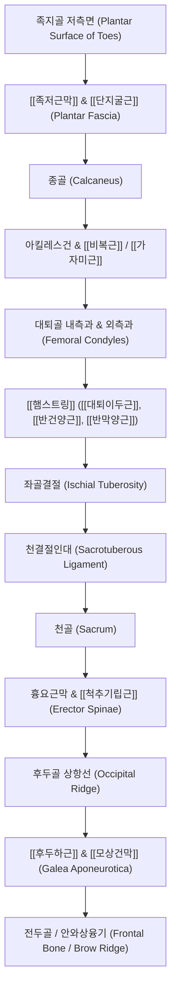

# [[1_표면후방선_SBL]](Superficial Back Line)

> **핵심 요약 (Key Summary)**:
> 발바닥 말단(족지골 저측)에서 시작하여 종골, [[비복근]], [[햄스트링]], 천결절인대, [[척추기립근]], 후두하근을 거쳐 이마의 안와상융기까지 신체 후면 전체를 하나의 연속된 장력선으로 연결하는 1차 신전 지지선입니다.
> 인간의 완전한 직립 자세(신전)를 유지하고 태아성 1차 만곡(흉추/천골)을 지지하며, 체간 굴곡 시 과도하게 쏟아지지 않도록 이심성(원심성) 브레이크를 작동시킵니다.
> [[족태양방광경]]과 100% 일치하며, 무릎 신전 시 햄스트링과 비복근이 연결되고 무릎 굴곡 시 탈선(Derailment)되는 관절 각도 의존성 연속체입니다.

---

## 📌 목차
1. [표면후방선의 정의 및 전체 주행 노선도](#1-표면후방선의-정의-및-전체-주행-노선도)
2. [정거장(Bony Stations) 및 근막 트랙(Tracks) 정밀 매트릭스](#2-정거장bony-stations-및-근막-트랙tracks-정밀-매트릭스)
3. [분절별 정밀 해부학 및 근막 연속성 분석](#3-분절별-정밀-해부학-및-근막-연속성-분석)
4. [탈선(Derailment)의 법칙: 무릎 관절의 조건부 연속성](#4-탈선의-법칙-무릎-관절의-조건부-연속성)
5. [생체역학적 자세 및 움직임 기능](#5-생체역학적-자세-및-움직임-기능)
6. [호발 보상 패턴 및 체형 변형 (Compensations)](#6-호발-보상-패턴-및-체형-변형-compensations)
7. [임상 평가 및 추나·도수·침구 치료 전략](#7-임상-평가-및-추나도수침구-치료-전략)
8. [출처 및 참고 문헌 (References)](#8-출처-및-참고-문헌-references)

---

## 1. 표면후방선의 정의 및 전체 주행 노선도

표면후방선(SBL)은 신체 후면의 표층을 주행하며 발바닥에서 머리끝까지 신체를 보호하고 똑바로 세워주는 거대한 **'후방 인장 케이블(Posterior Tension Cable)'**입니다.

![[AnatomyTrains_Fig_3_2.png|550]]

> [그림 3.2. 표면후방선(SBL) 전신 정거장(Bony Stations) 및 근막 트랙(Tracks) 구조].

---

## 2. 정거장(Bony Stations) 및 근막 트랙(Tracks) 정밀 매트릭스

| 구분 | 구조물 명칭 (한글/영문) | 해부학적 특성 및 연결성 규칙 |
| :--- | :--- | :--- |
| **정거장 1** | **족지골 원위 저측면** (Plantar surface of toe phalanges) | 발가락 바닥면 골막 닻 |
| **트랙 1** | [[족저근막]] & [[단지굴근]] (Plantar fascia & Short toe flexors) | 발바닥의 종아치를 지지하는 강인한 섬유성 인장막 |
| **정거장 2** | **종골 (Calcaneus)** | 족저근막과 아킬레스건이 종골 골막을 거쳐 180° 반전 연결되는 도르래 |
| 트랙 2 | 아킬레스건 & [[비복근]] / [[가자미근]] (Achilles tendon & Gastrocnemius/Soleus) | 하퇴 후면의 강력한 족저굴곡 근막 복합체 |
| **정거장 3** | **대퇴골 내·외측과** (Femoral condyles) | 무릎 관절 후면 닻 (무릎 신전 시 햄스트링과 기능적 연결) |
| 트랙 3 | [[햄스트링]] ([[대퇴이두근]], [[반건양근]], [[반막양근]]) (Hamstrings) | 슬관절 굴곡 및 고관절 신전 근육군 |
| **정거장 4** | **좌골결절 (Ischial tuberosity)** | [[햄스트링]] 기시부와 천결절인대가 직접 결합하는 골성 허브 |
| **트랙 4** | **천결절인대 (Sacrotuberous ligament)** | 좌골결절에서 천골 외측연으로 이어지는 고장력 인대 |
| **정거장 5** | **천골 (Sacrum)** | 골반 후면 중심 닻 |
| 트랙 5 | [[흉요근막]] & [[척추기립근]] ([[장늑근]], [[최장근]], [[극근]]) (Thoracolumbar fascia & Erector spinae) | 척추 전장 신전 트랙 |
| **정거장 6** | **후두골 상항선 (Occipital ridge)** | 기립근 정지부 및 [[후두하근]] 닻 |
| **트랙 6** | [[후두하근]] & [[모상건막]] (Suboccipitals & Galea aponeurotica / Scalp fascia) | 두피 전체를 덮고 전두근으로 이어지는 건막 |
| **정거장 7** | **전두골 안와상융기** (Supraorbital ridge / Brow ridge) | 눈썹 상단 골면의 최종 종착점 |

---

## 3. 분절별 정밀 해부학 및 근막 연속성 분석

### (1) 발바닥에서 종골, 아킬레스건으로의 주행
![[AnatomyTrains_Fig_3_8.png|260]]
![[AnatomyTrains_Fig_3_11.png|240]]
> **그림 3.8**: 족저근막과 아치 구조
> **그림 3.11**: 종골 골막을 감싸는 아킬레스건 연속성

* [[족저근막]](Plantar Fascia):
  * 족지골 기저부에서 종골(Calcaneus) 결절까지 이어지는 두꺼운 건막으로, 걷거나 뛸 때 충격을 흡수하는 활시위(Windlass mechanism) 역할을 합니다.
* **종골(Calcaneus)에서의 골막 연속성**:
  * 족저근막은 종골 밑면에서 끝나지 않고, 종골 골막(Periosteum)을 타고 뒤쪽으로 180° 회전하여 **아킬레스건(Achilles tendon) 및 [[비복근]] 건막과 연속**됩니다.

### (2) 비복근에서 햄스트링으로: 슬관절(Knee)의 교차
![[AnatomyTrains_Fig_3_16.png|450]]

> [그림 3.16. 대퇴골과 주변 [[비복근]] 건막과 햄스트링의 중첩 구조].

* [[비복근]]의 내외측 두(Heads)는 대퇴골 내외측과 상방에 부착되고, [[햄스트링]]([[반건양근]]/[[반막양근]]/[[대퇴이두근]])은 경골과 비골 상단에 부착되어 **슬와(Popliteal fossa)에서 X자 형태로 서로 교차·중첩(Overlap)**됩니다.

### (3) 햄스트링에서 천골, 척추기립근으로: 좌골결절의 연속성
![[AnatomyTrains_Fig_3_20.png|450]]

> [그림 3.20. 좌골결절에서 [[햄스트링]] 건과 천결절인대, 천골 근막의 직접적인 연속성].

* [[햄스트링]] 건(특히 [[대퇴이두근 장두]])의 섬유는 좌골결절(Ischial tuberosity) 골막에 부착됨과 동시에 **천결절인대(Sacrotuberous ligament)와 직접 근막적으로 융합**되어 천골(Sacrum) 및 흉요근막으로 장력을 전달합니다.

### (4) 척추기립근에서 후두골, [[모상건막]], 안와상융기까지
![[AnatomyTrains_Fig_3_29.png|450]]

> [그림 3.29. 후두하근에서 [[모상건막]](Scalp Fascia)을 거쳐 이마의 안와상융기까지의 종착 주행].

* [[척추기립근]]([[최장근]]/[[극근]]/[[장늑근]])과 심부의 [[후두하근]](Suboccipitals)은 후두골 상항선에 부착되며, 이 섬유는 두피를 덮고 있는 [[모상건막]](Galea aponeurotica)을 타고 이마의 전두근(Frontalis)을 거쳐 눈썹 뼈(안와상융기, Supraorbital ridge)에 최종 정지합니다.

---

## 4. 탈선(Derailment)의 법칙: 무릎 관절의 조건부 연속성

![[AnatomyTrains_Fig_3_17.png|450]]

> [그림 3.17. 슬관절 굴곡 시 비복근과 햄스트링의 분리(탈선) 및 신전 시 일체화 메커니즘].

* **무릎을 폈을 때 (Extension, 일체화)**:
  * 무릎을 곧게 펴면 대퇴골과가 뒤로 밀리며 [[비복근]] 건과 [[햄스트링]] 건이 서로 팽팽하게 밀착하여 **발바닥부터 머리까지 완벽한 단일 라인(SBL)**으로 작동합니다.
* **무릎을 구부렸을 때 (Flexion, 탈선 Derailment)**:
  * 무릎을 구부리면 비복근과 햄스트링의 교차 부위가 느슨해지면서 근막 연속성이 끊어집니다(탈선).
  * **임상 적용**: 무릎을 구부리면 하퇴부(발목/[[비복근]])의 장력이 상부 척추로 전달되지 않으므로, 햄스트링이나 기립근만을 분리하여 스트레칭/치료할 수 있습니다.

---

## 5. 생체역학적 자세 및 움직임 기능

### (1) 자세 지지 기능 (Postural Function)
* **완전 직립 신전 지지**: 중력에 의해 신체가 전방으로 무너지는(굴곡) 것을 방지하기 위해 신체 후면 전체에서 지속적인 인장 장력을 제공합니다.
* **1차 만곡과 2차 만곡의 조화**: 흉추와 천골의 태아성 후만(1차 만곡)을 든든하게 받치며, 기립 시 생기는 요추와 경추의 전만(2차 만곡)이 과도하게 꺾이지 않도록 지탱합니다.

### (2) 움직임 기능 (Movement Function)
* 신전(Extension) 및 과신전 움직임을 주도하며, 몸을 앞으로 숙이는 **체간 굴곡(Flexion) 시 원심성 브레이크(Eccentric Braking)**를 걸어 척추 디스크와 관절와를 보호합니다.

---

## 6. 호발 보상 패턴 및 체형 변형 (Compensations)

SBL 상의 만성 단축 또는 장력 불균형은 다음 5대 체형 변형을 초래합니다:
1. **발목 족저굴곡 구축 & 아킬레스건 단축**: 족배굴곡(Dorsiflexion) 제한.
2. **슬관절 과신전([[반장슬]], Genu Recurvatum)**: 비복근과 대퇴사두근의 전후 불균형.
3. **골반 후방경사(Posterior Pelvic Tilt) & [[일자허리]](Flat Back)**: [[햄스트링]] 단축으로 좌골결절이 하방 견인됨.
4. **골반 전방경사(Anterior Pelvic Tilt) & 요추 과전만**: [[척추기립근]] 하부 과단축.
5. [[거북목]](전방두부자세) & [[경추성 두통]]: [[후두하근]] 단축으로 후두골이 뒤로 젖혀지고 시선이 위로 들리며 발생하는 보상.

---

## 7. 임상 평가 및 추나·도수·침구 치료 전략

### (1) 전신 굴곡 전굴 검사 (Forward Bend Test)
* 무릎을 펴고 서서 상체를 앞으로 숙일 때, 가동성 제한이 걸리는 부위(발목, 오금, 둔부, 요추, 흉추, 목)를 시각적으로 판독합니다.

### (2) [[족저근막]] 롤링(Plantar Fascia Rolling)의 원격 치료 기전
* 골프공이나 롤러로 **발바닥 족저근막을 2분간 마사지**하면, 발바닥뿐만 아니라 SBL 전체 장력이 이완되어 **상체 전굴(손가락-바닥 닿기) 가동범위가 즉각 3~6cm 증가**합니다.

### (3) 한의학 경락 연계 (족태양방광경)
* SBL은 한의학 [[족태양방광경]](BL) 및 방광경근과 100% 일치합니다.
* **핵심 치료점**:
  * 족부/아킬레스: 지음(至陰), 곤륜(崑崙), 승산(承山)
  * 슬와부: 위중(委中) (비복근과 햄스트링의 교차 닻)
  * 둔부/요배부: 은문(殷門), 질변(秩邊), 신수(腎兪), 대장수(大腸兪), 격수(膈兪) (기립근 배수혈)
  * 두경부: 천주(天柱), 풍지(風池), 옥침(玉枕), 찬죽(攢竹) ([[후두하근]] 및 안와상융기 종착점)

---

## 8. 출처 및 참고 문헌 (References)

1. **Myers, T. W. (2014)**. *Anatomy Trains: Myofascial Meridians for Manual and Movement Therapists* (3rd ed.). Churchill Livingstone / Elsevier. (Chapter 3: The Superficial Back Line, pp. 109-138).
   - **[연구 요약]**: 발바닥에서 안와상융기까지 이어지는 SBL의 해부학적 해부 입증, 종골 골막 회전 및 좌골결절-천결절인대 연결 역학 수록.
2. **Wilke, J., et al. (2016)**. *What is evidence-based about myofascial chains: a systematic review*. **Archives of Physical Medicine and Rehabilitation**, 97(3), 454-461.
   - **[연구 요약]**: [[족저근막]]-아킬레스건-[[비복근]]-햄스트링으로 이어지는 후방 근막 연속성의 힘 전달(Force transmission) 생체역학적 근거 체계적 고찰.
3. **Grieve, R., et al. (2015)**. *The immediate effect of bilateral self-myofascial release on the plantar surface of the foot on hamstring and lumbar spine flexibility: A randomised controlled trial*. **Journal of Bodywork and Movement Therapies**, 19(3), 544-552.
   - **[연구 요약]**: [[족저근막]] 롤링(SMR)이 원격 [[햄스트링]] 및 요추 유연성에 미치는 즉각적 가동범위 증가 RCT 검증.
