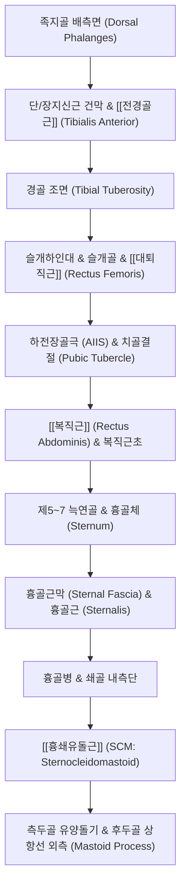

# [[2_표면전방선_SFL]](Superficial Front Line)

> **핵심 요약 (Key Summary)**:
> 발가락 배측(등쪽)에서 시작하여 경골 전면, [[대퇴직근]], [[복직근]], 흉골근막을 거쳐 두개골 유양돌기까지 인체 전면 표층을 하나로 연결하는 전방 인장 지지선입니다.
> 표면후방선([[1_표면후방선_SBL]])과 전후 시소 균형을 이루어 직립 자세를 지지하고, 흉복부 내장기를 보호하며 체간 굴곡 및 슬관절 신전을 수행합니다.
> [[족양명위경]]과 100% 대응하며, 현대인의 좌식 생활로 인해 하방 견인(Down-drag)될 경우 흉곽 침하, 골반 전방경사, 라운드 숄더 및 [[거북목]]을 유발합니다.

---

## 📌 목차
1. [표면전방선의 정의 및 전체 주행 노선도](#1-표면전방선의-정의-및-전체-주행-노선도)
2. [정거장(Bony Stations) 및 근막 트랙(Tracks) 정밀 매트릭스](#2-정거장bony-stations-및-근막-트랙tracks-정밀-매트릭스)
3. [분절별 정밀 해부학 및 근막 연속성 분석](#3-분절별-정밀-해부학-및-근막-연속성-분석)
4. [슬개골(Patella)의 도르래 역학과 AIIS 닻 내리기](#4-슬개골patella의-도르래-역학과-aiis-닻-내리기)
5. [생체역학적 자세 및 움직임 기능](#5-생체역학적-자세-및-움직임-기능)
6. [호발 보상 패턴: 하방 견인(Down-Drag) 증후군](#6-호발-보상-패턴-하방-견인down-drag-증후군)
7. [임상 평가 및 추나·도수·침구 치료 전략](#7-임상-평가-및-추나도수침구-치료-전략)
8. [출처 및 참고 문헌 (References)](#8-출처-및-참고-문헌-references)

---

## 1. 표면전방선의 정의 및 전체 주행 노선도

표면전방선(SFL)은 발등에서부터 목과 머리 측면까지 인체 앞면 전체를 연결하는 거대한 **'전방 신체 장력망(Anterior Tensile Network)'**입니다.

![[AnatomyTrains_Fig_4_2.png|550]]

> [그림 4.2. 표면전방선(SFL) 전신 정거장(Bony Stations) 및 근막 경로(Tracks) 구조].

---

## 2. 정거장(Bony Stations) 및 근막 트랙(Tracks) 정밀 매트릭스

| 구분 | 구조물 명칭 (한글/영문) | 해부학적 특성 및 연결성 규칙 |
| :--- | :--- | :--- |
| **정거장 1** | **족지골 배측면** (Dorsal surface of toe phalanges) | 발가락 등쪽 신근건 기시 닻 |
| **트랙 1** | [[단지신근]], [[장지신근]], [[전경골근]] (Extensor digitorum & Tibialis anterior) | 발목 상부 신근지지대를 통과하여 경골 전외측면을 상행 |
| **정거장 2** | **경골 조면 (Tibial tuberosity)** | 슬개하인대가 강하게 부착되는 무릎 전방 닻 |
| 트랙 2 | 슬개인대, 슬개골, [[대퇴직근]] (Patellar tendon, Patella, Rectus femoris) | 슬개골을 종자골 도르래로 활용하여 AIIS로 상행 |
| **정거장 3** | **하전장골극(AIIS) & 치골결절** (AIIS & Pubic tubercle) | 골반 전면 하부의 핵심 기계적 닻 |
| 트랙 3 | [[복직근]] 및 복직근초 (Rectus abdominis & Rectus sheath) | 치골에서 늑골궁(제5~7 늑연골)으로 수직 상행하는 전벽 트랙 |
| **정거장 4** | **제5~7 늑연골 및 흉골체** (5th-7th Costal cartilages & Sternum) | 흉곽 전면 닻 |
| 트랙 4 | 흉골근막 및 [[흉골근]] (Sternal fascia & Sternalis muscle) | 흉골 전면을 수직으로 덮는 치밀 결합조직대 |
| **정거장 5** | **흉골병(Manubrium) & 쇄골 내측단** | 흉쇄관절 닻 |
| 트랙 5 | [[흉쇄유돌근]] (SCM) (Sternocleidomastoid) | 흉골과 쇄골에서 측두골 유양돌기로 사선 상행 |
| **정거장 6** | **측두골 유양돌기 & 후두골 상항선** (Mastoid process & Occipital ridge) | 두개골 측두부 최종 종착점 |

---

## 3. 분절별 정밀 해부학 및 근막 연속성 분석

### (1) 발등 신근건에서 하퇴 전면 전경골근으로의 주행
![[AnatomyTrains_Fig_4_8.png|250]]
![[AnatomyTrains_Fig_4_9.png|260]]
> **그림 4.8**: 하퇴 전방구획 근막 주행
> **그림 4.9**: 발목 신근지지대(Retinaculum) 터널

* 발가락 등쪽에서 시작된 신근건들은 **상·하 족관절 신근지지대(Extensor retinacula)**라는 섬유성 터널을 통과합니다. 지지대는 건이 발목에서 활시위처럼 튀어나오는 것(Bowstringing)을 방지하며 경골 전외측 구획 근막으로 연결됩니다.

### (2) 슬개골(Patella) 종자골과 [[대퇴직근]]
![[AnatomyTrains_Fig_4_11.png|200]]
![[AnatomyTrains_Fig_4_12.png|260]]
> **그림 4.11**: 경골 조면과 슬개인대 닻
> **그림 4.12**: 대퇴직근과 AIIS 부착부

* 경골 조면에서 시작된 슬개인대는 **슬개골(Patella)**을 감싸며 [[대퇴직근]] 건으로 전환됩니다. 슬개골은 대퇴사두근의 지레 효율을 30% 이상 증가시키는 도르래 역할을 수행합니다.

### (3) 치골에서 [[복직근]], 흉골근막으로의 연속성
![[AnatomyTrains_Fig_4_10.png|450]]

> [그림 4.10. 치골결합에서 복직근초를 거쳐 흉골 전면으로 이어지는 근막 연결].

* [[대퇴직근]]이 하전장골극(AIIS)에 부착되는 동안, 장력은 인접한 치골결절(Pubic tubercle)로 전달되어 [[복직근]]을 타고 제5~7 늑연골과 흉골체로 수직 상행합니다.

### (4) 흉골병에서 [[흉쇄유돌근]](SCM), 유양돌기까지
![[AnatomyTrains_Fig_4_15.png|450]]

> [그림 4.15. 흉골병에서 [[흉쇄유돌근]](SCM)을 거쳐 유양돌기로 이어지는 상부 종착 주행].

* 흉골 전면의 흉골근막은 흉골병에서 [[흉쇄유돌근]](SCM)의 흉골두 및 쇄골두와 결합하여 귀 뒤쪽의 유양돌기(Mastoid process)에 단단히 정지합니다.

---

## 4. 슬개골(Patella)의 도르래 역학과 AIIS 닻 내리기

* **슬관절 신전 시 연속성**: 무릎이 펴져 있을 때는 슬개골이 활주 홈에 고정되어 하퇴 전면의 장력이 대퇴 전면으로 온전히 전달됩니다.
* **골반 전면 닻(AIIS)**:
  * 대퇴직근은 골반의 하전장골극(AIIS)에 닻을 내리므로, 대퇴직근이 단축되면 **골반을 앞쪽 아래로 강하게 끌어당겨 골반 전방경사(Anterior Pelvic Tilt)**를 직접적으로 유발합니다.

---

## 5. 생체역학적 자세 및 움직임 기능

### (1) 자세 지지 기능 (Postural Function)
* **표면후방선(SBL)과의 전후 장력 길항**: 후방에서 당기는 기립근과 SBL에 맞서 전방에서 장력을 제공하여 척추가 뒤로 과신전되는 것을 방지합니다.
* **복벽 압박 및 장기 지지**: 복벽의 장력을 유지하여 복강 내압(IAP)을 형성하고 내장기가 전방으로 쏟아지는 것을 막아줍니다.

### (2) 움직임 기능 (Movement Function)
* 체간 굴곡(Trunk flexion), 고관절 굴곡(Hip flexion), 슬관절 신전(Knee extension), 족관절 배굴(Ankle dorsiflexion)을 통합적으로 수행합니다.

---

## 6. 호발 보상 패턴: 하방 견인(Down-Drag) 증후군

현대인의 장시간 좌식 생활(Sitting posture)과 스마트폰 사용은 SFL의 전면 단축 및 **하방 견인(Down-drag)**을 초래합니다:
1. **발목 배굴 제한 및 족저굴곡 구축**: 하퇴 전면의 긴장 및 지지대 유착.
2. **무릎 과신전([[반장슬]], Genu Recurvatum)**: [[대퇴직근]] 단축으로 슬개골이 상방 견인됨.
3. **골반 전방경사(Anterior Pelvic Tilt)**: [[대퇴직근]] 과긴장으로 AIIS가 전하방으로 회전.
4. **흉곽 침하(Depressed Ribcage) & 얕은 흉식 호흡**: [[복직근]] 단축이 흉골을 아래로 끌어내려 [[횡격막]] 확장 제한.
5. [[거북목]](전방두부자세) & [[라운드 숄더]]: 흉골이 내려앉으면서 SCM이 보상적으로 머리를 앞으로 당겨 경추 하부 굴곡 + 상부 신전 고착.

---

## 7. 임상 평가 및 추나·도수·침구 치료 전략

### (1) 후굴 신전 검사 (Backward Bend Test)
* 환자가 서서 상체를 뒤로 젖힐 때, SFL의 전면 제한 부위(발목 앞, 대퇴 전면, 복벽, 흉골, 목 전면)를 확인합니다.

### (2) 흉골-[[복직근]]-[[대퇴직근]] 복합 침도 이완술
* 치골결절의 [[복직근]] 부착부와 AIIS의 [[대퇴직근]] 기시부를 도침으로 이완하면, 흉골이 즉각 거상되며 굽었던 등이 펴집니다.

### (3) 한의학 경락 연계 (족양명위경)
* SFL은 [[족양명위경]](ST) 및 위경근과 100% 일치합니다.
* **핵심 치료점**:
  * 족부/하퇴: 여태(厲兌), 해계(解谿), 족삼리(足三里), 상거허(上巨虛)
  * 대퇴부: 양구(梁丘), 복토(伏兎), 비관(髀關) ([[대퇴직근]])
  * 복부: 기충(氣衝), 귀래(歸來), 천추(天樞), 양문(梁門) ([[복직근]])
  * 흉부/경부: 유근(乳根), 결분(缺盆), 인영(人迎), 완골(完骨) (SCM 및 유양돌기)

---

## 8. 출처 및 참고 문헌 (References)

1. **Myers, T. W. (2014)**. *Anatomy Trains: Myofascial Meridians for Manual and Movement Therapists* (3rd ed.). Churchill Livingstone / Elsevier. (Chapter 4: The Superficial Front Line, pp. 139-162).
   - **[연구 요약]**: 발등에서 유양돌기까지 이어지는 SFL의 해부학적 경로, 슬개골 종자골 역학 및 [[복직근]]-흉골근막-SCM 연결 입증.
2. **Findley, T., et al. (2015)**. *Fascia research IV: Basic science and implications for conventional and complementary health care*. **International Journal of Therapeutic Massage & Bodywork**, 8(4), 48-53.
   - **[연구 요약]**: SFL의 전면 하방 견인(Down-drag)과 흉곽 침하 및 거북목 체형 상관관계 분석.
