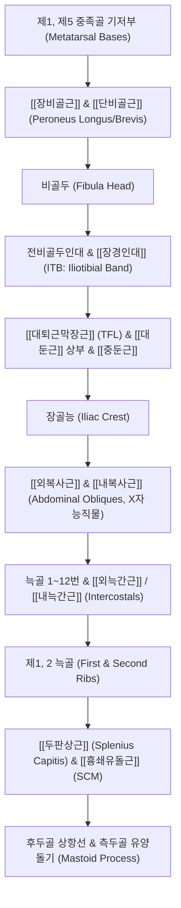

# [[3_외측선_LL]](Lateral Line)

> **핵심 요약 (Key Summary)**:
> 발 외측(제1/5중족골)에서 시작하여 비골근, [[장경인대]](ITB), [[대퇴근막장근]]/[[중둔근]], [[외복사근]]/내복사근의 X자 능직물, 늑간근을 거쳐 측두골 유양돌기까지 신체 양 외측면을 주행하는 관상면 지지선입니다.
> 좌우 시소(Seesaw) 균형을 조절하여 신체 측방 굴곡(Lateral flexion)을 수행하고, 보행 시 한 발 지지기에서 골반 수평을 유지하며 체간 회전 비틀림을 제동합니다.
> [[족소양담경]]과 100% 대응하며, 불균형 시 골반 외측 편위, [[장경인대]] 마찰 증후군, [[트렌델렌버그 징후]] 및 척추측만증을 유발합니다.

---

## 📌 목차
1. [외측선의 정의 및 전체 주행 노선도](#1-외측선의-정의-및-전체-주행-노선도)
2. [정거장(Bony Stations) 및 근막 트랙(Tracks) 정밀 매트릭스](#2-정거장bony-stations-및-근막-트랙tracks-정밀-매트릭스)
3. [분절별 정밀 해부학 및 근막 연속성 분석](#3-분절별-정밀-해부학-및-근막-연속성-분석)
4. [체간 복사근의 X자 능직물(Basket Weave) 구조](#4-체간-복사근의-x자-능직물basket-weave-구조)
5. [생체역학적 자세 및 움직임 기능](#5-생체역학적-자세-및-움직임-기능)
6. [호발 보상 패턴 및 체형 변형 (Compensations)](#6-호발-보상-패턴-및-체형-변형-compensations)
7. [임상 평가 및 추나·도수·침구 치료 전략](#7-임상-평가-및-추나도수침구-치료-전략)
8. [출처 및 참고 문헌 (References)](#8-출처-및-참고-문헌-references)

---

## 1. 외측선의 정의 및 전체 주행 노선도

외측선(LL)은 신체 양 외측면을 둘러싸고 있는 거대한 **'측방 텐트 로프(Lateral Guy Wires)'**로서 좌우의 대칭적 균형을 유지합니다.

![[AnatomyTrains_Fig_5_2.png|550]]

> [그림 5.2. 외측선(LL) 전신 골성 정거장(Bony Stations) 및 근막 트랙(Tracks) 구조].

---

## 2. 정거장(Bony Stations) 및 근막 트랙(Tracks) 정밀 매트릭스

| 구분 | 구조물 명칭 (한글/영문) | 해부학적 특성 및 연결성 규칙 |
| :--- | :--- | :--- |
| **정거장 1** | **제1, 5 중족골 기저부** (Bases of 1st & 5th metatarsals) | 발바닥 외측과 횡아치를 지지하는 등자(Stirrup) 닻 |
| **트랙 1** | [[장비골근]] 및 [[단비골근]] (Peroneus longus & brevis) | 외과(Lateral malleolus) 후방을 돌아 비골 외측을 타고 상행 |
| **정거장 2** | **비골두 (Fibular head)** | 무릎 외측 관절 닻 |
| **트랙 2** | **비골두전인대 $\rightarrow$ [[장경인대]] (ITB)** (Anterior ligament of fibular head $\rightarrow$ ITB) | 경골 Gerdy 결절에서 대퇴 외측면 전체를 덮는 강력한 인장대 |
| 트랙 3 | [[대퇴근막장근]](TFL) & [[중둔근]] / [[대둔근]] 상부 (Tensor fasciae latae & Gluteus medius/maximus) | 고관절 외전 및 골반 수평 안정화 근육군 |
| **정거장 3** | **장골능 (Iliac crest)** | 골반 외측연 중심 닻 |
| **트랙 4** | [[외복사근]] 및 [[내복사근]] (External & Internal obliques) | 측복벽을 X자로 교차하며 감싸는 능직물(Basket weave) 구조 |
| **정거장 4** | **늑골 1~12번 (Ribs)** | 흉곽 측벽 닻 |
| **트랙 5** | [[외늑간근]] 및 [[내늑간근]] (External & Internal intercostals) | 늑골 사이 공간을 지탱하는 측방 흉곽 트랙 |
| **정거장 5** | **제1, 2 늑골 (1st & 2nd ribs)** | 흉곽 상구 닻 |
| 트랙 6 | [[두판상근]] 및 [[흉쇄유돌근]](SCM) (Splenius capitis & SCM) | 경추/흉골에서 두개골 유양돌기로 교차 상행 |
| **정거장 6** | **측두골 유양돌기 & 후두골 상항선** (Mastoid process & Occipital ridge) | 두개골 측면 최종 종착점 |

---

## 3. 분절별 정밀 해부학 및 근막 연속성 분석

### (1) 발바닥 외측에서 비골근, 비골두로의 주행
![[AnatomyTrains_Fig_5_3.png|450]]

> [그림 5.3. 장·단비골근의 주행 경로 및 외과 도르래 구조].

* [[장비골근]](Peroneus longus)은 제1중족골 저측면에서 시작하여 발바닥을 가로질러 외측으로 나온 뒤, 외과(Lateral malleolus) 도르래를 감싸며 비골 외측을 타고 비골두(Fibular head)로 상행합니다.

### (2) 비골두에서 [[장경인대]](ITB)와 [[대퇴근막장근]](TFL)으로의 도약
![[AnatomyTrains_Fig_5_6.png|450]]

> [그림 5.6. 비골두에서 전비골두인대를 거쳐 [[장경인대]](ITB)로 이어지는 연속성].

* 비골두에서 장력은 전비골두인대를 거쳐 경골 외측의 Gerdy 결절(Gerdy's tubercle)로 연결되며, 여기서부터 대퇴 외측의 거대한 섬유판인 [[장경인대]](Iliotibial band, ITB)를 타고 상행하여 [[대퇴근막장근]](TFL) 및 [[중둔근]](Gluteus medius)과 일체화됩니다.

### (3) 체간 복사근과 늑간근의 X자 교차망 및 자세 평가
![[AnatomyTrains_Fig_5_14.png|260]]
![[AnatomyTrains_Fig_5_15.png|220]]
> **그림 5.14**: 머리 전방 자세의 보상 패턴
> **그림 5.15**: 철봉 매달리기를 통한 외측선 불균형 평가

* 장골능을 넘어선 장력은 복벽 측면에서 [[외복사근]](하내측 방향 섬유)**과 [[내복사근]](상내측 방향 섬유)**의 교차 격자망을 형성하며 늑골 사이의 늑간근(Intercostals)으로 전달됩니다.

---

## 4. 체간 복사근의 X자 능직물(Basket Weave) 구조

* 외측선은 단순한 직선이 아니라, 체간 부위에서 **외복사근과 [[내복사근]], 늑간근이 서로 직교하는 X자 다이아몬드 격자 구조**를 이룹니다.
* 이 구조 덕분에 외측선은 체간의 **측방 굴곡(Side bend)**뿐만 아니라, 과도한 **체간 회전(Rotation)과 비틀림을 단단하게 제동**하는 완충 장치 역할을 수행합니다.

---

## 5. 생체역학적 자세 및 움직임 기능

### (1) 자세 지지 기능 (Postural Function)
* **좌우 시소 균형 (Bilateral Balance)**: 좌우 외측선이 팽팽한 장력 균형을 이루어 척추가 한쪽으로 기울어지는 것을 막아줍니다.
* **보행 시 골반 수평 지지**: 보행 시 한 발 지지기(Stance phase)에서 [[중둔근]], TFL, ITB가 수축하여 반대쪽 골반이 아래로 떨어지는([[트렌델렌버그 징후]]) 것을 방지합니다.

### (2) 움직임 기능 (Movement Function)
* 체간 측굴(Lateral flexion), 고관절 외전(Hip abduction), 발목 외번(Eversion)을 수행합니다.

---

## 6. 호발 보상 패턴 및 체형 변형 (Compensations)

외측선의 좌우 장력 불균형은 다음 변형을 유발합니다:
1. **발목 회내(Pronation) 또는 회외(Supination)**.
2. **외반슬([[X자 다리]], Genu Valgum) 또는 내반슬([[O자 다리]])**.
3. **골반 외측 편위(Lateral Pelvic Shift) 및 거상(Hiking)**: 기능적 다리 길이 차이(LLD) 유발.
4. [[척추측만증]](Scoliosis): 편측 늑간근 및 복사근의 지속적 과단축.
5. **편측 어깨 하강 및 사경(Torticollis 유사 패턴)**.

---

## 7. 임상 평가 및 추나·도수·침구 치료 전략

### (1) 측굴 가동성 검사 (Side Bend Test)
* 환자가 서서 좌우로 몸을 기울일 때 늑골과 장골능 사이 공간의 좁아짐 및 ITB의 장력 제한을 평가합니다.

### (2) [[장경인대]](ITB) & [[중둔근]] 침도/추나
* 대퇴골 대전자(Greater trochanter) 주변과 장골능 외측연의 [[중둔근]] 부착부를 침도로 박리하여 골반 외측 불균형을 해소합니다.

### (3) 한의학 경락 연계 (족소양담경)
* 외측선은 [[족소양담경]](GB) 및 담경근과 100% 대응합니다.
* **핵심 치료점**:
  * 족부/하퇴: 구허(丘墟), 양릉천(陽陵泉), 광명(光明), 현종(懸鐘)
  * 대퇴/골반: 환도(環跳), 거료(居髎), 풍시(風市) ([[중둔근]] & ITB)
  * 측흉/복부: 대맥(帶脈), 일월(日月), 경문(京門), 연액(淵腋) (복사근 & 늑간근)
  * 두경부: 풍지(風池), 현로(懸顱), 솔곡(率谷), 두임읍(頭臨泣) (유양돌기 종착점)

---

## 8. 출처 및 참고 문헌 (References)

1. **Myers, T. W. (2014)**. *Anatomy Trains: Myofascial Meridians for Manual and Movement Therapists* (3rd ed.). Churchill Livingstone / Elsevier. (Chapter 5: The Lateral Line, pp. 163-182).
   - **[연구 요약]**: 비골근에서 [[장경인대]], 복사근, 유양돌기로 이어지는 외측선(LL)의 연속성 및 관상면 안정화 기전 규명.
2. **Stecco, C., et al. (2013)**. *The fascia profunda of the upper and lower limbs: a systematic review*. **Surgical and Radiologic Anatomy**, 35(6), 469-477.
   - **[연구 요약]**: [[장경인대]](ITB)와 대퇴근막의 다방향 장력 전달 구조 및 외측 근막망의 임상적 중요성 증명.
