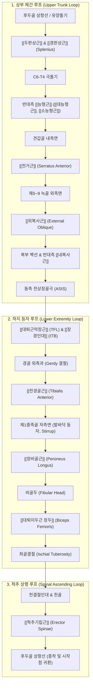

# [[4_나선선_SL]](Spiral Line)

> **핵심 요약 (Key Summary)**:
> 두개골 후면에서 시작하여 상배부 [[능형근]]·[[전거근]], 복벽 복사근, 골반 ASIS, 하지 장경인대와 발바닥 등자를 돌아 대퇴이두근과 척추기립근으로 상행하는 이중 나선(Double Helix) 근막 사슬입니다.
> 신체의 모든 면(시상면, 관상면, 횡단면)에서 회전과 비틀림을 조절하며, 보행 시 골반과 체간의 꼬임 장력을 축적하여 보행 추진력을 극대화합니다.
> 한의학 [[대맥]] 및 경근 교차 시스템과 완벽히 대응하며, 단축 시 척추 회전 변형, 골반 회전 부정렬, 무릎 회전 비틀림(Torsion) 및 편측 어깨 전방 회전을 유발합니다.

---

## 📌 목차
1. [나선선의 정의 및 전체 주행 노선도](#1-나선선의-정의-및-전체-주행-노선도)
2. [정거장(Bony Stations) 및 근막 트랙(Tracks) 정밀 매트릭스](#2-정거장bony-stations-및-근막-트랙tracks-정밀-매트릭스)
3. [분절별 정밀 해부학 및 3대 루프(Loops) 구조](#3-분절별-정밀-해부학-및-3대-루프loops-구조)
4. [발바닥 등자(Plantar Stirrup)와 족궁(Arch) 서포트 역학](#4-발바닥-등자plantar-stirrup와-족궁arch-서포트-역학)
5. [생체역학적 자세 및 움직임 기능](#5-생체역학적-자세-및-움직임-기능)
6. [호발 보상 패턴 및 복합 회전 변형 (Compensations)](#6-호발-보상-패턴-및-복합-회전-변형-compensations)
7. [임상 평가 및 추나·도수·침구 치료 전략](#7-임상-평가-및-추나도수침구-치료-전략)
8. [출처 및 참고 문헌 (References)](#8-출처 및 참고 문헌 (References))

---

## 1. 나선선의 정의 및 전체 주행 노선도

나선선(SL)은 신체를 2중 나선(Double Helix) 형태로 칭칭 감싸며 체간과 하지의 회전 균형을 조율하는 거대한 **'나선형 조절 케이블'**입니다.

![[AnatomyTrains_Fig_6_2.png|550]]

> [그림 6.2. 나선선(SL) 전신 정거장(Bony Stations) 및 근막 트랙(Tracks) 구조].

---

## 2. 정거장(Bony Stations) 및 근막 트랙(Tracks) 정밀 매트릭스

![[AnatomyTrains_Fig_6_2.png|500]]

> [그림 2. 나선선의 골성 정거장과 근막 트랙 구조].

| 구분 | 구조물 명칭 (한글/영문) | 해부학적 특성 및 연결성 규칙 |
| :--- | :--- | :--- |
| **정거장 1** | **후두골 능선 및 유양돌기** (Occipital ridge / Mastoid) | 두경부 기시 닻 |
| **트랙 1** | [[두판상근]] 및 [[경판상근]] (Splenius capitis & cervicis) | 경추 극돌기를 향해 사하방 주행 |
| **정거장 2** | **경추 6번 ~ 흉추 4번 극돌기** | 판상근과 능형근의 척추 극돌기 교차 닻 |
| 트랙 2 | 반대측 [[능형근]]([[대능형근]], [[소능형근]]) $\rightarrow$ 견갑골 내측연 $\rightarrow$ [[전거근]] (Rhomboids $\rightarrow$ Serratus anterior) | 견갑골을 흉벽에 밀착시키는 핵심 근막 슬링(Sling) |
| **정거장 3** | **제5~9 늑골 외측면** | 전거근과 외복사근의 맞물림(Interdigitation) 닻 |
| **트랙 3** | [[외복사근]] $\rightarrow$ 백선 $\rightarrow$ 반대측 [[내복사근]] (External oblique $\rightarrow$ Linea alba $\rightarrow$ Internal oblique) | 복벽을 대각선으로 가로지르는 X자 교차 트랙 |
| **정거장 4** | **전상장골극 (ASIS)** | 골반 전외측 중심 닻 |
| 트랙 4 | [[대퇴근막장근]](TFL) $\rightarrow$ [[장경인대]](ITB) | 대퇴 전외측면을 따라 하행 |
| **정거장 5** | **경골 외측과 (Gerdy 결절)** | 슬관절 외측 닻 |
| 트랙 5 | [[전경골근]] (Tibialis anterior) | 발목 앞쪽을 대각선으로 가로질러 발바닥으로 진입 |
| **정거장 6** | **제1중족골 및 내측설상골 저측면** | **발바닥 등자 (Plantar Stirrup) 교차 닻** |
| 트랙 6 | [[장비골근]] (Peroneus longus) | 발바닥을 가로질러 외과 뒤쪽 비골 외측을 타고 상행 |
| **정거장 7** | **비골두 (Fibular head)** | 슬관절 후외측 닻 |
| 트랙 7 | [[대퇴이두근 장두]] (Biceps femoris) | 좌골결절을 향해 상행하는 외측 [[햄스트링]] |
| **정거장 8** | **좌골결절 (Ischial tuberosity)** | 천결절인대로 이어지는 후방 골반 닻 |
| 트랙 8 | 천결절인대 $\rightarrow$ [[척추기립근]] (Sacrotuberous ligament $\rightarrow$ Erector spinae) | 척추 전장을 따라 후두골로 직행 상행 |
| **정거장 9** | **후두골 상항선 (Occiput)** | 출발점으로 귀환 완료 |

---

## 3. 분절별 정밀 해부학 및 3대 루프(Loops) 구조

### (1) 상부 체간 루프: [[판상근]]-[[능형근]]-[[전거근]]-복사근 슬링
![[AnatomyTrains_Fig_6_5.png|480]]

> [그림 3. 능형근과 전거근이 견갑골 내측연을 매개로 형성하는 연속적인 기계적 슬링].

* 한쪽 두판상근에서 시작된 장력은 척추 극돌기를 건너 반대측 [[능형근]](Rhomboids)으로 전달되고, 견갑골 내측연 골막을 거쳐 [[전거근]](Serratus anterior)으로 이어집니다.
* 전거근의 하부 갈래는 늑골에서 [[외복사근]]과 손가락을 깍지 끼듯 맞물려(Interdigitation) 복벽 백선을 지나 **반대측 ASIS**로 연결됩니다.

### (2) 하지 등자 루프: TFL-ITB-[[전경골근]]-[[장비골근]]-[[대퇴이두근]]
![[AnatomyTrains_Fig_6_8.png|480]]

> [그림 4. 전경골근과 장비골근이 발바닥 아래에서 형성하는 족궁 등자(Stirrup) 구조].

* ASIS에서 시작된 장력은 **TFL과 ITB**를 타고 경골 외측과로 내려간 뒤, [[전경골근]]을 거쳐 발바닥 밑면으로 들어갑니다.
* 발바닥에서 [[장비골근]]과 만나 U자형 등자를 형성한 뒤, 비골두로 올라가 [[대퇴이두근 장두]]를 타고 좌골결절로 진입합니다.

---

## 4. 발바닥 등자(Plantar Stirrup)와 족궁(Arch) 서포트 역학

* [[전경골근]](내측 인양)**과 [[장비골근]](외측 인양)**은 발바닥 밑면(제1중족골 기저부)에서 서로 교차 결합하여 **'발바닥 등자(Plantar Stirrup)'**를 만듭니다.
* 이 등자는 보행 시 족저 내측 종아치와 횡아치를 탄성적으로 들어 올려 체중을 분산시키고, 발목의 과도한 회내(Pronation)와 회외(Supination)를 방지합니다.

---

## 5. 생체역학적 자세 및 움직임 기능

### (1) 자세 지지 기능 (Postural Function)
* **다평면 나선형 장력 조절**: 척추의 비틀림, 골반의 회전 변위, 대퇴골-경골의 회전 불일치를 이중 나선 장력으로 조율합니다.
* **무릎 회전 안정성**: 보행 시 대퇴골에 대해 경골이 과도하게 회전되는 것을 방지합니다.

### (2) 움직임 기능 (Movement Function)
* 체간의 회전(Rotation) 운동을 생성하고, 투구·골프 스윙·달리기 등에서 회전 토크(Rotational Torque)를 축적 및 방출합니다.

---

## 6. 호발 보상 패턴 및 복합 회전 변형 (Compensations)

나선선의 편측 단축은 복합 회전 변형을 일으킵니다:
1. **발목 과회내(Overpronation) 또는 과회외**: 발바닥 등자 불균형.
2. **슬관절 회전 비틀림([[슬개대퇴통증증후군]])**: 경골 외회전 + 대퇴골 내회전의 X자 비틀림.
3. **골반 회전 변위(Pelvic Rotation / Torsion)**: 한쪽 골반의 전방 회전(In-flare).
4. 흉곽 회전 변형(Rib Hump) & [[척추측만증]]: 한쪽 어깨는 앞으로 나오고 반대쪽 등은 뒤로 튀어나옴.
5. **편측 두부 회전 및 경추 회전 장애**.

---

## 7. 임상 평가 및 추나·도수·침구 치료 전략

### (1) 체간 회전 평가 (Standing Rotation Test)
* 양팔을 가슴에 모으고 좌우로 회전할 때, 골반과 흉곽의 회전 각도 차이 및 제한점을 평가합니다.

### (2) [[능형근]]-[[전거근]]-복사근 교차 침도 이완술
* 견갑골 내측연의 [[능형근]]/[[전거근]] 부착부와 제5~9 늑골 [[외복사근]] 기시부를 침도로 박리하여 흉곽 회전 고착을 해소합니다.

### (3) 한의학 경락 연계 (대맥 & 경근 교차)
* 나선선은 몸통을 묶는 [[대맥(帶脈)]] 및 전신 경근의 대각선 교차망과 상통합니다.
* **핵심 치료점**:
  * 두경부/상배부: 천주(天柱), 풍지(風池), 고황(膏肓), 천종(天宗)
  * 체간/복부: 대맥(帶脈), 일월(日月), 천추(天樞), 복결(腹結)
  * 하지/등자: 족삼리(足三里), 양릉천(陽陵泉), 공손(公孫), 태충(太衝)
  * [[햄스트링]]: 은문(殷門), 위중(委中) ([[대퇴이두근]])

---

## 8. 출처 및 참고 문헌 (References)

1. **Myers, T. W. (2014)**. *Anatomy Trains: Myofascial Meridians for Manual and Movement Therapists* (3rd ed.). Churchill Livingstone / Elsevier. (Chapter 6: The Spiral Line, pp. 183-204).
   - **[연구 요약]**: 두판상근에서 [[전거근]], 복사근, 발바닥 등자를 거쳐 기립근으로 상행하는 이중 나선선(SL)의 주행 및 회전 제어 기전 규명.
2. **Schleip, R., & Müller, D. G. (2013)**. *Training principles for fascial connective tissues: scientific foundation and suggested practical applications*. **Journal of Bodywork and Movement Therapies**, 17(1), 103-115.
   - **[연구 요약]**: 나선선 근막의 탄성 반동(Recoil)을 활용한 스포츠 회전 파워 생성 원리 분석.
