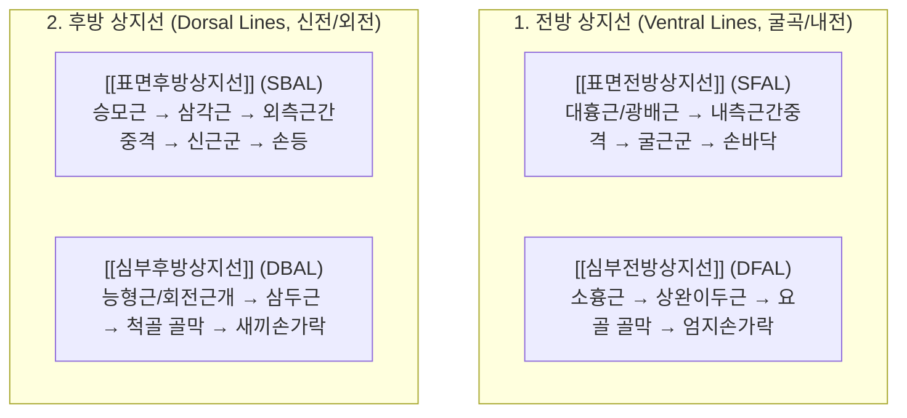

---
title: "상지선 (Arm Lines, 4대 상지경선)"
category: "근골격계 / 근막경선"
created: 2026-08-30
updated: 2026-08-30
tags:
  - anatomy-trains
  - arm-lines
  - sfal
  - dfal
  - sbal
  - dbal
  - fascia
  - thomas-myers
---

# [[5_상지경선_Arm_Lines]](Arm Lines)

> **핵심 요약 (Key Summary)**:
> 체간(척추, 늑골, 흉골)에서 시작하여 상지 4대 면(전면 표층/심층, 후면 표층/심층)을 따라 손가락 끝까지 연결되는 4개의 독립된 상지 근막 사슬입니다.
> 견갑골 안정화 및 상지의 잡기(Grasping), 당기기(Pulling), 밀기(Pushing), 정밀 조작(Fine manipulation) 움직임을 조율합니다.
> 한의학 [[수삼음경]](폐·심포·심) 및 [[수삼양경]](대장·삼초·소장)과 100% 대응하며, [[오십견]], 테니스/골퍼 엘보, [[수근관 증후군]] 및 [[흉곽출구 증후군|흉곽출구증후군]]의 핵심 진단·치료 라인입니다.

---

## 📌 목차
1. [4대 상지선의 개요 및 전체 주행 노선도](#1-4대-상지선의-개요-및-전체-주행-노선도)
2. [4대 상지선 정밀 비교 매트릭스](#2-4대-상지선-정밀-비교-매트릭스)
3. [전방 상지선: SFAL & DFAL 심층 분석](#3-전방-상지선-sfal--dfal-심층-분석)
4. [후방 상지선: SBAL & DBAL 심층 분석](#4-후방-상지선-sbal--dbal-심층-분석)
5. [어깨 복합체 안정화(Stabilizer) vs 파워(Mover) 역학](#5-어깨-복합체-안정화stabilizer-vs-파워mover-역학)
6. [호발 상지 질환 및 임상 병리 총괄](#6-호발-상지-질환-및-임상-병리-총괄)
7. [추나·도수·침구 치료 전략](#7-추나도수침구-치료-전략)
8. [출처 및 참고 문헌 (References)](#8-출처-및-참고-문헌-references)

---

## 1. 4대 상지선의 개요 및 전체 주행 노선도

상지는 신체 다른 부위보다 움직임의 자유도(Degrees of freedom)가 높기 때문에 전면과 후면이 각각 **표층(Superficial)과 심층(Deep)**의 2개 층으로 나뉘어 총 4개의 사슬을 형성합니다.

![[AnatomyTrains_Fig_7_2.png|550]]

> [그림 7.2. 4대 상지선(SFAL, DFAL, SBAL, DBAL) 골성 정거장 및 층별 구조 비교 도해].

---

## 2. 4대 상지선 정밀 비교 매트릭스

| 경선명                     | 기시부 (체간 닻)         | 상완 트랙                        | 전완 트랙                               | 종착점 (손)         | 한의학 경락                   |
| :---------------------- | :----------------- | :--------------------------- | :---------------------------------- | :-------------- | :----------------------- |
| [[SFAL]] (표면전방상지선) | [[대흉근]] & [[광배근]]  | 상완골 내측근간중격                   | 상완골 내측상과 $\rightarrow$ 수근굴근군    | 손바닥 전체 및 수지굴근건  | [[수궐음심포경]] [[수소음심경]]  |
| [[DFAL]] (심부전방상지선)** | [[소흉근]] & 쇄골하근**   | [[상완이두근]] (오훼완근)             | 요골 조면 $\rightarrow$ **요골 골막** & 회외근 | [[모지구]] (엄지손가락) | [[수태음폐경]]                |
| [[SBAL]] (표면후방상지선) | [[승모근]]            | [[삼각근]] $\rightarrow$ 외측근간중격 | 상완골 외측상과 $\rightarrow$ 수근신근군    | 손등(수배) 및 수지신근건  | [[수소양삼초경]] [[수양명대장경]] |
| [[DBAL]] (심부후방상지선) | [[능형근]] & [[견갑거근]] | [[회전근개]] & [[상완삼두근]]         | 주두 $\rightarrow$ 척골 골막 & 척측수근신근 | [[소지구]] (새끼손가락) | [[수태양소장경]]               |

---

## 3. 전방 상지선: SFAL & DFAL 심층 분석

### (1) 표면전방상지선 (Superficial Front Arm Line, SFAL)
![[AnatomyTrains_Fig_7_5.png|480]]

> [그림 3. 표면전방상지선(SFAL)의 대흉근-내측근간중격-수근굴근군 주행].

* **주행**: 흉골/쇄골([[대흉근]]) 및 흉요근막([[광배근]]) $\rightarrow$ 상완골 내측근간중격 $\rightarrow$ 내측상과 $\rightarrow$ 전완 굴근군 $\rightarrow$ 수근관 $\rightarrow$ 손바닥.
* **기능 및 병리**: 강력한 포옹, 밀기, 공 던지기 가속을 담당. 과사용 시 **골퍼 엘보(내측상과염)** 및 [[수근관 증후군]] 유발.

### (2) 심부전방상지선 (Deep Front Arm Line, DFAL)
![[AnatomyTrains_Fig_7_9.png|480]]

> [그림 4. 심부전방상지선(DFAL)의 소흉근-상완이두근-요골-모지구 주행].

* **주행**: 제3~5 늑골([[소흉근]]) $\rightarrow$ 오훼돌기 $\rightarrow$ [[상완이두근]] $\rightarrow$ 요골 조면 $\rightarrow$ 요골 골막 $\rightarrow$ 모지구(엄지손가락).
* 기능 및 병리: 엄지손가락을 조작하는 정밀 파지 라인. 단축 시 오훼돌기 하방에서 신경혈관관을 압박하는 [[흉곽출구 증후군|흉곽출구증후군]](TOS) 및 이두근 건초염, 드퀘르벵 건초염 유발.

---

## 4. 후방 상지선: SBAL & DBAL 심층 분석

### (1) 표면후방상지선 (Superficial Back Arm Line, SBAL)
![[AnatomyTrains_Fig_7_14.png|480]]

> [그림 5. 표면후방상지선(SBAL)의 승모근-삼각근-외측근간중격-수근신근군 주행].

* **주행**: 후두골/경추/흉추([[승모근]]) $\rightarrow$ 견봉/쇄골 외측 $\rightarrow$ [[삼각근]] $\rightarrow$ 외측근간중격 $\rightarrow$ 외측상과 $\rightarrow$ 전완 신근군 $\rightarrow$ 손등.
* **기능 및 병리**: 팔을 측방으로 들어 올리고 지지하는 라인. 과긴장 시 **테니스 엘보(외측상과염)** 및 **견봉하 충돌 증후군** 유발.

### (2) 심부후방상지선 (Deep Back Arm Line, DBAL)
![[AnatomyTrains_Fig_7_19.png|480]]

> [그림 6. 심부후방상지선(DBAL)의 능형근-회전근개-삼두근-척골-소지구 주행].

* **주행**: C1-C4 횡돌기([[견갑거근]]) 및 C6-T5 극돌기([[능형근]]) $\rightarrow$ 견갑골 내측연 $\rightarrow$ [[회전근개]](극하근/소원근/견갑하근) $\rightarrow$ [[상완삼두근]] $\rightarrow$ 주두 $\rightarrow$ 척골 골막 $\rightarrow$ 소지구(새끼손가락).
* **기능 및 병리**: 상완골두를 관절와에 밀착시키는 최핵심 안정화 사슬. 기능 부전 시 **회전근개 파열**, **만성 능형근 담결림**, **주두 활액낭염** 유발.

---

## 5. 어깨 복합체 안정화(Stabilizer) vs 파워(Mover) 역학

* **안정화 사슬 (Deep Lines: DFAL + DBAL)**:
  * 관절 가까이 위치하여 상완골두를 관절와(Glenoid) 중심에 안정적으로 안착시키고(Centration), 미세 조작(Fine motor)을 제어합니다.
* **파워 사슬 (Superficial Lines: SFAL + SBAL)**:
  * 관절에서 멀리 떨어진 큰 지레팔을 가지고 있어, 무거운 물건을 들거나 던지고 밀어내는 거대한 토크를 발생시킵니다.

---

## 6. 호발 상지 질환 및 임상 병리 총괄

| 상지 질환명 | 주동 손상 상지선 | 병리 기전 | 핵심 침도/추나 치료점 |
| :--- | :--- | :--- | :--- |
| [[흉곽출구 증후군|흉곽출구증후군]](TOS) | [[DFAL]] | 소흉근 단축으로 오훼돌기 아래 쇄골하동맥/신경총 압박 | 소흉근 건막 박리 + [[중부(中府)]] |
| **테니스 엘보 (외측상과염)** | [[SBAL]] | 수근신근 과사용 및 외측상과 건막 유착 | 외측상과 기시부 도침 + [[곡지(曲池)]] |
| **골퍼 엘보 (내측상과염)** | [[SFAL]] | 수근굴근 과사용 및 내측상과 견인 손상 | 내측상과 부착부 도침 + [[소해(少海)]] |
| **회전근개 건병증 / 충돌** | [[DBAL]] | 능형근-회전근개 협응 부전으로 상완골두 상방 활주 | 극하근/소원근/삼두근 + [[천종(天宗)]] |
| [[수근관 증후군]] | [[SFAL]] | 굴근지대 비후 및 정중신경 압박 | 횡수근인대 침도 박리 + [[대릉(大陵)]] |

---

## 7. 추나·도수·침구 치료 전략

### (1) 상지 4대 경선 스트레칭 & 근막 이완술
* 팔을 90° 외전시킨 상태에서 손바닥을 벽에 대고 몸을 회전(SFAL/DFAL 이완)하거나, 팔을 안으로 모으고 손목을 꺾어 이완(SBAL/DBAL 이완)합니다.

### (2) 한의학 경락 연계 (수삼음경 & 수삼양경)
* **음경 사슬 (SFAL / DFAL)**:
  * 중부(中府), 척택(尺澤), 열결(列缺), 태연(太淵) (DFAL 폐경)
  * 극천(極泉), 곡택(曲澤), 내관(內關), 대릉(大陵) (SFAL 심포/심경)
* **양경 사슬 (SBAL / DBAL)**:
  * 견정(肩井), 비노(臂臑), 곡지(曲池), 수삼리(手三里), 합곡(合谷) (SBAL 대장/삼초경)
  * 견외수(肩外兪), 천종(天宗), 소해(小海), 후계(後谿) (DBAL 소장경)

---

## 8. 출처 및 참고 문헌 (References)

1. **Myers, T. W. (2014)**. *Anatomy Trains: Myofascial Meridians for Manual and Movement Therapists* (3rd ed.). Churchill Livingstone / Elsevier. (Chapter 7: The Arm Lines, pp. 205-232).
   - **[연구 요약]**: 상지 4대 경선의 층별 해부학적 구조, 견갑골-상완골-수지 골막 연속성 및 안정화/파워 역학 규명.
2. **Stecco, C., et al. (2007)**. *The fascia, the forgotten structure*. **Italian Journal of Anatomy and Embryology**, 112(2), 77-84.
   - **[연구 요약]**: 상지 심부 근막의 고유수용감각(Proprioception) 전달 및 상지 신경 포착 메커니즘 분석.
