# [[6_기능선_Functional_Lines]](Functional Lines)

> **핵심 요약 (Key Summary)**:
> 신체 전후면에서 한쪽 어깨와 반대쪽 골반 및 대퇴를 대각선(X자)으로 가로지르는 동적 스포츠 파워 및 나선형 가속·감속 근막 사슬입니다.
> 정적 자세 지지보다는 걷기, 달리기, 던지기(Throwing), 차기(Kicking) 등 동적 동작에서 상지와 하지를 사선으로 연결하여 지면 반발력을 전달합니다.
> [[광배근]]-[[대둔근]] 후방기능선(BFL)과 대흉근-[[장내전근]] 전방기능선(FFL)으로 구성되며, [[천장관절 증후군]], 서혜부 건염, 스포츠 탈장 및 어깨 투구 손상의 핵심 원인선입니다.

---

## 📌 목차
1. [기능선의 정의 및 전체 주행 노선도](#1-기능선의-정의-및-전체-주행-노선도)
2. [후방기능선(BFL) & 전방기능선(FFL) 정밀 매트릭스](#2-후방기능선bfl--전방기능선ffl-정밀-매트릭스)
3. [분절별 정밀 해부학 및 X자 사선 연결성 분석](#3-분절별-정밀-해부학-및-x자-사선-연결성-분석)
4. [보행 및 스포츠 시 동적 힘 전달 (Force Transmission)](#4-보행-및-스포츠-시-동적-힘-전달-force-transmission)
5. [천장관절(SI Joint)의 동적 압박 잠금(Force Closure) 역학](#5-천장관절si-joint의-동적-압박-잠금force-closure-역학)
6. [호발 보상 패턴 및 스포츠 손상 총괄](#6-호발-보상-패턴-및-스포츠-손상-총괄)
7. [추나·도수·침구 치료 전략](#7-추나도수침구-치료-전략)
8. [출처 및 참고 문헌 (References)](#8-출처-및-참고-문헌-references)

---

## 1. 기능선의 정의 및 전체 주행 노선도

기능선(FL)은 일상적인 정적 기립 자세에서는 거의 작동하지 않지만, 몸통을 비틀며 팔다리를 교차 사용하는 스포츠 동작(달리기, 수영, 투구 등)에서 강력한 탄성 에너지를 방출하는 **'스포츠 파워 사선 사슬(Cross-Power Slings)'**입니다.

![[AnatomyTrains_Fig_8_2.png|550]]

> [그림 8.2. 후방기능선(BFL)과 전방기능선(FFL)의 골성 정거장 및 근막 트랙 구조].

```mermaid
flowchart TD
    subgraph BFL ["1. 후방기능선 (Back Functional Line, BFL)"]
        A["상완골 결절간구 바닥"] --> B["[[광배근]] (Latissimus Dorsi)"]
        B --> C["흉요근막 층판 (Thoracolumbar Fascia, L4-S1 대각선 교차)"]
        C --> D["천골 & 천결절인대"]
        D --> E["반대측 [[대둔근]] (Gluteus Maximus)"]
        E --> F["대퇴골 둔근조면 & [[외측광근]] (Vastus Lateralis)"]
        F --> G["슬개골 & 슬개하인대"]
    end

    subgraph FFL ["2. 전방기능선 (Front Functional Line, FFL)"]
        H["상완골 대결절 융기"] --> I["[[대흉근]] 흉골부 하부 (Pectoralis Major)"]
        I --> J["제5, 6 늑연골 & [[복직근]] (Rectus Abdominis)"]
        J --> K["치골결절 & 치골결합 (Pubic Crest)"]
        K --> L["반대측 [[장내전근]] (Adductor Longus)"]
        L --> M["대퇴골 조선 (Linea Aspera)"]
    end
```

---

## 2. 후방기능선(BFL) & 전방기능선(FFL) 정밀 매트릭스

| 구분 | 구조물 명칭 (한글/영문) | 해부학적 특성 및 기능적 기전 |
| :--- | :--- | :--- |
| 후방기능선 기시 | 상완골 결절간구 $\rightarrow$ [[광배근]] | 상완골 내전, 신전, 내회전 파워 트랙 |
| 후방 핵심 교차 닻 | [[흉요근막]] (Thoracolumbar fascia, TLF) 후엽 | L4-S1 레벨에서 반대측 [[대둔근]] 근막과 100% 융합되는 교차 허브 |
| **후방기능선 정지** | **반대측 [[대둔근]] $\rightarrow$ [[외측광근]] $\rightarrow$ 슬개골** | 고관절 강력한 신전 및 천장관절 압박력 제공 |
| **전방기능선 기시** | **상완골 대흉근 정지부 $\rightarrow$ [[대흉근]] 하부** | 상완골 강력한 수평 내전 트랙 |
| **전방 핵심 교차 닻** | **제5, 6 늑연골 $\rightarrow$ [[복직근]] $\rightarrow$ 치골결합** | 복벽을 수직 하행하여 치골에서 반대측으로 교차 |
| **전방기능선 정지** | **반대측 [[장내전근]] $\rightarrow$ 대퇴골 조선** | 고관절 강력한 내전 및 굴곡 파워 제공 |

---

## 3. 분절별 정밀 해부학 및 X자 사선 연결성 분석

### (1) 후방기능선(BFL): [[광배근]]-[[흉요근막]]-대둔근의 교차
![[AnatomyTrains_Fig_8_4.png|480]]

> [그림 3. 광배근과 반대측 대둔근이 [[흉요근막]](TLF) 위에서 서로 엇갈리며 교차하는 해부학적 구조].

* 한쪽 광배근의 하부 섬유는 흉요근막의 후엽으로 진입하여, 척추 중심선(L4-S1 극돌기)을 가로질러 **반대쪽 [[대둔근]](Gluteus maximus)의 표층 섬유와 직접 연속**됩니다.
* 이 섬유는 대퇴골 둔근조면을 지나 [[외측광근]](Vastus lateralis)을 타고 슬개골 외측 지지대로 이어집니다.

### (2) 전방기능선(FFL): 대흉근-[[복직근]]-내전근의 교차
![[AnatomyTrains_Fig_8_7.png|480]]

> [그림 4. 대흉근 하부 섬유에서 복직근초를 거쳐 반대측 장내전근으로 이어지는 전면 사선 사슬].

* 대흉근 흉골부의 하단 섬유는 제5, 6 늑골을 지나 복직근초(Rectus sheath) 전엽으로 들어가며, 치골결절(Pubic tubercle)을 지나 **반대쪽 [[장내전근]](Adductor longus)**과 건막적으로 결합합니다.

---

## 4. 보행 및 스포츠 시 동적 힘 전달 (Force Transmission)

* **보행 및 달리기 시 반대측 사지 동조**:
  * 왼발을 딛고 오른팔을 뒤로 젖힐 때, **오른쪽 광배근과 왼쪽 [[대둔근]](BFL)**이 팽팽하게 늘어나며 거대한 탄성 변형 에너지(Elastic strain energy)를 저장합니다.
  * 발이 지면을 차는 순간(Toe-off) 이 에너지가 방출되면서 앞으로 튀어나가는 추진력이 발생합니다.

---

## 5. 천장관절(SI Joint)의 동적 압박 잠금(Force Closure) 역학

* 천장관절(Sacroiliac Joint)은 형태학적 맞물림(Form closure)만으로는 보행 시 체중 부하를 견디지 못합니다.
* 광배근과 반대측 대둔근이 흉요근막을 대각선으로 강하게 잡아당기면, 천골과 장골이 서로 압박되어 **'동적 힘 잠금(Force closure)'**이 발생하여 천장관절이 견고하게 안정화됩니다.

---

## 6. 호발 보상 패턴 및 스포츠 손상 총괄

| 임상 질환 / 손상 | 기능선 병리 기전 | 주요 임상 증상 |
| :--- | :--- | :--- |
| [[천장관절 증후군]] | BFL 불균형([[대둔근]] 약화, [[광배근]] 과긴장)으로 천장관절 동적 잠금 실패 | 보행 및 계단 오를 때 천골/둔부 날카로운 통증 |
| **스포츠 탈장 / 서혜부 건염** | FFL 치골 부착부([[복직근]] vs [[장내전근]])의 상하 사선 견인 불균형 | 킥 동작, 전력 질주 시 서혜부 및 치골 결합부 찢어지는 통증 |
| **야구/배구 어깨 충돌 & SLAP** | 하지-체간의 BFL/FFL 추진력 상실로 어깨 단독 과부하(Over-reliance) | 투구 시 어깨 전면/후면 극심한 충돌 통증 |

---

## 7. 추나·도수·침구 치료 전략

### (1) [[흉요근막]](TLF) & 치골결합 교차부 침도/추나
* [[흉요근막]] 교차부: 신수(腎兪), 대장수(大腸兪), 관원수(關元兪), 차료(次髎) 부위에 약침 및 도침을 적용하여 [[광배근]]-[[대둔근]] 교차 닻의 유착을 해소합니다.
* **치골결합 및 [[장내전근]] 기시부**: 곡골(曲骨), 기충(氣衝) 부위의 건막 견인 긴장을 풀어줍니다.

### (2) 기능선 3D 사선 회전 재활
* 케이블 머신이나 밴드를 이용해 대각선으로 당기는 찹(Wood-chop) 및 리프트(Lift) 동작을 적용하여 X자 사슬 협응력을 회복합니다.

---

## 8. 출처 및 참고 문헌 (References)

1. **Myers, T. W. (2014)**. *Anatomy Trains: Myofascial Meridians for Manual and Movement Therapists* (3rd ed.). Churchill Livingstone / Elsevier. (Chapter 8: The Functional Lines, pp. 233-242).
   - **[연구 요약]**: [[광배근]]-[[대둔근]] 후방기능선과 대흉근-[[내전근]] 전방기능선의 X자 사선 힘 전달 역학 및 스포츠 동작 파워 사슬 규명.
2. **Vleeming, A., et al. (1995)**. *The posterior layer of the thoracolumbar fascia: its function in load transfer from spine to legs*. **Spine**, 20(7), 753-758.
   - **[연구 요약]**: 흉요근막을 통한 광배근과 대둔근의 천장관절 안정화(Force closure) 메커니즘 생체역학적 입증.
