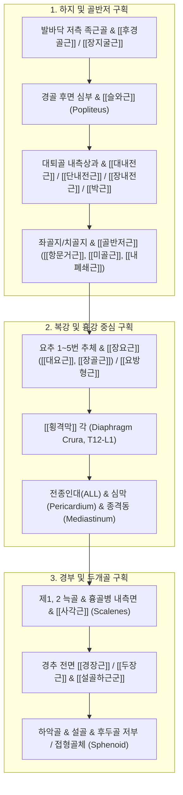

# [[7_심부전방선_DFL]](Deep Front Line)

> **핵심 요약 (Key Summary)**:
> 발바닥 심부([[후경골근]])에서 시작하여 [[내전근]], 골반저, [[장요근]], [[횡격막]], 종격동을 거쳐 [[사각근]]·[[경장근]] 및 두개골 기저부까지 인체의 중심축을 관통하는 3차원 코어(Myofascial Core)의 최심부 기둥입니다.
> 족저 내측 종아치 리프팅, 고관절 안정화, 요추 전만 지지, 호흡([[횡격막]])과 보행([[장요근]])의 역학적 통합 및 두경부 안정성을 담당합니다.
> 한의학 [[족궐음간경]]·[[족소음신경]] 및 종근(宗筋) 시스템과 직결되며, 평발, 만성 난치성 요통, [[횡격막]] 호흡 제한, 자율신경 실조 및 [[턱관절 장애]](TMJ)의 근본 원인선입니다.

---

## 📌 목차
1. [심부전방선의 정의 및 전체 주행 노선도](#1-심부전방선의-정의-및-전체-주행-노선도)
2. [정거장(Bony Stations) 및 근막 트랙(Tracks) 정밀 매트릭스](#2-정거장bony-stations-및-근막-트랙tracks-정밀-매트릭스)
3. [분절별 정밀 해부학 및 3차원 코어 실린더(Inner Cylinder) 구조](#3-분절별-정밀-해부학-및-3차원-코어-실린더inner-cylinder-구조)
4. [횡격막-장요근 동조(Diaphragm-Psoas Coupling)와 호흡·보행 역학](#4-횡격막-장요근-동조diaphragm-psoas-coupling와-호흡보행-역학)
5. [생체역학적 자세 및 코어 기둥 기능](#5-생체역학적-자세-및-코어-기둥-기능)
6. [호발 보상 패턴 및 전신 난치성 질환 총괄](#6-호발-보상-패턴-및-전신-난치성-질환-총괄)
7. [추나·도수·침구 치료 전략](#7-추나도수침구-치료-전략)
8. [출처 및 참고 문헌 (References)](#8-출처-및-참고-문헌-references)

---

## 1. 심부전방선의 정의 및 전체 주행 노선도

심부전방선(DFL)은 신체의 다른 모든 2차원 표재성 경선(SBL, SFL, LL, SL)이 둘러싸고 있는 **'인체 내측의 3차원 입체 기둥(3D Myofascial Core)'**입니다.

![[AnatomyTrains_Fig_9_2.png|550]]

> [그림 9.2. 심부전방선(DFL) 전신 골성 정거장(Bony Stations) 및 근막 트랙(Tracks) 구조].

---

## 2. 정거장(Bony Stations) 및 근막 트랙(Tracks) 정밀 매트릭스

| 구분 | 구조물 명칭 (한글/영문) | 해부학적 특성 및 코어 지지 기능 |
| :--- | :--- | :--- |
| **정거장 1** | **족근골 저측면 및 중족골 기저부** | 발바닥 내측 종아치 정점 닻 |
| **트랙 1** | [[후경골근]] & [[장지굴근]] (Tibialis posterior & Flexor digitorum longus) | 발목 내측 안정화 및 족궁 리프팅 |
| **정거장 2** | **경골/비골 후면 및 슬와선** | 무릎 심부 관절 닻 |
| **트랙 2** | [[슬와근]] & [[내전근관]] (Popliteus & Adductor canal) | 무릎의 잠김(Screw-home) 해제 및 내측 지지 |
| **정거장 3** | **대퇴골 조선 내측순 및 좌골/치골지** | 대퇴골 내측 닻 |
| **트랙 3** | [[대내전근]], [[단내전근]], [[장내전근]], [[박근]] (Adductors & Gracilis) | 고관절 내측 지지 및 골반저로의 직접 연결 |
| **정거장 4** | **좌골지, 치골결합, 미골** | **골반저 (Pelvic Floor) 중심 닻** |
| 트랙 4 | [[골반저근]]([[항문거근]], [[미골근]], [[내폐쇄근]]) (Levator ani, Coccygeus, Obturator internus) | 골반 장기 지지 및 복압 형성 바닥판 |
| **정거장 5** | **요추 1~5번 추체 및 횡돌기** | 척추 전만 중심 닻 |
| 트랙 5 | [[장요근]]([[대요근]], [[장골근]]), [[요방형근]] 전엽 (Psoas major, Iliacus, Quadratus lumborum) | 하지와 척추를 잇는 최핵심 코어 엔진 |
| 정거장 6 | 요추 1~3번 추체 전면 및 제12늑골 | [[횡격막]] 각 닻 |
| 트랙 6 | [[횡격막]] $\rightarrow$ 전종인대(ALL) $\rightarrow$ 심막/종격동 근막 | 호흡 리듬과 척추 기둥을 직접 연결 |
| **정거장 7** | **제1, 2 늑골 및 흉골병 내측면** | 흉곽 상구 닻 |
| **트랙 7** | [[사각근]], [[경장근]], [[두장근]], [[설골하근군]] (Scalenes, Longus colli/capitis, Infrahyoids) | 경추 심부 안정화 및 굴곡 제어 |
| **정거장 8** | **하악골 내측, 설골, 후두골 기저부, 접형골** | 두개기저부 최종 종착점 |

---

## 3. 분절별 정밀 해부학 및 3차원 코어 실린더(Inner Cylinder) 구조

### (1) 하지 심부: 후경골근에서 [[내전근]], 골반저로의 주행
![[AnatomyTrains_Fig_9_4.png|480]]

> [그림 3. 후경골근에서 시작하여 슬와근, 대내전근을 거쳐 골반저근으로 진입하는 하지 심부 주행].

* [[후경골근]](Tibialis posterior) 건은 주상골(Navicular)과 내측 설상골을 꽉 움켜쥐며 족궁을 들어 올린 뒤, 경골 후면 심부 구획을 타고 올라와 [[대내전근]](Adductor magnus)**의 건막을 거쳐 [[골반저근]](Pelvic floor)**의 내폐쇄근막(Obturator fascia)으로 융합됩니다.

### (2) 복강 및 흉강: 장요근에서 [[횡격막]], 심막/종격동으로의 연결
![[AnatomyTrains_Fig_9_9.png|480]]

> [그림 4. 장요근과 [[횡격막]] 각(Crura), 전종인대 및 심막이 얽혀 있는 흉복부 심부 중심 연결].

* 골반저에서 이어진 장력은 [[장요근]](Psoas major)**을 타고 요추 추체 전면으로 상행하여, [[횡격막]]의 각(Crura, L1-L3)**과 직접 얽힙니다.
* [[횡격막]] 중심건을 통과한 근막은 **심막(Pericardium)**과 **종격동(Mediastinum)**을 감싸며 흉강 상구로 상행합니다.

### (3) 경부 및 두개기저부: [[사각근]], [[경장근]], 익상근까지
![[AnatomyTrains_Fig_9_16.png|480]]

> [그림 5. 흉강 상구에서 [[사각근]], [[경장근]], 설골근을 거쳐 두개골 저부(접형골)로 이어지는 종착 주행].

* 흉강 상부에서 장력은 [[사각근]](Scalenes)**과 경추 전면의 [[경장근]](Longus colli/capitis)**을 타고 상행하여 후두골 저부(Basilar part of occiput)와 **접형골(Sphenoid)** 및 하악골 내측에 부착됩니다.

---

## 4. [[횡격막]]-[[장요근]] 동조(Diaphragm-Psoas Coupling)와 호흡·보행 역학

![[AnatomyTrains_Fig_9_12.png|480]]

> [그림 6. 횡격막의 내림 운동과 장요근의 율동적 신장이 맞물리는 호흡-보행 동조 메커니즘].

* **기계적 융합**: 횡격막의 내측 각(Medial crura) 섬유는 장요근의 상부 건막 및 내측 요늑궁(Medial arcuate ligament)과 해부학적으로 분리되지 않고 한 덩어리로 융합되어 있습니다.
* **호흡과 보행의 일치**:
  * 숨을 깊이 들이마실 때(흡기) 횡격막이 하강하며 장요근을 부드럽게 마사지하고,
  * 걸을 때 장요근의 교차 신전이 횡격막을 자극하여 **'보행 리듬과 호흡 리듬이 하나로 동조'**됩니다.

---

## 5. 생체역학적 자세 및 코어 기둥 기능

### (1) 신체 3차원 코어 실린더 (Inner Cylinder)
* DFL은 [[복횡근]], [[다열근]], [[골반저근]], 횡격막으로 구성된 이너 유닛(Inner unit)의 핵심 축을 형성합니다.
* 척추 전면에 유압식 기둥(Hydraulic core support)을 형성하여 디스크 압박력을 분산시킵니다.

---

## 6. 호발 보상 패턴 및 전신 난치성 질환 총괄

| 임상 질환 / 증후군 | DFL 병리 기전 | 주요 임상 증상 |
| :--- | :--- | :--- |
| [[평발]](Flat Foot) & 무지외반 | [[후경골근]] 약화 및 족궁 리프팅 실패 | 발목 내측 무너짐, 무릎 내측 통증 |
| **만성 난치성 요통 & 척추관협착증** | [[장요근]]/[[요방형근]] 단축으로 요추 추간판 과압박 | 기립 시 허리 굳음, 오래 걷지 못함 |
| [[턱관절 장애]](TMJ) & 경추 두통 | DFL 상부([[사각근]]-설골근-익상근) 긴장 전파 | 턱 개구 장애, 교근 통증, 측두통 |
| **호흡 부전 및 만성 자율신경 실조** | [[횡격막]] 각 단축으로 얕은 가슴 호흡 고착 | 만성 피로, 가슴 답답함, 소화불량 |

---

## 7. 추나·도수·침구 치료 전략

### (1) [[장요근]](Psoas) & [[대내전근]] 침도/약침 접근
* 서혜부 하방의 [[장요근]] 건 부착부(소전자 부위)와 치골지 [[대내전근]] 기시부를 침도로 박리하여 골반 심부 장력을 개방합니다.

### (2) [[횡격막]] 이완 및 [[사각근]] 침도
* 갈비뼈 하단(계늑부)의 [[횡격막]] 부착부와 제1, 2 늑골의 [[사각근]] 부착부를 이완하여 흉강 코어를 정상화합니다.

### (3) 한의학 경락 연계 (족궐음간경 & 족소음신경)
* DFL은 한의학에서 전신 근막의 뿌리인 [[종근]](宗筋) 및 간·신·비 3음경과 완벽히 일치합니다.
* **핵심 치료점**:
  * 족부/하퇴: 태충(太衝), 태계(太谿), 삼음교(三陰交), 음릉천(陰陵泉)
  * 슬관절/대퇴: 곡천(曲泉), 음곡(陰谷), 음포(陰包), 족오리(足五里)
  * 복부: 기해(氣海), 관원(關元), 천추(天樞), 대황(大橫), 거궐(巨闕)
  * 흉부/경부: 단중(膻中), 결분(缺盆), 인영(人迎), 염천(廉泉), 천돌(天突)

---

## 8. 출처 및 참고 문헌 (References)

1. **Myers, T. W. (2014)**. *Anatomy Trains: Myofascial Meridians for Manual and Movement Therapists* (3rd ed.). Churchill Livingstone / Elsevier. (Chapter 9: The Deep Front Line, pp. 243-272).
   - **[연구 요약]**: 후경골근에서 골반저, [[장요근]], [[횡격막]], 두개기저부로 이어지는 심부전방선(DFL)의 입체 해부학적 연속성 및 3D 코어 기둥 기전 규명.
2. **Hodges, P. W., & Richardson, C. A. (1996)**. *Inefficient muscular stabilization of the lumbar spine associated with low back pain*. **Spine**, 21(22), 2640-2650.
   - **[연구 요약]**: 심부 코어 근육([[복횡근]], [[골반저근]], [[장요근]], [[횡격막]])의 동조 기능 부전과 만성 요통의 상관성 입증.
3. **Bordoni, B., & Zanier, E. (2013)**. *Anatomic connections of the diaphragm: influence of respiration on the body system*. **Journal of Multidisciplinary Healthcare**, 6, 281-291.
   - **[연구 요약]**: 횡격막과 [[장요근]], 심막, 사각근의 전신 근막적 연결 및 호흡이 자세 안정성에 미치는 역학 분석.
