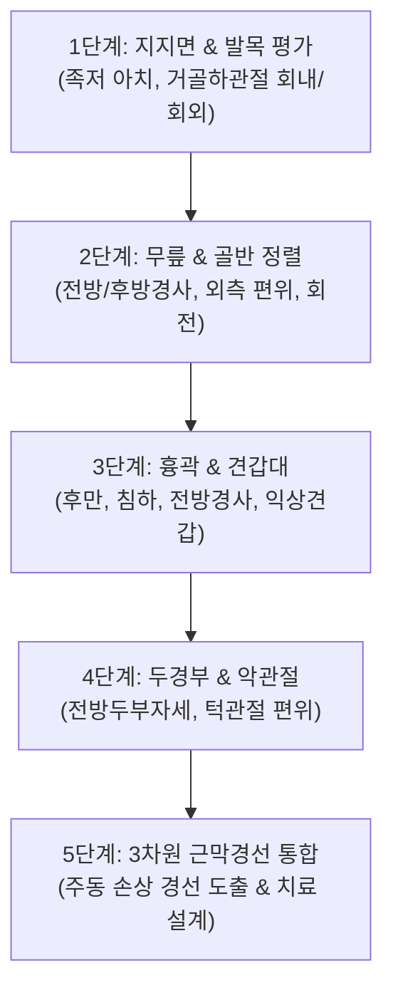

# [[8_자세평가_BodyReading]](BodyReading & Structural Integration)

> **핵심 요약 (Key Summary)**:
> 12대 근막경선의 상호 장력 균형을 바탕으로 환자의 정적 정렬과 동적 보행 패턴을 3차원 입체적으로 판독하는 신체 판독(BodyReading) 임상 가이드입니다.
> 중력선(Plumb Line)을 기준으로 시상면(SBL/SFL), 관상면(LL), 수평면(SL/FL) 및 심부 코어(DFL)의 변형을 5단계로 분석합니다.
> 국소 통증 부위가 아닌 '전신 장력의 근원지'를 찾아내어 추나 관절 교정과 근막 이완술의 우선순위를 결정하고, 한의학 12경근(經筋)과 100% 연계하는 종합 임상 프로토콜입니다.

---

## 📌 목차
1. [BodyReading의 정의 및 5단계 평가 프로토콜](#1-bodyreading의-정의-및-5단계-평가-프로토콜)
2. [시상면(Sagittal Plane) 평가: SBL vs SFL 전후 장력](#2-시상면sagittal-plane-평가-sbl-vs-sfl-전후-장력)
3. [관상면(Frontal Plane) 평가: 좌우 외측선(LL) 균형](#3-관상면frontal-plane-평가-좌우-외측선ll-균형)
4. [수평면(Transverse Plane) 평가: 나선선(SL) 회전 변형](#4-수평면transverse-plane-평가-나선선sl-회전-변형)
5. [심부 코어(DFL) 평가 및 구조적 통합(Structural Integration) 3단계 치료](#5-심부-코어dfl-평가-및-구조적-통합structural-integration-3단계-치료)
6. [부록: 동양의학 12경근(經筋) vs Anatomy Trains 정밀 매핑 총괄표](#6-부록-동양의학-12경근經筋-vs-anatomy-trains-정밀-매핑-총괄표)
7. [출처 및 참고 문헌 (References)](#7-출처-및-참고-문헌-references)

---

## 1. BodyReading의 정의 및 5단계 평가 프로토콜

BodyReading은 눈에 보이는 국소 골격 변형(예: 굽은 등, 거북목) 뒤에 숨어 있는 **전신 근막망(Fascial Web)의 당김(Pull)과 느슨함(Slack)**을 시각적으로 읽어내는 진단 기법입니다.

![[AnatomyTrains_Fig_10_1.png|480]]

> [그림 10.1. 중력선(Plumb Line)을 기준으로 한 신체 5대 골격 분절(발, 골반, 흉곽, 어깨, 머리)의 정렬 판독].

---

## 2. 시상면(Sagittal Plane) 평가: SBL vs SFL 전후 장력

| 체형 패턴 | 주요 특징 | SBL (후방선) 상태 | SFL (전방선) 상태 | 핵심 교정 타깃 |
| :--- | :--- | :--- | :--- | :--- |
| [[스웨이백]](Swayback) | 골반이 전방으로 밀리고 상체는 뒤로 젖혀짐 | 상부 흉추/후두부 과단축 | [[대퇴직근]] 이완, [[복직근]] 약화 | [[장요근]] 활성화 + [[햄스트링]] 이완 |
| [[요추 과전만 / 흉추 후만]] | 골반 전방경사 + 거북목 | 기립근 하부/[[후두하근]] 단축 | [[복직근]] 이완, [[대퇴사두근]] 단축 | [[대퇴직근]]/[[장요근]] 이완 + [[둔근]] 강화 |
| [[일자허리 / 평평등]](Flat Back) | 척추 만곡 소실, 골반 후방경사 | [[햄스트링]]/천결절인대 심한 단축 | [[복직근]] 상부 과단축 | [[햄스트링]] 도침 + 척추 만곡 회복 추나 |

---

## 3. 관상면(Frontal Plane) 평가: 좌우 외측선(LL) 균형

![[AnatomyTrains_Fig_10_3.png|480]]

> [그림 10.3. 관상면(Frontal Plane)에서의 골반 외측 편위 및 좌우 외측선(LL) 비대칭 판독].

* **골반 외측 편위(Lateral Pelvic Shift)**:
  * 골반이 오른쪽으로 빠져 있다면, **오른쪽 외측선([[중둔근]]/TFL/ITB)은 장력성 이완(Locked long) 상태**이고, **왼쪽 내전근군(DFL)과 [[요방형근]]/복사근은 단축(Locked short) 상태**입니다.
* **기능적 다리 길이 불일치(Functional LLD)**:
  * 골반이 거상(Hiking)된 쪽의 요방형근과 외복사근을 이완하여 골반 수평을 회복합니다.

---

## 4. 수평면(Transverse Plane) 평가: 나선선(SL) 회전 변형

* **체간과 골반의 상대적 회전(Relative Rotation)**:
  * 골반은 우회전되어 있는데 흉곽은 좌회전되어 있다면 **좌우 나선선(SL)의 대각선 짝힘이 심각하게 꼬인 상태**입니다.
  * 견갑골 내측의 [[능형근]]-[[전거근]] 복합체와 대각선 복사근을 교차 치료하여 흉곽 꼬임을 해소합니다.

---

## 5. 심부 코어(DFL) 평가 및 구조적 통합(Structural Integration) 3단계 치료

### (1) '뼈는 근막의 바다에 떠 있다' (Tensegrity Principles)
* 척추 뼈 하나하나를 강제로 맞추는 교정보다, **척추를 감싸고 있는 심부 근막 기둥(DFL)과 표재성 경선(SBL/SFL/LL)의 장력을 균등하게 재분배**해야 재발 없는 근본 교정이 완성됩니다.

### (2) 구조적 통합(Structural Integration) 3단계 치료 순서
1. **1단계 (표층 슬리브 개방)**: SBL([[족저근막]]/[[햄스트링]]) 및 SFL([[대퇴직근]]/[[복직근]])의 전후 장력 균형 회복.
2. **2단계 (외측 및 회전 해소)**: LL([[장경인대]]/복사근) 및 SL([[전거근]]/[[능형근]])의 측방 및 회전 비틀림 해소.
3. **3단계 (심부 코어 안착)**: DFL([[장요근]]/골반저/[[횡격막]]/[[사각근]])의 중심 기둥 재정렬.

---

## 6. 부록: 동양의학 12경근(經筋) vs Anatomy Trains 정밀 매핑 총괄표

『근막경선 해부학』 부록 3(Appendix 3)에 수록된 동양의학 경락/경근과 근막경선의 100% 해부학적 매핑 총괄표입니다:

| Anatomy Trains 근막경선 | 한의학 대응 경락 & 경근 | 핵심 해부학적 트랙 일치성 | 대표 치료 침구혈 |
| :--- | :--- | :--- | :--- |
| [[1_표면후방선_SBL]] | [[족태양방광경]](BL) | [[족저근막]] $\rightarrow$ 아킬레스/[[비복근]] $\rightarrow$ [[햄스트링]] $\rightarrow$ 기립근 $\rightarrow$ [[후두하근]] | 지음, 곤륜, 승산, 위중, 신수, 천주, 찬죽 |
| [[2_표면전방선_SFL]] | [[족양명위경]](ST) | 족지신근 $\rightarrow$ [[전경골근]] $\rightarrow$ [[대퇴직근]] $\rightarrow$ [[복직근]] $\rightarrow$ SCM | 여태, 해계, 족삼리, 복토, 천추, 결분, 인영 |
| [[3_외측선_LL]] | [[족소양담경]](GB) | 비골근 $\rightarrow$ [[장경인대]](ITB) $\rightarrow$ [[중둔근]]/TFL $\rightarrow$ 복사근 $\rightarrow$ 늑간근 | 구허, 양릉천, 광명, 환도, 풍시, 대맥, 풍지 |
| [[4_나선선_SL]] | [[대맥]](Girdle) / 경근교차 | [[판상근]] $\leftrightarrow$ [[능형근]]/[[전거근]] $\leftrightarrow$ 복사근 $\leftrightarrow$ 발바닥 등자 $\leftrightarrow$ 기립근 | 천주, 고황, 일월, 대맥, 족삼리, 양릉천 |
| [[5_상지경선_Arm_Lines]] | **수삼음경 & 수삼양경** | • **SFAL**: 수궐음심포경 / 수소음심경 • **DFAL**: 수태음폐경 • **SBAL**: 수양명대장경 / 수소양삼초경 • **DBAL**: 수태양소장경 | 중부, 척택, 극천, 내관, 곡지, 합곡, 천종, 후계 |
| [[6_기능선_Functional_Lines]] | **사선성 경근 교차 사슬** | [[광배근]] $\leftrightarrow$ 반대측 [[대둔근]] (BFL), 대흉근 $\leftrightarrow$ 반대측 [[내전근]] (FFL) | 신수, 차료, 곡골, 기충 |
| [[7_심부전방선_DFL]] | [[종근]](宗筋) / 족궐음간경 / 족소음신경 | [[후경골근]] $\rightarrow$ [[내전근]] $\rightarrow$ 골반저 $\rightarrow$ [[장요근]] $\rightarrow$ [[횡격막]] $\rightarrow$ [[사각근]]/[[경장근]] | 태충, 태계, 삼음교, 곡천, 음곡, 관원, 기해, 단중 |

---

## 7. 출처 및 참고 문헌 (References)

1. **Myers, T. W. (2014)**. *Anatomy Trains: Myofascial Meridians for Manual and Movement Therapists* (3rd ed.). Churchill Livingstone / Elsevier. (Chapter 10-11: Structural Analysis & BodyReading, Appendix 3: East/West Meridians, pp. 273-392).
   - **[연구 요약]**: 전신 근막경선 기반 시상면, 관상면, 횡단면 체형 분석(BodyReading) 및 동양의학 12경근과의 해부학적 완전 대응 체계 정립.
2. **Rolf, I. P. (1989)**. *Rolfing: Reestablishing the Natural Alignment and Structural Integration of the Human Body for Vitality and Well-Being*. Healing Arts Press.
   - **[연구 요약]**: 중력장 내 인체 구조적 통합(Structural Integration) 및 근막 이완을 통한 자세 재정렬 원리.
