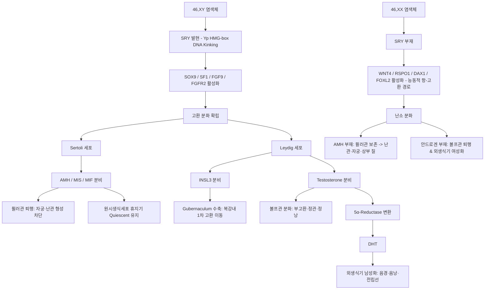
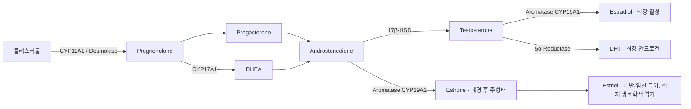
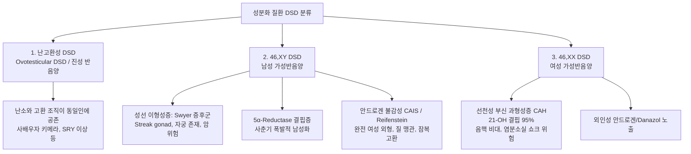

# 📑 [Netter Vol.1] Day 01: 생식기 발생학, 성선 기능 축 및 성분화 이상 질환 (Section 1 완독)

> 📖 **원서 출처**: [The Netter Collection of Medical Illustrations - Volume 1, Reproductive System.pdf (pp. 2-18)](https://drive.google.com/file/d/1x-xTgPfUfiK7dsQyp5L5qfjFYSD_XyGm/view?usp=drivesdk)  
> 🏷️ **범위**: Section 1 전편 (Plate 1-1 ~ Plate 1-15)  
> 📌 **핵심 테마**: 초기 성결정 유전학, 내·외생식기 상동기관 분화, 스테로이드 생합성, HPG 내분비 조절 축, 사춘기 발달 단계 및 DSD(성분화 질환) 감별

---

## 1. 개요 및 마스터 요약 (Executive Summary)

1. **유전적 성결정 & 성선 분화 네트워크 (Genetics & Gonadal Determination)**:
   - 수정 시 성염색체(XX vs XY, 약 3억 년 전 상염색체에서 진화)에 의해 유전적 성이 결정됩니다.
   - 양위성 생식선능(Genital ridge)에서 $WT1$(Chr 11), $GATA4$/$FOG2$(Chr 8)에 의해 기초 발생이 시작된 후, Y염색체 단완($Yp$)의 **SRY 유전자(HMG-box 모티프로 DNA를 꺾음)**가 발현되면 $SOX9$(Chr 17), $SF1$(Chr 11), $FGF9$(Chr 13), $FGFR2$(Chr 10)가 증폭되어 고환 분화를 지휘합니다.
   - 난소 분화는 단순한 '기본값(default)'이 아니라 **WNT4 & RSPO1**(Chr 1), **DAX1**(Chr Xp21), **FOXL2**(Chr 3) 등 능동적 항-고환(Anti-testis) 경로에 의해 유도됩니다.
2. **이중 생식관 체계의 운명 (Dual Duct System Dynamics)**:
   - **남성**: Leydig 세포의 **Testosterone**(중신관/볼프관 유지 $\rightarrow$ 부고환, 정관, 정낭) + Sertoli 세포의 **AMH/MIS**(임신 8~10주 부중신관/뮐러관 급속 퇴행 유도 및 생식세포 휴지기 유지) + Leydig 세포의 **INSL3**(고환도대 수축을 통한 복강 내 1차 하강 주도).
   - **여성**: AMH 부재(뮐러관 잔존 $\rightarrow$ 난관, 자궁, 질 상부) + 안드로겐 부재(볼프관 퇴행 $\rightarrow$ 난소상체, 난소방체, 가트너관 낭종 잔존).
3. **외생식기 분화와 12주 임계기 (Critical Window of Masculinization)**:
   - 임신 9주 이전에는 동일한 원기(생식결절, 요도구, 요도주름, 음낭음순융기)를 공유하며, 5α-환원효소에 의한 **DHT(디하이드로테스토스테론)**의 작용 여부가 남성화를 결정합니다.
   - 정상 여성 발생에서 질은 결합조직 중격의 하향 성장으로 **임신 12주경 독립 개구부**를 완성합니다. 따라서 **임신 12주 이후 안드로겐에 노출되면 음낭음순 융합은 일어나지 않고 오직 음핵 비대(Clitoromegaly)만 초래**됩니다.
4. **HPG 축 & 사춘기 전신 생리 (HPG Axis & Pubertal Physiology)**:
   - 시상하부 GnRH의 맥동 분비(키스펩틴·렙틴 촉발, 체중 임계치: 여 ~47 kg, 남 ~55 kg)가 뇌하수체 전엽 gonadotroph에서 $\text{Ca}^{2+}$ 유입 의존적으로 LH/FSH를 방출합니다.
   - 사춘기는 여성: Thelarche(유방 B2) $\rightarrow$ Pubarche $\rightarrow$ Growth Spurt $\rightarrow$ Menarche(초경, 초경 후 1년 내 80%는 무배란성), 남성: Gonadarche(고환 $\ge 4\text{ mL}$, 사춘기 전 2~3 mL $\rightarrow$ 성인 18~20 mL) $\rightarrow$ Pubarche/음경 신장(G3) $\rightarrow$ 변성(1옥타브 저음화, 15세) $\rightarrow$ 근력 급등(신장 정점 1년 뒤) 순으로 진행됩니다.
5. **DSD(성분화 질환) 감별의 3대 축**:
   - **난고환성 DSD(진성 반음양)**: 난소(난포)와 고환(세정관) 조직 공존, 단각자궁/광간막 내 미숙 고환 잠복, 성선 편측화(Lateralization) 법칙 적용.
   - **46,XY DSD**: Swyer(자궁 있음, 유방 없음, 줄무늬 성선 악성화 위험 $\rightarrow$ 예방적 성선적출) vs CAIS(자궁 없음, 풍만한 유방, 체모 결손, 고환암 위험 4~9%) vs 5-ARD(사춘기 테스토스테론 폭발에 의한 남성화 반전, 가임 정자 생성 가능).
   - **46,XX DSD**: CAH(21-OH 결핍 95%, 17-OHP 폭증, 염분소실 쇼크 위험, Dexamethasone 투여 시 17-KS 억제) vs 외인성 안드로겐/Danazol 노출(12주 전후 표현형 차이).

---

## 2. 초기 생식기 발생학 및 유전학 (Plates 1-1 ~ 1-3)

### Plate 1-1 | 초기 생식관 발생의 유전학 및 생물학 (Genetics and Biology of Early Reproductive Tract Development)

![[Netter_V1_Plate1-1.png]]

#### 1) 진화 및 핵심 유전학적 메커니즘
- **성염색체의 기원**: 인간의 성염색체(X, Y)는 약 3억 년 전(300 million years ago) 비성염색체(상염색체, autosomes)로부터 진화한 것으로 추정됩니다.
- **성결정의 유전적 원리**: 인간의 성결정은 유전적으로 지배되며, 드물게 XX 남성이나 XY 여성이 나타납니다. Y 염색체 상의 SRY 유전자가 결실된 46,XY 개체는 표현형적으로 완전한 여성(Phenotypic female)이 됩니다.
- **SRY 유전자와 HMG-box 모티프**: Y 염색체 단완($Yp$)에 위치하며, 전사인자로서 DNA를 특이적으로 꺾는(kinking/bending) HMG(high-mobility group) 박스 보존 모티프 단백질을 발현합니다. 이 물리적 입체구조 변형이 염색질 구조를 바꾸어 하류 표적 유전자들의 전사를 동시다발적으로 활성화합니다.

#### 2) 배아 원기 해부학 (Embryonic Anlage Anatomy)
초기 미분화 단계(Indifferent stage)에서 비뇨기계와 생식기계는 공통의 배아 원기를 공유합니다:
- **미분화 배설강 및 장관 원기**:
  - **요막 (Allantois)**: 후장의 배측에서 요낭으로 뻗어나오는 원시 배아 구조물.
  - **배설강 (Cloaca) 및 배설강막 (Cloacal membrane)**: 요로생식 부위와 소화기 말단이 합류하는 단일 강(Cavity).
  - **후장 (Hindgut) $\rightarrow$ 직장 (Rectum)**: 비뇨생식 부위 후방에 위치하며 회음막에 의해 분리.
  - **회음 (Perineum)**: 요로생식동과 항문직장을 분리하는 조직 중격.
  - **생식결절 (Genital tubercle)**: 가장 상단 복측에 위치하는 외생식기 원기.
  - **고유 요로생식동 (Urogenital sinus proper)**: 방광 및 외생식기 하부로 분화하는 내배엽성 강.
- **비뇨기 발생 원기 (Metanephric System)**:
  - **요관아 / 후신관 (Ureteric bud / Metanephric duct)**: 중신관 미측에서 발아.
  - **후신형성조직 (Metanephrogenic tissue)**: 요관아의 유도 작용을 받아 영구 신장(**Kidney / Metanephros**)으로 발달.
- **원시생식세포 (PGCs) 이동**:
  - 임신 5주경 난황낭경(**Yolk sac stalk**)을 따라 아메바 운동으로 후복벽의 **생식선능(Genital ridge)**으로 이동하여 **양위성 생식선(Bipotential gonad)**을 형성.

#### 3) 염색체 위치별 성결정 유전자 지도 (Chromosomal Mapping of Sex Determination)
| 염색체 위치 | 유전자 기호 | 주요 발현 시기 및 발생학적 역할 | 분화 방향 |
| :--- | :--- | :--- | :--- |
| **Chromosome Y ($Yp$)** | **SRY** | 고환결정인자(TDF), HMG-box 모티프로 DNA bending, SOX9 직접 활성화 | 고환 유도 |
| **Chromosome 17** | **SOX9** | Sertoli 세포 분화의 핵심 마스터 유전자, AMH 전사 직접 촉진 | 고환 유도 |
| **Chromosome 8** | **GATA4, FOG2** | 생식선능에서 양위성 생식선으로의 전환 촉진, SRY/SOX9 활성화 보조 | 초기 공통 |
| **Chromosomes 10 & 13** | **FGFR2 (Chr 10), FGF9 (Chr 13)** | SOX9과 양성 피드백 루프를 형성하여 고환 분화 신호 영구 고정 | 고환 유지 |
| **Chromosome 11** | **WT1, SF1** | Wilms tumor-1(신장/생식선 기저 발생) 및 Steroidogenic factor-1(Leydig/Sertoli 기능) | 공통/고환 |
| **Chromosome X ($Xp21$)** | **DAX1** | 핵 호르몬 수용체, SRY 하류 고환 촉진 유전자 억제 (과발현 시 고환 분화 차단) | 항-고환/난소 |
| **Chromosome 3** | **FOXL2** | 과립막 세포 특이 전사인자, 평생 난소 분화 상태 유지 및 고환 전환 억제 | 난소 유지 |
| **Chromosome 1** | **WNT4, RSPO1** | β-catenin 신호경로 활성화로 능동적 난소 분화 추진 및 항-고환 작용 발휘 | 난소 유도 |

#### 4) 분화 후 고환의 3대 핵심 호르몬 (남성화 3총사)
1. **Testosterone (Leydig 세포)**: 중신관(Wolffian duct)을 부고환, 정관, 정낭으로 분화시킵니다.
2. **AMH / MIS / MIF (Sertoli 세포)**: 부중신관(Müllerian duct) 세포의 세포사멸(Apoptosis)을 유도하여 자궁·난관 형성을 차단하며, 발달 중인 고환 내에서 **초기 원시생식세포가 감수분열에 들어가지 않고 휴지기(quiescent)를 유지**하도록 돕습니다.
3. **Insulin-Like-3 (INSL3, Leydig 세포)**: 고환도대(Gubernaculum)의 비후 및 수축을 촉진하여 고환의 복강 내 1차 하강(transabdominal testis migration)을 주도합니다.



---

### Plate 1-2 | 내생식기 상동기관 (Homologues of the Internal Genitalia)

![[Netter_V1_Plate1-2.png]]

임신 5주경 원시생식세포(Primordial germ cells)가 난황낭(Yolk sac)에서 후복벽 생식선능(Genital ridge)으로 이동하여 미분화 원시 성끈(Sex cords)을 형성합니다. 이때 **중신관(볼프관)**과 체강상피 함입에서 유래한 **부중신관(뮐러관)** 두 세트의 관이 공존합니다.

#### 1) 발생 시기 및 관 형성 동역학
- **중신 (Mesonephros)과 중신관의 연결**: 중신은 배아기 초기 현저한 배설 기관(Prominent excretory structure)으로, 여러 쌍의 중신 세관(Mesonephric tubules)이 신장 중인 중신관(Wolffian duct)에 합류하며 미측으로 뻗어나가 정중선 양측의 요로생식동(Urogenital sinus)에 개구합니다.
- **뮐러관의 발생 및 유합**: 부중신관은 중신관 외측에서 체강상피의 함입(evagination of coelomic epithelium)으로 발생합니다. 두측(cephalad) 끝은 복강(Peritoneal cavity) 내로 직접 개구하며, 원위부(distal)는 미측으로 자라나 정중선에서 유합되어 **자궁질원기(uterovaginal primordium / canal)**를 형성합니다. 이는 요로생식동과 만나는 융기부인 **뮐러결절(Müllerian tubercle)**을 형성하여 비뇨생식 부위를 후방의 장관(hindgut)과 분리합니다.
- **임계 시기 (Critical Timeline)**:
  - **임신 8~10주**: Sertoli 세포의 AMH/MIS 분비로 부중신관이 급속히 퇴행(rapid regression). 잔류물: 고환부속기(Appendix testis), 전립선 소낭(Prostatic utricle).
  - **임신 9~10주**: Leydig 세포에서 테스토스테론 분비가 시작되어 중신관 분화 개시.
  - **임신 10주(여성)**: AMH 및 안드로겐 부재로 뮐러관 두측은 난관 형성, 미측은 유합하여 자궁 및 질 상부 형성.
- **질(Vagina) 원위부의 기원**: 요로생식동 후벽의 한 쌍의 비후 조직인 **질동구(Sinovaginal bulbs)**와 **질판(Vaginal plate)**으로부터 발달합니다.

#### 2) 내생식기 분화 및 성인기 잔존 구조물 (Anatomical Homologues & Remnants)
| 배아 원기 구조 (Embryonic Anlage) | 남성 성인 유래물 (Male Adult) | 여성 성인 유래물 (Female Adult) | 잔존물 및 임상적 의의 (Clinical Pearls & Cross-Ref) |
| :--- | :--- | :--- | :--- |
| **생식선 원기 (Gonad)** | 고환 (Testis) | 난소 (Ovary) | 횡격인대(Diaphragmatic lig.)는 난소현수인대(Suspensory lig. of ovary)가 됨 |
| **중신 세관 - 두측 (Cranial mesonephric tubules)** | 부고환부속기 (Appendix epididymidis) | 소포성 부속기 (Appendix vesiculosa), 난소상체 (Epoöphoron) | 난소간막(mesovarium) 내 위치 |
| **중신 세관 - 중간 (Middle mesonephric tubules)** | 고환수출관 (Vasa efferentia), 부고환두 (Caput/Globus major of epididymis) | 난소상체 관 (Tubules of epoöphoron) | 정자 수송 통로 형성 |
| **중신 세관 - 미측 (Caudal mesonephric tubules)** | 부정소체 (Paradidymis) | 난소방체 (Paroöphoron) | 난소간막 내 위치, 양성 낭종 기원 |
| **중신관 (Wolffian duct)** | 부고환체·미부(Corpus/Cauda epididymidis), 정관(Vas deferens), 정낭(Seminal vesicle), 사정관(Ejaculatory duct) | 가트너관 낭종 (Gartner duct cyst) | 사정관은 전립선요도 바닥의 정구(Verumontanum)에 개구. 가트너관은 질 전외측 벽(Anterolateral vaginal wall)에 대형 유증상 낭종 유발 (Plates 8-13, 9-13 참조) |
| **부중신관 (Müllerian duct)** | 고환부속기 (Appendix testis), 전립선 소낭 (Prostatic utricle) | 난관(Fallopian tube), 자궁(Uterus), 상부 질 (근위 4/5) | 고환부속기 염전은 소아 급성 음낭통증 호발. 전립선 소낭은 남성 내 자궁 상동기관 |
| **요로생식동 (Urogenital sinus)** | 전립선(Prostate), 요도구선(Cowper gland / Bulbourethral gland) | 요도주위선(Skene duct/glands), 대전정선(Bartholin gland), 하부 질 (원위 1/5) | 전립선은 Skene선과 상동 (Plate 7-5 참조). 요도구선은 Bartholin선과 상동 (Plate 6-16 참조). 내배엽성으로 볼프관과 기원 다름 |
| **고환도대 / 서혜주름 (Gubernaculum / Inguinal fold)** | 고환도대 (Scrotal ligament) | 자궁원인대 (Round lig.), 난소고유인대 (Ovarian lig.) | 고환 하강 및 자궁 위치 유지 |

> ⚠️ **PMDS (지속성 뮐러관 증후군, Hernia Uteri Inguinale)**:  
> 표현형은 정상 남성이지만 AMH 결핍 또는 AMH 수용체 돌연변이로 자궁·난관이 복강/서혜부에 지속되는 질환. 잔존 뮐러관 구조가 고환을 복강 내에 계류(tether)시켜 음낭 하강을 방해하므로, 영아 서혜부 탈장(Inguinal hernia) 수술이나 잠복고환(Undescended testis) 정복술 중 우연히 발견됩니다.

---

### Plate 1-3 | 외생식기 상동기관 (Homologues of External Genitalia)

![[Netter_V1_Plate1-3.png]]

임신 9주 전까지 외생식기는 남녀 구분이 불가능한 미분화 상태(Undifferentiated stage)를 공유합니다.

#### 1) 초기 미분화 원기 구조 (임신 9주 전)
- **생식결절 (Genital tubercle)**: 가장 상부에 위치하며 정단에 **상피돌기(Epithelial tag)**를 보유.
- **요도구 (Urethral groove)**: 생식결절 복측의 홈으로, 요로생식열(Urogenital slit)과 연속.
- **요로생식열 (Urogenital slit)**: 회음막(Perineal membrane)이 단일 배설강 개구부(Cloacal opening)로부터 요로생식관을 분리해내면서 형성.
- **고유 요로생식동 (Urogenital sinus)**: 방광과 생식관이 공통으로 개구하는 부위.
- **요도주름 (Urethral / Urogenital folds)**: 요도구 양측의 융기.
- **음낭음순융기 (Labioscrotal swellings / Lateral buttress)**: 가장 외측의 쌍을 이룬 융기.
- **항문 부위**: 회음막에 의해 분리된 항문결절(Anal tubercle), 항문와(Anal pit), 항문 괄약근을 포함하는 항문주위 조직(Perianal tissues including external sphincter), 항문(Anus).

#### 2) 성별 분화 및 상동관계
1. **생식결절 (Genital tubercle)**:
   - 남성: 음경체(Body of penis) 및 음경귀두(Glans penis)로 길게 신장.
   - 여성: 길어지지 않고 음핵체(Body of clitoris) 및 음핵귀두(Glans clitoridis), 음핵포피(Prepuce)로 분화.
2. **요도주름 (Urethral folds)**:
   - 남성: 생식결절이 신장되면서 요도구 원위부가 음경귀두 내로 뻗는 고형 상피판인 **요도판(Urethral plate)**으로 끝납니다. **요도판의 원위부 관형성화(Canalization)가 선행된 후에만 외측 요도주름이 정중선에서 유합**될 수 있으며, 이를 통해 **음경요도(Penile urethra)**와 **음경음낭 솔기(Penoscrotal raphé)**를 완성합니다. (유합 부전 시 요도하열 발생).
   - 여성: 정중선에서 유합되지 않고 **소음순(Labia minora)**과 전정(Vestibule)으로 분화합니다. *(참고: 네터 원문 본문에는 labia majora로 오기된 문장이 있으나, 도해 및 발생학적 표준은 소음순임)*.
3. **음낭음순융기 (Labioscrotal swellings)**:
   - 남성: 정중선에서 완전 융합되어 **음낭(Scrotum)** 및 회음 솔기(Perineal raphé) 형성.
   - 여성: 융합되지 않고 **대음순(Labia majora)** 형성.
4. **질(Vagina)의 발생과 네터 원문의 양론적 시각**:
   - 질은 뮐러결절 인근 요로생식동의 게실(Diverticulum)로 시작되어 뮐러관 원위부와 연속됩니다.
   - **발생학적 논쟁에 대한 네터 텍스트의 기술**: Plate 1-2에서는 근위 4/5가 뮐러관(자궁질관)이고 원위 1/5가 요로생식동(질동구/질판)이라고 기술한 반면, Plate 1-3 본문에서는 대략 4/5가 요로생식동 유래이고 1/5만이 뮐러관 기원이라고 기술하고 있습니다. 이는 배아 발생 중 요로생식동 유래의 질판 상피가 상향 증식하여 원시 뮐러 상피를 치환한다는 현대 발생학 연구의 다양한 학설을 반영합니다.
   - 남성의 질 게실 잔유물: 정상 남성에서는 뮐러관이 질 게실 발생 전에 조기 퇴행하므로 극히 미세하지만, 안드로겐 불감성 증후군(AIS) 등에서는 맹관 질(Blind vaginal pouch)로 잔존합니다.

#### 3) 임신 12주의 임상적 골든타임 (Critical Window of Masculinization)
- 정상 여성 발생에서 질은 **결합조직 중격(Connective tissue septum)의 하향 성장**에 의해 후방으로 밀려나며, **임신 12주경 독자적인 개구부(Separate opening)**를 완성합니다.
- 여성 간성(CAH 등)에서 중격 성장이 불완전하면 **요로생식동의 잔존(Persistence of urogenital sinus, 질과 요도가 단일 개구부로 연결)**이 초래됩니다.
- **안드로겐 노출 시점과 용량의 절대적 중요성**:
  - **임신 8~12주**: 과도한 안드로겐 노출 시 요도주름 및 음낭음순융기의 융합이 유도되어 음경화 및 심각한 모호외생식기 발생.
  - **임신 12주 이후**: 질이 이미 후방으로 완전히 이동하여 격리되었으므로, 안드로겐에 노출되어도 음순 융합은 일어나지 않으며 **오직 음핵 비대(Clitoral hypertrophy / Clitoromegaly)만 초래**됩니다. (태아 후기 및 출생 후 노출 시에도 동일).

---

## 3. 생식 스테로이드 합성 및 HPG 조절 축 (Plates 1-4 ~ 1-5)

### Plate 1-4 | 테스토스테론 및 에스트로겐 생합성 (Testosterone and Estrogen Synthesis)

![[Netter_V1_Plate1-4.png]]

뇌하수체 전엽의 조절 하에 세 기관(부신피질 - ACTH 자극, 난소 및 고환 - LH 자극)에서 **콜레스테롤(Cholesterol)**을 공통 전구체로 스테로이드 호르몬을 합성합니다.



#### 1) 스테로이드 전구체 생리 및 임상 요점
- **DHEA 및 DHEAS**: 인간에서 체내 순환 성 스테로이드 중 가장 양이 많은 전구체(Prohormone). 혈중에서는 대부분 비활성 황산염 결합형인 **DHEAS**로 순환. 운동선수의 DHEA 보충제 복용을 평가한 대규모 위약 대조 무작위 임상시험(RCT) 결과 제지방량, 근력, 테스토스테론 수치에 유의미한 효과가 없음이 입증되었습니다.
- **안드로스텐디온 ("Andro")**: 테스토스테론의 직전 전구체로, 고환 Leydig 세포의 주요 분비물입니다. 운동선수들이 경기력 향상 목적으로 오남용하여 **FDA에 의해 판매가 금지된 건강보조제**입니다.
- **2세포-2성선자극호르몬 이론 (Two-Cell, Two-Gonadotropin Model)**:
  - **난포막 세포 (Theca interna, LH 작용)**: 콜레스테롤로부터 Androstenedione 합성.
  - **과립막 세포 (Granulosa, FSH 작용)**: Theca 세포에서 확산된 안드로겐을 **Aromatase(CYP19A1)** 효소를 통해 $E_2$(Estradiol) 및 $E_1$(Estrone)으로 전환.
  - **다낭성 난소 증후군 (PCOS) 병태**: 난소 내 테스토스테론 $\rightarrow$ 에스트라디올 효소 전환 장애 및 Theca 세포 과형성, 순환 DHEAS 상승으로 고안드로겐혈증 및 만성 무배란 발생.
- **에스트리올 (Estriol, E3)**: 임신 중 태반에서 에스트론 대사체로부터 합성되는 세 번째 주요 에스트로겐으로, 생물학적 역가는 가장 낮습니다.

#### 2) 호르몬 수송, 대사 및 배설
- **테스토스테론의 생성과 혈중 수송**:
  - 남성의 정상 일일 생성량은 약 5~7 mg/d. *(네터 원문 텍스트에 '5 g/d'로 인쇄된 것은 명백한 단위 오기 인쇄물임)*.
  - 전체의 **95%는 고환 Leydig 세포**, 약 **5%는 부신피질**에서 유래.
  - 혈중에서 약 **98%가 단백질(SHBG 약 44%, Albumin 약 54%)에 결합**하며, 단 **2%만이 유리(Free) 활성형**입니다.
- **에스트로겐과 안드로겐의 간 대사 및 장간순환**:
  - 순환 에스트로겐 역시 알부민 등 혈장 단백질에 결합하여 수송됩니다.
  - 간에서 덜 활성적인 대사체(Estrone, Estriol)로 전환되거나, 글루쿠론산 포합(Glucuronidation) 또는 황산염 결합, 불활성 산화 과정을 통해 수용성으로 전환.
  - **담즙을 통한 상당한 장간순환(Enterohepatic circulation)**을 거칩니다.
- **소변 배설 지표 (17-케토스테로이드, 17-KS)**:
  - 스테로이드 D환 17번 탄소에 케톤기($=O$)를 가진 대사체군(Androstenedione, Androsterone, Estrone, DHEA 등)으로 간에서 포합된 후 신장을 통해 소변으로 배설.
  - 도해 세부 라벨: Pregnanediol, 소변 성선자극호르몬(Urinary gonadotropins), 소변 펩타이드(Urinary peptides), $\text{Na}^+$ 및 $\text{H}_2\text{O}$ 신장 배설 조절.

#### 3) 호르몬 보충요법의 의학적 쟁점 (WHI Trial & Andropause)
- **WHI (Women's Health Initiative) 대규모 임상시험**: 폐경 여성 15,730명을 대상으로 한 RCT에서 에스트로겐+프로게스테론 복합 투여군이 골관절 골절 및 대장암 위험 감소 이점에도 불구하고, **뇌졸중(Stroke), 혈전색전증(Blood clots), 유방암(Breast cancer)의 위험이 이익을 상회하여 5.6년 만에 조기 중단**되었습니다.
- **남성 갱년기(Andropause) 테스토스테론 보충**: 노화에 따른 안드로겐 결핍에 대한 테스토스테론 보충요법은 장기 임상 예후와 심혈관 사건을 평가할 대규모 무작위 위약 대조 연구가 부족하여 논란이 지속되고 있습니다.

---

### Plate 1-5 | 시상하부-뇌하수체-성선(HPG) 호르몬 축 (Hypothalamic–Pituitary–Gonadal Hormonal Axis)

![[Netter_V1_Plate1-5.png]]

#### 1) 호르몬의 생화학적 2대 분류
- **펩타이드 호르몬 (GnRH, LH, FSH, Prolactin)**: 작은 분비 단백질로 세포막 수용체에 결합하여 2차 전령($\text{cAMP}$, $\text{Ca}^{2+}$ 유입, Tyrosine kinase)을 통해 단백질 인산화를 유도. 분비 과립(Secretory granules)에 사전 저장됨.
- **스테로이드 호르몬 (Testosterone, Estradiol, Progesterone)**: 콜레스테롤 유래 친유성 분자로 세포막을 자유롭게 통과. 분비 과립에 저장되지 않으므로 **분비율이 곧 합성 속도를 직접 반영**. 세포질/핵 내 수용체와 결합 후 핵 내 DNA 반응 요소(HRE)에 결합하여 표적 유전자 전사를 직접 조절.

#### 2) 시상하부-뇌하수체 맥동 조절 기전
- **시상하부 통합 및 펄스 발생기 (GnRH Pulse Generator)**:
  - 편도체(Amygdala), 시상(Thalamus), 교뇌(Pons), 망막(Retina), 대뇌피질 등 다양한 신경 입력을 통합.
  - 활꼴핵(Arcuate nucleus) 및 시각교차앞구역(Preoptic area) 신경세포체에서 10개 아미노산 펩타이드인 **GnRH**를 합성.
  - **뇌하수체 문맥계(Hypophyseal portal vascular system)**: 전신 순환 희석을 피해 시상하부 호르몬을 뇌하수체 전엽으로 직접 전달. **GnRH 반감기 5~7분**.
  - 스트레스, 운동, 식이, 상위 뇌 중추, 성선 스테로이드의 피드백이 맥동성을 정밀 조율.
- **뇌하수체 전엽 gonadotroph 작용**:
  - 터키안(Sella turcica) 내에 위치하며, **칼슘 유입 의존적 기전($\text{Ca}^{2+}$ flux-dependent mechanism)**을 통해 LH/FSH 방출 자극. 환자 연령과 호르몬 상태에 따라 감수성 변화.
- **LH & FSH 당단백질 구조 및 분비 동역학**:
  - 공통의 $\alpha$-서브유닛(TSH, hCG 등 모든 뇌하수체 당단백질과 동일) + 고유 생물학적·면역학적 활성을 결정하는 $\beta$-서브유닛. 두 서브유닛이 모두 결합해야 내분비 활성 발휘.
  - 펩타이드 사슬에 결합된 **시알산(Sialic acid) 잔기 함유 올리고당(Oligosaccharide)** 구조 차이가 신호 전달 및 혈장 청소율(반감기: LH 약 20~30분 vs FSH 약 3~4시간)을 결정.
  - **LH 분비**: 24시간 동안 **8~16회 펄스**로 분비(GnRH 방출을 즉각 반영). 안드로겐과 에스트로겐의 음성 피드백 조절.
  - **FSH 분비**: 평균 **1.5시간(90분)마다** 완만하게 맥동.
- **성선 펩타이드 피드백**:
  - **Inhibin (인히빈 B)**: Sertoli 세포(남) 및 Granulosa 세포(여)에서 분비되어 **FSH 분비를 선택적으로 음성 피드백 억제** (FSH가 GnRH 분비와 상대적으로 독립성을 갖는 이유).
  - **Activin (액티빈)**: 국소 파라크린 작용으로 난소의 FSH 결합을 촉진하고 남성의 정자형성(Spermatogenesis)을 자극 (혈중 수치는 측정 곤란).

#### 3) 말초 표적 작용 및 테스토스테론의 전신 효과
- **고환 내 작용**:
  - **LH**: Leydig 세포 미토콘드리아에서 콜레스테롤 $\rightarrow$ Pregnenolone/Testosterone 전환 촉진.
  - **FSH**: Sertoli 세포 및 정원세포막에 결합하여 **세정관(Seminiferous tubules) 성장과 정자형성의 핵심 자극원**으로 작용.
- **DHT vs Testosterone의 조직 선택성**:
  - 대부분의 말초 표적조직(전립선, 외생식기, 피부)에서는 5α-reductase에 의한 DHT 전환이 필수적임.
  - 반면 **고환(Testis 자체)과 골격근(Skeletal muscle)에서는 DHT 전환이 불필요하며 테스토스테론 자체로 충분한 동화 작용**을 발휘.
- **테스토스테론의 광범위한 비생식기계 전신 작용**:
  - **중추신경계**: 성욕(Libido), 남성형 공격성, 기분 조절, **언어 기억(Verbal memory) 및 시공간 인지 능력(Visual-spatial skills)** 향상.
  - **신장 & 골수**: 신장에서 **에리스로포이에틴(Erythropoietin) 분비를 촉진**하여 적혈구 생성을 자극 (남성의 헤마토크릿이 여성보다 높은 이유).
  - **골격계 & 간**: 선형 성장 가속 및 골단판 조기 폐쇄 유도, 간에서 혈청 단백질 합성 촉진.
- **황체기 및 프로게스테론(Progesterone) 생리**:
  - 난포기 말기 에스트로겐 피크 $\rightarrow$ LH 서지(Surge) 유도 $\rightarrow$ 배란 및 황체(Corpus luteum) 형성. 과립막·난포막 세포가 황체화되어 에스트로겐과 프로게스테론 동시 분비. LH는 배란 후 2주간 황체 발달을 지지.
  - **임신의 호르몬 (Hormone of Pregnancy)**: 초기 임신 착상 및 분비기 자궁내막 지지, **감염 차단을 위한 자궁경관 점액 농축(Thickening)**, 자궁 근육 수축 억제, 임신 중 유즙 분비 억제.
  - 에스트로겐과 프로게스테론은 안드로겐과 같은 뚜렷한 골격근·후두·신장 동화작용(Extragenital anabolic effects)이 없음.
- **프로락틴(Prolactin)의 남녀 기능**:
  - 뇌하수체 전엽의 세 번째 호르몬(큰 구형 단백질)으로 여성의 황체기 유지 및 수유 촉진.
  - 남성: 사정 후 성적 만족감(Sexual gratification) 및 **불응기(Refractory period)** 유도. Leydig 세포의 LH 수용체 농도를 증가시켜 고환 내 높은 테스토스테론 농도 유지에 기여.
  - 병태: 남녀 모두 **고프로락틴혈증(Hyperprolactinemia) 발생 시 시상하부 GnRH 맥동성을 직접 억제하여 저성선자극호르몬성 무월경/발기부전 초래**.

---

## 4. 사춘기 발달 생리 및 남녀 사춘기 이상 (Plates 1-6 ~ 1-11)

### Plate 1-6 | 사춘기의 정상 발달 순서 (Puberty—Normal Sequence)

![[Netter_V1_Plate1-6.png]]

#### 1) 남녀 사춘기 개시 역학 및 중추 기전
- **성별 진행 차이**: 여아는 남아보다 평균 1~2년 일찍 시작(평균 10.5세)하여 약 **4년 만에 성인 신장과 생식 성숙에 도달**. 남아는 완만하게 시작되지만 첫 신체 변화 후 약 **6년간 성장이 지속**됩니다.
- **신체 조성의 극적 차이**: 사춘기 전에는 남아가 여아보다 평균 2 cm 작지만, 최종 성인 신장은 **남성이 여성보다 평균 13 cm(5.2인치) 큼**. 성인 남성은 여성 대비 **골격근량이 거의 2배(제지방량 150%)**, 체지방은 절반(50%) 수준. 남성의 **"근력 급등(Strength spurt)" 정점은 최대 신장성장속도(Peak height velocity) 약 1년 뒤**에 나타납니다. 어깨 너비와 턱뼈의 불균형적 성장이 남성 특유의 체형을 완성합니다.
- **중추 개시 유발인자**:
  - **체중 임계치**: 여아 **약 47 kg**, 남아 **약 55 kg** 도달 시 사춘기 개시. 지방세포 유래 **렙틴(Leptin)**이 에너지 상태를 뇌에 알려 GnRH 분비를 촉발하는 핵심 후보.
  - **키스펩틴 (Kisspeptin)**: 발생학적으로 GnRH 뉴런을 직접 자극하여 GnRH 맥동성 방출을 개시하는 신경 펩타이드.
- **도해 세부 라벨 반영**:
  - **부신피질 망상대 비대 (Reticular zone enlarges)**: 남녀 모두 ACTH 자극 하에 부신 안드로겐 분비 급증 (Adrenarche).
  - **남성 이마 헤어라인 후퇴 시작 (Hair line recession begins)**: 안드로겐 자극에 의한 전두부 성인형 M자 헤어라인 형성.
  - **피지 및 땀샘 변화**: 안드로겐 상승으로 땀의 지방산 조성이 변화하여 성인 체취 발생, 피지 분비 증가로 여드름(Acne) 호발 (사춘기 말기 자연 소실).

#### 2) 여성 사춘기 단계 (Tanner Staging)
1. **Thelarche (유방 발달, Tanner B2)**: 첫 신체적 징후 (평균 9.5~10.5세).
   - B1: 사춘기 전 평평한 유방.
   - B2: 유륜 하부의 단단하고 압통이 있는 몽우리(Breast bud).
   - B3: 6~12개월 내 양측성으로 부드러워지며 유륜 경계를 넘어 확대.
   - B4: 1년 후 유륜과 유두가 유방 윤곽 위로 솟아올라 **2차 융기(Secondary mound)** 형성.
   - B5: 2차 융기가 성인 유방의 매끄러운 곡선 속으로 흡수 융합.
2. **Pubarche (음모 발달, Tanner P2~P5)**: 부신 안드로겐(Adrenarche)에 기인하며 Thelarche 수개월 후 나타남.
   - P2: 대음순을 따라 소수의 직모 출현.
   - P3: 6~12개월 후 치골결합부(Pubic mound)로 확산되며 셀 수 없이 많아짐.
   - P4: 역삼각형의 치골 부위를 빽빽하게 채움.
   - P5: 대퇴부 내측 및 배꼽(Navel) 방향으로 상향 확산.
3. **질 점막 및 내부 장기 변화**: 에스트로겐 자극으로 질 점막이 두꺼워지고 둔탁한 분홍색으로 변화, **생리적 백대하(Physiologic leukorrhea)** 분비. Thelarche 후 2년간 자궁과 난소 크기 급증 및 초음파상 소포성 낭종 관찰. 골반 하부와 둔부가 넓어져 넓은 산도(Birth canal) 형성 및 체지방 재분배(유방, 둔부, 허벅지, 상완, 치골부).
4. **Menarche (초경)**: Thelarche 시작 약 2년 뒤 (미국 평균 11.7세). **초경 후 첫 1~2년간 월경 주기의 약 80%는 무배란성(Anovulatory cycle)**. 초경 후 수년이 지나도 불규칙성이 지속되는 경우 성인기 무배란 및 불임으로 이어질 수 있음. 초경 후 추가 성장은 2~5 cm에 불과.

#### 3) 남성 사춘기 단계
1. **Gonadarche (고환 증대 $\ge 4\text{ mL}$)**: 사춘기의 가장 확실한 첫 징후. 사춘기 전 고환 용적은 2~3 mL(만 1세부터 사춘기 직전까지 변화 없음)에 불과하나, 사춘기 6년에 걸쳐 **세정관 및 Sertoli 세포 증식**으로 성인 크기(평균 18~20 mL, 인종적 편차 존재)로 성장.
2. **음경 신장 및 음모 발달**: 음경 기저부 음모 출현 후 Tanner G3 단계부터 음경 신장 본격화.
3. **가임력 및 정자 형성**: 사춘기 시작 1년 후 대부분 아침 첫 소변에서 정자 검출 가능. 만 13세에 잠재적 가임력에 도달하나, **완전한 가임력(Full fertility)은 만 14~16세에 확립**.
4. **안드로겐성 체모 발생 순서**: 음모(Pubic) $\rightarrow$ 액모(Axillary) $\rightarrow$ 항문주위(Perianal) $\rightarrow$ 윗입술(Upper lip) $\rightarrow$ 구레나룻(Sideburn) $\rightarrow$ 유륜주위(Periareolar) $\rightarrow$ 턱수염(Facial beard) 순. 팔, 다리, 가슴, 복부, 등 체모는 더욱 완만하게 발달.
5. **후두(Larynx) 발달과 변성**: 성대가 두꺼워지고 길어져 **음성이 약 1옥타브(One octave) 저음화**. 초기에는 음성 불안정(음이탈) 동반. Tanner 3~4단계(최대 성장기)에 집중 진행되어 **평균 15세에 성인 음성 피치 완성** (수염 발달보다 수개월~수년 선행).

---

### Plate 1-7 | 남성 성선기능부전 및 발달 지연 (Puberty—Abnormalities in Males: Male Gonadal Failure)

![[Netter_V1_Plate1-7.png]]

청소년기 남아의 **약 80%에서 일시적인 여성형 유방(Gynecomastia)**이 관찰되는데, 이는 고환 및 말초에서 테스토스테론이 아로마타제에 의해 에스트로겐으로 전환되는 생리적 불균형에 기인합니다.

#### 1) 저성선자극호르몬성 성선기능저하증 (Hypogonadotropic Hypogonadism - 시상하부/뇌하수체 부전)
GnRH 또는 LH/FSH 분비 장애로 **테스토스테론 저하 + LH/FSH 저하 또는 부적절한 정상치 + 정상 프로락틴**.
- **칼만 증후군 (Kallmann Syndrome) 및 특발성 저성선(IHH)**:
  - 1/3에서 가족력 확인. X-연관 및 상염색체 유전.
  - **X-연관 열성 형태**: $KAL1$ 유전자(Kallmann-interval 1) 결실로 태아기 **후각신경구 및 GnRH 신경세포가 시상하부 시각교차앞구역(Preoptic area)으로 이동 실패**.
  - 핵심 임상 징후: **성선기능저하증 + 무후각증(Anosmia)**. 구개열(Cleft palate), 소음경, 잠복고환 등 정중선 기형 동반. (후각이 정상이면 IHH로 분류).
  - 기타 연관 유전자: $DAX1$(선천 부신 형성부전/과형성 동반), $GNRHR$(GnRH 수용체), $PC1$(Prohormone convertase 1, 당뇨 및 고도 비만 동반). Prader-Willi 증후군도 포함.
  - 치료: 테스토스테론 대체 요법. 무정자증 불임 희망 시 **12~18개월간 성선자극호르몬(hCG/FSH) 병용 요법을 시행하면 80%에서 사정액 내 정자가 성공적으로 유도됨**.

#### 2) 고성선자극호르몬성 성선기능저하증 (Hypergonadotropic Hypogonadism - 일차성 고환 부전)
고환 자체의 질환으로 테스토스테론 저하 $\rightarrow$ 음성 피드백 소실로 **LH와 FSH 현저한 상승**.
- **클라인펠터 증후군 (Klinefelter Syndrome)**:
  - 염색체: 90%가 **47,XXY**, 10%는 모자이크(XXY/XY). **약 50%는 부계 유래(Paternally derived)**이며 **고령 부친 연령(Advanced paternal age)**과 연관.
  - 신체 소견: 소음낭, 고환 생검상 세정관 경화 및 유리질화(Hyalinization), **Leydig 세포 과형성(Leydig cell hyperplasia - 네터 도해 라벨)**, 작고 매우 단단한 고환($<2\text{ mL}$), 긴 팔다리(Eunuchoid proportion), 여성형 유방, 희소한 체모.
  - 전신 동반 질환: 지능 저하, 정맥류(Varicosities), 비만, 제2형 당뇨, 백혈병, **성선외 생식세포종(Extragonadal germ cell tumors)** 위험 증가, **남성 유방암 위험 20배 증가**.
  - 치료 및 가임력: 평생 테스토스테론 보충. 자연 임신은 모자이크형에서 주로 가능하나, 순수 47,XXY에서도 고환 미세추출술(TESE-ICSI)을 통해 생물학적 자녀 출산 가능.

---

### Plate 1-8 | 남성 성조숙증의 원인 I — 중추성 및 부신성 (Causes of Male Sexual Precocity I)

![[Netter_V1_Plate1-8.png]]

남아에서 만 9세 이전에 2차 성징이 발현되는 상태. 고환 크기 촉진 평가가 감별의 절대적 기준입니다.

```mermaid
graph TD
    Precocious[남아 성조숙증 9세 미만] --> TestisSize{고환 촉진 크기 평가}
    
    TestisSize -->|양측 대칭 증대 $\ge 4\text{ mL}$| CPP[진성 / 중추성 성조숙증 CPP]
    CPP --> CPP_Cause[시상하부-뇌하수체 조기 성숙<br>특발성 50% vs 제3뇌실 종양/과오종/혈종]
    
    TestisSize -->|고환은 유아형인데 음경·음모만 발달| PPP[가성 / 말초성 성조숙증 PPP]
    PPP --> CAH_Adrenal[선천성 부신 과형성증 CAH<br>또는 부신피질 종양]
    
    TestisSize -->|한쪽 고환만 불규칙 결절성 비대| LeydigTumor[Leydig 세포종<br>반대측 고환 위축]
```

#### 1) 진성 / 중추성 성조숙증 (True / Central Precocious Puberty, CPP)
- **GnRH 의존성**: HPG 축의 조기 활성화. **양측 고환이 대칭적으로 성인형($\ge 4\text{ mL}$)으로 증대**.
- **특발성 (50%)**: 정상 패턴으로 진행되나 기간이 압축됨. 초기엔 또래보다 키가 크지만 **조기 골단 폐쇄로 최종 성인 신장은 심각하게 왜소**해짐.
- **중추신경계 기질적 병변**: 남아는 여아보다 기질적 병변 비율이 높으므로 뇌 MRI 필수. 제3뇌실 주변 종양(성상세포종 Astrocytoma, 수막종 Meningioma, 송과체종 Pinealoma), 뇌과오종(Hamartoma), 뇌혈종(Hematomas). 흔히 **요붕증(Diabetes insipidus) 및 시야 결손** 동반.
- **검사 소견**: 17-KS 연령 대비 상승, ACTH 정상, 부신피질 정상.

#### 2) 부신성 가성 성조숙증: 선천성 부신 과형성증 (CAH)
- **GnRH 비의존성**: 부신 안드로겐 과다 분비가 뇌하수체 성선자극호르몬을 음성 피드백 억제하므로, **고환은 유아형(Infantile testis)으로 미발달 상태를 유지**하나 음경 거대화(Macrogenitosomia) 및 음모 조기 발현.
- **Classic CAH (중증 신생아/영아형)**: 21-수산화효소 결핍으로 코르티솔 결핍 $\rightarrow$ ACTH 폭증 $\rightarrow$ 부신피질 대상성 과형성. 신생아기 음경 비대, 출생체중 회복 실패, 체중 감소, 여드름, 탈수, 구토, **음낭 및 항문주위 피부 과색소침착(Pigmentation - ACTH/MSH 작용)**. 소아/성인기 급성장 후 최종 저신장, 불임.
- **Nonclassic CAH (경증 후발형)**: 소아기 후반~성인초 발현. 급속 성장, 조기 사춘기, 심한 여드름, 오심, 피로, 저혈압, 저골밀도, 고콜레스테롤혈증, 비만, 감염/감기 회복 지연.
- **호르몬 감별 반응**: 외인성 코르티솔 또는 덱사메타손(Dexamethasone) 투여 시 뇌하수체 ACTH가 억제되어 **소변 17-케토스테로이드(17-KS) 수치가 정상으로 억제(Suppression)**됨.

---

### Plate 1-9 | 남성 성조숙증의 원인 II — 부신 및 고환 종양, 잔유 조직 (Causes of Male Sexual Precocity II)

![[Netter_V1_Plate1-9.png]]

#### 1) 부신피질 종양 (Autonomous Adrenal Cortical Tumor: Adenoma / Carcinoma)
- 자율적인 안드로겐 대량 분비로 뇌하수체 성선자극호르몬과 ACTH가 모두 억제됨.
- 고환은 미발달된 유아형 유지, 반대측 부신피질은 정상 또는 위축(Hypoplastic).
- **CAH와의 결정적 감별점**: 외인성 덱사메타손을 투여해도 **17-케토스테로이드 분비가 거의 또는 전혀 억제되지 않음(Little or no suppression)**.

#### 2) Leydig 세포종 (Interstitial Cell Tumor of Testis)
- 한쪽 고환의 무통성 단단한 결절성 증대 + **반대측 고환의 위축(Contralateral atrophic testis)**.
- 17-KS는 중등도 상승하며 글루코코르티코이드 투여로 억제되지 않음. 복부 영상상 부신은 정상.

#### 3) 부신 잔유 조직 (Adrenal Rests of Scrotum)
- 배아기 고환 하강 시 부신 피질 세포 덩어리가 음낭으로 함께 따라 내려와 잔류한 것.
- 특히 **CAH 환자에서 ACTH가 극도로 만성 상승할 때 대사적으로 비대해져 고환 또는 부고환 종괴(Peritesticular mass)로 만져지며 남성화를 촉진**.
- ACTH 의존적이므로 **덱사메타손 투여 시 크기와 17-KS가 현저히 억제(Often suppressed)**됨 $\rightarrow$ Leydig 세포종과의 핵심 감별점!

#### 4) 음낭 내 기형종성 잔유물 (Teratomatous Rests)
- 극히 드문 고도 악성 종양(Highly malignant).
- **hCG(LH 유사 작용)를 대량 분비**하여 Leydig 세포를 자극하므로, 종양 쪽뿐만 아니라 **반대측 고환까지 비대해지는 특징적인 생식선 반응**을 유발합니다.

---

### Plate 1-10 | 여성 성선기능부전 및 발달 지연 (Female Gonadal Failure)

![[Netter_V1_Plate1-10.png]]

여아에서 만 13세까지 유방 발달이 없거나 만 15세까지 초경이 없는 경우 사춘기 지연으로 평가합니다.

#### 1) 고성선자극호르몬성 성선기능부전: 터너 증후군 (Turner / Ullrich–Turner Syndrome)
- **핵형 및 역학**: 여아 2,500명당 1명. 45,X가 대표적이며, X 염색체 부분 결실 또는 모자이크(45,X/46,XX)도 존재. 두 번째 X 염색체 결손 질환이므로 오직 여성에게만 발생.
- **성선 병태**: 태아기 난포의 조기 폐쇄(Atresia)로 난소 실질이 결손되어 섬유화된 **줄무늬 성선(Streak gonad)** 형성 $\rightarrow$ 에스트로겐 결핍으로 **FSH와 LH, GnRH 극심한 상승**.
- **특유의 신체 징후**:
  - 심한 저신장(Short stature), 넓은 방패형 흉곽(Broad chest with widely spaced nipples).
  - **낮은 후두부 헤어라인(Low hairline), 저위축 귀(Low-set ears)**, 익상경(Webbed neck), 외반주(Cubitus valgus).
- **전신 합병증**:
  - 심혈관계: 대동맥 축착증(Coarctation of aorta), 이첨 대동맥판(Bicuspid aortic valve).
  - 내분비·면역: **자가면역성 갑상선염(하시모토), 제1형 당뇨병, 골다공증, 시력 및 청력 이상**.
  - **선택적 인지 결손**: 전반적 언어 지능은 유지되나 **시공간 인지(Visuospatial), 수학적 추론(Mathematic), 기억력(Memory) 영역의 특징적 결손**을 보임.

#### 2) 저성선자극호르몬성 성선기능부전 (Central Hypogonadotropic Hypogonadism)
- **체질성 성장 및 사춘기 지연 (Constitutional Delay)**: 수년간 사춘기가 지연되나 결국 정상 성인 신장과 수태력에 도달하는 양성 변이.
- **기능성 시상하부성 무월경**: 신경성 식욕부진증(거식증), 극단적 운동선수, 만성 신부전, 쿠싱 증후군, 갑상선저하증으로 인한 GnRH 펄스 억제.
- **기타 희귀 원인**: 칼만 증후군, 프라더-윌리 증후군, 낭포성 섬유증(Cystic fibrosis), Frasier 증후군, AIS(유전적 남성).

---

### Plate 1-11 | 여성 성조숙증의 원인 (Causes of Female Precocity)

![[Netter_V1_Plate1-11.png]]

여아에서 만 8세 미만에 유방 발달이나 음모 출현이 시작되는 상태.

#### 1) 양성 변이 (Benign Variants)
- **조기 유방발달증 (Premature Thelarche / Benign Mammoplasia)**: 다른 2차 성징 없이 유방 조직만 단독 발달. 대개 2세 미만 영아기 또는 소아 비만과 연관되며 자연 소실 경향.
- **조기 음모발생증 (Premature Pubarche)**: 부신 안드로겐 분비 증가에 의한 단독 음모 출현. 소아 비만과 연관.

#### 2) 중추성 / 특발성 성조숙증 (Idiopathic Precocious Puberty)
- 여아 성조숙증의 80~90%를 차지하며 **남아보다 여아에서 압도적으로 흔함**.
- 신장 성장 가속, 골연령 촉진, 질벽 비후, 성인 체취, 유방 발달, 음모(액모는 드묾), 여드름, 자궁 증대 및 불규칙 질출혈.
- 소변 및 혈액: 성인 수준의 에스트로겐 및 뇌하수체 성선자극호르몬(LH/FSH), 에스트로겐 질 도말(Estrogenic vaginal smear), 자궁내막 과형성(Hyperplastic endometrium).
- 성선자극호르몬 과자극으로 난소에 **거대 난포성 낭종(Large follicular cysts)**이 형성되어 원발성 난소 종양과 오인될 수 있음. 자연 관해(Spontaneous remission)도 드물지 않음.

#### 3) 말초성 성조숙증의 주요 원인
- **맥쿤-올브라이트 증후군 (McCune–Albright Syndrome)**:
  - 체세포 $GNAS1$ 유전자(G-단백질 $\alpha$-서브유닛)의 접합자후 모자이크 돌연변이.
  - **3대 징후**: **[말초성 성조숙증 + 다골성 섬유성 골이형성증(Polyostotic fibrous dysplasia) + 밀크커피색 반점(Café au lait spots)]**.
  - 밀크커피색 반점은 경계가 거칠고 **정중선을 넘지 않는(Coast of Maine, Stop at the midline)** 특징.
  - 다골성 섬유성 골이형성증: 장골 내 반흔 형성으로 골 변형 및 병적 골절 유발.
  - 동반 증상: **갑상선종 및 갑상선중독증**, 전두골 및 관골궁 돌출(말단비대증 안면 윤곽), 다낭성 난소, 다모증.
- **원발성 갑상선기능저하증에 의한 성조숙증 (Van Wyk-Grumbach 증후군)**:
  - 심한 갑상선저하증에서 TSH/TRH 분비 폭증이 FSH 수용체와 교차 자극을 일으켜 **유방 발달 + 조기 월경 + 유루증(Galactorrhea)** 초래. 갑상선 호르몬 보충 시 극적으로 완치됨.
- **여성화 난소 종양 (Ovarian Tumors)**:
  - **과립막-난포막 세포종 (Granulosa-Theca Cell Tumor)**: 소아에서 약 5% 발생 (대부분은 폐경 후 발생). 에스트로겐을 대량 자율 분비하여 현저한 여성화, 자궁내막 과형성 및 질 출혈 유발. 뇌하수체 자극에 의해 음모 및 액모 동반. 촉지 가능한 복부 종괴. **완전 종양 절제가 필수**.
  - Thecoma는 거의 항상 양성이며 예후 우수 (악성 thecoma는 극히 드물며 과립막 세포 소량 혼재).
  - 기타 악성 종양: 프로게스테론 분비 황체종(Luteoma), hCG 분비 융모상피암(Chorionepithelioma).
- **내분비 교란물질 (Endocrine Disruptors)**:
  - **비스페놀 A (BPA)**: 50년 이상 플라스틱, 폴리에스터, 가소제, 폴리카보네이트, 에폭시 수지, 젖병, 생수병, 스포츠 장비, 치과 충전재 및 실란트, 안경 렌즈, CDs/DVDs, 가전제품 등에 광범위 사용. 동물실험에서 항문생식기 거리(Anogenital distance) 단축, 조기 사춘기, 유방 조직 발암 감수성 증가, 모성 행동 감소 입증.
  - **프탈레이트 (Phthalates, Alkyl aryl esters)**: 플라스틱 가소제, 향수 오일 첨가제, 헤어스프레이, 윤활제, 목재 마감재 첨가물로 여아의 조기 유방 발달과 유의미한 연관성 보고.
  - 에스트로겐성 살충제(Estrogenic pesticides) 노출.

---

## 5. 성분화 질환 (Disorders of Sex Development, DSD / Intersex) (Plates 1-12 ~ 1-15)

과거 '반음양(Hermaphroditism)'으로 불렸던 질환군은 현재 2006년 시카고 합의에 따라 **DSD(Disorders of Sex Development)**로 명명됩니다. 생아의 약 1%가 경미한 성적 모호성을 보이며, 0.1~0.2%는 수술적 고려 대상이 되고, 완전한 염색체-표현형 불일치 DSD의 유병률은 약 **0.018%**입니다.



### Plate 1-12 | 난고환성 성분화 이상 (Intersex: True Hermaphroditism / Ovotesticular DSD)

![[Netter_V1_Plate1-12.png]]

- **조직학적 정의**: 염색체 핵형에 무관하게, 한 개체 내에 조직학적으로 검증된 **난소 조직(난포 포함)과 고환 조직(세정관 포함)**이 동시에 존재하는 상태.
- **핵형 분포**: 60~70%가 46,XX이며, 46,XX/46,XY 키메라, 47,XXY, 46,XX/47,XXY 등도 보고됨. 양측 성선이 모두 기능하는 경우는 극히 드묾.
- **유전학적 4대 발생 기전**:
  1. 미수정란의 분열 후 각각 수정된 두 배아가 조기 융합.
  2. 한 난자가 두 정자에 중복 수정된 후 삼염색체 구제(Trisomic rescue)로 이배체 배아 형성.
  3. 두 난자가 두 정자에 각각 수정된 후 융합된 **사배우자 키메라 (Tetragametic chimera, XX/XY)**.
  4. 고환결정인자 **$SRY$ 유전자 발현의 모자이크 또는 돌연변이**.
- **성선 편측화에 따른 내생식관 예측 법칙 (Lateralization Rule)**:
  - **한쪽 난소 + 반대쪽 고환**: 난소 쪽에는 뮐러관 구조(난관) 보존, 고환 쪽에는 국소 AMH 작용으로 난관이 위축되고 볼프관 유래 정관·부고환 발달.
  - **난고환 (Ovotestis)**: 볼프관 유래물의 발달 정도는 **고환 조직의 성숙도에 정비례**.
  - 잘 발달된 고환 조직은 음낭으로 하강하며 뮐러관 잔유물이 적음. 반면 퇴화된 고환/난고환은 흔히 정상 자궁 또는 단각자궁(**Unicornuate uterus - 네터 도해 라벨**) 옆 **자궁넓은인대(광간막, Broad ligament)** 내에 위치.
  - 외생식기 모호성은 임신 8~16주 사이 고환 조직이 분비한 테스토스테론의 양에 의해 좌우됨.
- **사춘기 및 가임력**:
  - 고환의 테스토스테론 분비로 남성화가 진행되나, 난소 조직의 에스트로겐 분비로 여성형 유방과 주기적 월경 출혈이 동반될 수 있음.
  - 에스트로겐이 FSH를 억제하여 정상 정자형성은 드물지만, 원리상 양측 배우자 생성이 가능.
- **현대적 치료 철학**:
  - 해부학적 형태보다 **환자가 사회에서 가장 잘 적응할 수 있는 성별이 진정한 성별**이며, 본인의 동의 없는 영유아기 비가역적 '성 재배정 수술'을 지양하고 성정체성 확립 시기까지 수술을 보류하는 신중론이 확고한 표준으로 자리잡았습니다.

---

### Plate 1-13 | 46,XY 성분화 이상 I — 성선 이형성 및 해부학적 결손 (Intersex: Male Pseudohermaphroditism I—Gonadal)

![[Netter_V1_Plate1-13.png]]

핵형은 46,XY이고 고환 조직만 보유하고 있으나, 내·외생식기가 불완전 남성화되었거나 여성형을 띠는 상태. 3대 기여 요인: 유전자 돌연변이, 모체 호르몬 이상, 배아 내분비 이상.

#### 1) 해부학적 스펙트럼 및 수술적 접근
- **경증**: 단순 음경 요도하열(Hypospadias), 소음경(Micropenis).
- **중증**: 음순처럼 벌어진 **이분 음낭(Bifid scrotum)** 내에 맹관 질(Rudimentary blind pouch) 또는 잘 발달된 질강(Vaginal cavity)이 숨겨져 있고, 잠복고환(복강 내, 서혜관 내, 이분 음낭 내) 위치.
- **진단 및 수술 시기**: 영아기 탐색술 및 성선 생검으로 성선/유전적 성 판별 권고. 사춘기 이전 수술적 교정(삭대 Chordee 유리, 음경 요도성형술, 고환고정술, 필요 시 질·자궁·난관 절제).
- **무음경증 (Aphallia)**:
  - 음경 또는 음핵이 선천적으로 결손된 극히 희귀한 기형 (보고 100례 미만).
  - 임신 3~6주 사이 배아 **생식결절(Genital tubercle) 형성 부전**으로 발생하며, 요도는 **회음부(Perineum)**로 직접 개구.

#### 2) 성선이형성증의 체계적 분류
- **순수 성선이형성증 (Pure Gonadal Dysgenesis)**: 성염색체 수가 정상(46,XX 또는 46,XY)인 상태.
- **염색체 결실형 성선이형성증**: 성염색체 결실 또는 절단(예: 45,X 터너 증후군).
- **혼합 성선이형성증 (Mixed Gonadal Dysgenesis)**:
  - 성염색체 모자이크(예: **46,XY/45,X**).
  - 한쪽은 섬유성 줄무늬 성선(Streak gonad), 반대쪽은 부분 발달 고환. 모호외생식기 동반.
- **스와이어 증후군 (Swyer Syndrome / 46,XY Pure Gonadal Dysgenesis)**:
  - 성염색체는 정상 46,XY이나 $SRY$ 돌연변이 등으로 양측 성선이 조기에 기능 상실된 줄무늬 성선으로 대체됨.
  - 완전형: 성선 기능 전무 $\rightarrow$ 테스토스테론 및 AMH 결핍 $\rightarrow$ 외생식기는 완전 여성형, **자궁과 난관이 완벽히 보존(골반 영상 확인, 난소는 관찰 안 됨)**. 사춘기 지연 및 원발성 무월경으로 진단.
  - 부분형: 고환 기능이 불완전하게 유지되어 모호외생식기 유발.
  - 부신 안드로겐 분비는 정상이므로 희소한 음모(Sparse pubic hair) 발생.
  - **AIS와의 핵심 감별**: 자궁이 정상 존재하며 사춘기에 유방 발달이 전혀 없음.
- ⚠️ **성선모세포종 (Gonadoblastoma) 악성화 경고**:
  - **Y 염색체 물질을 포함하는 줄무늬 성선(Streak gonad)은 성선모세포종 및 미분화세포종(Dysgerminoma) 발생 위험이 극도로 높으므로 진단 즉시 예방적 양측 성선적출술(Prophylactic gonadectomy)이 필수**입니다.

---

### Plate 1-14 | 46,XY 성분화 이상 II — 호르몬 및 수용체 결함 (Intersex: Male Pseudohermaphroditism II—Hormonal)

![[Netter_V1_Plate1-14.png]]

정상 46,XY 핵형과 기능하는 고환을 가졌으나 안드로겐 작용 실패로 발생하는 DSD.

#### 1) 안드로겐 불감성 증후군 (Androgen Insensitivity Syndrome, AIS / Androgen Resistance)
- **분자기전**: X-연관 열성 유전. **$Xq11–12$에 위치한 안드로겐 수용체(AR) 유전자 돌연변이** (100종 이상 보고).
- **완전형 (CAIS, 1:20,000)**:
  - 고환의 테스토스테론 및 AMH 분비는 정상.
  - **AMH 정상** $\rightarrow$ 뮐러관 완전 퇴행 $\rightarrow$ **자궁, 자궁경부, 난관 결손, 질은 짧은 맹관(Blind pouch)** (양손 진찰 및 복강경 확인).
  - **AR 결함** $\rightarrow$ 볼프관 및 외생식기 남성화 완전 실패 $\rightarrow$ 외형상 완벽한 여성형 habitus, 유방의 풍만한 발달 (테스토스테론이 아로마타제에 의해 에스트로겐으로 전환).
  - 음모와 액모가 없거나 매우 희소(Sparse). 심리성적으로 완전한 여성 정체성.
  - 사춘기 원발성 무월경 또는 영아기/청소년기 서혜관 내 고환의 돌출(Inguinal hernia)로 진단.
  - 호르몬 소견: 소변 성선자극호르몬 정상, 에스트로겐 여성 정상치, 17-KS 정상 또는 약간 상승.
  - **잠복고환 악성화 위험**: 복강/서혜부 미하강 고환의 **악성 종양화 위험이 4~9%**에 이르므로 사춘기 유방 완성 후 성선제거술 시행. (도해: 잠복고환 조직 소견 및 상단 좌측 상피내 신생물 In situ neoplasia 관찰).
- **부분형 (PAIS) 및 라이펜슈타인 증후군 (Reifenstein Syndrome)**:
  - 부분적 AR 활성으로 모호외생식기, 소음경, 요도하열, 복강/음낭 내 소고환, 희소~정상 안드로겐 체모, 사춘기 여성형 유방 동반.
- **경증 AIS**: 남성 불임 (희소정자증 Oligozoospermia)으로만 발현.
- **MRKH 증후군과의 감별**: 46,XX 자궁 무발생증(MRKH)은 핵형이 XX이고 체모가 정상이지만, CAIS는 46,XY이고 체모가 결손됨.

#### 2) 5α-환원효소 결핍증 (5α-Reductase Deficiency / 5-ARD)
- **병태생리**: 상염색체 열성 ($SRD5A2$ 유전자). 테스토스테론을 강력한 DHT로 전환하지 못함.
- **출생 시**: 정상 고환, 정상 볼프관 유래 정관·부고환, 자궁·난관 없음(AMH 정상). 그러나 DHT 결핍으로 외생식기가 정상 여성형, 모호형, 또는 정상 남성형 $\rightarrow$ 주로 여아로 양육되며 여성 성정체성 형성.
- **사춘기 극적 남성화 반전 (Guevedoces)**:
  - 사춘기 남성화는 DHT보다 테스토스테론 자체에 크게 의존하므로, 고환의 테스토스테론 대량 분비 시 **음핵으로 알았던 성기가 음경으로 급성장(Macroclitoris / Microphallus $\rightarrow$ Penis)하고 근육이 급격히 발달하며 고환이 음낭으로 하강, 목소리가 굵어짐**.
  - 성정체성의 혼란이 발생할 수 있으며, 성인기에 남성으로 성별을 전환하기도 함. 표현형 여성의 경우 원발성 무월경.
- **가임력 특성**: **생존 가능한 정자(Viable sperm)를 생성할 능력을 보유**. 발기와 사정이 가능할 수 있으나 성교가 어려울 경우 **보조생식술(IVF/ICSI)을 통해 친자 출산이 가능**.

---

### Plate 1-15 | 46,XX 성분화 이상 — 과도한 안드로겐화 (Intersex: Female Pseudohermaphroditism)

![[Netter_V1_Plate1-15.png]]

염색체 46,XX, 양측 난소 및 자궁·난관을 정상 보유하고 있으나 외부 안드로겐에 노출되어 외생식기가 남성화된 상태.

#### 1) 선천성 부신 과형성증 (CAH) - 46,XX DSD의 95%
- **효소 결핍**: 95% 이상이 **21-수산화효소(21-Hydroxylase, CYP21A2) 결핍** (상염색체 열성).
- **병태생리**: 콜레스테롤 $\rightarrow$ 코르티솔 경로 차단 $\rightarrow$ 뇌하수체 ACTH 폭증 $\rightarrow$ 양측 부신피질 과형성 $\rightarrow$ 17-OH 프로게스테론 축적 $\rightarrow$ 안드로겐 경로 대량 덤핑.
- **해부학적 기형**:
  - 질이 **후부 요도(Posterior urethra)로 합류 개구**(가장 흔함)하거나 드물게 회음부로 개구(요도외구가 전질벽에 위치).
  - 비대해진 음핵은 **삭대(Chordee)를 동반한 요도하열성 음경**과 흡사하며, 요도는 비대 음핵 기저부에 위치하고 융합된 대음순은 이분 음낭의 형태를 취함.
  - 내부의 **자궁, 난관, 난소는 정상 위치에 완벽히 보존**되어 있으나 안드로겐 영향으로 작아진 저형성(**Hypoplastic uterus & adnexa**) 상태를 보임.
- **진행성 남성화 징후 (만 2세경부터 현저)**:
  - 근육 급발달로 **다부진 사각 체형(Short, stocky, or square body)** 형성, 전형적인 건장한 남성 외모.
  - 안면, 체간, 사지의 현저한 다모증(Hirsutism), 굵은 음성과 돌출된 갑상연골(**Conspicuous thyroid cartilage / Adam's apple**).
  - 골단 조기 폐쇄(Advanced bone age $\rightarrow$ 성인 저신장), 유방 발달 및 월경 결손, 무배란성 불임, 고혈압.
  - 소변 **17-케토스테로이드(17-KS) 비정상적 대량 배설**.
- ⚠️ **생명 위협 (Salt-Wasting Adrenal Crisis)**:
  - 염분소실형 CAH의 경우 알도스테론 결핍이 동반되어 생후 1~2주경 **저나트륨혈증, 고칼륨혈증, 구토, 탈수, 저혈압성 쇼크**로 사망 위험. 즉각적인 글루코코르티코이드(Hydrocortisone) 및 미네랄로코르티코이드(Fludrocortisone) 보충 필수.
- **부신 종양과의 감별**: 부신 피질 종양은 출생 후에 발생하므로 선천 모호외생식기를 일으키지 않음. 코르티솔/덱사메타손 투여 시 CAH는 ACTH가 억제되어 17-KS가 현저히 감소하지만, 부신 신생물(Neoplasm)은 자율 분비이므로 억제되지 않음.
- **치료**: 평생 코르티솔 제제 복용, 필요 시 성정체성 정렬 수술. 질환이 잘 조절되면 정상 가임력 유지 가능.

#### 2) 외인성 호르몬 및 기타 원인
- **모체 투여 약물**:
  - **다나졸 (Danazol)**: 심한 자궁내막증 치료제로 쓰이는 에티스테론(17α-ethinyl-testosterone) 유도체로 약한 안드로겐 활성 보유.
  - 합성 프로게스틴 고용량 노출. 현대 IVF 황체 지지 및 조산 예방 프로게스토겐(Progesterone, 17α-hydroxyprogesterone caproate, Dydrogesterone).
  - **임신 8~12주 노출**: 음순 융합 + 음핵 비대 유발 (모호외생식기).
  - **임신 12주 이후 노출**: 음순 융합 없이 **오직 음핵 비대만 유발**.
  - 출생 후 약물 중단 시 거의 완전한 자연 퇴행을 보이며 정상 가임력 유지. 음낭음순 융합은 비교적 단순 수술로 교정 가능.
- **프레이저 증후군 (Fraser Syndrome)**: $FRAS1$ 유전자 돌연변이(피부 상피 형태형성), 잠복안구증(Cryptophthalmos)과 음핵 비대를 동반하는 희귀 질환.
- **MRKH 증후군 (Mayer–Rokitansky–Küster–Hauser Syndrome)**:
  - 46,XX에서 뮐러관 무발생증(Müllerian agenesis)으로 자궁, 자궁경부, 질 상부 결손 (질 단축으로 성교통 초래).
  - **결정적 감별점: 남성화(Virilization)가 전혀 없음**. 정상 난소 기능, 정상 유방 및 여성 체형 발달. 원발성 무월경의 2번째 흔한 원인. 체외수정(IVF) 및 대리모(Surrogacy)를 통해 생물학적 자녀 출산 가능.

---

## 6. 임상 한의학적 연계 및 통합의학 고찰 (Integrative Medicine Pearls)

1. **선천지정(先天之精)과 생식 유전 프로그램**:
   - 한의학에서 생식과 발육의 근본으로 보는 신정(腎精)과 명문화(命門火)는 현대 의학의 $SRY/SOX9$ 전사 인자 네트워크 및 스테로이드 호르몬의 핵내 수용체 결합 전사 조절과 깊은 상관성을 가집니다.
   - 성선기능저하증 및 염색체 이상 질환(클라인펠터, 터너 증후군)에서 나타나는 성장 지연, 골격 이상, 성선 위축은 전형적인 **신정부족(腎精不足), 선천품부부족(先天稟賦不足)**의 범주이며, 좌귀환(左歸丸), 육미지황탕(六味地黃湯) 계열의 보신익정(補腎益精) 치법과 부합합니다.
2. **천계(天癸)와 HPG 축의 맥동성 확립**:
   - 《황제내경·소문·상고천진론》의 "여자는 이칠(14세)에 천계지(天癸至)하고 임맥통(任脈通)하여 태충맥성(太衝脈盛)하므로 월사이지(月事以時下)하며, 남자는 이팔(16세)에 신기성(腎氣盛)하고 천계지하여 정기일사(精氣溢瀉)한다"는 기술은 키스펩틴-렙틴 촉발에 의한 시상하부 GnRH 맥동성 분비 개시, 뇌하수체 LH/FSH 방출, 그리고 성선의 완전한 기능 확립 과정을 놀라울 정도로 정밀하게 기술하고 있습니다.
3. **부신 안드로겐 과다와 간화(肝火)·습열(濕熱) 병태**:
   - CAH, PCOS 등에서 나타나는 안드로겐 과다로 인한 음핵 비대, 다모, 여드름, 무월경은 **간경습열(肝經濕熱), 간울화화(肝鬱化火), 담음어혈(痰飮瘀血)**의 병리로 해석되며, 청간사화(淸肝瀉火)하는 용담사간탕(龍膽瀉肝湯)이나 활혈조경(活血調經) 처방의 현대적 표적이 됩니다.
4. **골단 조기 폐쇄와 춘기 발육 지연의 치법**:
   - 성조숙증으로 인한 음허화왕(陰虛火旺) 병태에 지백지황탕(知柏地黃湯)을 적용하여 조기 골단 융합을 억제하고 최종 성인 신장을 확보하려는 임상 접근은 현대 의학의 GnRH 작용제 치료 목적과 일치합니다.

---

## 7. 핵심 비교 총괄표 (Section 1 High-Yield Summary Table)

| 질환명 (Condition) | 핵형 (Karyotype) | 성선 (Gonad) | 내부 생식관 (Internal Ducts) | 외부 생식기 (External Genitalia) | 호르몬 프로파일 (LH/FSH/T/17-KS) | 덱사메타손 억제 반응 (Dexa Test) | 핵심 감별 단서 및 가임력 (Key Clues & Fertility) |
| :--- | :--- | :--- | :--- | :--- | :--- | :--- | :--- |
| **클라인펠터 증후군** | 47,XXY (90%) | 단단하고 위축된 고환 ($<2\text{ mL}$, 세정관 유리질화, Leydig 과형성) | 정상 남성 관 (무정자증) | 남성형 외관 (소음경) | T 저하, LH/FSH 현저한 상승 | 해당 없음 | 여성형 유방, 긴 사지, 유방암 위험 20배, TESE-ICSI로 생물학적 부친 가능 |
| **터너 증후군** | 45,X (대표적) | 줄무늬 성선 (Streak gonad) | 난관, 자궁 정상 (미발달) | 유아형 여성 외생식기 | E2 극저, LH/FSH/GnRH 극심한 상승 | 해당 없음 | 저신장, 익상경, 방패흉곽, 대동맥축착, 시공간·수학 인지 결손 |
| **칼만 증후군 (IHH)** | 46,XY | 미성숙 잠복고환 | 정상 남성 관 구조 | 소음경, 잠복고환 | T 저하, LH/FSH 저하/정상, Prolactin 정상 | 해당 없음 | **무후각증(Anosmia)**, 구개열, KAL1 결실, 성선자극호르몬 치료로 80% 정자 유도 |
| **완전 안드로겐 불감성 (CAIS)** | 46,XY | 복강/서혜부 미하강 고환 | **자궁·난관 없음, 질 맹관** | 완전 여성형 외형 | T 정상~상승, LH 상승, E2 정상 여성치 | 해당 없음 | 유방 풍만 발달, **음모·액모 결손**, 고환암 위험 4~9% (사춘기 후 적출) |
| **5α-환원효소 결핍증 (5-ARD)** | 46,XY | 정상 고환 | 남성 관 구조 (정관 보존) | 출생 시 모호/여성형 $\rightarrow$ 사춘기 남성화 | T 정상, DHT 극저 (T/DHT비 상승) | 해당 없음 | **사춘기 시 음경 급성장(Guevedoces)**, 발기/사정 가능, **생존 정자 생성(IVF/ICSI 가능)** |
| **선천 부신 과형성 (CAH)** | 46,XX | 정상 난소 | **자궁, 난관, 상부 질 보존 (저형성)** | 남성화 (음핵 비대, 음순 융합, 후부요도 합류) | 17-OHP 폭증, ACTH 폭증, 17-KS 극심 상승 | **17-KS 정상으로 억제됨 (Suppressed)** | **염분소실 저혈압 쇼크 위험**, 사각 체형, 다모증, 조절 시 가임력 유지 |
| **자율성 부신피질 종양** | 46,XY / 46,XX | 유아형 고환 / 난소 | 정상 관 구조 | 남성화 (모호외생식기 없음, 출생 후 발생) | Androgen 폭증, ACTH/성선자극호르몬 억제 | **17-KS 억제되지 않음 (Not Suppressed)** | 반대측 부신 위축, 외과적 종양 절제 필수 |
| **스와이어 증후군 (Swyer)** | 46,XY | 줄무늬 성선 (Streak gonad) | **자궁, 난관 정상 존재** | 완전 여성형 외관 | T 저하, LH/FSH 상승 | 해당 없음 | **자궁 있음 + 유방 미발달 + 희소 음모**, 성선모세포종 위험으로 즉시 적출 |
| **MRKH 증후군** | 46,XX | 정상 난소 | **자궁·질 결손, 난관 이상** | 완전 정상 여성 외관 | LH, FSH, E2 정상 여성 수치 | 해당 없음 | **원발성 무월경 2위, 남성화 전혀 없음**, IVF 대리모 임신 가능 |
| **난고환성 DSD (진성 반음양)** | 46,XX (60~70%) | 난고환 (Ovotestis) | 난관 및 정관 가변적 혼재 | 모호외생식기 (Ambiguous) | 가변적 (T 및 E2 동시 분비 가능) | 해당 없음 | 조직검사상 난포+세정관 확인, 단각자궁/광간막 내 잠복, 성선 편측화 법칙 |

---
*다음 차수 예고: Day 02 — Section 2: 음경 및 남성 회음부 해부학, 발기 신경생리 (Plates 2-1 ~ 2-13, pp. 20-32)*

<!-- 보관 태그(1회용·링크오류, 필요시 복원): 발생학, DSD, 사춘기 -->
